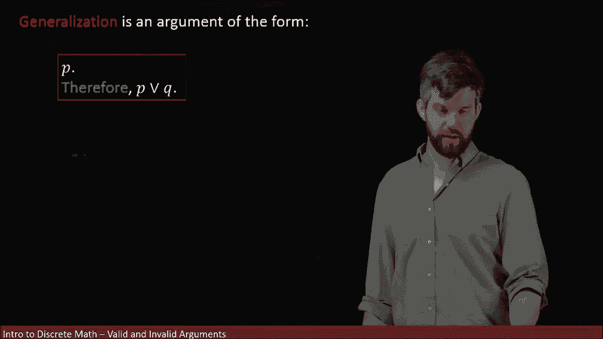
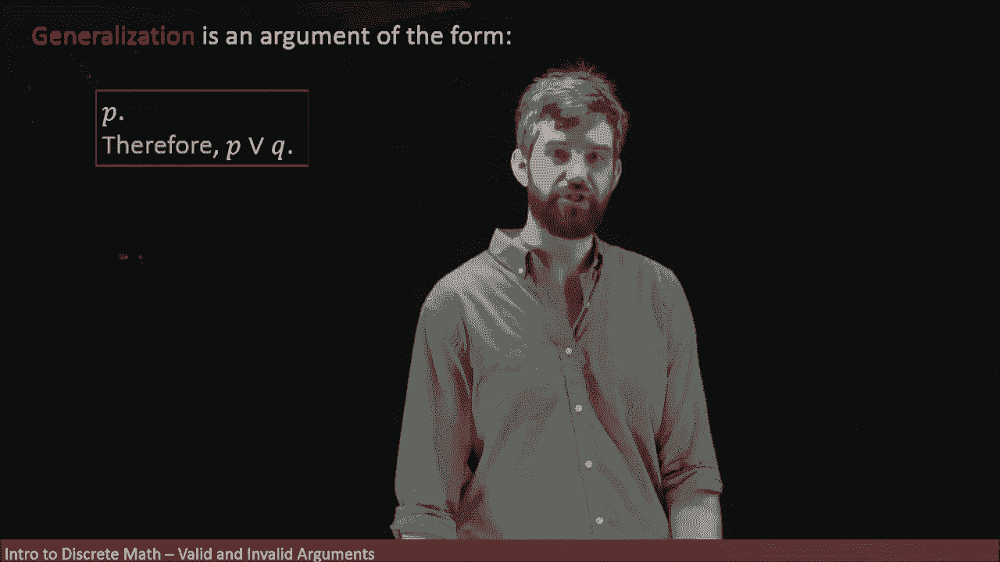
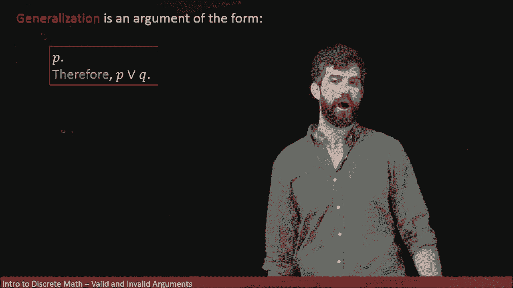
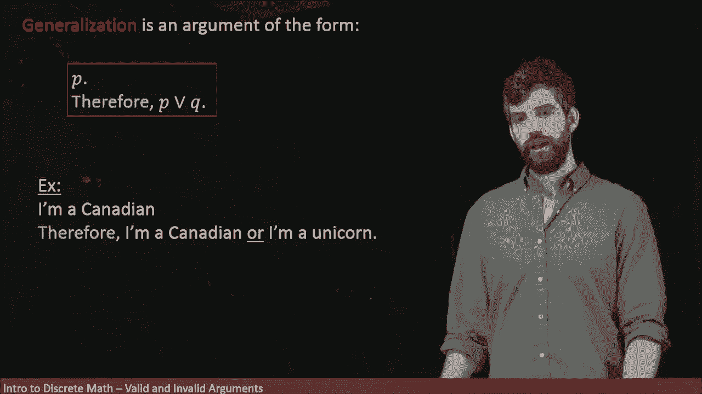
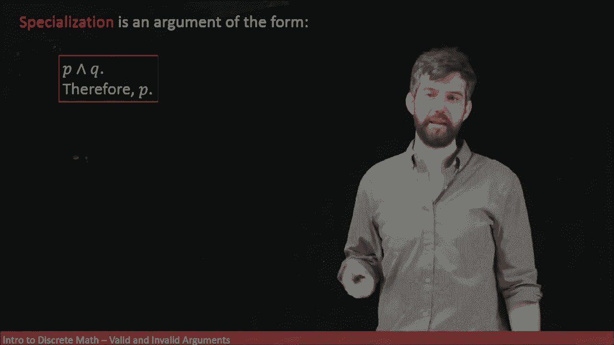
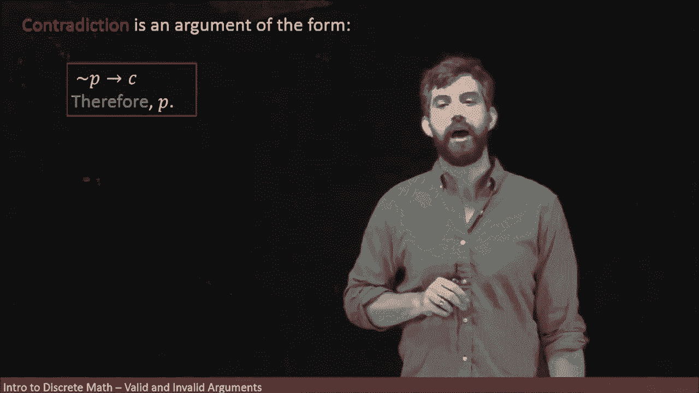
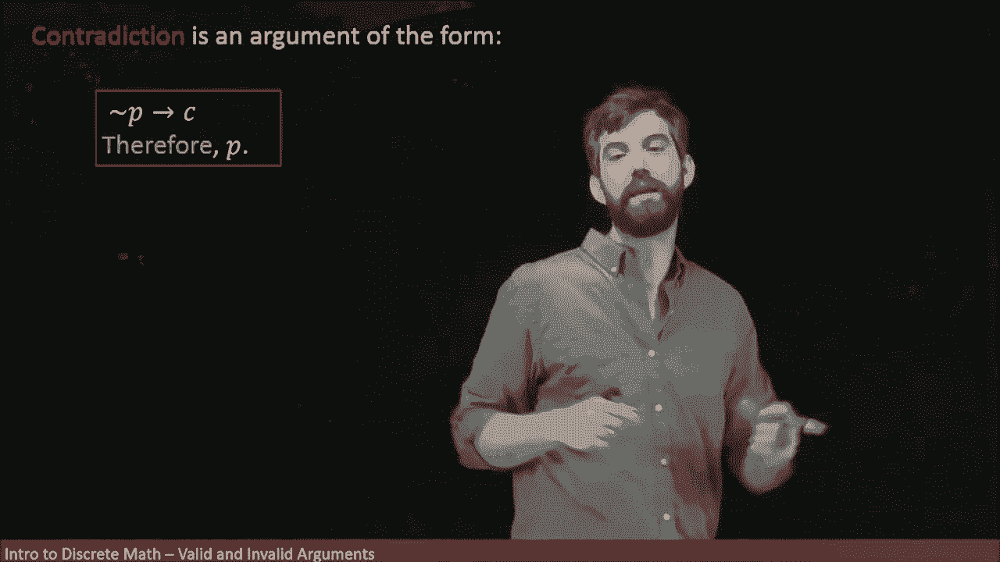
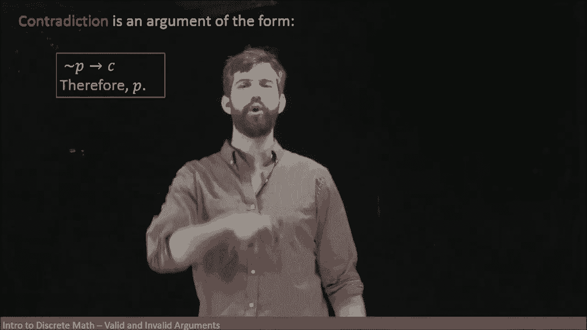
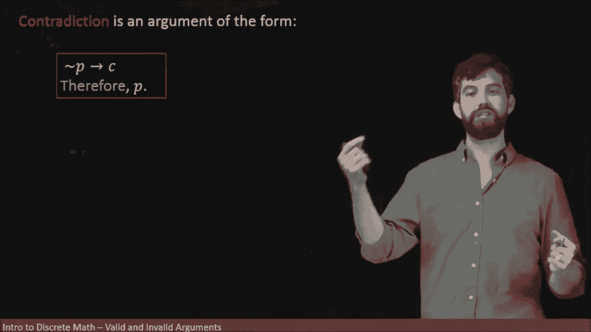

# 【双语字幕+资料下载】辛辛那提 MATH1071 ｜ 离散数学(2020·完整版) - P23：L23- Logical Argument Forms - Generalizations, Specialization, Contradiction - ShowMeAI - BV1Sq4y1K7tZ

The next argument form on our list is something referred to as generalization。

 and it is basically the idea that if I have some statement。

 I can always take that statement or another statement。 If the original is true。

 then that statement or something else is also gonna be true because an or statement only needs one So if I am any statement。

 P， I can generalize it to this larger statement， P or Q。 So for example。

 I said I'm a Canadian that's a statement P。 and I can therefore conclude that I am a Canadian or I am a unicorn one of those two things must be true。

 And indeed， because I am a Canadian， I am a Canadian portion of the I am Canadian or I am a unicorn part is true。

 And so this this whole disjunction， this whole or statement is going be true。

 And this says nothing about whether I am or am not a unicorn doesn't matter。

 I only need one of the two things。 I've got the Canadian part。 That's all I need。😡。

Sort of the opposite of generalization is specialization。If I have one statement。

And some other statement。 So in other words， I have I have both of the statements true at the same time。

 I might not care about both of them equally。 I have both of them， but I don't need both of them。

 I only care about one of them。 I can just get rid of the one I don't care about。

 and I'm left with just therefore， say P。😡。

So for example， if I say I'm a Canadian and I have a PhD。

 but where my argument about being the president of the United States。

 it didn't matter whether I had a PhD or not， that had nothing to do with it so while I have this statement I am a Canadian and I have a PhD。

 I'm going toss away the PhD portion of it and just specialize down to the statement I'm Canadian。

 which is needed。😡，Now both generalization and specialization are both sort of quite trivial and easy things in fact。

 in everyday language we use this all the time， but we don't use it in the explicit structure that I'm talking about here however。

 when we're trying to translate complicated long arguments to mathematics。

 we want to make sure that every single step is truly valid and so even for relatively simple steps like the generalization or this specialization。

 we want to make sure that we know that this is true。

 we could write down the truth tables for it if we really wanted to and therefore be completely confident that I'm not making any sort of mistake。

😡，A final one， a very， very important one in mathematics。

 one that we're going to be using a whole bunch is arguing by contradiction。

And the idea is this， I'm trying to prove his statement P。

What I do is I assume I take is my conditional， if not Pete。

 I assume that my statement is actually false， and I go along and I derive some sort of contradiction or for example。

 a contradiction might be something like zero is equal to one or I'm a mammal and I' am a reptile。

 something like this that just makes no sense at all。

So if assuming my statement was false leads me to this nonsensical contradiction。

 the contradiction that's always false。Then my initial statement must indeed be true。

 so this is the logical form of a contradiction， not P implies a contradiction。

 then my initial claim must be true。😡。

And I'm actually going to delay showing you an example of this until a later video。

