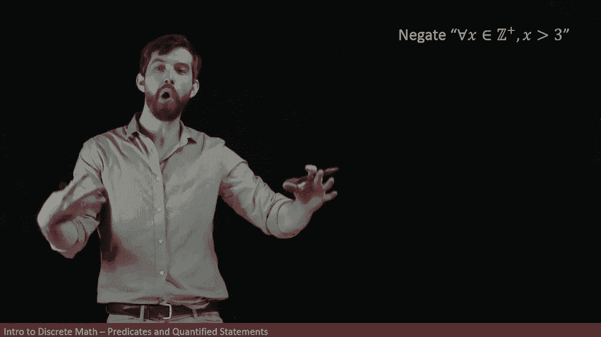
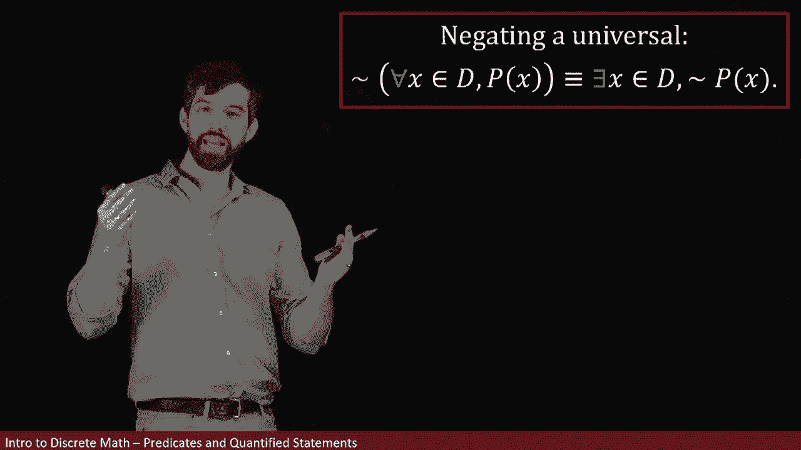
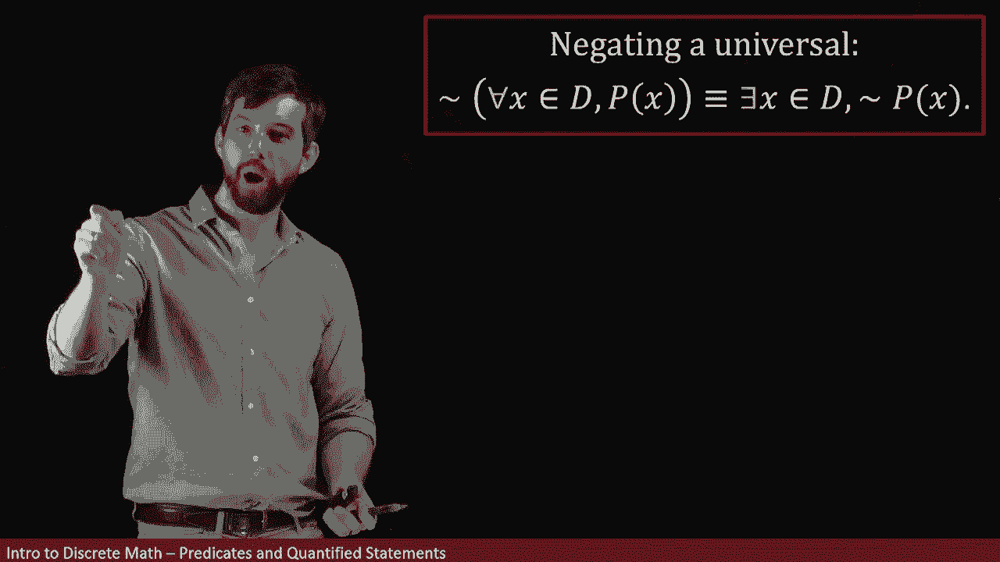

# 【双语字幕+资料下载】辛辛那提 MATH1071 ｜ 离散数学(2020·完整版) - P27：L27- Negating Universal and Existential Quantifiers - ShowMeAI - BV1Sq4y1K7tZ

In this video， we're going to investigate how to negate either a universal quantifier or an existential quantifier。

 Consider this particular mathematical statement。 We have a universal quantifier on the front。

 So for all X in the positive integers。 So every positive integer， you can imagine。😊。

Then X is going to be greater than3。 That's my predicate。 So if it's a positive integer。

 then it's going to be greater than3。

And what we're tasked with is to negate that particular statement。

But let's deal not with the negation first， let's just look at the statement itself and try to determine is it true or is it false。

 I think this statement is false and the reason is that there are three different numbers I can think of one。

 two and three and for all of those three different numbers they're not greater than three。

 there're less than or equal to three。

So when I think about the statement for every integer， every positive integer。

 x is greater than three， I think that that's false because I can think of a couple that are not greater than three。

So now that I know that my statement is false， let's turn to the negation。

 and if my statement is false， I should have that my negation is true。 Now。

 if I want to negate this statement。😡。

If the statement itself is false as I believe， then negating that statement will turn it into being true。

And I'm going to write the negation down in the same basic way that I argue the original statement was going to be false。

 namely， I found some x's in the positive integers， one， two， and three。

That had the property that they were less than three。

 in other words that they were not greater than three。

So in other words， I'm going to say it there exists because that's what I'm saying when there's a one。

 two， and three， I'm saying there exists various integers， so there exists x's。

They are living inside of the positive integers。

And they have the property that。

They are and Ill write it like this， they are not going to be greater than three in particular the ones that I'm claiming are one。

 two and three， those are the ones that are not strictly going to be bigger than three。

Or another way I could rewrite this。

As I could say there exists x is in the positive intes， I'm not changing that portion of it。

 but now what I'm going say instead of saying it's not the case that x is greater than3。

 I'll say that x is less than or equal to three。

And effectively， what's happened here is that if I've got some predicate P of x here， this is。

Not P of X。So notice what's happened， two different things， I think。

One was that I began with a for all symbol， and I twisted it around when I did the negation and it turned into a there exist。

And this should make sense to us if it is not the case that everything is true。

 there must be something where it's false。

So that was the first part， they for all changes into their exist。

 The next part is that I've got the x greater than3， that's just some predicate P of x。

And it's switched to not P of x， in other words， x less than or equal to 3 in this case。

So putting those two things together， here is my formal way that I negate a universal Now this looks complicated but bear with me for a moment。

First part is the knot sign that's sticking out the front。

 So what I'm saying is I am negating this whole statement that I have in the middle。😡。

So I'm negating the statement Now the statement itself is the typical way that I use the universal quantifier on a predicate。

 It says for all Xs in the domain， some property is true。

And then when we negate it， this has two different effects。

 The first is that the forall is going to switch to being there exists。

And the second is that the negation that we have out the front。

 it ends up hiding out in front of the predicate。

So in other words， if I am saying it is not the case。It is not the case that for all values。

 some property is true。 I'm saying there is at least one value where the property is false。

 That's what I mean when I negate a universal。 Now， let's look at the statement。

 someone in our class is taller than 7 feet。 And my goal is to negate that statement。

Well， I want to analyze what's going on here。 What are the different components of it。

 What kind of structure does it have。 And the first I note is that there's got this someone stuck out the front。

Saying someone is kind of an English way to bury a existential quantifier。 If I say someone。

 what I'm saying in effect is that there exists somebody。

So saying someone in our class is taller than seven feet means there exists somebody。

And they are going to be in our class， so I'm going to say that they're inside of D where D is going to be equal to our class。

And then。

This particular person has some property， I'm going to write it as。P of x。

 where the property P of x is equal to x is taller。Then seven feet。

So this English sentence has been phrased as this existential quantifier on a predicate with this particular domain and with this particular predicate。

All right， now I want to negate this sentence that I've done， I want to come out the front of it。

 that's my whole big mathematical sentence， and I want to negate it。😡，Now。

 if I'm saying that it is not the case that somebody is taller than seven feet。

 I'm saying that nobody is taller than seven feet。Or another way to say that is that everybody is shorter than seven feet。

So this is going to be what I claim is my negation。Everybody in our class is shorter than seven feet。

And if I analyze this sentence in the same manner that I just did。

 the everyone is a code word for saying for all。And then I'm saying for all people in our class。

 so for all X inside of our domain D， where D is our class as before。Then。

It's not in the case that they have the predicate P of x， they have the negation of that。

 they are not taller than seven feet one other words。Not。P of x。

So we have a similar property as before， where negating an existential results in the existential changing to a forall。

And the predicate turning to its negation。Or to summarize， it looks like this。

Here we are negating an existential。The there exists changes to a for all X and the the negation part ends up coming out in front of the predicate。

 in other words， if it is not the case that。There exists something with a property。

 then it means that every single thing in the domain does not have that property。

