# 【双语字幕+资料下载】辛辛那提 MATH1071 ｜ 离散数学(2020·完整版) - P28：L28- Negating Logical Statements with Multiple Quantifiers - ShowMeAI - BV1Sq4y1K7tZ

Consider the statement， every integer has a larger integer。

I think that there are actually two different quantifiers snuck in here。First of all。

 note that I've got the word every and and every should be a big sort of alarm bell that says we've got a for all。

 So if I want to translate this part of it， I'm going to say that for every X inside of the integer。

 that's what it means to say every integer。😡，But then we've got this property has a larger integer。

 and there's a couple different possibilities， one possibility might be that I just I just say that for all of x。

 p of x， where p of x is this whole property has a larger integer。😡。

But I'm actually going to break up this P of x and try to analyze its structure。

The claim that has a larger integer。Means that there is some other value out there， maybe a y。

That is going to be bigger than my ex。So in other words， if I start with some x over here。

 the claim that there's a larger integer is the claim that there exists， some other number。

 maybe I'll call it Y， there exists some other number that is bigger than x。

So instead of just putting a P of x and having as one property， I can expand that P of x like this。

 I can say that there exists some y， so some other integer。

 so this y is also going to live inside of the integers。That has the following property。

 the y is a larger number than x。Note that this entire thing that I've just written down here。

 I could still think of it as a property of X。Well。

 it's true that there is a Y inside of this because I've quantified my why and I says there exists a Y。

 you sort of have gotten rid of it and the answer still is the same every time I have an X。

 I feed it into this property and it's either true or false。

 either there is something which is bigger than it or there isn't something which is bigger than it。

By the way， this statement is indeed true。Why well。😡，If you take a specific x value。

 then how do you find a bigger one， what about just adding one to it right like if you choose 100。

 101 is bigger， if you choose a million， a million and one is bigger。

So because I'm claiming there exists a y to be true。

 I have to tell you what the y is I have to show you this is the one that exists。

 so you could just choose that your y was always equal to x plus one and because we're in the integers。

 x plus1 is always going to be in the integers， if x is going to be in the integers。All right。

 so now what I want to do is I've got this particular sentence and I want to try and negate it。

And one of the things that we saw before was that if I negate a universal。

 then what I'm going to do is switch the universal to an existential and then negate the preddicate。

 so that's what we did before， I'm going to take there existence X in the integer so that's what I'm doing I'm flipping the forral to a there exists。

😡，And then I'm going to write not P of x。😡，Because I'm negating this particular property。

But as we've seen， p of x is actually it a whole own thing。 So if I'm negating p of x， I could see。

 well， how does this apply to this larger predicate。 In other words。

 I can come down here and say there exists in X in the integers。 I'm copying that spot。

 But now what I want to do is negate all of this。 well。😡。

This predicate that I have first starts off with there exists a why such that some property。However。

 we know that when I negate an existential， it flips it to a universal and negates the property。

 so instead of having there exists a Y it flips and becomes for all y in the integers，And finally。

 it negates this final property they have y being greater than x is going to be not that as y is less than or equal to x。

So the statement is there's some number out there。Such that every single y is smaller than it。

But this is nonsense in this particular case， this claim down here is false。

 which is good because we thought that the original claim was true and a negation takes a true claim to a false one。

 and the reason I think it's false is there's just no number out there that's bigger than everything else if I'm in the integers。

 the indigers keep getting bigger forever， there is no biggest number which is how I would interpret this。

In this statement， we're saying some number in some domain that I have not specified here is going to be the largest。

Now the truth or falseness of this claim does depend on what the domain was right like if the domain is a finite set like  one。

2，3 then there is a largest number it's three if the domain was the positive integers。

 there is no largest number so whether this statement is true or false does depend on what the domain is but as long as the domain is specified and we understand it in context and this is a statement that's either true or false。

😡。

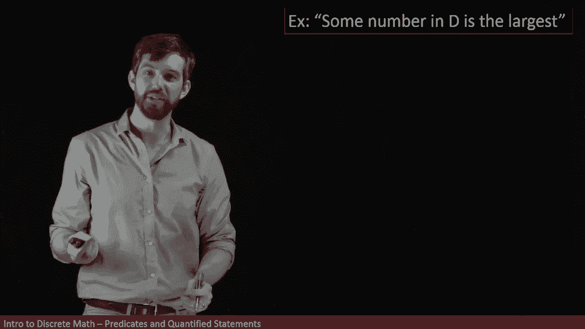

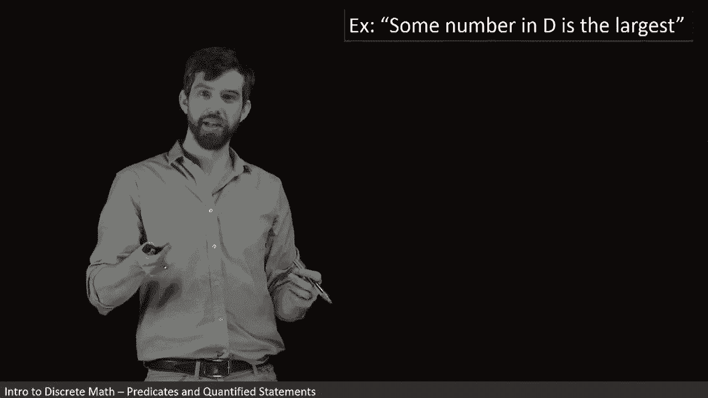

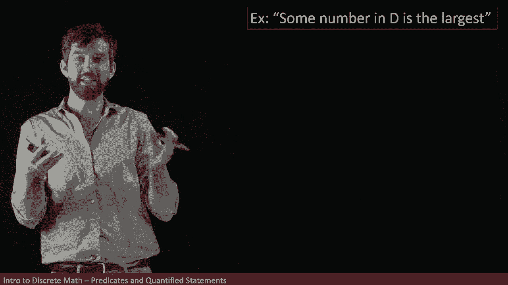

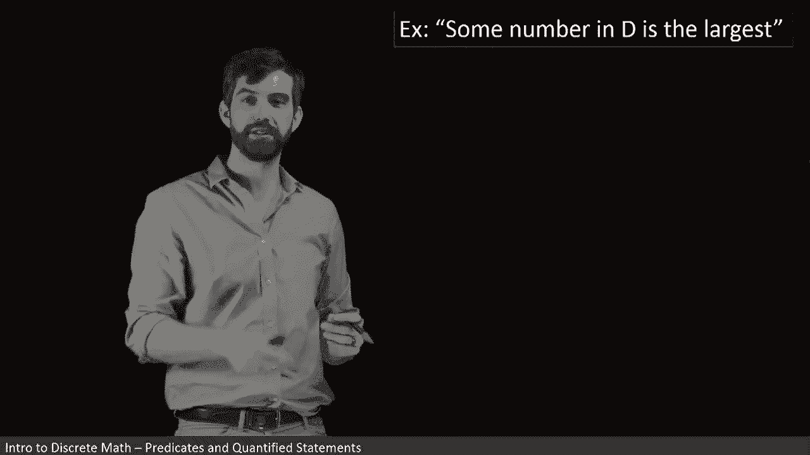

Now I want to try to break it out in terms of its quantifiers first of all。

 note that I've got some number。😡。

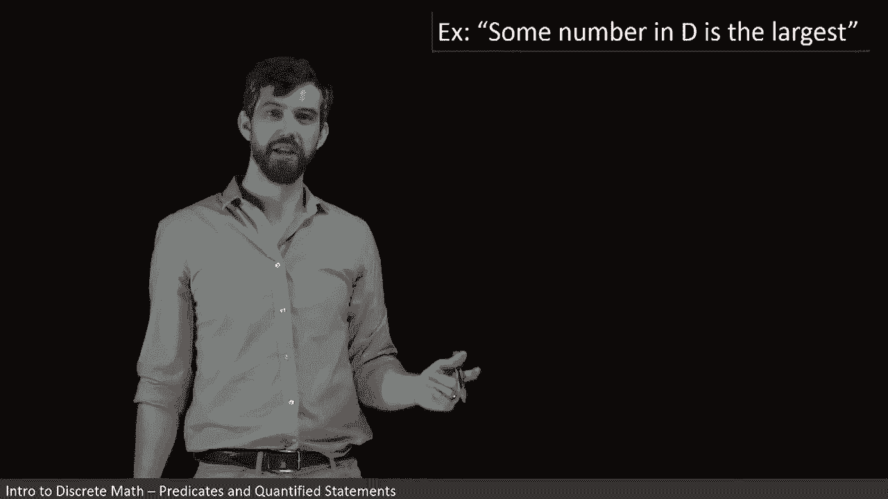

And sum number is a code word for there exists， say number。

 So I'm going to say here that there exists some X inside of the domain that's what I'm going to replace my sum number with。

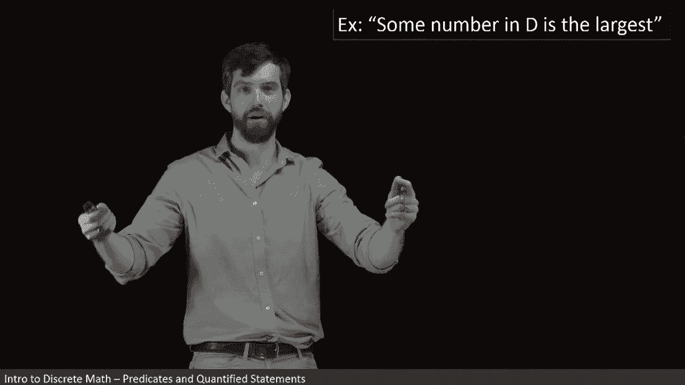

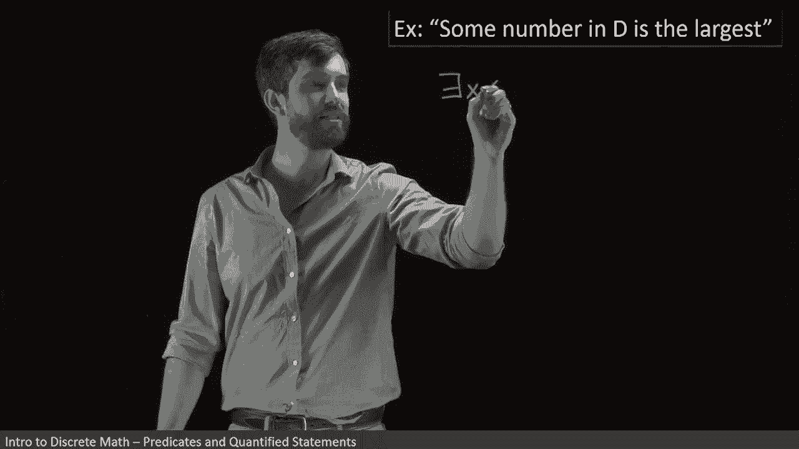

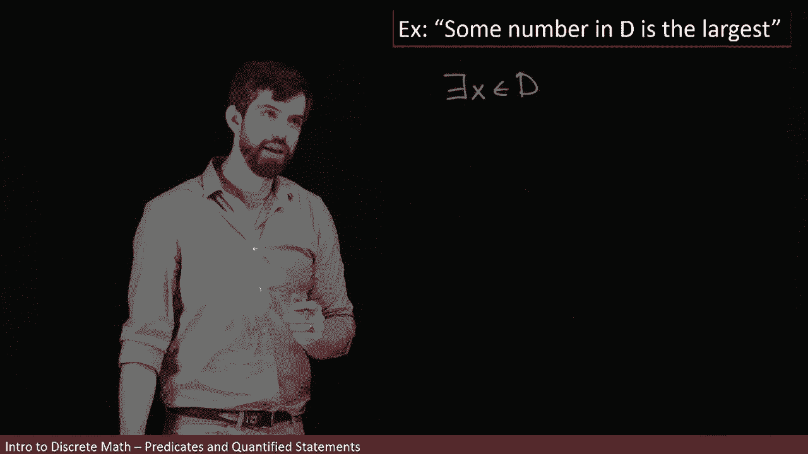

And at the first level of analysis， it's got some property。 It says is the largest number。

 So I could just call that a property P of X。

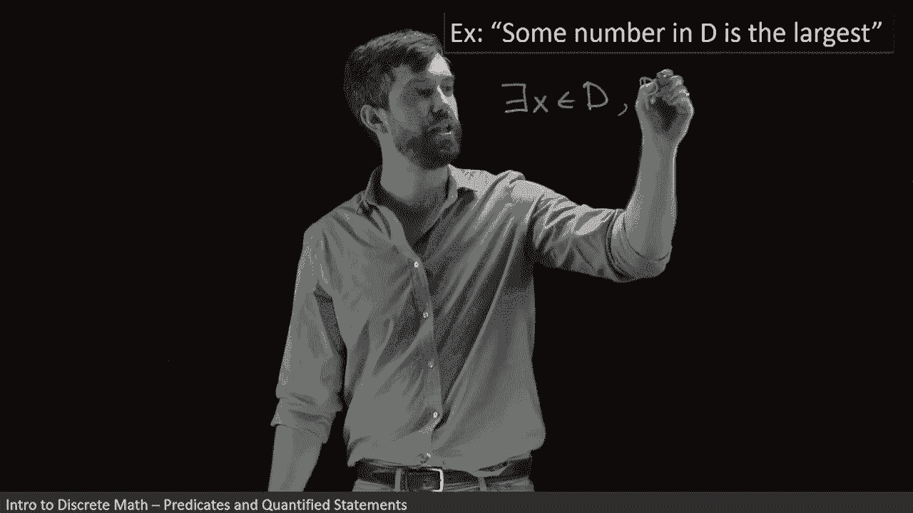

But as we've seen before， I could come down here and I could expand this out a little bit but I'm going to keep that there exists in the domain part。

 that's not changing， but I'm going to open up my predicate here。 If it's the largest number。

 then what it means is that that X is bigger than every other y。😡。

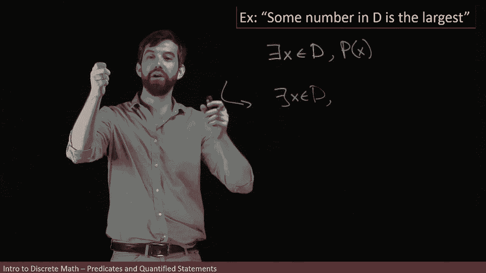

So in other words， for all Y， the x is bigger than it。So in other words。

 my predicate becomes a for all y inside of my domain as well， got to tell you where I'm living。

 so inside of my domain is's going to have the property that x is going to be greater than or equal to that value of y if x is the largest number。

 I'm leaving over the possibility that that there might be multiple ones that are both equal as the largest number。

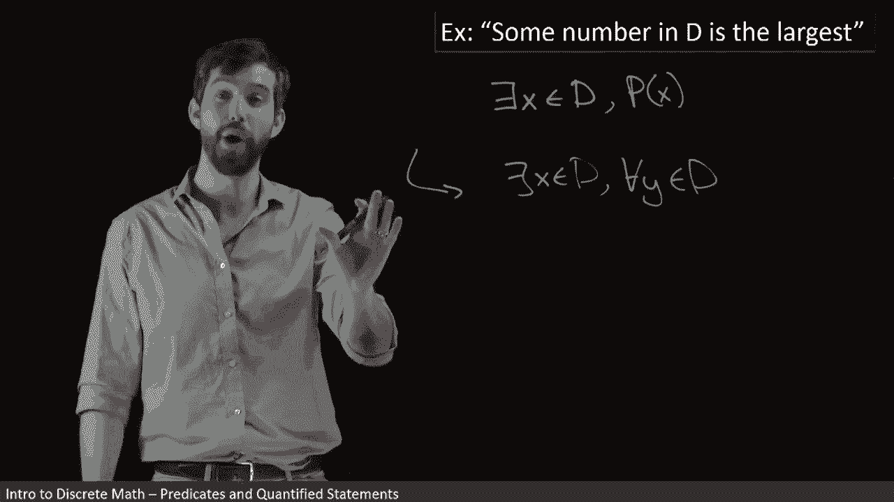

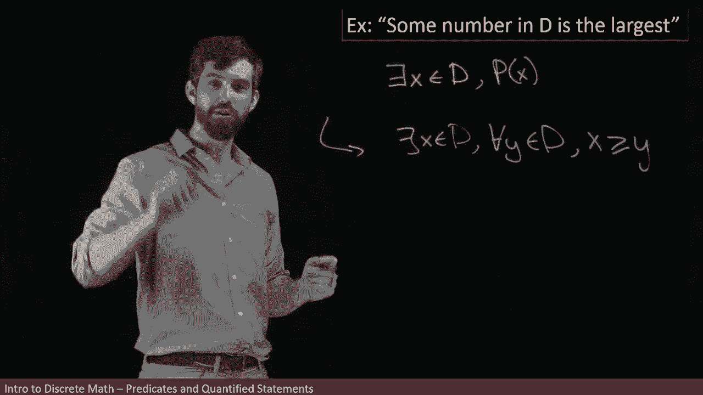

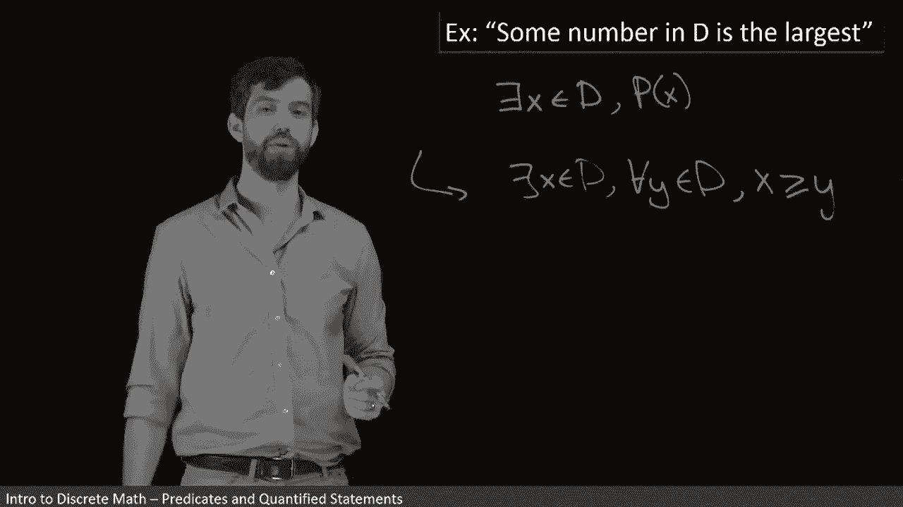

So this is how we can take these sentences and break them up in their logical form。

 there exists something in the domain， such that for everything else in the domain。

 the X is bigger than it。Now， let me suppose that I want to come through and I want to negate this。😡。

We know how effectively negation works by this point。 Every time I see if there exists or a for all。

 I just keep on flipping them down the line。 And at the final time。

 when I just get to a statement like X is greater than y， I negate that。

 So I'm going to say that this is going to become。

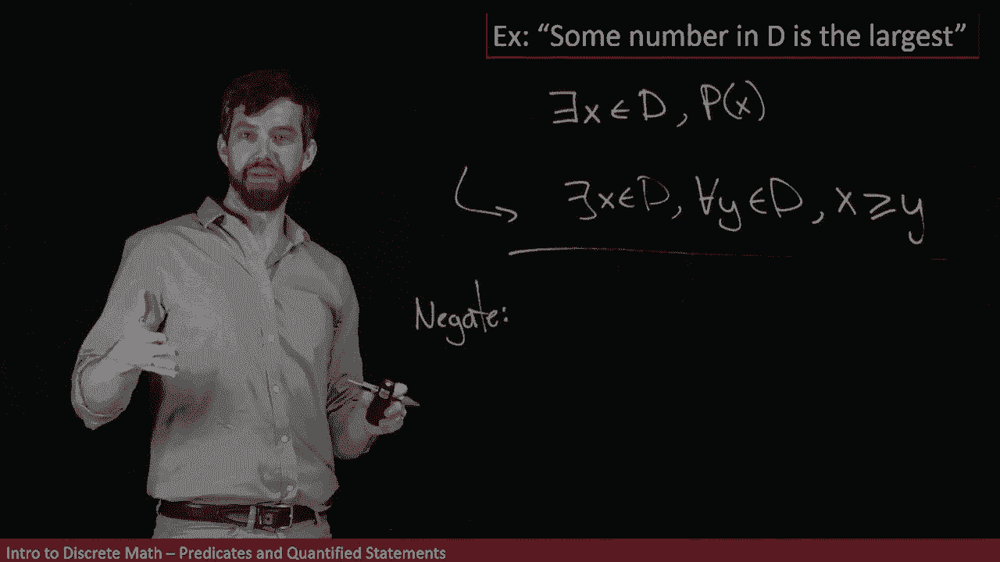

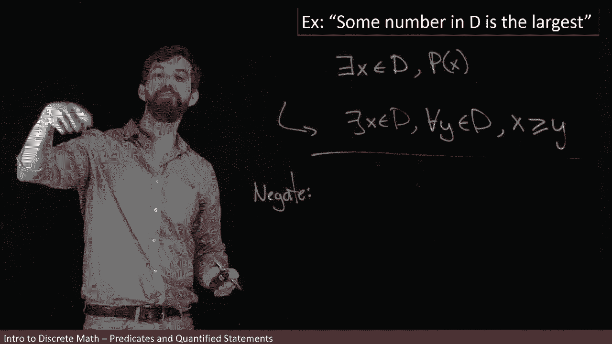

For all Xs in the domain， that was me flipping my dare exist。There exists a why inside of the domain。

 that was me flipping my for a why in the domain。Such that this final property is not that。

 so if it's not that x is greater than or equal to y， it says that x is going to be less than y。😡。

Or another way to say it is for every single number X that you can get into your domain。

 you can find a number or there exists some other number which is bigger than it。

 that would be negating my initial claim that some number is the largest。

 this is saying no matter what you choose， there's always a number which is bigger than it。😡。

So this example is precisely the opposite of the previous example。

 the only difference being that QI have an arbitrary set D opposed to the integers was specified in the previous example。

