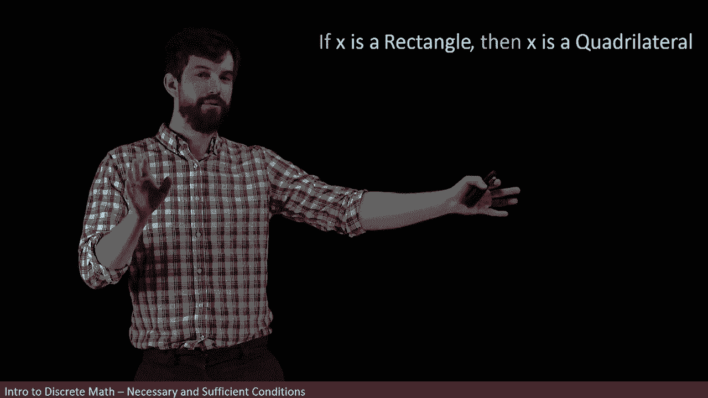
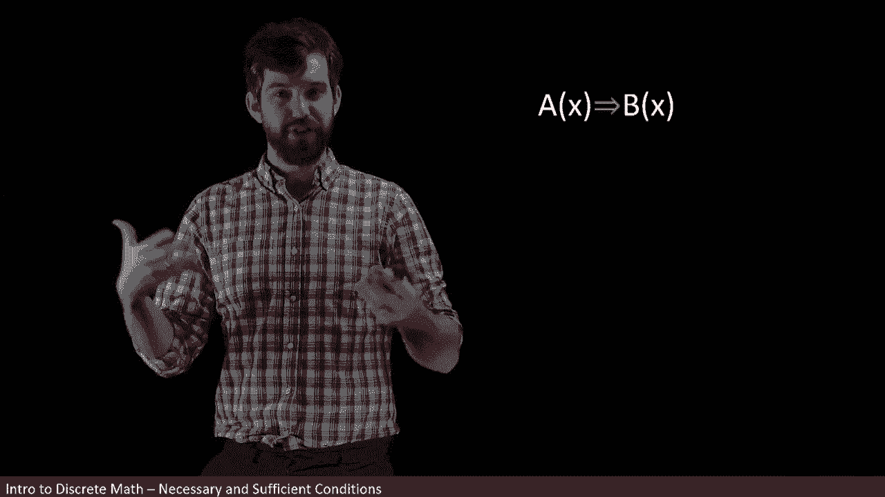

# 【双语字幕+资料下载】辛辛那提 MATH1071 ｜ 离散数学(2020·完整版) - P30：L30- Necessary and Sufficient Conditions - ShowMeAI - BV1Sq4y1K7tZ

In this video， we're going to talk about necessary and sufficient conditions。

Now the word necessary in the word sufficient we use all the time in just everyday English usage。

 but in this video we're going to analyze their precise mathematical meaning and they're going to be two of the most important kinds of logical conditions that we're going to see in mathematics so here's the idea look at these three different shapes squares rectangles and quadrilaterals and quadrilaterals are shapes that just have four sides but they don't nicely fit together the way squares and rectangles do。

If I was particularly interested in trying to deduce that what I was given was a rectangle。

 the question is， what does knowing that it's a square or knowing that it's a quadrilateral do to the fact that I want to deduce a rectangle？

So let's focus for a moment just on the squares and rectangles。

 because we know that there's a relationship between those two in particular。

 all squares are going to have to be rectangles。

And notice that this doesn't work the other way around。

 it's not the case that all rectangles are squares because some rectangles aren't squares。

 but all squares are indeed going to be rectangles。

We can also replace this sort of colloquial language of the all squares。

 a rectangles with a little bit more mathematically precise language saying if x is a square。

 then I get that x is going to be a rectangle， so this is writing it explicitly as a conditional statement。

Now the fact that we're talking about squares and rectangles here。

 this is just a specific example for this video， but the general logical structure we have is if some initial property。

 x is a square， but I'm going to call that a of x， then some final property B of x， in this case。

 x being a rectangle。

And the way I want to think about this is that。If I'm given the first thing。

It must be the case that I get the second， as in if I want to conclude the second。

 it is sufficient for me to conclude the first and so therefore I say that this is a sufficient condition and what I mean by this is that if I have the first one。

 I automatically get the second it is enough for me to know the first to be able to get the second。

Now it's worth noting here that there might be other ways I could get to the second without having the first。

 so for example， if I interpret the statement in our example， it's something like this。

X being a square， that's my a of x is sufficient to conclude that x is a rectangle。However。

 I don't have to have it being a square in order to get a rectangle。

 it could be something else but might still be a rectangle。

 so that's why I refer to it as being it is a sufficient property。

 but next we're going to have to turn to the idea of what is a necessary property that's going to deal with the other way around。

So let's go back to our picture with our square， our rectangle and our quadrirattle， and again。

 we're trying to conclude the middle one， we're trying to conclude the rectangle。

 but here I want to focus just on the rectangle and the quadraral。

Now we could have a relationship as we've seen before in particular we can say if it's a rectangle。

 then we get it be a quadrilateral and it's not true the other way around there are shapes that are foresightd that are quadrilaterals that are not rectangles So this again only works in the one direction The general form being expressed here can be written as if B of x remember from before B of x was the symbol we use for our rectangle then quadrilateral。

 which is a new thing I'm going put it then C of x So again it's another conditional another implication。

😡。

However， I want to do something a little bit tricky。

 I want to write this statement in its contrapoitive form and the way that a contrapositive worked is that you took the rectangle and the quadrilateral and then you switch their order。

The if x is and the then x' is part， that just remained where it was， but by switching the order。

 we also had to add in to knots。

So I'm claiming that this is the counterpoitive of what I had previously。

 and it says that if it's not a quadrilateral， then it's not a rectangle。

 and that's logically equivalent to saying if it's a rectangle， then it has to be a quadrilateral。

Now the logical structure here in its counterpositive form is going to look like this。

Remember， quadrilateral was the c of x， so we're saying if not c of x， then not B of x。

Now， here's what I think。

It is mandatory that I have my shape being a quadrilateral。

 if I ever hope to have it being a rectangle， I have to have it being a quadrilateral or another way of saying it is that it is necessary to have the property of C of x the second one in order for me to have b of x in the language of quadlaterals and rectangles that says it is necessary for it to be a quadrilateral in order to conclude that it's going to be a rectangle so let's go back to our three shapes and it's worth noting that again focusing on the rectangles。

 the thing I want to conclude that's what my hope is is that squares and quadrilaterals both had a relationship with rectangles。

 but a slightly different one for the square we said it was enough it was sufficient to have a square if we wanted to conclude that we had a rectangle。

😡。

But for the Quadrilateral case， it was necessary that we had this。

 so sufficient that we had a square， but didn't need it to be a square。

Mandatory or necessary that we have a quadrilateral， but in fact。

 we need more than just a quadrilateral in order to do that it's a rectangle。

And of course squares and rectangles and quadrilaterals here， this is just my specific example。

 we can make the more general case by having a nested chain one property implies the B of x。

 the b of x implies a third property C of x， and that anything that has this relationship。

 if we're interested in concluding the middle thing。

 the former one is going to be the sufficient condition。

 and the latter one is going to be the necessary one。😡。

Finally， I want to note that all of this crucially depended on my assertion that what we care about was that middle goal that we wanted to deuce the b of x or that we wanted to deduce that it was a rectangle。

If I just have one implication， a of x implies B of x。

Well， I can get both a necessary and a sufficient condition out of here。

 but it changes what my goal is so for instance。

The A of x， the first one is a sufficient condition to conclude the b of x that's what we've seen before but suppose my goal is not to deduce the b of x。

 suppose my goal is to deduce the a of x， then I could say that the b of x was a necessary condition for the a of x in other words。

 if I want to get the a of x I have to have the b of x that's necessary and if I want to get the b of x is just sufficient for me to have the a of x。

In a specific example with our squares and rectangles again， the first we've seen already。

 a square is a sufficient condition to be a rectangle。

 but let me suppose that now I want to deduce that it's a square in that case。

 what does a rectangle mean， well， having a rectangle is a necessary condition for being a square？

