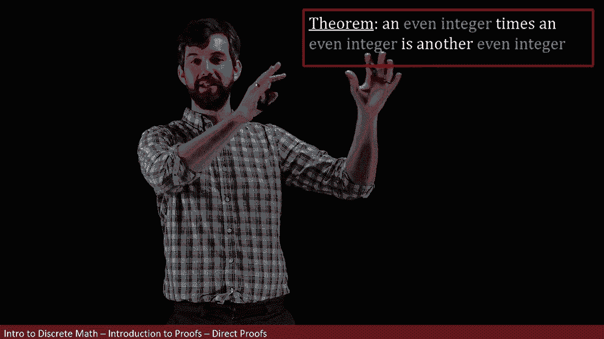
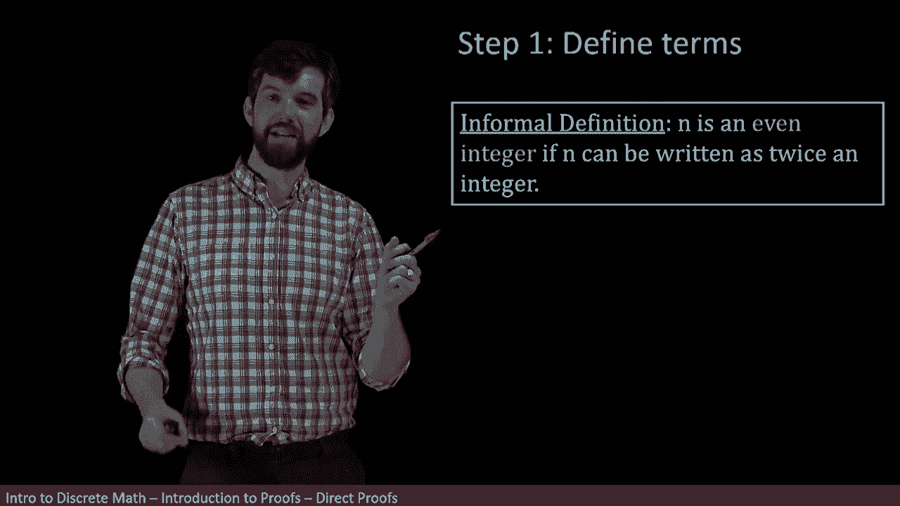
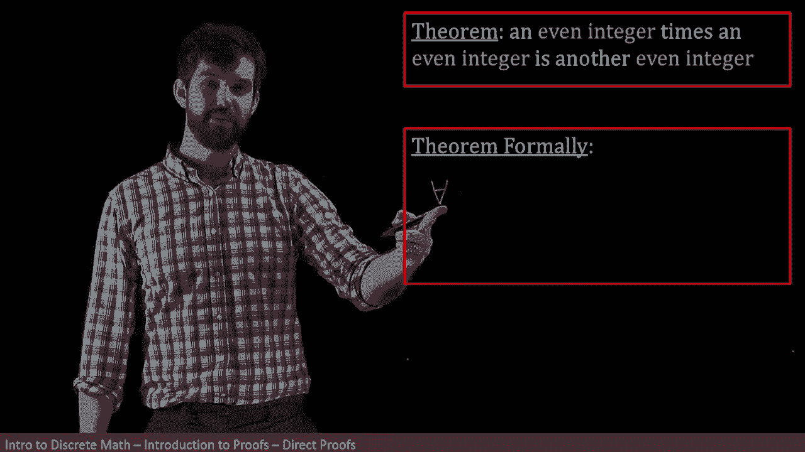
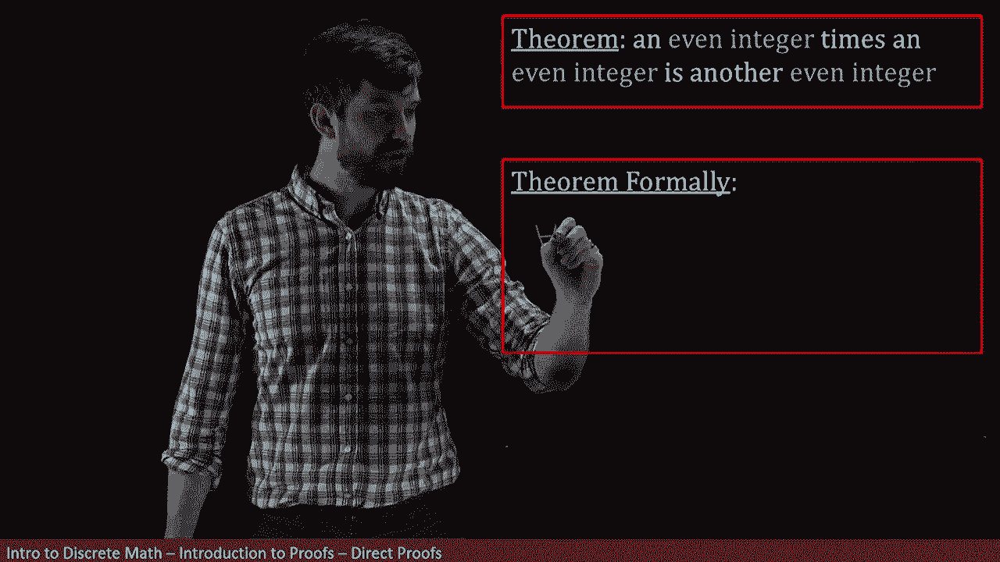
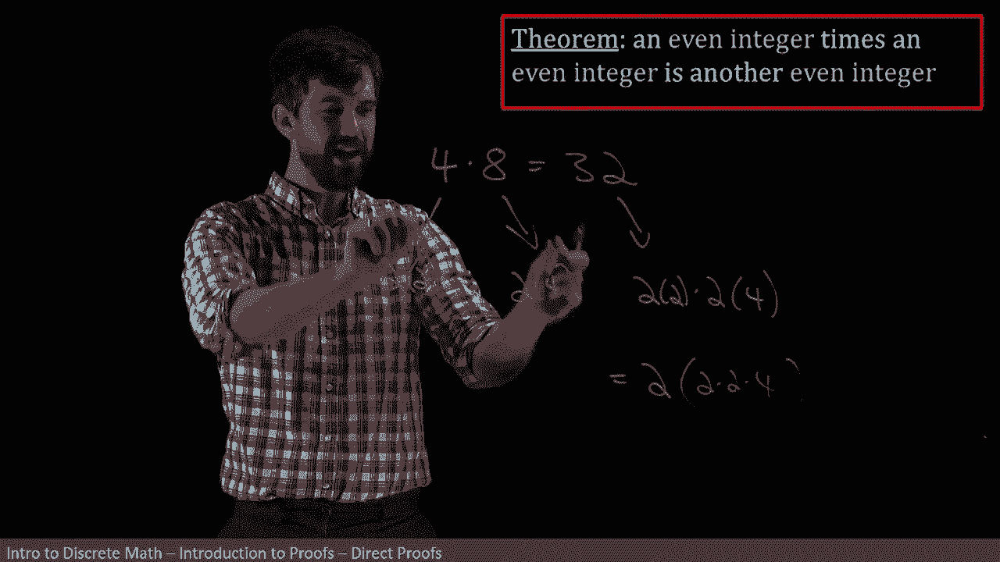
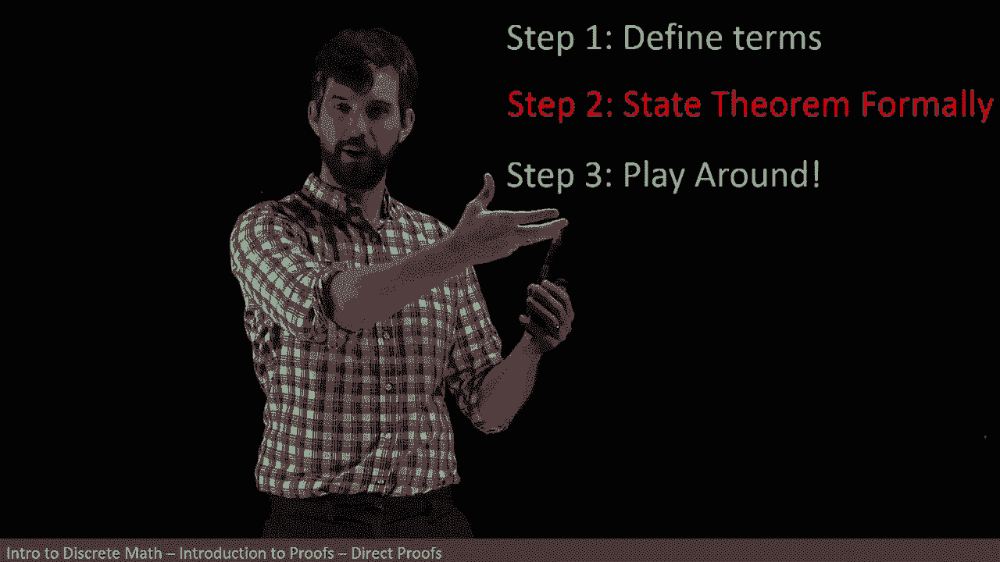

# 【双语字幕+资料下载】辛辛那提 MATH1071 ｜ 离散数学(2020·完整版) - P33：L33- Step-By-Step Guide to Proofs _ Ex - product of two evens is even - ShowMeAI - BV1Sq4y1K7tZ

In this video， we are going to prove a theorem it's a relatively straightforward theorem it says that if you have two different even integers and you multiply them together。

 then what you get out is going to be an even integer as well。😡。

But the real point of this video is not this particular theorem。

 but looking at how do we prove things， what is our process， what mental steps do I go through。

 and then even if I've managed to conclude for myself that my theorem is true。

 how do I present it in the right way in a way that is accepted and convincing and compelling for everyone else to read and follow along my proof？

Now step number one， I've got some theorem and notice that it's got a bunch of words in it。

 it's got even integer， even integer， even integer。

 those are the main things and as well as everything else sort of filler and connective tissue。

 but the main word that we need a definition for is the idea of an even integer。

We might be able to come up with an even integer definition relatively quickly。

 but for more complicated theorems， focusing very precisely on what it means for each of these words is going to be an almost necessary first step。

 so let's go back and before we even get to this theorem at all。

 let's investigate the idea of an even integer。

So my sort of informal definition of an even integer is that it's an even integer if it can be written as twice some other integer。

 so for example， like six is twice three or 12 is twice6 and so on。

 so if I can write my integer is twice some other integer。😡。

But I want to be even a little bit more mathematically precise with this particular definition。

 I want to use all of the fancy terminology that we've been developing in this course that has a lot of precision to it and will be very amenable to manipulating as we go on in our proof so I want to come up with a formal definition。

😡。

Now， notice that in my informal definition， what I have is n is an even integer if。

There's an existence claim snuck in here。 If there exists some number。

 such that twice that number is what I began with。 So that's what I want to notice it that inside of this informal definition is an existence claim。

 You are claiming it can be written in some way。 And I want to express that in my formal definition。

 So here's how I'm going to translate it。 I'm going to say that N。

 That's my integer under consideration。 And I'm going to say that n is an even integer。😡。

That's what I'm trying to claim and note that I'm now going to put the biconal symbol here and the reason I write this bi conditional arrow here is that all of these definitions work two different ways the definition of even is going to be this stuff I'm going to write down and then if you have this stuff I'm going to write down you're going to get even so all definitions are if and only of。

😡。

Anyways， I have any even and what do I want to claim， I want to claim that there exists something。

There exists some other integer such that your your n can be written as twice this integer that we're describing so I going to get a given name for it I'm going to say that there exists a P。

And I'm going to write it like this。 There exists a P inside of the integer。

 so there exists some other integer。

And then so that。

My n is equal to twice that other integer P and that is going to be my formal definition note that you have some leeway here。

 I chose to use the backwards E for there exists in the E symbol here for element of in the integers to have this sort of real shorthand for the larger English phrase there exists a number P in the integers。

😡。

If you prefer to write down the larger English phrase。

 there exists a P in the integers instead of my mathematical shorthand， I have no objection to that。

 I just like being efficient on the board。😡。

Allright， so back to our theorem。 So now we know what an even integer is and if we need to go in forward。

 we can always go back and recall that。 But my next point is that my theorem that I have written down here is written a little bit informally。

 and I want to I want to clean it up a little bit。 I want to say it in a little bit more of a precise manner。

 So I want to describe what my theorem says formally。😡。

The first thing I want you to know is that there's sort of a hidden universal in my informal presentation of this theorem。

It says an even integer times an even integer is another even integer。

But implicit in the way I phrase this is the claim every single time I find those pairs of integers that are both even every single time。

 then their product is going to be an integer。

So hidden inside of this is a for all claim and so I'm going to write that down first。

 I'm going to claim that。

For all my upside down a for every and and notice it's an all claim about two different numbers。

 It's every time I have two different numbers that are even。 So for all M and N。

They're going to begin as just generic integers。

Then I'm going to have that。If my M and N are even。

That this is going to lead me to conclude that their product is going to be even as well。

Then the product， M times n。

Is also going to be even。

So the key thing in my formal statement of my theorem here is is to note that。

It says for every time I take a pair of integers。

If those pairs of integers that I get are both even， then they're product even as well。 All right。

 so what we've done so far was step one， we formally defined the different terms in our theorem and then step two。

 we took our theorem and we formally wrote it with all of our notational shorthands of the foralls but most importantly have formally written it in this very precise way that is going to be amenable to manipulating and dedducing our theorem。

I also want to note that this theorem that we've stated here is in a very common form that a large swath of theorems are going to be in particular。

 the format of it effectively is for all things in some domain in this particular case。

 the things were pairs of numbers both in the integers。

 but for all things in some domain if you have an initial property they're even then you get some other property in this case that their product is even as well。

 So this format that we have for sitting in a theorem is going to be one of the major sort of classes of how theorems are going to be presented。

 Of course， the domain and the initial predicate and the final predicate。

 all of those are going to change from theorem to theorem but this logical structure is pretty common All right so what's next So let's go back to our theorem and I'm going to leave it actually in its colloquial form which have here。

 I can bring in its formal definition when and if I need it。

 but I like it phrased in this convenient。

We。And remember， what we want to do is we want to write down some formal proof of this that is going to convince everybody that yes indeed。

 this theorem is valid， however， notice that I write this as step four。

Because being able to jump immediately to a crystal clear perfect proof is for most cases。

 a step too far。 In fact， what we want to do is step3。

 which is the most important step of them all and that's a step that I like to call playing around and this is where we try to get some sense for ourselves。

 not a formal proof， but why do we think a serum is true， Can I write down a few examples。

 can I do some algebraic manipulations， Can I get some sense of why it is that this thing is actually true And once I have an idea for myself then I actually can go back and fill it in precisely So it's important that I'm able to do this。

 it's important that I'm able to come up with some sort of intuitive idea。

 All right so let me just choose a couple different numbers here。

 how about four times8 just to sort of get the ball going。

And then if I think about what's going on here， we're going to have some particular product in this case it's going to be 32。

 and I know that four was even and eight was even and 32 was even。

 so at least I haven't just provenrun myself right off the bat。

But then if I think about the four， our definition of an even integer。

 why do I think four is an even integer， well it's because it's twice some other number in this case it's twice two and the reason why I think that eight here is an even integer is it's twice four。

So that's the reason why I think that both four and eight are an even in over they're divisible by two or they can be written in this matter two times this times this。

So then if I go down to my 32， which is the product to these two things， it's like， okay。

 it's twice two。

Multiplily by twice4。

All right。And then if I look at this， the way I think about this is you know。

 there's like a two there， and that's what we want it for it to be even right。

 we want it to be two times a bunch of other stuff。

 This is like two times a bunch of other stuff in this case， two times two times four。

So I think that that works， 32 is an even in jerk that's written as twice times bh。

 and the bh all came about because it sort of broke up my foreign aid and I applied their definition and I put them together。

So this is sort of my intuitive picture here， I can kind of imagine that the four and the8 don't really matter。

 it could be any M and N here and I could get any values out of this and then when you multiply them together。

 I think it should work I'm 100% sure yet， but I think it should work that you just sort of get the one two that came maybe from the first one and everything else gets lumped together。

All right， so that's my tentative intuitive picture why I think maybe this is going to be true。

 but let's see whether we can formalize this properly with all of our precise definitions and fill out an actual proof。

All right， so here we are， step four， we're going to be trying to prove this claim。

And I want to note that the proof that we're going to have here is going to fit a relatively standard format。

 and in fact we don't really necessarily care about this particular theorem。

 although that's what we're going to use to illustrate the point。

 but the format is going to be quite constant。😡。

Indeed， one of the first things that we're going to want to do is we want to write down whatever our assumptions are going to be that's how we're going to start our proof we say。

 well what do we know for sure in this case we know that we have two different even integers。

 that's what we know。

And then we want to apply our definitions， okay， you've got two even integers， so what。

 what does that mean， and then we had that really formal definition of what it meant to have two different even integers。

😡。

And then in the middle， this is the part that really changes and varies from proof to proof is we got to do our playing around。

 this is where we use algebra where we use logical implications。

 where we use facts that we've proven previously or that we've looked up somewhere this is where we do all of our manipulations and we try to take these starting assumptions that have been precisely written with their definitions and keep on massaging them using all these different tools until it looks like our conclusion All right。

 so that's the basic structure that I'm going to be trying to put in place when I do my proof。

I also want to note that I can bring over at any point， my formal definition。

 or I could bring over at any point， my formal statement of my theorems that I have these here if and when I need them。

 all right， so first up was to state what our assumptions are going to be and in this case the standard of assumptions is that we are going to begin with M and N being an even integer。

😡。

So this is my first line of my proof， suppose M&N are even ins。

Maybe the one thing I want to note about this line is that this line that I have here。

 suppose M and N or even integers is I'm choosing my M&N completely arbitrarily。

In fact， this is the same thing as saying for all M&N if I just choose any arbitrary pair prove it for an arbitrary pair。

 I've proved it for everything， so that's what I'm doing。

 I'm supposing that I've got two even integers and I'm giving them some labels M&N。

Now we next up we want to figure out how we apply our definition so even integers meant specific things so in this case because they are both even it meant that we got two other numbers and I'm going call these other numbers R and s so I'm going to say that there exists an R and an s so that。

😡。

The M is twice R and the n is twice S。 So this statement heres me applying my definition of an even integer to the two even integers that I have。

 the M and the n。Next up， I want to do some algebraic manipulations。We're trying to get to M times n。

 right， That's what our goal is。 And we want to show that M times n is an even integer。

So maybe my first step is just to say， well look I've got my M times n。

 let's substitute in the 2 R and the 2S that I have for the M and the n and I can write it down this way。

 so I've substituted in the values that I have for my definition。

 I've related M and N to twice R times twice S。😡，Next up is the little bit of algebraic manipulation that we saw previously when we were just sort of playing around and seeing what might be true。

 I've got one two inside of here， so let's pull that out the front and just leave everything else sort of hang behind it so I'm writing this as two of2 RS this property by the way is referred to as associivity I also move one of the twos around。

But these are properties that we know to be true from numbers that we can change our brackets around and we can reorder things that's perfectly fine。

All right， so what have we got？We've got that the M times n is indeed going to be written as twice something。

But I need to really lock out my little proof here that twice something something should be given a specific name and noted that it is an integer。

 so that's what I'm going to do next I'm going to say let t equal the2 RS like all this stuff over here be given a name and it is an integer。

And the reason why this is important is that。The the T that we have。

 that was our existence claim remember when we talked about our definition of it being an even integer。

 there existed something in the integers so that whatever you had was twice it。

That's precisely that statement， there exists a T so that the product is twice that and the definition of this is that my MN is an even integer。

 and so I write thus MN is an even integer。😡，And then I finish off my proof by loaded putting this little squared symbol here that stands for QED。

 and we put that at the end of our proofs to be likevoa。

 we have successfully proven what we set out to prove。Now， in this formal proof。

 which I believe is convincing and now that people who read this。

 they can apply it and agree that yes， indeed， the product to even integers is an even integer。

 and this structure that we have has a couple different key components that I want to identify。First。

 I want you to look at the first and last lines。Well， notice if I read them together。

 suppose M and n are an even integer， thus M times n is even。So in other words。

 what I have by reading the first and the last lines together is the statement of my theorem and that's the way that it's supposed to work。

 you start by assuming the P of x and you get out the Q of x。

 you start by your assumptions and you get your conclusion and then if you read the beginning and end of your proof together。

 it should be the statement of your theorem。All right， next up， I want to talk about definitions。

 we use this a couple times， notice that the first one is right here in the second line and down in the second to last line。

 I'm taking the formal definition of even and I'm applying it at both ends。

And it makes sense that I'm applying it at both end because in my statement。

 I begin with a claim about two even integers， and then I deduce a claim about even integers。

 So if I split that up to the start of the beginning。

 I sort of go in one level of applying the definitions right at the beginning and right before the end。

😡，And then the stuff in the middle here， this is going to be my manipulations and in this in general could be all sorts of different things。

 in this case I had little substitution a little bit of sociativity。

 a little bit of algebra to manipulate what I had in my assumptions into a form that looked like my conclusions。

So this is the general strategy that I use when trying to prove things。

 and maybe we can summarize it like this。 Step one， define our terms， that's what we did。

 we defined our even terms， step two， state our theorem formally。

 so we know exactly what it is that we're trying to say。

Then this is the most important part， step three， this is my plane around。

 this is me trying to figure out how do I know this ethereem is true， like what's the key step。

 what am I going to put into my formal proof？

But the way you could do step three even earlier than this。

 maybe you don't want to formally define things you want to do your playing around ahead of time。

 that's also okay， although I will caution， it's often helpful。

 at least when we're starting out here to go through this process of really formally defining what it is that I'm trying to stay that will help inform my plane around。

 but if you want to do some playing around at the beginning and then some precise statements that maybe a little bit more plane around。

 knock yourself out that sounds wonderful and then finally we're going go and do our formal proof where we start with our assumptions。

 we apply some definitions we do our manipulations and our quoting of prior theorems and finally we get to our conclusion。

