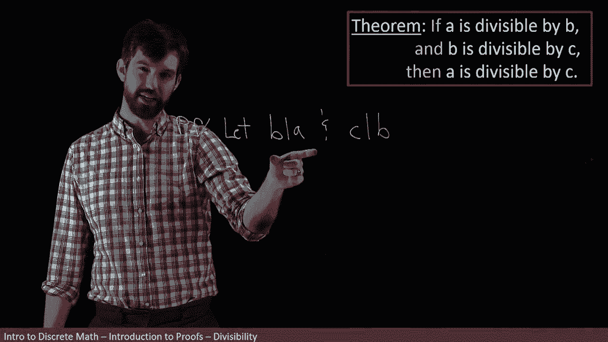

# 【双语字幕+资料下载】辛辛那提 MATH1071 ｜ 离散数学(2020·完整版) - P35：L35- Proving that divisibility is transitive - ShowMeAI - BV1Sq4y1K7tZ

In this video， we're going to investigate the idea of divisibility。

 and then we're going to use that concept to prove various claims about divisibility。

 and it's going to help develop some of our proof skills。

So first of all， let's sort of get an intuitive idea of what's going on with divisibility。

 Let me take a number with lots of factors to it。 How about the number 12。

Then one thing I might say is this 12 is divisible。

By well， 12 is divisible by all kinds of things， I have about three。

En。

What I'm sort of meaning here is that if I take 12。

And I divide it by three， then I get the number four， and that four is inside of the integers。

Or if I want to sort of rearrange it， I can say that 12 is equal to three multiplied by four where this four is again something that's inside of the integers that's sort of what I mean by divisibility。

😡。

Or is a different example， I could say that 12。

Is not divisible。By5 okay and what I mean by that is that if I take 12 divided by 5， well。

 if I put that into my calculator here， this is going to be like some weird decimal。

 So for sure it's not going to be inside of the integer。 So I write not inside of the integers。

Or other way to say it is that。My 12 is not equal to five times some value P where P here is an element。

Of the integers。

Okay， so that's sort of my informal sense of divisibility。

 you have a number and you divide it out by something and then when you divide that out by something。

 it's either going to be an integer or it's not and that tells whether it's divisible or whether it's not。

I actually really like the bottom way of writing it。

 I like saying that 12 is divisible by three means I can write 12 as three times four Now let's try to be a bit more precise about this。

Because we're dealing with attempts to make all of our concepts that even if we've seen them for many years。

 we want to make them as precise as possible。

Note that there is an existential claim here when I say 12 is divisal by3。

 what I means is that there exists in integer4， there exists an integer4 that has this property that 12 is equal to three times 4 or alternatively 12 divided by 3 is equal to 4。

So I'm really claiming an existential， there exists this other integer that has this particular property。

So my formal definition is I've got a pair of numbers like 12 and three。

As long as that second one was not zero， I had to sort of put that in my condition。

 I'm beginning with integer， we're not talking about rationals and that the divisor here is not zero。

Then I'm going to mean this claim， which is n iss divisible by D， if I can find some other number。

 it's like the four I found before， if I can find some other number that is an integer and has the property that your end can be written as the divisor times that new integer。

And know carefully this little bit of notation， that's really what I'm defining this says D divides n and there's a whole bunch of different ways that we can say this in English the D divides n is the way that I like or you can do n is divisible by D or n as a multiple of D or D is a factor of n or D is a divisor of n there's a whole bunch of different possible ways that you might be familiar with it。

 but what I want you to be really clear about is that。

The order of the D in the N really matters， and depending on which way you phrase it。

 you might have different orders。

So when I use this symbol， which is my shorthand， I read it as D divides n and I mean it' something along the lines of three divides 12。

 so the big one is your n and goes on the right and the small one is your D and goes on the left that's what I mean when3 divides n。

But the way I just phrased it before was it was the big one came first， the 12 is Divisionisal ID。

 or the 12 is a multiple of three。

Or I can flip it back around again and say that my three is a factor of the 12 there's all these different ways to say it and the order matters。

 so just try to keep those clear in your head。

All right， so now I have a new theorem to prove it says。

If a is divisible by B。

And B is divisible by C。Then the A is divisible by C as well， something like that。

And if you want to， you could formally rewrite this using our notation。

 I'll say this is saying that my B divides A， my C divides B and so forth， my C divides A。

 but I don't know I kind of actually personally like it written in a slightly longer form。

 I don't mind whether you use a shorthand or not， and then we know that any point if we need to。

 we can bring out that formal definition that we are just talking about what does it mean to say that one thing is divisible by another。

😡。

And if I'm going to sort of think about how this is working， okay。

 I know that four is a divisor or four divides that number 12。

And then I also know that two divides the number four。

And indeed， it's for sure the case that two divides the number 12。

So I've only just done one example here， but I just want to illustrate that， yes。

 my intuition is indeed matched for this example。

All right， so let's go and try to write out。Our proof。

First step is to state what our assumptions are。

So let us have it be the case， so I'm going to suppose or let。

That indeed， it is true that B divides a。

And that C divides B。

So that's the translation of my statement， my if is one thing and another， right。

 my if is a conjunction， it's an and statement of two things that I've written down here in their shorthand。

Now our next step is going to be to take these shorthands and apply for us that formal definition that we had。

 namely， we need to say that there exists this other number。

Such that what we have can be written in this particular way。

Okay， so let's give some names for them。 How about S and T， those can be my other numbers。

 So in other words， for both of these two different components of my hypothesis。

I have to go and make an existential claim about some other number and maybe we'll call them S and T。

 So in other words， I am claiming that there exists an S and a T。😡。

That have the nice property such that your A is equal to S times B。

And that your B is equal to T times C。So that's my claim。So I think I've stated my assumptions。

And then I have applied that definition to my assumptions and rewritten them in this way。

 maybe the only final thing I'll note is that the S&T。

 those are both need to be integers if I want to do it precisely。

All right， so I've written down my assumptions and I've used my formal definitions to translate them。

 and now I need to do some sort of manipulations that get me to my conclusion。

However， I don't actually think I've done quite enough of the plane around that I'm quite convinced as to what I'm supposed to do next。

 so maybe I'm going to go off on the side for a little bit， it's not part of my formal proof。

 but I'm going just do some computations see if I can figure out what's going on here because what I want to conclude。

😡。

Is that A is divisible by C， so really what I want to get。

At some point is I want to get that my A is equal to what I've used up ST， let's go up to U here。

 I want to have that my A is equal to C times u for U being some other integer。

So that's kind of what I'm hoping for and then if I look at what I have。

 so that's what I want to have， but what I do know is that my a what do I know about a oh here it's an expression about A A is equal to S times B。

 so a is equal to S times B。😡。

And then I know something about the B here， right I know that the B is equal to the TC。

 so B is equal to TC， and I have to put my s out the front here， So a is therefore equal to S TC。

 In other words， it's equal to C times some other stuff and oh look at that that other stuff S times TS T were both integers。

 that's gonna to be an integer as well。😡。

Okay， so I think I've got enough here my manipulation that I can continue my proof。

 maybe I'll leave the purple there for a moment to look at if I need to。

So now I'm going to continue my proof and I'm going to say then， allright。

 I want to get that my A is equal to this。 So let's do that manipulation。

 Then the A is equal to the S B。 It's what I just had。Which is equal to the S times。TC。

 that was me substituteutd in right there。Which is the same thing as saying C times ST。

 I've just rearranged the order， these are numbers， I'm allowed to do that rearranging of order。

In other words， what I claimed is that a is equal to C times S。

 where the S is for sure inside of the integers。 It is something as label as S。

 but it's an integer because both an S individually were and the product of two integers is again。

 an integer。 So what can I can claim。😡，Therefore， my final conclusion is that C doesnt D divide A。

 and that was what I wanted to get over here， A is divisible by C， C divide A means the same thing。

And then I got rid of my scrap work that I had up here that was for me it was part of my computation。

 wasn part of my proof， I've reproduced it in the right way down here in my proof。

 and I have this really nice fact that you can chain up divisibility in this way。

 and this serumem is sometimes referred to as transitivity of divisibility。😡。

