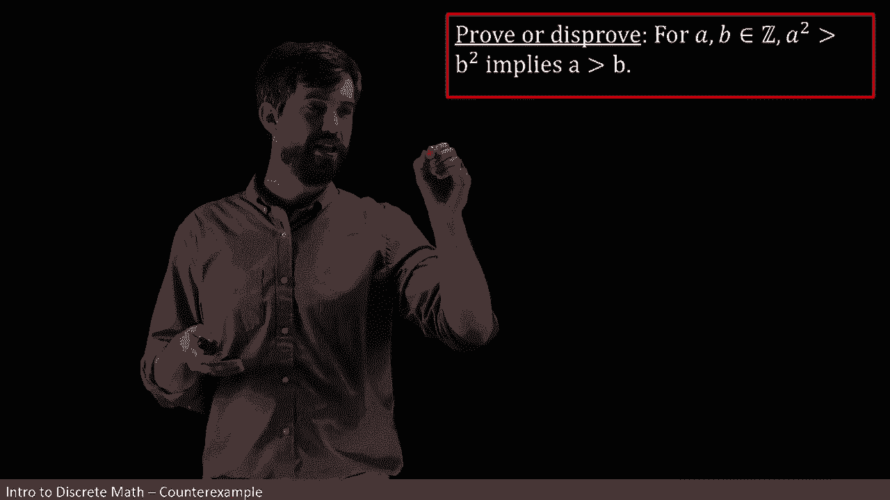
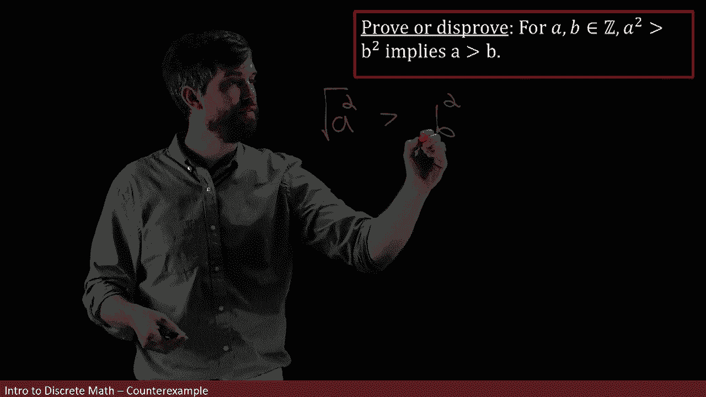
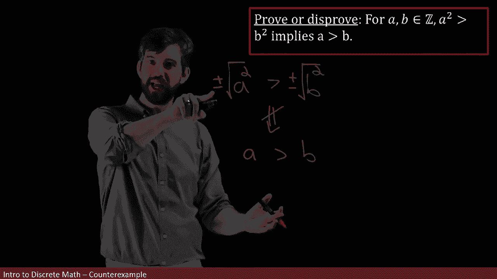
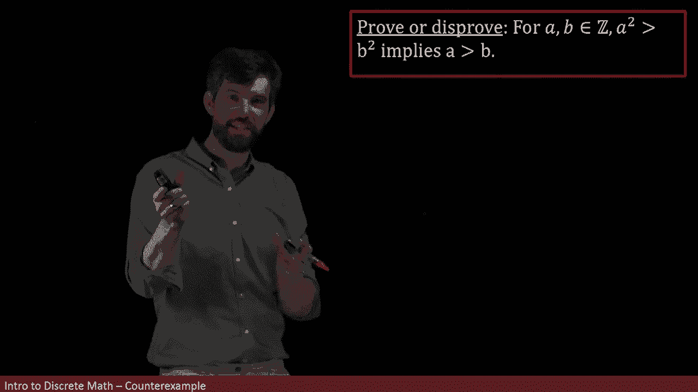
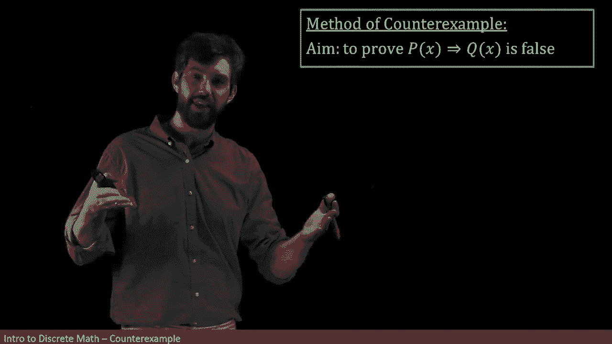
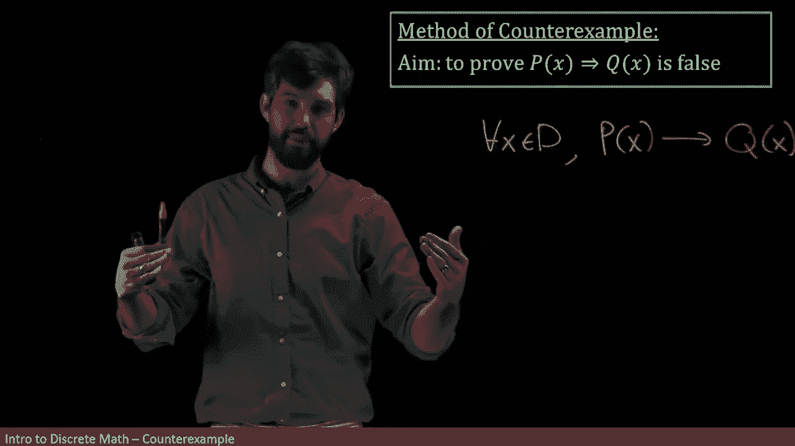

# 【双语字幕+资料下载】辛辛那提 MATH1071 ｜ 离散数学(2020·完整版) - P36：L36- Disproving implications with Counterexamples - ShowMeAI - BV1Sq4y1K7tZ

Here we have some clay。 It's the claim that if I take a pair of integers and A and a B。

 then the a squared is bigger than the B squared forces the A being bigger than the B。

Now， when I first see this， I don't know whether this particular claim is true or false。

 Let me just do a little bit of playing around and see if anything sort of reveals itself to me。

So I think I'm going to begin by just writing down my assumption， in other words。

 I'm starting with this a squared and I'm claiming that the a squared is going to be bigger than the B squared。

Now， what I want is that A is bigger than B， and I'm at squared。

 so if I didn't want to go just down to the A， well， maybe I could take a square root。

So that's one thing I could do， I could consider taking the square root of this and comparing it to the square root of that。

However， whenever we're doing square roots， we should have a little bit of an alarm bell going off in our head because square roots have plus or minuses in front of them。

 In other words， I should have a plus or minus here or a plus or minus here。

And then this fact is going to not necessarily work out cleanly as a going to be because it depends on the pluses and the minuses。

 I know that if I've got minus signs and I multiply both sides by a minus sign that those are going flip this inequality。

 So I don't have this like nice， clean way to use this and to go down to this result。

But I think that this is going to actually inform me as to why I think this theorem is false。

 because what we've sort of seen in our playing around is there's some issue with pluses and minuses。

So why don't I do an example kind of like that， Why don't I take an example where I've got some pluses and minuses in and see whether it's going to work out in that sense。

 So I'm going to write down a couple specific examples with actual numbers here。

 keeping in mind that the plus minus issue might be relevant。😡。

For instance， if I don't have any minuses showing around and I look at say something like four squared is greater than three squared。

 Well， in this case， it is true that four is going to be greater than three。

 So so that example is making it appear like my theorem is true。

 but this example hideves pluses and minuses。 So let's do a different example。 Let's take-4。😡。

I'm going to square the minus four。And then I'm going to compare that to three squared。

 In other words， what I'm doing is minus four squared is 16。

 and I'm saying 16 is going to be greater than9。

But if I then go and look at the A and the B here， I've got minus4。

And minus four is not greater than three， minus four is a negative number。

 and so it is going to be less than three。

So I have this interesting scenario where my A is less than B。

 even though my A squared is bigger than B。

All right， so now I believe this is false， why I found one example。

 one pair of A and B's where this claim is not true。

And notice that this claim that I have is a claim for every single A and B the every is not written explicitly here。

 but it's there implicitly if I take any generic A and B。

 it has the property that a squared is bigger than B squared implies A is bigger than B。

 So if I have just one so-called counterex to this， the entire theorem is going to be false。

 So I'm going to say。😡。

That I have it being false。

By counter example。

What we did in the prior example was to disprove an implication by giving a single counter example and indeed this is going to be a very important method to disprove particular implications so I want to open up exactly how this works a little bit so the goal of this method of counterex is if you're given an implication like P of x implies  Q of x we're going to use the method of a counterex to show that that implication is false。

😡。

So I want to open up a little bit how this is going to work。 First。

 I want to remind you that the double arrow that I have here that this was a shorthand that sort of hit a for all x as in P of x and Q of x were prediccateates and what this actually meant was that。

For every value of x in some domain that has been specified perhaps only implicitly。

 but for every x in some domain， then if I plug in the value of x into this particular predicate。

 I'm going to get the implication， so the single arrow for a implication between two logical statements。

 that's going to imply Q of x。😡。

So the difference between this single and the double arrow is that when I'm looking here where it's quantified and we're choosing specific x values。

 this is an implication between two statements， but when I use the double arrow。

 this is going to be an implication between two predicates。

 and indeed the double arrow was just shorthand to mean this other thing。😡。

Now， I'm trying to show that this implication is false。

 as in I'm going to put bracket rather entire thing。

 what I'm trying to show is that this entire thing is going to be false。😡。

Now， how does it work， We know how we can negate statements that are quantified in particular what this means is the for all flips and becomes a there exists in X in the domain。

And then the negation comes on the inside and I say it is therefore not the case that。

P of x is going to imply Q of x。

And the idea here is that there is some x， not necessarily more than that。

 but there's at least one where if you take that X and plug it into my prediccateates。

 it is not the case that the P of x implies the Q of x。

Now I want to look into when is this true that it's not the case that P of x implies Q of x？

If I just look at the p of x implies  Q of x， if we go back to the truth table of our implications。

 you'll remember that p of x implies Q of x was going to be vacuously true whenever p was false and it was also going to be true when P was true and Q was true。

 the only way that just the implication was ever false was going to be if the P was true and the Q was false。

 So if I'm negating this particular statement， that's what I'm doing。

 I'm picking out that one time when the implication is false。

 as in I'm picking out the time when P is true and Q is false。😡。

And so I'm going to summarize my method of counter example in this way。

I am finding some particular element in my domain and I sometimes like to call it a when it's like an actual chosen element there exists one and I found it and I give it the name A。

 and it means that when I plug it into my prediccateates， I want a scenario where my P is true。😡。

But my Q is going to be false。 and so in other words。

 I have this conjunction of P of a and not Q of A。😡。

So for instance， in the prior example， what my domain was was pairs and A and B。

 and we had found that one example minus4 for a and 3 for B， where the assumption was true。

 this is the P of a， the a squared greater than b squared where that was true， the assumption。

 but where the conclusion which is going to be the Q of a was false。

 namely that the minus4 was not going to be bigger than the three。😡。

