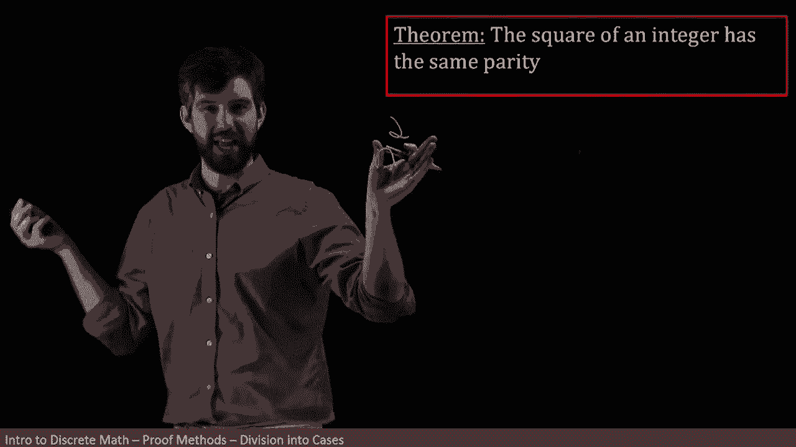
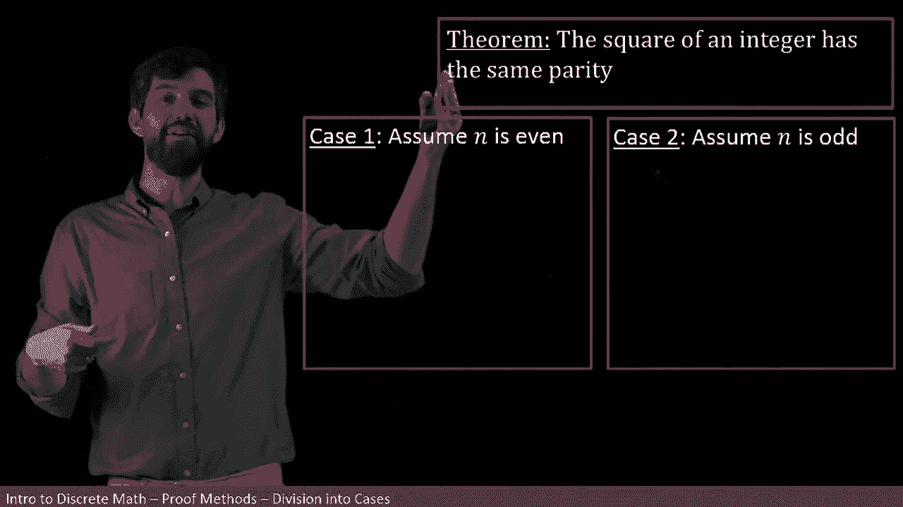
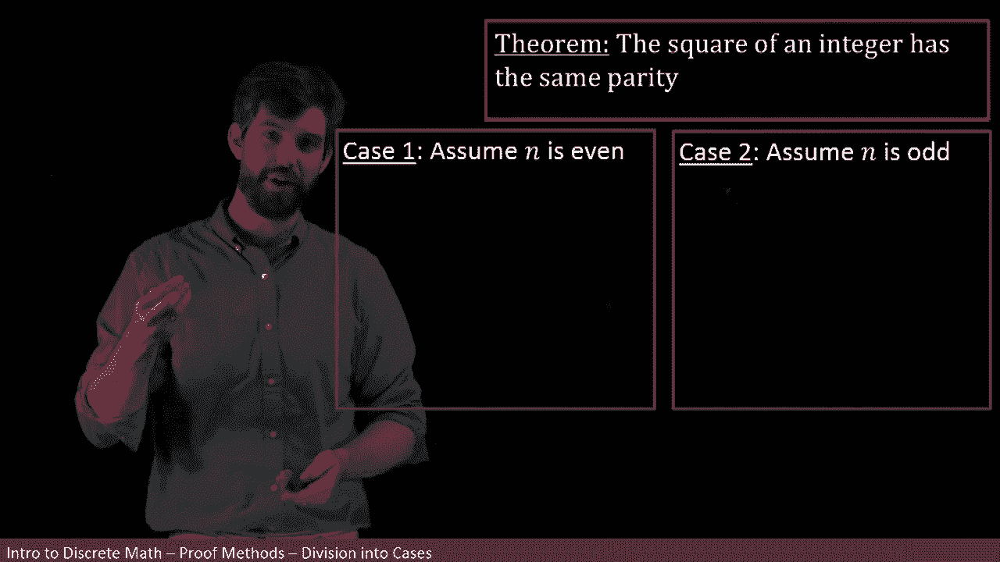
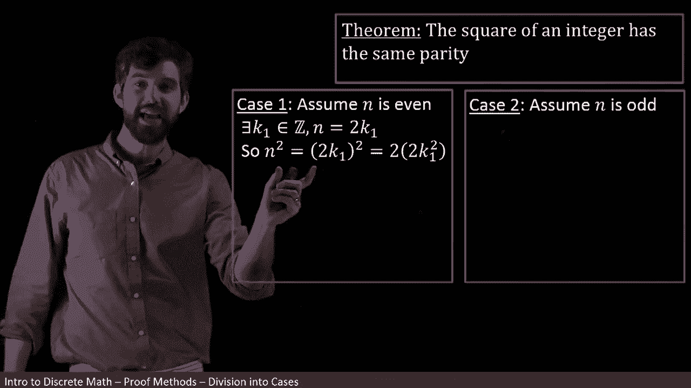
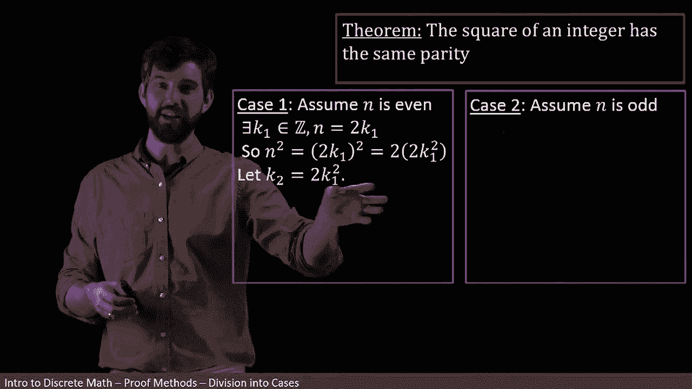
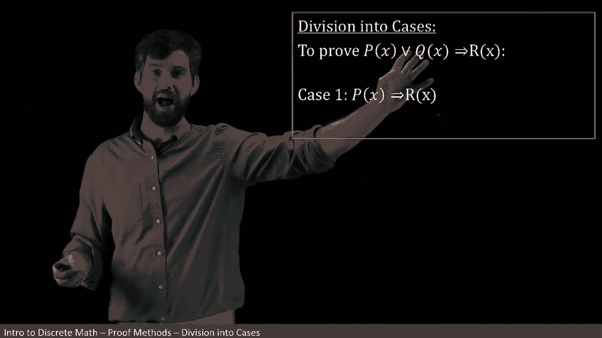
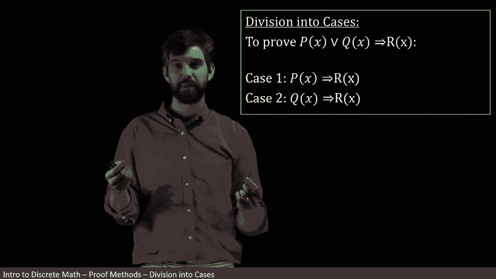

# 【双语字幕+资料下载】辛辛那提 MATH1071 ｜ 离散数学(2020·完整版) - P37：L37- Proof by Division Into Cases - ShowMeAI - BV1Sq4y1K7tZ

Consider this theorem， the square of an integer has the same parity by parity， by the way。

 I mean whether it's even or odd。

So I'm saying if my initial number is even raw， then the square of it is the same。

 it's either even or rod corresponding to whether the initial number was even raw。

Now， I want to try to prove this。But if I just take the number itself， right。

 like if I just look at n。

And then I come along and I like square it。 Well， there's not a lot I can manipulate here。

 I've just got an end， and then I've got to square it。

 And I I want to say something about it being even and something about it being odd。 But here's。

 I think， the main point。

There's two different cases here On the one hand， I have the case where my initial number is even and then I square it and see what happens。

 and I also have my initial number might be odd and then I could square it and see what happens。

 but if I don't make that assumption at all and I just take and just by itself and square it there's nothing really to manipulate。

So this is an example of a theorem that we're going to tackle by breaking it up into two different cases。

So the two different cases are going to be one that my number that I have is going to be even and two that the number I have is going to be odd。

And the argument is if I can go through and fill out these two different proofs and they both conclude that they have the same parity when I square it。

 then I have got the original theorem because there only are two cases。

 every number is either even or odd if it's going to be an integer。

So let's focus first on case one， I want to be able to prove this。

Now we have a sort of methodology to how to prove statements like this。

 I begin with my assumption as I've written down， I am assuming that my an is even。

And if I think about where I'm trying to get to， where I'm trying to get to is that n squared is going to be even。

Now we know that one of our first steps is always going to be take our assumption and apply whatever definitions we know to it。

 So the definition of being even was this existence claim， right， we said that it could be the case。

 that it could be written as two times some other number that there existed this other number So that's what I'm going to write down next。

 I'm going to write down my definition I'm going to say there exists this K1 It's also an integer and that the n can be written nicely like this。

 it can be written as twice that K1。😡。

All right， now I want to do some manipulation。

But to know what I'm supposed to manipulate， I want to think about where am I going on this。

 because I'm going to be talking about squares， I want to square my ann and see what happens。

So that's why I'm going to begin， I'm going to look at my n squared and you'll notice that I do a bunch of algebra here。

 I start with my n squared。

I then go and take that the n is the 2 k and I plug it in， so it's the 2k1 squared。

 and then this next step that I do is kind of a little bit tricky because I'm anticipating that I want n squared to be even I'm anticipating that I want n squared to be twice something so I take the n squared and I move my brackets around and I write it as twice some other thing。

And in fact， at this point， I'm almost done， but if you want to for the style points。

 you could be even more explicit by saying， let's give this other stuff a special name。

 So that's what I'm going to do next， I'm going call K2 to be all the sort of other mess that I have floating around over here。

So the K2 is this other mess。And then I can clean it up with the K2 and what I get is that my n squared are just twice the K2。

But that's precisely the claim that I've got an even integer。

 saying that n squared is twice K2 is just going to be the claim that n squared is even because it's two times something。

 so I'm going to write down my final conclusion， thus n squared is going to be even。

Now I've only done one of the two cases I started with the assumption was even I got that n squared was even I also had to do case too。

 start with its odd and deduce that n squared is going to be odd。

 but I'm going to leave that one for you。

The logic that we used in the previous example is referred to as division into cases。

And the idea here is that I'm proving some implication， I've got an assumption。

 and I'm proving some conclusion， but what's unique here is that the assumption is one that I can split up into be an or statement of multiple things。

 two， three， or any number of disjunctions。

So for instance， in the previous case， it was that I was starting with integers。

 but I could break integers up into the two different cases。

 they could be even integers or they could be odd integers。

And then to try to prove a situation where your assumption is divided into cases。

 it takes one step for however many disjunctions you have。

 so for instance first I'm going to go and prove that the P of x the first of mine in this disjunction is going to imply my conclusion。

 so that was when I went and showed that my even integer got that the square was even as well。

And then the other one is I'm going to focus on the Q of x。

 which was the odd integer in the previous case， and I was saying if n is odd。

 then it squares going to be odd。

And since I have demonstrated this for all the different ways that my hypothesis could possibly be true。

 I therefore have demonstrated it for this entire disjunction implying the conclusion。

 so this is the idea of division into cases。

