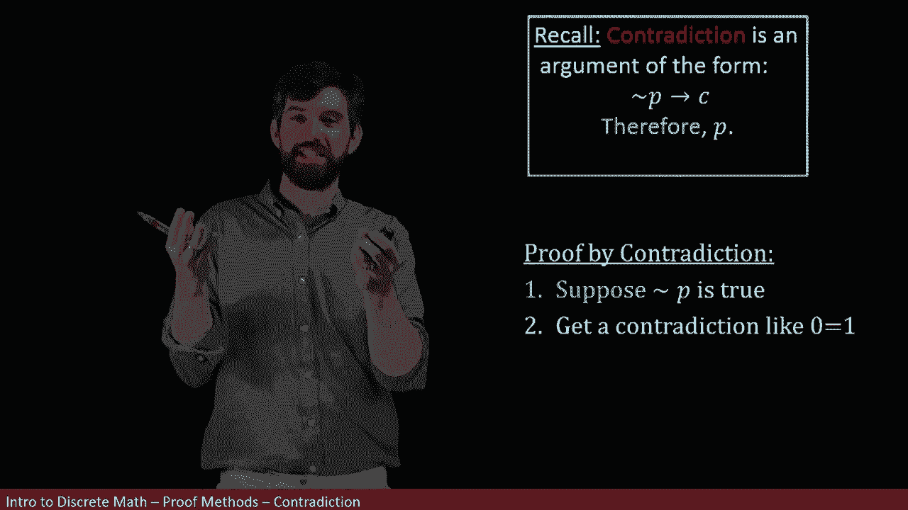
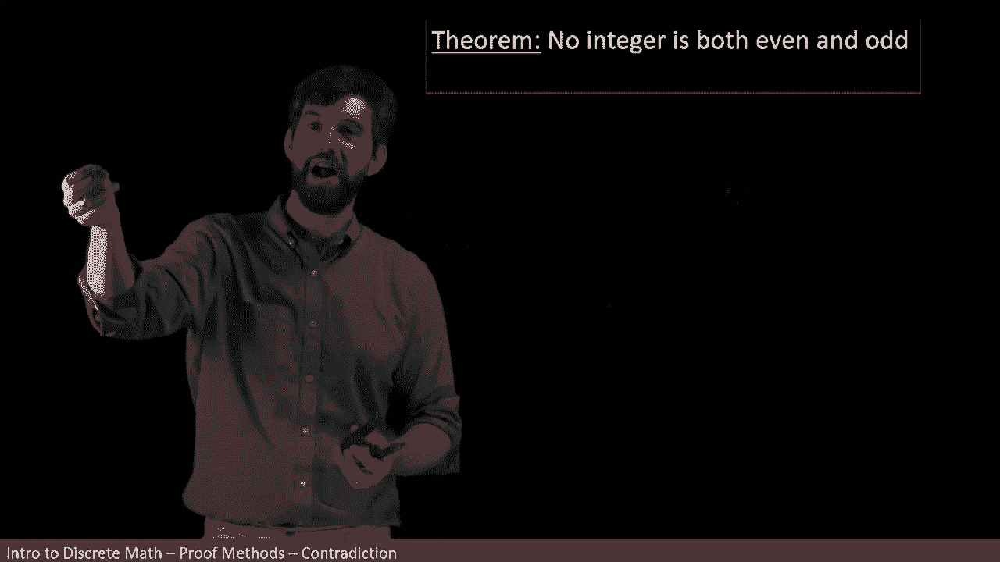
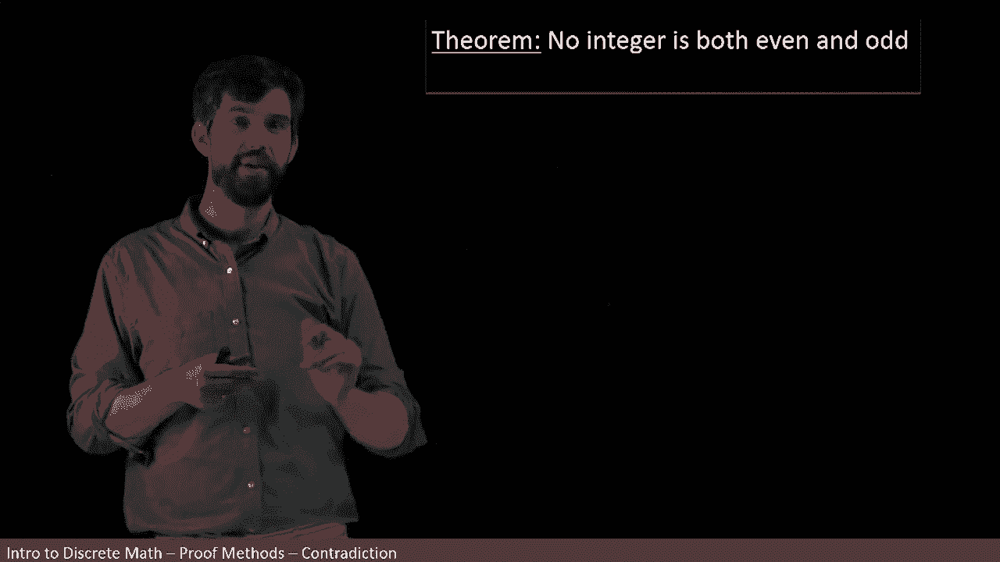
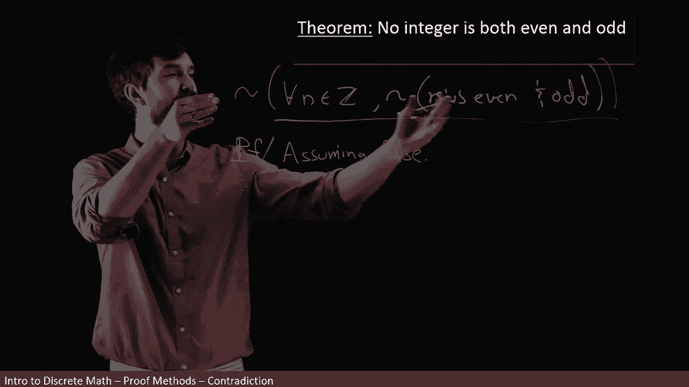
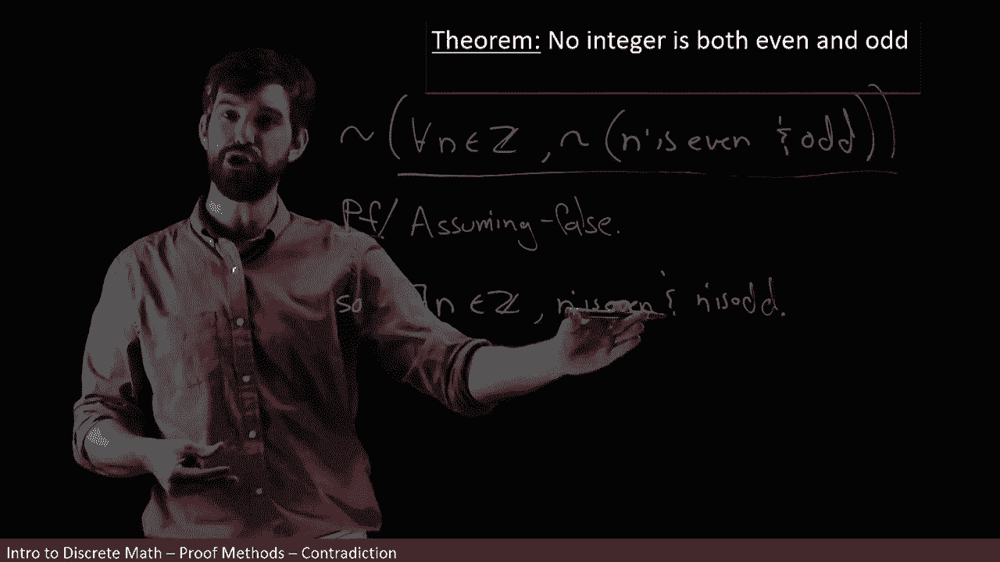
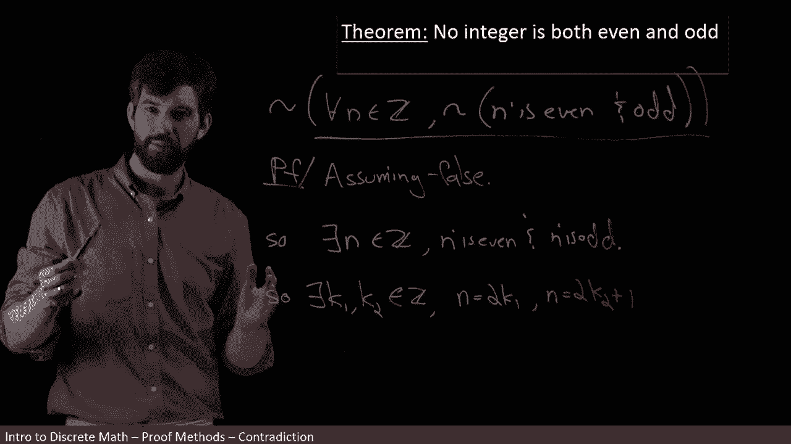

# 【双语字幕+资料下载】辛辛那提 MATH1071 ｜ 离散数学(2020·完整版) - P38：L38- Proof by Contradiction _ Method & First Example - ShowMeAI - BV1Sq4y1K7tZ

One of the most important methodologies to prove things in all of mathematics is proof by contradiction。

 and I'm going to remind you about an argument form that we did back when we were just considering arguments between various statements。

😡。

It says that if I want to prove a claim P， what I could do instead is assume not P。

And if not P for some contradiction， some like nonsensical statement。

 that was going to demand that indeed we had the statement P。

So the different steps behind proof by contradiction are going to be first。

 I'm going to assume not P is true， in other words。

 I'm assuming that my statement I'm trying to prove my P， I'm assuming that that is false。😡。

And then I'm going to do a bunch of manipulations and along the way I'm hoping to get to some pure nonsense。

 I mean like zero is equal to one or that Rufus is a dog and not a dog。

 something that makes no sense at all。

And because of the contradiction， it must be that my assumption， my assumption of not p。

 that that must be false， and if not p is going to be false。

 then I'm going to have that my P is going to be true。

So this is sort of the different steps， and I want to note here that I'm using P opposed to big P of x because these are referring to statements。

 this is some statement and I'm assuming that statement is false。

 this is not talking about predicates， P of x that depend on a variable。😡。

So as an example， let's consider this theorem， no integer is both even and odd。

Now the problem here， if I try to prove it directly is and if I wasn't allowed to use contradiction is that。

 okay， I could check it for one， I could check it for two， I could check it for three。

 could check it for four， I could keep on going as long as I hadn't tired。

 but I hadn't necessarily checked every single integer。

 maybe it's somewhere in the billions that you finally find an integer that is both even and odd。

But if I'm going to prove it by contradiction， it's going to go a little bit faster。

Now， before I go into proving this， I want to analyze the statement for ethological form。😡。

When it says no integer has some property， this is actually a implicit universal statement。

 This is a claim about every single integer。 Every single integer is not both even and odd。

 So I can rewrite this like this， I can say for every integer。

In other words， for all n inside of the integers， it is not the case that n is even。

And on， I never have both of these different properties。

Now to be clear， this statement was not part of my proof。

 this was just me rewriting my statement and saying that my statement is indeed equivalent to this。

 so now I'm going to actually begin my proof。😡。

We decided that what we want to do is prove it by contradiction。 So in other words。

 I want to begin by assuming。

That this is going to be false。😡，And if I'm assuming that it's false。

 what I'm going to be doing is thinking that if this is my statement。

That I'm going to be putting a negation in front of it and I'm assuming the negation。

But because this is a quantified statement and I know how nes work with quantified statements that what I'm going to get is the for all flips to be there exists。

I have an existence of an an inside of the integer。

And then the negation moves inside。

But notice how we already have a negation moved inside。

 so if I take this negation and move it inside， I have two negations and a double negative cancels。

So what I'm just left with is n is even。

And an is odd。So the way to think about this is if my original statement is no integer is both even an odd。

Then if I'm going to assume that that thing is false， it says， well。

 there has to be at least one that is both even and odd， and that's my claim here。

Okay， so I've got this assumption and what's the next step in most of our proofs。

 let's apply the definition I'm claiming this is even and I'm claiming that this is odd。

 but what does that mean Well， it means that there exists two other integers so that I can write it in the following way so there exists a I'll call them K1 and K2 because I need one for the even and one for the odd these are both going to be integers。

😡。

And they have the property that I can rewrite the N and the M。

 I can say that my n is going to be twice the K1 because it's even that's what I meant to be even that you write it is twice something。

And that the n is going to be 2 K2 plus1。

By the way， it's very important here that you don't use the same k。

 this is often a place that people can make mistakes in their proofs like the claim for n is even is there exists a k so written it as 2K and the claim for n is odd is there exists a k something written as 2 k plus1。

 but because I'm doing both of these at the same time， they don't necessarily have the same k。

 so I choose different ones， I index them as K1 and K2 and I get these two different claims。😡。

Allright， so there was my assumption was the first two lines。 Now I applied my definitions。

 Now I'm going to do some manipulations and what do I get here where these are both ends so I'll set them equal to each other So 2 K1 is equal to 2 K2。

Plus， one。And then moving the K2 to the other side and pulling out the two， I get the formula twice。

K1 minus K2。

Is equal to one。 And finally， I'm going to divide out by2。 I'll show you why in a moment。

 I'm to divide out by2 to get that this difference K1 minus K2 is equal to one half。

Now， I claim that this result that K1 plus K2 is equal to half is going to give me a contradiction。

 So why is that the case， Well， if I look at my K1 and my K2， here they were。

 They were both integers。So we've assumed K1 and K2 are integers。

And then the difference of two integers is likewise an integer。

 So K1 minus K2 is going to be an integer。

But I just showed you that K1 minus K2 is not an integer， it's a fraction， it is one half。

 it is a rational number that is not an integer。So I've got two different claims that are contradictory。

 I've got the claim K1 minus K2 is an integer， I've got the claim K1 minus K2 is equal to this fraction1 half that contradiction cannot be。

So clearing up some space for myself， what I have is this contradictory claim first that the K1 minus the K2。

 that this is going to be an integer， which we got from noticing that it was the difference of two different integers。

😡。

And then from what I have down here， I've got that my K1 minus K2 is not an integer because it's equal to a half and a half is not an integer。

And this is a contradiction。The symbol I sometimes use for contradiction is two arrows that are both pointing to each other because they like imply nothing。

 but either way what I mean by this is a contradiction。

Okay， so how do I finish off the proof here？I began with the assumption that there was an even inte that was both even at odd。

 that was my beginning assumption。 I assumed that to be true。

But I've done manipulations， everything's logically followed from there。

 and I've got into pure and utterer nonsense。

So this tells me that my initial assumption that there was an integer that was both even and odd。

 that assumption was nonsense because if you assume it you get to a contradiction。

 and therefore I can claim that my original theorem must be true。

So indeed， there is going to be no integer。

That is going to be both even and odd。

And I can put my little QE box at the end to claim I have triumphantly proven my proof。

