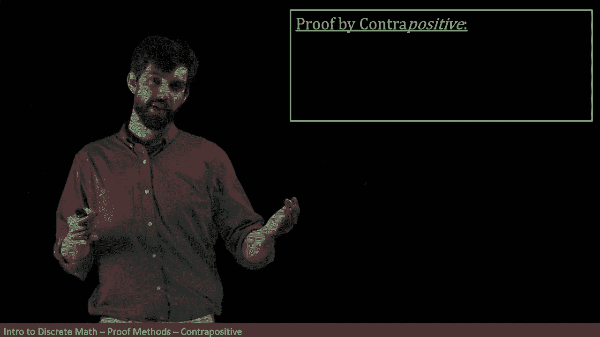
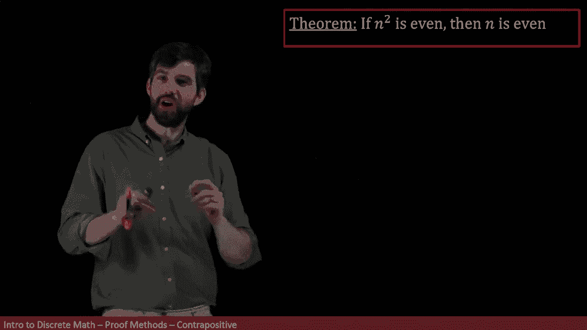
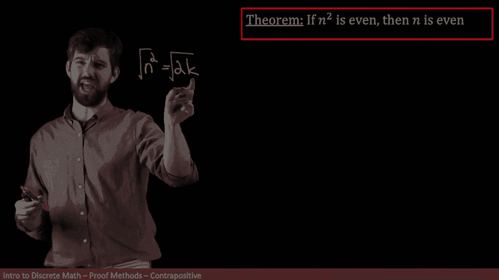
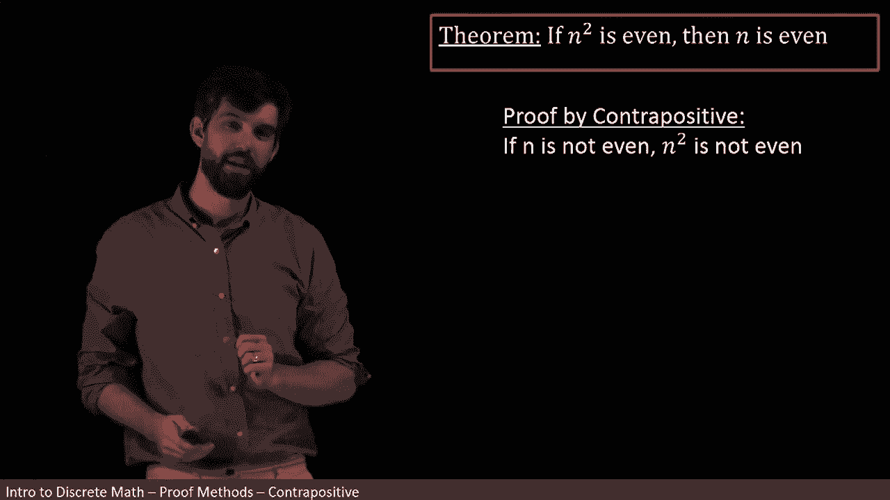

# 【双语字幕+资料下载】辛辛那提 MATH1071 ｜ 离散数学(2020·完整版) - P39：L39- Proof by Contrapositive _ Method & First Example - ShowMeAI - BV1Sq4y1K7tZ

If you recall when we talked about a normal implication， P implies Q。

 we've seen before that p implies Q is logically equivalent to not Q implies not P。😡。

So I'm going to make use of that logical equivalency when I try to go out and prove things in particular。

 my first goal is going to be to try to prove an implication。

 that's what Im to do I'm trying to show proven an assumption leads to a conclusion。😡。

But what I'm going to do is treat this as the other way around。

 I know that P implies Q is the same thing as not Q implies not p。 That is。

 I am instead going to go and try to prove the counter positiveitive。

 I'm going to try to prove not Q implies not P。 And that's the way I'm going to demonstrate that P implies Q。

 So let's see an example。😡。

In this theorem， I'm saying if the square is even， then N itself is also going to be even。

 and I want to know carefully。

This is different from the theorem that we've seen in a previous video。

 This is not saying if n is even， then n squared is even。 it's the other way around。

 It's saying if n squared is even， then n is going to be even。

 I gonna just try to use a direct proof and show you why it might be challenging。

So my assumption might be that n squared is even， which is going to be that n squared is going to be twice some k for some K。

 I'm not going to write all my symbols down because this is about playing around step。

 I don't have to be all that precise。

All right， and I want to say something about n， I've got this square here。

 so maybe what I should be doing is taking a square root of both sides that might give me my n if I took the positive square root for instance。

But then what I have is it being like equal to root2 times root k。

 which doesn't really look anything at all like being even so assuming that my M squared root was even taking square roots just didn't leave anywhere it's got all this messy root two stuff floating around so proving it directly seems a little bit challenging so let's get rid of that。

Since proving this directly wasn't all that useful。

 let's try to prove it by the contrapoitive we we're going to do it the other way around with negations So when I write it as proof by contradict by contra positivesitive rather note what happens first of all。

 the n squared is even in the n is even they flip orders， but they also get two knots in。

 that's what happens when I do contrapositive。😡。

So in other words， I'm assuming that n is not even and I'm trying to deduce that n squared is not even。

By the way， the assumption n is not even is the same thing as n is odd。

 and the conclusion n squared is not even the same as the conclusion n squared is odd。

But I've actually seen that particular proof before。

 I've seen a proof that n is odd implies n squared is odd。

 and so we can sort of bring that one in and this is the proof that we've seen before。

Indeed， this claim n squared even implies n is even is the same claim。

 It's logically equivalent to n is odd， implies n squared as odd。

 It's just that when it's written this way in it' counter positiveitive form， it's quite tractable。

 and we were able to do its proof almost directly。 It sort of just fell out by our assumptions in a way that just wasn't true when I tried to directly prove the original。

 So it's a wonderful illustration of how a proof that's challenging and hard。

 if you try to go and prove it's counter positive， the con ofpoitive while logically equivalent might be much easier to prove。

