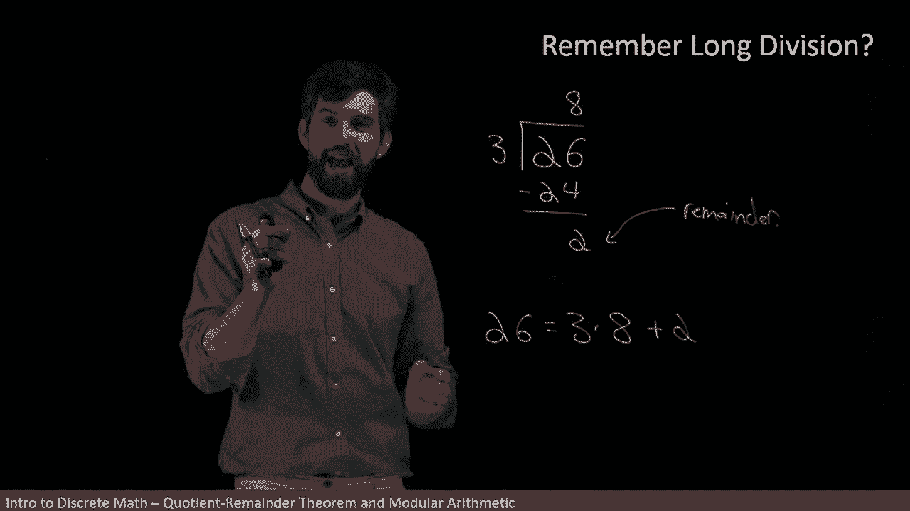
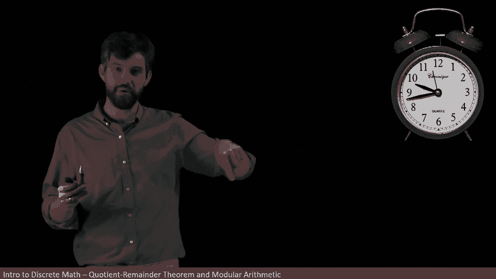

# 【双语字幕+资料下载】辛辛那提 MATH1071 ｜ 离散数学(2020·完整版) - P40：L40- Quotient-Remainder Theorem and Modular Arithmetic - ShowMeAI - BV1Sq4y1K7tZ

In this video I want to take a look back at long division。

 which of course was this process that sometimes traumatized people back in elementary school and sometimes still to this day。

 but we want to look and understand precisely what was occurring in long division and make precise statements about it using all of our new mathematical terminology so let's see an example that reminds us how this works。

If I take some number， like say， 26。

And then I want to divide it out by three。

The way this worked is you tried to take the three and you chose some number that was as close to 26 as you could imagine。

 but was divisible by three。

So for example， the number 24， I'm going to write that down。

 the number 24 has the property that three and I wrote the other factor here。

 three times8 was equal to the 24。

So in other words， this number that I'm putting down here is a number divisible by three and as close to 26 as I can get without going bigger than it。

And then I would usually come and subtract these things and I'd say 26 minus the 24 is going to be equal to a two。

And I had these three different numbers and the claim is that these three different numbers were going to be related in the following sense。

 it was that the 26 that I started with was going to be the three that I'm trying to divide it by this number up here。

 three times8， that's the 24 and finally plus two。

So this sort of whole bunch of symbology was just a way that we could keep track of the steps that we were going。

 but what our goal was always to say take this 26， right it is a three times some other integer。

 and then I get this two here where the two was going to be referred to as the remainder。

So this was how our long division worked， but now we want to investigate how this is going to work formally and I'm going to note that I'm going to particularly like using this bottom equation that we have down here where we're taking the number that I have and saying that this is equal to the number that I'm dividing it by times sum integer plus a remainder。

😡。

This funky collection of symbols is called the quotient remainder theorem and basically what the quotient remainder theorem says is long division that process that we've done many times before。

 that process actually works and in fact it always works。

In other words， if you have any pair where you begin with some integer N。

And you divide that integer n by some other integer that is actually going to be a positive integer。

 I'm not allowing a division by zero。 So I've got some n。 I'm dividing it by D， which is non zero。

Then we're saying there is a way， as in there's that remainder and there's this quotient Q where I can go and say that n is written as the divisor D times Q plus this remainder。

And additionally， that remainder is constrained that it's somewhere between zero and the divisor。

So let's try to translate this into what we were just saying the idea would be that。

If I had some N and I was trying to divide it out by D， I got some Q up here。

 and I' would be left with a remainder down here。

And then this arrangement of symbols which just sort of one familiar way to collect it。

 but this is all exactly the same as this arrangement of symbols that I have over here。

 the n is equal to the DQ plus the R。

Now， while I'm not planning on proving this particular theorem in this video。

 it's worth noting that this process that we've had in this past that was something that we just sort of always went through is it is actually formalized into a proper mathematical theorem and that it's a mathematical theorem that can indeed be proven and the main takeaway of this theorem is that it always works for all n and D。

 we're going to be able to write out this relationship between the n and D where I have this Q and where I have this R that fits this particular constraints between being between the zero and the D Now in some applications the part that we really care about。

 the one that we want to focus on is what this remainder is that in some sense。

 the remainder is the interesting part I'll give you an example， consider a clock。😡。

Here I have an analog clock that goes around for 12 hours。

This is a form of what we're going to call modular arithmetic， and the idea is this。

A clock doesn't tell me how many times it's gone around。

 It just tells me some number between zero and 12。 it doesn't tell me whether I've gone around the circle like eight times and then ended up at three o'clock。

 it only tells me the three o'clock。

And what we're going to try to do is pair that idea with only caring about the remainder in the quotient remainder theorem。

So for instance， suppose I ask a question like this， what's the time in 50 hours？😡。

And if I look at this clock， it looks like we're talking about 943 is where we are right now。

So now it's going to be 943。No， by the way， the clock doesn't tell me whether it's AM or PM either。

 it just tells me it'ss 943。

Now if I then go and I try to like add 50 hours， like I'm going to go 50 hours into the future from this 943 and I want to know what time is it 50 hours from now？

Well， because we're dividing out by 12， like I can't tell the difference between 943 and 12 hours beyond 943 or 24 hours between 943。

 this clock will only ever say 943。

So what I want to do is sort of divide out by 12， so I'm going to divide out by 12 here。

And how does this work， well， 12 goes into 54 times that leaves me with 48。

And if I subtract 50 from 48， that gives me a remainder of two hours。

So in other words， if I'm going to advance from 943， 50 hours into the future。

The first 48 hours is just me wrapping around the clock and getting back up to 943。

 but what matters is the extra two hours in the remainder。 In other words。

 I go from 943 to 1143 where I've added the two hours and the fact that I've also added 48 just isn't detectable in any way。

So this is referred to giving me the value of this modulo 12。

 where we don't keep track of how many times we go around 12 hours。

 we only keep track of how the remainder changes the shift of two hours extra from the 943 to 1143。

We also use modular arithmetic when it comes to days of the week。

 Day of the week are something that repeat every seven days。

 And so I can ask a question like if today is Friday， what day of the week is it in 50 days。

 And I'm going to do much the same sort of process。 I'm going take my 50。

Instead of dividing it by 12， though， or taking it as they say Moo 12。

 I'm going to take it dividing it out by seven because there's seven days in the week。

So let me divide this by seven。

And then I know that7 goes into 57 times， which leaves me with 49。

And if I subtract the 49， I'm going to get a remainder of one。

And so what I think about this is that if I'm advancing my 50 days and I start on Friday。

 after seven days， I'm back on Friday， after 14 days I'm back on Friday。

 after 49 days because that's Vi by7， I'm back on Friday as well。

And then I have a remainder of one， which takes it from Friday to Saturday。

 So where I end up with did I end up being on Saturday。

 So this kind of modular arithmetic occurs in all sorts of different places。

 But I want to be able to define it precisely。

So I've brought back up my quotient remainder theorem and the idea with bo arithmetic is that I'm only caring just about the R。

 so here is my precise definition。😡。

The terminology is always going to be n mod D。 So in this case。

 n is the big number that I have the 50 in my previous example。

 D represents what I'm sort of divided and into。 So it was the 12 in the case of the clock or the 7 in the case of the days of the week。

😡。

So I might say something like 50 Maud7， and what we get of 50 modd7 is going to be that remainder that came from the quotient remainder theorem。

So in particular， we might say that if I have 50。

And I'm going to take mod7 that this is going to be that remainder when I divided 50 by 7。

 which we' previously seen was just going to be equal to one， so 50 mod7 is equal to one。

