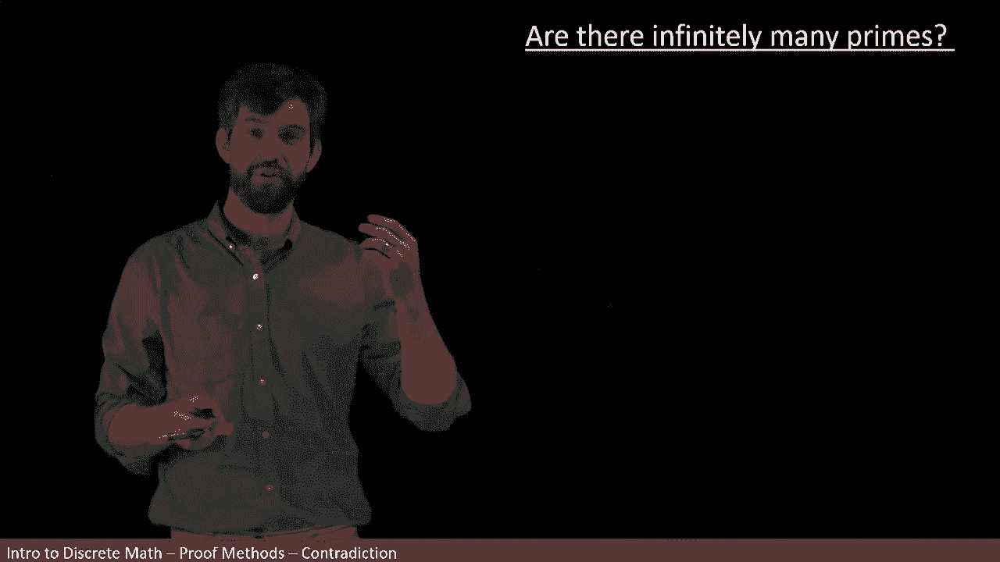
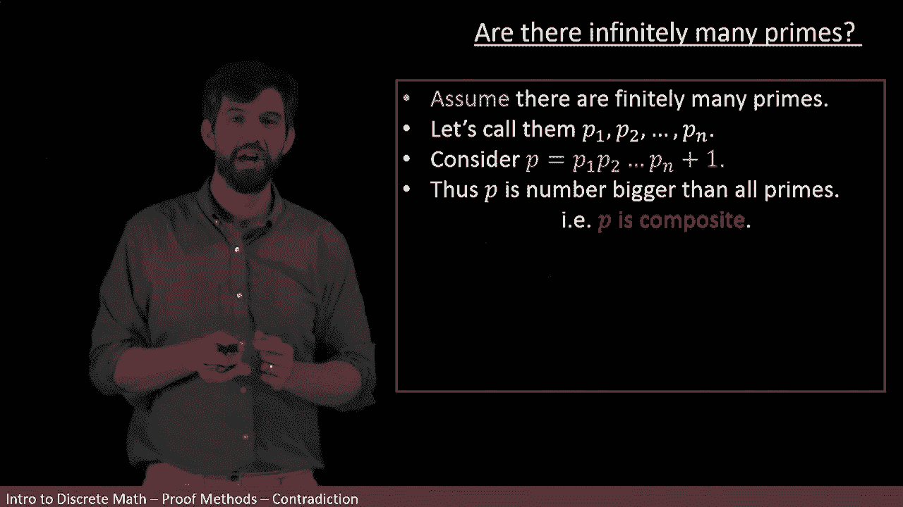
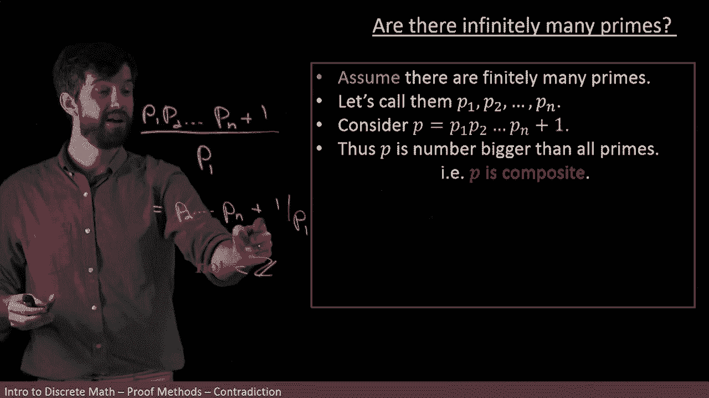

# 【双语字幕+资料下载】辛辛那提 MATH1071 ｜ 离散数学(2020·完整版) - P41：L41- Proof - There are infinitely many primes numbers - ShowMeAI - BV1Sq4y1K7tZ

In this video， we are going to prove a delightful theorem that there are infinitely many prime numbers。

So before we jump into the proof of this， let's just remind ourselves about the terminology。

 so I am going to claim that a positive integer is called prime when it has two different factors。

 one and itself。😡。

So， for example， two has one and two is factors and three has one and three is factors and five is one and five is factors。

 Note that one is not called prime because well， it has one in itself。 those are not distinct things。

 So two distinct factors， one in itself。

And then we can talk about a composite number which is going to be a positive integer。

 which is greater than one， but that is not going to be prime。

 so this is a number like six where six has one and six is factors but it also has two and it also has three as factors。

I'll also note that we have a pleasing theorem， which is that if you have a composite number。

 it can always be written out as a product of prime numbers for example， if I take a number like 12。

Then 12 can be written as a product of prime numbers as two， which is prime times two。

 which is prime that gets me to four， and then multiplication by three。

All right， so now let's think about how we might prove this claim。

Now， we have a similar problem to when we were trying to show that there was no integer that was even or not。

 which is。

I could go on for a while finding new integers after new prime numbers after new prime numbers。

 right I might go and find 19 and I might find 23 and I could carry on that process for a really really long time。

 I could carry it for the rest of my life。

But just because I'm always able to keep finding new prime numbers。

 doesn't really prove that there's infinitely many is's just maybe I haven't run out of time yet。

So proving this directly is a little bit challenging。

 it's going to be much easier to prove it by contradiction。

And the idea of contradiction here is that I'm going to begin by assuming there's finitely many primes。

And then I'm going to use that assumption that there's finitely many primes to get some sort of nonsensical statement。

And that's going to tell me that my assumption had to be false and therefore indeed there was infinitely many primes。

 so this is going to be sort of the logical structure that we're going to use a proof by contradiction All right。

 so let's actually see the proof my beginning is going to be that I have finitely many primes so I'm going assume that there are finite many primes。

😡。

Now， whenever I do something like this， I've assumed a finite number of them。

 I may as well give them some names， well I can't give them all sort of unique names。

 but suppose that my finite number there was n of them， some finite number N。

Then I could give them these names， I could give them piece of one。

 piece of two all the way down to PN， those are my N different finite numbers of primes。

Now， the way this proof is going to work is that I'm going to give you some new expression。

 an expression built out of these P1 down to PM。

And then that new thing that we're going to get is going to turn out it's going to be both prime and not prime。

 which is a nonsensical statement。

So here it is， I'm going to consider a new symbol， it's the symbol P that doesn't have any subscript。

And what P is is it's the product of all of those finite primes plus one。

So what do I know about it， Well， first of all， this P is certainly bigger than all the other primes。

 right The multiplication of all these primes gets bigger and bigger， the more I multiply things。

 And then I add another one on the end for good measure。 So for sure。

 this is bigger than all of these other primes。😊。

And if I think of listing these primes kind of like in order。

 like two times three times 5 times  seven， times 11， and so on。

 P is some number bigger than all of these different primes。

So in other words， because it's bigger than them all， I can conclude that it can't be on the list。

 it's not one of those primes it's bigger than all the primes so what we have is it's not a prime number or another way of saying it。

 I have it that it is a composite number。

Okay， so I've written out this composite number。

Well， if it's composite， then we could factor it by that theorem we were just talking about。

 we could factor it as a product of different primes。

As in this P that we have is some product of like the P1， the P2 might be a bunch of them。

 but some combination of these primes， that's what it means to be composite is that there is some prime factorization of it。

Okay， well， how about I try dividing out my P by P1。

 I'll do that off on the side here to give us some intuition here。

So I'm going to take this P1， P2 all the way down to PN， and I'm going to take plus one。

And then I'm going to take the entire thing， and I'm going to divide it out by P1。

Could have divide it up by P2， could divide it up by P3， could divide it up by Pn。

 but I just chose P1。

Okay， so how's that going to work out， Well， the P one is going cancel the first thing here。

 It's is gonna be P2 product all the way down to P N。

And then I get a remainder here， one divided out by P1。

This portion of it's an integer。But this person is not the P1 is some positive integer。

This is some remainder here， so what I get out of this is not an integer。So what have I said。

 this P that I have here， it's not divisible by P1， P1 is not a factor of it。

But I could have done the same argument for P2 right it would have been P1 P3 down to PN plus1 over P2 I get the same argument for P3 all the way down to PM none of these primes divide this and give me an integer or in other words。

 none of these primes are a factor for this composite number that's what my next conclusion is。

But if none of the primes are going to be a factor。

 that means that the only factor is one and itself， in other words， the P that I have is prime。

But hold on， I've just told you that my P was prime and my P was not prime。

 but that's a contradiction。 I can't have something being both prime and not prime。 It's impossible。

So what I've done by these separate analysis is get to a contradiction。

So if I've gotten a contradiction that tells me that my initial assumption， that was the problem。

 my initial assumption was false because if I assumed it was true I got to garbled nonsense。

 so indeed my assumption must be false and if it's false that there are finitely many primes。

 it's therefore going to be true that there are infinitely many primes and so I have proven there are infinitely many primes。

