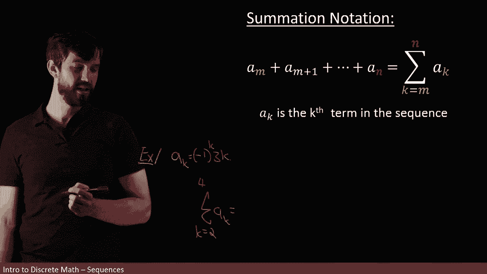
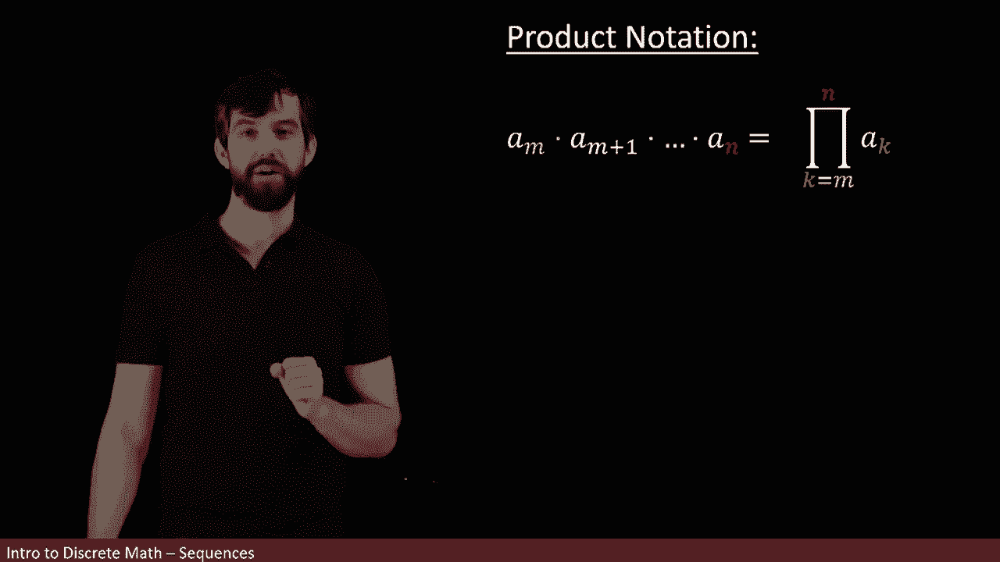
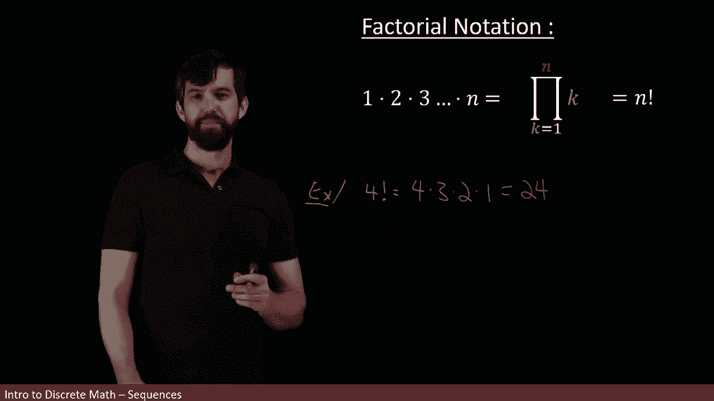

# 【双语字幕+资料下载】辛辛那提 MATH1071 ｜ 离散数学(2020·完整版) - P44：L44- The sum and product of finite sequences - ShowMeAI - BV1Sq4y1K7tZ

I've written down here a sequence has the first term， second term and goes on forever。

I could also be interested in what happens if I take this sequence， which is a list of numbers。

And instead of just listing them， I tried adding them all up as in I was going to take the first term。

 and I'm going to add the second term and add the third term and add the fourth term and continue adding them up forever。

Well， we might start wondering， like does this notion even make sense。

 does there a question of convergence， If I keep on adding things， does it add up to some number。

 There's a really big analysis of what goes on here that's treated in calculus。 But for our case。

 we're going be most interested in what happens if out of this infinite sequence。

 we just choose to add up some finite number of them。 So， for example。

 maybe when I'm interested in in some problem， is's just not adding the entire sequence。

 but I want to take a3 plus a4 all the way up to adding up a9。

 and that's the group that I want to sum up。

Well， this thing here is if all of these are integers， there going to be some other integer。

Now we have a formalism， a new set of notation because I don't want to have to write all of these down and I chose a9 mainly because I was getting bored typing。

 but in an actual problem， maybe a9 here is supposed to be a a million and that you've got this really。

 really large number of things that you're adding up so I want some notation that can express this very long list of things in a really nice short way。

😡。

So the way I'm going to do that is something called summation notation and what we're going to begin with is just sum sum and I want you to note here that I begin on an Eth term。

 and then I go to the M plus1， the m plus2， I keep on adding up and then I end and an nth term so I go from anth term to an n term。

😡。

And then the way I'm going to make a shorthand for this is this notation here。

 which looks a little bit weird if you haven't seen it before。

 but this symbol here is called a big sigma， but I usually just say it's the sum。😡。

And we have a couple different things。 First of all， down on the bottom， there's the M。

 that was my starting point here， right， so I've got the M which is my starting point。

 and then I go up to the n， which is my finishing point。 So it's like start M go up to N。

I'm taking the sum of the AKs where AK is like the generic case term in my particular series that I'm summing up。

 I use series for some and sequences for a list。

And then the way I write it is I say that my index variable that k， the K is the one that's changing。

 this is thought of as the K starts at M and goes up to n and I'm summing up all of the AKs in that region from the M up to the n。

So here the AK is thought of as that generic case term in my sequence。

Okay， so let's see how we might run this out in an example。

I want to keep with our familiar example of AK。

Being the minus1 to the K3 K。

And then what I'm going to do is I want to try to compute this thing。

 I'm just making one up at random， I'm going to take the sum and I'm going to do K equal how about two up to four of the AK。

😡，And I want to try to sum this thing up。

Well what we can do here is okay， let's do the A2， that's my first term starting at2。

 then I add the A3 and finally I'm going to go up to the A4 so those are my terms A2， A3 and A4。😡。

And then we'd seen previously what these terms were， like if I wanted to do the A2。

 that's k equal to2， so minus1 squared it's going to be a plus1， three times  two。

 so this is going to be6。And then the next term is minus9。

 and then the next term after that is going to be plus 12。

And this looks like6 and 12 is 18 minus and 9， this looks like it's going to have the value of nine。

So in other words， there's a lot of fancy notation to do a sum with only three things。

 the point is to deal with ones that are much more than three。

 but we can see this in a simple example， the sum from two。

 to four of this particular sequence is going to be this expression and we can add them up and it guess to the value of nine。

We can do much the same thing with products。 For example， if I have some sequence。

 I could be interested in multiplying together a bunch of consecutive terms in my sequence。

So for instance， suppose I wanted to start at the Mth one and I wanted to end at the nth one。

 I could just say whats this product of all the sequentialal terms between M and N。😡。

And then my fancy notation， my product notation for this is almost exactly the same thing。

 but where before I used a capital sigma to denote some here I'm going to use a capital pi to denote product so this is my notation it's a pi symbol。

 but when I write it in this way I just say it's the product。😡。

Where I start at the M and I end at the end and I'm taking this product of all the generic AKs where that K ranges between the M and the n。

 so that's my notation here。

And I can likewise take that same example that we've been doing a few times now。

 the AK equal to the minus1 to the K。

Times 3 k， and I could take now this time the product of a bunch of different numbers。

 how about k equal to one up to two， just to keep our live simple。

Of ak。The first AK is going to be the value of three。And the second A， excuse me， of minus3。

 and the second Ak is going to be the value of6， and so this product is going to be equal to minus 18。

And likewise， for the most part， what we're really interested in practice is much larger product than just two terms。

 we wouldn't follow with notation， we only car about two terms。

 but the notation generalizes to a very large number of terms。

There's a special subcase of product notation that's important enough in its own right that we actually give a whole new notation for it and call it factorial notation。

And this is when I'm taking the product of a bunch of terms。

 but I'm specifically looking at the sequence aK equals k。 that is that sequence 1，2，3，4， and so on。

 that is the sequence that I want to look at。

So the product of the first n terms， if I want to use my old notation， I can write it like this。

 I can say that it is the product where my AK here is just ak equal to K the first term is just1。

 the second term is just two， the third term is just three。

 so the aK here is being replaced with K because it's a very specific sequence。

 and then I'm going from K equal to1 up to K equal to n。😡。

This particular multiplication is defined to be factorial， and the other notation for it。

 our shorthand for it is going to be an M。 and then I put a little exclamation mark and the exclamation mark means this particular product。

😡。

So for example。If I wanted to compute， say four factorial。

I'm going to say that this is one times2 times three times four。

 or if I want to do it the other way around， which for some reason seems to be how it's most often represented。

 so I'm can have actually to do it the other way around four times three times2 times1。

 which is6 times4， so 24。

And that is going to be four factorial。There's one sort of weird special case that I have to note。

 which is what happens if we take zero factorial and you might be tempted to think， oh。

 trevor rate should be zero， but notice that in this particular sum you start at one to。

 there is no spot for zero here。

So this is actually defined a little differently， it's defined to be equal to one。

So for a positive integer n factorial is this thing for the integer0 factorial is defined to be just zero factorial is one by the way。

 one of the reasons why we adopt this convention is that in the future we're going to connect this factorial notation to probabilities and we'll ask questions like how many different ways are there that I can pull out some number from a bag that has all the numbers between1 and n。

😡。

And then the notion of zero factorial is going to correspond to the idea that there is precisely one way where you can choose nothing。

 you just choose nothing， so there should be counted one way to choose nothing and therefore is's going to be defined in this kind of bizarre and strange way。

 but nonetheless， this is our factorial notation。😡。

