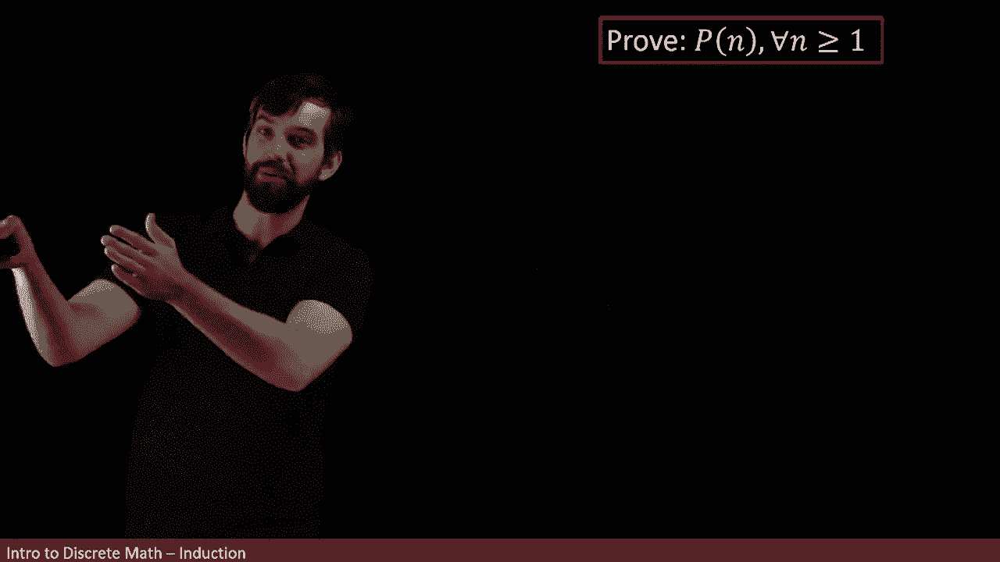
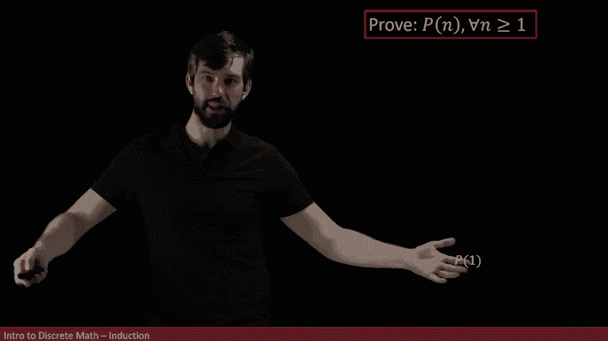
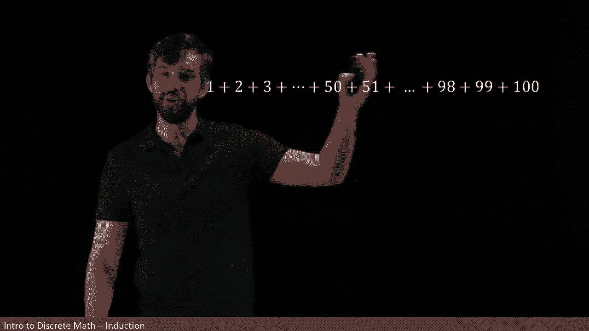
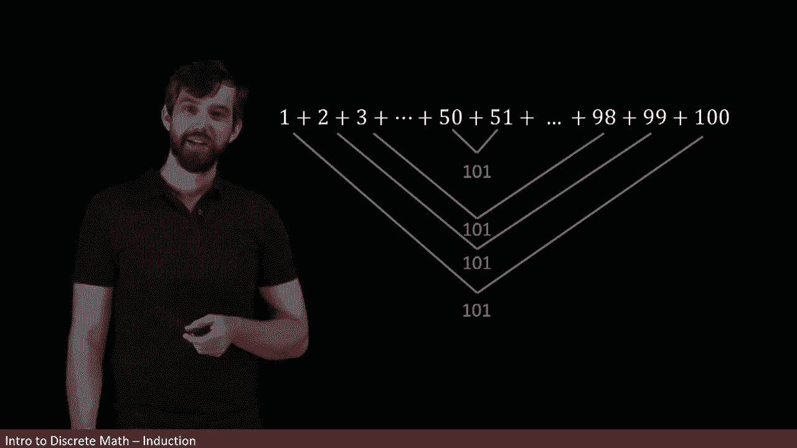

# 【双语字幕+资料下载】辛辛那提 MATH1071 ｜ 离散数学(2020·完整版) - P45：L45- Intro to Mathematical Induction - ShowMeAI - BV1Sq4y1K7tZ

In this video， we're going to talk about mathematical induction and mathematical induction is going to be a proof methodology。

 It's going to be a process by which we're going to prove a whole bunch of different claims。

And the analogy that we're going to use for mathematical induction is that of climbing a ladder。

 So how do I climb a ladder？ Well， I claim that there are two steps to be able to climb a ladder。

 First step， I need to be able to actually get on the ladder。

 I need to be able to make it to the first rung or at least some rung of the ladder。

 Like if you got a fire escape up the side of a building。

 It might be that the first rung of the ladder is too far above you， you can't get there。

 So that's my first step。 I need to get on the ladder。 Second step。

 I need to know that if I'm on some rung of the ladder。 I can get to the next rung of the ladder。

In other words， if I start on that first one and I can go from the first to the second then the second of the third and the third of the fourth and so on that tells me I can climb my ladder All right。

 so now let me contrast this with a specific mathematical claim， I want to investigate this big long。

 messy thing。

It tells me that the sum of the first end numbers， like one plus two plus3 up to say 10。

That that is going to just be equal to some formula that depends on the final number that you choose here。

So for instance， in the n equal to one case， you're taking the sum of only one things。

 the number one， and it's equal to one times one plus1， which is two divided by two。

 this is just a different say is equal to1 So when n is equal to one， this formula is valid。

And then when n is equal to2， it's one plus2， that's going to be the number three。

 and indeed this formula that I have over here is two times2 plus1 is6 divided by  two is3。

 so it checks out as well。

And I can look at what's going to happen in three and four and five。

 and I can carry on as many times as I want and the sum of say the first five things is going to obey this particular property。

So note what I'm proving， I'm proving a sort of infinite collection of claims。

 and I want to do it all at the same time， as in for every positive integer N。

 starting that's bigger than one and going all the way up， I want to have a corresponding claim。

So I think that this sort of style of claim I' a claim that is indexed by the positive integers。

 if you will， it sort of resembles the latter that we're talking about。

 We're going say that there's this first step， a second step。

 a third step and going on all the way up。 Now， I have chosen for you a specific example。

 but we can treat this kind of situation pretty arbitrarily。 So， for example， instead。

 let me consider a property P that depends on these values n or n is going to be positive integers。

 So in the previous case， the property was some equality that the sum of the first n terms was equal to that formula。

 but this property could just be anything as long as it depends on n or is indexed by n。😡。

Then what you get is this infinite family of different claims， you get a P1 claim。

 that might be some equality or some claim that needs to be true， you get a P2， a P3， a P4， a P5。

 and so on。

So in other words， the general structure of these claims is again going to be a laddery first step。

 a third step， and so on。

All right， so let's think how was I going to climb my ladder Well。

 I had to be two different components。 The first thing was that you can prove the first of these claims you can get on that first run。

 so I would like to be able to prove that P1 is true。

And then I want to know that if I'm on any given rung， I can climb to the next one。

 so I'm going to come here at every step and show that if I'm on P3 I can get to P4。

 if I'm on P4 I get to P5， if'm P5 I can get to P6 and so on。

And then if I combine these two things， because I say I can claim that I can get on the first rung and I can get from any rung to the next one。

 I can go from one to two and can go from two to three and go to three to four and I can climb my ladder of claims。

Allright， So let me make this sort of latter analogy a little bit more precise。

 I'm gonna to say claim that my methodology has these two different steps。 The first step is。

 I want to prove that the first thing is true。 I want to prove that P of one is going to be true。

And second of all， I want to assume it's true at some level。

 I use the intermediate value K here is separate from the NMI claim is just one of the intermediate steps on my ladder。

 and I am assuming that it's true at the K step and I need to prove that that results in it being true at the K plus one step。

 so those are my two different components。

The first of them is typically referred to as the basis step。

And the second of them is going to be typically referred to as the induction step in mathematical induction。

All right， now notice how I started this， I said prove that P1 is true。

 that portion of it is a little bit arbitrary， it doesn't necessarily have to be the case that you get on on that first rung maybe you get on at the10th wrong and carry on climbing so the general version of this is to replace all the ones here by just some arbitrary in a array and you say look I want to prove this for everything bigger than some a。

 I get on at the eighth step and then I prove this induction step for every value of k that's going to be bigger than or equal to a。

Often these are structured so that the A is equal to one， but this is a slightly more general setup。

All right， so now let's return to what we were proving before。

 This was going to be the claim that the sum of the first n integers。

Is going to have this nice formula and we've divided up into all of these steps。

 And so what I want to be doing is I want to be proving my basis step。 That's the first of these。

 And notice I've already done that。 I've proven this claim in the situation where p is equal to one Y the sum of one thing is equal to the one times one plus1 over2。

 which means n times n plus1 over two in the situation where n is equal to1。

 So I've proven my basis step already。😡。

By the way， it's pretty common that this basis step is a super easy thing， that's generally the case。

 not always， but generally the case， and the induction step is going to be the hard one。

So after the basic step， I have to show my induction step。

 I have to show how do I get from one level of this ladder to the next。

 so that's what we're going to look at now。

So we've already done the basis step， and now what we're trying to do is the induction step。

So the way I'm going to phrase this is first I want to assume that we have this true for PK。

 and what we're going to assume from our PK is we're going to try to deduce it's true for PK plus one。

So here is my assumption of PK， I'm assuming that if I choose a specific value of k。

 if you think about it as running from one up to some value of n， you've chosen some K in the middle。

So I've chosen some K and I say that some of the first K things obeys this formula。

Then what I want to do is I want to prove PK plus1。And I'm going to start my setup like this。

 I'm going to begin with the sum of not the first K terms， but the first K plus one terms。😡，Now。

 what can I do here？I know that the green part， the sum from1 to K。

 that is just precisely what we've just seen above and so I can quote my formula for that。

So what this is equal to is I'm using my formula， I'm using my assumption。

 I'm using that induction assumption， and then I've got one more K plus1。

 which is sitting on the outside here。Okay， well， now I have this。

 I can do a little bit of algebra to it。 I've got a factor of two on the bottom here。

 so let's put a factor of two underneath the K plus1 as well。

 I'm going do that little trick here So I multiply by  two and I divide by  two and then I'm going to put these together by saying look I got a K plus1 and a K plus1 those are going to come together algebraically and then I have this K and this two。

 They're going to come together and form a k plus2。 So I get this little bit of algebra。

But this formula that I have here that's exactly what I want， this formula is this one here。

 but with K plus1 plugged in for n。So in other words， what I got is inequality。

 the sum of the first K plus1 terms is that special formula for K plus1， in other words。

 I have shown PK plus1。

All right， so let's consider the logic of what I've done。 I've taken the sum of the first end terms。

 and I want to show that that's going to be this formula。And I broke that up into these two steps。

 first， the basis step where I showed it was true in the first rung of my ladder that for P1。

 it was true and just obviously true I goes plug in some numbers。

Then I assumed this general PK and to try to prove PK plus1。

 I took one side of my PK+1 and manipulated using my induction hypothesis to get to the other side of PK+1。

 and therefore I claim this claim is true for all values of n greater than one。This turns out。

 by the way， to not be the only way to prove this claim and while it's not an example of induction。

 I want to show you another way that we can do it at least in the case for n equal to 100 so let's suppose that I am trying to take the sum of 100 numbers。

By the way， there's an infamous anecdote that goes here that Gs。

 who's one of the most famous mathematicians of all time that in primary school when he got in trouble。

 his teacher told him to sum up the first hundred numbers。

 expecting this is going to take something a very long time to do。 if you indeed。

 if you try to go1 plus2 plus3 plus it would take you a lot of time to be able to get to the answer and we'd all be very likely to make a mistake。

 But I'm going to show you a quick way that we can figure out what this is going to be。 Of course。

 we could just apply the formula that we saw。 But I want to show how you could come up with the formula a different way。

 You see there's the one here。 And then we also have the hundred。

 and that those two together if I added them up， that would give me a value of 101。😊。

But then if I move over and I take the two and I take the 99， that those two together are also 101。

And then the three in the 98 is 101。 And then this sort of cycle keeps on collapsing。 right。

 I can go always take these pairs。 They're always gonna add up to 101 At some point。

 I'm gonna get to the middle when I'm going have my 50 and my 51。

 that's gonna give me another value of 101。

So if I think about what happens here is I've got when I take this sum。

 I've got a whole bunch of 101s。

And in fact， there's one all the way up to 50 of them because then the 51 up 100 are already sort of paired away。

 so what I have is 50 copies of 101 or in other words， 5050。

Another way to say it is that if I want to use my summation notation for this。

 I could describe this as the sum from one up to100 of。😡。

My ak is just the value of k right So when k is equal to1 it's1， K is 2 is 2。 K is3 is 3。

 That's exactly what I want。1 plus2 plus 3。 So this is some summation。

And what we had just argued is that that was going to be 50 copies of 101。

 So I'm going to write it is 50 times 101， which I can manipulate。

 I could multiply top and bottom by two， got 100 over2 times 101。

 which is exactly what the formula gave。

