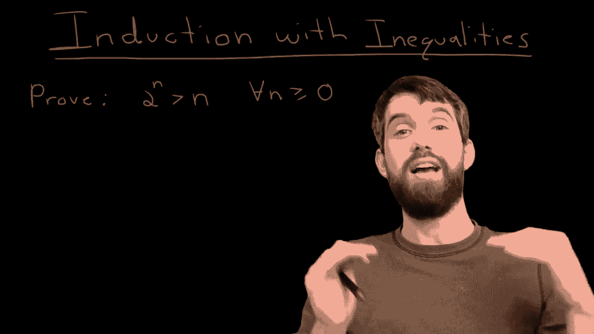
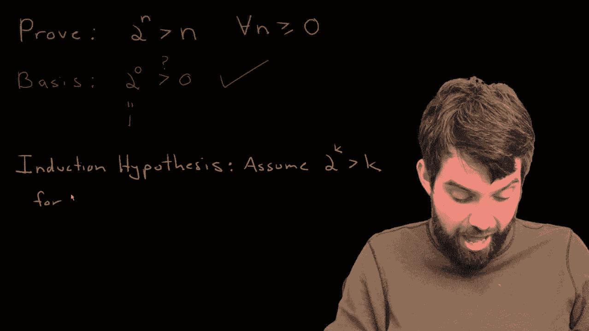
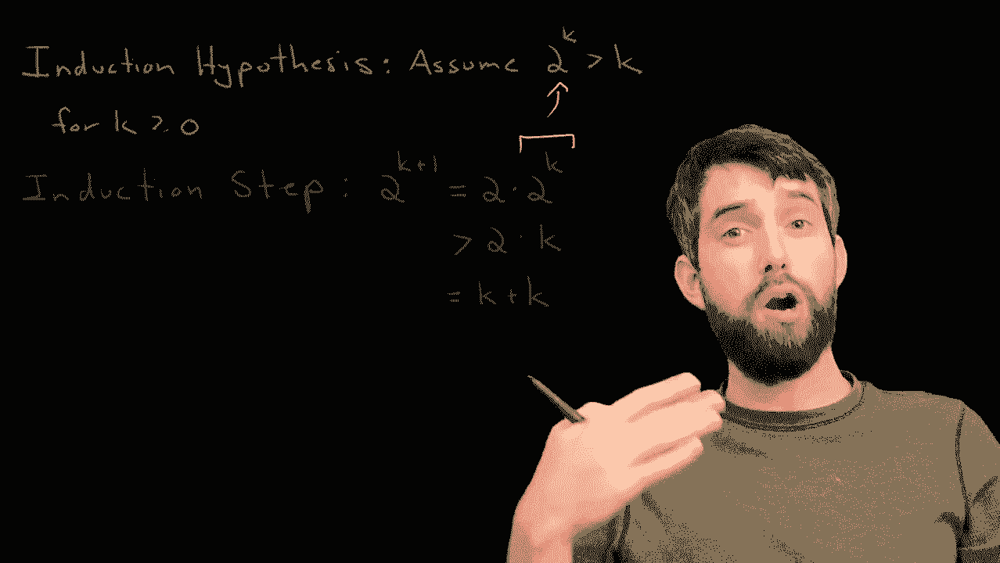
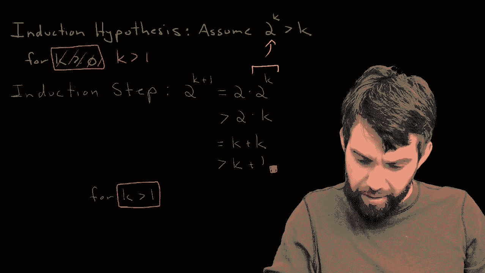
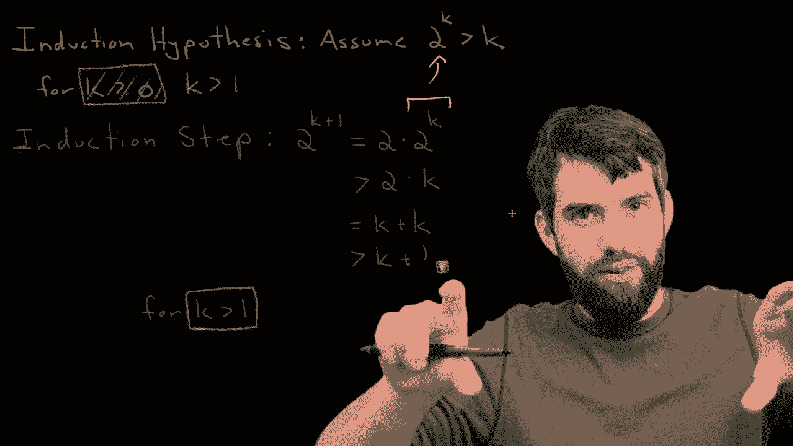

# 【双语字幕+资料下载】辛辛那提 MATH1071 ｜ 离散数学(2020·完整版) - P46：L46- Induction Proofs Involving Inequalities. - ShowMeAI - BV1Sq4y1K7tZ

In this video， I want to look at an example of induction that has an inequality unit it。

Indeed， we're trying to show that two to the power of n is bigger than n for all values of n greater than equal to0。

 By the way， theres many different text techniques to do this， you can do this using calculus。

 but in this video we're going to do it via induction。 Now induction is a couple different steps。

 The analogy I always use climbing the ladder， we have to be able to get onto the first rung of a ladder a basis step and then we have to know that if we're on the K throng of the ladder that we can climb to the K plus one rung of the ladder。

 And if both of those two things are true， then we're able to climb our ladder。 So first up。

 this is going to be the basis step。😊。

And the basis step is in most examples a little bit easy。

 you just plug in whatever your sort of starting point is and see that it's clearly true。

So we're claiming that this is true for all n greater than0。

 so let's try plugging in n equal to0 and see what we get Indeed，2 to the power of zero。

 that's just one， two to any value to the power of zero is1。😡。

And then the claim is， is this greater than just plugging in n equal to zero， well。

 one is indeed zero， so the basis here is true。

All right， so that's lovely， I'm definitely glad about that， but let us continue。

After we've done our basis step， what we next need to do is our induction hypothesis。

 this is assuming it's true at the KF level， and then we're going to show that it's true at the K plus1 level。

So I am going to use my induction hypothesis。

And what I'm doing is effectively just putting this formula in。

 but for the particular value k so I in other words。

 I am going to assume that2 to the power of k is going to be greater than k and this is going to work for some value of k which is greater than equalizer or I don't know what value it is。

 but some value。😡。

All right， so that's what I'm going to assume， that's what I'm allowed to use。

 but now I want to do the all important induction step。😡。

Now， the way that this works is that。I want to show something true at the K+1 level。

As in what I want to do is I want to begin and I want to look at two to the power of k plus1。

 and I want to do a bunch of work here。 I might have to do a whole bunch of tricky manipulations。

 but what I eventually want to get is that this two to the K plus1 is going to be greater than K plus1。

 And if that's the case， I've shown that this is true of the K plus one wrongg。

 that the two to the K plus1 is greater than K plus1。 Okay， so how do I connect these dots。

 this is where I'm hoping to go。 I'm hoping to get down here。

 but all I'm beginning with is the left hand side the two to the K plus1。😡。

The first sort of algebraic trick that sticks out to me here is that this can be thought of as2 multiplied by  two to the power just of K。

 Indeed， this is one of our exponential rules that A to the B times a to the C is a to the B plus C。

😡。

Now part of the reason why I did this is that what I'm really interested in is identifying this two to the power of k because I know something about2 to the power of k。

 that's something that we can use our assumption。 so I can say2 to the K is greater than K so this is going to be greater。

 the first two comes along for the ride and then it's multiplied by K。😡。

Now remember， we're trying to get this， say that this is bigger than k plus1 where we're y to show that 2 k is bigger than k plus 1 might seem obvious this is the case。

 but I want to be completely sure of this so first of all。

2K this is going to be thought of as just k plus k Now remember our goal is to say that this2k2 to the power of k plus1 is bigger than k plus1 currently I've got it bigger than k plus k。

 but k is in general going to be bigger than1 indeed。

 this is going to be bigger than k plus1 any time that we have k being something which is greater than1。

😡。

Now this gives me a sort of interesting point， as in if you look at my induction hypothesis。

 I assumed was2 to the K was greater than k for k greater than zero。

 notice how I put that k greater than zero then。

But I then thought that was reasonable at the time， but Id carried on this computation。

 as I've carried on this computation， I realized that what I'm really interested in is it being K greater than one。

😡。

So that's okay， I can deal with the K equal to zero and in fact I can deal with the k equal to1 case individually。

 I'm going to take my induction I apologize it was a reasonable guess and instead make it the K greater than one that we need and in this case。

 then our methodology works。😡。

So what we're effectively saying is we can get from the K step to the K plus one step by this little bit of trickery as long as we are bigger than the value of one。

😡。

So we've discovered the slight is symmetry in the indexing， but if we want to。

 we can come all the way back to our original basis here， and we can just add in a few extra ones。

 we can also note that， for example，2 to the one is greater than one， that's for sure true。

 we can note that2 to the two， which is four is greater than two， that's for sure true。

 So we can do those low value of K cases， until such time as we get being bigger than the value of one。

So I believe we have now proven it by mathematical induction， we've established these basis cases。

 these initial ones， we've assumed it's true at the K level and we've proven it's true at the K plus1 level。

 we've proven that two to the K plus1 is indeed bigger than K plus1 and along this route we had to deal with this little messy detail of the index where it started。

 but the big structure is the same and it's the same for every one of these different induction problems。

😡。

