# 【双语字幕+资料下载】辛辛那提 MATH1071 ｜ 离散数学(2020·完整版) - P47：L47- Strong Induction - ShowMeAI - BV1Sq4y1K7tZ

In this video， we're going to discuss the idea of strong mathematical induction。

Now we've seen the idea of mathematical induction before。

 This is the idea where if you wanted to climb a sort of infinite ladder of claims。

 then what you needed to do is to be able to get on the ladder at some point is in you needed to have a basis case that youd prove P of a and then you had this induction step where you said。

 look， if I'm on one red along with the ladder， say Pk I want to be able to get to the next run the K plus1 run So that was normal old induction what we're going to do in this video is something called strong induction and it's related but allows you to prove a slightly more general set of claims。

So the goal here。Is that we want to be able to prove some property， some P of n is true。

And P of n here is this whole infinite family of claimss， depending on the N， and in particular。

 we want to do it for all n bigger than or equal to a Often the A here is one。

 but it doesn't have to be。Then the way strong induction works is that there's going to be two distinct steps。

So the first step。This is referred to as the basis step。

And what we do here is I'm not just going to prove it for PA。

 as you might imagine that's what we would have done in regular old induction。

 we would prove that the first one was true， I'm going to prove that PA。😡。

And then I'm going to prove that PA plus1， and then I'm going to keep on doing this for just some finite number。

 I'm going to go up to a PB here。😡，So other words， my first claim is A and then I go improve a bunch of them。

 like say three or four of the different claims， and I go from all the way up to A to the B and I want to prove each of these。

These are usually the easier steps in our induction proof。

 just kind of like the way that proving the first one。

 usually it involves just plugging in some actual numbers like let's say A was1 and B was4。

 you would just have to plug in n equal to 1 and equal2 and equal to 3 and n equal to4 into your claim and see whether they were true。

 So usually there's relatively straightforward。 But there has been this complication that instead of just having a single thing to consider in your basis step。

 we have this collection of different things。All right， step two。

 this gets a little bit more complicated as well。In your so called induction step。

In regular old induction， what we did was。We assumed that the statement was true at the ca level and showed it was true at the K+1 level。

What we're going to do here is we're going to assume it's true at the cake level and all of the levels beneath it。

 I'm going to assume it's true for all of the lower levels。

And then I'm going show that it's true for the K plus one。So other the words。

 the conclusion showing it's true for the K plus1 level， that's the same。 So other words。

 this isn't changing for the conclusion。 it's still going to be the case。

 I'm trying to prove the K plus1 level， but what's changing here is that instead of just assuming the K level。

 I'm assuming all of the lower levels。 All right， so I am going to assume。That。

I'm going to index it by something called I， I'm going to assume P and the way this is going to work is that your I is just some sort of index variable that runs between your starting point。

 the A up to that value of K。😡，So it's going to be some index and I'm proving this sort of finite collection of claims。

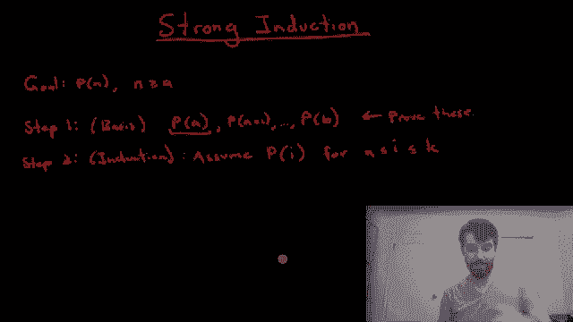

And then we're going to prove。P k plus one。

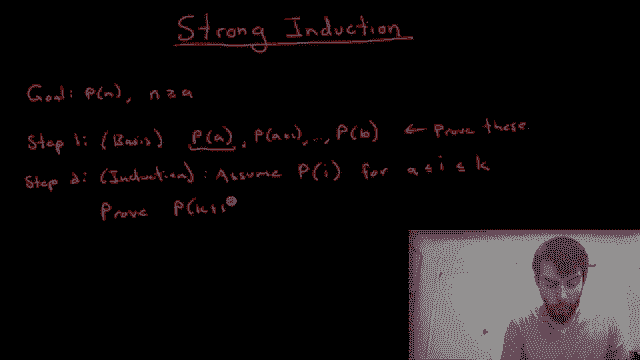

And if I'm able to do both of those two things， I've most be able to do the basis step and this induction step。

 then I'm going to get my claim P of n for all values of n greater than or equal to a。😡。

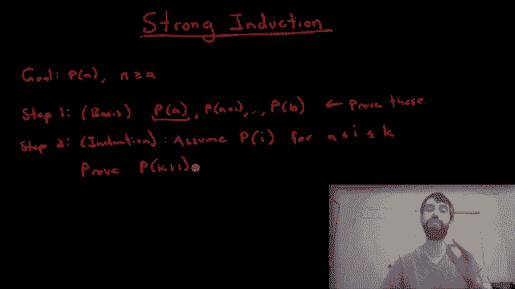

Alright， so let's see an example。 And this example is going to be some property about a particular sequence。

 So let me define for you the sequence first。This is the sequence where the first term is just equal to the value of one。

The second term， the A2 is going to be equal to the value of the three。

And then if I want to speak about the general term， it's going to work like this。

 the generic case term is going to be defined what we're going to say is recursively。

What it's going to be is that the AK is going to be equal to a k minus2。Plus twice8 K-1。

So we have to understand what we mean by this， but this is a so called recursive definition。

And we use the word recursive any time where one entry in the sequence depends on previous entries in the sequence in this case。

 to get to the AK， you need to know what AK minus2 is and what ak minus1 is。😡，So for example。

 I could use this and I could figure out that the value of a three， for example。

 I haven't done that one yet， is equal to whatever the value of a1 is。Plus， twice the value of a2。

 A1 is a3 minus-2， and a2 is a3 minus-1。But because I know what those are already。

 I can come and plug them in A1 is1。And a3 is going to be  two。

 so plus twice times3 is equal to the value of seven。Now， I claim the following。I claim that the。AK。

Is going to be odd， always。

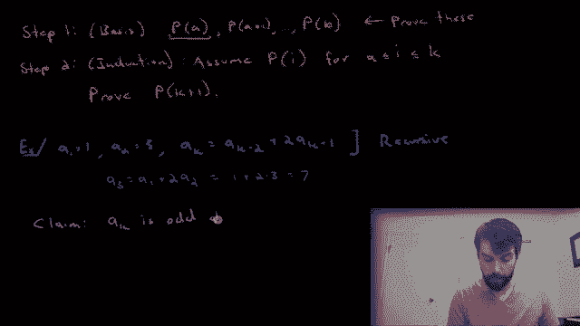

As in we've seen it' true for one and2 and three， we get the values of one and 3 and7 out。

 all three of those values are all going to be odd。

 but are we convinced that this is always true So I'm going to prove this claim and I'm going to prove it by strong induction All right。

 so in my proof。😡。

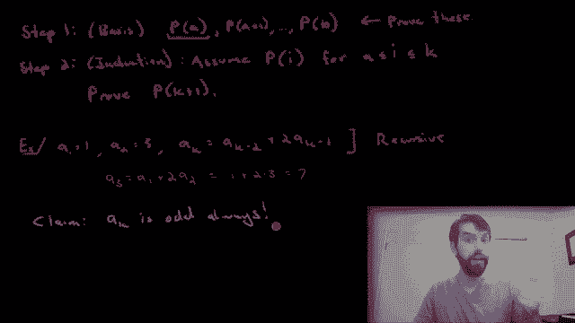

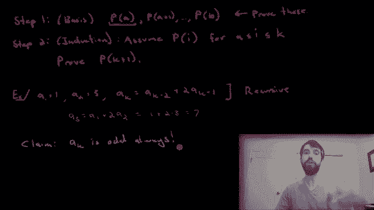

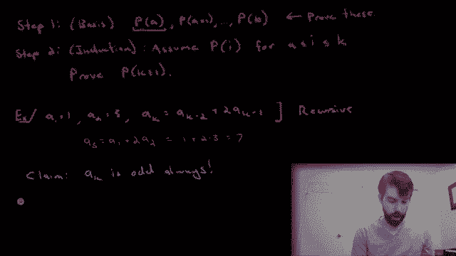

I am going to look at step one， first。

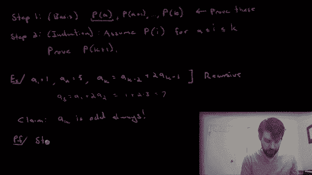

This is my basis step。 I have to think about what's appropriate for me to assume。

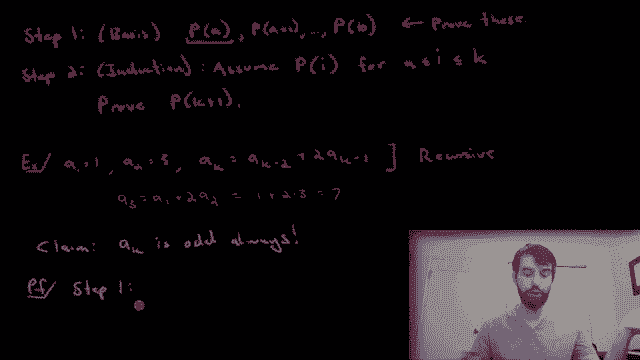

Notice that。To get to the A 3， I had to look back at the A2 and the A1。

 So it seems like you needed to have those two things know and first。 So I'm going to in my basis。

 I'm going to show that this is true for P1 and for P2。 In other words， I need to note that A1。

 which was just1。

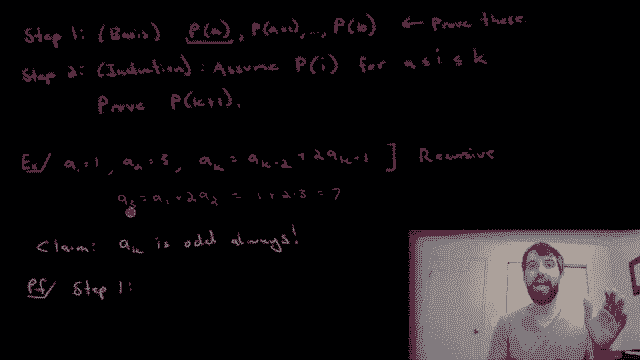

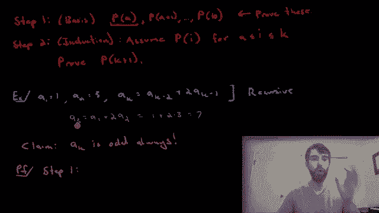

And a2， which is equal to3， are both odd。

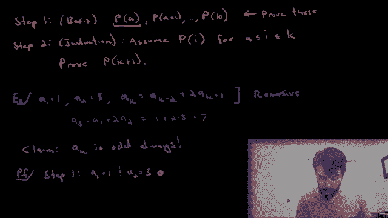

So this is my base as completed。 I've looked at the A1， I've looked at the A2。

 they both have this property and that's going to be sufficient。😡。

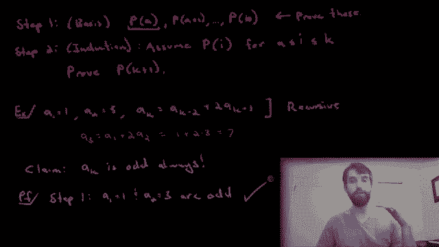

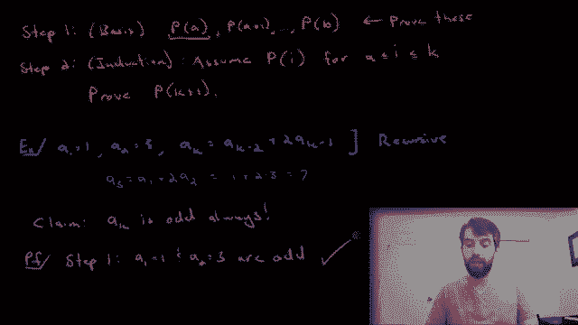

All right， so now let's go on to the induction step。

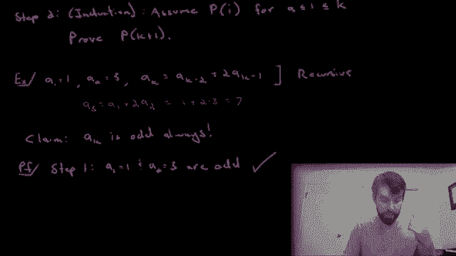

So then I'm going to be in the step two。So I am going to assume。

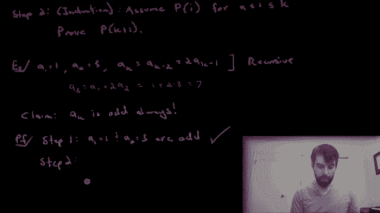

That。

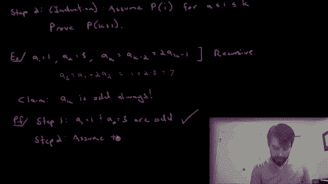

A and I use the subscript I for that generic indexing value， as I sort of did up there as well。

 I'm going assume that AI is going to be odd。

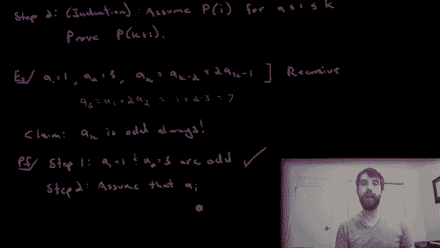

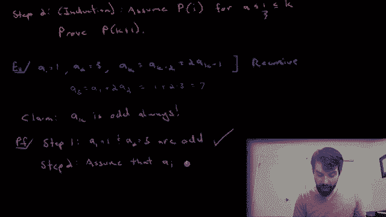

For all the values， notice that I started it at1， so from1 all the way up to I up to the value of K。

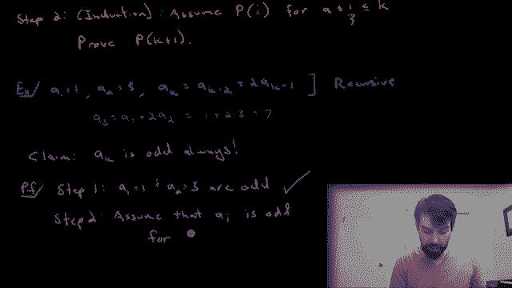

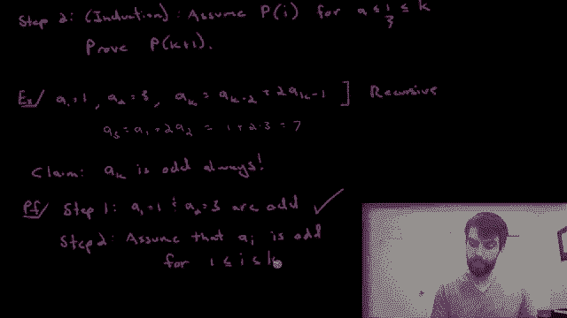

All right， now let's look and study this aK plus one。

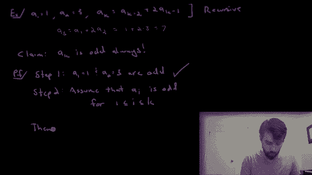

Now， I want to note for a moment that if we go back to the original formula that we have here。

 this was the definition， this told us that a K was related to the things too less than it。

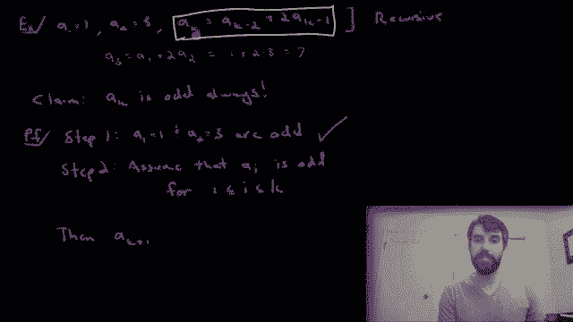

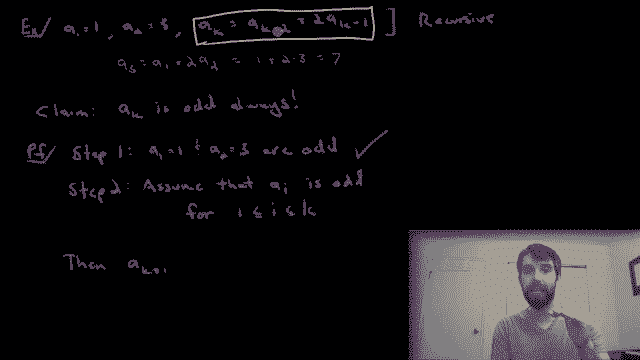

And one less than that， that's what our defining formula was going to give us。

So because I'm now looking at ak plus1， two things less than ak plus1 is ak plus1 minus1 minus2 is ak minus1。

So I'm claiming that this is equal to a k minus1。

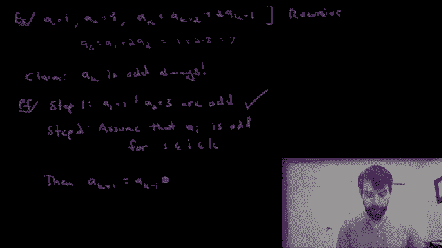

And then plus twice ak that this is the two different levels， one and two beneath ak plus one。

However， we know that both of these are going to be a by our assumption， so this is going to be odd。

😡。

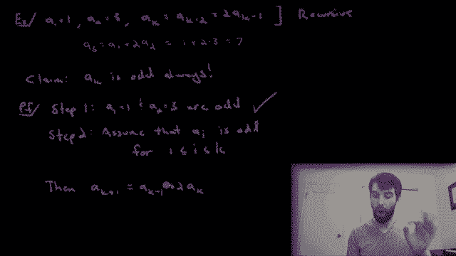

And this is going to be odd。

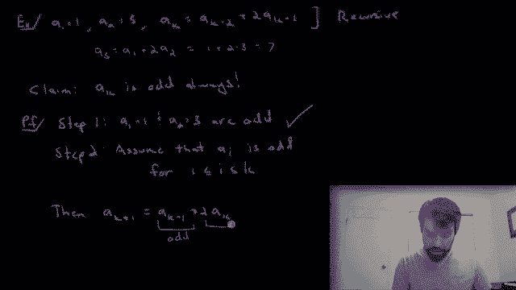

And this is true by our induction hypothesis， by this assumption that we have here that all of these previous level ones are going to be odd。

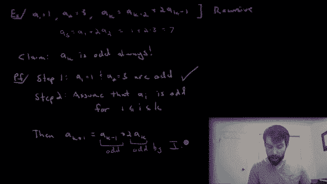

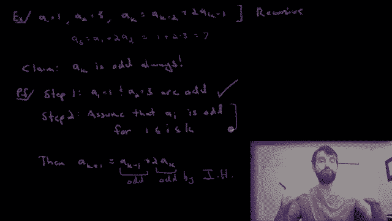

So how does that help me？

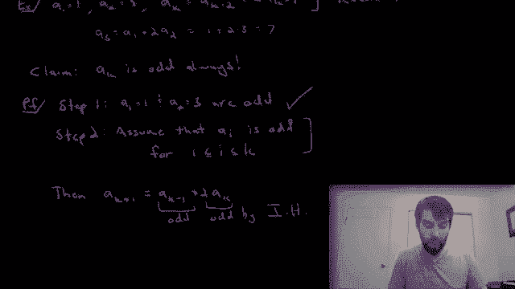

If they're both odd， then I know that I can write them in the familiar 2P plus one way。

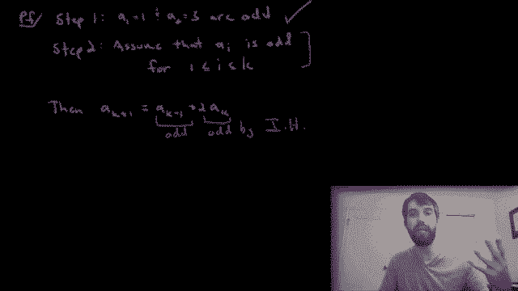

So in other words， I'm going to write the first one as it's an odd number。

 so I'm going to write it down as a  two p one。The second one's got this big two out the front。

 and then I have to use something else I use how about two Q plus one。

And this is going to be true for P and Q being some integers。

That's what it meant to be odd， and we assumed they were awed by my induction hypothesis。All。

' going to do a little bit of algebra to clean this up here I'm going to put all this stuff with twos on the left hand side。

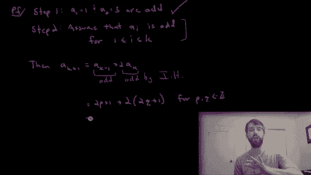

So in other words， I'm going to have a two looks like I've got a P。

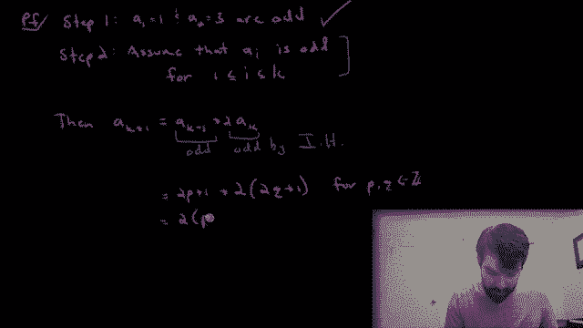

Then I'm going to have a two Q。Notice there's a two times two which is a four and there's a two times two which is a4。

 then finally plus a1。And then finally， one more plus one。

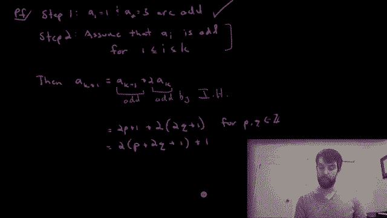

So what is this， this is going to be two times something。Plus one， as in this is my claim。

 this is an odd integer。

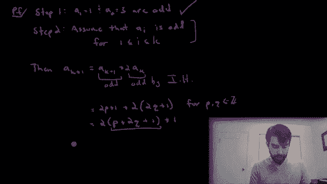

So my ak plus1 is odd。

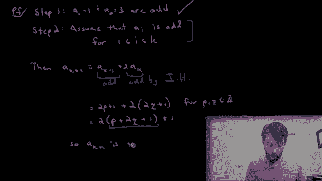

And that therefore concludes my proof by the strong principle of mathematical induction。

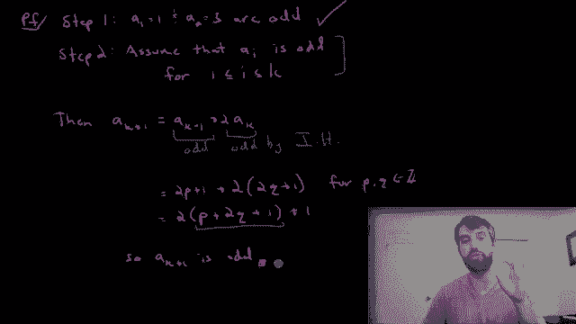