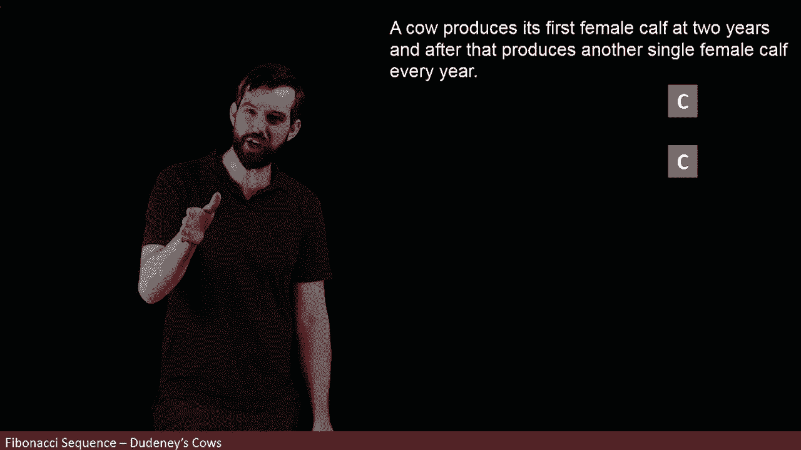
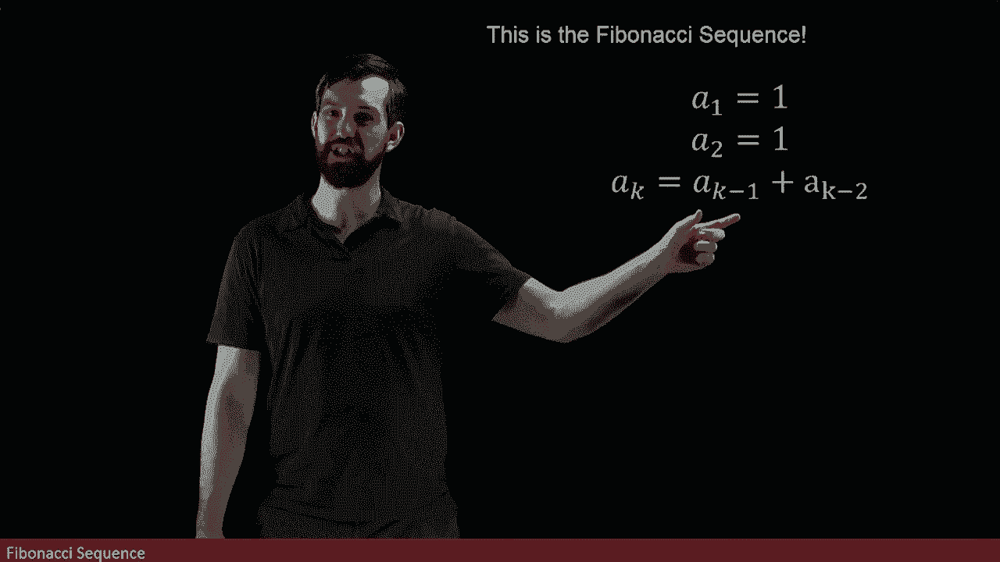

# 【双语字幕+资料下载】辛辛那提 MATH1071 ｜ 离散数学(2020·完整版) - P49：L49- The Miraculous Fibonacci Sequence - ShowMeAI - BV1Sq4y1K7tZ

In this video， we are going to look at one of the most famous， recursively defined sequences。

 the Fibonacci sequence。

And I'm going to introduce the Fibonacci sequence by an example referred to Dudtany's cows。

 and this is a logician that had a whole bunch of fun little math games like this and this example is going to become the Fibonacci sequence。

So here's the story we are imagining that we have a cow and that this cow is going to have another female calf。

 but it's not going to have another female calf for two years。

 takes a little bit of a while to grow up， it's only in its second year that it's going to produce another female calf。

And then after that point， we're assuming this cow isn't going to ever die。

 it just every single year it has another female calf。

 and then all those female caals have the same property。

 it takes two years before they start having children and then they have a female calf every year afterwards。

So then the question would be like after some number of years， like after five years。

 how many female cows are there？

So let's try to figure out what this is going to occur year by year， so at the very beginning。

 we've just got this one single cowist the cow I began with。

And then a year goes by and because this cow doesn't produce another cow until the end of two years as I start my second year。

 I'm only going to have that one cow， only one years gone by and so I had the first cow and then it's just hanging out there in this second year or the start of my second year and I still have that one cow。

But now let's look at what happens as I start my third year。

Well， the cow that I already have is going to still exist here in the third year。

 but it will also have bread once， and so I'm going to get two cows。

 the original cow that I had as well as it breeds here in its second year and therefore at the start of the third year。

 I can have this new female calf。

All right， let's iterate one more time。 Well the original cow I started with is still going to be there。

 This calf is still going to be there， but because the calf hasn't hit too yet。

 the calf doesn't produce any new cows。

But the original one still does， they're making one every single year。

 so I believe I should have three down at this level， the two that I started with。

 the original and the new cow， and then we get one more one that is being born。

 so I have a total of three。

Okay， let's go one more year into the future Well all three of these that I have we know that they're going to still be there。

 so we'll for sure have three。The blue original cow that's going produce one。

 it's making one every single year but but now the red cow is two years old and is old enough。

 and so she is also making new cows So we're gonna to have the three that we started with plus the two from the prior level are going to make two additional ones。

 and so I get a grand total of five。

Then I hope we see how the patterns turn to go， okay， in the next year， we have these five。

 all five of them are going to live。But it's not the five that's going to be able to reproduce。

 it's the previous step， these three that we have here。

 they are now going to all be old enough to reproduce， and so we're going to have three new ones。

 those are going to be reproduced by the three that are at this stage plus the five that we had。

So then if I let F of say three denote how many cows I have in the third year。

 then we can count them like this， there's one cow in the first year， one cow in the second year。

 two， three， five and eight going forward。Now， the key insight that I want you to notice here is that let's focus for the moment on the fifth year。

 I'm trying to make the fifth year， which happens to have five cows。

It was going to be the sum of two things， the sum of the amount of cows in the fourth year because all of those cows they just survive and they carry on So it's the sum of the things in the fourth year plus。

The amount of cows in the third year because it's the third year cows they're able to reproduce and making these extra new ones in the fifth year because of that two year gap。

So in other words， the F5 is the sum of the F4 and the F3， it's the sum of the two previous steps。

 likewise down here， the F6， which is8 is the sum of5 and three。

 the five cows that were around in the previous year and the three cows that were able to breed two years prior to this。

This。Sequence of numbers that we have here is known as the Fibonacci sequence。

 and I can define it recursively like this。I can say that the first two years are specified。

 there was one cow in the first year and one cow in the second year， but for all future years。

 we're going to say that the aK is the amount of cows in the previous year those are the ones just carried forward plus the ones that are able to breathe the amount of cows two years before it so this is going to be the Fibonacci sequence and sometimes we'll write it in this notation where we're defining it with a subK notation。

😡。

And sometimes we're going to use it this notation where because that's such a famous sequence and we give it the capital F for Fibonacci here we say the case step of the Fibonacci sequence is going to be defined in this way in terms of the sum of the previous two steps it turns out that the Fibonacci sequence is one of the most interesting sequences。

 there's a very large amount of things within mathematics there's a very large amount of things within other disciplines and just observable in nature where it manages to represent a lot of sort of underlying patterns as being the Fibonacci sequence so well for our perspective it was just sort of this cute little sequence that we define in terms of this sort of toy example involving cows。

 it turns out that the Fibonacci sequence has fundamental importance and a whole bunch of interesting properties that permeate a very large number of disciplines。

