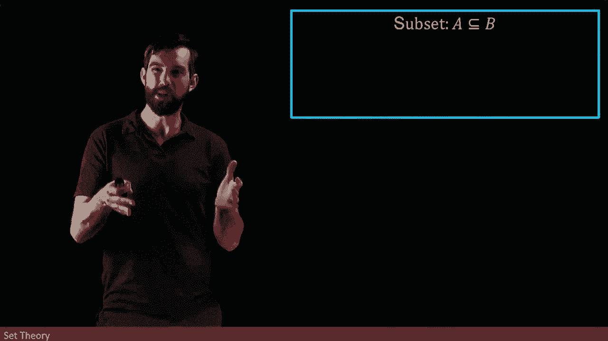

# 【双语字幕+资料下载】辛辛那提 MATH1071 ｜ 离散数学(2020·完整版) - P50：L50- Prove A is a subset of B with the ELEMENT METHOD - ShowMeAI - BV1Sq4y1K7tZ

I want you to recall the idea of sets。And when we first introduced sets。

 we saw that there was two different types of notation for sets。

 on the one hand we could have set roster notation。

 set roster was where I just listed all of the elements of the set。

And you'll remember that in my listing that there were a couple things that didn't matter。

 for example， repetition didn't matter and the order didn't matter。

We also have the set builder notation and set builder notation was a way that we could easily describe often a lot larger sets that were defined by some common pattern where there was some property that was read after the such that the vertical bar and indeed in this particular case。

 these two sets I've described are the same one，3，5，7。

 and so on that describes the positive odd integers。😡。

And then under set builder， the way I read this is this is the set of all positive integers。

 That's what n and z plus means set of positive integers。 such that that's my vertical bar。

 And then n equals 2 p plus1 for P and integer that was my way of describing odd integers。

 So this is the positive integers that are odd exactly the same as what we have over here。

 We also saw the idea of a subset。 And we would say that a was a subset of B。

 but I'm going to use a little bit more formal language now because were being equipped with it so far in our course。

 So I'm going to say that the formal definition of this is。😊。

If I start in A， if I choose anything that's inside of my A， then I must also be inside of my B。

This is thinking about subsets at the level of elements。

If I have this containment where a， the smaller set， if you imagine this is like a less than side。

 the A is the smaller one， if you choose anything in the side of the A。

 then it must also be inside of the B。

We can also apply our universal quantifiers to this by saying that this statement， if x is an A。

 then x is and b is equivalent to saying for every x and A， the x is also in B。

 so for every instance where it has this property of B in this set。

 then it must have this property of being in this other set。

Finally， we can visualize what's going on here in the following way。

 imagine I have just some set that I put down and I'm going to call this set B。😡。

Then because I'm thinking of A as a subset where everything is an A is also in B。

 then I can come along and I can put my A inside of my larger set B。

 and I think of it as a sort of fully contained inside of it。😡。

So let's see how we can formally prove this set containment in a specific example。

What I'm going to look at here is I have two different sets。

 the one set A is all integers that can be written as four times P。

And then the set B is all of the integers that can be written as twice times some Q where the P and the Q are both integers。

So then what we're trying to prove is that the A is a subset of B。

 that everything in the A is inside of the B。

Now， one way that we can help to visualize this before I get to my formal proof is the following。😡。

I'm going to write out the A and the B here and notice that only the highlighted yellow terms are actually in the set the A and the B are not all of these integers。

 but I have written out all integers and then I've highlighted which ones are actually in the set so for the A which is the 4p it's 0。

4，8 and 12。😡，And then for B， which is the 2 p， then it's the zero， two， four， six。

 all of the different even integers。So then the observation that I want to make here is that everything that was highlighted in the A set。

 the0， the4， the A and the 12 is also highlighted down here in the B set， mainly the zero， the two。

 the4， the6， the A， the 10 and the 12， there's more of them down here in the B。

 but everything that was highlighted in the A is a again highlighted down in the B。😡。

So while this is not a proof， it is still illustrating the idea that， yes。

 I think that a is a subset of B because everything that's highlighted in A is highlighted in B。

So now let's go and try to actually formally prove this。😡，So now let's try to formally prove this。

 I want to begin with an x value inside of a and this is what I am going to do remember。

 we are trying to prove for all x is in a X is going to be inside of B so I'm just choosing a generic one。

 a generic x is inside of a and then let's look at the definition of what it means to be inside of a note this is starting in the normal way that all of my direct proofs do begin with my assumption my assumption is x and a and then it applies my definition and I'm applying the definition of what it means to be and a。

😡。

So in other words， it says that my value of x here can be written as 4 p for some p which is inside of the integers。

 so there's some number here and that the x can be written as four times p。

Now comes the manipulation phase， but how should I manipulate。

 I'm going to look at my conclusion to get some insights here。

My conclusion says that I want to write the N as twice something。

 I have it written as four times something but I want to write it as twice something and I know that four is for sure a multiple of two。

 so I can come down here and I can write this as twice2 p。

And then if I'm going to let the Q value be equal to 2 p。

 then what this is just going to be equal to is twice Q。 And I believe thiss exactly what I wanted。

 I wanted for it to B And B。 it what need it to be N is twice Q where  Q is an integer。

 and if it's twice P where P is an integer， This is for sure going to be an integer。😡。

And so I can therefore addduce that my value of x。Is inside of B。So I began with x is in a。

 it was a completely arbitrary thing in terms of A， and I deduced that my X was inside of B， so yes。

 it is true that a is a subset of B。😡。