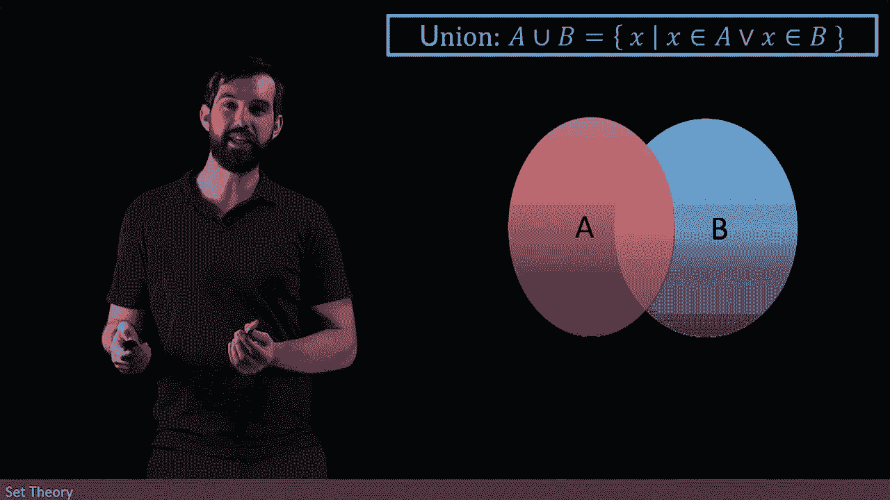

# 【双语字幕+资料下载】辛辛那提 MATH1071 ｜ 离散数学(2020·完整版) - P52：L52- The union of two sets - ShowMeAI - BV1Sq4y1K7tZ

Now we're going to look at the concept of the union between two cents。

And this is defined to be all values x， such that x is in one of two different sets。

 either the x is inside of an A set or the x is inside of a B set。

And I can see this visually by looking at two different sets。

 I've got an A and I've got a B in that perhaps they overlap or perhaps they don't overlap。

 I've drawn them in a way they overlap we don't know。

 and then the union is just going to be everything's it's every element that's in one or the other or I'm allowing under this construction both。

Now， you'll notice that in the definition of the union that right up here， I put an orR statement。

So the union is sort of analogous in the world of sets to the dejunctive ore statement that we have in the idea of logic。

 indeed， if we think about union as being some x's such that they obey some property that property is a dejunctive。

 it's an or statement， it's either in the one or in the other。

So then if we focus on a specific example like here's an A and a B and notice these are different A and B's and the ones for the previous example。

 but the A appears to be n equal to two p。 so that's all of the even integers when p' is an integer。

😡。

And the B here is n equals to the 2q plus1， so that's going to be odd integers。

So I've got the even integers as A， I've got the odd integers as B， and the question is。

 what is a union B？

Well， let's do the same sort of heuristic that we had before， namely for the A。

 I'm going to highlight all of the even integers because A was all of the eventss。And then for B。

 I'm going to highlight all of the odd integers because B was all of the odds。

And then if I think about what a union B does， it says it's in the one or the other。

 So I want to look at and highlight all of the ones that are in either the A or the B。

 but this is everything all of the evens are highlighted here。 All of the odds are highlighted here。

 So everything gets highlighted in the union。 So in other words， a union B。

 I think we can think of is supposed to be all integers。 Every integer is going to be highlighted。😡。

However， other rationals like three/ Has or irrationals like pi， they're not being highlighted here。

 only the even in the odd integers。To prove this， let's begin with an N。

 which is an element of a union B。

And note that what we're trying to do is we're trying to show a quality of sense。

 we're trying to show you that a union B equals the integers。

Which if you think about what a equality of sets means。

 it's actually two different claims tied together， I want to show that a union B is included in the integers as an A union B is a subset of the integers。

 and I want to show that the integers are a subset of a union B。

 that's what it means to make them equal is to say that anything in the one is in the other and anything in the other is in the one。

😡。

So what I'm going to do here is I'm going to make sure that every statement that I write down is if and only if that it works both directions。

 and that means that I'm able to take an element in A union B and show it' in the integers or I can take an element in the integers and show it's in A union B。

 that's what tells me that I have a equality。😡，So N in the a union B。

 I'm going to write a biconal arrow， which means it goes both directions in my implications。

 So N is an element of a union B is by definition， the same thing as saying that N is an element of A or N is an element of B。

😡。

So I've taken my initial assumption here and I've rewritten it based on what a union B is going to be。

And then I'm going to write a biconal arrow again， I'm going to apply the definitions of both A and B at the same time。

 So this is saying that n is even。😡，Or。And。Is odd。Now。

 one crucial fact about the integers here is that being an integer is equivalent to being either even or odd。

And so this property， n is even or n is odd is by quoting a previous result about the integers。

 is the same thing as saying that N。😡，Is an integer？

And then because I have got biconitionals both way， if I start in the union。

 I end up being an integer， if I start being an integer， I end up being in the union。

 and so I can conclude that a union V is equal to the integers。

