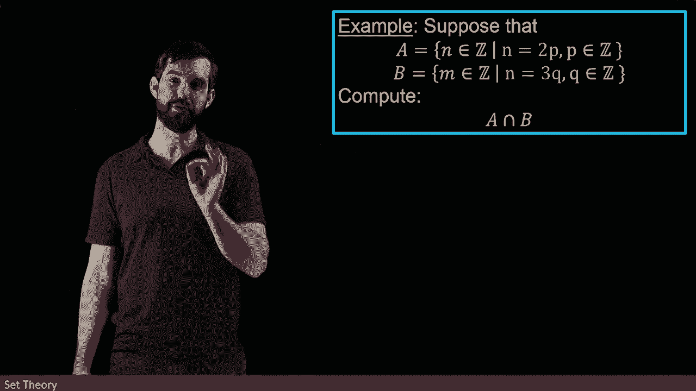

# 【双语字幕+资料下载】辛辛那提 MATH1071 ｜ 离散数学(2020·完整版) - P53：L53- The Intersection of Two Sets - ShowMeAI - BV1Sq4y1K7tZ

Now we're going to investigate the idea of the intersection between two different sets。

And now instead of it being my property having a disjunct of， it has a conjuncttive of here。

 it is an end statement。

You can remember this by the similarity between the intersection。

 which faces down and the and symbol， which looks a little bit like an A。

 So the intersection is going to have the X and A and the X and B。

So I can visualize that in the following way， so let me put up an A and a B here and I'm in this case。

 going to have them being overlapping so there's something interesting。😡。

If I want to say that x is in both A and B， then the intersections that that bit in the middle here。

 this portion that's sort of overlapping the shaded region in the middle where they are both in the A and the B。

 that's the idea of an intersection。

If the A and the B， by the way， were completely separate。

 there wasn't any overlaps and the intersection would be the empty set because there's no element that's going to be in both of them。

So let's see an example of this again， I'm going to have an A and a B。

 and notice I've changed the A and the B on you again， the A is going to be n equal to 2 p。

 so this is going to be all of the even integers。😡。

The B， however， is equal to n equal to3 Q， and this is going to represent all multiples of Q。

So then if I want to write it down， I can do the same trick where I'm going to highlight the integers that are relevant here。

 I'm going to highlight in the case of a， all of the even integers， 0，2， four， and so on。

And in the case of B， I've highlighted in yellow， all of the multiples of three，0，3，6，9， 12。

 and so on。So then the intersection are the things that are in both the A and the B。

 So let's think about how that works。 Okay， the zero is in both of them， so that should count。😡。

The highlighted two here is only an A， the highlighted three here is only in B。

 the highlighted four here is only an A， but then the six is highlighted on both of them。

So this looks like the multiples of six and indeed that's what a intersect B is going to be。

 it's going to be the zero， the6， the 12， all of the multiples of6。

 that's what it means to be both a multiple of two and a multiple of three。

So now if we're going to formally prove this， then I'm going to do the same trick as before。

 I'm claiming that this is going to equal all the multiples of six。

 so I'm claiming an equality so that means that I want to show if I've got something in the one it's in the other and if I've got something in the other it's in the one I want to be able to show both direction so the proof that I'm going to do is going have biconals logical implications that work both ways that every single step that tells me if I start in the intersection。

 I'm in the multiples of six and if I'm in the multiples of six I'm going to end up in intersection。

😡。

So let's start in the intersection just doesn't really matter。 We got to start somewhere。

 So I'm going to begin with let my N be an element of a intersect B。

 So that's my starting assumption。 And then as we know， our next step is always applying definitions。

😡。

So if n is in a intersect B， then it means it's both in A and in B。

 but that means that it's a multiple of two and it's a multiple of three。

So this is going to be the same thing as saying that n is equal to 2 p。

 and then this is also equal to 3q where the P and the Q are inside of the integers。

Now， if I focus on the n equal to 2p portion of this equation。

 notice that we're saying that if n is going to be a multiple of three。

 then 2 p is going to be a multiple of three。

But clearly two isn't a multiple of three， that's nonsense so in this formula the 2 p is a multiple of three。

 it has to be that the P is a multiple of three。😡，So in other words。

 this is the same thing as saying that this n here can be written in the following way。

 that's the2 and I'm taking this two here， but then the p itself is some multiple of3。

 so this is going to be two times3 and then I used to have a p in a Q so I may as well put an r here where r is going to be inside of the integers。

😡。

So indeed， if n is equal to two times three times R。

 you can split it up into these two cases and if you have it split up。

 you can put it together like this， so this is an if and only if。This is the same thing， of course。

 it coming and saying that n is equal to six times r for r inside of the integers。

And I am therefore going to finish with the following， I have to give a name for my set。

 I'm trying to say that what is equal to is the set of multiples of six。

 so I'm going to say that n here is an element of the set of all integers X inside of the integers。😡。

Where my x is equal to six times r for r and of the integers。And so indeed。

 what I have shown is that a intersect B is equivalent to this particular set down here。

 the multiples of sex。