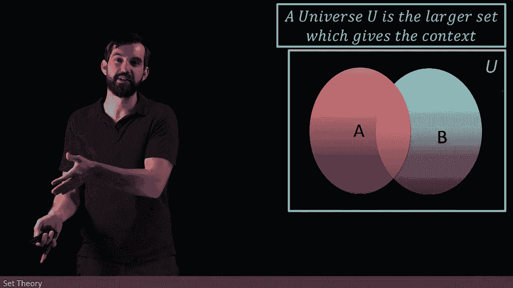

# 【双语字幕+资料下载】辛辛那提 MATH1071 ｜ 离散数学(2020·完整版) - P54：L54- Universes and Complements in Set Theory - ShowMeAI - BV1Sq4y1K7tZ

Now I want you to observe something about all of these different sets that I've been talking about。

 So here's just one such example that we've been looking at， this is the even integers。😡。

Notice， however， that that inside of my definition of the even integers began。

N is an element of the integers such that some property is true。

So this A in its definition is sort of living within the larger set of this integer。

And this is going to introduce us to the idea of a universal set。

 so imagine I just have some sets floating around， I got my A， I've got my B， but what domain。

 what context do we have， are we talking about integers are we talking about people are we talking about functions。

 Where are we broadly living， What our larger context。😡。

So what we have is the notion of a universe and we usually deote it by this a big square box on the outside。

 we call it you for universe here and all of the sets that we're talking about are all contained within this sort of larger contextual set。

 or in other words， we're going to say that the universe U is the larger context for whatever we are talking about it's just some big set and all of the other sets or subsets of it。

😡。

And then we can do an operation if we know what the universal set is gonna to be。 So， for example。

 let me just take one set A and it's living inside of the universal set。

 I can define something where I set a， notice I put a little C up here。 This stands for compliment。

 I am claiming that a compliment is not a it'ss it's all this stuff over here。

 all of the stuff which is around my set A， It's all of the things。😡。

That are not in a， but are still broadly in my universe。

So for example。

What is the complement of the even integers？Well it does depend on what my universe is。

 the complement of the even integers like within the all of the integers is going to be the odd integers。

 right every integer that is not even as odd， so if my universe is all of the integers。

 the complement of the evens is the odds。😡。

But if my broader universe that I'm considering is all real integers。

 things like pies and things like one half。

Then the complement of the even integers includes the odd integers。

 but it includes all of those other rational and irrational numbers as well that are not even integers。

 so what universe you're talking into is usually contextually understood or perhaps explicitly written down and if you know what the universe is you can take the complement of a set within a particular universe。

😡。

