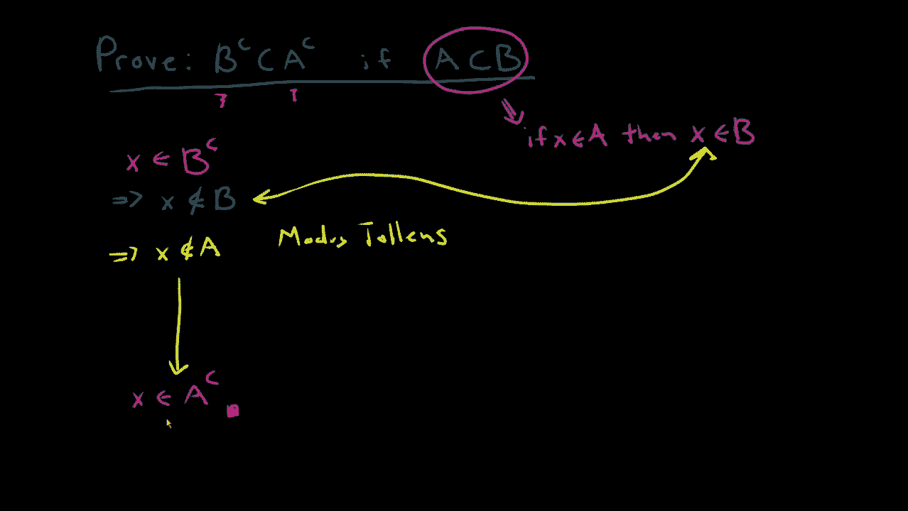

# 【双语字幕+资料下载】辛辛那提 MATH1071 ｜ 离散数学(2020·完整版) - P55：L55- Using the Element Method to prove a Set Containment w_ Modus Tollens - ShowMeAI - BV1Sq4y1K7tZ

In this video we want to prove a set containment， we want to show that the set B complement is going to be contained inside of a complement and the only thing that we know the only thing that we can use that we are given is the assumption that A is going to be a subset of B。

😡。

Now， how can I prove this， We are going to use something called the element method and the way the element method works is that you're going to begin with something in the left hand side。

 something in B complement。 and then what we want to show is that what you started with in B complement is necessarily going to be inside of a complement。

😡，That is the first and last blind of my proof are given the first line is going to be I want to start with an arbitrary element inside of B complement。

 and then I'm going to go about my proof and near the end of my proof I'm going to finally deduce that my X is inside of a complement。

😡。

And when I've got that， when I can come along and start and B compliment and finish up an a compliment。

 that will mean that I've done my proof。😡，Okay， so let's try to figure out how can we get there？

Now the only thing that I know currently is that x is inside of B complement and when I say x is inside of B complement。

 well what does that mean and the one thing I can think of about this is that that is going to imply that X is not an element of B。

 it is not inside of B， in fact this is just the definition of B in B complement it's saying that it is not inside of B。

😡。

Now I want to go off on the side and try to interpret what A as a subset of B is going to mean because this is the only thing that I can use。

 this is my only assumption that I have。😡。

So。😊，If I want to translate that， what it means is that if I have some X inside of a。😡。

Then my X is going to be inside of B。 That's what I have。 I know that if I'm in A， then I'm in B。

 but I want you to compare what I have with what is part of my proof。 What I have here is that。

X is not in B， and I can compare that with this claim if x is in A， then x is in B。

Well， what I have is in if one thing then the other， the other is not true。

 the other is not true because x is not in B and that is going to tell me。

That my X is therefore not an element of A。

And what I've done at this step is I have used Mous。

Tolens， this is one of the argument structures that we've seen before in this class and it says if P then Q。

 not， therefore not P。

All right， so I've got to the fact that if I start and B complement。

 I now know that I am not an A well what I want to get is that x is an a complement and I think there's nothing to be done here。

 I can just sort of fill up that blank space if x is not an A then by definition x is an a complement。

😡。

So what I want you to think about here is that。

Anytime I want to prove a set containment， this is just one of them。

 you want to start in the first thing， start in this case in the B complement and finish in the second in this case。

 the A complementment and you can use your definitions of what it means to be a complement and you can use what it means in your assumption in this case A is contained in B to be able to make your proof happen。

😡。

