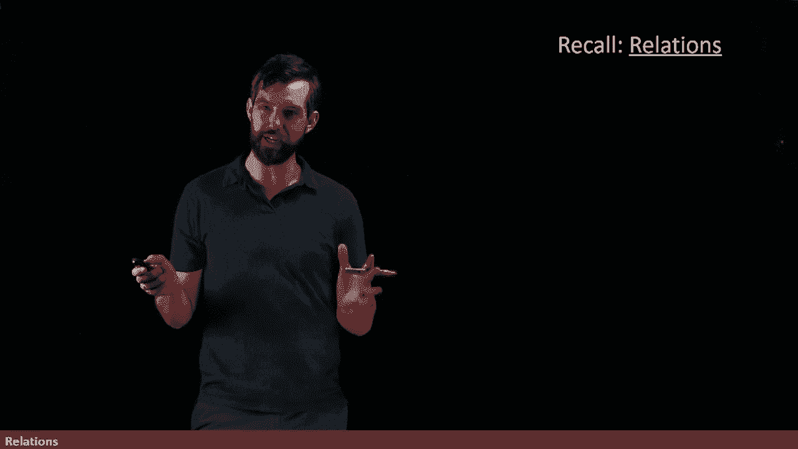
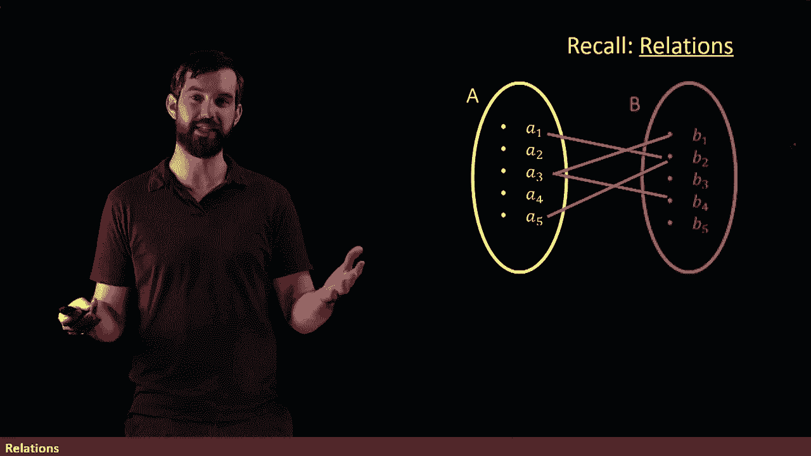
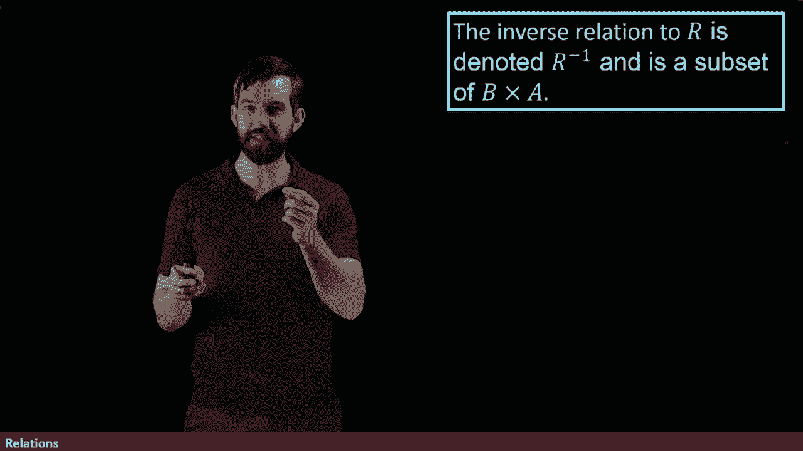
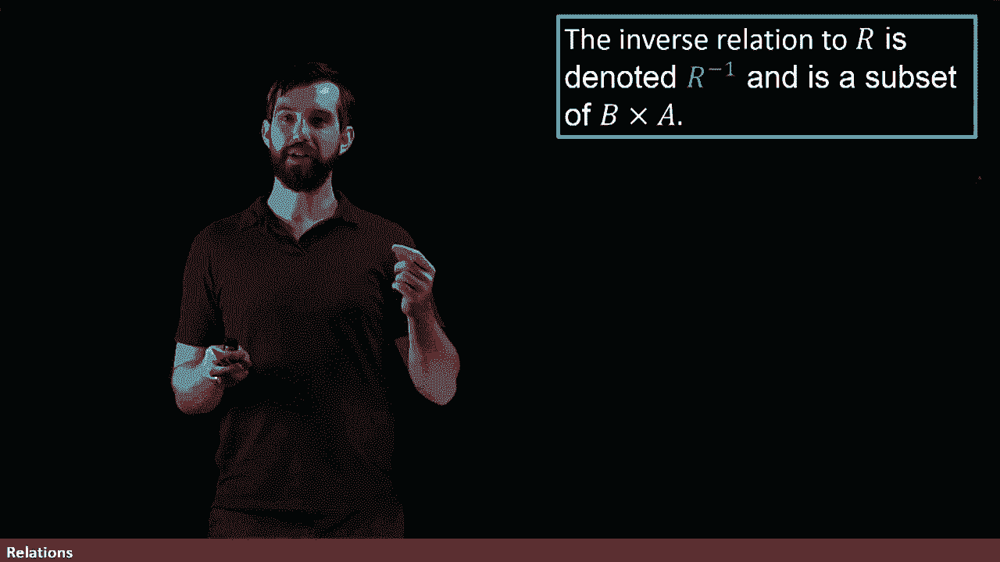

# 【双语字幕+资料下载】辛辛那提 MATH1071 ｜ 离散数学(2020·完整版) - P56：L56- Relations and their Inverses - ShowMeAI - BV1Sq4y1K7tZ

In this video， we're going to take a closer look at the idea of relations。

 which is something that we've previously seen before。

Now， you'll recall that a relation is something that involved two different sets。

 you had to set A and you had to set B， and I put a bunch of elements inside of A and I put a bunch of elements inside of B。

Then you could visualize sort of anarrow diagram for a relation。

 which is connections from the set A to the set B。 so for example I can have these connections where the A1 is going to go down to the B2 and the A5 goes to the B2 and the A3 is connected to the B1 and the B4 and so on。

😡，And then you would be able to sometimes say that a relation was a function if additionally it had the property of passing the vertical line test and that everything in the domain went somewhere。

 we'd previously discussed that。

And then our formal definition for what a relation was is going to be the following。

 It is a subset of the Cartesian product that is I look at all pairs， something in A， something in B。

 that's what the Cartesian product is， pairs， where you choose a first thing in A and a second thing in B。

😡，And then we say that some pair like say how about A1， B2。

 that is an element of your relation if when you look at this a diagram。

 a1 really is related to B2 and then the Normenclature we had we're going to say that an element in R is written as a relates to B precisely when little a comma little B was an element of your Cartesian product or there was an arrow up here in your a diagram now if I have a relation。

 I can also define something referred to as the inverse relation。😡。

And the idea of an inverse relation is it's exactly doing what the relation from A to B did。

 but it flips it around。

So for example， let me put up my relation R that I saw before。For the inverse relation。

 we're going to try to take the A in the B and we're going try to swap them。

 So I'm going put them up， I'm not going to fill in the arrow just for the moment。

 but for the inverse relation， first of all， the starting set。

 your domain if you will is the B or code domain is the A so I flip that order and then if I think about how I should be connecting these。

 Well， for instance， if I go over here， the B1 is connected down to the A3。

 the B2 is picked up to the A1 and the A5 and so on so I can fill in my lines like this where these connections are exactly this picture。

 but it's the mirror image of that picture。😡。