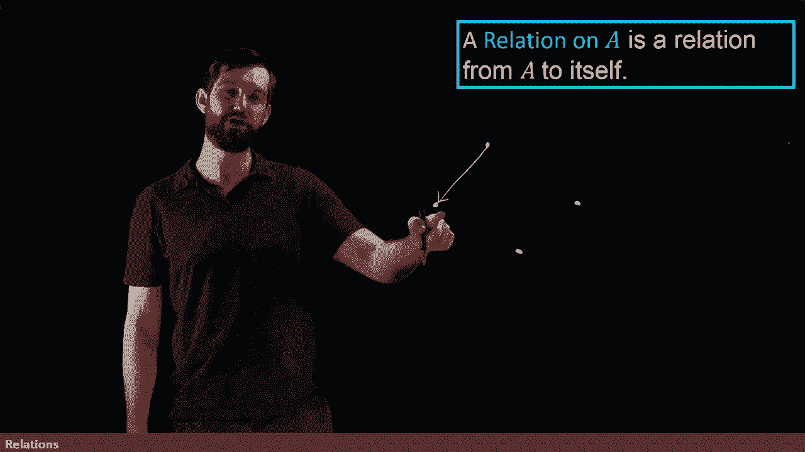
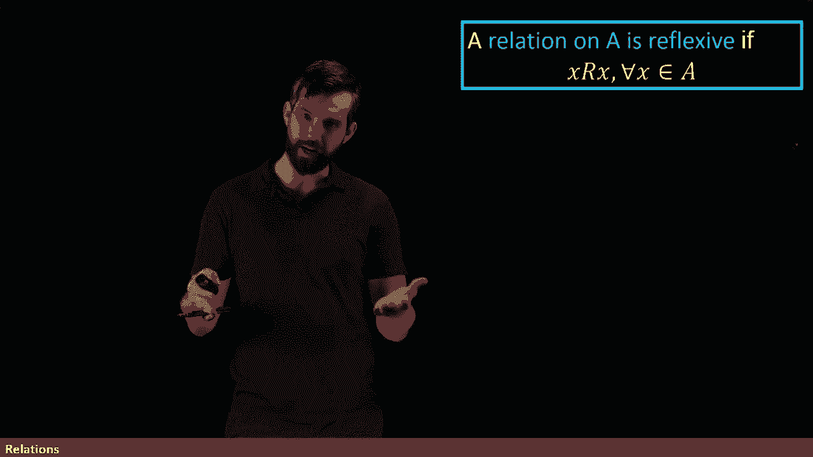
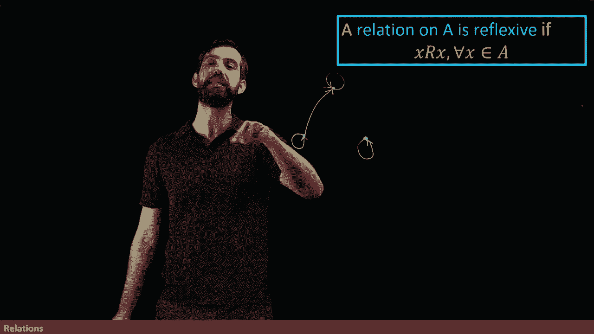

# 【双语字幕+资料下载】辛辛那提 MATH1071 ｜ 离散数学(2020·完整版) - P57：L57- Reflexive, Symmetric, and Transitive Relations on a Set - ShowMeAI - BV1Sq4y1K7tZ

I could also consider relations not from an A to a B， but from A to itself， this is perfectly valid。

 for example， we see relations or functions from say the integers to the integers all the time so I can refer to a relation on a but how should I think of this。

 How should I sketch this Well I don't have a domain and a code domain exactly。

 or at least the domain and the code domain are the same things I'm only going to draw one so how would I start by putting a collection of points down so these are just some points that are going to represent the elements of a。

😡。

And then one way to think about a relation was as an arrow diagram so you took elements in your domain and spat out elements in your code domain so what I'm going to do here is and I'm going to take an element hubbble like this one and where does it go and I'm going to draw an arrow to somewhere and this time I really do care about putting an arrow in because we can't use the trick of the domain in the code domain or on the left and the right so we have to indicate where I'm starting and where I'm finishing so when I draw an arrow I say I'm starting at this point and I'm finishing over here。

😡。

Maybe I start at this point and I finish over here。

And maybe I start at this point and then I finish right back at itself。

 and maybe this one moves around back to itself as well。

This kind of construct that I'm drawing where I put my points and then I draw arrows between those points which is a relation on a。

 an arrow diagram that starts on things in A and finishes on things in A。

 this is also referred to as a directed graph where you've listed your various elements and then you draw directed arrows directed means has an arrow hat on its just not just a connection between those various elements and you get some graph between the set A。

😡。

We then have a list of different properties that apply to relations on a set one of them is this property of reflexive so we're going to say relation is reflexive if it relates to itself。

Or in other words， if x relates to x for all values of x inside of the A。

So for instance， if I was going to have maybe I'm just going to put three points here in my set。

 so this is a set with just three things in it。

To claim it's reflexive means that any one of these 3x values is related to itself。

And related to itself means there's an arrow that starts there and finishes there。

 which is these little loopy things that I draw with an arrow on them。

 so this is saying that this point is related to itself。

 it's saying that this point is going to be related to itself。😡。

And it's going to say that this point。

Is going to be related to itself as well。 So all three points are related to themselves。 Now。

 it might be the case that there's other relations。 Perhaps this particular one is related there。

 and maybe there's more， maybe there's not。 But the other connections don't matter to be reflexive all that matters that every point has one of these little loops around it。

The next property we're going to talk about is called symmetric so one of these relations on a is going to be symmetric if it has the following property that if x were related to y。

 then y is related to X or in other words， for every payer that I might have any two elements。

 how about these two elements here。

Then if there's a relation in the one direction， the x relates to the Y。

 then the y relates to the x as well as drawn， this particular directed graph that I have。

 this relation on a is not symmetric， and it fails to be symmetric because if this point here is my X。

 and this point here is my y。 then I have a relationship between x and Y X is related to y here because of this arrow connecting them。

 but Y is not related to x because there's not an arrow that starts at the Y and finishes it the X。😡。

However， if I modified this and I came in and put an arrow like this。

 then it wouldnt become symmetric because the x related to y and the y was related to X。

And note that the fact that this Z that I have over here is completely disconnected doesn't matter because Z isn't related to either the X or the Y。

 I don't have to worry about there being a relation back。

So the idea is this， it is symmetric， if every time you have an arrow in the one direction。

 it immediately turns around as an arrow coming right back。

The final property that we're going to talk about is transitivity， and the idea here is this。

Suppose it's the case that you've got three different points and I've got an x a Y and a Z may as well label them here。

 Ive got an X， I've got a Y， and I've got a Z。😡。

And what you have is the following， you've got that X is related to Y。

 I've already got that X is related to Y good matches。

And Y is related to Z， Well， I don't yet have that drawn in， so let me put it on。

 I'm going to say Y is related down here to Z。

So X goes to Y， they've got a relation there， y goes to Z， I have a relation there。

Then what I have is that X is directly related to Z。

So here's the idea I can get from x to Z in two steps。

 I can go from x to y along the green path and then y to z along the pink path。

 but if it's transitive every time I can get to something via a long path。

 I can get there via short one as well as if I can go directly from my X to my Y。😡。

And now this directed graph I have is transitive because I can go from my X up to my Y and then my Y down to the Z。

 and when I have that cycle， I can then go directly from X to Z。

Note that there's also another loop that happens to be in here from our previous descriptions。

 notice how the y was related to the X， I can go from y to X and then from what we just wrote down I can go from x to Z as well。

 so there's a two step path here I can go from y to x and x to Z y to x and X to Z。😡。

But I can also go directly there's also a Y to Z path so we've always got to be careful as we start adding in more and more paths。

 there's more and more ways that it could fail to be trans enough so what you have to verify is that every way that you can get somewhere in a two step path you can get there in a one step path as well。

😡。

