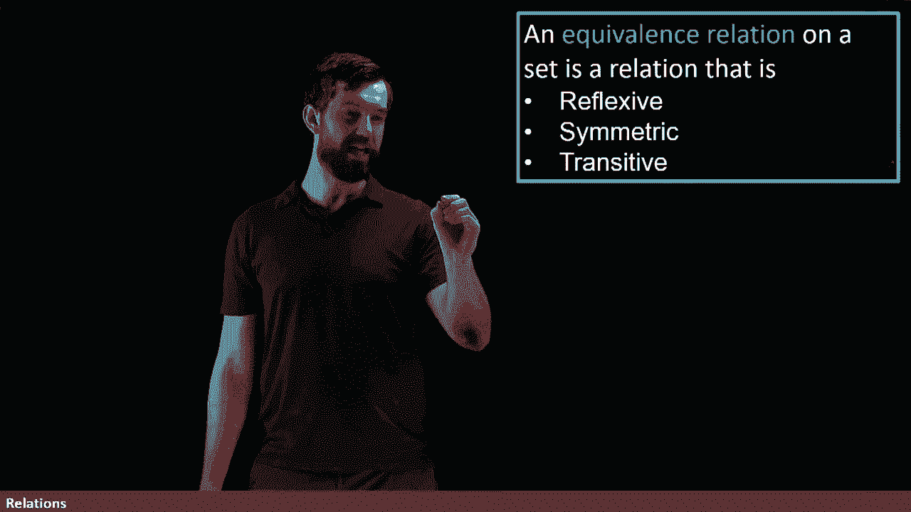
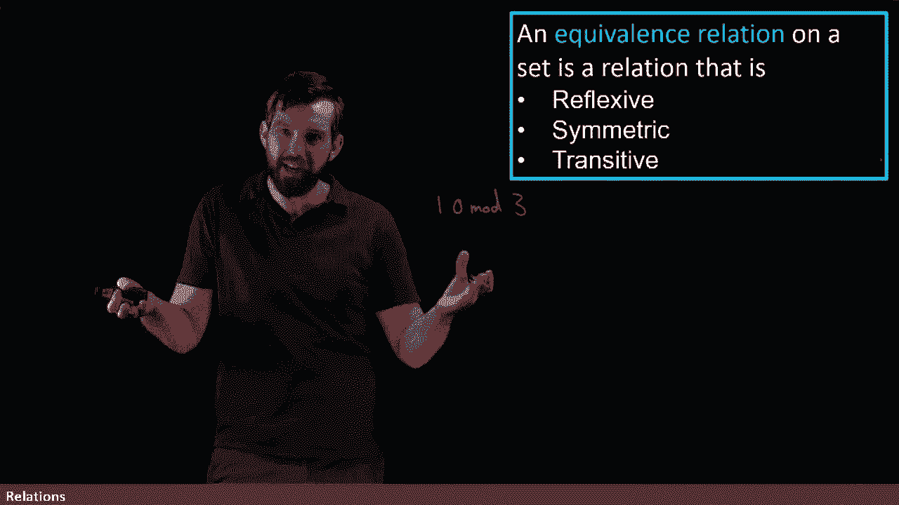
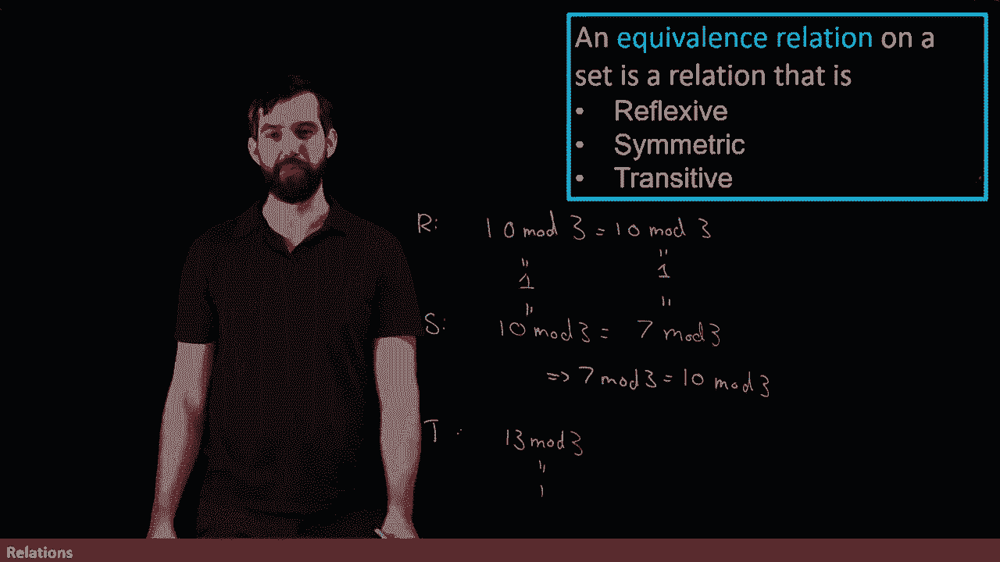
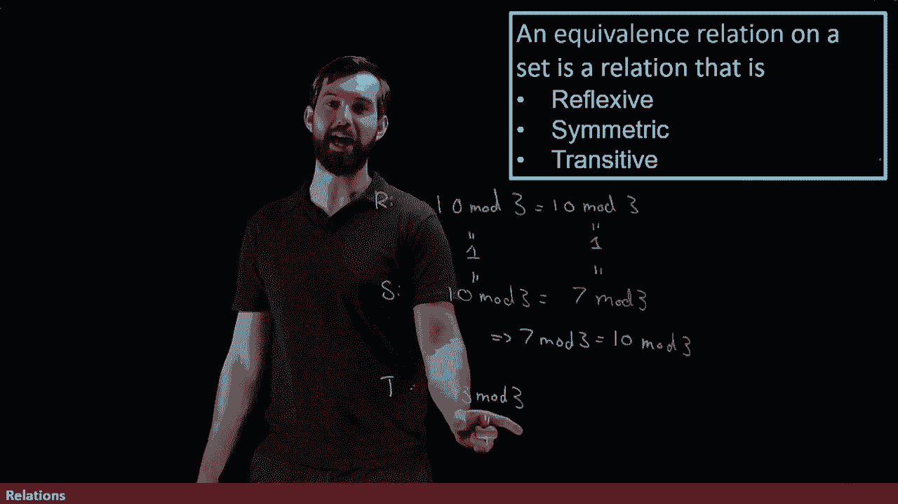

# 【双语字幕+资料下载】辛辛那提 MATH1071 ｜ 离散数学(2020·完整版) - P58：L58- Equivalence Relations  - Reflexive, Symmetric, and Transitive - ShowMeAI - BV1Sq4y1K7tZ

We are going to particularly care about those relations on a set that have all three properties that they are reflexive。

 they are symmetric and they are transit， this is going to be a very important consideration for us and when we have all three properties。

 we're going to call it an equience relation。

I'm going to give two examples ofque relations that you've seen before。😡。

The first is actually just normal O equality of numbers。

For example， if I just have integers， I want to see whether or not they satisfy these properties。

 well something like three is always equal to three， so that equality， which is a way， if you will。

 of relating numbers on the left with numbers on the right。

 equality is a relation on numbers and it's a reflexive one because three is always equal to three。

And then it's also symmetric in a really trivial way if you're like three is equal to three and I reorder them。

 then three is equal to three the other way around is clearly symmetric。

And it's also transit three is equal to three and three is equal to three。

 then the original three is equal to the third three。

 so equality is our notion of an equivalence relation。

And indeed， this isn't by coincidence。

An equivalence relation is really trying to capture the essence of what equality should be。

 but in a slightly more generalized concept。

So this is going to come apparent in the second example of an equivalence relation that you've already seen before。

 you just didn't know to call it an equivalence relation。

 and this is a quality of modular arithmetic。

The second example I want you to consider is modular arithmetic。

Suppose I have some expression like how about 10 mile three？

And we know that 10 mod3 is going to be the value of one。

 This is the remainder if you take 10 divided by3， or in other words。

 you can say 10 is equal to three copies of three plus one。

 so we know that this is just going to be equal to the value of one。😡。

Doing the reflexive point is pretty trivial here， we're just going to be saying that this is exactly the same thing as 10 modo 3 which is also equal to1。

 of course it is， so indeed is reflective， the x is related to the X so a quality and mod arithmetic obeys the reflexivity property。

😡。

Well that's a little bit less interesting now let's go and look at the symmetric property。

If I look at 10。Modulo3， well， I can also say I know this number is one。

 but there's other numbers that equal to one as well， how about seven moddulo three？Indeed。

7 is twice3 plus one， so it has the remainder of one either way。

 So so all of these turn out to be equal to these values just of one。😡。

But what we're saying is that in this case we've got x is related to Y。

 but notice that the x and the y， they really look different now， in mod arithmetic。

 this equality here is this equality between these weird symbols and we know that they're just equal to these numbers。

 but they really are represented symbolically very differently。😡。

But then if I flip this around and try to write seven mod three， well。

 that is also equal to 10 mod three， indeed， these are both just equal to one and one is equal。

So we have this symmetric property for modarrithmetic。

 if you have two mod things that are equal and you flip their order around。

 they're still going to be equal。And then for transitivity。

 I'm not going to write the entire thing down， but I'll note that if I choose yet another one。

 how about what do I want to go to 13？

Modulo3， which is just yet one more example of something which is equal to one that has remainder 1。

 13 is going to be four times three plus a remainder of one。

Well， if you have that 10 mod three equals seven mod three and you have that seven mod three equals 13 mod three。

 which you have both of those。Then the 10 mod3 equals the 13 mod3 as well。

 and so you can get transitivity for your modular arithmetic。😡。

Now I haven't really formally proven it， I just did a quick example with some numbers。

 but I think it's enough to illustrate the idea that normal the quality of numbers and this modular arithmetic are two examples of equivalence relations。

