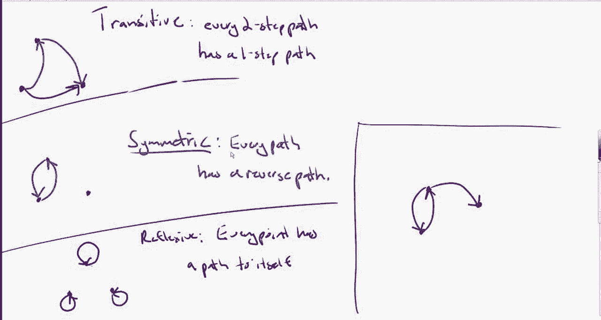
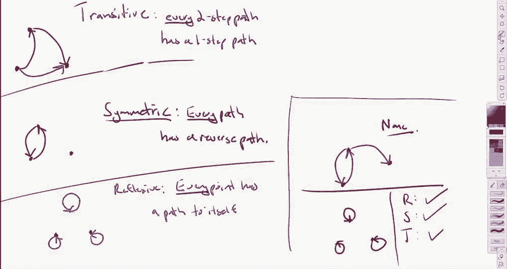

# 【双语字幕+资料下载】辛辛那提 MATH1071 ｜ 离散数学(2020·完整版) - P59：L59- You need to check EVERY spot for reflexivity, symmetry, and transitivity - ShowMeAI - BV1Sq4y1K7tZ

Example here， do， do， do。Do， do do， and then I'm going to put one back like this， okay。

So what do you think？😡，Is this example symmetric？😡，In your mind。

 ssymmetric being is sort of the middle property here。Yes， because it it has the。The reverse。

Cause it's got this because you're looking right here and you're like， look。

 it goes out and it comes back， right， So it's symmetric， right。

 I'm totally with you except now I managed to trick you。 And here's the condition。

 If you see how I phrased it， I said that。

Every path has a reverse path， so you're sort of right like in this region right here。

 that path that goes out， does have a path that's coming back。

 but there is not like a path that's coming back on this other guy over here。😡，So it's like， yes。

 it has that symmetric property at one point， but to be symmetric。😡。

Every one of these paths has to have a reverse path。 and to be transit。

 every one of them has to have a reverse path。 And to be reflective。

 every one of them has to have that like little loop right back to itself。 So in this case。

 it is not symmetric because that it doesn't have this path back here。😡。

Not transit because I have a two step path that does not have a one step path and it's not clearly not reflective。

 there's not even a single one of these loops， so this one here is actually none of the three。😡，Okay。

So it's kind kind of like I don't know， a funky one， I'm going to give you one more example。😡，Okay。

I'm going to give it。So oh actually I guess I copy and pasted the same one that I did before。

 so here's this example and I guess my question is is whether it's reflexa。

 whether it's symmetric and whether it's transit， we've got all three different properties okay what do you think reflexa first。

😡，诶。Refflexive because it it pretty much looks like the other example。

 Yeah it turns out that I I didn't even need to write it again。

 clearly reflects that everyone on head to loop， right， Okay， but here's where I might trick you。

Do you think it's symmetric or do you think it's not symmetric？😡，AndNot symmetric。

And you're saying not to magic if I'm correct because you're saying， look。

 there's none of these little loopy do dads， right？😡，Yeah。Perfect。

 then I got you at the important point。😡，你备。It'sThe exact way it's phrased is。😡。

Every pass out has a reverse path， okay but this doesn't have any path out that it needs to reverse。

😡，And likewise， in the transit of case， it has no two step paths that require a one step pass。😡。

So this actually is symmetric and it actually is transitive in like a really e vacuous way because's basically the condition it was。

😡，If there's a path out， then there's a path back。😡，But there are no passeds out。

 so there doesn't need to be any passback， so it actually like in a truly trivial way is symmetric。😡。

And over in a totally trivial way， every two step path has a one step path。

 there are no two step paths。😡，So there doesn't need to be any one step path。😡。

Does that sort of make sense？Yeah， that's really tricky though。

 but it makes sense Yeah it's like it's it's not how people I think。Anticipated， actually。

 the storyline module or the storyline。Quiz on this subject was poorly poorly done。

 it was actually one of the worst done ones， and I think this is exactly that distinction。

 so I'm glad that we cleared that up in this case。😡。

