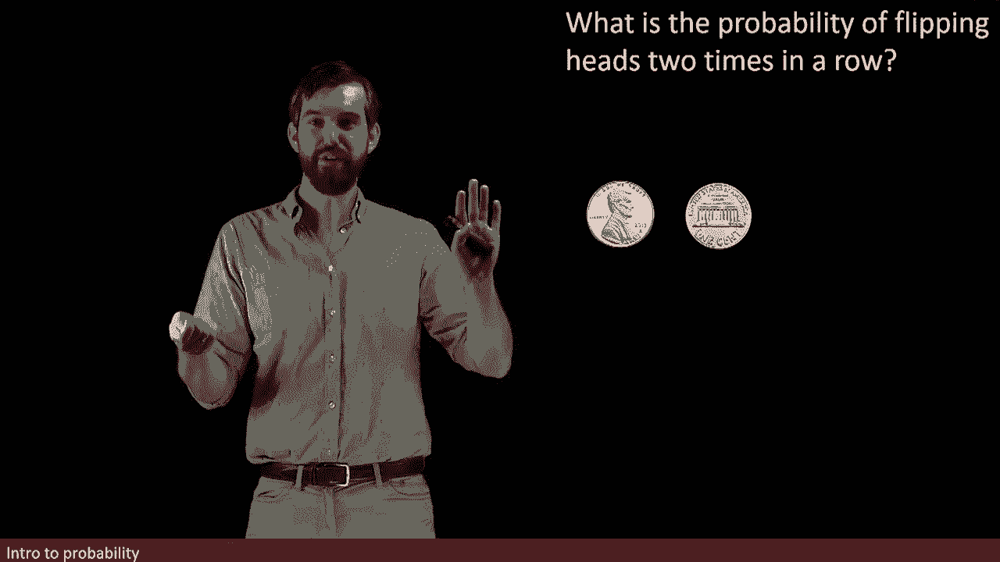
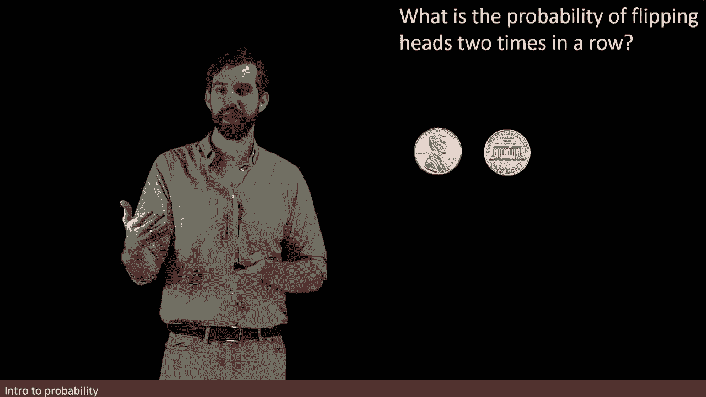
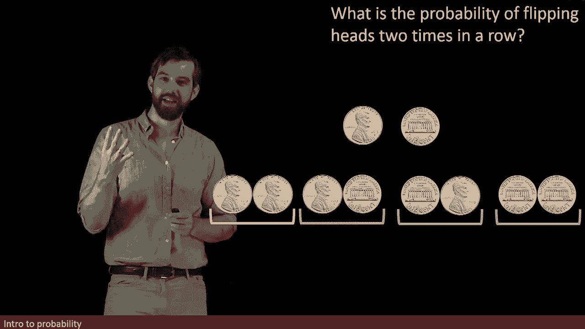

# 【双语字幕+资料下载】辛辛那提 MATH1071 ｜ 离散数学(2020·完整版) - P60：L60- Introduction to probability  _ Events, Sample Space, Formula, Independence - ShowMeAI - BV1Sq4y1K7tZ

Over the next several videos， we're going to take a look into probability and counting and counting is something that we've done all of our lives and something that we probably think that we're pretty decent at。

However， it turns out that if we want to count very large numbers of items。

 that there's a lot of intricacies as we try to formalize that process and try to do it well and that the basic idea of counting has a lot of really interesting angles that we can take a look at and that's what we're going to investigate over the next several videos。

So let's begin with this specific example， what is the probability of taking some coin and flipping it heads twice in a row？

So let me take one single flip of my coin and there's two different possibilities that can come up。

 either I can flip my coin and I'm going to have come up heads or I can flip it and it's going to come up tails。

So there's two different cases， those two cases are equally likely。

 and we're going to say that there's a 50% chance it's going to be heads and there's going to be a 50% chance that it's going to be tails。

So now let's count all the possibilities if I flip it a second time。

So let me suppose first of all that I begin with it being heads， that was my first flip。

 so I'm going to look down here as flip and then for the second flip what I get is a second heads that's one possibility heads heads。

The other one is I begin with my heads that I have here and I'm going to flip a second time and it becomes tails。

Or it could be that I'm going to start with my tails and I a'm going to flip it it's going to become heads or start with my tails and I flip it and it's going to become tails。

So what we really get is that after there's two flips。

 there's going to be these four different cases， one of them is heads， heads， and then heads， tails。

 tails， heads， and tails， tails。So since there's four cases and all four cases are equally likely。

 this is not a weighted coin， it's just as likely it flips up heads as it does tails。

 then the probability of it being two heads in a row is going to be one quarter and the way I deduce this is that there's four possibilities that's where the quarter is going to come down。

 one of them is the correct one， the one I'm interested in。

 so there's one out of four possibilities or in other words， this 25%。

As these examples get more complicated， we want a systematic way to be able to list all the different possibilities and we do that by something called a tree diagram so what I'm going to overlay on my pennies here is that I'm going begin at some starting point and that the white lines are going to thread and connect the possibilities so for example after we started it diverge with the two different cases that first flip could either be the head of the tails。

😡，And then if it happened to be that it was going to be a heads that that was going to diverge into these two different possibilities。

 that was a tail， then that was going to diverge into the two different possibilities。

And indeed we could go a little bit further here， suppose I was interested in what happened after that third coin well I've got four of these cases to get a little bit too much to draw it all on the same screen but let me start from here and try to split this into two different cases and then when I flip the third coin there's two different cases away as well it goes tails heads。

 heads or tails， heads， tails and then for each of these possibilities it would have a similar splitting we could go down into the fourth flip。

 the fifth flip and every time this tree diagram would get increasingly complicated。😡。

What we're now going to do is standardize some of our notation and terminology。

So I'm going to refer to a sample space， this is all of the different possibilities， it's some set。

 and it lists out all the possible possibilities in whatever particular example I'm talking about。

So for example in the flipping coins twice example。

 the sample space is all of the pairs of coins that have been flipped。

 so for example heads heads is one such pair in this larger sample space and what we'd seen was that there were actually four different possibilities so this sample space is a set with four entries。

 these four different pairs of coins。

Then I could be focused specifically on a specific event within this larger sample space。

 and this is going to be denoted by the symbol E and refers to some subset of the larger sample space S。

 So in the example we were looking at we were interested in the particular pairing heads heads。

 So the set that only contains that one pair， the one pair heads heads is a subset of all of the possibilities that say subset of subset of the sample space and is a specific event。

😡。

We then can refer to the probability that an event occurs and we write it like this。

 the P denotes probability， and you say the probability of a specific event living inside of this larger sample space and in our specific example we said that the probability notice how we denoted it with P of the heads heads。

 I just gave it some name heads hyphen heads is equal to the 0。25。😡。

Now， let's think back to how we computed this probability。😡。

What we said was that there was one event that we were interested in， the headsheads。

 and that there were a total of four possible events。

 the sample space had four different items in it。And then we just said， well。

 it's one divided by four。

So that pattern， that rule， is true generally if。

All of the outcomes are equally likely and for a coin that is the case it's equally likely that we flip a heads or a tails at any particular stage and since we do that twice all of those four outcomes are equally likely so when that is the case if I'm interested in figuring out the probability in an event we can say。

 well well what is the size of the event that we're interested in the example we saw where it was only heads heads there was only one thing we were interested in so it was one。

😡。

And then we divide that by the total size of our sampleal space， in our example， that was four。

And we can formalize this as saying that it is N of E over N of S where Notees the number of elements in our event divided by the number of elements inside of our sample space so in our specific example。

😡。

We were going to say that the number in the heads heads situation。

 there was just going to be the one of them。

However， the number in the total sample space， there was four possibilities。

 so we were going to say there was four of them， and that's why we are going to say that the probability of getting the heads heads was the one divided by four。

😡。

So this rule generalizes the intuition that we had in that more simplistic example in this example。

 it's very similar to the previous one， but with a twist。

 the event that I'm interested in is no longer flipping a heads and then another heads what I'm interested in this situation is what I've got one head and one tail。

 but I don't care which order it comes in， it could be heads then tails or it could be tails than heads。

 I don't mind。😡。

So let's look at the four different possibilities as we had before。

 but now the ones that we're interested in change now we're interested in the two yellow ones where it goes the heads and the tails and the tails and the heads。

 those are the two pairs that I'm interested in。

In other words， the size of my event is now two the size of my sample space hasn't changed。

 there's still these four different possibilities， it's just that I've changed what I'm interested in and so the probability of getting one head and one tail in any order where we don't care about the order is going to be the number of elements in my event which is two。

😡。

That's why I write two over here， divided by the number of elements in my sample space。

 which is the four as it was before， and so I get a 50th% probability。

So the key thing to note here is that you should be paying attention to two computations。

 one is the total size of your sample space， you do that every time。

 but additionally you have to look at how many elements are there going to be in my event that I'm interested in it and in this case there was two in the prior case there was only one。

😡。