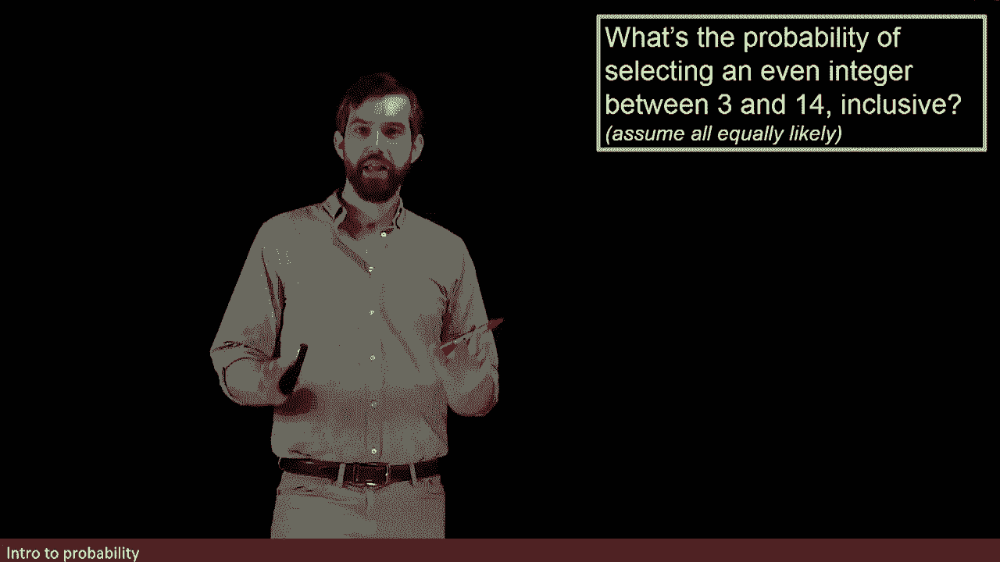
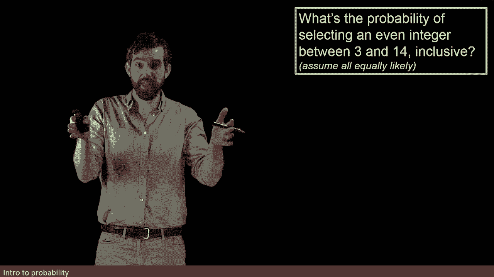
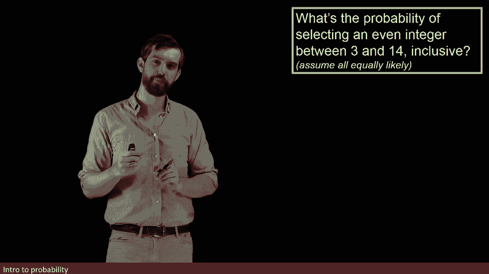
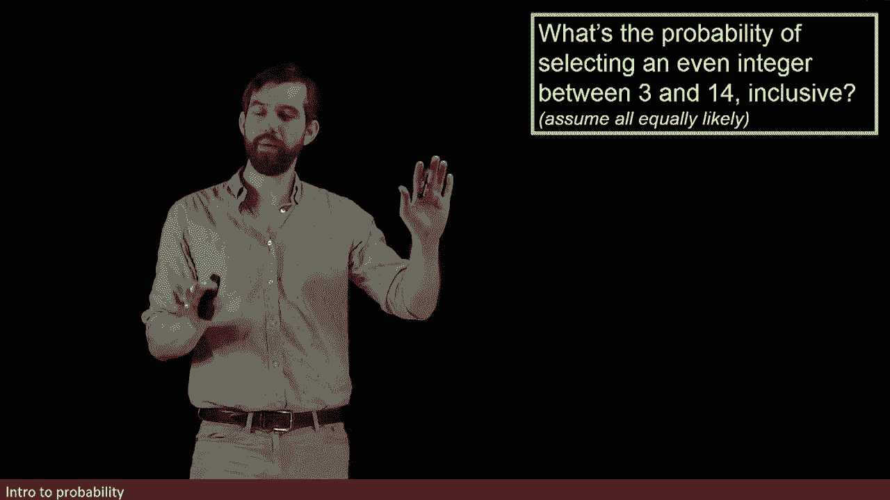
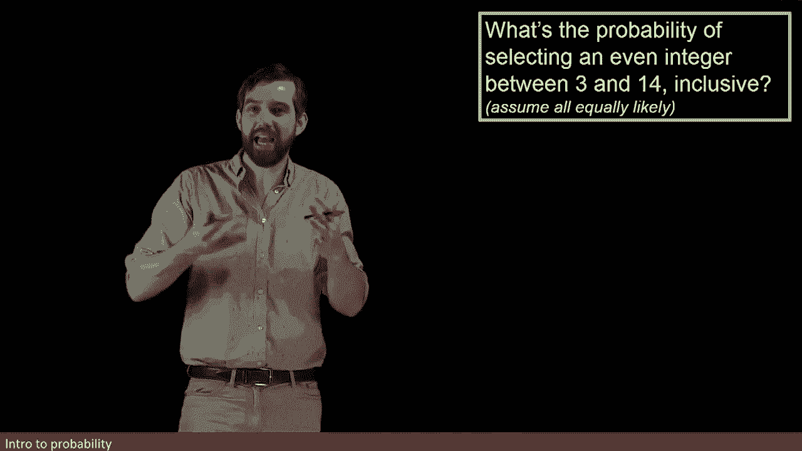
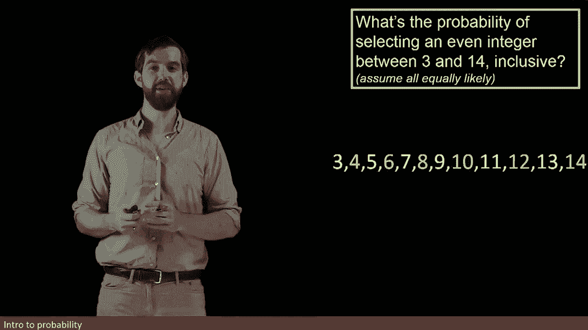
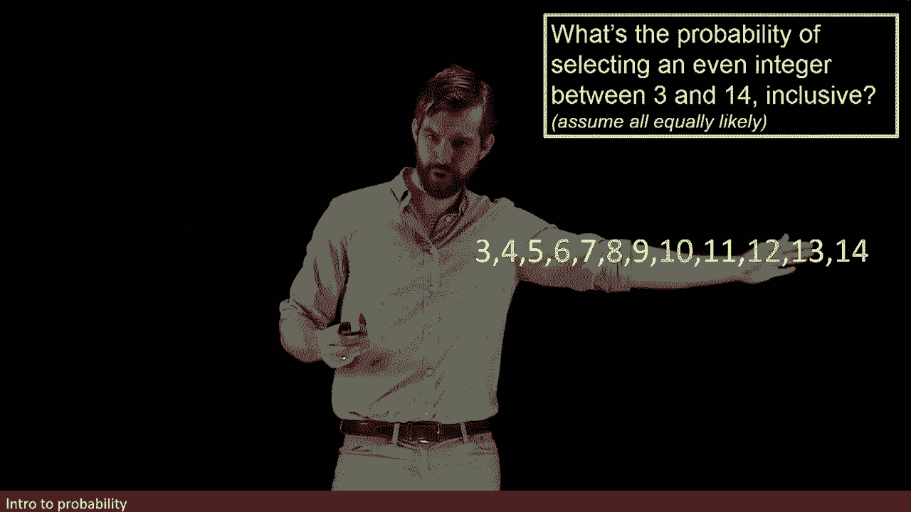
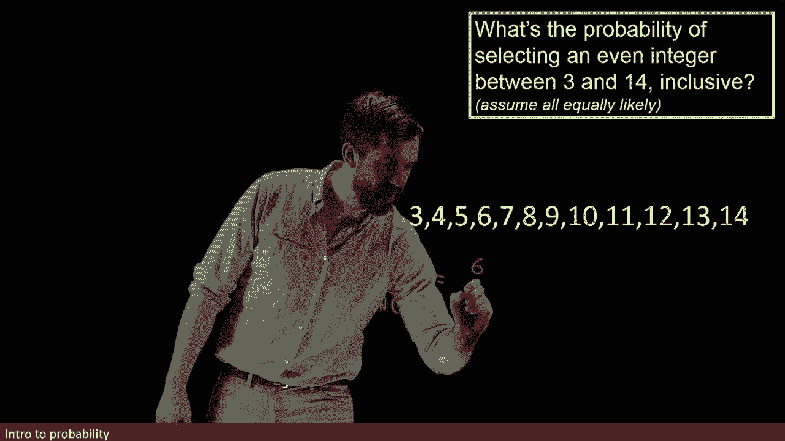
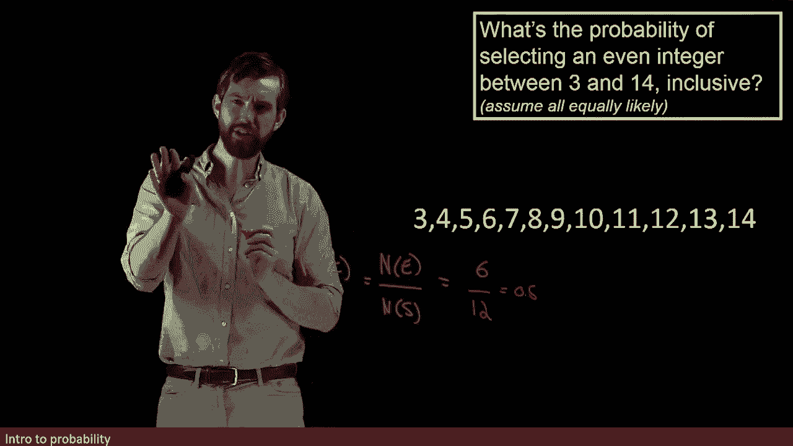
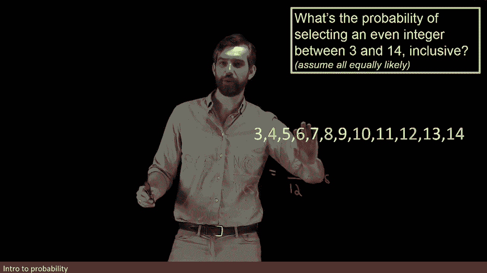

# 【双语字幕+资料下载】辛辛那提 MATH1071 ｜ 离散数学(2020·完整版) - P61：L61- Example - Computing Probabilities using P(E)=N(E)_N(S) - ShowMeAI - BV1Sq4y1K7tZ

In this example， we want to figure out the probability that if I randomly choose a number between3 and 14 where I'm including the ends。

 I'm including three and I'm including 14， what is the probability that it's an even integer？

Now what I want to partially illustrate here is that this question about probability is intrinsically tied to the idea of counting and that in many ways answering a probability problem is answering a question about counting so let's pull up the particular integers that we're interested in so I've got three。

 four all the way down to 14 and I've highlighted in yellow， the even integers。😡。

So what our formula told us is that I want to investigate the number of。Things in our event。

 so this case， the number of evens happens to be denoted by an E as well， but it stands for event。

 divided out by the number in our sample space and that this is going to be the probability of our event。

😡，So we have to do these two countings， so let's count the even ones first， I've got4，6，8， 10。

 12 and 14。 so that looks like six evens are appearing here so this is going to give me six。😡。

And then the total number of things between three and 14 is 12， so divided up by 12 here。

 in other words， this is going to be 0。5 or 50% as well。

But notice that if I changed this question a little bit。

 suppose I then went and said from all the way from  three up to 50。

Well， how does that change， 15 is not an even integer。

 but it would increase the number down here from 12 to 13。

 and so your probability would change because you've increased the size of your sample space。

 even though you haven't changed the number of evens， you haven't changed the number in your event。

