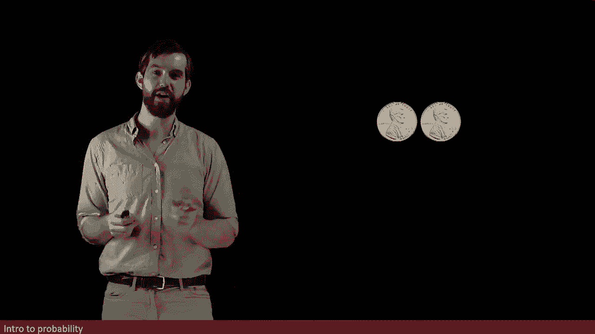
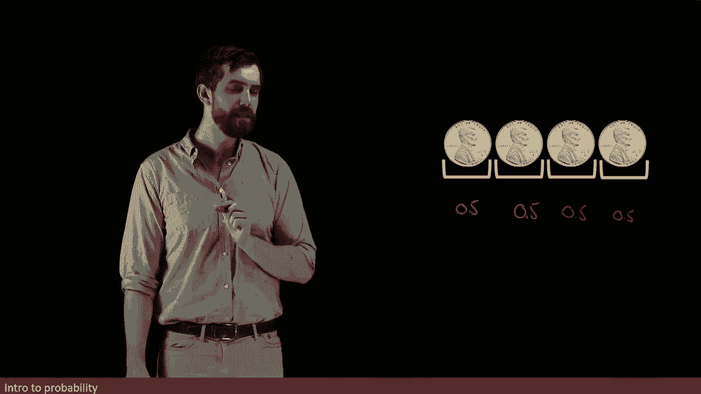
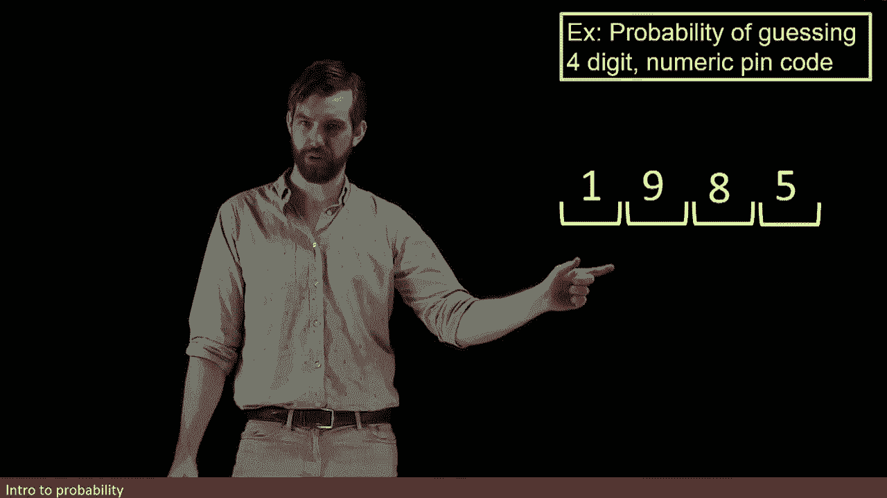

# 【双语字幕+资料下载】辛辛那提 MATH1071 ｜ 离散数学(2020·完整版) - P62：L62- What is the probability of guessing a 4 digit pin code - ShowMeAI - BV1Sq4y1K7tZ

So let's return to this study of pairs of coins once more， so here I've got our heads。

 heads that we are interested in and you'll recall that we said that there was a 25% chance that we got that and'm'm going to show you a different way to think of this 25%。

😡。

The first is that there's two real stages。 We've got a first flip that has a 50% chance of being head and we have a second flip。

 which also has a 50% chance of being heads because they're unrelated。

 whether the second flip as a heads does not depend on whether the first flip is a heads So we've got these two different 50% probability。

 So this one here I'm gonna say is going to be a 0。

5 or a 50% probability and that this one here is going be a 0。5 or a 50% probability By the way。

 I don't mind whether you write it as a decimal 。5 or whether you multiply that by 100 and put a percent in there and call this 50%。

 whichever is more convenient for you。

And then I want you to notice the following fact， if I multiply a half times a half。

 I get a quarter which was the answer that we previously claimed， in other words。

 somehow multiply the 50% times the 50% or half times a half that gives me the quarter or the 25% which was the correct answer。

 so to compute the probability of going heads heads， I just multiply the probabilities。😡。

So let's do this for one more coin， let's go for what's the probability that I can have three coins in a row all being heads。

Well， 50% for the first， 50% for the second， also 50% for the third。

 so I can come along and put one more 50% down there and half times the half times the half is one eighth。

Okay， I can carry on I could go and say， well let's look at another coin。

 there's going to be a 50% chance that the fourth coin is going to be a heads as well。

So in other words， what the probability of， I don't know how to denote it， perhaps。

Probability of four heads in a row。let's use shorthand。

 but I think we know what we're talking about that this is going to be equal to 0。5 times 0。

5 times 0。5 times 0。5， which is the same thing as one divided out by 16 or in other words。

 a half times a half times a half times a half to the power of 416 hence the 116。

So there seems to be some sort of rule here， which is that。

When I have multiple stages in some system of events， what I do is I multiply the probabilities。😡。

And that the probability of having four heads in a row is therefore the probability of an individual head multiplied four times。

Now this is going to generally be true as long as I have so-called independent events and what I mean by that is that the probability of the heads rolling on the second or the third or the fourth or so on stages。

 that doesn't depend on my results previously， the outcome of flipping a coin only depend on that one coin flip。

 it doesn't depend on any prior coin flipping that we may have done and therefore we're going to say that for a fair coin like this。

 that the flips are all independent， their probabilities don't depend on each other and in that scenario we're going to have the multiplicative rule that for independent events we're multiplying the probabilities for every level。

😡。

Let's use this same structure of four different independent events， but for a different problem。

 I'm going to investigate what happens if I want to study the probability of guessing a four digit numeric pen code we all have these on our different bank cards and so forth。

 but how hard is it to actually guess one of these numbers？

So what happens is that you have some particular four digit pin code， maybe how about this one。

 by the way， don't use your birth year as a pin code that's a terrible pin code。

 but the point is that there's some digit between0 and9 and the first one。

 some digit between0 and nine and the second， some digit between0 and9 and some digits 0 and9 and each of those four things。

So what's the probability of me guessing just the first number of your pincoat。

 I've got one attempt only and we know it's some number between 0 and nine so there's 10 numbers there。

 one number between 0 and9 and so I have only a 10% chance of guessing that first digit so for the first one I'm going to write down that we've got a 0。

1 or a 10% chance of figuring out that first digit。😡。

Likewise for the second， for the question is what is the chance I get correct your second digit still only 10 possibilities。

 so I'm going to still have a 0。1 here， likewise for the third， a 0。1， likewise for the fourth。

 another 0。1。

And so the probability。That I have one specific one。 I'm just going to write P of V here。

 so I don't have to figure out some better name for it。 The probability of guessing your pin code。😡。

Well， it's going to be the one value， you only have one pin code so the number in our event is only one。

 your specific pin code divided by the total number of possibilities。

 which is going to be 10 to the power of four， or in other words it's this one10th times1/10th times1/1th times 110th。

 so 1/10th to the power of four， or in other words， 10，00000，10000 one divided by 10000。😡。

So pretty unlikely if I'm having to do it manually。

 pretty quick if I can get some computer to be able to blast through a whole bunch of different examples。

 so you don't want to use a four digit numeric pin code for something like a password where a computer might be able to automate it。

 but for a bank card where one has to type it in， it's pretty unlikely that I would be able to get it。

 I have to go through quite a few tries to have a reasonable chance at guessing it。😡。

