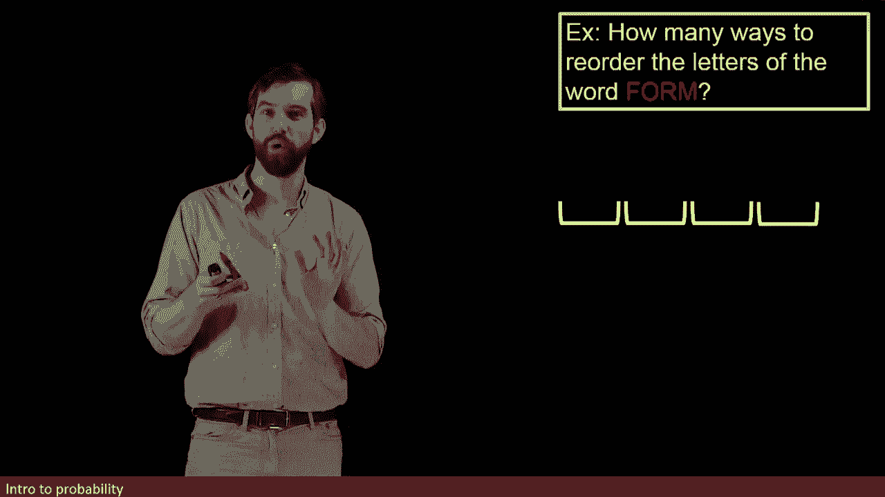
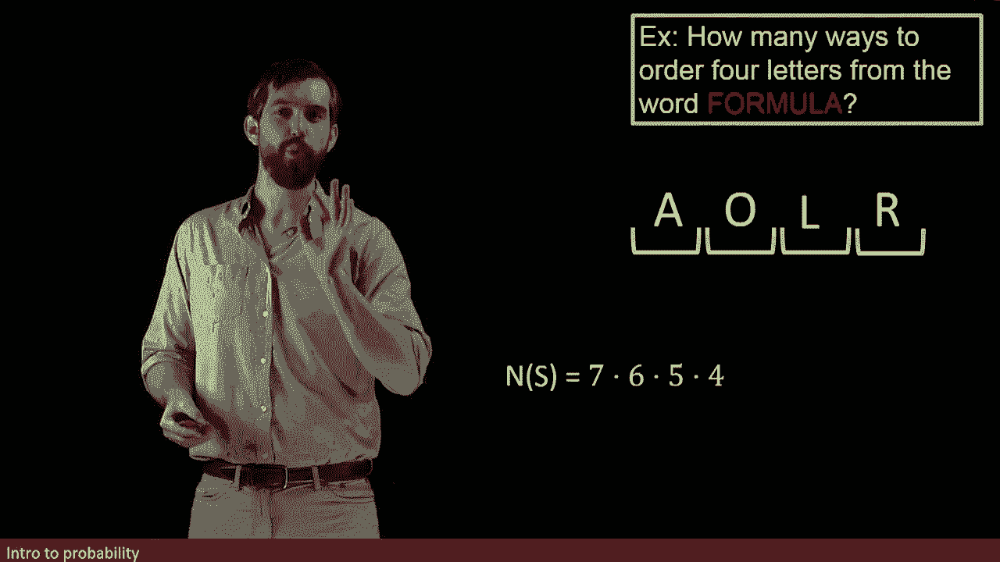

# 【双语字幕+资料下载】辛辛那提 MATH1071 ｜ 离散数学(2020·完整版) - P63：L63- Permutations - How many ways to rearrange the letters in a word - ShowMeAI - BV1Sq4y1K7tZ

Let me tweak my example one more time。 I'm still going to retain the idea of having these four different independent events。

 But now the question is， how many ways can I reorder the letters of the word form。

So note that there's four possible letters， so if I think about the different possibilities。

 it would be something like this， I could have form exactly。

 that's one way I can reorder them it's like I don't reorder it at all。

 but I could also flip the orders in a bunch of different possible ways。😡。

So how can I do this computation？I'm going to count the number of possibilities for the first of these。

And the idea is this， because I've got four letters， FO R and M。

 there's going to be four different ways that I can put something into this first slot。😡。

So if I'm counting out all the different ways， the first of them has four。 the second， however。

 let's think about that。 Now there's four letters， but the first of them。

 the M has already been used up， which leaves me with only three possible things I can put in the next slide。

 So I'm going to say that there's three possibilities for the second。😡。

Now I've used up two of the letters， only two remain。

 so for that third slot as to put one of the two remaining ones。

 there's only two different possibilities。

AndNow I've used up all three of my letters， so there's only one remaining and I'm forced。

 I have to put it into that final spot。

So then the number in my sample space， the number in all the different possible ways I could write out this letters of form in some new order is going to be four times three times two times1 or in other words。

 for factorial。

Note by the way， that in this computation， I am demanding that there were no repeats that I can't go MMMMM as a possibility。

 it has to use every letter exactly once as I fill it out。

Now I want to make one note about the idea of independence， because it's true for the second stage。

 we've eliminated some letter in the first stage， so there's not four possibilities in the second stage。

 there's only three。

But it's independent in the sense that it didn't matter what letter I chose in the first one。

 It didn't matter whether I chose an M or an R an O or an F for that first one。

 There was always going to be three possibilities。 regardless of what I chose。

 it was going cut it down from 4 to three possibilities。

 This is the sense of independence that I mean that the number of options is still three here。

 regardless of what I chose in my first one。 Now， this problem is a little bit simplistic for the following reason。

😡。

Notice that there were four letters in my word and that there were four possible spots I could put them into。

 so let me take almost the same problem I' going to make a slight change to it。😡。

I'm going to instead ask， how can I reorder without repeating four of the letters。

 but now from a longer word from formula？

So indeed something like the MRROF is a possibility， but there's others as well right。

 this is one like AOLR， it uses more of the letters， but because there's only four possible spots。

 that's all I'm asking for is these four spots， I'm never going to put in all of these seven different letters from formula。

😡。

So what we want to figure out is how can I determine the number of ways。

 how can I count the number of ways that I could slot four different non repeating letters into these four spots？

So if we think about the first one the first entry。

 there are seven letters in the word formula so I have seven different possibilities then for the next one we've gotten rid of seven there's six left there's six here。

5 and4 or in other words I can say that the number of my sample is going to be seven times6 times five times4 it's very similar to what we previously saw which was four times three times two times1 it's just that for we could call that a factorial but here this is not a factorial of something because it doesn't go all the way down to the one it's just seven times6 times5 times four。

😡。

Now I'm going to do a little algebraic trick， I'm going to multiply and divide by one。

 I'm allowed to do that right， but I'm going to multiply and divide by a slightly weird form of one。

 It's going to be three times two times1 divided by three times two times1 the three times two times one cancels and so I am just multiplying by one。

 I haven't made any changes。😡。

But the reason why I do this is that now I can represent this formula for the number of my sample space by factorials。

 in particular， I can say on the top here 7654321 that seven factorial。

 and on the bottom I've got three factorial。😡。

So in this case， where the number of letters differed from the number of slots that what I got was the division of two different factorials。

This general construct where I am picking in an order that I care about some number in this case。

 four letters from a larger set in this case， seven letters。

 that is referred to as a permutation and this formula that we have for the number here has a general formula for permutations so we're going to say that a permutation is where I'm picking our items from M possibilities I don't repeat my different items but I do care about the order so that's what a permutation is。

😡。

Four items from seven is our previous example where I slotlaughtted them in， I didn't repeat。

 but I cared， which was first and I cared， which was second， I cared about order。

Then the formula that we have can sometimes confuse students notice I have a P here。

 I don't mean probability， I mean pick this is my name for picking a permutation。

 not something about probability， this is a counting exercise So what I can say is if I'm going to pick out。

😡。

R items from n items， then the formula is as n factorial over n minus r factorial。

So in the example that we were just looking at here， notice how we said it was7 over three。

 but that three down here that what we have here is that three is the same thing as7 minus4 or in other words。

 it's equal to the M minus R so indeed I think seven factorial over7 minus4 is3 factorial that's exactly what we have。

😡。

So this is our general formula for the number of ways that I can permute。R items within N items。

