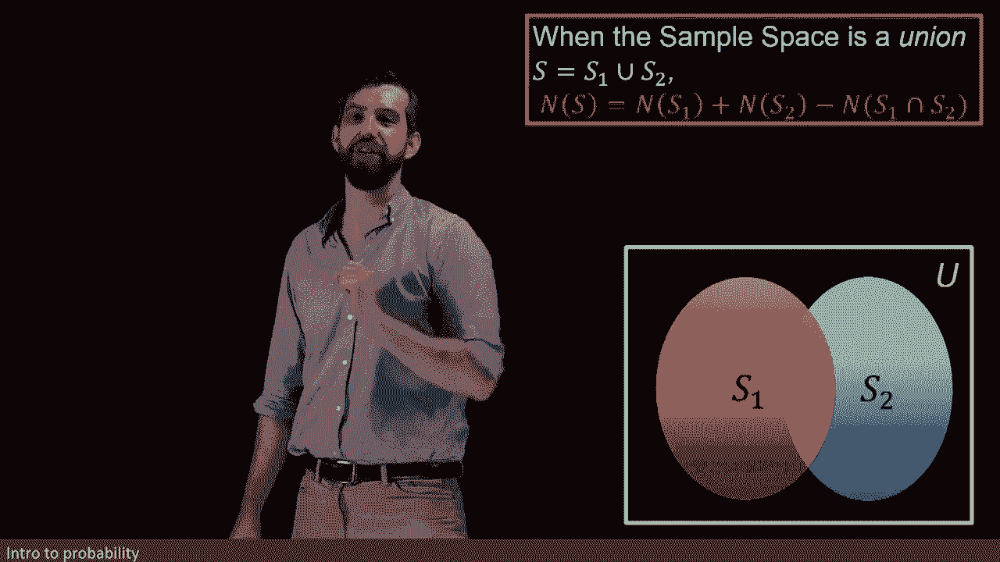
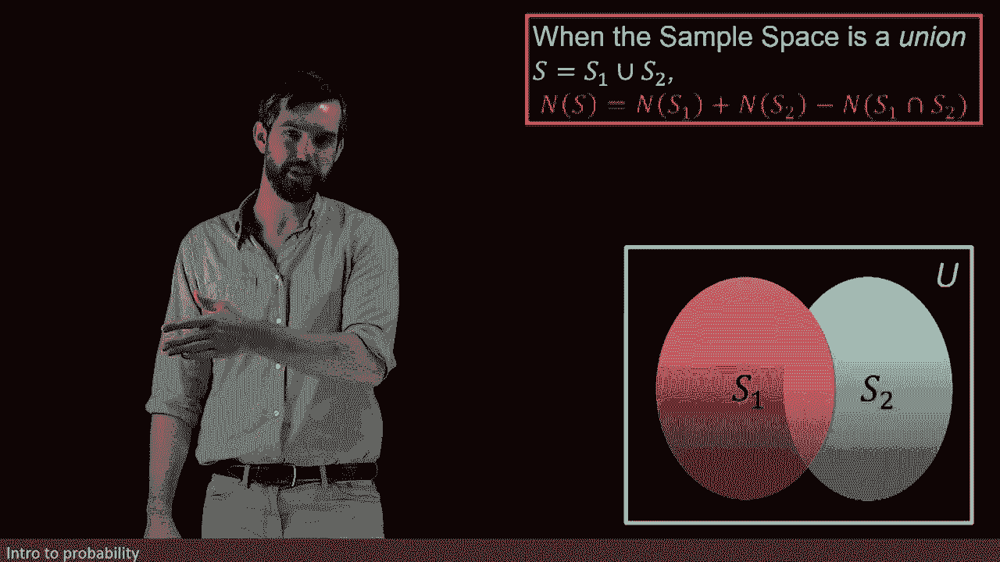
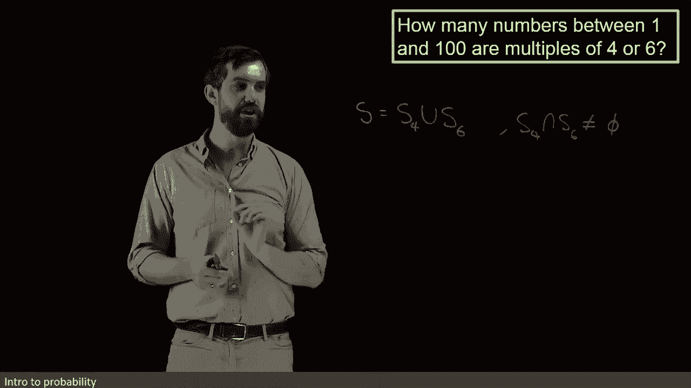
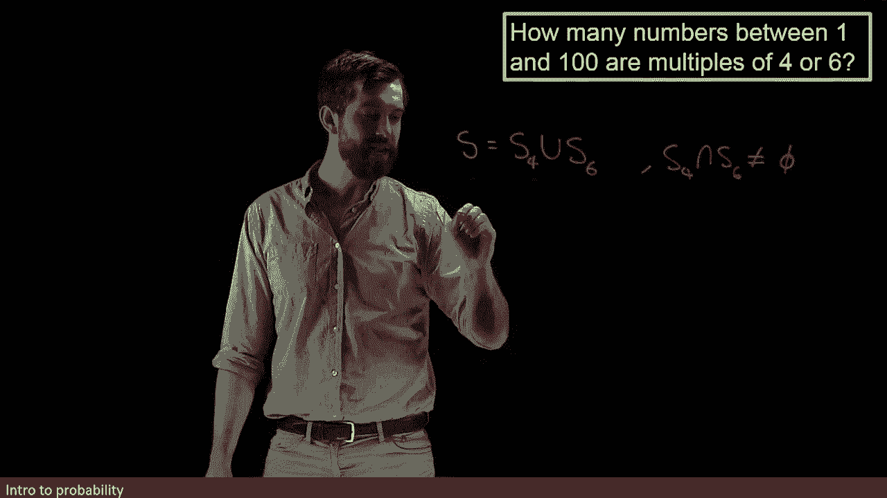

# 【双语字幕+资料下载】辛辛那提 MATH1071 ｜ 离散数学(2020·完整版) - P65：L65- Counting formula for two intersecting sets - N(A union B)=N(A)+N(B)-N(A int - ShowMeAI - BV1Sq4y1K7tZ

Well， what happens if my sample space is again separated into two different sets but now it's not a disjoint union。

 notice there's no word disjoint here。 It's a normal old union。

 We can visualize this idea in the normal old picture of a union where there is some nontrivial interaction in the middle。

 There's an intersection that is nonempty in the middle。

s there's elements that are in both S1 and S2。😡。

So I can't use the formula that we previously saw for disjoint unions when there's a non trivial intersection。

 when a non empty intersection。

But what I can think of if I want to try to count up all of the different elements in the S1 union the S2。

Well， if I add the S1 and the S2， that's what I'm doing here， there's sort of a double counting。

 The things that are in both have been counted twice， they were counted in the S1。

 they were counted in the S2， so they got counted twice。😡。

So what I need to do is eliminate the double counting by subtracting off the number in the intersection and so after I subtract off one copy of the number in the intersection。

 I'm going back from a double counting to my appropriate single counting in other words that the elements in my intersection are only counted once in this formula as they should be so this tells me a way that I can figure out the number of elements in an union of two things that are not disjoint。

😡。

And then of course the previous formula is just a special case of this。

 if it's the case that the intersection is empty that is if it's the case that it is disjoint。

 then the number in the empty set is zero and you'd be subtracting off zero so this formula is a generalization of the formula for the disjoint unions。

 Let's see an example of applying this formula for unions。

I want to determine how many numbers between one and 100 are going to be multiples of four or six。

Now in the property that I've asked for， multiples of four or multiples of six。

 it naturally divides into these two different cases， the multiples of four and the multiples of six。

 so I can take my total sample space S and I can divide it into a union of two different cases。

 I can say that it's going to be an s and I'm going to denote to s of four just sort of remember that that's the one with multiples of four。

And then it's going to be union S sub6 to denote the multiples of6。However。

 I've given a curvy union symbol here because the multiples of four and the multiples of six are not disjoint。

For example， take the number 12。12 is a multiple of four and 12 is a multiple of6。

 So we know that the S4 intersect the S6。 the S4 intersect the S6。

 that it is not equal to the empty set in its intersection that there are elements in here。

 for example，12 is in there。 and 24 is in there。 and 36 is in there。

 we could try to figure out all the different numbers that were in there。

 but but clearly it is not empty。 It is not a disjoint union that I have。

So therefore my formula has three parts to it。

I need to figure out the number of things in S4。I need to figure out the number of things in S6。

 and I need to figure out the number of things in the intersection of S4 and S6。

 and then I can apply my formula， the sum of the two subtract off the intersection。

So let's try to figure out the number in S4， the multiples of four first。

Well， I know that if I think about multiple of four， okay， so 4，8， 12， 16 and so on。

 so four times one， four times two， four times3， 100 exactly is  four times 25。

So I believe that the possibility is going to be 25 cases all the way from four times one up to four times 25。

 which is exactly equal to 100，25 different numbers between one and 100 that are multiples of four All right。

 so next up， we have to figure out。

How many multiples of six are there between one and 100， in other words？

I need to figure out what is the number of my S 6。Okay， so let's think with multiples of six。

 we've got six times one is6。 we've got six times2 is 12。 We go all the way to6 times 16。

6 times 16 is 96， 96 is less than 100。 but if I was to add one more copy I'd get over 100。

 So I think that there's only 16 possibilities here。

Okay， so the number of multiples of 4 was 25， the number of multiples of 6 was going to be 16。

 but the final thing we needed to do for our formula was to figure out how many are there in the intersection？

How many are there that are multiples of both four and 6。 So that's what I want to compute next。

 I want to figure out the number in S 4 intersect S 6。So first of all。

 I'm going to try to think about what is this intersection， what does it look like？Well。

 if you're a multiple of four and you're a multiple of six。

 that's what it means to be in the intersection that you've got both properties。

Then you are going to be a multiple of 12。So in other words。

 S4 intersect S6 is all of the different multiples of 12。And in much the same way that。

6 times 16 was going to give you 96。 The multiples of 12， Well，8 times 12 is also 96。

So in other words， there were going to be eight numbers， 12 times 1。

 12 times  two all the way to 12 times 8， which is 96， they're going to be less than 100。

 so I have my three different values here。And then if we go back to the previous slide where we had our formula。

 our formula was that the total number was I added the S1 and the S2 and I subtract off the number in my intersection So if I want to come and figure out what is the number in S in my total sample space。

 then it's going to be the 25 plus the 16， so this is the n of the S4 plus the n of the 16 and then finally I am going to subtract off the number in the intersection。

 I am going to subtract off my8。😡，And if 16 minus8 is going to be 8， then 8 and 25 is going to be 33。

So there are a total of 33 numbers here that have both have either property rather。

 that are either a multiple of four or a multiple of six and that weve if we only computed the 25 and the 16。

 we would have double counted， the ones in the intersection that the ones that were both a multiple of four and a multiple of six。

 we would have counted them twice and so I have to subtract off by the intersection to make sure that I only count them once and this gives me my final value of 33。

