# 【双语字幕+资料下载】辛辛那提 MATH1071 ｜ 离散数学(2020·完整版) - P69：L69- Counting and Probability Walkthrough - ShowMeAI - BV1Sq4y1K7tZ

Alright， so first up， I'm looking at this。5， choose2。 And this is just a formula。

 want to see whether you memorize the formula whether you haven't。

 So the formula we know is that it's going to be 5 factorial divided by two factorial。

 divided by 5-2 factorial。 So that's the formula。N factorial over R factorial over n minus r factorial。

And then if I multiply this out， this is going to be 5 times 4 times 3 times 2 times 1 on the top on the bottom。

Two times 1， and then three times  two times 1。So all of this portion cancels， the3，2，1 cancels。

 the two and the four cancels leads with a two， and that looks I like a five times two sort just get a 10。

 All right， lovely。

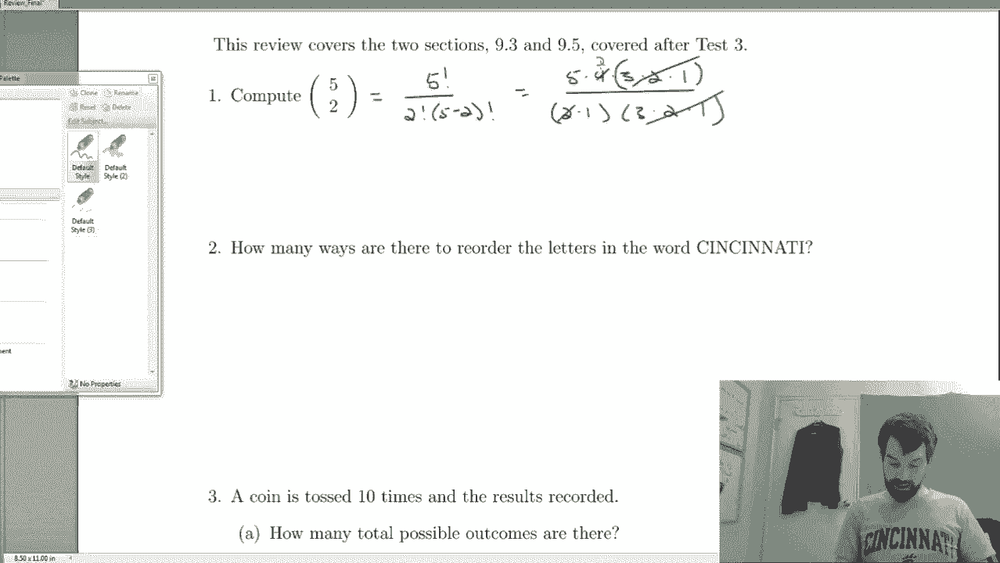

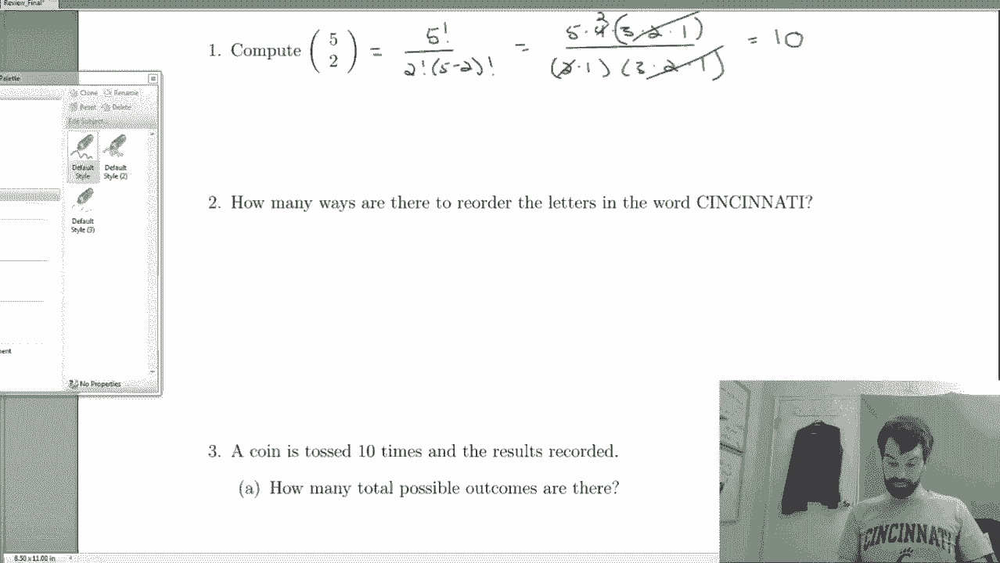

Okay， next up， how many ways to reorder the letters in the word Cincinnati， this is a review。

 we've seen this kind of problem a couple times。And the idea here is I figured out how many ways can I slot in one of the letters。

 How many different ways can I slot in the next letter and so on on the line。 So let's do C first。

 I know that there's two different Cs。 And I'm also going to count that there's 1，2，3，4，5，6，7，8，9。

10 different letters here。 So there's 10 possible spots。

So the way I'm going to think about this is that first I can figure out where is it the Cs are going to go。

 there's 1 possible spots， there's two Cs， and now I filled up two of the spots somewhere in this long list。

Okay， that's good。 Next up， I'm going to fill out the eyes and I say that there's  one，2。

 three different eyes in Cincinnati。But I've used up two of my 10 spots。 There's only 8 spots left。

 and I got to foot， fit three eyes in those8 spots。 So I'm gonna have my8 spots remaining。

I can put my three eyes in and there it goes like that。Okay， next up N 1，2，3 different ends。

 So I've already used up。5 spots total， the two Cs and the three eyes。 So got five spots remaining。

 And then I have 1，2，3 ends remaining。 So 5， choose 3。

And then I believe there's only an A and there's only a T left。 so there's two spots。

 and I had to choose one of them for the A。And you can write this last one down or not。

 whatever you like， there's one spot left for the T， and there's only one spot to put in there。

 So it's one， choose one， which is just one， who you want to think about this。

So I did this where I was choosing the C's first， where I was choosing the I's， first。

 where I was choosing the Ns， then the A's， and finally the T's。

 but if you wanted to do it in a different order， it might look a little bit different here。

 but it be the same thing。

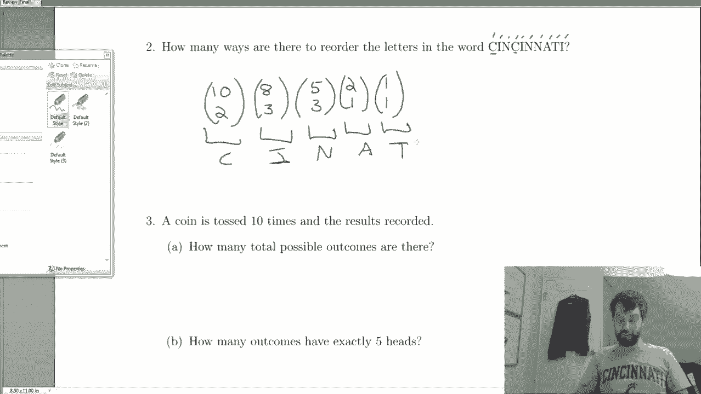

All right， wonderful。So next up， a coin is tossed 10 times and the results going to be recorded。

 So how many total possible outcomes are there going to be。Well， in this case。

 there's two possibilities for every flip。 It's either heads or its tails。

 So I'm going to say that there's  two。 And then since there's 10 total flips， it's two times2 times。

2 times2 times 2 all the way down in all the slots。 So I think two to the power of 10。

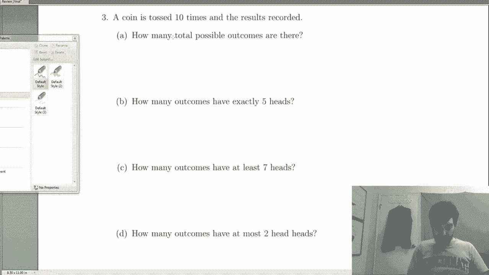

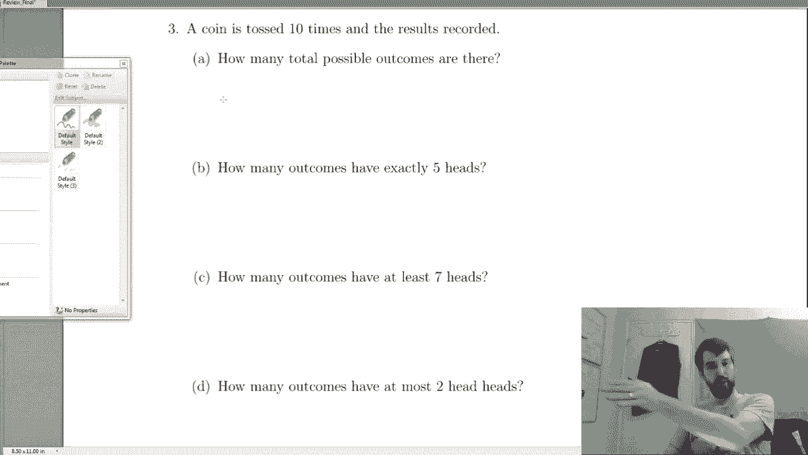

Al right。 How many of those outcomes have exactly five heads now。

What I want you to notice is that this is sort of a binary thing。 It's either heads or its tails。 So。

 for example， if I know the locations of all the heads。

Then that immediately tells me the locations of all the tails because it's either heads or tails。

So how many outcomes have exactly five heads。 Well。

 I got to think about how can I choose which of those 10 flips are going to have heads。

 And I because there's five of them， I want to choose five possible spots where they're going to be heads。

 and the remaining five spots are all going to be tails。So in other words。

 what I'm saying is that's there's 10 total flips， five of them are heads。

 and I get to choose which of those flips have the five heads， so it's 10， choose five。

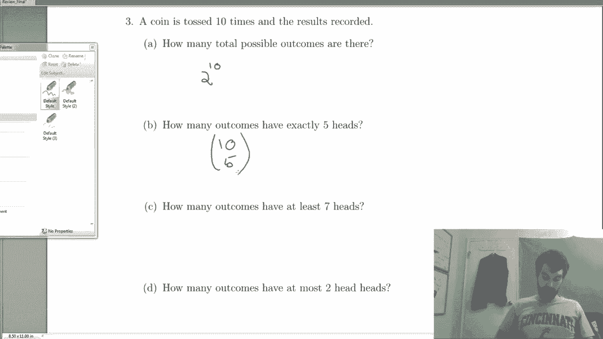

Allright， How many outcomes have at least seven heads。So notice here there's a couple possibilities。

 There's 7 heads，8 heads，9 heads and 10 heads。 So it's a sum of four different things。

 It's the sum of how many ways can you from 10 possible flips。 Can you choose 7。

 But then I got to add， I got to add。10 choose 8， cause that's how many have 8 flips。10， choose 9。

 That's how many have 9 flips。 And finally，10。 chooseose 10， which， by the way， just one。

 That would be the one cop case where every single one of them heads。

So one now I look at the keyword of at least the at least tells me it 7，8，9 or 10。

 and then so I have to do one computation for each of those and add it up。😡。

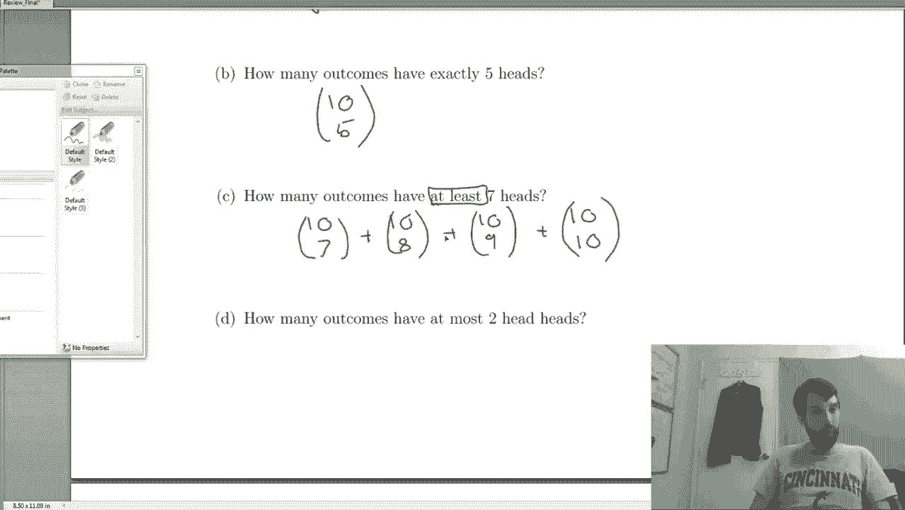

Alright， so now if I want to look at how many outcomes have at most two heads。

 this is sort of similar。 The the at most is similar to the at least， but it works on the other side。

 If it's at most two heads， it could be there's 0 heads。

 It be there's one head or could be there's two heads。 So I'm going to say10， choose 0。

 that's the one way that they're all tails。I could then add the the 10 different ways。

10 choose 1 will be 10。 The 10 different ways I could have only one head。

 and then I add the 10 choose two different ways that there could be two heads。

So pay a lot of attention to whether you say it's exactly in which case it's only the one。

 at least in case it's the one or higher or at most or which case it's the one or lower。

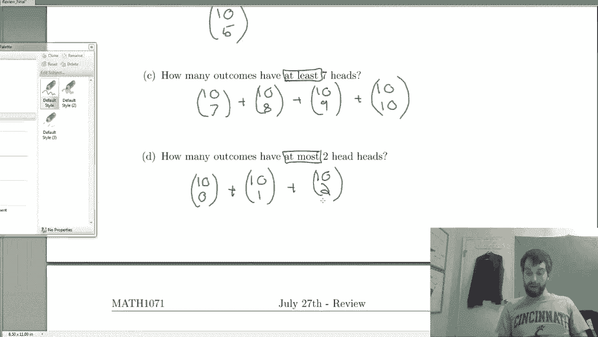

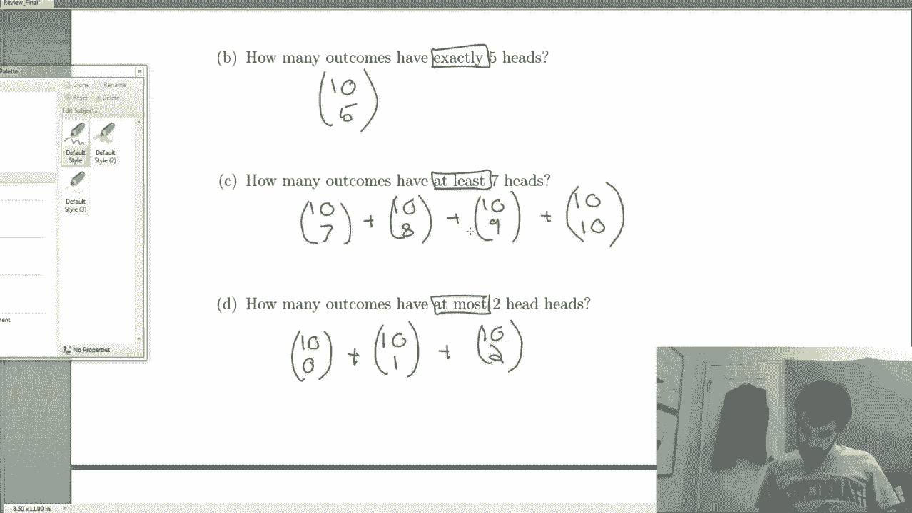

All right， maybe we not。Okay， so an instructor gives an exam and it's got 14 questions total。

Students are choosing some subset of 10 to answer。I did a few of these types of exams back in the day。

 I wasn't real a fan of them， but at least they're a rich example for our probability。

So how many different choices of 10 questions are there。 So you got these 14 questions。

 Students choose which of the 10 they want to have count for mark。

 So I think it's going to be the 10。Oh， excuse me。I want to have。The 14 possibilities。

 they are choosing 10 from that。

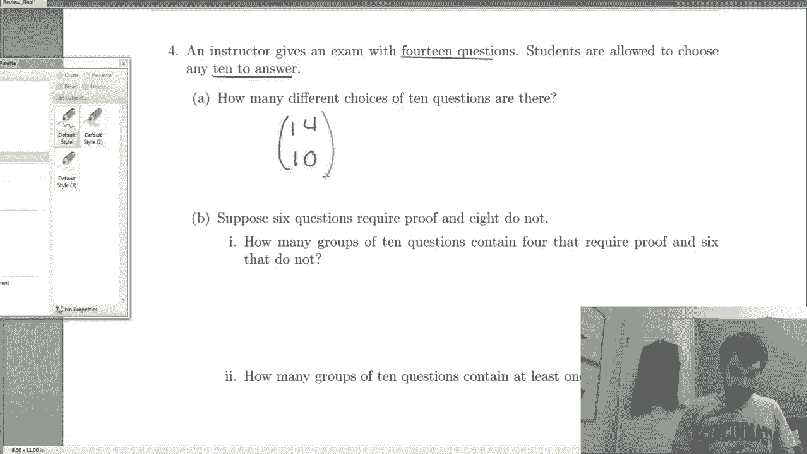

So lot of these questions are the same kind of like choose notation。

 but they might be said in different ways。

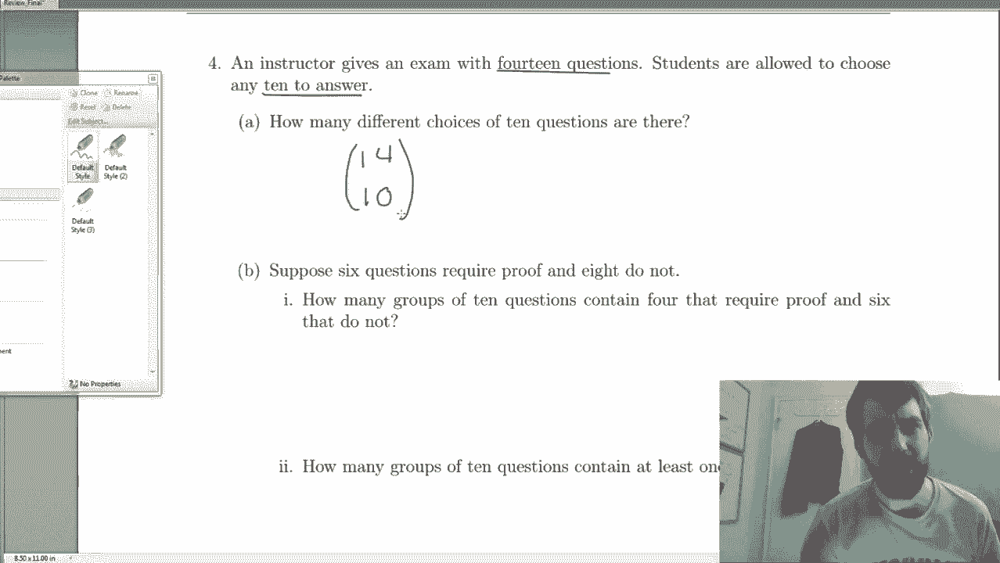

Next up， How many groups of 10 questions contain， Oh， I got to read before。

 Suppose six questions require proof。And eight questions do not require proof All right。

 so how many groups of 10 questions contain four that require proof and six that do not。😡。

So I think the idea is that first of all I'm going to choose which of my four require proof。

 I'll do that first， and then independently from that。

 I'm going to choose which of my six do not require proof。😡，So first of all。

 there's six questions that require proof。 I have to choose four of them。 So I have to take the six。

 and I'm choosing four of them。And I'm going to be careful。 I'm adding or multipied。

The way we're doing this this is kind of like the rearranges of Cincinnati。

 it's an independent event， so I have the one event choosing the proof questions and then I multiply that by the next event which is choosing the non proof questions。

So then I have to choose six questions without proofs among the eight that don't have proofs。

 so I'm going to choose eight choose sucks。So it's a product of these two things。Okay。All right。

 so now I have this question， how many groups of 10 questions contain at least one。

 there's that at least one again that require proof。

But we have eight without proofs and six with proofs。 So every single possible test。

 even if the students use eight of them without proofs。

 they're still going to have to do two with proofs。

 So how many groups contain at least one that require proof this is going to be all of them。

Every single possibility， so it's that original the 14 choose 10。

 no matter what it is that they choose， it's always going to have at least one that's going to do proofs okay。

 fair enough。Now， the next one， though， is。

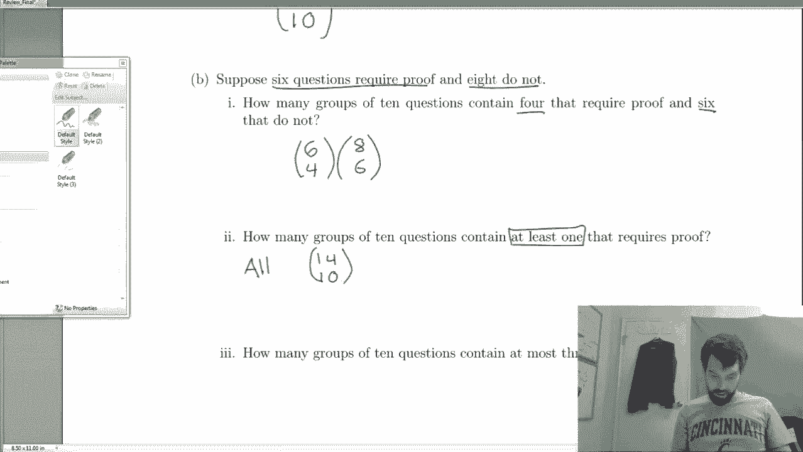

That contains at most three。

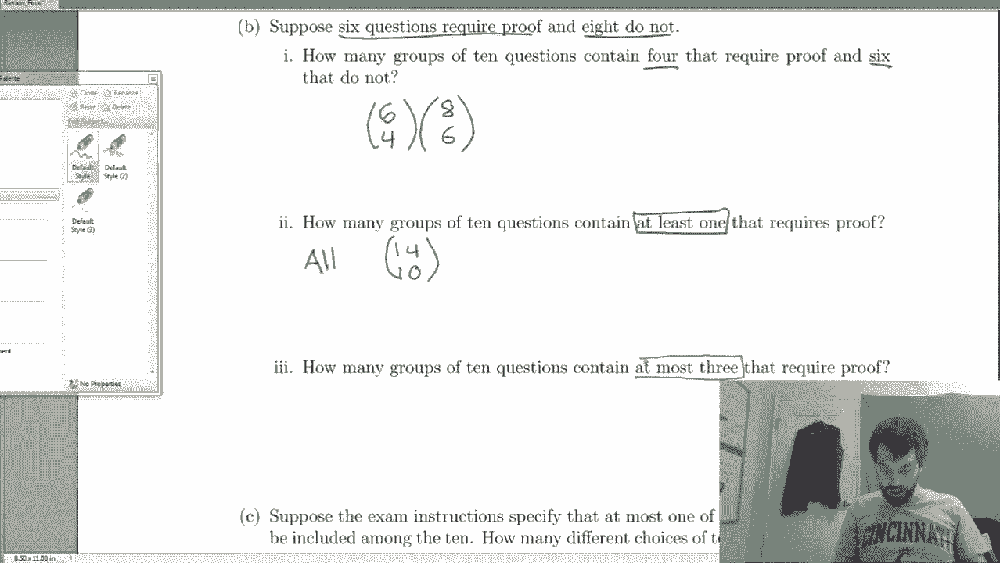

If we think about the possibilities。The worst case scenario is8， with no proof。

And then two with proof。 That's a possibility。 You'd also have seven with no proof and three with the proof。

And that would be the case they at most。 and then there's there's more like four proofs but we're not considering that。

 So I think there's really just two cases， three proofs。And two proofs。So the one。

 which is two proofs。 we're gonna have a sum of two things。

 the sum of two proofs and the sum of three proofs。 The one that's the two proofs well。

Of the six proof questions I choose to。And then I've used up two problems。

 And then so of my eight questions that are not proof。 I have to use all eight of them。

 So eight years they kind of boringre。And the next one is of my six， I choose three proof ones。

And of my8 non proof， I have to choose 7 and both the  two plus 8 or the 3 plus7 as up to the 10。

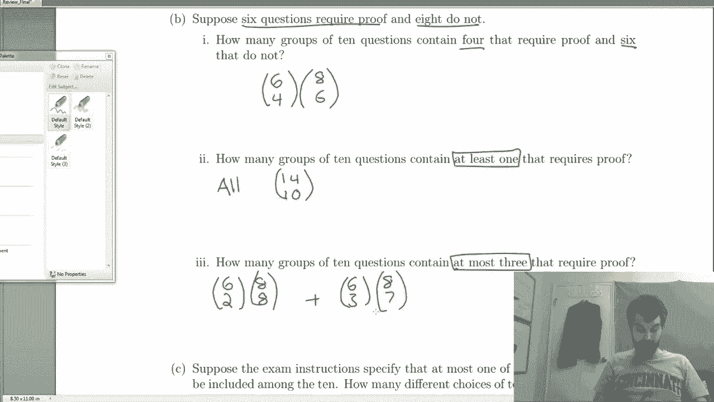

All right， wonderful。Moving right along。

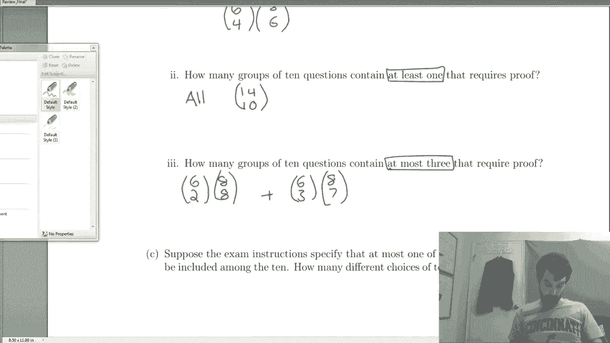

So suppose now the exam instruction specified that at most one of questions one and two may be included among the 10 or different scenario。

 nothing to do with proofs or non proofs， we're saying at most one of the questions one and two may be included among the 10。

😡，Two possibilities， zero of the first two included， and then we got the remaining 10。

Or one of the first two is included， and then we've got the remaining nine。

So let's do the first one first， I'm going to have zero included of the first two。

And then of the 12 remaining， there's 10 spots open。

 and so that's what it is 12 times 10 where I've taken0 of the first two， if you want to。

 you can come in here and say of the two， you choose 0，2， choose，0。

 you could multiply it out because the zero factorial。

 is's just going to be equal to the value of one。Eith way， that's the number of zeros。

0 questions from the first two。 And now from the one of the first two， will you choose the one。

Two possibilities。 You choose one for it。And then you now have also 12 remaining things you can choose。

But you've used up one。 So there's only 9 remaining。Okay， and final one。

 suppose the exam question specified that either both questions one and two are included or neither is to be included kind a kind of a funny one。

 so two cases。TheThe first case is when none of them are included。

 The second case is when both of them included。 Okay， so none of them included。

We've done that before。 That's going to be the two times 0。And then times of the 12。

 you have to choose 10。's that's the one case。 And in the next case is of the two。

 you choose both of them， two times2， choose2。And then of the 12 remaining， you only have 8 left。

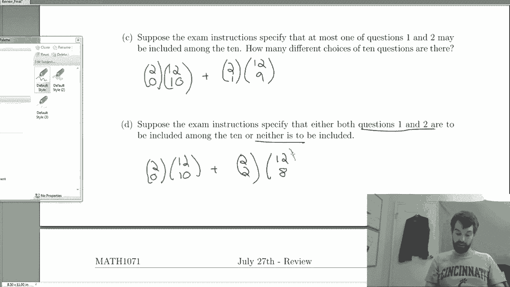

To choose。

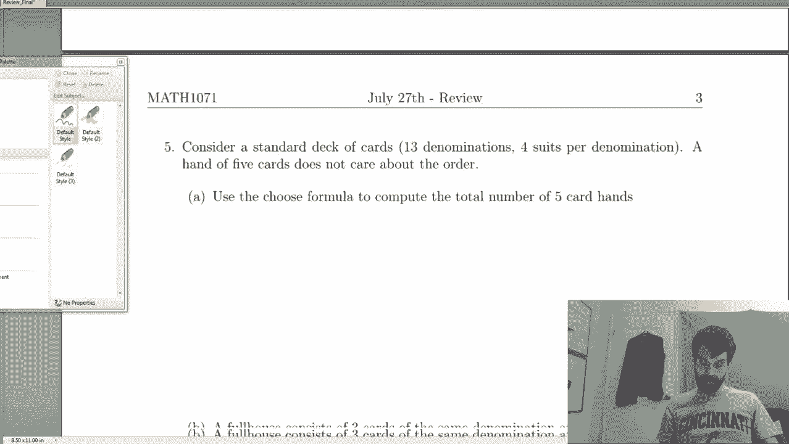

Wow， poker， wonderful。So considering standard deck of cards， 13 dominations。

 four suits per denomination， a hand of five cards does not care about the order Okay so that's good。

 this is something we had to we had to sort of sidestep around in the past。

 we don't care about order here so does it matter if you've got for example， a pair。

 doesn't matter where they come in the first two slots in the last two or the middle。

 doesn't matter where they come。So use the choose formula to compute the total number of5 card hands。

We have 52 spots，52 cards to choose from。 And what we're doing is we're choosing 5。 So it's just 52。

 chooseose 5。13 pin 4 is 52。 So 52 choose 5。

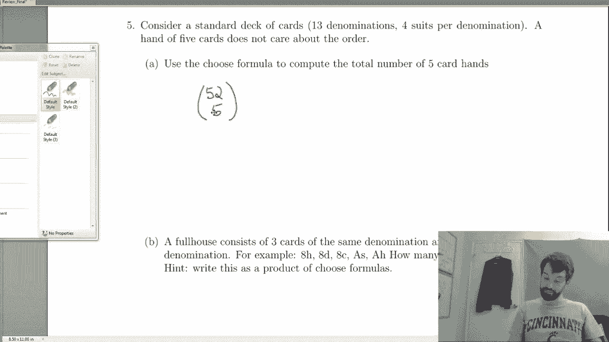

Okay， so， so now we've got this this question where we're trying to figure out what a full house is。

Full house is three things of the same denomination and then two things that are repeated of a different domination。

 so like 888 A six。Or A8 A88， it wouldn't matter three of the same denomination and then two of the same denomination。

So I'm going to figure out how can I do this and my strategy is going to be this。

 I'm going to pick these denominations first and after I pick the denominations。

 I'm going to pick the suits for the denominations。

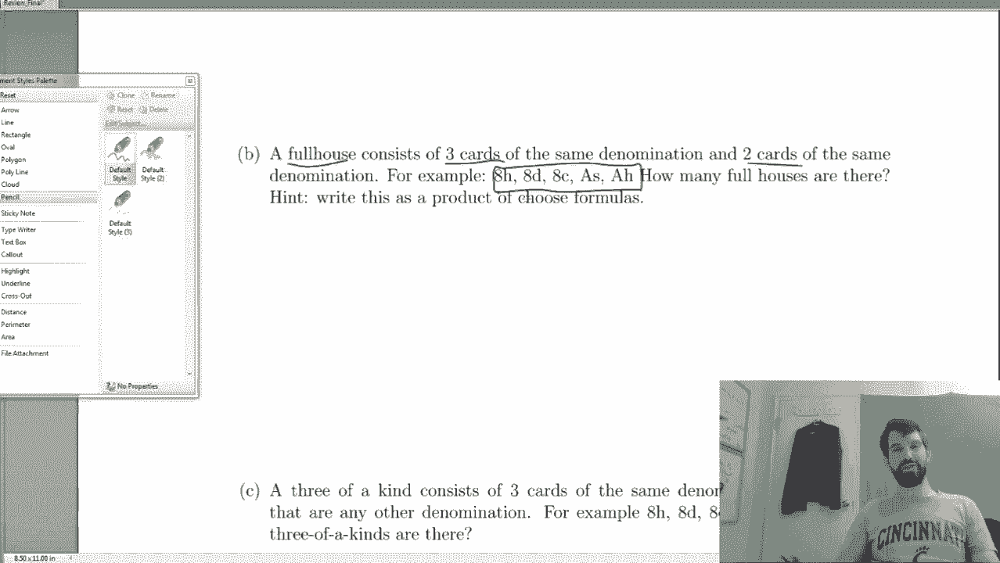

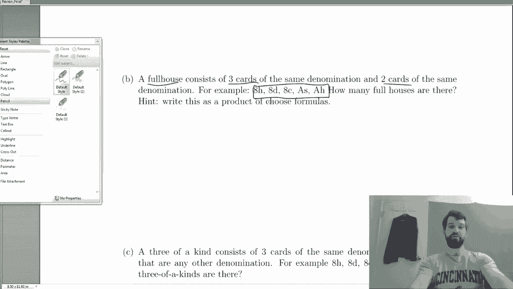

So first of all， I have 52 or excuse me， 13 possible denominations。

I want to choose one for the triple。 So I'm going to do 13， choose1。

 and that's going to be choosing the triple。So I'll write， choose the the triple。

 the denomination of the triple。And then I want to choose the denomination of the double。

 So now there's 12 denominations left because the double in the triple can't be the same and I have to choose one of those。

So this is gonna to be choose the double。And maybe I all write denominator or denomination on the bottom。

Deenomination， because I'll do the suits the next。 And then now that I've chosen those。

 I have to figure out what suits are going to be so。I look at the triple。

 well there's four possible suits， but I have to choose three of them， so four choose three。

And then for the double， I have four suits， but I'm only choosing two cards。

 so I have to choose two of those。So this is going to be the triple suit。

And the final ones going to be the double suit。So the suit is the triple and the suit of the double。

 So it's just again a big product of these。 You choose the denominations。

 You choose the suits for the denominations。

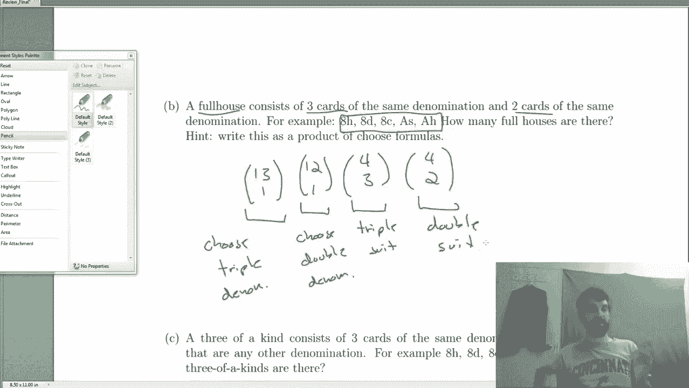

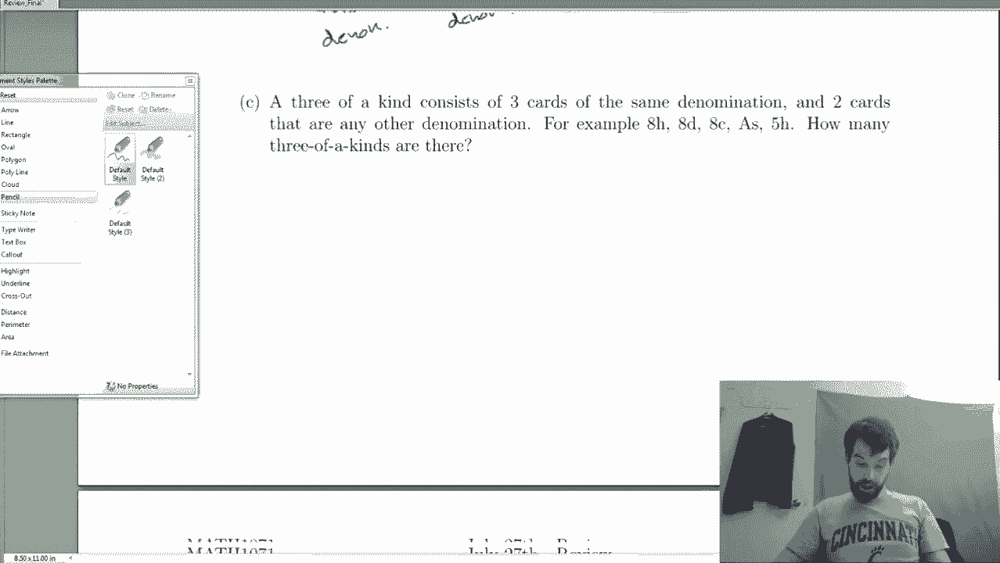

All right， so。Mexed up， we have Oh， three of a kind。 wonderful。 So again， we have the three，8。😊，But。

 but now we have that the， the next cards could be just anything at all。 It doesn't really matter。

 So same story for the8s。 I've got 13 denominations for those。

 I'm going to choose one of them to be the denominations of the triple。

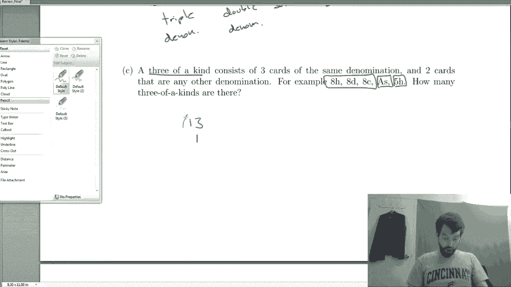

All right， next up， I have to deal with these these two extras。

 so I've got 12 possible denominations for them。And I have two cards that I want to choose。

 And notice that like I got be careful here。 I don't want to do 12， chooseose 1。

 and then 11 choose one， because that would be where order would matter or matter which of these I picked first。

 This is not the case。 So do 12， choose2。Then I got to figure out the suits so I got to figure out the suit for the three of the kind。

 so again there's four possibilities for the suits and I choose three。

Now I got to choose the possible suits for the first of these flip ones。

 so I've got four different suits I choose one of them and for the second of these extras。

 four possible suits， choose one of them。

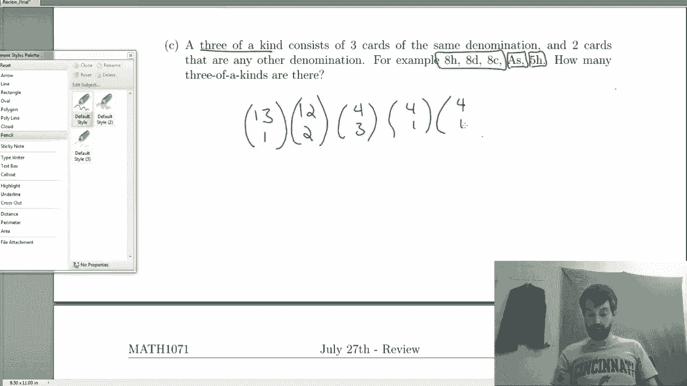

So what have we got。We are making a。 we got a company。 We got passwords。

 They must be 35 symbols long。 That can't be right。 I think I mean，3，2。

5 symbols log and composed of the 26 letters of the alphabet。

How many passwords are possible if repetition is allowed。

So in this question where I've got three to five， the key sort of distinguishing characteristic is that。

I want to be able to add the number of cases where there's  three and then then cases where there's  four and the cases where there's  five。

So what I'm going to say is that if repetition is allowed， then the 26 can go in every slot。

 So what I'm going to say is it's 26 cube， that's the number of ways that there's there's three password long ones。

 three little long passwords。And then it's 26 to the four， that's the number of ways where you have。

4 symbol long passwords and finally 26 to the power of five。So that's with repetition here。

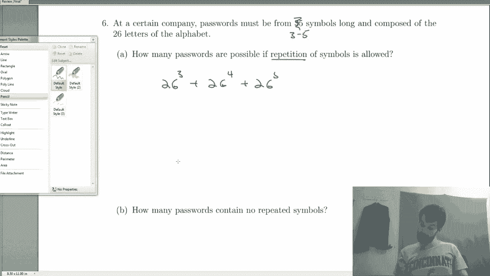

And then how many passwords contain no repeated symbols。 So same store， let's do 3，4， and 5。

 and we'll add them up together。 But if it's repeats， though， we， we have to knock one out。

 So it's like 26 for the first spot，25 for the third for the next spot。 And then and then 24。

 So that's the one of the three。

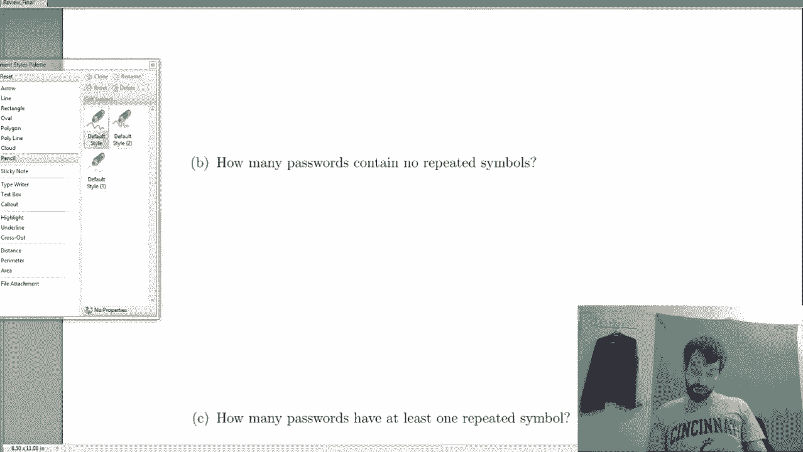

One of four are 26，25，24，23。 So we're using up one every time and then for  fives。26，25。24。

23 and finally 22。 And yes， it's perfectly valid to just write it out like this where you don't want to try to multiply with that number is just leave it as a big expression。

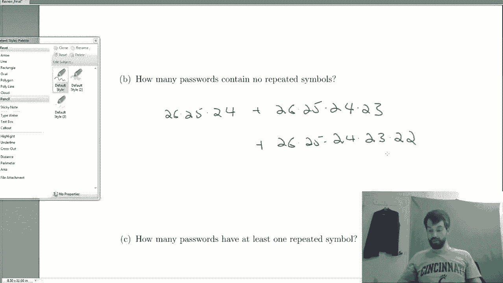

And then how many passwords have at least one repeated symbol， so that's interesting。

I want to do it the other way around because because it's all these ones。

 like at least one repeated somebody have to be like， well， one repeated， two repeated。

 three repeated four and so on。So what I want to do is all the passwords。

Minus those that have no repeats at all， and what you're going to be left with is the thumb that have at least one repeat。

So the total number of passwords was going to be the 26 cubed。

The 26 to the fourth and the 26th to the fifth， so that's the total number of passwords。

And then from this， we're going to subtract off what we previously done。

 So we've previously done was how many have no repeats。 So you know what， I don't want to repeat it。

 I'm a good idea。 Don't want to repeat the number of repeats。

 I'm going to take this whole thing here。 and I'm going to fire it right back down there。

 And I've got the total minus the no repeats。 And that's gonna to leave me with the sum number of repeats。

 which is exactly what this question asked for。

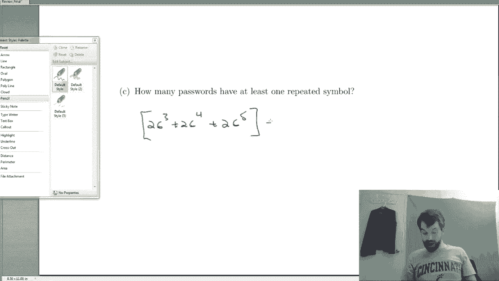

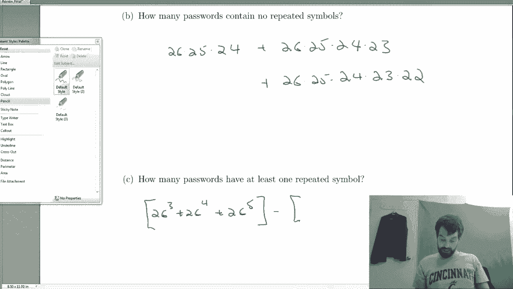

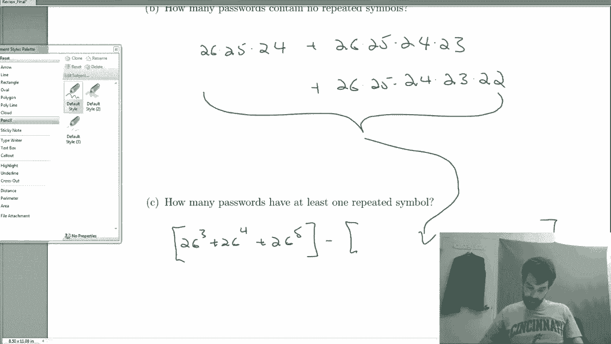

And then we're done。