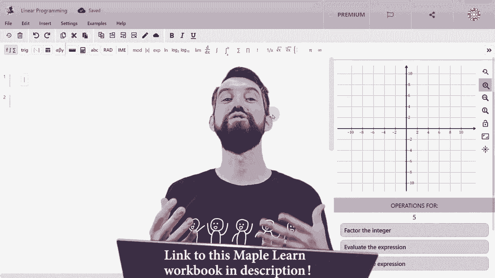
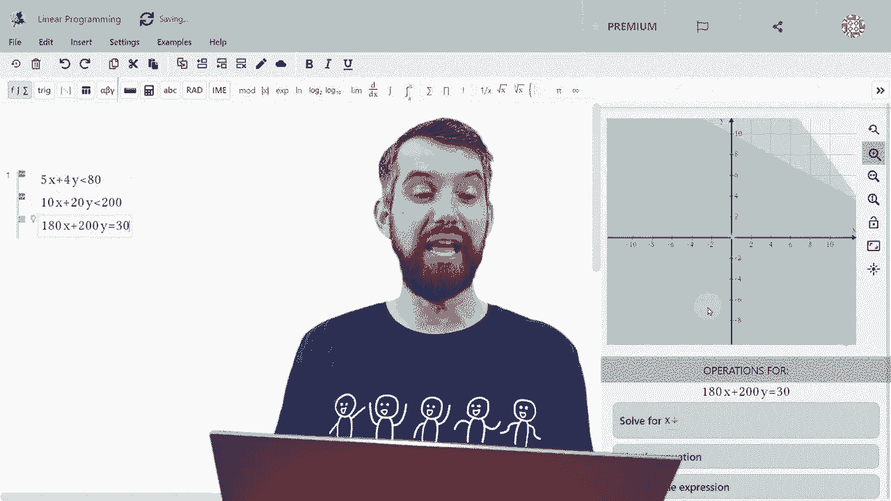
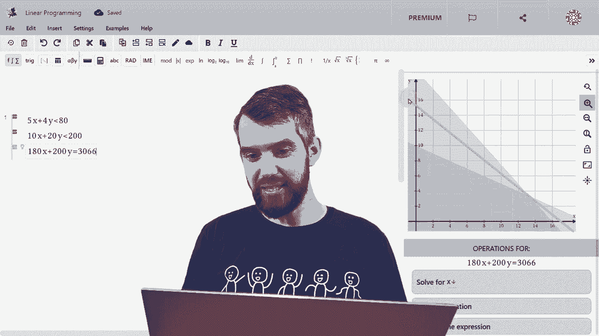

# 【双语字幕+资料下载】辛辛那提 MATH1071 ｜ 离散数学(2020·完整版) - P78：L78- Intro to Linear Programming and the Simplex Method - ShowMeAI - BV1Sq4y1K7tZ

In this video， I'm going to tell you about a very powerful optimization technique called linear programming。

 Now， I know it has the word programming in the name。

 but we're not actually going to be doing any sort of computer programming here。 And in fact。

 we're not going to use any high level math at all。 Calalculus linear algebra。 None of that。 Instead。

 we're going to use a very simple geometric technique that somehow manages to solve this very important class of optimization problems。

 So what are we talking about。 What I'm imagining is I want to optimize the value of some function like this。

 1080 x plus 200 y， something like that。 That is this is a linear function of multiple different variables。

 sayy X and Y， This is just an example。 What is optimizeim me。 Well。

 it could be fine the maximum or it could be fine the minimum。

 but we're not just optimizing this function by itself。😊。

We're optimizing this function subject to various constraints。 For example。

 I'm just putting up some random ones。A series of what we call linear inequalities。

 Things like 5 x plus 4 y is less than or equal to 80 or 10 x plus 10 y is less than or equal to 200 or x is positive or y is positive。

 Those are all linear。 There's not an x squared or a sign of X， but they're linear inequalities。

 So this is the idea of linear programming， you're trying to optimize some linear function subject to a list of linear constraints。

 To give an idea of where this type of problem would come up。

 I'm going to share something called the carpenter problem。 The idea is this。

 A carpenter can make tables or they can make bookshes。 If they choose to make tables。

 it takes 10 units of lumber。 I don't know anything about carpentry。

 I don't know what a unit of lumber is some cubic meter。 I have no idea。 It takes 10 units， however。

 of lumber， but it takes5 hours of their labor， And if they make a table。

 they're going to make 180 buck profit。Alternatively， if they decide to make a bookcase， well。

 it takes twice the amount of lumber to make a bookcase in this， again， made up scenario。

 but it takes less time for whatever carpentry reason I get。

 I have no idea the claims that bookcases are perhaps easier to put together。 So 4 hours of labor。

 But you make more money，$200。OkayAnd then there's a few other constraints here。 first of all。

 is that there's only 200 units of lumber available that we can make our bookcases or tables out of。

 And finally， in say two weeks， you want to work only 80 hours。

's a constraint that is on the amount of wood and there's a constraint on the time so my first task is going to be transition。

 this word problem into the system of equations and inequalities like what I just described。

 So let's let X denote the number of tables in which case if you make x tables。

 you use 10 x units of lumber and 5 x hours of labor Likewise I'll use y to donate my number of bookcases。

 And so 20 y is the amount of lumber I use and for y is the amount of labor that I use So if I can these equations down。

 then the question first of all， is well what am I trying to optimize Well I want to make as much money as possible。

 that's the goal here So what's my money going be Well。

 I make 180 for every table that I make and 200 for every book。

I makeSo the thing I want to optimize is this function， this linear function， 180 x plus Twitter Y。

Okay， so what about my constraints。 Well， first of all。

 let's think about the constraints on my labor， the number of hours that I can spend on this。

 So the rule is 5 hours for a table，4 hours for a bookcase。 And as a result。

5 x plus4 y has to be smaller than the 80 hours that I'm willing to work。

Then if I want to consider the constraints on the lumber， well。

 then 10 times the number of tables plus 20 times the number of bookcases has to be less than the 200 units of lumber that I have again。

 another inequality。 Finally， the number of tables I make is going to be a positive number and likewise for the number of bookshelves。

 I'm not going to make a negative number of tables。Okay。

 so now I want a procedure to be able to solve these。

 and I'm going introduce something called the simple method。 before I do that。

 I just want to visually understand what are these inequalities actually saying。 And for that。

 we turn to the computer， to help me graph these inequalities。 I'm going to turn to maple learn。

 which is actually the sponsor of today's video。 if you go down in the description。

 you can check out for free， either the web application maple learn or the foam based app。

 which is the maple calculator， both of them are pretty cool and allow you to do the following thing。

 which is to graph an inequality。 So what are we trying to study。 Well。

 we have the first inequality 5 x plus 4 Y， and that was supposed to be less than 80。

 And what we have on the right hand side is a plot of this inequality。

 And the idea is that along this line， This is the equation，5 x plus 4 Y is equal to 80。

 So the fact that I'm asking less than 80， is going shade in this entire。😊。

region， which is the portion beneath that line。 Okay， that was one of our equations。

 What was the other， It was 10 x plus 20 Y was less than 200。

And now what you see is two different regions。 Let me just go and zoom to the right location。

 And what I now have is these two different linear inequalities at the same time。

 I have this first line and the portion underneath of it。

 and I have the second line in the portion underneath of it。

 And what we have in the dark green is the region that is less than both of these particular lines。

 This is the region that we're going to focus on in this video。

 Okay so this is the image that we got。 And I've highlighted around in yellow a region。

 And the point is that this region is identified by these different inequality equations。

 So we had the 10 x plus 10 y is less than or equal to 200。

 which is bound by the equation where it's equal to 200。 That's that sort of top side。 Likewise。

 I have5 x plus4 y is equal to 80 again， the boundary of the other region。

 The final two boundaries are x equal to 0 and y equal to 0。

 I'm only making a positive amount of tables。 What these four edges do。

They bound something called the fe region or the feasibility region sometimes and the be is this any value of x and y inside of that quadrilateral is possible。

 it doesn't violate my constraints it's both less and or equal to the 200 and the1 equation and less than or equal to the 80 in the other equation and positive for the x and the y that is the value of x and y that satisfy the constraints all live inside of this yellow region。

😡，Okay， but which of those points in that yellow region is the best。

 which gives me the most amount of money， which maximizes my linear function？😡。

Now I want to note here that there's four different vertices to this region。

That corresponds to the fact that I had four different inequalities。 If I had more。

 I might have more vertices。 and I'm going to try to persuade you by the end of this video that the maximum value and the minimum for that matter has to be one of these vertices。

 And in fact， I think we can do a little bit better intuitively。

 I think it actually has to be only this middle1。 I mean， clearly， the 0。

0 vertex is not going to be the maximum of money that I'm going to make。

 I haven't made anything at 00。But the idea is this。

I have 80 hours available of labor and I have 200 units of wood。

If I use less than the 200 units of wood， I would have preferred to use more。

 I could have made more money if I use that wood in some way。 Likewise。

 if I use less than the 80 hours of labor， I could have made more money by increasing that。

 And so intuitively what I want to do is find a spot where I'm using all of the wood and all of the labor。

 And that's gonna to give you the most amount of money。 And indeed。

 that vertex point that we've identified here， has these two properties。 It's on the line。

 which is you using all 80 hours of work available。 And all 200 units of wood that's available。

 And so I think this vertex specifically is likely to be the maximum。 Again。

 I do owe you a slightly more persuasive argument for that。

 that's going to come up a little later in the video。 but if you're with me for now。

 how do I find out But what is that vertex。 What is the location of that vertex。

 And how much money do I make at that vertex。 So really。

 what I want to see is I've got these two different equations here。

 So the equation say I'm actually on the line， I've use the full 80。I've used the full 200。

 it's not less than or equal to。 If I solve both of those for y， well。

 the top gives me y is 20 minus5， fourths times x and the bottom gives me Y is 10 minus x divided by 2。

If I'm interested in the intersection point， I have to set these two values of y to be equal to each other。

 and doing this， I can solve for the value of x X is 40 divided by 3 or about 13。3。 And likewise。

 I could take that value of F plug it into either equation and get that Y is 10t or about 3。33。

 The next thing I need to do is figure out how much money do I make with these two values at this number of tables and this number of bookshelves。

 How much money do I make。 Well， my function that I was considering was the function。

180 x plus 200 y That gave me the amount of money I was making for the number of tables and bookshelves。

 P goes in， and I get 3066。7。😊，So， so that's how much money I'm going to make at this what I'm claiming is optimum value。

 Okay， so let's turn back to our graphs。 So the claim here is that at this vertex。

 which is located at x value， the number of tables being 40 over 3 and y value。

 the number of bookshels being 10 over 3， I'm going to make this $3067。

The other intersection points are also kind of interesting。 For example。

 the one which is you do zero tables and do only focusing on bookshellls makes me $1，800 bucks。

 not that。 The other version， which is where I only focus on tables that don't make any bookshels gives me 28。

80 much better， but notice that both of these as we predicted are worse than the optimal value of the 3067。

Finally， should be no surprise if I make 0 tables and0 bookshelves。 I'm going to make $0。 Now。

 this is actually important because this method is going to optimize the function。

 And so that's going to be able to tell us the maximum and the minimum is going to occur on a vertex。

 So the maximum will that 3067。 And the minimum will be 0。 Both of those our vertices。 Now。

 I'm going to go back to maple learn for this next point。

 which is I want to go and plot this function that I have。

 which was 180 x plus 200 y was equal to 3066。😊。

You put all of that in。 I have to go back over here and scroll out so I can see it。

 And what this new edition of this 180 x plus 200 y is equal to the value you compute the 3066。

 is it plots this blue line and notice that that blue line goes exactly through that intersection point。

 Okay， now bring it back here， this line that we're talking about is called an isovalue line。

 That is this is the equation，180 x plus 200 y is 3067， as we talked about。

 And so what this means is it all values of x and y， such that you get 3067。 In other words。

 an isovalue line is one worth a value of the function。

 the amount of money you're gonna to make is just going to be some constant。

 Like perhaps I'll just replace this with a constant C。 So imagine if you will， what happens。

 if I increase the value of C。 So I'm gonna make it bigger。 I'll bring it up here。😊。

Well， if I do that， this is a larger value of C， notice that it no longer intersects with the feasible region。

That is， is a larger value of C。 you'd make more money。 That would be great if you could get there。

 but there's no feasible X and Y that allows you to attain that larger value of the constant。

Similarly， if I bring the constant down。 So this is now a smaller value of C than 3067。 Well。

 there's all sorts of points in the feasible region that give you this particular value。

 All points that have this line， this isovalue line。 But the C is smaller now than the 3067。

 And so you make less money。 So， yes， it's easy to make less money。

 But you don't want that you want to make more money。

 So the optimal value of C is the biggest one that just comes down and kisses this region。

 this feasible region。 And if this region is this kind of polygon。

 that means it's going to intersect at a vertex。 It's actually possible that it aligns exactly parallel one of the side unless thus an entire side would be equally considered the maximum。

 in which case， the vertices along that side would also be。 So regardless。

 the vertices are always going to be my maximum value。 And actually， likewise for the minimum value。

 I could ask the question what happens。I equal to 0。

 That's the smallest value of C that still touches the feasibility region for anything else。

 It just not possible。 That's my minimum there as well。 Okay。

 so let me summarize what the big idea is。 if I have a linear function。

 we've been talking about and I'm trying to figure out what are the extreme values of that linear function and they are subject to a series a linear inequalities。

 Well， if those linear inequalities look something like this they make what we refer to as a con caveve that means you're sort of closes in on itself bounded。

 so it doesn't blow off to infinity。 if that's your feasible region。

 then the extreme value of your linear function will occur at a vertex。

 that's the big idea of linear programming。 And so this gives us a method。 if you have such a system。

 you compute what all the veries are， I showed you how to do it in this video。

 and then whichever of those gives you the larger value of the function that is going to be your maximum。

 All right hope。Enjoy this video。 Please do check out the maple products down in the description。

 if you found those to be interesting， give the video a big like for the YouTube algorithm because YouTube likes algorithms just as much as us mathematicians do。

 If you have any questions， leave them in the comments below and we'll do some more math in the next video。

😊。