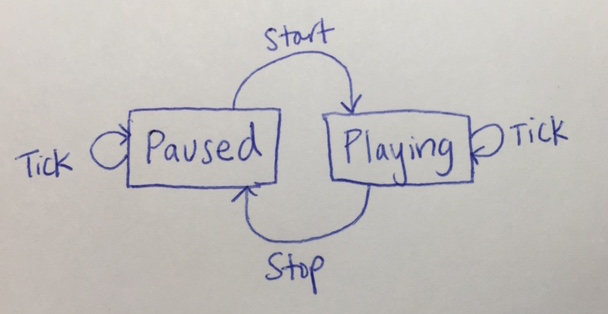
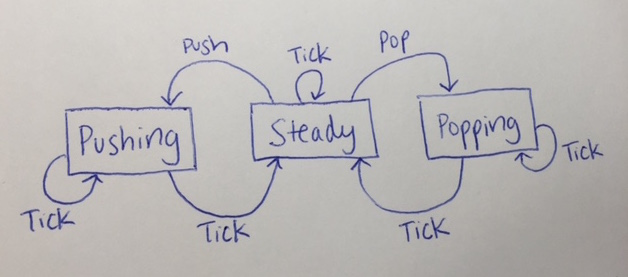

# 更多动画

我们将通过几个处理时间的示例进行更多工作。

## 示例：秒表

之前，我们实现了一个由增量和重置按钮控制的计数器。现在让我们实现一个"秒表"计数器，每隔一段时间（比如，每秒）增加一次，同时还有暂停和恢复计数器的按钮。

我们首先要确定，除了计数本身之外，我们的应用程序的`State`还需要跟踪秒表当前是`Paused`还是`Playing`。在后一种情况下，我们还要跟踪下一个更新计数的`Time`。

```
type alias State = (Int, RunState)
type RunState    = Paused | Playing Time 
```

我们定义类型`Msg`来描述由于按钮点击而发送的消息。我们希望将按钮`Msg`的信号与`Time`值的信号合并，因此我们定义了一个`Event`时间来描述这两种类型的联合。

```
type Msg         = Start | Stop
type Event       = NewTime Time | NewMsg (Time, Msg) 
```

#### 合并时间和其他信号

两种`Event`都携带生成更新值的时间，但提取这个值稍微麻烦，因为我们必须使用模式匹配来获取第一个组件。此外，我们以前已经看到了这种将信号与计时器合并的模式（在淡出点示例中）。因此，我们可以更一般地因素化上面的`Event`类型定义。

```
type TickOr msg  = Tick | M msg
type alias Event = (Time, TickOr Msg) 
```

请注意，我们如何使用类型变量`msg`作为我们将用`Msg`类型实例化它的指示。但是，当然，我们可以选择使用任何我们希望的类型变量（除了`number`或`comparable`，这将是不必要的限制）。

现在我们可以定义以下函数，将任意信号与每秒更新一次的计时器合并在一起

```
mergeWithTicker : Time -> Signal msg -> Signal (Time, TickOr msg)
mergeWithTicker t sig =
  let time = every t in
  Signal.merge
    ((\t   -> (t, Tick)) <~ time)
    ((\t m -> (t, M m))  <~ Signal.sampleOn sig time ~ sig) 
```

在定义通道`ch`以传递来自我们将绘制的按钮的`Start`和`Stop`消息之后，我们将其值与每秒更新十次的计时器合并。

```
ch : Signal.Channel Msg
ch = Signal.channel Start

main =
  view <~ Window.dimensions
        ~ Signal.foldp upstate (0, Paused)
            (mergeWithTicker (100 * millisecond) (Signal.subscribe ch)) 
```

#### 有限状态机

接下来，我们将看看如何响应`Event`更新我们的秒表。有两种`RunState`状态（`Paused`和`Playing`）和三种`TickOr Msg`消息（`Tick`，`Start`和`Stop`）。因此，我们可以将我们的应用程序的执行视为一个转换图，其中节点是`RunState`，边缘是`TickOr Msg`。



请注意，我们的图表省略了两个转换：从节点`Paused`到标记为`Stop`的边缘，以及从节点`Playing`到标记为`Start`的边缘。因此，我们将确保我们的应用程序不会进入这些未定义的配置之一。

我们定义`upstate`函数来处理上述每个转换。

```
delay = 1 * second

upstate : Event -> State -> State
upstate (now,tm) (n,p) = case (tm,p) of
  (M Start, Paused)      -> (n, Playing (now + delay))
  (M Stop,  Playing _)   -> (n, Paused)
  (Tick,    Paused)      -> (n, Paused)
  (Tick,    Playing end) -> if now < end then (n,p)
                            else (n+1, Playing (end + delay)) 
```

在时间`now`处理`Start`消息时，更新的`Playing`状态记录了应该增加计数器的时间`now + delay`。如果在秒表处于`Playing`状态时收到`Tick`消息，则如果当前时间大于先前计算的应该增加计数器的时间，则增加计数。此外，更新的状态包括下次更新计数器的时间。

根据我们的转换图，我们的模式并不全面。因为我们将在浏览器中运行我们的应用程序，而不是在`elm-repl`中，所以会悄无声息地引发运行时模式匹配异常。如果您怀疑您的 Elm 程序在悄无声息地崩溃，请在浏览器中打开 Web 控制台查看引发的任何 JavaScript 错误。

现在让我们绘制我们的 UI，以便我们永远不会进入未定义的配置之一。我们将重用我们在以前的讲座中开发的`myButton`函数，该函数使用`Collage`库绘制一个漂亮的有边框的按钮，可以更改颜色。我们将绘制一个单一的按钮，并根据当前的`RunState`设置其要发送的消息（`Start`或`Stop`）。

```
view (w,h) (n,p) =
     E.color Color.gray
  <| E.container (w-1) (h-1) E.middle
  <| E.flow E.down
  <| List.intersperse vspace
       [ n |> toString |> strStyle |> E.container btnW btnH E.middle
       , case (n,p) of 
           (0, Paused)    -> myButton (Signal.send ch Start) "Start" 
           (_, Paused)    -> myButton (Signal.send ch Start) "Resume" 
           (_, Playing _) -> myButton (Signal.send ch Stop)  "Pause" 
       ] 
```

注意我们选择一次只显示一个按钮，只发出有限状态机允许的信号。而不是绘制多个按钮，我们绘制一个单一的按钮，并适当选择事件。

我们一直小心地说服自己，即使语言没有，我们也永远不会在运行时尝试跟随未定义的转换。或者，我们可以选择定义一个名为`Toggle`或`()`的单个`Msg`值，其中`upstate`在两个`RunState`之间切换，如上所示。

其余的绘图代码与我们以前看到的代码类似。

```
vspace = E.spacer 0 10

strStyle : String -> E.Element
strStyle = T.fromString >> T.height 30 >> T.centered

lineStyle =
  let ls = C.defaultLine in
    { ls | color <- Color.darkCharcoal,
           width <- 10 }

btnW = 200
btnH = 60

myButton evt s =
  let mkBtn c =
    C.collage btnW btnH
        C.filled c (C.rect btnW btnH)
      , C.outlined lineStyle (C.rect btnW btnH)
      , strStyle s |> C.toForm
    ]
  in
  customButton evt
    (mkBtn Color.lightYellow)
    (mkBtn Color.lightOrange)
    (mkBtn Color.lightBlue) 
```

查看这个版本的[源代码](https://www.classes.cs.uchicago.edu/archive/2015/winter/22300-1/public-code/MoreAnimations/Stopwatch1.elm)和[演示](https://www.classes.cs.uchicago.edu/archive/2015/winter/22300-1/public-code/MoreAnimations/Stopwatch1.html)。

#### 重构事件

有一种巧妙的重新组织我们的设置的方法，避免了定义新的`Msg`和`TickOr`类型的需要。我们保持`State`表示相同...

```
type alias State = (Int, RunState)
type RunState    = Paused | Playing Time 
```

... 但将`Msg`定义为一个函数，给定当前的`time`和`State`，产生一个更新的`State`。注意，现在`Msg`只是一个类型`alias`。

```
type alias Msg   = (Time -> State -> State)
type alias Event = (Time, Msg) 
```

然后，我们将先前的`upstate`实现分解为每种消息类型的单独函数。

```
upstate : Event -> State -> State
upstate (now, f) st = f now st

start now (n,p) = case p of Paused    -> (n, Playing (now + delay))
stop  now (n,p) = case p of Playing _ -> (n, Paused)
tick  now (n,p) = case p of
                    Paused      -> (n, Paused)
                    Playing end -> if now < end then (n,p)
                                   else (n+1, Playing (end + delay)) 
```

注意`start`，`stop`和`tick`每个都有类型`Msg`。无论我们以前使用`Start`和`Stop`，现在我们使用`start`和`stop`。

```
ch = Signal.channel start

...

   ...
   , case (n,p) of 
       (0, Paused)    -> myButton (Signal.send ch start) "Start" 
       (_, Paused)    -> myButton (Signal.send ch start) "Resume" 
       (_, Playing _) -> myButton (Signal.send ch stop)  "Pause" 
   ... 
```

最后，我们重新定义`mergeWithTicker`以使用`tick`而不是`Tick`，以消除以前的包装器`M`数据构造函数，并更改其类型签名。

```
mergeWithTicker : Time -> Signal Msg -> Signal Event
mergeWithTicker t sig =
  let time = every t in
  Signal.merge
    ((\t   -> (t, tick)) <~ time)
    ((\t m -> (t, m))    <~ Signal.sampleOn sig time ~ sig) 
```


查看这个版本的[源代码](https://www.classes.cs.uchicago.edu/archive/2015/winter/22300-1/public-code/MoreAnimations/Stopwatch2.elm)和[演示](https://www.classes.cs.uchicago.edu/archive/2015/winter/22300-1/public-code/MoreAnimations/Stopwatch2.html)，它实现了与之前相同的功能。您可能更喜欢这个版本的组织方式，因为它避免了定义新类型`Msg`和`TickOr`的需要。

## 示例：绘制堆栈

我们下一个示例将是一个堆栈数据结构的动画。我们将简化假设，即我们的堆栈最多可能包含五个元素。

```
numRows = 5 
```

我们将首先使基本功能正常工作。然后，我们将允许用户使用文本框指定要推送的元素。最后，我们将使添加或移除的元素分别淡入或淡出。

#### 基本功能

我们将限制我们的堆栈只包含`String`值，这些值将被表示为`List`。此外，我们的`State`将跟踪堆栈是否处于`Steady`状态，或者我们正在进行`Pushing`或`Popping`。

```
type alias State = (List String, RunState)
type RunState    = Steady | Pushing Time Time Time | Popping Time Time Time 
```

在后两种情况下，我们会跟踪三个`Time`值：

+   一个`now`时间，即由计时器报告的最近的`Time`值；

+   一个`start`时间，即给定操作启动时的`Time`；

+   一个`end`时间，即给定操作将完成的`Time`。

我们将从一个最初为空的堆栈开始。

```
initState  = ([], Steady) 
```

我们将使用之前介绍的`TickOr`方法来帮助管理定时消息。

```
type Msg         = Push String | Pop | Noop
type TickOr msg  = Tick | M msg
type alias Event = (Time, TickOr Msg) 
```

为了在代码中简洁，我们为将要发送到通道上的不同类型的`Msg`定义了包装器。

```
pop    = Signal.send ch Pop
push s = Signal.send ch (Push s)
noop   = Signal.send ch Noop 
```

而且，与以前一样，我们将定义我们的应用程序根据发送到`ch`上的`Msg`以及当前`Time`的更新来更新。

```
mergeWithTicker : Time -> Signal msg -> Signal (Time, TickOr msg)
mergeWithTicker t sig =
  let time = every t in
  Signal.merge
    ((\t   -> (t, Tick)) <~ time)
    ((\t m -> (t, M m))  <~ Signal.sampleOn sig time ~ sig)

main =
  view <~ Window.dimensions
        ~ Signal.foldp upstate initState
            (mergeWithTicker (100 * millisecond) (Signal.subscribe ch)) 
```

#### 有限状态机



让我们开始处理对`Event`响应中状态之间的转换。我们将从始终使用`Steady`状态开始。

```
upstate : Event -> State -> State
upstate (now,tm) (stack,rs) = case (tm, rs) of
  (M Noop, _)          -> (stack, rs)
  (Tick, Steady)       -> (stack, rs)
  (M Pop, Steady)      -> (List.tail stack, Steady)
  (M (Push s), Steady) -> if | List.length stack < numRows -> (s::stack, Steady) 
```

与秒表示例一样，我们的模式匹配并不全面，因此我们必须小心防止在运行时尝试未定义的转换。在该示例中，我们渲染了一个按钮，并设置其消息与当前`State`同步。相比之下，在这个示例中，我们将始终渲染推送和弹出按钮，但在适当时禁用它们。

为了区分启用和禁用的按钮，我们首先定义了一个`myButton`的版本，当`enabled`参数为`False`时，会将生成的按钮颜色设置为`white`。

```
myButton enabled evt s =
  let mkBtn c =
    C.collage wBtn hBtn [
        C.filled c (C.rect wBtn hBtn)
      , C.outlined lineStyle (C.rect wBtn hBtn)
      , strStyle s |> C.toForm
    ]
  in
  let (x,y,z) =
    if | enabled   -> (Color.lightYellow, Color.lightOrange, Color.lightBlue)
       | otherwise -> (Color.white, Color.white, Color.white)
  in
  customButton evt (mkBtn x) (mkBtn y) (mkBtn z) 
```

然后，我们根据谓词`b`有条件地启用一个按钮。要禁用一个按钮，我们将其`Msg`设置为`Noop`，以便它不会对`State`产生影响。

```
maybeButton b evt s = if
  | b         -> myButton True evt s
  | otherwise -> myButton False noop s 
```

这里有一堆代码，用于渲染堆栈和操作它的按钮。

```
view : (Int,Int) -> State -> E.Element
view (w,h) (stack_,rs) =
  let stack = List.reverse stack_
      n     = List.length stack
  in
  let eButtons =
       E.flow E.down
    <| List.intersperse vSep
         [ maybeButton (rs == Steady && n < 5) (push "BLAH") "Push"
         , maybeButton (rs == Steady && n > 0) pop "Pop"
         ]
  in
  let eStack =
    let stackRect = C.rect wStackArea hStackArea
        stackBack = [ stackRect |> C.filled Color.lightGray ]
        stackFore = [ stackRect |> C.outlined lineStyle ]
        stackElts =
          stack |> List.indexedMap (\i s ->
            let
              rect = C.rect wBtn hRow
              box =
                [ rect |> C.filled Color.lightCharcoal
                , rect |> C.outlined C.defaultLine
                , s |> strStyle |> E.container wBtn hRow E.middle |> C.toForm
                ]
              move = C.move (0, center0 + toFloat (i*hRow))
              center0 = if
                | numRows % 2 == 1 -> -(((numRows-1)/2)*hRow)
                | otherwise        -> -(((numRows-1)/2)*hRow) - (hRow/2)
            in
            List.map move box
          )
    in
       C.collage wStackArea hStackArea
         (stackBack ++ List.concat stackElts ++ stackFore)
  in
  E.container (w-1) (h-1) E.middle
    (E.flow E.right [eStack, hSep, eButtons]) 
```

查看此版本的 [源代码](https://www.classes.cs.uchicago.edu/archive/2015/winter/22300-1/public-code/MoreAnimations/Stack1.elm) 和 [演示](https://www.classes.cs.uchicago.edu/archive/2015/winter/22300-1/public-code/MoreAnimations/Stack1.html)。

#### 输入字段

现在，我们不仅要推送 `"BLAH"` 值，还要添加一个文本框，以便用户可以输入值。[`Graphics.Input.Field`](http://package.elm-lang.org/packages/elm-lang/core/1.1.0/Graphics-Input-Field) 库提供了以下函数来创建文本输入字段。

```
field : Style -> (Content -> Signal.Message) -> String -> Content -> Element 
```

类型为 `Content` 的值将文本书籍的内容存储在一个 `String` 中，并包括有关哪些文本被突出显示的信息；

```
type alias Content = { string : String, selection : Selection } 
```

注意，`field` 的第二个参数必须是一个接受单个参数并返回 `Signal.message` 的函数。回想一下 [`Signal`](http://package.elm-lang.org/packages/elm-lang/core/1.0.0/Signal) 库中使用的以下函数，用于创建 `Message`。

```
send : Channel a -> a -> Message 
```

如果我们用类型为 `Channel Content` 的单个参数调用 `send`，则结果（函数）是我们需要传递给 `field` 的第二个参数的值类型。

因此，让我们创建一个用于从文本框传递 `Content` 值的通道。

```
textbox : Signal.Channel F.Content
textbox = Signal.channel F.noContent 
```

我们将订阅此通道，并将其当前值作为参数添加到 `view` 中，因为这是我们在点击推按钮时决定要 `Push` 的值的地方。

```
main =
  view <~ Window.dimensions
        ~ Signal.subscribe textbox
        ~ Signal.foldp upstate initState
            (mergeWithTicker (100 * millisecond) (Signal.subscribe ch)) 
```

在 `view` 函数中，我们定义了我们的字段以向 `textbox` 通道发送更新，并在字段中显示当前的 `Content`。我们设置了推按钮，以发送当前字段中的 `String` 值。

```
view : (Int,Int) -> F.Content -> State -> E.Element
view (w,h) con state =
  ...
         [ F.field fieldStyle (Signal.send textbox) "" con
         , maybeButton (rs == Steady && n < 5) (push con.string) "Push"
         , maybeButton (rs == Steady && n > 0) pop "Pop"
         ]
  ...

fieldStyle : F.Style
fieldStyle =
  let fs = F.defaultStyle in
  let ts = T.defaultStyle in
    { fs | style <- { ts | height <- Just 20 }} 
```

查看此版本的 [源代码](https://www.classes.cs.uchicago.edu/archive/2015/winter/22300-1/public-code/MoreAnimations/Stack2.elm) 和 [演示](https://www.classes.cs.uchicago.edu/archive/2015/winter/22300-1/public-code/MoreAnimations/Stack2.html)。

#### 渐变

我们的最后一个任务是对 `Push` 和 `Pop` 操作进行动画处理。我们更新 `upstate` 函数以利用 `Pushing` 和 `Popping` 构造函数。

```
upstate (now,tm) (stack,rs) = case (tm, rs) of

  (M Noop, _)    -> (stack, rs)
  (Tick, Steady) -> (stack, rs)

  (M Pop, Steady) ->
    (stack, Popping now now (now + delay))

  (M (Push s), Steady) -> if
    | List.length stack < numRows -> (s::stack, Pushing now now (now + delay))

  (Tick, Popping _ start end) -> if
    | now > end -> (List.tail stack, Steady)
    | otherwise -> (stack, Popping now start end)

  (Tick, Pushing _ start end) -> if
    | now > end -> (stack, Steady)
    | otherwise -> (stack, Pushing now start end) 
```

请注意，`Pop` 消息不会立即弹出栈，因为栈顶的值 `s` 将缓慢淡出，直到时间 `now + delay`。

在处理 `now` 时间的新 `Tick` 时，我们检查 `now` 是否超过了给定动画阶段的 `end`。如果是，则返回到 `Steady` 状态；否则，继续处于相同的动画状态并跟踪新的 `now` 时间。

与之前讲座中的 `FadingDots` 示例一样，我们将使用颜色的 alpha 组件来平滑地淡入和淡出对象。

```
setAlpha : Float -> Color.Color -> Color.Color
setAlpha a c =
  let rgb = Color.toRgb c in
  Color.rgba rgb.red rgb.green rgb.blue a

setAlphaLS a ls = { ls | color <- setAlpha a ls.color } 
```

在 `view` 中的“循环”（`indexedMap` 调用）中，我们检查当前状态是否为 `Popping` 或 `Pushing`，如果是，则设置栈顶元素的 alpha 组件（该元素由三部分表示：实心矩形、轮廓矩形和元素的文本值）。

```
...
let a =
  case (rs, i == n - 1) of
    (Popping now start end, True) -> (end-now)   / (end-start)
    (Pushing now start end, True) -> (now-start) / (end-start)
    _ -> 1.0
in
  [ rect |> C.filled (setAlpha a Color.lightCharcoal) |> move
  , rect |> C.outlined (setAlphaLS a C.defaultLine) |> move
  , s |> T.fromString |> T.height 30 |> T.color (setAlpha a Color.black)
      |> T.centered |> C.toForm |> move
  ])
... 
```


查看这个最终版本的[源代码](https://www.classes.cs.uchicago.edu/archive/2015/winter/22300-1/public-code/MoreAnimations/Stack3.elm)和[演示](https://www.classes.cs.uchicago.edu/archive/2015/winter/22300-1/public-code/MoreAnimations/Stack3.html)。

**可选练习**

我们的解决方案可以在许多方面得到改进。

+   当字段为空时，防止`Push`操作。

+   推广到任意大小的堆栈。

+   我们一直采取的方法相当低级，明确地操纵动画的当前、开始和结束时间。构建更高级的抽象，允许在两个形状之间平滑插值，并使用它们来重构示例。
