# CMU《面向技术高管的人机交互导论｜CMU 2015 Fall 08-763 Intro to HCI for Technology Executives》 - P11：Lecture 11 - Wednesday, December 09, 2015.zh_en - GPT中英字幕课程资源 - BV1pXjnzxEmL

Okay。So if you haven't finished doing the surveys， please do them some other time。

 As I've said a bunch of times， we really。Do take these seriously， any comments that you make。

 we will take into account when we redesign the class。

And the people who come after you next year will appreciate。Your feedback。

Other logistic information， Ive repeated the information about the exams， given it two times。

 didn't really have much choice about how early it is。On Monday， we yeah question。No， it's fine。

Both rooms are big enough to hold the whole class。So it doesn't matter at all。 Obviously。

 people who take it first don't talk to your classmates about。The content。And。Yeah。

 it's always worked out fine， usually it just works out that about half of people go to each one。

 so it doesn't matter。There's a little more information about the exam and the content and the format on。

This page， which is off the schedule page， it's paper and pencil， paper and pen， it's all on paper。

 you don't have to program anything， bring some pens or pencils， whatever you want。

And the distant students， the Silicon Valley， there's a particular time when they're going to take it in the Silicon Valley。

In some room over there， and other distance students should make arrangements with their advisor。

The last homework is do Monday。Next week and Wednesday is the last day to turn any homeworks in late。

 including the last one， because we have to grade them。啊。Any questions about logistics？

Hopefully everybody got their comments from their classmates。Yeah。Well。

 it's the same exam for both periods。 and usually people take about two hours。 some people are。

You know， just want to take the whole time。But it's designed to be about a two hour exam。

 but you have a three hour slot。And okay， so today there are two topics。

 the first one's international user interfaces， and the second one is mobile user interfaces。

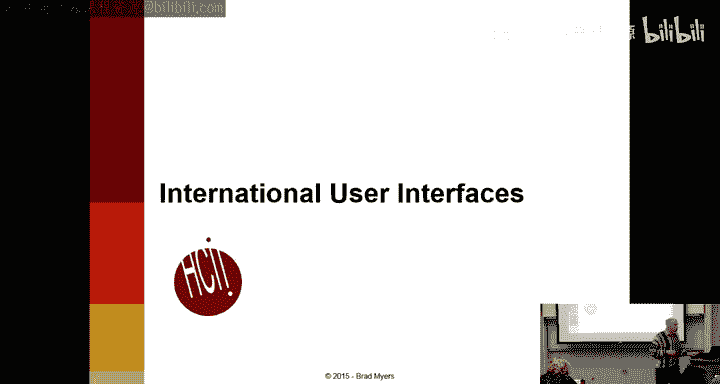

And both of these， if you remember last lecture， we had a whole list of new guidelines for things that have to do with the web。

 and similarly in these lectures， there's a whole bunch of new guidelines that have to do with particular kinds of interfaces。

So an international user interface， pretty obviously is an interface that used in multiple countries with multiple。

Languages， and there's often a lot more to making your product work in a different language than just changing the words from English to French or equivalent。

There's also the issue that the English version of your product or your webpage may be accessed all over the world。

 and so you might as well make it as easy as possible for people who are not necessarily English native speakers。

 but understand English， make them possible for them to use your website as well。

And this is a relatively important topic， of course。

 because so many people around the world are not American。

 I tried to get up to date information and this is a really cool site that actually has counters that。

Move in real time。 And it shows that about 9。8% or so of Internet users are in the United States these days。

 obviously， the biggest。User is China， biggest collection of users is in China。

It's obviously important to make sure that your products， web pages， or commercial products。

Work across all different languages and cultures。So there's actually two terms that go with international user interfaces。

 internationalization is kind of a more general term that means making your design。

Compatible with different nations， with different languages and different cultures。

 as opposed to localization， which is the process of translating your interface into another foreign language。

So you would localize and it doesn't have to be a foreign language。

 so you could localize a product to be UK versus Australia versus USA。

 even though they're all in English， localization generally includes translating it into French or whatever the local language is。

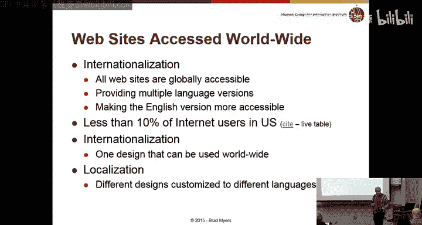

So some of the issues besides translating the language that you might have to consider。

 obviously icons are different， so the mailbox in the United States is blue when we moved to Canada。

 I lived in Toronto for four years and one of the key differences in terms of culture was that it seemed very American except all the mailboxes were red。

So。That seemed like a pretty minor difference。If you have a blue mailbox that doesn't necessarily mean that people are going to just know what that is。

 they might think it's a trash cam or whatever because they haven't seen mailboxes like that。

And so this little one on the left， which is animating。There's a flag。

 and that's kind of based on American rural mailboxes。

How many people actually have seen one of those physically？Okay。

 so a lot of you have seen it often this class has more foreign students who have obviously never seen a mailbox like that。

 and it's somewhat confusing about whether up or down of the little flag means that there's male right because you just kind of have to know。

The little icon tries to make that clearer。Because the door keeps opening。

 but if you don't have the animation， then obviously it's a lot different。

Icons with fingers or feet are offensive in some cultures。

 so this in America means everything's okay， is anybody from a culture where this is not？Acceptable。

I've been told that there are some cultures where that's considered not a nice gesture。

 obviously it's kind of arbitrary， which fingers mean things， right if I put up my middle finger。

 Americans would know that was a bad thing in other cultures that may not be。

So I'm not going to do it。And feet showing feet is considered offensive in what Thailand， I think。

 other places。So there definitely are some。Issues with those kind of things。So this is light switch。

 it's unlabeled， is that light switch on or off？Who has a hypothesis， yeah。Right yeah。

 so if it's a  two way switch， then obviously it could be arbitrary。

 but there's generally in America， if a switch is on， it's in which position。And in India。D right。

 so there's just the convention that this kind of switch is in the opposite positions in different cultures。

 depending on whether it's。Up or down is on。Another thing to avoid are things like visual puns。

So this is a table， everyone in America in English speaking languages would understand that's a table。

 but the word table is also of course used for spreadsheets。So spreadsheet tables。

 so you might imagine that might be a good icon to use to mean tables like spreadsheet tables。

 but in other languages that's actually not true so for example in Danish。

There are two different words， one for this kind of table and another one for a spreadsheet like table。

 So just because something。Means two things in English does not necessarily mean that the translation of that thing will mean the other thing that you're thinking of。

And so these kind of visual puns or analogies that work in English won't necessarily work in other languages。

Another issue of course， is sports that people in America would understand and people in other cultures might not understand。

 so like if I say we're going to hit a home run。Or the bases are loaded。

Then you'll understand that those are baseball metaphors if you're American。

 and you'll be really confused about what that has to do with anything if you're not American。

Football， American football similar if I said， okay， it's time to punt。Then， you know。

 does that mean that you're about to start or about to finish。

It really depends on what game you're thinking of。嗯。So arbitrary icons are even harder。

 so this in America is the Red Cross which people think of in terms of helping people。

 you might think that would be a good thing to use for help， but if you go to Switzerland。

 this crosses all over the place， why is that？It's the national symbol for Switzerland。

 It's on the flag。 And so there are all these red crosses all over the place。

 and they just mean you're in Switzerland and have no other implication in terms of being helpful or not。

 so thinking about this as。Helpful is just。Not an international kind of thing。

This is a recycling bin。That。Windows adopted instead of the trash can icon。

 and maybe people would understand those green arrows， maybe not。

 is anybody from a culture where they don't use these two arrows。

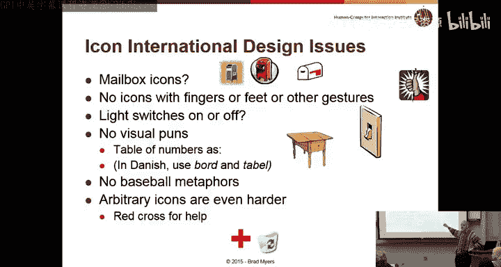

There are a few foreign students。So in the translation。

 there's definitely some things that you have to be careful about。

 it turns out it generally doesn't work to just take an arbitrary bilingual person and have them try and do translations for interfaces because there are all sorts of special words in foreign languages just like there are in English。

And so there was one example where。There were these two different operations。

 and they were translated by some translator into the same French word。

 whereas obviously they mean totally different things and just because。

They both have the word find in them。 They still need to be differentiated， you know。

 even after you translate the interface and other things like file and edit and so forth are certainly going to have standard words。

that are used throughout， say a French or Indian or Spanish， whatever。

 they are going to be standard words for each of those operations and obviously you need to use the standard words and also for obscure words like viewport and Canva and bring to front。

 which are ubiquitously used in English， and you have to figure out what their equivalent ubiquitously used words are in the other languages as well。

嗯。There are all sorts of issues with the interface。And the coding of the interface。

 so there are obviously lots of extra special characters。In other languages。

 there's accents of all different kinds and annotations on top of the letters。诶。Obviously。

 Asian alphabets have all sorts of further things。One important issue if you're sorting is and you have multiple languages is what's the sort order。

 how do you mix English and foreign words together？Microsoft Outlook。

Used to sort all foreign words after they American， after the English words。

 even if it just was like an A with an Ula on top or one of the other。Criticals。

 whatever those are called。Eventually， they decided not to do that， and they sorted them more。

By letter and so you know those are some of the kind of things that。

CanKin of mess up your usability if people are looking for things in big listss and they might have multiple languages。

Again， to try and make a lot of these are to try and make your English version more understandable to people who English might not be their first language。

So avoid， avoid abbreviations and slang。So we already talked about metaphors。

 typically you'll have a big first name field and a big last name field and maybe a single letter。

So it's kind of a。Attractive to have a really short label for that。

 so I've seen MI for middle initial， but people who are not native speakers won't have as easy a time of figuring out what abbreviations mean and so avoiding abbreviations make sure interface much more understandable for non- nativeatives and similarly。

 their abbreviations like NA。Which typically means not applicable or not available。

 but there are other things that can mean as well。So in terms of slang。So Americans。

 there are all sorts of expressions and idioms like let's go under the hood。

 which means for a car you lift up the hood and there's the engine and so you can start fiddling with things and getting into detail。

 but using that kind of language just makes your English harder to understand for people who are not native speakers。

And Nielsen gives the example of the expression， no cows on ice， on the ice。

Which is a very common expression in Denmark， where he's from。

 but most Englishlishspeak people wouldn't really know what it meant if you had an interface and you said no cows on ice on the ice。

 Any know what that means？Or have a hypothesis。Yeah， so the cows might break through anything else。

Any other thoughts？They shouldn't be there， right？And it's really hard to get them off right。

 because the ice is slippery。 So it's kind of。you're stuck there， it's dangerous。

 and you're going to have a hard time。You know， recovering。So there are all these implications that。

 you know， nobody would necessarily know。What they mean。

And there are a bunch of things that are just different that are cultural rather than language。

 so for example， how are kids school grades numbered or what do you call a school grade so in America it starts with kindergarten and then goes one through 12 but in lots of different cultures they start over with one again at different places。

 so Brazil restarts the name at age 15 and Japan restarts the name at age 12 and again at 15。

 so what we would call middle school and upper school。Is anybody from a culture that also has a。

A different numbering scheme。And so if you have a product that's for kids and you say grade four and above。

Then no one really knows what that means， right。It's much safer if you're trying to internationalize to use kids' age because everybody numberss that the same。

So if you said age 12 and above， then there's no ambiguity about who's for。Obviously。

 holidays are different across different cultures， so if you're doing cards or if you have some kind of calendaring application or whatever you may care about different holidays。

 one of the classic ones is Thanksgiving。So Americans have Thanksgiving in November， Canadians。

 anybody Canadian。😊，When is Canadian Thanksgiving。Am I know。

Right it's about a month before in October， it's exactly the same holiday they have exactly the same kind of food and stuff like that。

 they just do it a month earlier because it's colder in Canada than。America。

Independence Day and America's July 4th， Canada has a Canada Day， which is similar。

 but other countries also have Independence Day at all sorts of different times depending on when they got independent。

Obviously， and things like Mother's Day may or may not be celebrated in different cultures and some have adopted American Mother's Day。

 I had a Korean student who said they had a parent day， so they didn't differentiate as much。

And it was， again， a different time of year， things like that。

Typically there are little boxes for first name and last name and that you have to sort based on one or the other。

 and this is very cultural as well， there are a lot of cultures that don't name things this the way America Americans do。

诶。And some places try and label things a little clearer with given name or family name。

 which may or not be helpful。So that's always tricky。I've。

Had a particular class I taught a few years ago that was mostly Korean students。

 and there was a surprisingly large number of repeats of names。In fact。

 there were like five min Kims in the class and so having just the first and the last name be unique is fairly is not something good to rely on。

 so things like searching for people and Wikipedia or LinkedIn or Facebook is not the most effective way of trying to find people。

So Kim Lee and Park accounted for nearly half of the sur names in Korea。On the other hand。

 email addresses are usually globally unique because otherwise the email system wouldn't work。

 so that's a much better way of sorting if you can get away with it。

Paper is different sizes and different cultures， so America uses inches。

 obviously most of the rest of the world uses centimeters and so they have sizes like A4， a3 A2。

 A4 is similar to8 and a half by 11 but it's a little narrower and a little taller。

 so you have to take that into account。There are lots of interesting issues with numbers。

Obviously the symbols for currency varies all over the world。

 the annoying thing of course is that the dollar sign is not unique， so there's American dollars。

 there's Canadian dollars， there's Australian dollars。

 and they're all totally different amounts and of course they vary with respect to each other about which one's more valuable。

And then there are obviously other currencies like the yen。

 which is worth like 100th as much as a dollar， so 1000 yen or 100th anyway。

1 thousand0 yen isn't anything like $1，000， it's like $100 or $1， I can't remember。

You certainly wouldn't want to sell things wrong。And weights and sizes and clothing sizes are all different。

 so if you wear a size。14 shirt。That may be meaningful in the US。

 but completely irrelevant for the rest of the world without any。嗯。Obvious way of converting it。

And similarly， for things like weight or。You know， dimensions or whatever。

One that I found really surprising is that a billion actually means something totally different in England。

So some places it means 1000 million and other places it means a million million。

 which are quite different， and if you're selling an aircraft carrier。

 you'd probably want to be careful about which one of these you're selling it for。

 so how many people think a billion is 1000 million？About a million million。So in America， it is 1。

000 million。And I think it's Britain， it's a million million， which we call what？A trillion， yeah。

 which doesn't have three of anything， actually。呃。So why it's called the trillion is not。You know。

 so obvious。嗯。Number formats， so across the world they use commas where we use periods and vice versa。

 which can be really confusing， especially if you're trying to understand where the decimal point is。

Usually for money。You can tell because you wouldn't have three digits of pennies。

 but sometimes it's confusing and it's really important to get that right。And it's， you know。

 obviously if you're doing an e-commerce site or if you're even if you're a news site。

 you want to try and be careful to make sure everybody can tell what you're talking about。

Time formats， obviously America likes to use the AMPM marker。

 which of course results in everybody setting their alarm for 2，30 a all the time。

So the European or military time of using it at the 24 hour clock is a little more reliable。

There's also time zone issues， so if you're going to say our customer service is open from 10 to three。

That's completely meaningless because you have to say what time zone you're giving those numbers in。

 and especially since a lot of companies are Kg about where their headquarters are located。

 they won't even tell you what city theyre talking about。

 so anytime you're giving time you have to give time zones as well。Date formats。

Are really ambiguous and change all over the world so it turns out。If you have a date like 10，11，12。

That every single permutation of that is used somewhere。Right so。

Who's from a culture where this is the month？So that's the American way， this is October。

 who's from a culture where， this is a day。That's India。Where else？Any else？Yeah。Soin。Really。

 that's even worse。 at least in America， if you're doing it for Americans。

 you're pretty sure which one it is。 and this is the year in Sweden， anywhere else。

Where the year is first， obviously that's the computerist way to do it because if you go year。

 month day， then it's a lot easier to sort。The way that Americans do it where the year is last and the day the month is first means that it's much harder to sort that way。

嗯。So， you know， you probably should never have dates like this on a site that's going to be read in more than one country because nobody will have any idea what you're talking about。

 whereas October 11th。Or 11 October， you， obviously nobody's going to have trouble with that。嗯。

Europeans occasionally。Number of things like by weeks， like week number 25。

 I discovered that there's a way to turn。Outlook， so that it'll show you these numbers because my German I was doing a collaboration with some Germans and they kept saying that they were going to be done in week 27 and it's like I have no idea what you're talking about。

 but outlooklook will tell you the answer to that question。

But you know you'd want to avoid that kind of thing if you're building a European website that you want Americans to understand。

Obviously， telephone number formats vary all over the world。

 even in some countries have a different number of digits。

So some countries have a different number for cell phone numbers versus landline numbers。

Anybody from a culture from a country does that， I think Italy。

Has different numbers of digits for as India do， too？嗯。

And then obviously the country code and some people put zeros here to show you what to do if you're in country or out of country。

 and then you have to know whether to use that or not。

 and the particular symbols that are used in different places， obviously varies all over the world。

 how they're grouped， so this is grouped in twos versus America， which is three and four。

 other countries have different groupings as well。And so the easiest thing to do is to just allow people to type it in however they want。

 and then have a little bit of JavaScript that actually strips those out and checks the number of digits or something。

Because if you make people type things in， as we said before， with no punctuation。

 they're much more likely to make mistakes。There's a great story that first when the military first started using GPS units。

They went， they were assigned to Europe and the GPS units immediately broke because they weren't。

Able to handle the fact that the zero line for longitude goes through England。

 and so if you go east of that， then you get negative numbers for the longitude and they hadn't taken that into account。

That obviously is a pretty easy thing to fix， but if you don't take into account that the GPS numbers can go in both directions。

 you'll be in trouble。So what do you have to deal with when you're localizing。

 So we already talked about changing the icons and changing the。The you know。

 avoiding using special idioms and so forth。 but you also may want to change the content itself。

So for example， the German Yahoo site， and they just changed this， one of the problems with this。

Lecture is I have to， you know。Spend hours every year confirming how things have changed。Whoops。

 they't really want to show that。嗯。So the Yahoo site has a different set of icons。Compared to。

 let's see what the US site is talking about today。

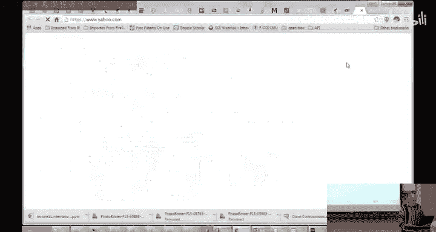

Probably different stories， so obviously there are very different stories here。嗯。

And it turns out also maybe I should go to the French site， iss that likely to be worse？嗯。

It turns out the list of icons is different and the different topics that are available at the top level is different based on the different countries。

 so German has locale or local。Where the US has autos and so forth。The language is different lengths。

 right so if you have a nice graphic design in English， it may not work in a foreign language。

So for example， here's the print dialogue in a variety of languages。So in English。

 and then in German， it has to be a little white because German is a really white， I mean， verbose。

 I know， lots of letters for the same content。And the I't have any idea what language this is。

 anybody know？Is this Korean？Chinese。So in this one， it's again。

Wider and shorter and there are even some differences in this is Korean。

There are even some differences in what actual options there are sometimes。So on the font dialogue。

In German， there's a whole extra tab。Anybody here speak German？嗯。

So if you switch Microsoft Word from English to German。

 you get a whole extra tab that deals with something that you have to deal with in German that you don't have to deal with in English。

And it's also not。In these other dialogues， either。There's some other choices somewhere。

 maybe on this one。

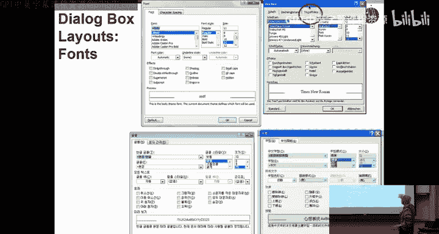

Yeah， so this one also has。Extra fields。So， there's this extra。Now， this is only one。呃。

Radio button for mirror anddent there and don't add space between paragraphs， and here there's two。

In each of these， so there's some extra requirement for paragraphs in Asian languages。

 which doesn't come up in English or German。Tell me what this means。Any of our Asian students？No。So。

 you know it's not just about changing the language， there are also maybe features。

That you have to take into account as well， and the size can vary。🤧。

So typically you're going to have an English version and a German version and a French version or whatever of your content。

嗯。And it's really frustrating if it's not clear which is which。

So this is a German university that has a nice English page for us。

 Call through Institute of Technology， this whole page is in English。And it says。

You know guiding principles for studies and teaching at KIT that calls Rus Technology。

 right so it sounds like I could find out some really good information by clicking on that link。

But it turns out。That that link takes you to a page that's all intert and there is no English version of this page right so that would be pretty frustrating if you only spoke English and you really cared about finding out something out about this university is that it has this。

TheseAll of these links， pretty much every link on this page goes to a German page and not an English page。

 which is pretty frustrating。So， the。The guideline is if you aren't going to translate the pages in the back。

 you should make that clear with the links and so forth。

The general guideline is if you're going to have foreign language pages that you should not use flags。

嗯。Because lots of different people use the same foreign language。So this is。Discover Mongolia。

Apparently as far away there we are。This one， by default， seems to have come up in English。

Even though the flag。Looks like it's for Japan and notice that the。English choice。

Seems to have some kind of British flag or maybe some kind of hybrid， it's a pretty confusing icon。

And you know， if you're in America， you don't really want to click on a British flag and if you're in。

I don't know。Portugal or Brazil， you probably don't want to click on the flag from the other country and already yet Portugal and so forth。

The idea is that you shouldn't really use the flags to indicate what foreign language that people should use。

 It turns out on Yahoo。They do use flags， but that's because they actually are country specific。

So the American version of Yahoo is very different than the British version of Yahoo and different than the Australian version。

 So that that's okay because they're not using the flag to mean。English。

 they're using it to actually mean what country they are talking about。

The right way to let people translate or find their。诶。I find there。

Language is to have the language in its own。O spelling of itself。

So if you go to a page that's all in Korean and you're trying to find the link to click on that says English and the word English is only written with Korean characters you're never going to be able to find it。

So it doesn't make any sense to try to find。The word English written with Korean characters。

 and similarly， if you only speak Korean and you said Korean in English。

 people wouldn't be able to find that one either。嗯。So here's。呃。This is。Oops。

And you that would be helpful if we let Google translate it， so this is a tourism site for Thailand。

Right。Which of those。Words in T means switch this page to the English。

You have to read Thai in order to know what to click on and of course if you already knew Thai。

 you wouldn't need the English version of this page and it's especially bad since this is trying to promote tourism in Thailand。

So they're very specifically trying to reach out to people who don't speak Thai， any guesses？

Where one would click？Yeah， exactly。 So it turns out to be none of those， right you'd have to spend。

 know minutes clicking on everything。And here's some words that are in English。

It turns out that doesn't actually help。

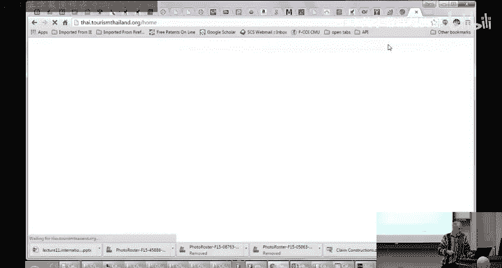

Clicking on that。Actually just turns it off， makes it presumably making it worse。

It's actually this one right here， but it doesn't even pop up。

 you have to click on it and then you get a long list of flags right。

 so even it doesn't even have hover text， you have to click on it。And actually。

 they redesigned this from last year。And moved it。 It used to be in the middle。

But they still didn't fix this problem。 And here again， we're also using。Flags。For language。

 and Denmark is English。 I don't know。 I guess they didn't want to bother translating it into Danish。

 And they figured， oh， well， all the Danish know English。 So we'll just。

Skip that and it's no particular order， I guess it'。What。What's by country， though。

 it's not alphabetical by country。Right。Yeah， yeah， exactly。 I mean。

 so USA and United Kingdom and Denmark are all labeled English。

But it actually has the same content no matter which of the English pages you go to。so this is。

Kind of a。Good example of what not to do。Oops。So one issue is that a browser may not necessarily have the fonts for your language。

So this is actually a picture。Of Korean and so this is a good place to actually use a picture rather than trying to use fonts so if you said use a Korean font。

 write the word Korean。If the user doesn't speak Korean， they might not have a Korean font loaded。

 and then you'll just end up with boxes or something even more confusing。There are certain。

English characters that。You Roman characters you can count on all over the world。Other characters。

 not necessarily。And so using a picture of the text is a good idea。And typically you would want。

So every country has a two letter country code， I'm sure everybody's aware that。

 and if you go to something dot KR， you would pretty much expect it to be in Korean， if you go to US。

 you'd expect it to be in English， if you go to dot。I don't know， I， IN， whatever。

 you'd expect the native language， whatever it is。嗯。And usually the dotcom version is in English。

 although not necessarily the internet was invented in the United States。

 and so we got first dibs on all the extensions and so most of the extensions where you don't have a letter code are in English。

We went through these already。If you have a product。

If you have an e-commerce site and you have a product you're trying to ship。

Then you have to decide whether you're willing to sell to people all over the world， and if so。

 then you have to have mechanisms to let people type in addresses that are not the same as your local addresses。

So usually people have credit cards all over the world and so they know that can handle the currency issues。

 you can charge them $12 and whatever currency their credit card is in。

 the banks will figure it out and give you the right amount of money and charge them the right amount of money。

 but you still have to get them the product， and so your address pages have to be able to handle address all over the world。

There are legal issues like sales taxes or VAat taxes， which you may or may not have to deal with。

 import duties and all sorts of things like that。And you'll need to deal with non US characters in various fields。

呃。Even like America and Canada， which have very similar looking addresses。嗯。

Call the zip code something different and have different formats for the postal code。 So in Canada。

 it's just， it's 6。Six digits， but they're letter number， letter， number， letter number。

 so it alternates letters and numbers and the British ones have seven。

Which are also letters and numbers。And obviously America we use states。

 most of the places in the world don't use states， Canada uses provinces。

 but lots of places don't differentiate that way。And state is kind of a weird word。

Because the State Department deals with other countries and so most people think of the wordstate as country。

So there is some ambiguity or confusion about。Whether the country goes in that field or the subdivision。

 so anybody from Germany， Germany has states as well， what do people call them in other countries？

What does India call them？States， okay。呃。So Canada calls them provinces。

 some countries don't even divide up that way， like small countries like Israel。

 they don't need states， so that field doesn't have any meaning in smaller countries。

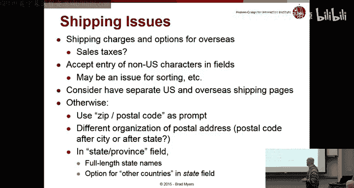

We talked about this already。

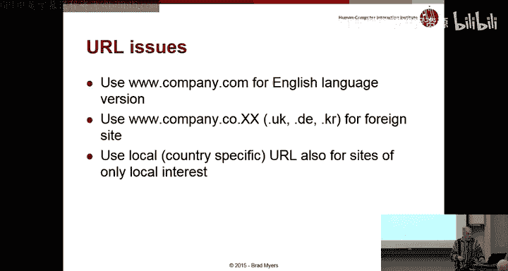

Okay， so how are you going to implement this， so in a web page。

 you can sometimes part of the HCTP protocol allows you to ask。For locale information。

 although you can't really count on it。Because some servers like。Yahoo or Gmail。

Some of the ISPs are all over the world and so they won't necessarily tell you where this request is coming from。

 but that does give you some information if you want to translate the pages based on the URL。

 or you can have people after people log in， they can have preferences for languages and so forth。

 obviously the most common is to have a front page option and then have basically two sets or end sets of pages。

 one for each language。If you're making a desktop application。

There's something called the resource file， which lets you。Write your code。

 the actual application code， completely independent of all the words that are on the screen。

And those are kind of a detailed issue， but if you're writing code for an application that's a Mac or Windows application。

 you won't have any strings。And no error messages， no prompts， no labels。

 none of that will be in the code itself， instead you'll have to use IDs which at runtime are mapped or at load time are mapped to different sets of words。

RightAnd。诶。That's that makes it much easier for the。Application。To be ported to different。

Natural languages， but it's much harder to debug and it's much harder to develop applications that way because you never have any actual messages in your code。

 so it makes it hard to find things。Also， if you want to have constructed messages that's really hard to do。

 so it's much more useful to say something like can't copy filefo to directorybar because of the file is full or something。

 but if you wanted to do that in a bunch of different languages， obviously the order。

That those words would be used， would be in different places。 You might need different。

Modifiers in front of words depending on the language， so US is full of articles like A and D。

 which other languages do or don't have singular plural issues and so forth。

So that makes it much harder to construct。Messages for in your code。

 and this could apply to web pages as well。And then things like the locations and sizes and how times are。

Marked and all these kind of things， instead of doing them as strings。

 you need to do them as objects so that the system then can generate the right what's called locale。

And it turns out that。To the extent that you're building this on Windows or Mac。

Presumably LinuxinX as well， there are a bunch of features in the libraries in the SDKs that will help with this。

So that they're built in routines that will help format dates appropriately convert numbers into the right format and things like that。

So。In Windows。Since 2007， it's called regionion and languageage。

 and so here Ive picked English and it shows all of the particular ways of formatting things that we like in America。

Whereas if you pick French Canada， notice that it's not just the language that's changed。

 but the order of things has changed， whether and it has examples。嗯。And。Germany， again。

 things are in different orders。So 3，12， 2011， so apparently in Germany。

 the month goes in the middle。And so these are some of the things that you can either individually deal with。

 and then in your code， there'll be an API call for something like convert this date into a string。

And behind the scenes， that routine will look up what local it is and then do the right thing based on all the different languages that Windows supports。

But you can't rely on something like this for currency because obviously that makes no sense。

 even if the locale will tell you what symbol to use for dollars。

 obviously you don't know how to convert the number of how much American dollars this is into any foreign currency without looking it up on some banks's website to figure out what the currency is this second。

So that can't be done automatically， so you have to be really careful about that。And then， finally。

User testing， it turns out there's been a lot of great documented examples where systems were built the right way and user tested and iterated in the United States。

 and then they were farmed out to a translation agency。

 translated into a foreign language and then failed miserably because，It didn't have any。

 because there were all sorts of usability problems in the foreign version。

And so to the extent that you are converting your website into a foreign version。

 you need to do usability testing in the foreign languages as well， just to make sure you didn't。

You know， mess up any of these kind of issues。And so the only way really to do that effectively is to have native speakers and people who are familiar with the culture and who are very computer savvy in the foreign language that you're targeting actually participate in this。

 either usability specialists who can do heuristic analysis like you guys were doing and look for the language issues and consistency and so forth or actually testing with native users。

 and sometimes you can find a usability。Company， know consultancy company that can help you with this。

 or if you're going to do your own user testing， typically you can Skype or do these kind of things remotely。

Okay。So the next topic somewhat briefly are mobile user interfaces， and again。

 these are extra sets of recommendations if you're going to build yourself a mobile application。

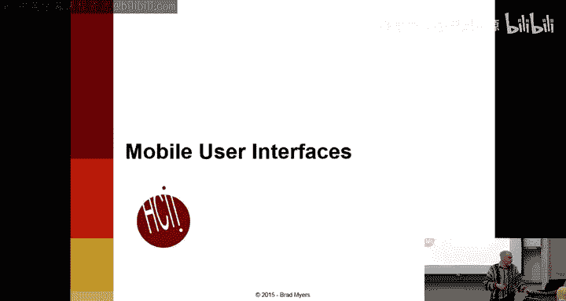

It's pretty obvious why you need to deal with mobile user interfaces now。Mobile generally means。IPhs。

 also tablets and。There are about 7 billion mobile phone users around the world。

About 65% of Americans now own smartphones and clearly the number of。To the extent that。

 you have a web page or an app or any kind of information or product。

Most people are getting to it through a mobile platform。I really like this graph。

So what this is trying to show is that in the early days。

There were all sorts of variety of different kinds of computers。

 so this other was the biggest category for a while because there were just so many。And。

Then eventually， and this red is Macintosh or Apple。But eventually， starting about 95， Windows 95。

 almost everything was Windows。So every computer device that people had。

 almost all of them were running windows of some kind of other。And nowadays。At this point。

 this was 2012， I guess。Less than half of all computer devices。Were windows。

And the reason is not because of Apple， if you notice the Apple red line is surprisingly constant percent。

Market share throughout this entire time， it's you know， kind of the same size。

 but obviously this Android is this green area， you know， is just dominating and if you。

And this curve continues in that general way， obviously Windows phone is a total flop。

 nobody's using it， and so Windows is continuing to shrink as a percent of all computational devices。

Another way of looking at it is the percent of PC kind of devices。

 so this includes apples and Macintosh laptops and desktop machines。In 2010 was when the smartphone。

诶。And。Tablets past the Windows and Mac or notebooks and PCs in terms of percent。

 Then it's the number of desktop。Units have stayed pretty constant。So the same number。

 pretty much the same number of laptops and desktops in the world。

 But obviously the number of smartphones and tablets has just skyrocketed and continues in that way。

 So there's clearly that the number of。

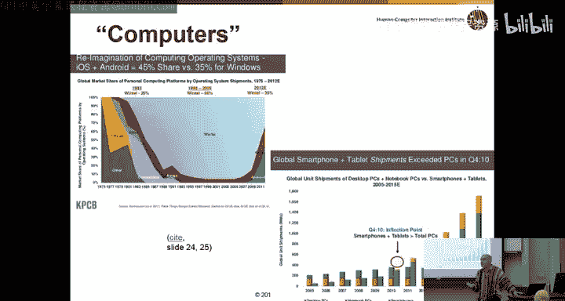

People who are accessing your。Our products， your web pages。

 is going to be dominated by mobile devices。嗯。So these are just some。

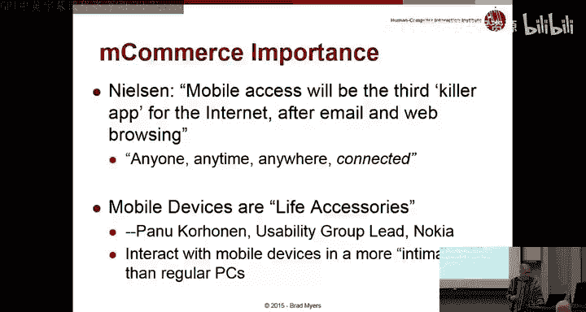

Quotes about that。 so Nielsen did his usual studies of mobile usability and he。

Identified all sorts of big problems with websites and apps in terms of usability。

 so in 2009 he showed that the success rate was only 59% versus 80% for pretty much the same products on PCs。

 and he reports that it's much better today， although he doesn't give any numbers that nowadays they're much more comparable that people are doing fairly successful web access。

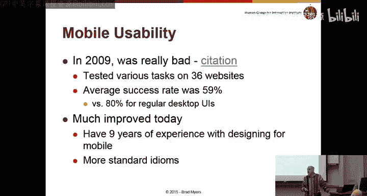

One thing to keep in mind that's really different between the way people use laptops and the way you use a phone or is the context。

 the way that theyre typically used， so typically if you're going to pull out your phone。

You're going to do a task very quickly and then you're going to put it away so most people when you know if you're going to bring up Microsoft Word。

 typically it's not because you want to type in five characters or because you want to just look something up quickly if you're going to bring up Microsoft Word。

 you're probably going to sit for half an hour or maybe five hours and write a document。

So the fact that it takes three or four minutes for Microsoft Word to come up may not be a big percent of the time。

 whereas if you pull out a phone and you want to look up something in your calendar。

 you'd be really annoyed if it took as long as it takes a laptop to wake up and to get into Microsoft Word。

So the key requirement for applications and web pages on a phone is that you have to be able to get the piece of information you want right away。

And it's very different than the usage model for applications on your desktop。And so。

You need short interactions， the actions are frequently interrupted。

Sometimes the PC will say things like， I'm going to spin a little ball now and not let you do anything at all。

 and that's okay， you just have to wait or don't touch anything， I'm busy。Wait a second。

 and I'll come back to you。Turs out the phone is never allowed to do that。

 right at any time you might get a call and that has to interrupt whatever you're doing right And so the Androids and iOS operating systems are。

Willing to interrupt any activity to answer the phone or when the user presses the button。

 obviously if there're bugs or something， then that's not intentional。

 but according to the design requirements， you're never allowed to lock up the device。

You're typically using a phone in public。Whereas laptop use can be private or is generally private so that different assumptions。

Phos are kind of a fashion statement at this point， so people put decorative backs on their phones。

 most people have not decorated their laptops， although some people do。

 but most people in the room have not， whereas probably almost everybody has an interesting case for their phone or whatever。

嗯。And obviously， phones are much more personal， less business oriented。

 and people tend to put more value in design。

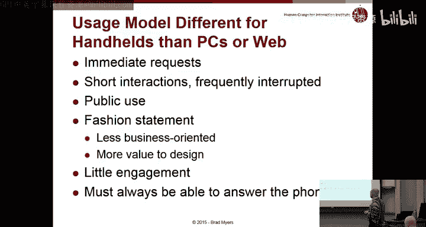

The current。Motra of designers is to design mobile first。

 and what that means is that if you're going to have a version of your web page for mobile and a version for desktop。

 design the mobile one first。And the key reason for that is to make you focus on what's the most important aspects of your。

Product， what is the most important content， What are the most important actions。

 How can we reduce our system so that it has a good mobile。

Presence a mobile usability and then we'll reflect that back on our desktop application and make sure those tasks still are really easy to use right and so this is a way of focusing you on what it is that is really your key requirements。

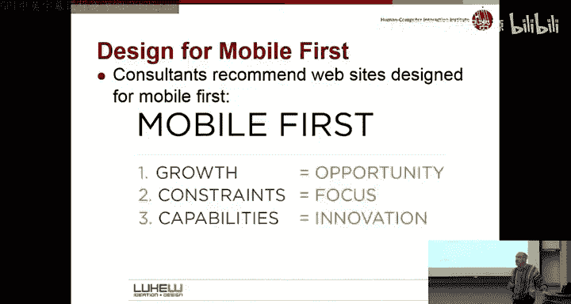

If you just take your Windows design or your desktop design and put it on mobile。

 then all sorts of interesting。Usability problems appear， the first one。

Highlighted by this early webp page is that。Almost all of the first page is filled with navigation buttons。

And chromroe and decorations and things like that that had no real use for people。Right。

 and so as opposed to。Having the ability to see more of the content that you're really looking for on each page。

If you have a product page where you can't really see the product， like unless you scroll。

 that's obviously a big disadvantage on Windows， on a desktop machine。

 it would be perfectly reasonable to have all this extra navigation stuff at the top。

 it doesn't really work on a mobile device。

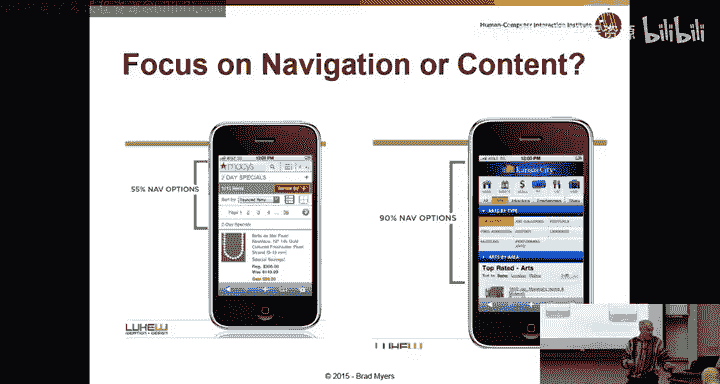

Obviously， if you're building for a particular。Device。

 you have to follow the device standards and it。Can vary based on a variety of things。

 so obviously iOS versus Android have different requirements for how the apps look and how the web pages look。

 but also some of the carriers have their own requirements， so Verizon versus AT&T。

And you know even on a particular platform like the iPhone。

 you have a bunch of different sizes on Android， you have a lot of different buttons。

 physical buttons， as well as virtual buttons， Does anybody have a phone with a keyboard？

So there are some Android phones with keyboards。And obviously。

 the older Blackberry phones all had keyboards。But most people don't have those anymore。

It turns out there are amazing number of Android screen sizes。And this is a。

Graphic to try and emphasize the enormous number of different devices and their market share over some period of time。

 681。682，000 different Android devices that are on the market at the same time。And。

Theyre equally in large number of screen sizes。 So， you know。

 who would design a screen that's 993 by 1688。 You know， why would they do that， Who knows？

 But it is a screen size that's on some kind of Android devices。 So you。Whereas Apple。

 you can pretty much count on there being what four， three， three or four different screen sizes。

 maybe five or six， if you're counting iPads too on Android do you have 600。

000 different screen sizes or something ridiculous。

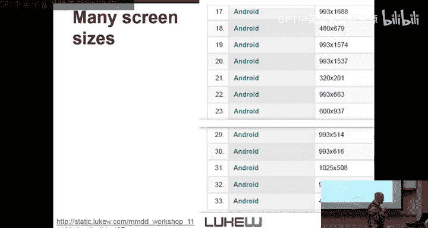

I like this study that even though it's really， really old。

 the original palm pilotlot device designers articulated a bunch of requirements for the designs。

 and some of these have been kind of forgotten， but they're still really important for usability。

That。The key requirement for their little device was to identify what people wanted to do most often。

And make it so that you could do those with a single press。

And this violated all sorts of principles at the time。 So， for example， in the original palm design。

To make a new appointment on your calendar， you could pull it out。 You can press。The calendar button。

And then you could tap on the screen and immediately it would start letting you enter the text for the event at the time that you tapped on。

 so after two taps you were already entering the time to delete an event from your calendar。

Required clicking on the device and going through four or five dialogue boxes。

W and whereas if you think of on regular PC applications for a calendar。

 they're much more likely to be symmetrical that the way to create something and the way to delete it。

You know， copy and paste。Cut and paste or equivalent， whereas on the original palm。

 there was this enormous difference between the ease of use of adding a calendar item versus deleting a calendar item why was that because people almost never delete calendar items？

Whereas people are adding them all the time and one of the key use cases for your phone is or your PDA。

 is you pull it out of your pocket， you want to see where you are now， so whenever you hit。

This button， the calendar always came up to now， right， almost all other apps。

Always came up to where you used to be。So that's kind of a principle and most desktop applications。

 if you close and you open it again， it comes up where you were before。But calendars。

 you don't want them to come up where you were before。

 you want them to come up to now so you know what's going on next。And you wanted to make it。

 So it's really trivial to do the operations you want to do。

 So understanding the tasks that users have。 remember。

 we talked about doing task analysis before is really crucial to making it so that。

The experience that you have on your phone， on your small devices is really fluid and。Effective。

 they make the analogy to a stapler and a staple remover， so most people。

 I don't know if you guys actually use paper anymore。

 but most people who use paper have a stapler on top of their desk。

 but they've probably lost a staple remover because no one ever takes things apart very much。

Where compared to how often you put them together。And note that this violates consistency。

 so not only are delete and addd inconsistent with each other。

 but it's inconsistent with the way you're used to doing these on a PC。

And the designers of the palm pilot realized that this was going to be an important enough requirement that they decided explicitly to reverse this。

 and one of the reasons that Windows has done so poorly is that they made the opposite decision they said。

It's really important to be consistent with a PC。 So their advertising said things like if you know a PC。

 you know how to use our Windows phone。But it turns out。

 of course what that means is on a PC it's okay to do 12 taps to get to something and so on a Windows phone they made it work the same way and so 12 taps later you're finally into your calendar adding an item which was really。

Reflected poorly。On their usability。And in some sense。

 they made the same mistake in reverse with Windows 8。And they said， okay。

 we're going to take the cool user interface we invented for phones and do it exactly the same way on the laptop。

Whereas on the laptop the modes of use are so different。

 you have a mouse which is extremely high resolution compared to your finger。

 which is low resolution， you have a keyboard so typing is much preferred over swiping for example。

 it's really hard to swipe with a mouse whereas with your finger it's really easy so assuming that these different。

Models， these different contexts， should have a same user interface is generally a really bad mistake。

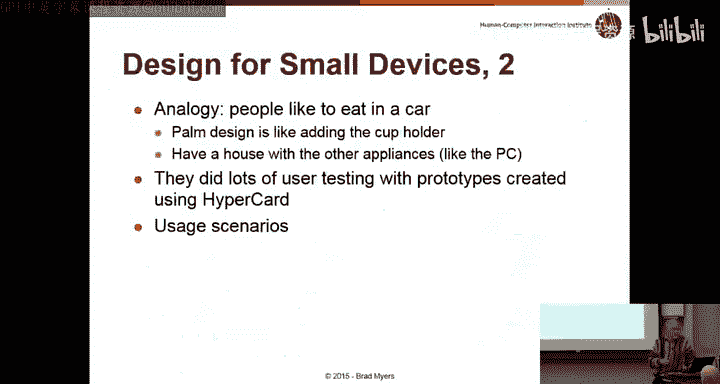

Let's go pass that。And they actually wrote about some of this stuff in the original Windows CE designs。

 which is their first Windows for small devices， CE stands for Compact Edition。

So this was the predecessor to the Windows phone， and they wrote this paper where they said。

 we did all this user testing and showed that。A right size for things to press with your finger was  nine millm square。

 but that didn't let us put enough stuff on the screen。

 so we ignored the user studies and made things5 millime square。It's like， well， duh。

and the difference between press down and move and so forth was going to be two millimeters right and so they did all this user testing and then kind of ignored it and then they shouldn't have been so surprised when it turns out their devices were kind of hard to use and people were making all sorts of mistakes。

And similarly， same idea， they identified that。A ten0 point font was what they kind of needed for readability。

 but they couldn't get enough text squeezed on the screen at the same time。

 so they used a smaller font， even though it tested much more poorly。诶。So not too surprising。

 that didn't work out well for them。So the big mantra nowadays is responsive design and so this means that the websites adjust themselves。

 so rather than having two versions of your website， one for mobile and one for desktop。

 you have one version with code behind the scenes that computes what the interface should look like based on your。

And we talked about this a little bit。It turns out that they've in the HTML5 and CSS。

 the new version of CSS， which I think is three， there are some codes that make it relatively easy to do this。

 there's something called media， which you can ask okay。

 what size of my page and if it's in between these ranges。

 use this design if it's in between these other ranges use this other design。

 so you don't actually have to write code， and some browsers。

 some editors like Dreamweaver will let you just draw pictures of how you want it to look in the different sizes。

嗯。呃。Nelsen did a study where he complains about how。

Some people are using responsive design to put the handheld user interface now on desktops。

 which means you get websites like this。That have a little hamburger icon in the top corner and leave most of the interface blank because on the phone。

 you really wouldn't be able to do it much here and so if you click on this on Evernote。

 you get this enormous menu， why isn't it just up all the time so responsive design does not mean using a bad quality interface on desktops just because you need one on the phone and mobile first also doesn't mean that either responsive design means that you actually carefully design your interface so it works best on both of the platforms？

And there's lots。 There's Google announced， for example， that they were going to。啊。

Raise the prominence of pages that were responsive over other pages。

 and by saying this they immediately cause everybody to want to do kind of responsive design because nobody wants their pages to be lower ranked than their competitors。

So it really provide a lot of impetus to make your pages more effective。嗯。And you need to， you know。

When you're doing this responsive design， you have to arrange for。

There to be fewer options and elements on the mobile version。Obviously。

 the navigation has to be much more effective。And。One of the reasons is that typing is a lot harder on mobile devices。

 so you don't want people to have to type a lot， there's a lot less room。

 so you need to have much more concise names for your labels and buttons and so forth。诶。And。

You need to have fewer options， somehow this slide got messed up。See if we can。In real time， make it。

Readable。Apparentlyly not。Os。There we go。嗯。So obviously the common option is to use the hamburger icon。

 that's right here。To being menus， and it turns out。

There was this nice little set of issues on Qorra。A couple years ago。

Where if somebody was asking for the origins of that。

 then they used some information from my class in order to figure out that it actually was- this icon was first used in the Xerox Star back in 1982。

And the designer who actually invented this icon is going to be talking in my class next semester。诶。

It's just a little aside， it doesn't have really anything to do with anything。

This is a responsive design in that for the。For iPhone， it puts its icons at the bottom。

 whereas for Android， it puts them at the top， and so that's something that you have access to in your webp page contents or in your application that you can take advantage of。

There's all sorts of gestures that you can support on mobile devices。 And I think the。

General consensus is that Apple has gone overboard and Android has gone overboard with these days。

And it。A gesture is basically。嗯。It includes tapping obviously。

 but gestures implies that the timing and movement of your finger or pointer is relevant right so a tap is down up。

 a long tap is down and hold， a 3D touch on iPhones is down and push hard a swipe is down and move quickly but not don't wait too long because that'll be something else and so the trick is that you have to memorize all of these gestures。

And also， you have to， there's no what's called affordance。

 There's no way to knowve them just by looking at the screen， right。

 if you want to click on a button。You can look at it and say， oh。

 theres something there on the screen， I can see it， maybe I'll click on it。

 whereas for swipes and presses and long presses， there's nothing to show you that you might try that。

So you just have to memorize it。And then this is the new gesture that was introduced last year。

 I think， on the email program for iOS， where if you swipe left across an email message。

You can mark it as unread if you swipe the other way， you get three options。

 and then you can tap on these， and if you press really hard， then it'll do the one at the end。But。

In addition， if you swipe from the margin， you get a totally different behavior。

 so going from the margin， you go back and forward， going across a message。

 you get different behaviors and if you go too far。

 then you end up with one of these things if you press and hold， you get one thing versus tap。

 and so there are all these different actions， the 6S has a pressure sensitive screen。

Anybody have a success。 So what do you think of the。Hard press。Youチュ。

Do you find that it's confused with long presss versus hard presss？Go on the keyboard really hard。

It basically gives you a cursor。T up。Is that the one awesome？And so there's。

 is no question that what's under some of these？Gestures are useful operations and useful shortcuts for experts。

But the problem is they end up being confusing because there are so many of them。

 and especially for novices or people with certain disabilities。

 like my mom is always having trouble with her iPhone and we have to turn off feature after feature to try and make it so she can actually do things。

Husband， he has。And every time they upgrade the operating system。

 it's really hard for him because like he has really big hands。

 like my hand fit inside the polish his hand and so like any kind of like。

IPhone or Mac products like he literally cannot use because his fingers are too。

Because it just touch like the whole screen goes screen。Yeah。

 and there's a bunch of interesting information about how， oh I guess we're done， that's great。

That a lot of the designs are like we were talking about for Windows CE are designed for you know smaller and smaller targets that you have to hit on。

 and especially for older people who can't read very well or people with fat fingers there's all sorts of issues and you know this is。

A really funny picture from this site that another problem along with hard press is that your finger covers up where you're supposed to be reading and so if you're pressing on the screen your finger is in the way。

 unlike with a mouse， obviously where the cursor doesn't actually hide stuff so that's another problem with these kind of interactions。

And just for fun， Do Norman and Bruce Tagnzini， who both used to work for Apple many years ago。

 wrote this article about how Apple is giving design a bad name。诶。So it just came out and。

They say basically that as Apple has tried to make products more beautiful。

 they've been emphasizing beauty and aesthetics。Over usability。

 And so this is a diagram that they've created that talked about the human interface design principles from 95 up to 215。

 and how。Aesthetic integrity has risen to the top and a bunch of other requirements。

Like forgiveness has disappeared， so all sorts of usability requirements have been dropped from their requirements。

kind of by Ron Mc then that says thiseds is like the most important thing。

 but like the other day they just came out with like a battery case。まあの。せぐ。Well， obviously。

 you know another thing about aesthetics is that it's really very much cultural and very much opinionbased as opposed to a lot of the usability stuff that we've talked about。

 which can be much more objective so if people have fast fingers。

 there's no argument about whether they can or can't do something you can just measure that。

 whereas aesthetics， you know obviously somebody probably thought that was beautiful or nice and other people can have different opinions。

Success。Edges around it。It looks beautiful， but it's a slippery f thing that you've ever held and anyone who's had about a case for a week has probably dropped it it's impossible。

😊，Right， so theyre all of these interesting issues。

 so the point is this aesthetics is not just about screen design， it's also about the entire case。

 you know the context， the hardware， a lot of these things apply across the board。

Weve run a little bit over。 anyway， it's a really fun topic and there are lots more guidelines and again。

 I highly recommend。😊，Nelsen's alert box where a lot of these citations go。

 which continues to have lots of great information about mobile design， usability and so forth。

OkayOh I wanted to mention that Monday's lecture is a guest lecture， it's always really popular。

 Dave Bishop does a great job of showing how all the things you learn are actually used in real companies talking about how his company has applied a lot of these techniques and significantly improved real products and it'd be great if there were more people in the room to show that we appreciate his coming by to give a talk and it will be on the exam so you might as well see it live。

Okay， thanks。