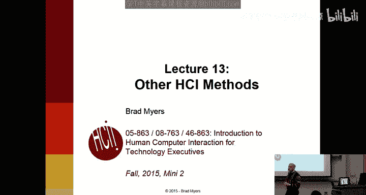
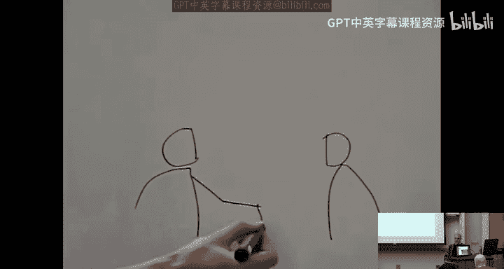
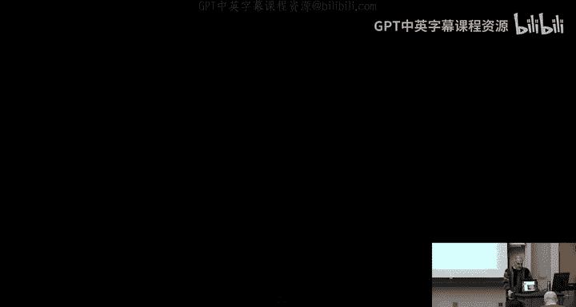
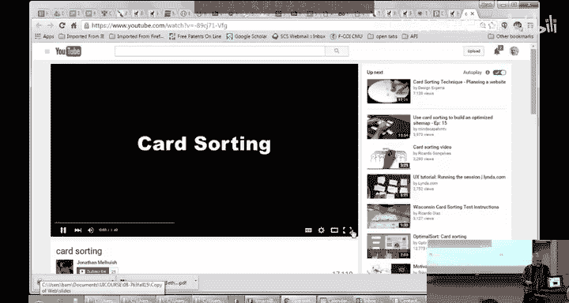
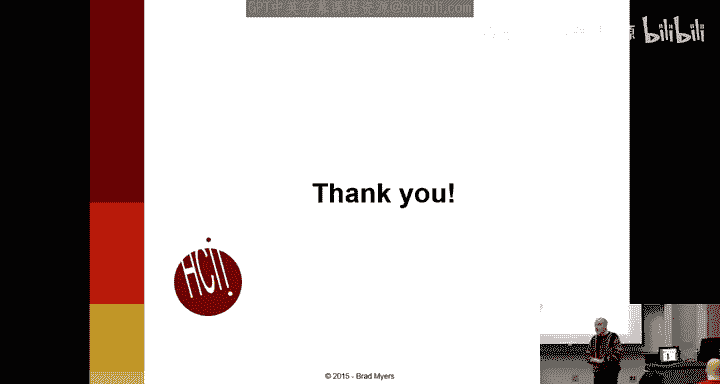

# CMU《面向技术高管的人机交互导论｜CMU 2015 Fall 08-763 Intro to HCI for Technology Executives》 - P13：Lecture 13 - Wednesday, December 16.zh_en - GPT中英字幕课程资源 - BV1pXjnzxEmL

Okay。Okay， well， thanks for coming to the very last class， even though it's。

Pass the regular schedule。Today we're going to cover lots of other methods that we didn't get a chance to cover in the short time we had during the regular part of the courts。

The logistics information same as last time， the first exams tomorrow morning。

 the other ones on Monday， anyone can come to either one。

The final date for turning in Homes is today， hopefully nobody。Has a problem with that。

 about 50 people have done the questionnaires， which is great。

 but that still leaves about 20 of you who haven't， so we'd really appreciate your feedback。And the。

Questions about logistics， bring some pens to do the exam with or pencils， whatever you want。Okay。

 so as I mentioned in the， I think second lecture， there are an awful lot of HCI methods。

 methods that can help you answer a whole variety of questions that you might have about people。

We hopefully appreciate that we covered the green ones。

 the first few of these in depth to the extent that we can in a six week course。

The blue ones we've also mentioned going through and some of the lectures。

 and then the red ones are the ones we're going to talk about today。

 but of course there's still lots of other methods that we're not even touching on in this course。

So of the methods that I'm going to talk about today。

 there are at least two that we have used in depth in my personal experience in research and consulting。

 and then the other ones are ones that we have taught successfully to our masters students and that they've reported that they have successfully applied in the field when they go off and start working for companies。

And the first point is that these methods and the true of the ones that we use in class as well are divided into。

What you might call design methods that help you design a better system that help you understand what you're going to design。

 needs analysis， so kind of the front end methods， and then other ones are more backend methods that help you evaluate your system after you've created it right。

You can differentiate these based on what kind of information they provide and where in the process you use them。

So the contextualqui is obviously a design method， it helps you know what to design。

 it helps you know some of the requirements for your designs， helps you understand your users better。

 and there's a variety of other methods that focus on that。

 sometimes they are called generative methods because they help you generate ideas。

Or formative methods because they help you formulate your requirements and things like that。

Contextual inquiry is really focused on work， although we can use it for entertainment and some other things。

 but it was originally intended to help people help the designers understand people while they're doing real jobs。

 real tasks， and although in the social diagram you can put some emotional kind of stuff。

 really it's not so much focused on that。And so some of the methods that I'm going to be talking about today。

Do focus a lot more on people's emotions， people's feelings about stuff。

 and other things that will help you understand what people are thinking。Also， a contextual inquiry。

Basically is designed to help you understand things that happen in a relatively short timeframe because you're supposed to watch people actually doing their tasks and if something takes hours or days to do。

 you're not going to really be able to watch it and so some of these other techniques we'll talk about like especially diary studies and cultural probes are much more focused on really long- term things or things that are really intermittent。

So if you want to know what are you thinking every time you decide to go out to a restaurant for dinner or what happens every time you get lost。

 you're not going to be able to do a contextual inquiry of when they next get lost or whatever。

 so some of these other techniques are much more appropriate for those kinds of situations。

And then I will also talk about card sorting and bodystorming。

 which give you completely different kinds of information。So let's start with some of these。

So cultural probes， the term at least was invented by these guys， Bill Gver and Company described。

About。15， 16 years ago。And the idea is to try and understand people's culture better。

 So the culture of a family， the culture of a little group， maybe even the。

Culture that comes from companies。To help understand their attitudes， their trends。

 what sort of things they think are important。And the idea is to give people a variety of different kinds of。

Ways of recording things。 so they give them maps， postcards。Disposable cameras， audio recorders。

 a bunch of things that。We'll let them capture different kinds of information effectively and the idea is to try and give them instructions to record things at various points during the day over the course of a week or month or whatever and so the idea is to try and。

Understand certain aspects of their daily lives as it relates to whatever it is you're trying to understand about。

嗯。So they typically will have fairly vague prompts to try and focus people on what you're interested in learning about。

 so please tell us a piece of advice or insight that has been important to you or tell us about your favorite device or every time you use your phone。

Tell us what you're thinking about or what your tasks are， what you're trying to achieve。

Please take pictures of what's important to you or what's a boring task that you have to do on a regular basis or something that you find difficult right and so these are really vague kind of prompts and maybe you have the idea that you're going to try and build this new app to help people you know with their kids or help people in home or help with entertainment or help make boring tasks more effective。

 things like that。And typically， with these cultural probes， you're really looking for inspiration。

 You're really trying to understand the context in which you might be trying to produce a product。

 And it's really not about。A particular small piece of information。

's not it's really much more kind of understanding your users rather than understanding the product that you have in mind and so obviously you have to be in the situation where you're really trying to get this kind of more giftal understanding of your community。

Typically， you're trying to make this more game like and fun rather than work oriented so that the idea is that people will continue to do this over a period of time。

嗯。But it also has to be， it's called respectful and interactive。

 right and so people should feel like they're generating interesting information that they're doing some tasks that's going to be helpful to you so that they feel like they're contributing and this will help them generate more realistic and useful information。

So there's a little video about an example。哦。我我。Cultural probes are intended to be used in the early stages of the design process。

Of a selected group of users。Had gained understanding of the context they live。

The main purpose being to serve as source of inspiration。I to use sculpture approachse。Person and。

And to use no behavior。That arem going to be working with the cultural problem。我三。

🎼Daily ritual sort activities。🎼Select's materials to be included in the package。这三看。对な？素テです。🎼そこつ。交。

No distributing cultural grows among participants。To get a better understanding。

 let's take a look inside the cultural probe。这し举し。Dary use to code。

Participants are asked to log information about certain topics on a daily basis。

Participants can use pictures and writing。強じゃ。好。あすごい。In the wordbook。

 the designer can get tasks to the participants to execute the writing。

This is going to be adding personal objects like photos。

It's provocative and fun exercises invite participants to work actively with this policy。🎼也至少是什么问题。

欢级。Were engaging participants in the cognitive of research。Nextタでが。Using stickers。

 participants can mark places on the map of their environment。They think of benefits to the research。

Ands finally eat the camera。Is it a disposable type。

Participants can be given tasks to take photos of certain objects。

You learn create to document events related to the topic of research。

The visual media first all photos can be combined with other media， like the di。

Not only the cultural approach， but equally relevant， kind of close。

🎼Using postcards for questions that are sent from designer to participants regularly。

Close inform context can be maintained。🎼20 streets receive the post， ride around send back。

Theposed class also serve as a reminder for participants to keep working with。工资。

All differently provide dataが design。Just make sure that the items in your cultural probe are relevant。

双子。And。Sit together and discuss more details on topic of research with the participants。🎼Yeah。

🎼The cultural pro has triggered the target group to think about their context and the contextual changes that could or should take place。

This leads to a relevant in depth discussion。Which is based on the relationship between participants and designer that's been built up over time through ongoing communication。

持续。relationship between the。Exspiration to shared with thoughts and information。是权究。感这。保险。

🎼Lets capable。 Let。Re。🎼我吃不。そでし。我前自说讼费出了公。这个。来走过去。

So you probably notice that the collection was like a month and a half after the distribution。

 so obviously it's a pretty slow process， but then you'll get a much bigger variety of kinds of information。

 kinds of activities that people do。And also that a lot of the stuff you asked users to do was very quick and short。

 and the idea behind that is that you don't necessarily get the information from like a red stickick key on a map。

 but that's just kind of inspires them to discuss with you。

 kind of what's going on what they're thinking about that kind of thing。

 so the discussion at the end is really most of the key insights where most the key insights come out。

 but if you just ask people at the end of a month and a half you know what happened or what was interesting。

 you're unlikely to get very good results。So a simpler version just focuses on the diary part of the study of the cultural probe。

 and this is called the diary study， and we've used this a lot actually in some of our research。

For activities where you're pretty sure that you'll never get a chance to observe them because they happen at。

Unpredictable times or there's all sorts of intermittent things that might happen and you really want to get details about how that activity happens when it does right so one situation we used these in recently was one of my PhD students was interested in studying how groups of people decide where to go to dinner。

What tech you know were they using Yelp were they using email or chat or SMS or were they discussing this in person and that's obviously not something you can really do a contextual query on because it happens at various times the day。

 in various kinds of situations it's all about people talking with each other and so we designed a diary study。

 where we asked people you know rate after you decide how to you know where you're going to meet for dinner。

 write down what technologies you used， what sort of。Corspondentence went back and forth。

 was there a leader who decided， did you use any websites to help you decide things， you know。

 all these kind of questions， and basically you create these diaries that have these very specific questions in it that you're interested in。

 typically one or two pages per incident。And then you you know hope that this incident or this kind of thing happens multiple times over the period where you're investigating。

So another example， every time people have a problem with the system， right。

 so if they're trying to do a task， but it's intermittent。

 then you can ask them to write it down so that they can remember what happens。Or yeah。And then。

Obviously， the trick is that they have to be willing and able to write stuff down in the diary pretty soon after the activity happens。

 right， because otherwise they'll。Forget about it anyway。

 and so furing out the kinds of activities where they could write it down。

 where they're likely to write it down is part of the question about whether this is the right methodology or not。

And。嗯。The other I mean so typically when you're doing a diary study。

 one way to get people to keep going is that you might and this true of cultural probes as well。

 you can typically pay people a differential amount depending on how many entries they have so if you say we're going to give you $50 if you do this experiment for a month and a half but you have to have at least one entry every day or something at least 30 entries or we'll start deducting money or you can say we'll give you a dollar for every entry that you make that's real or something like that and so often these kind of simple manipulations of your payment technique can get people to continue to do these long-term experiments。

Card sorting is completely different。ItK of just what it sounds like it is。

 You have a bunch of cards and you sort them。 Actually， you don't sort them。

 you give them to users and let them sort them。 And so there's a bunch of different。

Reasons there are a bunch of different applications for this technique。

Kind of the most obvious is if you have a bunch of menu items or a bunch of products and you're wondering how people would organize them。

 so any e-commerce site has to put all their contents into some sort of structure。

So if you're Macy's， you know， where do shirts go， should they be divided by men's shirts and women's shirts？

Or should they have their own category where shirts are at the top level and end men and women are below that。

 do shirts go next to pants or do shirts go next to blouses？What about pajama tops， you know。

 so you could imagine having all of these different questions about how to organize your hierarchy。

 so the way that。Card sorting works is that you give a big pile of cards with all of these topics。

 with all these products， with all of these menu items。

 whatever you need to sort to users and ask them to organize them。

And you might even have the users give you the labels for the groups。

 so what would you call this group of things so thats and then you know after you do this with a few different users or maybe 10 or 20 however any you think you need。

 you can see if there are any consistency in the way people organize things。

 then that's clearly the way that you should do it in your product。嗯。In the textbook， it actually。

Uses this technique for the results of your contextual inquiry or of other usability studies。

 so if you have heuristic analysis。We just put the whatever six to eight。

1 problems that you discovered in a flat table。it's kind of up to the designer to figure out what to do with all that and so that was part of their homework was to figure out well I'm going to definitely do these。

 I'm not going to do these， I'm going to rate them in importance and things like that you can actually use card sorting as a way of figuring out the importance and the applicability of different issues that are written down on your card so you could ask your users which of these are most important to you which of these do you think I should use can take this pilot cards and sort them into necessary。

 not so necessary， unimportant that kind of thing。嗯。

And you if you have questions about the vocabulary。

 then you can use card sorting to help with that as well。

So quick little video about what it kind of looks like。

It's a common problem that all website tell face。As soon as you get more of the second amount of。

发一下啊。You've got to get this some way of now。Such as the infrastructure structure。

 typically a higher run。So I guess the most common option is just to come up with something。😔，さィ。

And was the question。Wesides visitors。understand。今社。

This is where a technique called consulting can come in useful。看受这个。

Before we take the advertisingising and effective information Art。

Each page or small section of your website gets its own。talk about this。

Each participant is stand out。か。How they think makes sense。Exscribe that。It to get。

This process should be repeated。え定ま。If it's impossible for you to meet face to face with this many participants。

Online consulting tours are also available。When you have your results， you can use a custom。

To find a structure that best describes how your participants。

There are so questions tools available to help you did this。😔。

You can then test this structure by giving cards and the category。全到的话就是。And see how many。correct。

This should give you confidence that your website visitors will find the content they。

Yeah、 questions。suggestion amount。全是。げさ。Do like。Yeah。いせればね。それの？Right。Right。

 I mean so this interesting question is you know how do you know how many people to do for all these different techniques that we've talked about。

 you know and we've discussed this on and off how many people do you contextual query on。

 how many different personas should you have so when Dave was here on Monday he showed the five personas that they figured out for Comcast or who it was。

 and if you're doing card sorting， any of these diary studies how many people should you get？

Research that's been done has shown that。There's a surprising amount of consistency among people with similar demographics。

So that to the extent that you're interested in families with young kids or people with a college degree or engineers。

 typically doing four or five of those that one group will start getting redundant。That after that。

 you're pretty much seeing the same problems over and over again。

 they're doing kind of the same things as each other。I mean。

 and one of the points is you can be adaptive。If you do five people and they're all over the map。

 then you say， well， we better do some more people or maybe we're really。Doing this in the wrong way。

 And there's really not going to be convergence after a while。

 but if you're doing five people and they've all pretty much said the same things， then。

You know why keep going， it's time to， you know， do something else that's going to give you more information。

So you know if you're trying for statistical significance。

 if you're trying to say the people I'm doing represent my entire market then you have to be more careful about how are you sure that the people you're doing have different demographics represent different parts so if you're doing a blind study or randomize phone calls or whatever。

 you really have no idea what the demographics are the people you're going to end up with。

 and so then obviously you need a bigger number in order to hopefully randomly get people across your demographics targets。

 but to the extent that you can prefilter people and know that you have these groups that are your different personas for example。

 then you typically don't need very many people in each persona in each group。诶。Okay。

 bodystorming is kind of a fun technique， it comes from brainstorming。Using your own body。

And this was。I think。Oh， here it is invented by interval research。

 which was a pretty interesting research lab。 It was kind of a failure as a。It was founded by。

 I think Paul Allen， one of the Microsoft people， and the thought was that they could have a research lab that just pure research and would make its money back by getting patents and licensing all their cool inventions。

And he gave them， I don't know， 10 years of funding， something like that。

 and when the funding ran out， they discovered they had failed to make any money pretty much。Kind of。

One of the approaches for technology transfer that's been shown to be not particularly successful。

 and companies are always wondering how to leverage research done internally or externally。

 and so this was one attempt。But they did invent a lot of really interesting things。

 they just never figured out any good way of making money off of them。

 and one of the things they invented is this technique for understanding or doing design work。

 and you can imagine there's really no good way of making money off of that kind of thing。Anyway。

 that was just a side comment。 The idea of body storming is that。Your designers， actually act out。

 pretend that they are your users。And so to the extent that you're building a kiosk。

 which is the example in the textbook they're using all the time。

 you actually have to pretend that the kiosk is here and you actually have to go and pretend to push the buttons on it。

Or another example that we did was that we did。A radio in the shower。

 so we did a design exercise where we had some designers come in and pretend to be doing a radio in the shower and so they would come in and close their eyes and do like this and try and turn the knobs and so they were acting out what it would be like to actually be in the shower trying to adjust the radio or similarly if you're in bed then they would lie down on the floor and pretend they were in bed and what would they be doing and so forth。

So。The goal is to try and have a fairly high fidelity simulation of how this product would be used for real。

 so rather than just doing it around a conference table with chairs know or on a blackboard or a whiteboard。

 which is kind of the more typical way of brainstorming。You actually try and act it out。So。

This is a paper we did five years ago where we were really trying to understand how designers work。

And so this was an example of lying down in bed， we told people pretend that you're designing a radio to be used in bed and what would be some of the design requirements for it and try and think of something that's more interesting than just a clock radio。

And so in order to try and envision this， some of the designers lay down on the floor and pretended to have a pillow and there was a headboard behind them。

 so they were trying to figure out。What would be easy to reach and what would be hard to reach。

 depending on what position they were in。And imagining arbitrarily sophisticated sensors。

 maybe you could just punch your pillow in various ways to get it to do。

To turn the radio up or down or different kinds of hand gestures or movements on how would that work and would that come up。

 would you have too many false positives where thought you were telling it to do something when you weren't。

 things like that？Okay， so that's just a few design methods and you can see that those get it totally different kinds of information than contextual quiries would。

And there's also a wide variety of evaluation methods， the ones that we did in class。

 what were the evaluation methods we've done in class。Quick review for the exam。Vvaluation methods。

Com晚。Hope somebody studied， right？Somebody did the homeworks。Arisistic analysis， that's one。

 that's evaluation， right， what's the other one？No。Contual query is a formative method。 right。

 We're talking about a method for evaluating。呃。A system once you've created it。

Paper prototypes is a way of trying out。ThBut what's the evaluation？Homework three。嗯。Yeah。

 a user study， right， you take your design， whether it's a prototype or the final version。

 and you put it in front of a person。So that's called a user study。

 it's different than a contextual inquiry because in a real contextual inquiry。

 you're trying to understand。The real work situation。

 you know we had to adapt that a little bit to teach it in a class， but in a real contextual inquiry。

 you just go and watch somebody do their real work。In a user study， you give the user a system。

 either a prototype or a real system that you've made。

 and you try and see what sort of problems or barriers they have。So in the Thinkloud user study。

 you get them to talk， you don't necessarily have to do Think alouds when you're doing a user study as we discussed in the lecture before。

 but that's kind of the gold standard way of doing an evaluation is actually putting real users in front of your system and seeing what they do。

But there's a variety of other methods， as you can imagine。

 doing user studies is a little expensive and it's a little bit。

 it's expensive both in time and also in organization because you have to get you your users there。

 also it's really hard to do a comprehensive。Evaluation of your whole interface if you have a big system。

So heuristic analysis is a cheaper method， but on the other hand。

 you're just getting people's opinions of other experts。

 so what are some other ways of doing it so we're going to talk about a few evaluation methods。

And these are very useful techniques in certain situations。

So human performance modeling is a really interesting technique， Bonnie John used to be faculty here。

 and now she's working for Bloomberg in New York。This is the idea that。

People have a certain speed at which they can do stuff and so if you try to move your hand from here to there。

 psychologists dating back to World War II and even the 1800s actually had measured how long it takes people to do different kinds of movements if you have to read something and then respond。

 what is the reaction time what's the length of people's arms。

 you know so the diameter of things you can reach and the difficulty depending on how far you have to move。

 and so all these numbers are known and they've been known for。Decades， at least。

So maybe we could use those numbers to calculate how long people would take to do something。

And that would be cool because then you could just do this calculation and you wouldn't have to do any user studies at all。

 you could say look， here are my buttons in order to do this task， you have to do these things。

 how long will that take it's known how fast people type。So if you have people type something。

 you can say， well， the average person will type this in so many seconds or whatever。

You can even calculate how often people are likely to make errors and how much time the errors will impact。

 and so obviously this isn't going to count for an individual time。

 but you can get an average over your population of how long you would expect these tasks to take。

As you can imagine， this works best for tasks where you don't have to do a lot of thinking。

So if you have to think or you have to do problem solving， then the variance is enormous。

 so if you have to figure out how to do something。That could be quick or it could be really slow。

 it totally depends on how good you are coming up with problem solving。On the other hand。

 if it's a low level task where you know exactly how to do it and it's just a matter of clicking in the right places or typing the right thing。

 then it makes a lot of sense to calculate it this way。

And there has been some research on some level of higher level kind of things， so for example。

 there was a PhD recently about how long does it take people to find something on a screen？

So that's called a visualual search task， so there's a button on the screen you're supposed to click where is it and only the way you're going to find it if you're not blind is by looking around the screen。

 how long does that take？And so， again， if you take thousands of people。

 you can get an average of how long it takes to find something based on various。

Properties of what they're looking for right so like making it a different color makes it stand out if it's one of many buttons that are all identically colored。

 then people pretty much have to read you can imagine if there's like menu items you may memorize where it is and then you just have to verify the position versus if it's the first time you've seen this menu then you're going to read each item and so you can calculate how long that would take。

And so there are ways to calculate。The visual search task， but again。

 this is not a problem solving task right if you're trying to decide which shirt to buy， well。

 there's no telling how long that could take right， but once you know how to buy what shirt you want。

 how long does it take to click through all the menus from there on out to you know and to type in your。

Address and so all those things could be calculated。And so this is from a textbook dated in the 90s。

 they called it Mr。 Bubblehead because they put all this stuff in his head。

 and these are the numbers that come out of this cognitive psychology and physical psychology to calculate how long it takes you to move。

And so in case you can't read them， it's like。You canThis is remembering things。

 right so much can you how much can you remember that you hear？Versus what you can see。

 how long can you remember things， how long does it take to do different activities。

 and so you can put numbers on kind of almost any cognitive or physical task。

How long does it take to you to retrieve a memory that you've just heard or you've just seen？

And so the cool thing is that you can do this modeling for a design you haven't even created yet。

You don't even have to create a paper prototype in order to necessarily calculate how long it will take people to do it。

So if you're saying， well， this task will take 12 taps。

Spread across the screen and typing of 16 letters， you could come up with a number for how long that's going to be。

 and then you could compare that to a different。A way of doing the same task where you only had to type more things or less things and so forth。

So what were those constants？Yeah， so this is how much you can remember and how long it takes to。

To retrieve them。So the simplest version of this is just keystroke level。

 so this is called the keystroke level model KLM dates back to 1980。

 sttuard is a graduate from psychology from here， who was at Xerox Park and Tom Moran is another graduate from here who was at IBM or Xerox Park at the time。

 and then Alan Newell was a faculty here in psychology for many years until he passed away this he's the one this buildings named after Newell Simon Hall。

So Newell and his two former students， Car Moran， came up with some of the very earliest work on this and it's still current。

 so it's still very relevant if you need to do these kind of calculations。And basically。

 they measured。By having these amazing experiments where they had a secretary for almost two days straight。

 just click。A million times type a million things， move the mouse across the screen。

 move different devices， and they came up with these。Average times that。

If you have to do so many keystrokes or if you have to point with the mouth。

If you have to move your hands from the keyboard to the mouse。

 how long does that take right so if you have a conventional mouse， you have to move your fingers。嗯。

And it turns out that these。These。Parameterters。That you multiply these by are different， so a mouse。

Has a different speed number compared to the touchpa and I don't know if anybody has a pointing stick or a roller ball。

 or there's a variety of other ways of moving the cursor on the screen and obviously moving your finger is another alternative。

So。So just of the ones that are available that everyone has experience with。

 there's moving the mouse， there's a touchpa and directly pointing with your finger。

 who thinks which one is typically faster。Mouse。Otherhu。Finger。Anybody want to say touchpad？Okay。

 the finger is way faster。But also way less accurate。

And so there's this interesting trade off that if you want to have people go really fast。

 then you could use a touchscreen， but then you need much bigger buttons。

Because you can't really see where you're pointing， whereas the mouse is really extremely accurate。

 you can put on single pixels without much trouble， but it's a little slower。

And the touchpa is actually way slower。But it has the advantage of being really compact right and so it fits on your laptop whereas the mouse doesn't。

 so lots of people will attach mice， I see a lot of you have attached mice to your laptops because it's just faster。

And it's more accurate。But these kind of numbers are known and if you wanted to know what's the difference going to be with somebody touching with a finger versus touching with a mouse on my interface。

 you can calculate the difference in terms of time and accuracy and number of errors and so forth。

 it's a very low level way of computing these numbers and it assumes that everybody does everything as fast as they can and they don't have to stop to think about it。

There are these mental operations。嗯。In this formula， but those are very small things， you know。

 they're not really problem solving kind of mental operations。

 they're just the routine planning of okay now I want to move my hand to the mouse。

You actually have to notice that you need to do that and then spend a little time in your brain figuring out to do it。

 and then you go ahead and do it。And so you can compute all these together。

Give it the tasks that you want to do that makes sense for your interface and output will come。

A number， how long it takes in milliseconds or whatever。

And people have refined this technique so that it's within 20% of how an expert would do it。

Obviously， they。When they were developing this theory back in the '80s。

 they used a lot of experiments to get the parameters of the numbers。

 and then they tested to see how close they were to the actual numbers and they got to be surprisingly close。

And again， this only applies to skilled performance， but it's still really useful。

So after they did that， they said， well， very little。

Computer interface work or very little use of computers。Is just at that extremely low level。

 and often we don't really care that much about how fast people can click around the interface right because for almost any app you're thinking of building or web page or company。

 there's all sorts of higher level activities that are much more important。

Then whether you can save people 50 milliseconds from clicking。

 which is why people are willing to use touchpas， even though they're slower than mice。

So the next level up was called the GMS model， goals， operators， methods， and selection rules。

And the idea of this is that for almost any task， you have a choice of how to do it。

So suppose you're in a word processor and your cursor is here and you want it to be there。

How can you move the cursor？From here to there。What are some ways of doing that？

You could use the hour keys assuming you're not on a Mac well now Mac have them。

 but the original Mac， Steve Jobs hatedarrow keys for some reason。

 and so if you could go back and look at the old Mac， there were no hour keys。

 but PCs have always had hour keys and nowadays other keys have that but of course on the，And那。

IPphones， we've gone back to no hour keys， right， so even though it's really annoying that if the cursor needs to move over one character。

 there's no way to do it without using your finger， you don't have the option of using our keys。

But you do on PCs， so what's another way of moving the cursor？RightSo you can move your mouse。

 of course if your fingers are on the keyboard， that includes both the time to move your hand to the mouse device or move down to the touchpad and then move the mouse and then click and so forth。

That's another strategy， anybody have any other？Techniques for moving the cursor。

 besidesarrow keys or。诶。Or using the mouse。嗯。Yeah， touching it directly with your finger。

 so sometimes people will have like a surface or an iPad and you can plug in a mouse or you can touch on the screen directly so though you have those two choices and sometimes you may decide to move your hand to the mouse。

 sometimes you may decide to directly touch on the screen。So that's another choice you have。

 what's another one， one more？嗯。Yeah， like what？Oh yeah right。

 so there's on a PCC you have the home button， you have page down， page up。

 there's also some commands like forward by a word。

 if youre using emX or some other things and instead of using thearrow keys that go character by character you can say go forward to the next。

Sentence， things like that。There's one more， which I bet nobody's going to think of。

You can use the search mechanism。If you want to go to the next place。

 if you want to move the cursor to the next place a particular word is in your document。

 then you might go to the search box and type in the word and then search for it and that'll move the cursor to that location so you've got all these different strategies。

 which one do you use。Well， the answer is you use all of them。

 it depends on the situation right and so the idea of the DoMs model is that you can actually write down rules。

 which they call selection rules that will help you pick。

Which one of those you'll use depending on what， what sort of things does it depend on？

The time you think it'll take you to complete it。What else？What you're used to doing？What else？

So how much you care about exactly the point， does it have to be on this side or that side of the space or do you not care？

What else。The key one is how far it is。RightSo if it's the next character over。

 you're much more likely to use the hour key than if it's 75。

000 lines below or something like that or in a totally different document right and so you're going to take all of these different properties into account and make a decision about which strategy to use so that's the selection rules and you're picking which method to use so there are multiple methods from moving the cursor。

 there are selection rules that say if it's too far away or if I'm used to using this or if my arms are tired I won't touch on the screen so you can come up with a set of rules that will help you。

Figure out what to do and then the goal obviously is what you're trying to do， in this case。

 it was move the cursor。And then the operators are what we just said。

 how long does it take or what way you're going to use to do that？

And so using the KLM kind of numbers， we can figure out given an operator， thearrow keys。

 the home key， using the mouse， how long that's going to take。Given a particular task。

 we can use the selection rules to calculate which method people are likely to use。

 then we can use the operators， they go with that to actually come up with a number。

So this is a way of taking the。嗯。The calculations to the next level where you have a very good understanding of all the different techniques one could use。

To all the different methods one could use， but as you can imagine。

 you need a much more elaborate way of describing it。 It's not just a mathematical formula。

 You have to have all these selection rules which are basically if then kind of rules， you know。

 if I have to move the cursor， more than whatever 10 lines。And I'm not seeing it on the screen。

 then use the search mechanism， or if I only have to move it three or four characters。

 then use the arrow keys。And so their typical languages， Act R was invented by。Faculty John Anderson。

 who's over in the psychology department here many years ago to try and represent all of these rules and methods and so forth。

The question。And so one of the things Bonnie John did when she was faculty here was it was turned out to be really。

Difficult to write these rules and to build up the scMS model in a way that was pretty effective and pretty much only PhD people could do that。

 and so that was really limiting in terms of you know who would actually go ahead and apply these rules and so Bonnie came up with the idea of well let's make an interactive tool where you don't need to know the math behind the scenes。

 you don't have to write all this programming code in Act are and these special languages you can just demonstrate what your tasks are and the tool will then output a number。

So that was pretty cool and they succeeded in making that work。

And so this is a picture of what the tool looks like and basically。

You draw pictures like we did with our PowerPoint in assignment4。

 you draw pictures of what the different interface looks like。

You show what the user has to do to do certain tasks。

 so they have to click here they have to type into this field or they have to read this and so it includes both reading tasks and clicking tasks。

 physical tasks and mental tasks。There are multiple arrows because there are all sorts of choices on every page and for each task you can give it all the different ways of doing that task so it takes into account the different selection rules。

And then in the end， lets see I have yeah， so you mock up the design。

 you demonstrate the tasks by clicking in the different places and showing how people can do things。

And then。I guess down here， yeah， this is an example， it says if you edit the post using the mouse。

 it'll take 46。605 seconds， but if you edit the post with keyboard shortcuts， it'll take 42。

372 seconds。So a rational person doing it in the most effective way would tend to use keyboard shortcuts and would save four seconds。

Four and a half seconds compared to doing it with the mouse。But obviously。

 not everybody's going to be rational， but you get an idea of the differences。

And kind of the general。Range， right， so generally this is about a less than a minute task three quarters of a minute task。

 And so you know， if that's fine， then。You don't have to worry about it。

This kind of technique has been used a lot by the car manufacturers。

 so the car manufacturers know how long they're willing to let you look at the navigation system before people get nervous or actually have a crash and so they have very strict criteria for how long you're allowed to look away from looking out in front。

 and so it's very important for them that you be able to finish a task in a certain amount of time。

That they think you're going to have to do while driving and that's one of the reasons most navigation systems says don't do this while you're driving。

 whereas it doesn't say that about changing on the air conditioning or changing a radio station or whatever and so a lot of the car systems have been tested using these kind of techniques to say what is the typical time for you know changing the temperature or the air conditioning or changing the radio or turning on your headlights or all these other activities you might do and they know that navigation can't be done in a reasonable amount of time。

 which is why they warn you against doing that？Okay。

 leaving that one behind this is another evaluation technique。

 it's kind of a cross between an evaluation technique and a design technique。

 it has this cute name called speed dating， how many people know what real speed dating is。

A few people don't。 So speed dating is an actual way of， you know， meeting。

People that you might want to go out with。On date where kind of all the guys sit on one side of the table and all the girls sit on the other side of the table and then they give you a minute or two。

 and then you're supposed to swap seats and you end up meeting，you know。

 30 people in an hour or whatever， and then you're supposed to exchange numbers with anybody you found interesting and then meet them later right and so the idea is that it's a very rapid way of meeting a whole bunch of people so they decided to adapt that idea as a user interface evaluation technique and。

The idea is that you give people something that they can evaluate in a minute or two。

And then have them give you their impressions on that and then swap it to the next person and give them something else to evaluate。

Also can be done in a very short time。 So obviously。

 it can't be the same kind of things that we did evaluations on since。

Those took a reasonable amount of time， you have to explain the situation。

 you have to give them the context， you have to let them try different things and explore the idea of this is that it's very quick and you get and get people's immediate impressions of lots of different situations。

So it's really appropriate for when you're kind of wondering you have a whole bunch of ideas and you're not sure which ones people relate to。

 you have lots of different designs， you want to know which one people like best。

 so anything where you can get people's quick reactions。嗯。

So a typical way is to give people sketches or storyboards。

 little snippets of an interaction and say， you， which of these do you find compelling？嗯。

And it works really well to， as a way of kind of。Finding out what people might be interested in if they don't have any experience with it。

 right， So if you can't give people an example。That they can envision in their head。

 like most of the products you guys were doing， you found perfectly reasonable current products that could you could do CIs on that were equivalent to what you're working on。

 but if you didn't have something to talk about， how would you get people's impressions and so that's one of the things this is good for？

So they say in their paper that it's really useful to as a way of kind of validating hunches of the designers。

 or you know， some of you guys are working on startup companies。

 you have a hunch that maybe this product would be compelling to people or maybe you have six or seven hunches and you're wondering which one is more compelling。

 this might be a way to let people evaluate lots of them at once。

So they often use it in situations where you can't just ask people their opinions because they don't really know what you're talking about and kind of to find out you often want to push the boundaries and find out what they would think is too creepy or too far away from something that they are willing to do so you might have kind of a whole series of experiences that you're wondering about from things you're pretty sure will be farther away than what people will be comfortable with down to something that's really familiar。

 but maybe not very helpful or not very different than what they have today and you can kind of see where people fall。

So there are really two different versions of this。

One is kind of like bodystorming where you get people to enact little scenarios in a very quick way。

 another one is where you do it in storyboards right and so the idea is that。So real body storming。

 if you remember， is where the designers。Pretend to be users and enact things。

 in this case we're actually having your end users。

How they might use the products and you can give them very scenarios and have them acted out。

 Obviously， this makes a lot more sense for。Physical activities or products that are in the weird world。

 you don't really need to do bodystorming enactments for things that are just screen based because the paper prototypes are perfectly good for that。

嗯。So。Here's an example from smart homes， and so they have a bunch of different scenarios of situations。

 they actually have 22 different concepts that they talked about in the paper and they got everybody。

To react to all 22 of them and to see which ones were too far out， which ones people said， oh。

 I'd really love to have that kind of product and you can。

 you know obviously drop scenarios of things that are impossible to build today but maybe would be possible in the future。

嗯。So this one， some of the examples， there's no phones and signals， so I feel so helpless。

The smart home senses that dad's going to miss picking up Angie。

 any and pings people the Millers count on， so this is kind of the scenario where you're supposed to pick up your kids and maybe you can't get there in time。

呃。So a neighbor is not far from Annie， so she agrees to go'll get her and dad's car is broken。

 but the tow truck driver tells him that Annie has already been picked up and so he doesn't have to worry about that。

 even though there's no cell phone signal。And so， you know。

 maybe it's a little creepy that somehow the tow truck driver knows about his daughter being picked up by a neighbor。

 Maybe it's a little creepy that the。Somehow the system knows that his car is stuck and he's not going to get there own time。

Things like that， but on the other hand， maybe it's helpful and different people might respond in very different ways to that kind of scenario。

Like scenarios and then they say， okay， I think Mr preview is it school or do they have something that they actually interact with？

Yeah， so most of the time you're just trying to engage people for a couple minutes and so you might give them all 22 scenarios and ask them to rate each one on how helpful or how creepy or how much they would like a system that helped they did with that。

 and so typically in this particular design first， speed dating。

 they saw these actual four pain scenarios， basically comic strips。

And so you'd see one of these comic strips， I think I have a picture。Yeah， so in this case。

 all the subject users were lined up kind of like you guys along a row。

 and they saw one of these little comic strips and they were given sticky notes and they were supposed to write down what they thought of them。

 you know whatever they could write down in two minutes and then they handed the scenario to the next person and they got a new scenario in front of them。

And then in the end， you end up with。呃。You know， these 22 scenarios were a whole pile of sticky notes of what everybody thought about them。

And， you know， you can obviously think of ways of making it more objective if you care more about numerical ratings versus。

Just a simple comparison of which ones people like better。他。Answer your question。I think that's all。

Yeah。Okay， so cognitive walkthrough。Is an interesting technique and this is an expert evaluation technique。

 it's really hard to do， so which is one of the reasons we don't teach it in this course。

 but the idea is that the expert- so if you remember heuristic analysis。

 you were kind of supposed to go through the entire interface and you didn't particularly focus on any tasks。

Obviously you wanted to know which buttons were supposed to work。

 but it wasn't like you did a task and that was done and a cognitive walkthrough on the other hand is all about tasks and you're asking the question at every step。

Will the users know how to do that next step that's required for this task。

 What information do they need to know， do they need to learn something new in order to do this next step。

So if you think about， I don't know， say Amazon。RightAnd you've never seen Amazon before and you come up to it the first task is to type the product you want into the search box What does a user need to know in order to achieve that well they have to know where the search box is。

 they have to know how to type they have to know how to get the search box to start listening to their typing right so you could list a whole bunch of things that a person may or may not know depending on their experience that would be required as a prerequisite for doing the first step and then after they do that then what's the next step well they see a list of results。

They have to click on the one they're interested in what do they have to know in order to do that step right and so this can be very tedious as you go through each individual step and think about exactly what a person needs to know and in particular。

 where do they have to know something new that they didn't know before。Right。And it's。And then， oh。

 the other important point， number three， which we haven't really talked about much in this course。

 is how the users will know whether their tasks succeeded。What is the feedback。

 how will they interpret the feedback， will they understand the feedback。

 and will they be able to assess when their system has gone or when their actions have done the wrong thing versus the right thing？

And so they're all these different parts。And even。Number one is the concept of will the users know what they're supposed to do？

Will they come up with the right approach， what we were calling a method in the Gms model。

 Will they have a method in mind that will actually work in the system or will they have to learn that？

After they know what they want to do， will they notice and understand the control that's supposed to help them do that？

And after they know the control。Will they recognize the results？And then。After they do that。

 will they know know what the next step is， and so obviously you keep going around this for every step to see if if the end user will be making progress and what they need to know so this。

Can be quite tedious。 It's really tricky to correctly。

Know what the users need to know and so it takes a lot of experience doing these kinds of things to be able to definitively say。

 oh， well， at this step， the users are really not going to know which button to click and so they're going to have to do some thinking or problem solving in order to understand the button。

Or at this step， they're going to have to go off and do this other task in order to come up with the right values to put in this。

In this field。Cognitive dimensions is a totally different technique。 Unfortunately。

 they have similar names， but they really have no nothing else in common。

Cognitive dimensions is really like heistic analysis。And so these dimensions。

 there's 14 of them as opposed to heuristic analysis with just 10 heuristics。

 so in both cases they're really guidelines right， and you might notice that number three is consistency。

 which is something you're familiar with， error proneness is also something you're familiar with。

 but some of these are new and the reason is that this is focused on programming systems。

So this set of guidelines is really focused on tasks where the user has to write a program。

So it might be professional programmers， but it also might be using a spreadsheet。

 or it also can be things like making a script in visual basic or something like that。

And so a lot of these。Have not much to do with regular user interfaces。

 but I think a few of these are really interesting and they've really affected our work。

And so one of them is closest to mapping。And this is。

 if you think of programming from a user centered point of view。How many people know how to program。

 at least a little。 So almost everybody， if you think of programming。Basically。

 what you're trying to do is take a task in your head。

That you're thinking that you want the computer to do and translating it into a way the computer can understand。

So you have in your mind that you'd really love the computer to compute this number or to make something red when you click on it or whatever。

 now you have to translate that into programming language so that the computer can understand that and so the concept of closeness of mapping is that the closer the way you can express it to the computer is to the way you're thinking about it。

 the easier it should be。And so in spreadsheets， if you have a column of numbers and you want to add them up。

Well， you use some of these， you point to the numbers you want and you say some and that's pretty close。

 that's kind of the way you're thinking about it， and that's one of the reasons spreadsheets are pretty easy to use。

As opposed to。Say pass， this is。Ja， right and this is how you get the words hello world onto the screen in Java。

 This is the simplest way to do it。And it requires three kinds of parentheses， you need squiggles。

 square brackets， and regular parentheses。Nine special words。

And you have to put every one of these in exactly the right place and exactly the right way in order to get the word hello world out on the screen。

How hard is it to get Hello World out on the screen in PowerPoint？

So if I want the words hellello world on the screen and PowerPoint。

 I just click somewhere and type it。M closer to the way I'm thinking about it。 I want。

Hello world right here。Well you can't actually do that right so first you have to go and pick a text field and put the text field there and so there is some mucking around you have to do in PowerPoint to get that to happen as well。

And so this idea of closeness to mapping says， can we make the way you express what you want closer to the way you're thinking about it？

Another one is hidden dependencies， and this is where there is something going on that's not shown。

 pretty obvious problem with that， and there are lots of situations in programming where this happens in regular code。

You can't really see what's called the data flow， right。

 so you have variables and you have operations， but if you have a variable。

callled I and someplace you set I and someplace else you use I。

 how does the value get from I to J or whatever that's not shown？Another example is in HTML。

It's really easy to tell where a link goes to， but if you're looking at a page。

 you can't tell what pages connect to me。In fact， it's not possible to actually discover that because there could be a page on some totally different site that connects to you and you can't tell。

In spreadsheets， right formulas， you can't see which formulas are in a spreadsheet until you click on a cell。

 so just looking at a cell， you can't tell if the number was a constant that was typed there or whether it's computed by a formula and if it's a formula where the values come from。

诶。And so in that sense， those dependencies are hidden twice。Premature commitment。

Is the idea that you have to make decisions before you're ready to。

 and this comes up a lot in programming where。You're required to declare something like most programming languages make you declare variables。

And you typically have to declare them well before you're using them， so you're saying you know。

 I need a counter， I bettert I go get。Acount somewhere， Ill have to put that up here。

Another example is some old fashioned languages like C required that all the。

Names be in a particular order， which exactly was the opposite order of where you wanted to use them right so anything you wanted to refer to had to be above you。

 which meant inherently that youre always programming from bottom to top。

 which is a little kind of the opposite of what you'd like to do。

So are lots of situations where this kind of thing。Can be a problem。And then viscosity。

 I think that's the last one here， viscosity is this fun property that talks about how it's hard to change things。

So the。Idea is that most of the time when you're programming。

 and this is also true of diagrams or PowerPoint， I'm sure a lot of you found this when you were doing your prototype。

That。Some things are easy to do the first time and then really hard to change after the fact right and so in PowerPoint for some of your prototypes。

You probably had a link that went to slide 12 and that was really easy to set up。

 but then you discovered oh， you needed it to be a slide 13 instead of slide 12。

 and then you had to go to find all the places where you had a link。

To slide 12 and make them slide 13。 And then as you added more and more stuff。

 then there's more and more to keep track of。 And it's really hard to edit。 So maybe you said， oh。

 this is way too hard。 I'm not going to change any of my links anymore。

 So that's an example of viscosity。So the word viscosity， it's not a very common word in English。

 but it means it tends to refer to liquids， so it's basically if you put a penny in the liquid。

 how fast itll fall to the bottom。Or gas， actually。 And so if you。Put a penny in water。

 it goes pretty fast。 if you put it in an oil or shampoo。

 it goes really slowly and some kind of shampoos are so dense that it'll just sit there and not actually go through it at all And so that's kind of the idea of viscosity how fast something will change。

嗯。Another example in programming is。In textual languages。

 if you have some text and you have an if statement and you change your mind and want it to be a four statement。

 how hard is that to change。 Well， it's pretty trivial。

 You just click on the if and type backspace twice and type 4。So that's really easy。

 although you have to fix some other syntax stuff， but in visual programming languages。

Where you have all these graphics。Typically， you can't actually。

Click on the if statement and make it a four statement， typically you have to delete。

This whole green block and drag in a blue block， which is the for loop。 And then。

 but what happened to all this great stuff you did。In the middle， well。

 typically it's lost and you have to type it over again。

So that's an example of where it's much easier again to do things the first time than it is to change it till later。

 and so many visual languages。Like this， have the property that it's really easy to program on a blank screen to just create programs from scratch。

 but it's really hard to modify programs once you've created them。

And anybody who's done any programming at all knows that the typical way you program stuff is by getting an old version and editing it。

That most programmers never really start from a blank screen and just start typing。

Because that's just。Typically pretty inefficient and generally the stuff you want to do is similar to the stuff you did before。

In some way， but in some ways it's a little different and so the idea that every time you start programming。

 you have to start with a blank screen and you can't use anything you've ever done before is just really unrealistic and inefficient。

And so that's one of the reasons that graphical languages like this。

 even though they've been demonstrated over and over again to be really good for novices and really good for first time programming。

 really haven't caught on because it's just too hard to modify programs that exist。

 and that's most of what people do most of the time。Another example。

Is graphics are surprisingly hard to modify。So there is no commercial program that I know of where you can do search and replace for graphical objects。

Virtually every tool has a search and replace for text， so replace all instances of Joe to Bob。

 every tool does that， but there's no tool that replace all instances of circle with square。

Or orange things with blue things。And so this kind of property change or value change is surprisingly hard to do in graphical editors。

 where it's really easy to do in textual editors。So some of these are relevant to programming。

 a lot of these are relevant to other kind of interfaces as well。Okay， that's actually the end。

This lecture also the end of the course， so just as a quick summary。

hole point of this course is to try and give you some feeling for a variety of user interfaceith methods that have been shown to be effective to try and give you an appreciation of the kinds of information you can get from doing user studies and appreciation for how hard it is to do design well。

 that you need to。Alllocate resources and plan for quality if you're trying to achieve it and to understand where usability fits in with all the other quality attributes that you will learn in your other kinds of classes。

Okay， thank you。And if you like this course， I offer it every fall， so tell your friends。

