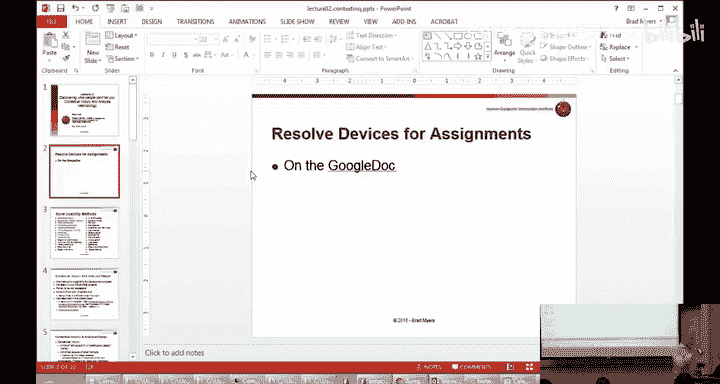
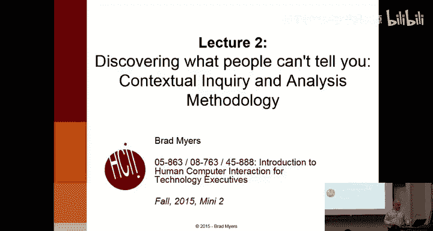
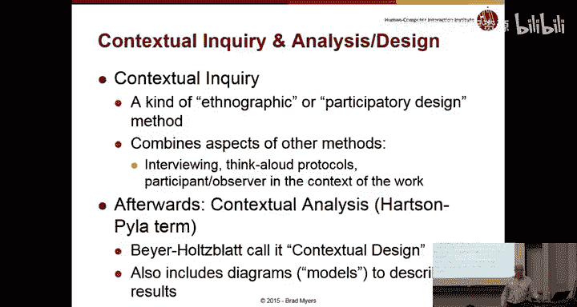
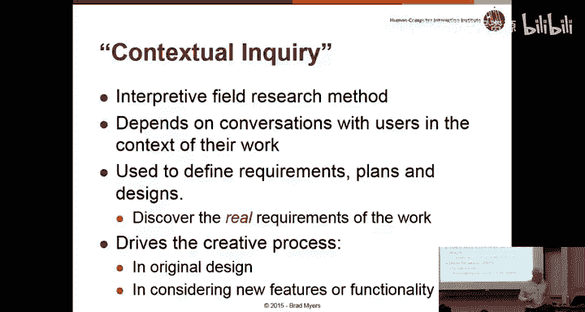
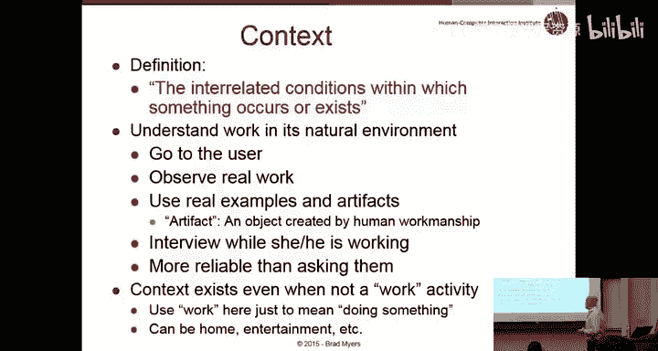
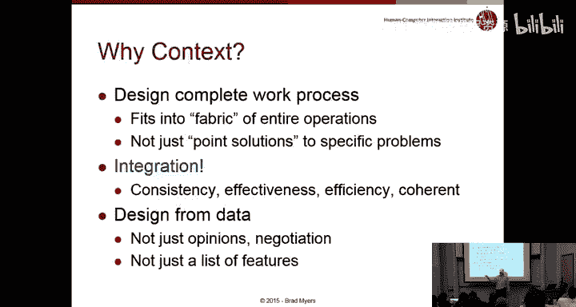
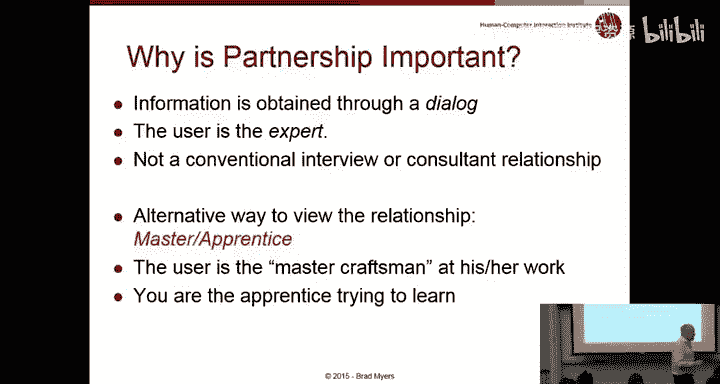
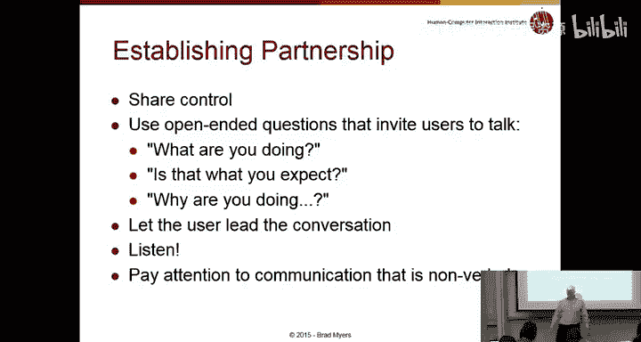
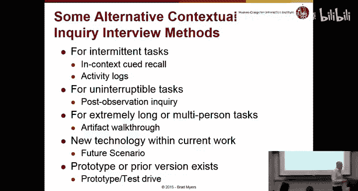
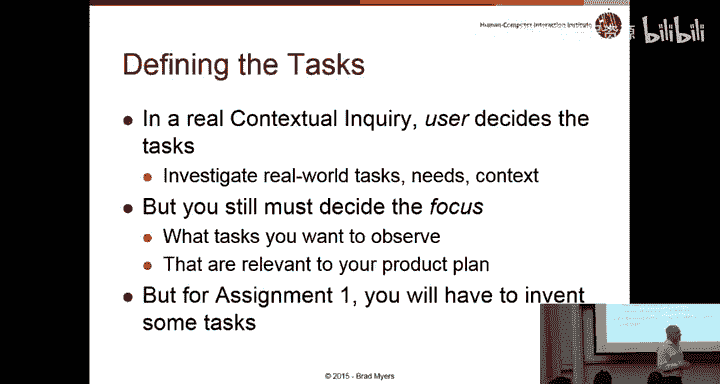

# CMU《面向技术高管的人机交互导论｜CMU 2015 Fall 08-763 Intro to HCI for Technology Executives》 - P2：lecture 2 - Wednesday, November 04, 2015.zh_en - GPT中英字幕课程资源 - BV1pXjnzxEmL

Okay， I guess we'll get started。It's amazing we have exactly the right number of people。

 there's like one chair empty in the back， so it's just perfect。Although there are。

 it's like 67 seats in here and there's 101 people on the spreadsheet， so that's a little mysterious。

嗯。So that's the first order of business。Hopefully everybody noticed that。

I put up the homework that you're going to be doing。嗯。So if you go to the homework page。

 then homework one is listed。And it talks about in very great detail what you're supposed to start doing with this device that we're going to make sure everybody has a good version of。

And one of the key things I wanted to point out。And。嗯。

Is it one of the in a real contextual inquiry you would？Try a lot of people。

 you try a lot of different tasks， we really don't time for that。

 this is a hard enough assignment as it is， it's probably the hardest of all the assignments and so you just have to do one person。

And the goal is to do somebody who's going to have a lot of problems。

 So you'll want to find an older person， somebody who's unfamiliar with your device。

But if they don't find problems， if they don't have trouble doing stuff。

 then you really won't be able to do this assignment。So the reason I'm bringing up this now is that。

Many people picked apps that were really simple to use。

And it's highly likely that you can't come up with any tasks that are actually difficult。

And in which case you'll need to pick a harder device or a harder task on that device or a harder app or something like that。

 so I pretty much approved most of those and left a comment next to them as you'll see if you go back to your entry and said。

 you know you can try this， but if it turns out to be too easy。

 you might want to pick something else。So it says very clearly here that if you cannot find anyone who has trouble with the tasks。

 you either find。A user who doesn't know as much so that they can have problems or you can switch devices to something that's harder to do or。

You can， you know， pick a harder task or something with the device。 Okay。

 so I just wanted to introduce that now so that you know， when we go through the devices。

 why I'm saying that some of the things。Probably are too easy。

So what I want to do is really quickly go through this entire list， make sure everybody's。

Clear on what's going on， so for example the Mint app on the iPhone I'm not really familiar with the Mint app。

 but if it turns out to be too easy you might want to pick something else and if you need to pick something else。

 that's fine， you can email me in the TAs that you're doing that。

 you can update it here in the spreadsheet， but because you're picking late。

 you have to make sure nobody else above you， nobody else in the entire class has pick what you're going for。

But it seems like there's plenty of other things that people could pick。The Tridvisor website。

So obviously Tripadvisor does all sorts of different things。

 so you'll have to be a little more specific in your tasks。

 you know what in particular is it looking up some restaurant information or booking a trip or whatever。

诶。Built in music player is fine if it's assuming it's hard enough。And this person。Wops。

This person's actually gone。 So that's。Wait， we're in the wrong place， sorry。ATTM of PNC Bank。

 one of the problems with that is。Yeah， so yeah， let's start over。

 the Note app and the iPhone is really easy to use there's not much you can do with it。

 except for typing， so typing is really not in scope so much if somebody has trouble typing and native calendar app。

 Gmail app again， all of these are kind of simple， it'd be better to pick something more difficult。

ATM a PNC， again， well you don't want to make the person you know take out money so that they can always cancel it the last step so they don't necessarily have to do stuff。

 they may not be willing to reveal to you their actual credit balance or you know statement balance or whatever and again。

The ATM is designed to be as easy as possible。 You may turn out that even an elderly user has no trouble using it。

 in which case you might want to switch。To something a little more complicated。Md body app， again。

 I don't really know what that is。Is this person go Zinzi， is this persons here？

They didn't pick anything。Windows accessibility function， Canon。So all these are fine。

The giant needle checkout system， I mean， the main problem， is like one chair over there。

 The main problem I had with。The giant Eagleag checkout system is when it fails to scan something which isn't really a design issue with the device itself。

 so that may or may not turn out to be appropriate。

 I'm sure this television is really complicated and that might make more sense。

So you might want to switch。Yelp， again， might be too easy。Digital camera， including taking pictures。

 specifying different resolution。 So as Xueng Su here。Yeah， so somebody else picked a cannon camera。

 which kind of do you have in mind？What's your camera？Okay。

 so go look at your camera and fill in with brand as long as it's not a can and it'll be fine。

Sharon Lynn， are you here？So hopefully these people are planning to drop。Otherwise。

 they are going to have to pick something laptop interface again， that's too vague。

 I mean laptops have lots of interfaces， typing mouse really not a big issue。

Google Map App is a little vague， also really easy to use。嗯。Iphone the Twitter application。

 so you know this。Theme of being too easy repeats over and over again。Google camera app。嗯。

Amazon mobile application， so buying something is usually pretty tricky going through the shopping cart。

And all those kind of things， so that may certainly turn out to be more complicated if just browsing around to find something to buy。

 it probably too easy， but it's certainly possible that the shipping address and all that kind of stuff for an unregistered user might be complex enough。

Pazza， which reminds me， I was thinking of actually using piazza for this class。

 Have you guys used piazza， do you want me to set that up， Yeah， I think that might be useful。

 so I'll try and set that up tonight。Is June Wang here？Neng。Okay。

 Microsoft service surface tablet keypad and support， that seems kind of trivial。

 although maybe it has a complicated setup that I'm not familiar with， I don't have a surface。

 so if it's really a complicated thing about you know using one finger or two fingers or whatever。

 that may be okay， but just kind of generic typing and using the mouse pad is probably too easy。嗯。

Yel， somebody actually picked that above， so when you're picking something。

 be sure to look up above and make sure no one above you is already picked what you're pointing to。

IPhone for placing calls， you know， after 10 generations or whatever we've gone。

 it's probably pretty trivial to do， so I'm not too optimistic that will be hard enough。

A bunch of people wanted to do the PNC mobile app， but only the top person gets to use it。IPad。Yeah。

 sure， okay， so the LinkedIn that somebody picked LinkedIn， I don't remember。啊。

So the LinkedIn app might be a better choice。嗯。Milestone pod， I don't know what that is。

 or what you can do with it， or how you configure it。

But the ones in red are basically I'm a little concerned about。啊集mail哦。

Iy messaging that seemed too easy and we're really not dealing with just plaino typing and how hard typing is。

 so I would imagine most of messaging is about you know typing in somebody's name and then typing in their message and that's really not。

Going to be very interesting。诶。So it's mostly about things that require configuration。

 things that require filling in lots of dialogues and stuff like that。

 and if you go back to the requirements page，To homeworkmark zero。You know， we talked about。

That it has to be a reasonable level of complexity， like 10 different pages。

 10 screens of information that you have to fill in。

About 30 controls that you have to click on in the right order okay it doesn't count the 30 30 keys on the keyboard that's not the point right so hopefully this gives you a sense of the level of complexity so it's kind of reasonably complex and reasonably hard to use so that people will have trouble with it。

呃。At least a couple people really didn't like the Indian Raways。Site， so that'll probably be fun。

Is this person here？New可は。No， because。ok。163 music mobile app， I don't know。Spit wise。

 did somebody pick that already？iss this you？Okay， so this person。Yeah。

 I thought that sounded familiar。QR Reader app， I think that's probably too easy。

And then self check out， we just did that one。So these might that would probably be really hard unless it's a。

嗯。So is this person here？Navika Watton。Are you here？Okay。就。Okay， Jeeep。Build and price tool， okay。

So this person picked one task on a watch， which is probably too easy。

 but if you do a collection of watch tasks， that'll probably be complex enough。PNC， again。

 somebody did that。Here's a couple of people who aren't here， I guess。Prina Balarara。全hu。呃。

Kateke Sahi。Oh， you're here。Oh， okay， that's handy。Okay。Yeah， so Keaton Wats。A here yeah。

 so you know， Craig's list， it does a million tasks。

 you know which ones are going to be hard enough to count， so you might be able to pick a specific。

Task on Craigslist if you really want to do that。Posting an ad。

 is that complicated enough to warrant？People making trouble you。Okay。I mean。

 especially if you start with an unregistered user so they have to make their describe all their information and things like that。

 that may be reasonable。Certainly Blackboard is really hard to use。

If somebody wanted to pick that one up。But whoop I will go back and。And you can fill in the。上面他。

mobileile app was already picked， Starbucks app was probably too simple， Joseph Gibbbble。

Do you have a better idea？Think。こと一番。There's like two separate PncC。O。OK啊，是的。

I'd like to start with that。So nobody above them did the general app， just the workco Walla。

 so would you prefer to do that one？And some websites， speak up personal idea。It's the heel sha。

 yeah。That's how I to to so the interesting， the first assignment you have to evaluate an actual working system。

And then for the rest of the assignments， you're going to invent a new user interface。

So the question is， can you think of an existing app or system that's close enough？

To what you have in mind so that you could test them on your competitor site for real， for task1。

 and then for task two through six， you can try to design your interface。Something like that。Okay。

 so you know you can't put somebody in front of a site that doesn't work or an app that's not ready yet in homeworks two。

 three and 4 and five and six we actually be creating prototypes and obviously you can create a prototype of a system that doesn't exist。

 but for the first one we need something real， so if you can think of something else。

That can substitute for it， that would be fine。Movie schedule mobile app application。 Okay。

 Pre it's hard enough to use。 I think this one would probably be too easy， which is why I didn't。

Highlight it。诶。We did this one already， right， and so the manner。

 so that's why I skipped it and we did the right one。I think this is Terramau， which somebody picked。

 I think， above it， so Sissy Zi Su。O。Which is the what？Oh， you have a fourth idea okay？Okay。

 so you can do that one。 I don't know what that is， but。That'll be fine。嗯。Here's another blank line。

So blank lines are from people who already dropped。Reese Moser。No。Sky Yn。

 presumably some of these people just haven't gotten around to dropping yet， swap mill Bonsai。Okay。

Megabu。That would be fun。Yeah。Future Ten is a museum， I don't know what you would do with that。嗯。

So Ra Hingka， Robin dryno， yeah？ok。Okay， and these guys are doing a startup so I guess the question for Nick and George is do you have something now that you can put people in front of Okay。

 great。That's great okay and it'll be different， you'll do the different parts。For for now， okay。

Right， so it's fine to do things that， you know， if you have a startup or some cool system that you've already made。

 as long as you can put people in front of it for more Guan， that's fine to use。Okay。

 any questions about what's going on with this or assignment one？Okay so the next two lectures。

 this lecture and the one on Monday are going to go over in detail how to do assignment one。

Probably the longest assignment， and it's also one of the most useful。

 one of the most useful skills to know how to do， because it's all about understanding users' needs and appreciating how hard it is for users to do things。

So let's get started。Discovering what people can't tell you， so this， you know。

 most people think that the right way to find out things is just to ask your customers and unfortunately it turns out that doesn't work very well in a lot of cases。

So as I mentioned in the first lecture， if you were to become an HCI masters student。

 you would learn dozens of methods that are helpful in evaluating user interfaces in designing user interfaces and in understanding user' needs。

🤧And obviously in six weeks， seven week course， we can't。

Do justice to any reasonable number of these。 Some of these have cute names。

What we're going to do in this course is the first five。

We're going to try and teach you these that we consider the most important， the most useful。

 the easiest to learn， and the ones that are。Most commonly used by HCI professionals and other kinds of engineers who want to design things。

So you'll learn all about those in depth， the blue ones I'll cover in the last lecture to just kind of give you an idea what they are and why they are interesting and important。

And then there are a bunch of other ones that we'll cover。

To some extent or mention in passing A versus B studies is the kind of thing everybody thinks of when you think of usability tests。

 which is where it's kind of like a psychology experiment where you put half the people in one version and half in the other version you see which one is better。

 it turns out that that's almost never used。In usability in real life in real companies。

 because who cares if something else is better than the one you're trying to design。

 you just want to make the one you're trying to design better itself right so you don't need to know that it's 30% worse in order to make progress。

Questionnaire surveys， you've probably learned about these in other classes， focus groups。啊。

All of these are really perfectly valid and useful methods and in fact you'll do a little bit of survey as part of this assignment in order to understand people's backgrounds。

Things like card sorting are pretty useful if you want to organize material and understand how people organize things。

And so forth。Speed dating， its a cute name the idea is that instead of dating a person you're dating ideas。

 I don't know it seems kind of silly to me， but the general idea is that you have a lot of ideas for what the system might do and you put them in front of your users quickly right so here's an idea tell me what you think of it in 10 seconds okay here's another idea another 10 seconds and so it's basically to try and。

Get a sense of what resonates with people given that you have lots of ideas all over the place and you can't really decide so the point of this list is not to be discouraged that you don't learn all these methods。

 but to understand that kind of for any question that you have as a product manager as a usability specialist is a designer and engineer。

 if any question you have about people， there's probably an appropriate method for getting an answer。

So rather than just imagining the answer or trying to guess to the extent that you have resources or an HCI specialist or even a textbook around。

 you could probably whip up one of these methods fairly cheaply and actually get an answer that。

You can then use this data for guiding your designs。

So the contextual inquiry in contextual design and analysis is the first one that we're teaching。

 it's the topic of homework one。And it's。Been very successful as a way of understanding people's real needs。

 which is why we teach it first。 It's covered。In chapter 3 through six of the book。

 probably chapter six is the most important of those because it actually tells you how to do the homework。

And we're going to be basing the homework off of the design in chapter six。And。

It's based on this classic book， so Bayer and Holzblt are some senior people in the field who really。

Wrote the book on how to do this technique and we use this book in the master's course。

 it's slightly different， so if you're familiar with this book or if you go ahead and buy it。

 the ones that we're using from the Hearts and and Pilo book are slightly different。

I've told all the Ts to make sure that they grade you based on the hearts and textbook and so the way it's described in the lecture notes in the lectures for today and Monday。

 is the way you're supposed to do it， which is the same way as the。Heartson book。

So contextual inquiry is kind of an ethnographic approach that means you're studying。

People in their natural habitats， so you might think of ethnography as more about you visiting or anthropology is visiting people in Africa or you know finding aborigines and understanding their culture but it turns out that all those methods are also used for modern culture and so ethnographers study companies。

 they study Facebook， they try to understand culture and how people relate to each other and so this method of contextual query actually comes out of methods for understanding how people relate to each other and how people relate to things。

 artifacts and those things can be information products like you know web pagess and so there's a lot of methods from these fields of you know social sciences that are really useful for understanding people。

And。Contexualqui as your C combines a number of other methods， so it includes interviewing。

 it includes what are called Think aloud protocols， as we'll see。

 and that means that while your user is doing stuff with your device。

 you're going to try and understand what they're doing。

 why they're doing things and so you're going to ask them to tell you。So if they're confused。

 you're going to say， what are you confused about， and so that's called think alouds because you get them to talk。

And it's also， in some sense， participatory design。

 which means you're getting your users to help you design the system。That you're trying to make。

 So to the extent that the user is confused about something， you might ask them， well。

 what would be a better design where you wouldn't be confused。You have to remember， of course。

 that your user is not a designer， so they may come up with bad ideas about the design。

So don't if you know the user says， well， I really love green text on red backgrounds。

 you'll say thank you for telling me that and you'll make a note of it。

 but you won't necessarily do that because that would be a really bad idea so on the other hand。

 the fact that they can't read the text in front of them because of bad color choice or because it's poorly designed that is an objective fact that you can take advantage of。

So this is an interpretive field study method， so you would go out into the field and try and understand what people are really doing in a real contextual inquiry which we unfortunately can't really do in this class。

 you would actually find somebody who actually has a problem and watch them while they have a problem。

And so instead of what we're doing in this device in this course of taking your device and putting it in front of somebody and saying here。

 trying to do so， you would actually find people doing it for real as part of their job or as part of their entertainment or whatever the device is used for。

And so the key point is that this would then reveal the real requirements。

 what do they want to do with this， what are their barriers， what's causing them problems？

So the context， why is this called contextual inquiry。

 and the point is to try and get at all of these features。

 the interrelated conditions within which something occurs or exists。

So no device or software product or web page is ever used in isolation if you're using Expedia to make flights。

 then you're probably coordinating that with your calendar。

 you're probably coordinating that with other people so you're going on vacation with your spouse you have to deal with what your spouse's schedule is as well as your schedule or if you're going to visit to go home for Christmas。

 then you don't necessarily want to arrive at midnight on Christmas Eve because somebody else has to pick you up so there's all sorts of other information。

 other influences on why or why and how you use products。

 and so part of contextual enqui is to try and understand all these other things that are affecting how you use products。

So you want to understand the work in its natural environment so that you get to observe the context。

Try and collect real examples of what people are doing and what they're doing it too。

We use the word artifact a lot， and that's a kind of general term for anything the user sees or creates or uses as part of the process。

So in this talk and the next one we'll talk about artifacts in terms of like web pages。

 so the artifact is the page that you can see on the screen， if you're doing a camera。

 then the artifact is the camera and all the buttons and knobs and touch screen and all that kind of stuff so if you're studying an office environment。

 then it would be the table and the chairs and the lighting and anything around that's a physical or a screen。

Thing that is involved in doing this process。 So all of those might be interesting and relevant。

It turns out that watching people actually do stuff is way more。

Effective and informative than asking them。Because there's a property in psychology called salience。

 it means what you pay attention to， what you notice。

So we did a study a while ago where we were looking for programmers and why they weren't more efficient。

 what was slowing down programmers， and we had them do a task in the lab for an hour and a half and we measured every single keystroke that people did and wanted to know what they were spending time on and of course we asked them what we you wasting time on。

 what was difficult and they told us oh understanding this code was hard in this bug was really hard to do when we looked at the data。

They were wasting one third of their time scrolling。Navigating poorly。And so nobody said， you know。

 my biggest problem， my biggest time wasster was scrolling。

Because that was just not something that they noticed because they didn't pay attention to it because they always are scrolling。

And people would scroll up and couldn't find it and scroll back down and scroll up again。

 and by actually watching the actual activity that people were doing。

 it really jumped out to us that this was a really big waste of time that people were doing。

 and we could make people 30% faster by putting a better mechanism for getting to the places they wanted to get to。

So that's just one example of how people won't necessarily come up with the thing that's really most important if you just ask them。

And so the key point of contextual inquiry is to actually go and watch people do their real things right if you ask people what's the hardest thing about using Amazon。

 they're probably not going to remember that on page three there's a label that's really confusing and so they always fill it in wrong。

But if you make them actually do the tasks， then that will jump out at you as a breakdown。

So understanding people and artifacts and activities in the real context is crucial。

And it can happen if you're building a product for work。

Then obviously you want to watch them in a work context。

 but if you're building a product for leisure， that doesn't mean you can't observe it。

 you just won't have a different situation in which you try and get people to do the activity。

And it doesn't mean you just kind of walk up to somebody and say， oh， let me watch you you know。

 right now while you're using this app or whatever。

 it's often reasonable like one of my students was doing some observation of programmers and so he put on a mailing list anytime you happen to be working on a new bug on unfamiliar code。

 give me a call and I'll rush over and watch you。or please pick a task to do right now in which you would engage in this part of the user interface。

And so you let them pick their own tasks， but it doesn't mean that you just have to wait around until they happen to come across it or something。

 or if you were doing a new camera and you were interested in what sort of problems people are having with their current camera。

 you could talk to either professional photographers or novice photographers。

 whatever you were interested in you would say， you know let's go out to the park the next time you have some time and watch while you try and take some pictures or whatever。

 so it doesn't mean that you have to necessarily wait。For the real activities to happen。

 you're certainly allowed to direct them， but the point is that you watch them in the real place where people usually do this task。

 you let them pick the tasks that are relevant to them。

 and you watch for all these kinds of breakdowns and issues to appear on their own。

So what are you interested in， why do you have to go through all this trouble to watch them in context。

 Well， you want to look at where this activity happens。

Sometimes it's pretty irrelevant if it's a laptop you can use a laptop kind of anywhere。

 but like somebody's going to look at the giant eagle check out place and obviously there's a whole bunch of structure there you know where do you put your stuff the baggger is always complaining about not putting the item in the right place after you scan it and that's very much relevant to the physical location or there's not enough room for all of the stuff after I've tried to start bagging it know where does it go and so the workspace in that made a lot of was very important another example is we did a study of doctors who study x-rays radiologists and they have a very specific worktation where they look at the X-rays and a mouse in a particular place and all the doctors were getting RSI which is risk problems because of the way everything was organized and the way they had to use the mouse and the new reports that they had to deal with were coming in over here and then they had to。

Work on them here。 And then they put them over there。

 And so the actual physical location had a big impact。 So for some things。

 the physical location is really important。In terms of this assignment。

 we've said not to worry about it。Unless it's relevant， so for the vast majority of your devices。

 it won't be relevant， but the people doing dry eagle or doing an ATM。

 it may be more important to understand the workspace。Obviously you want to understand the work。

 you know what is it that people are doing， what are the tasks and the requirements for their tasks and things like that。

Another really key thing is workarounds right so often systems don't work as intended or as desired。

 and so people will figure out techniques to make things happen that are not what the designer necessarily intended。

And so anything that's something like that is obviously really valuable。

Intentionions are useful to understand why are people doing things。

 what is it that's motivating people to do this task， what's important about the task to people。

 you know what do they value， is it high quality， is it speed， low price， you。

 what are they trying to achieve when they're doing these tasks？

Another key thing is what do people call stuff so if any of you have ever designed anything any user interface or even if you're trying to write a book or something。

 what words should you use for everything and it's especially true in technology products what are the labels what should this label be。

 what does it mean， what should I say in the help text or in the error message what should I refer to and so some fields have very specific names so like photography has F stops and ISO numbers and all these specialized words。

 which if you're doing a camera for professional photographers are going to be really important but if you're doing a camera for the consumer market maybe you don't want to use those words and so thinking about your target audience。

 what do they call things is very important and obviously that。

Includes understanding who your target audience is right and so lots and lots of。

Problems with using interfaces result from not using the right words。

 not understanding the user's language。What sort of tools do people use。

 so in addition to using your product， what else do they use or whatever you're trying to analyze what else is used around them。

 so do they use spreadsheets， do they use calendars， what other kinds of information， email。

 does emails come in about the topics and stuff。People working together。

 so almost all things that we're talking about in this class are for individuals to use a loan。

But nothing in terms of work or leisure is well， some things in leisure are alone and some things in work are alone。

 but most things are in the context of。All the other people around and how does that coordination happen。

 how does the information flow back and forth？For work products。

 you have to think about business goals， what is this business that we're trying to sell our product into value？

Are they going to want a playful product or are they going to want a serious product。

 do they want it to be absolutely as efficient as possible for expert users or do they want the learning curve to be easier？

So what does that company value， what does your company want to project as your values， you know。

 are you a playful company or a really serious company。

 so different companies have very different profiles and you might want to try and capture that in your observations。

So we talked about this to some extent， a lot of products are very perfectly reasonable when you think of them in isolation。

 but no real products are used that way。嗯。What is it about other products that you have to worry about。

 Well， one thing is consistency。So if your product is almost always used with Excel and Excel has one format for dates and yours has another one。

 or Excel has one way of dealing with how things are selected and yours has a totally different way of selecting things。

 well， then people are going to continually get confused。

And so the extent to which you can understand the context and the other operations that people are doing at the same time as they're using yours。

 then you can achieve a consistency and it'll be much more effective。

It'll seem more coherent because everything will work together exactly as people would expect。嗯。Many。

 I've been in lots of design meetings where there are lots of arguments。

 Any here been in design meetings。 How many people have。Most people。

Have been in companies no that's so so one of the big problems with design meetings is typically people have different opinions about how the design should go or people may disagree with their boss or with other people and so how do you know what to pick so an obvious answer is the most senior person gets to pick which isn't necessarily the right answer so the goal of a lot of the methods that we're talking about in this class is to give you actual data where you can design from data and you can point to the more senior person and say look。

 you may have an opinion but I have data that shows that my way is a better idea？

And it's really very powerful to be able to show that it's not just my opinion。

 but really we can know from doing this user study that people have problems with the way you proposing it and the way I'm proposing it is going to be less problematic。

And you also you know， if you're in a company and you're ready to do version 3。2 of a product。

 what are the new features you should add right and the marketing department is going to say here's some new things。

 implement all of these。So you end up with a list of features。

 you know how are those going to be used， which ones are really important。

 you really don't get any of that kind of information unless you really understand the user's needs。

And so a lot of the results from the contextual inquiry helps you understand what is really needed。

 so it's a lot different than just a list of features。

And this is a really yeah question。嗯。我俩。Let's say new features that you。Nobody is。

Let's say when check。I mean， you obviously created a language。

Right so the question is and I'm repeating the question for the video and for the remote people case in here。

 suppose you're building a new product and what are you consistent with how do you get the language right。

 what do you do about inventing something brand new and this is going to come up a lot of times in a lot of parts of this this course because that happens you fairly regularly well number one。

 rarely are you trying to really make something that no one's ever heard of it's usually replacing a manual activity with an automated activity or a computerbased activity or and like we were saying here nobody's inventing something that。

Doesn't exist with other things right so people are used to using word， they're used to using games。

 they're used to using Excel， you know whatever domain your product is in。

 theyre going to be a bunch of other things that people are familiar with in that same domain and how does that language you know is that relevant to what you're doing and obviously you know if you're kind of talking about a new domain that was previously paper based then a lot of these words the people come up with our analogies to the original version right so in the Macintosh there was a trash can because they were pretending that it's analogous to throwing away a piece of paper and I think you said check in like for an airline obviously people have always checked into airlines and before that they checked into trains and who knows where the name came from you know you can look it up on Wikipedia。

you know， OED or whatever， so there's this word from real life that you can appropriate to use in your application and then people know what it's for。

And to the extent that you have an idea for this new app。There's a technique we use a lot。

 which we call natural elicitation， and the idea is that you try and describe your idea in a way that doesn't give away the names you're thinking of。

 sometimes with pictures。And you go to some users and say， what would you call this？Right。

 and so you have an idea。 you try and describe it in pictures or with by analogy。

 without giving away。You know， the names if you say。

 what would you call when you check into an airline and they say what do you call check in。

 you know why would I come up with a new name for it， but if you show them a picture of you know。

 a desk and a kiosk and a lady and you say， what would you do here？

Then they might use some words like check in or something else。

 and so there are ways of coming up with a more user centered approach。

 even for things that are currently not automated。Are we here？Something like that。Bef example。

 but we have that。That said， hey， I would like to send this。And said， okay。

 why don't we get our share button， and he assumed that Shamen share the Twitter。

But rather social media， so he never hit me。Yeah and so all sorts of words have connotations to people already。

 so share， you know， and you know we'll talk later about consistency。

 it's a really tough goal because there are all sorts of things you might be consistent with right and the classic example is the word copy。

In real life， when you make a copy of something， you have two of them， but in computers。

 when you make a copy of something， you don't， you have an invisible version of it somewhere you can't see on the clipboard and you have the original and if you wanted two copies in a computer you have to use duplicate。

And that's just you know kind of silly， but that's the requirement and similarly。

 Facebook and all of these apps have already appropriated the word share to mean something else。

 and so that's what most people are thinking of because it's in the context。

You're building this up in the context of all these other apps that people already know about。

And so that's， you know， it really emphasizes this point that you're not just designing an app in isolation。

 you have to understand the context in which people are using it。

So this slide its important that talks about some of the distinctions between this method that we're talking about contextual inquiry and most of the methods that you're probably familiar with。

 so you're probably familiar with。Interviews， surveys， focus groups。

 right everybody's taken surveys on the web a many times and the data that you get from those is summary data and abstractions。

 it's what people remember。What they say they want， and it's limited by。

Their memory and what's salient like we talked about。

 and it's also you know what they think they want。 And this is obviously important if you're a marketing person right if somebody thinks they want something and you can give it to them then they'll pay money for it。

 So that's important。 I'm not dismissing that is important。

 but it's different than understanding what they really need。

And so the goal of contextual inquiry is to give you objective data about what really happens。

So it's quite a different goal， quite a different kind of information you're collecting。

It comes from actual experience and concrete data。It comes from what users actually are doing and what they actually are having trouble with。

 Okay， so if a user is using a product and they get stuck。

They're actually stuck right there's nothing subjective about the fact that they don't know what to do here。

 that's an objective fact and you can bring that to your developer and say， look。

 on this screen users don't understand what to do， we need to fix that because and the goal is the thought is if somebody has an opinion。

 somebody else probably has the opposite opinion。If somebody really loves pink and somebody else is going to really not like pink and really prefer purple。

 well， that's their subjective。Opinions， but if somebody can't figure out how to use this dialogue。

 there are bound to be lots of other people who also can't use it。

And there'll be some people who can use it， but the question is。

 how much of your audience are you willing to dismiss？If they don't like pink。

 well they'll still probably figure out a way to use your product。

If they actually can't figure out how to use this screen， well。

 then they're going to give up and use your competitor's product。

And so the point is that even though for contextual inquiry。

 you're only doing a small number of people， those people are representative of at least a reasonable percent of your audience。

 your target customers。And so anything that's objectively a problem for even one person is going to be a problem for other people right and this goes back to my audience is not like me。

 you know all these things we talked about before， you know。

 I've been in lots of companies where we'll present a usability problem and they'll say。

 oh that was just a stupid user。And it's like， well。

 we know that you're really smart and you wouldn't have this problem。

 but how much of our audience are you willing to just say should never use our product if you're trying to sell a high end you camera that costs $1000。

 maybe that's fine to say， okay， we don't really want the consumers to try and buy this product。

But if you're doing a consumer product for everybody， if you're doing a web page。

 you really can't afford to say we don't want any stupid people using our product。嗯。

And this data is spontaneous as it happens， so they don't have to remember anything。

 and it really gets at this objective information about what people really need。So in this homework。

 you're just going to do one user that's really not enough。

 Hopefully if it's enough to teach you how to do this process， but if you were in a real company。

 you would not be doing this alone， you'd be doing this in little groups and you do about 6 to 20 users and that's a pretty big range。

 how do you know where to be in that range， a lot of it depends on the breadth of your market if you have a fairly narrow market and you know your customers really well。

 you can say， well let's take some people from our target audience。

 we can just do four or five of them， will really know what's going on with that target。

 if you're Google or Amazon or you know Canon trying to sell to the consumers then you have lots of different kinds of customers you'll need a much broader collection of people to look at do you want elderly people to be able to use it。

 Do you want young people。Do you want kids， do you want handappped。

 do you want people from different nationalities who have different cultures right so there are all these different questions。

 hopefully you have a good marketing department that can help you understand your target audience。

RightAnd if your marketing department says everybody， well。

 then you should fire your marketing department because no product is used by everybody right。

 and you really need to segment and understand better。You know who this particular version is for。

 you know， what is the key， you know， certainly you don't want to eliminate people if they want to pay you money。

 but you know， there's a bell curve and who are this people who are your key target for this particular product or this part of the product or whatever。

And the important thing is that you're really looking at users here and so this is actually often a problem that I've been in lots of companies that were interested in doing this。

 but the marketing people would not let the engineers or the usability people actually talk to real users。

Because they said， oh， if the users get to find out who our engineering people are。

 then they'll just keep talk you know they'll keep calling them or the engineers will tell the users what's really happening and that' will be bad or you know all sorts of excuses about why users and engineers can't be together。

 but it's really important for this task to really understand the real users and so that's crucial and another there are lots of situations where the users are not the people paying money。

So if you think of the kiosk。For the airlines or the ATM machines or the supermarket。

 right if you're the person developing the checkout thing for the supermarket。

Giant Eagle is paying you money。Consumers aren't paying you any money at all and so you have to sell it to giant Eagleagle but it doesn't help to test it on giant Eagleagle。

 you have to test it on real consumers on the little lady from Squirel Hill who has to figure out how to use this complicated machine and she's not paying you as the vendor of that machine I don't know who makes it but maybe it's symbol or something so you have to try and get past your actual customer to whoever the consumer is that's going to be buying your product and it could be that they are the same if you're doing a consumer electronics like a canon camera。

 obviously the consumer is the person buying your product other times it's not。And the interviewers。

 we talked about a little bit about you know the engineers actually going to see these interviews。

 usually there'd be user interface specialist because they're actually trained in how to perform interviews so that you get the most effective data out of them so typically there's a small team probably two or three people working together is optimal。

 I'm sorry that we can't really arrange that for homework one than you have to do it all alone which is a lot harder and which is one of the reasons that we say in the。

Instructions。That would be really good if you recorded them，ops， come back。嗯。Help。Yeah， so。

If we look at the instructions。It。Talks about taping the session and so it's kind of like you can simulate being two people that while you're actually doing the interview。

 the contextual inquiry， they're doing stuff， all sorts of stuff is happening and you really want to take notes about all the cool stuff that you're learning but then you kind of there'd be this big gap while you're writing stuff down and the user is just wondering what's going on so it's really a good idea if you figure out some way of taping it either with your phone。

 you know you can prop it up on a desk， it may be sufficient just to audio tape it if you're doing a web page or anything on a computer。

 almost all computers have recording mechanisms where you can record the screen。

Which works out really well and you can turn on the microphone and maybe even the camera and just record the whole session so that you can go back later and pretend you're the second person who was getting to take notes。

诶。If anybodys having trouble there we have video cameras you can borrow。

 but no one's ever really needed that， but if you can't find some way to record。

 let me know we can loan you something。So typically you'll have this little team and ideally you'd have kind of representatives of a lot of different departments。

 Well why is that it goes back to this idea about designing from data and overriding opinions with data that if you。

There have been user studies where the consumers just break down crying because they're just so frustrated at how awful this product is that they're supposed to be using。

You know some really great old videos of that kind of stuff。

 you can probably find some on the web too。 and， you know， programmers are kind of。You know。

the type of individuals who are known to be kind of nerdy and not care as much about people。

 but nobody really wants to make people cry right and so if you say to your programmer look the interface that you just delivered to me is making our customers cry。

 we really need you to fix that that's extremely motivating。

if you just said to the if you're this user interface designer and you say to your team， look。

 really， we need to fix this， it's going to take a lot of time， but it's really important。

 they're going to say I don't believe you。It's really not that important。

 I think this is the best way to do it right it's way more compelling if you can show。

 you know people are wasting a lot of time trying to figure out what this button means or how to get to page three of our interface or what did you have in mind for this part of the system and to the extent that you can actually have the technical people in the room or at least show them the video afterwards than you get much more buy in。

And same with， managers and marketing and all sorts of other people as well。So in a normal interview。

 things that you're kind of used to doing where you ask people questions and they give you answers if you're doing a survey or an interview。

 you as the experimenter are really in charge。RightYou get to control the conversation。

 you get to ask people what they want to do。 This is kind of different here we're trying to engage the user and understand what they want and what they're doing right so we say it's a partnership where you're kind of。

Being an apprentice， you're trying to learn from the user right。

 And so you want to let them guide things and you don't want to。

Imose your assumptions and impose your beliefs about stuff right and so you really won't try to say tell the user what to do or tell the user how to do it or ask leading questions like。

 isn't this an ugly color because you know， things like that really result in。Your opinion。

 not necessarily their opinion。 So the goal is to be very neutral and really understand what's going on in the user's head。

So if you think of the user as being the expert， a you being a novice or an apprentice trying to learn what the expert does or what the expert thinks。

 that's another way of kind of getting in the right。

Mindset for your system so it's really not the same thing as a conventional interview or where you're a consultant and you come in and get to tell people stuff right so you're not trying to tell the user how to do stuff you're really trying to understand what they're doing。

Another way of thinking about it is， you know in the Middle Ages when you wanted to learn how to be a blacksmith。

 you couldn't go to school for that， you had to actually watch the real blacksmith doing stuff and so in this sense。

 you are the apprentice trying to understand how this user actually is doing their task or their activity that you're trying to understand。

So how do you do that， the key is to let the user drive the activity so you want them to know do things in the way they normally do it。

 but you also are trying to understand what they're doing and so it's not sufficient just to sit there and let them quietly work for half an hour because then you won't learn as much as you could have。

So what sort of things should you be asking？ And the key is to think about how to ask。

These general questions that give you great information without biasing the people's answer。

So you'll say things like， what are you doing， very vague。

 and they'll tell you what they're doing or why are you doing that？

What are you trying to achieve right now？If you see that they're confused or they just had an error。

 you can say， what did you expect to happen？And so you're trying to get them to tell you。

What they're thinking， what words they would have preferred to use。

 and what would you have wanted this to be called？Where were you looking for this feature if they're looking in the wrong place。

And you know， the goal is to let the user leave the conversation， but keep getting them talking。

So you understand what's going on。 right， If there's ever a long silence。

 then you probably want to interrupt with。You knowWhat are you waiting for。

 what are you looking for now？What are you trying to achieve？

And you know to the extent that they're confused about something， they'll probably frown。

 there might be long pauses， right， these are signals that you can pick up on that。

You wouldn't otherwise know。 Another thing that this emphasizes is the difference between this and say。

 web logs。So if you're Google or Amazon or any web company。

 you're going to get these enormous logs of what everybody has done and you can analyze all sorts of things very detailed。

 but you don't get any of this kind of information。From the web logs。

 you can never figure out why somebody picked that button over some other button or what they were really confused about。

 or maybe you can know there was a long pause between this click and that click。

 but was it because user went out the coffee？Or because they were really totally confused about something for a few minutes。

And so。You know it's definitely worth using all the data you can get if you get web logs from your system that you're trying to evaluate。

 but that doesn't replace the kind of contextual inquiries that gives you this rich information about why。

The key is why things are happening and what people expect。

So we've mostly talked about observing people do stuff。

 and that's what you'll do in the homework as well。

 you'll get people to do stuff with your device and watch them。

 there are some sometimes times where that just doesn't quite work out。

So if you're built a new surgery or you're thinking about building a new surgery tool for surgeons to use in the operating room and you want to know what are their problems now。

 you're not going to be able to stand over the surgeon's shoulder and say， well。

 what are you trying to do right there let's have a little discussion now about whether that worked or not？

or pilot， or maybe even a machine room operator， right so that you're trying to build a new way of signaling alarms in a nuclear plant。

So you'll say to your customers， okay， let let's have an emergency so that we can see how that works out so there are lots of tasks that are uninterruptible that just won't happen。

 you know if it's best any kind of activity that involves it's very intermittent and you can't control when it happens。

 it's hard to。If it's extremely long， you won't be able to observe， you know。

 so maybe this process takes a month。And obviously you can't watch the whole thing。

So what do you do about all these situations and there's lots of alternatives that still get you some to some level of objective information。

 you don't have to give up and say， oh well， because this is too hard to get we'll just give up an do a survey one thing is the extent that you have logs or videos or some specific artifacts from the user。

 you can do what's called an artifact walk through and this helps people remember exactly what happened。

So you can， if you videotape the operation and you say。

 and you show the videotape to the surgeon then you can pause the videotape every few seconds and say。

 okay well what was the goal rate at this point， what were you trying to do there right and that because they're actually looking at something thatll trigger their memory of what exactly happened there。

Instead of just saying， what were your problems in this surgery。

 it's like I didn't have any problems that went fine。

So I noticed right here that you you seem to be upset about something， it's like， well yeah。

 I just had this little issue with the tool， it wasn't working quite right and I'd had to do this other thing and maybe they wouldn't mention that unless you specifically showed them the situation in which it happened so going through the artifacts that they produce it a great way of queuing them to remember things that are specific。

And so there are a lot of different versions of that depending on what kind of thing they're doing and what kind of logs you can create。

 can you create a video or maybe they created a tool or a picture you know if you have a camera you can say look here's a picture you took that it was too dark what was a situation in which that happened you know what did you expect to happen so you know maybe for a camera you would go through the user's old pictures and see some of they have problems and maybe you can figure out specifics about what they had problems with or whatever so there's lots of different ways of queuing people to get this objective data about what they're really interested in。

And this also works for your question about， well， this is something that no one's ever done before。

 well， can you come up with a situation that's similar enough that they can imagine it？Right。

 and so you know its also speaks， so in the assignment3 you're going to take a prototype and put it in front of people and actually have them try out your idea for a new design。

 and so that's kind of another way of getting this kind of objective data which we'll get to later。

 if you can't do a contextual inquiry， at least you can do a prototype study where you're going to get objective data about what people have trouble with on your prototype。

So what do you need to do， as I mentioned， you need to record them。

 so even in real teams in real companies it's really useful to record them。

 a lot of times you'll just throw away the recordings because you don't need them because you did such a good job taking notes。

But sometimes and it often happens that after the third person you say。

 you know I'm just starting to notice a pattern， it seems like everybody is having a little trouble over here。

 I wonder how long that was taking， and so then you might want to go back to your videotape of the previous subjects and actually measure how long things took and maybe it didn't seem that important when only one person did it but now that you've seen three people all have the same problem all of a sudden that's much more interesting and if you have a nice video of the original one you can go back and look at it。

And it's so cheap to take video today that you might as well just do it all the time and then you can have it just in case you need it。

 which actually brings up an issue that some people ask。

 it's like should we turn in the video for the homework and the answer is no。

 we don't want to see your videos。We just want to see the information that you got from them。

You want to be taking notes， obviously if you're doing this alone， it's a little trickier。

 but you know do the best you can in a real situation typically one person is the note taker and another person is the lead question asker observing。

 you know you're all observing。And so then a third person might also just be observing。

 so you typically would have one person of contact who is the main person talking to the person under study。

YouIn a real situation， you'd never go with less than two people because it's just too hard to take notes。

And so we talked about this a little bit， you really want to know what people are saying。

 and so you want to record any great comments or issues that people bring up。

You want to know what they do， you know where they click， what choices do they make。

 how they say they're making those choices。You can often while you're doing this。

 you're getting all sorts of great ideas and you don't want to lose them It's like I bet if the know search box was a lot bigger then that would really have helped at this step you're not going ask that because that would bias the user it's like I noticed you're having trouble with the search box suppose this was bigger It's like oh cool there's a search box I was wondering where that was so you want to try and not say these things but you still want to capture them so it's a great idea to write down your design ideas。

 but that's really not the point。Of the contextual inquiry。

 you're mainly trying to capture the breakdowns， you're mainly trying to capture what people are doing and what people are having trouble with。

But to the extent that you think of cool ideas while you're doing it。

 you might as well write them down。 It's silly to throw them away or lose them。

So any kind of interpretation or new ideas would be great to capture as well。So what about analysis？

To some extent， you have multiple people， you can do some things right away。

 other things you really need to do after the interview in little groups。

 and often the analysis will take two or three times as long as interviews。

So it's part of the planning of how you do these things that you will want to leave a lot of time in that particular assignment because you're having to do everything alone。

 it will take substantially longer than two times the amount of time you spend interviewing。

 so you should definitely take that into account。And why would you do this in a group。

 different people are going to have different perspectives on what was important about what happened or what you can learn from what happened。

 hopefully what actually happened is objective， and there's no argument about what actually happened。

 but what to do about it is obviously up for grabs and so doing this analysis in a group。

 creates this shared vision of the whole product team， it's like， well now we have a great guide。

 a great goal of how we're going to solve these problems of what we should do to make the user' lives better。

So what about the tasks， so we talked about what are you going to have users do as part of this assignment。

 and it's really tricky to come up with really good tasks that make a lot of sense。So。

And the other point that's really tricky is not giving away the answer in the tasks。So in real life。

 ideally you would let the users pick their own tasks。

So the whole point is to understand the user's real needs and what they really do and in what context they really are doing it。

 and so in real life you would want to just go and let users do stuff。

And you know pick a task where you're using this part of the interface or if you're interested in studying only one thing like the Indian Railway system buying a ticket。

 then you'd obviously have to have people who are actually trying to buy a ticket so you might go to someplace or situation where people actually do that。

 but it would be the user's own data， the user's own initiative to figure out how to do stuff and what they are doing about it。

Unfortunately here we're going to have to tell people to do stuff。

 and so the trick is to make it as real as possible。So。If you're say doing， I don't know。

Nobody really picked an e-merce site， so I'll use that as an examples， suppose you're doing target。

Or CBS， and you're going to have people buy aspirin， You're going to probably have to tell them。

 please buy aspirin。But you might say instead， know， suppose you have a headache。

 what would you do if you were going to buy stuff from this site？

And so then you would see you do they know how to spell stuff， what do they pick。

 what would they call things which part of this website do they use。

 they go to the search bar immediately if you say by aspirin。

 they're much more likely to type aspirin into the search bar if you say you have a headache what would you do they might sayhu look here's a button that says headache maybe I'll click on that button and see if it'll tell me what to do about a headache。

Or maybe they'll type headache into the search bar， and maybe that will work。 and maybe it won't。

 because they don't actually sell headaches。In CBS， but if you typed headache into the search bar。

 it might actually tell you what medicines are good for headaches。

And so that would be a way of kind of guiding people to do something interesting without giving away the answers。

 and that's really the key in designing your tests。

诶。So they have to be kind of real。In the sense of you know you're going to build a product or a system for people to do real things。

 how real can you make your tasks so that what they actually do is informative right if what you tell them to do is nothing like what they'd really do。

 then it's kind of useless。啊。And to the extent that you can， you know。

 let people pick their own data for the task to see what they would say。 So you know， again。

 if you're doing。Camera you would say well where do you usually take pictures and they'll say。

 oh well I take some at home with my kids and sometimes outside so we say well let's go do that if you're doing a railway train tickets you could say well where do you usually buy tickets to and from how do you know what to do when you're buying tickets and if they have no idea or they want it's an American and they have no idea what the cities are named in India then you'd obviously have to give them more data right so you want to give as little as possible but if they don't have information like would need to have then you'll have to give it some。

嗯。For the homework， we're asking that it'd be around 15 minutes for a novice。So again。

 this is part of picking a device that's hard enough。

If an expert like you can do this task in a couple minutes。If you can do it in 10 seconds。

 it's probably too easy right because even a novice is not going to have that much trouble with it if it takes you a couple minutes to do the task that's probably about right。

 it should take a novice or someone who doesn't know what they're doing like。10， 15， 20 minutes a do。

In real life， it would probably be longer。You want it to be short enough that people actually finish。

 you don't want to take an hour of time that would just be too annoying especially for homework you're not going to pay these people right so in real life。

 I mean we have done experiments where we've made people sit for six hours and do some really complicated tasks but in that case we paid them a lot of money。

And you know， marketing companies actually will pay people to do complicated things for this assignment since it's much more limited。

 you know， 20 minutes is kind of the max you can get away with questions。Did you mean。

I guess that in the sense that there could be like all。OrIs it like？within that。で力。

So that's an interesting question about what level of tasks are we talking about here？

We're talking about contextual inquiry， there's another field called task analysis where you actually try and make this whole hierarchy like byproduct is composed of two tasks。

 which is fine product and register and register is composed of these 12 tasks of entering all this stuff and so there is and actually the book has this big section about it that I didn't assign。

 calledTask analysis， where you actually try and make this graph or tree of all the tasks and subtasks。

For this assignment， when I'm talking basically about the kind of everything。

 but in particular the high level task， so if you're doing an e-commerce site， say target again。

 you're going to say buy some medicine for a headache。

And that includes finding out what medicine to buy。

 figuring out how to register or log in if I'm already registered。

 figuring out how to enter my credit card， and so every task can be subdivided into low-le tasks in terms of this 30 minutes。

That's kind of the maximum。 I think the homework says 15 minutes。

 That's kind of the maximum that you want that person there。 So that would have to be everything。

 including figuring out how to do it。So subtask takes 15 minutes and another task takes 15 minutes。

 and eventually you're getting to be way too long。嗯。

There often people think it would be funny to use names that are funny or frivolous or offensive。

 so in the last class I was just got out of， somebody used Donald Trump as the name for the pretend person。

 so pretend you're Donald Trump and enter this information。And you know。

 probably some percent of people would think that's kind of funny。

 but there's bound to be another percent of people that think that's really offensive。

And are really annoyed that you are denigrating this particular person。

So kind of anything that you think is funny， somebody else is probably not going to think it's funny。

Right， and so。Your goal here is not to amuse people。

 it's to get real information and so unless you really were doing a political site where it mattered。

 you know that you wanted the real Donald Trump， then don't use names like that right。

 it's just as easy to use John Doe or Sam Smith or an ethnic name if you're trying to talk about you know somebody from a particular country or whatever。

So， you know， think about trying to make sure that everything is fairly inocous。

 that nobody in your target audience is going to be upset by you。Typically， like we talked about。

 you'll have a sequence of tasks， and it's usually a best idea to do the simplest one first。I mean。

 if it's an e-merce site where。Probably there may be one task which is buy something。

 then it would be reasonable to kind of just do this whole one task in a unit but often there'll be lots of little tests。

 you know first find a product using search okay now see if you can find the same product without using search because maybe you want to see if the navigation on your site makes sense。

On a camera you might say okay， we'll just take a picture of me right now right here using the default settings right that's really easy okay now take a picture of me with the lights off where you try and figure out how to turn on your flash and you also want to get this chair in the picture as well or you know something more complicated later so you kind of make a progression of easier to more complicated tasks to see because if you put the more complicated tests first they may fail。

 they may you know may take forever and then you won't ever get any more information so it's just kind of a general way of making it。

More useful。嗯。Let's see how much more we have。So there's another class in here directly afterwards so we have to kind of end on time I think I will cover the rest of these information in the next lecture on Monday so you're welcome to read ahead if you want。

 but otherwise we'll cover all the information you need to know for the homework now I also want to mention we are going to have office hours for the TA starting this week if anybody wants to know and they'll be posted on the website。

