# CMU《面向技术高管的人机交互导论｜CMU 2015 Fall 08-763 Intro to HCI for Technology Executives》 - P7：Lecture 7 + TA Demos Monday, November 23, 2015.zh_en - GPT中英字幕课程资源 - BV1pXjnzxEmL

Ready。Okay， we get started。Today's topic is how to implement a prototype using a variety of。呃。

Prototyping tools， and this is obviously directly for the next homework。

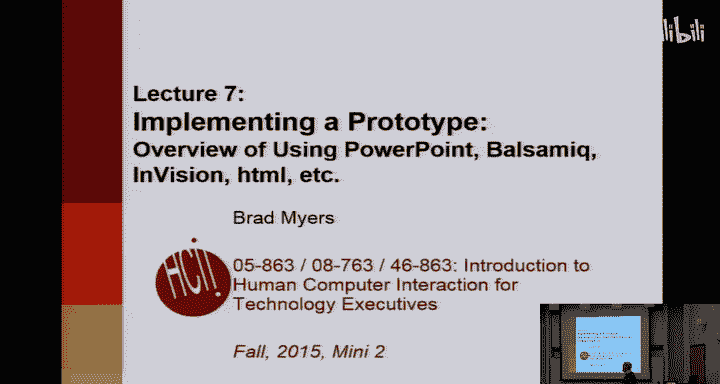

So it's Thanksgiving， hopefully everybody has a nice place to go this weekend for holiday starts on Wednesday。

 homework two is up on Blackboard， homework three is due right before class。Homework four。

 you can start on now and it's due next Monday。And everybody has to turn in homework4 on time。

 And the reason is that homework5 is's a lot of fun。 You get to evaluate each other's homeworks。

So each other system。 So what's going to happen is next Monday。

 we're going to take all of your homeworks that were turned in。 We're going to。

Check and make sure on Monday that they actually operate so that the TAs are very quickly going to test each and every homework on Monday。

 then hopefully by Tuesday morning of next week。You will get an email with two of your classmates systems in it that you will then evaluate for homework five and we'll talk about how you're going to do that evaluation next Monday。

 so if you don't turn in a homework by next Monday。

Then we can't give your homework to or your classmates。

 we won't give you any homeworks to evaluate for homework five either because that wouldn't be fair。

 so it's really important everybody to get them in on time I apologize that you have to do this over the holiday but you can do it today and tomorrow if you really want to avoid working over the holiday。

Any questions on the schedule， and then homework  five also has to be turned in on time because after you do evaluations of each other's homework。

We're going to give your evaluations back。To whoever is you reviewed。

 and then they're supposed to fix up their homework based on their reviews。Okay。

 so that's what homework six is you're going to get two of your classmates reviews and then you fix up your homework accordingly right and so that can't be late either because that wouldn't be fair to your classmates they won't get reviews to respond to。

And historically， I found that if people don't have homework three and by now。

 they're really pretty hopeless in terms of catching up。

If you're there's still four or five people who are way behind。

 and I strongly recommend that you catch up right away or give up and drop because it gets to be kind of a。

You know， race at the end of the class。O。So。Homework4 that you're starting on today is this implementation and the goal is to make what's called a wireframe prototype or a clickthrough prototype。

 and the idea is that you get a good idea of the interface and every screen must be pretty much complete。

 every screen that you show。But it's perfectly fine to have whole sections of your website or your system。

 your camera， whatever you're doing， it's fine to have whole sections of it not represented。

The goal is that for every page that the user sees as part of the tasks that you defined。

Those pages should be complete。And if you remember the prototype that we showed before。

 it looked like a real web page， you clicked on search， you got to another real web page。

 you clicked on products， you got to another real webp page。

 but all of them were static hand drawn pages so it's really pretty straightforward to pretend that your system works without having to do an awful lot of implementation。

 sometimes in years past students have said， oh， I did 80 pages。

 well if you've done 80 pages you're doing way too much work。

There's no reason it should have anything like 80 pages。If you。

It involves like a database like it doesn't actually。Please。

Exactly so the question is if you a supposed you're pretending to have a database and you have a form to fill in at the bottom。

 there'll be a submit button or something like that。

 you can ignore everything the user enters and go to a fixed page。

So you don't have to write any scripting stuff。You can decide as part of your instruction。

 so one of the things you have to turn in is what's called a readme file or basically instructions。

 you can say pretend that the user filled in the name John Doe and his address in Pittsburgh。

 and then the next page will say，" welcomelcome John Doe， here's your order or whatever。

Or if you want to pretend that there's an error， that's also a reasonable thing， you can say。

 pretend he typed in the address in correctly and then you show the error page or whatever。嗯。

So it's the basically every。Button that does something should do something。

 and typically they'll go to fixed pages， whereas in the real website or the real product。

 it might compute where to go based on what the user enters。

And to extent that something external is supposed to happen。

 like if you're pretending to do a camera， then at some point one of the actions might be take a picture。

RightSo then or if you're doing a copier interface。

 then one of the reactions might be a piece of paper comes out of the copier obviously in your prototype you're not going to have anything like that。

 so then you might just pop up a dialog box or another screen that says pretend the copier just you know shout out a piece of paper that has the picture you want on it or pretend it shout out a blank piece of paper now what are you going to do so。

The key thing that people usually do wrong is they miss on the level of complexity。

 so as I mentioned， a few people will go overboard and try and do 80 pages or whatever and that's wrong in the too much work direction or some people will come up with three pages with not enough on it and that's too little work or too little of the tasks。

So the goal is pretty much the same as it's been throughout the whole course。

 it should be around 10 different screens， around 30 controls。

 it's really hard to say across all the different kinds of devices you guys have。

But it should be about that level of complexity。诶。So there's one style of prototype is called a wireframe。

 it's called that because most things are just represented by their outlines。

So you have basically frames that are look like payment made out the wires。

 in this case you don't need to have final graphics， you can just have placeholders。

 you can have something that says logo， you don't have to have any colors。

But the key requirement again， is to have enough functionality to do the tasks that you have listed。

We want the labels on the pages you do to be real ones。

So don't say lam Ipsum or other pretend things。 If you have a big block of text， that's like。

Product information or description of this product that's really not part of the task。

 it's okay for that to be pretend。But to the extent that there's a major button。

Even if it's not part of your task， it should be labeled with what you intend for it to do。

So there's two reasons for all these requirements that each page be complete。

 the first one is that you're going to pretend to do a user study， well。

 you might be doing a user study of this prototype， we don't actually require you to do that。

And then the user should be equally confused。From your prototypes， they would be on the real website。

So if you only had one of these buttons be real and the rest be pretend， then the user says， well。

 I know which one I'm going pick on， it's the one that's actually there。

 similarly another reason is because we're pretending that you're going to give these to a professional implementation team and。

Goal is that your prototype will guide them on how to implement this for real。

So we showed you the Tham website， which has pretty。Pretty clear。I mean。

 it looks kind of like a real website because it has graphics and stuff。

 this was done by a team of four people in two weeks。

 so we obviously don't forget need you to do that level of detail。

So this is way more detail than you need to do， but it is。So again， when we talked about search。

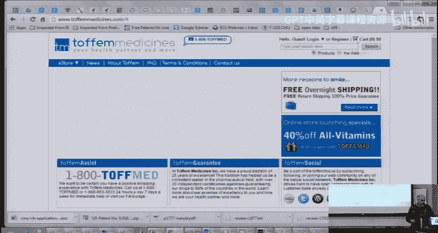

It doesn't matter what I put in the search field， I'm going to get the same results。And similarly。

 when I go to my cart。Or if I register， I think there's a register page。 Yeah。

 so the register page is an example of a form that you were asking about。

So there are all these fields。 It pretty much ignores what I put in them and pretends。That。

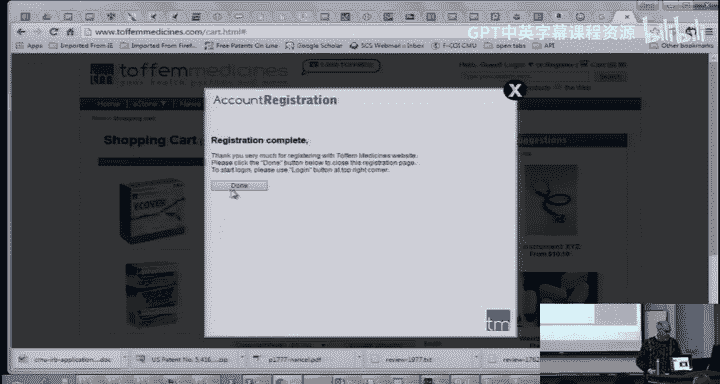

That I put in。John Doe or something。So， that's the。Level that we're hoping that you'll implement。

Okay we've said this a bunch of times， that's because a lot of people miss it。嗯。

Okay so in terms of implementing this， you can pretty much use any tool you want and the TAs are going to spend the second half of the lecture showing you four tools that they like or know about and so that are certainly some choices I'm going to show you PowerPoint which is what most of the class turns out to use because everybody knows PowerPoint。

 not and it's pretty easy to do prototyping with it， it's not the most functional tool。

 some of these other ones are actually easier to make pros with。

 which is why they use them for real HCI methods。啊。

We recommend you not try and program this if you find yourself trying to write Java code or JavaScript code or C sharpp or anything like that。

 chances are you're going too much into the implementation and that's not expected。

 you'll never finish it in a week if you try and program it in Java。

Whereas if you're just drawing some screens with Photoshop or balsamic。

 there's no reason that it should take you very long。啊。

Another important point is there's a variety of machines in the class， most people seem to have Macs。

 but there are a reasonable number of PCs and so everything and remember we're going to give your program to your classmates and we can't。

You know try and make sure that we're going to give it to another classmate who happens to have a Mac or a PC that's just too impossible to deal with so your output must run across both a Mac and a PC how can you do that well almost all these programs will output a PDF which is pretty straightforward you can kind of assume does everybody have PowerPoint all the Mac people right so it's probably you can assume everybody has PowerPoint you guys have PowerPoint right。

So you can output at PowerPoint， you can output as PDF， you can output as a webp page， HTML。

 some of these tools will do that if you use something like OmniGraphal that's Mac only。

 then you'll have to figure out make sure that you can output to PDF or something that people can click through。

啊。Same with Vi Studio or any PC specific tool last year somebody used active X controls in their visual basic prototype that was a big mess。

 so try to make sure that your tools are not machine specific。Okay嗯。

So these are the ones we're going to demo。So balsamic that。

That we're going to demo comes in two versions。 There's a free download。

 A lot of these tools have free 30 day trial downloads that you can try out the。

Luckily there's not 30 days left for the end of the course so that's plenty of time one year there was a tool that only had a one week demo that wasn't quite good enough because you need to use it again for homework  six。

 but 30 days is plenty of time。Or we also CMU has an online student account for Balsic。

 and if you're interested in using that just email me and I'll make an account for you。

And Invision also is a free tool that you can download if you want to try and learn a new tool。

We'll demonstrate Actture， but there's lots and lots of other ways to do this。

 so if you want to try out some of these other tools that people have used， that's perfectly fine。呃。

One of our alumni who works for Verizon。And said， oh， they do lots of prototyping。

 they tend to use Photoshop and illusstrtor not so good because it doesn't do click through prototype。

 so wouldn't recommend it。诶。But there's brand new tools。

 Linto Invision ProtoIO that we're not going to talk about， but you can try if you want。

If you want to find out what kind of tools they are out there。

 all you have to do is search on Google for wireframe tools or prototyping tools。

 and you'll get all sorts of lists， this Cooper website， one of our alums。

 is actually keeping that up to date and it currently lists like 20 different tools you could pick from。

So this is a really common task。So they did a survey a few years ago and sure enough。77% of people。

Prototype on paper。And that that's one of the reasons we made sure that you had some experience doing that。

 Visio， PowerPoint， Dreamweer， Acture， Omni Grrael， so a lot of these other tools are quite popular。

So this was done a few years ago this is from 2010， so tools like Balsamic aren't up here。

 but they're rapidly gaining in popularity。Okay， so let me show you how to use PowerPoint and PowerPoint has all sorts of amazing features that you probably don't know about unless you've actually tried to do some of this stuff that make it surprisingly effective for some of these things。

So。Probably you've all tried， and this is Photoshop 2013， I think。But none of these features are new。

 they've been moved around annoyingly， but they all go back at least in 2007。

 and they are on the Mac versions as well， although of course they're in different places。So。

Everybody knows how to add a shape， Let's add a rounded button。Okay。

 and now we can put some text on it。We'll call it button， but you could call whatever you want。

 and then you can use all of the usual mechanisms。For， you， deciding the color and where it is and。诶。

Things like that， but I'll just leave it。 Now， the key part that we're going to do is make it into a hyperlink to make it go to a different place。

 So pretend this is one page of my user interface。And what we're going to do is add a hyperlink。

So normally hyperlinks， you think of them as going to the web。But one of the choices。Come back。

One of the choices is a place in this document。So normally you would go to a web page and youd just type the URL。

 but one of the choices for hyperlinks is placed in this document。

And it gives you a list of all the files， I mean， the title， all the slides。

So these are all the slides in this presentation and up at the top of the list are some special things。

 first slide， last slide， next slide， and previous slide。Which is also kind of useful。

 So let's say we wanted to go to。Happy Thanksgiving slide， so I just click on that and say okay。

And then if we go to runtime。Now we have a button。It has a hyperlink that if I click on it。

It goes to slide two okay so you can use that mechanism to make to pretend this is the search button and go to a page where you have all the search results and things like that。

 so now we're in the wrong place let's go back to where we were。诶。So I've already set one up here。So。

 this one。Goes to where。This one just goes back to the previous slide。So if I go to runtime。

So if I'm here and I go here， and then this one goes back until it goes to the previous slide that I was on。

Okay， is that clear yeah？Yes。I'm glad you asked that question， that is the next slide。呃。Nope， right。

Yes。That is the next slide。 right， Good question。 So unfortunately。

 if you looked at the list for the hyperlinks。Up here， it does not， oh come on。

 it only has first slide， last slide next and previous， which are in numerical order。However。

 there's a totally different feature， which I don't know why it's totally different。

Called insert action。Okay， so， and it's described on this slide here。 If you do an insert action。

 then you can use the hyperlink， which。Has。Many more options， this makes no sense at all。

 but this is the way it is。And one of these is last slide butte。

And so this is a really good way of going back from somewhere and it'll go back to wherever you came from。

So if we put a button with last slide viewed on the Thanksgiving page， then when we push that button。

 that would go back to where we were。And so we can just do that slide viewed。ok。Actually。

 let's make a copy of this。I think that works that if you copy things。And we'll paste it down here。

And I guess we might as well say， go back。And don't want to spend too much time making it pretty。

You got the idea。Yeah， so we were。W do we make that here？八嗯。So we make button。

 it goes to here and we click on go back and it goes back to everywhere。Okay。

 so pretty surprisingly straightforward， if you know where to find it。

 but nobody knows these features because they're so weird， another key thing。Okay。

 this was insert action。 Yeah， so what you're going to do， obviously， is create a slide for each。

Page of your application， but you may need multiple slides for the same page。For example。

 if there's a button on the page that shows logged in versus not logged in or if you want to have a setting and show the different values of the setting。

 then you might need multiple pages for the same page， you can add transitions and stuff like that。

 but you you're only supposed to make it look like the real interface so if you were going to have a fade。

featureeature in your actual application， then you could use fade on PowerPoint。

 otherwise you wouldn't use those kinds of things。It turns out that you can even add buttons and text fields and so forth in PowerPoint。

Okay， which doesn't have much make much sense in terms of a presentation。

 but you can only do that by turning on。This developer tab。

 which probably most people have turned off because it's not particularly useful。

And so to actually turn it on。You have to go to file options。And go to the customized ribbon。

 and this is not checked by default。And so then you have to check this and then you'll get that ribbon。

嗯。Okay， on previous versions of PowerPoint it looked different， it was in different place。

 and I have on this slide。How it looked in 2007。And then here it's 2010， 2013 on the Macintosh。

 I don't know where it is， but you can certainly do a Google search if you can't find it。

So what can you do with that？Okay， well it's ours here。So if we go to the developer bar。

 then up here in this control section， there are a bunch of things like checkboxes and buttons and radio buttons。

It turns out to make them do anything， you have to write code。

 but remember you don't actually have to make the input fields do anything。

So if you wanted to checkbox for use the same address as a shipping address。

 you could just put in a checkbox and say， okay I'm just ignore it。

 the users supposed to check it and if they do then that's great the way that you add things is you click on this and then you drag them out。

And so here's another checkbox。And in order to change the label and so forth， unfortunately。

 you can't do it directly， you have to use the property sheet up here。

It's also on the right click menu。wakeake up。Property sheet。And they don't see where it went。嗯。

And the property sheet looks like this， and you can use it to set the different values。

 The key thing that you might want on your。诶。In your prototype is a text field because use most interfaces if you're doing websites or whatever。

 many websites will have text fields that user type in their name or whatever， their address。

 and again， you know it's fine to ignore the code that goes with that just you know。

Have people type stuff。And one more thing about PowerPoint。Oh， two more things。

 there's something called the master slide in PowerPoint。

 if you want the same thing on lots of different slides。

 you can create a master and then use that in different places， it's a little more complicated。

And if you put controls on the master page， then they appear on all the pages that use them with the same value。

 which is either good or bad， depending on what you're trying to do。

And then a following thing that on almost all PowerPoint shows if you click anywhere in the screen。

 that goes to the next slide。You don't really want that if you have a prototype right。

 because then the users click in the wrong place and they go somewhere incorrect and you can turn that off。

Whi is really annoying if you're giving a PowerPoint show because then you have to use the hour keys and that is in different places in Office 2007 and 10 and 13。

 they move this checkbox。Annoyingly， but now it's on transitions and it's。Right here。

 advanced slide on mouse click。If I turn that off。Then。Oops go away。Now， if I click on the slide。

 it doesn't actually go to the next slide。So this makes it much more like a prototype where you have to click on an actual button or a link or whatever。

 some kind of control in order to go to the next slide。诶。

And so be sure to turn this button off in your PowerPoint prototype。

And there's also a link down here to a blog entry that basically says exactly the same thing。Okay。

There's this great example that I have linked here。That explains this， it's a little old。

 so it does have an old version of PowerPoint that it's using。嗯。But so here's。

 and this is just done as a。An example， so this is a PowerPoint file that you can download and one of the things that's kind of wrong with this one is that she didn't make links。

Of everything， so you can kind of tell what you're supposed to do because only one thing works on every page by moving your mouse around until you find something you can click on。

But this one has a hover behavior， you can define a hover behavior if you want。

 so there's some links up here。Sorry。嗯。Let's go back。嗯。Now， these。

Annotations on the side that was a little confusing for some people last year。

 you're not supposed to put annotations in your prototype。we don't want them there。

 we want them in that readme file。So when you give your interface to your classmates。

 they have to know what to do。And so you're going to put in your read me file the tasks that you've been doing all along。

 it's fine to just copy and paste them in from the previous homeworks and any kind of instructions。

Like this， that you want the user， the tester to know about。

 but don't put them in the PowerPoint itself that makes it- it's too confusing what's supposed to be in the actual user interface and what are your annotations that you're trying to tell the user about。

So this is kind of a good example about how。You can make。A PowerPoint file looked like a prototype。

ok。Any questions about using PowerPoint？And there's lots of good examples on the web if you want to find out about how to use some advanced PowerPoint features。

 and also I'm pretty much of a PowerPoint guru personally。

 so the key problem with PowerPoint that you'll see is also true of some of these other things is what' is that basically if you have lots of options。

So if you want to show something on and off and something else on and off。

And that's basically you need four different pages to show all of the different possible combinations of things there are not there。

 and so that might involve。Four pages option for those two options， and then if you have another one。

 then you get eight pages and it gets to be ridiculously awkward。

 the other problem with PowerPoint is if you decide。

 you know I really need a new page and you try and stick it in the middle。

 then sometimes all of your links then will be broken。

Because if you go to slide 12 and then you add a new slide 11。

 then slide 12 is no longer the right place。And PowerPoint doesn't have any help with that。

 so it's really important kind of as a hint that before you start adding all your links。

 try and put in placeholders for all your pages， so then your links will be it'll be easier to get all your links to the right place and not have to keep adding them。

Okay。Great， okay， so the TAs now are going to spend a few minutes on a bunch of different other prototyping tools。

That that they like and that they use as part of their work。And。Let's start with as I am。

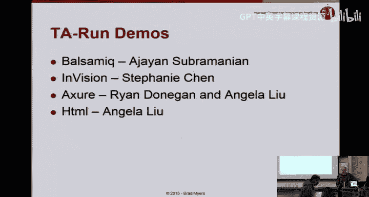

Hi everyone I'm Ajan I'll talk a little bit about Balsamic so it's a really quick wirefrraming tool you can really easily find elements that you would normally find on a website or a mobile interface and you can drag and drop them into mockups and create them rapidly interestingly you can create clickthroughs and export them as PDF so in terms of using it on Mac versus PC its really convenient Professor Mas has already discussed how you can use the web version and the desktop app is also available for both Mac and PC and it has a 38 trial it's really good for quick wire framing but if you want really polished mockups where you want to create your own elements then I suggest using illustrator or sketch。

So I'm just going to show you a demo of how you can use this tool。Yeah， to create mockups。

 not so much for click blues， but to create mockups that you would then use in In。So。

 this is a web project that Professor Ma has already created for me。

This will be your view when you register and log into a project。

So Im just going to add a new mockup so this is where you can find all the elements you want。

 let me start with an iPhone skin。You can just type it in here and you will find whatever you want here。

是呀。Now， let me add in a top bar rectangle。Which I can put in here。hu。😊，Okay， this is irritating。Yeah。

 and then I want to add in a title to put into that top bar。So， yeah。

 most of the names of the elements are quite obvious。 so you can just put them in whenever you。Oops。

And it has this aligning tool， so it is quite convenient to center or left align or write align text。

So， yeah， here you can like you have this kind of an inspect view where you can change the size of elements and whatever formatting you want。

Okay， let me add in a couple of input fields。Let me just type and put， yeah。So。

 let us assume this is a login screen， so then I will add a couple of labels which which say username and password。

So I just type in label here。And then I want a login button that goes to the next screen。So。

 I search for a button and then yeah this pointy button looks good。So yeah。

 but I want the point to face in the other direction because I'm going forward。

 so I'll just change this。Yeah。Yeah， the smaller size screen is messing with what I plan。Yeah。

I'm just going to name this login。Alright， so now if you want to show interaction lets say I want to show the next screen after the login screen I need to add a new mock up and then show what is the next state after this。

So let me first save the mock up。Yeah， let me just for now， call it new marker。

And then I go back and then I add a new mock up here。

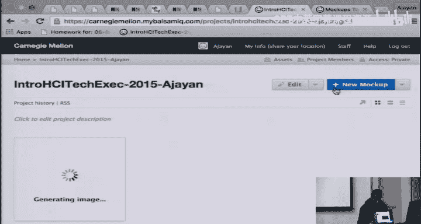

好累。But I want to I dont want to start everything from scratch again because I already have a generic outline so I can group these elements here。

I picked the group option here。And then I name it， I will name it outline and then convert it to a symbol。

Oops， I already have something here。 Okay， outline one。All late。

So now when I want to add a new mockup I don't have to start from scratch。

 I can look in my simple libraries and then I can just find yeah this one outline one。

 I can copy and paste this。呃。Yep。So then yeah let me assume this is the second screen after Ive logged in lets say that the second screen has an image。

 so I will add an image in the center。You can can add an actual image by here。

Looking into site assets， I will show you how to get into site assets later。

 but you can upload whatever images you want into there and then use it from there。

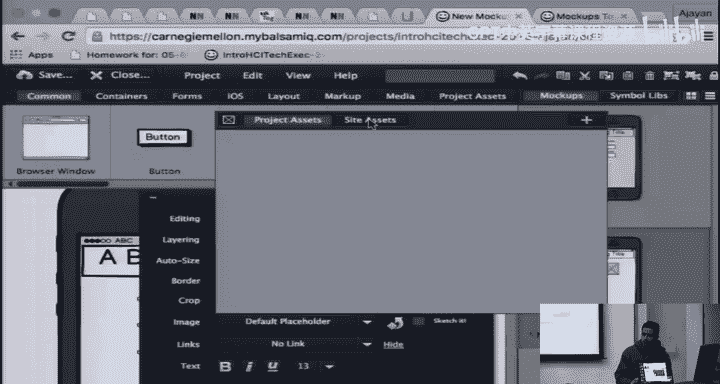

And then let me show you a form field， so let me add a checkbox group。

This might look overwhelming at first， but it is quite simple。

You just keep messing with this stuff till you till what you see is what you get。そや。

So now none of these are checked。Let me save this mock up。

I'll just change the name because they duplicates。

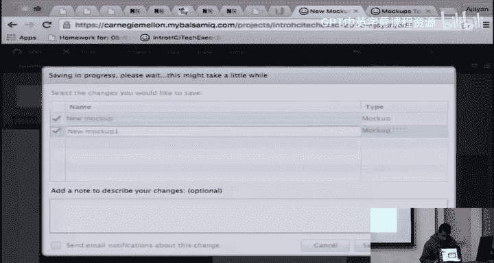

All right。Now I want to create a third mockup where I want to show one field checked so I want the second mockup where the user will actually check a box and then in the third one I will show a state where it is actually checked。

So now since the third one is nearly identical， I am just going to clone this mock up。

And then I'll save this。Allright。 And then here I'm going to。呃。Yeah。

 I'm going to show this as checked。Y。All right。Now I will show you how to link these pages so that you can create a click through so on the first page I have this login button oops。

Sorry yeah， I have this login button。I just click on it and then here under links I can pick the mock up to link it to。

 so I pick mock up1。And then here。嗯。Yep。Yeah， here I want the user to click on say indeterminate and then when they do it goes to mock up to the next mock up。

So yeah。All right。So， one way to test it is using the viewer here。

 but Id rather show you how to export it to a PDF and test it that way。

So I am going to close this and now you are in the project view， you can export it to a PDF here。

好right。So now when I open this， I have already linked the login page so I can click on this。

 it goes here。来。Oops。Yeah， okay， so now when I click login。

It goes to this page now I want to show that I am checking this way this is how you can show different user states in a clickthrough。

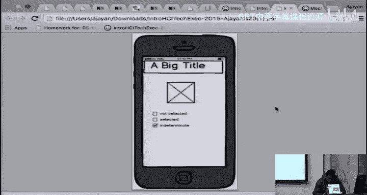

嗯。Yeah， so I just wanted to show you a couple of more things。

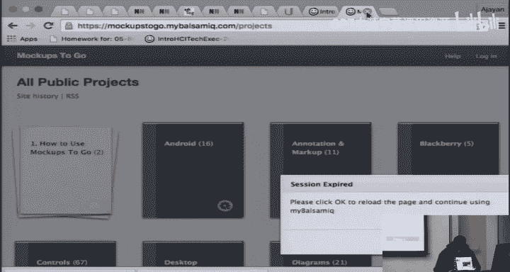

嗯。

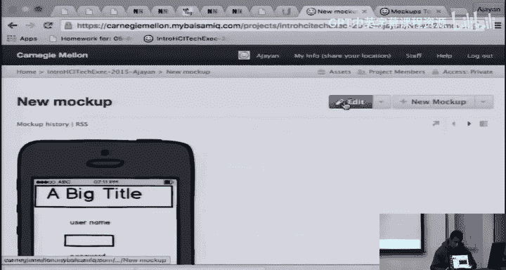

So right now this is the sketch view which is which just gives you a good idea of the layout but there is not really any color and it it kind of looks like it is hand drawn so if you want to make it look somewhat better。

You can go into view if it comes up。Oops。'm sorry。

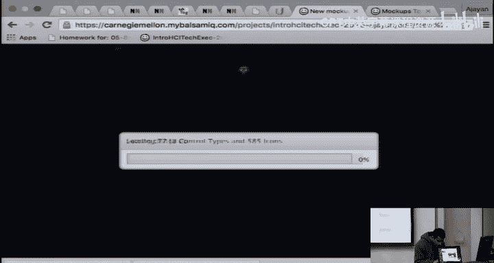

哼。Okay， so you can change the skin from sketch to wire frame and then you will get something that is slightly more high fidelity and you can modify colors for example。

 when you click on this you can like change the color here and stuff。

And it is going to give you a better look overall。Now a couple of more things I want to show you lets say that so right now most of what you want here is based on the iOS symbols and stuff lets say you want something that you are not able to find here in terms of elements or containers okay let me try an icon here。

This is to show you what is already there。So now when need double click on this。Yeah。

 so here you can search for pretty much any icon you want and most of them are there。

 but lets say you want something thats Android specific。

 Let's say I want the Android keyboard on it so。This is a bunch of projects Ive given a link in the slides to one such project which is mock ups to go so then here you can like find whatever control you want lets say I want the Android controls I can download this which this is a balsamonic specific type file。

And then I just save whatever I've done。Yeah， so now。Yeah， now under assets。

I can upload a project asset which is this Android controls。In fact。

 if you want to add any images or anything external。

 this is where you add it under project or site assets。

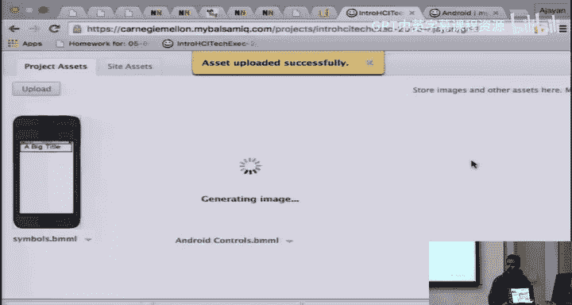

Okay， I'm going to go back and。

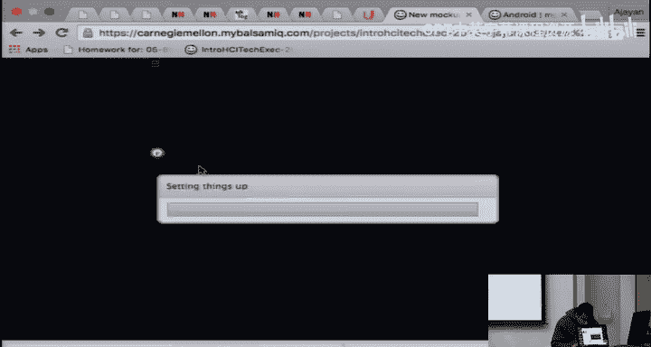

Yeah， so now。When I go into my project assets symbols， yeah I have these symbols here now。

So now I can pick from any of these Android symbols。Let's say I want this keyboard。

And then I can add this to my mock ups here。 So this is how you can get some external symbols into。3。

Yep， that is about it Ive added some links to documentation and tutorials it is pretty easy to find whatever you want on balsamic just go it that is it。

Thanks。I think Stephanie is next with in。Any questions？go to Envision。

com and it's free but you can only have like a limit of one active project if you want you can upgrade to a student plan for free also I think you just email them and then you can have three active projects。

So Invision is a little different than all the other prototyping tools in the fact that you can only upload screen like you can't create screens or modify screens in Invision。

 you have to make it beforehand， and so I would suggest using illustrator or Photoshop or any other drawing tool that you know。

To create the screens beforehand and then what it does。

 it makes it a clickable click through prototype afterwards。

 So you have to upload the screens as JPEG or PNG images and files。😊。

And drag it in there so the way it works is I'll do a demo later。

 but the way it works is you just create a new project。

 select the device that you are going to be using so for example。

 if you're it supports mobile screen sizes， desktop tablet and so on。😊，Then afterwards。

 you upload the screens and make sure that they're the right dimensions。

And then there's a build mode where you can link all the screens together by clicking through。

 And it also supports gestures and transitions。 And it's all really easy to do。 So I'm going to。

Do it点mo。Yops。😔，嗯。

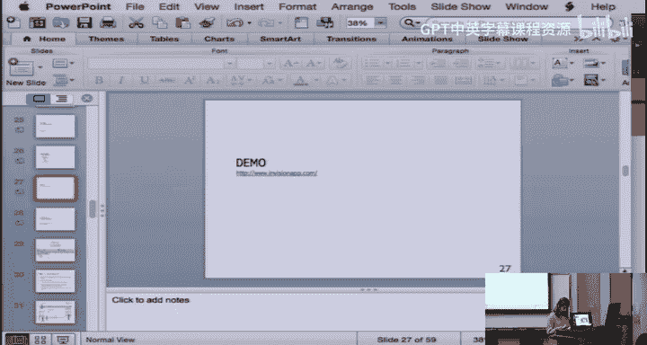

So。So this is Invis。So if you。

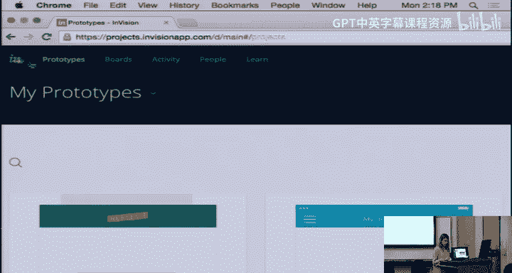

， the screen is so。Okay。Did it。Okay， so basically you can create a new。

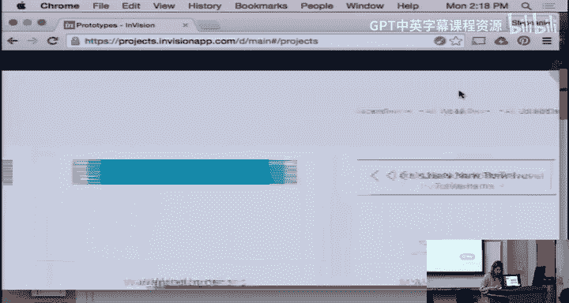

Project here， you name it。Test。Or whatever your project is called。

 and then you can select the device that you want， so I'm going to do iPhone。

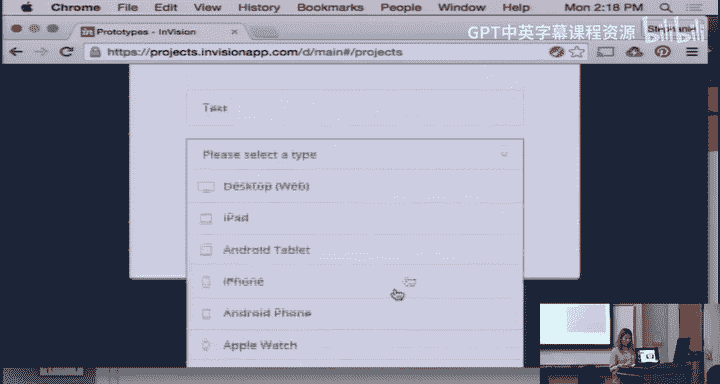

And。Paper。

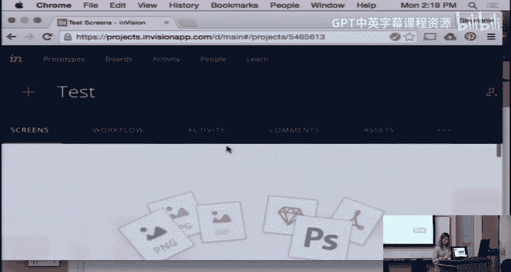

So here you can drag and drop images actually I'm working on a project so I thought that I could just。

Do it here， so these are some P andGs that I have exported from Illustrator and so then I'm just going to drag and drop it here。

And with that， it just uploads all the screens for you。

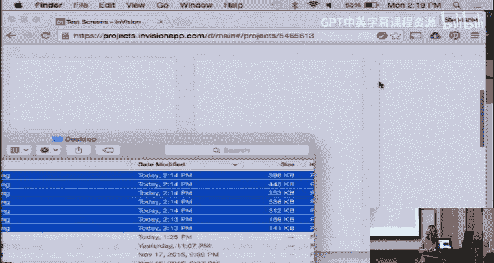

And then。How do we make it higher resolution？Okay。

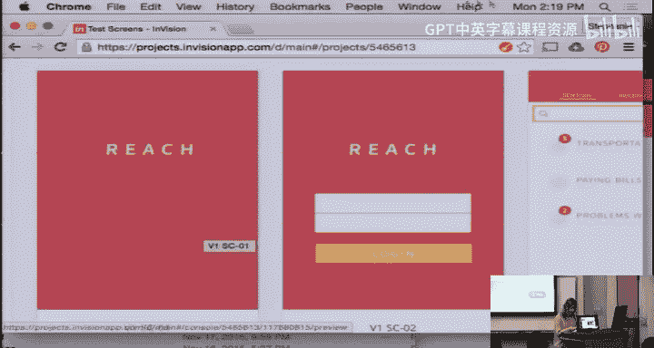

This one。

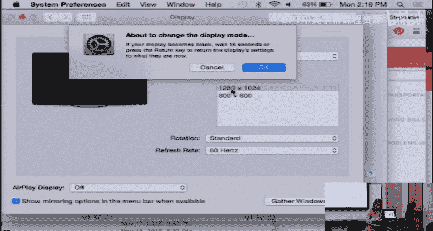

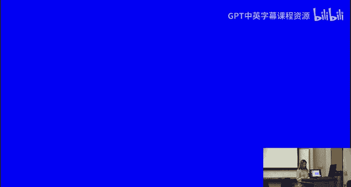

Okay， cool， I think this will make things a lot easier。So yeah。

 so you have all these screens that you've uploaded and so if you click on the first screen that you want to use。

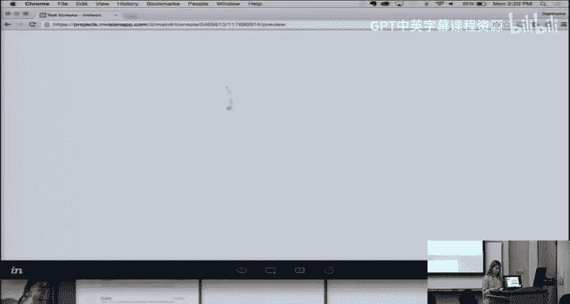

嗯。It'll send you to this page。So there's different modes， this is the preview mode。

If you can see on the bottom here。And then there's the build mode。

 so you would want to go to the build mode and that's where you create hotspots or links to link up all the screens。

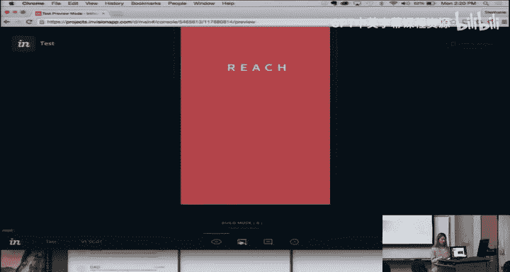

And it's really simple though if you want to create a link。

 you just click and hold and it'll make this box。And then。It'll ask you where you want it to link to。

So then you select。And then you can select any other screen that you've uploaded。

up to the second page I can do that and then there's the gestures for mobile。

 it supports tapping and swiping if you're doing a web then it's only going to be clicking or hover。

But so if I click tap， there's also transitions that supports。 you can slide， push， flip。

 there's a lot of。Cool transitions， but I'm just going to do instant。And then I click saveve。

 so now if you go back to preview mode。

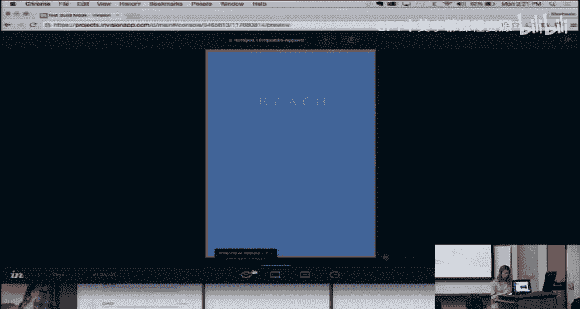

If you click on the screen。It'll send you to the next。

Screen and so then you can link up all the screens that you want。

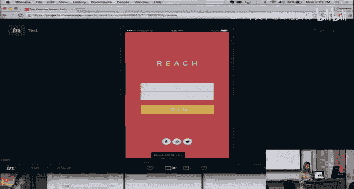

To make it a click little prototype and it's important to。

 I guess name the screens so that you keep them organized and it'll make things easier for you when you're trying to connect them all together。

😊，There's also some other cool things， there's a fixed footer on the bottom here。

 so if you're going to have a menu on the bottom that's always going to be there so that if you're scrolling that bottom bottom column will always stay。

 you can use the fixed footer。Or the fixed header。And then there's also hotspot templates。

And what hot templates do is it saves you a lot of time if you're going to be using the same。

I guess hot spots， then it'll save them。 And then you can just apply them and。Yeah。

 I guess I can do a few more if you wanted to do。The login page， you just do that and then。

I would want it to go to this next page， but maybe I'd want it to dissolve。So I would say that。

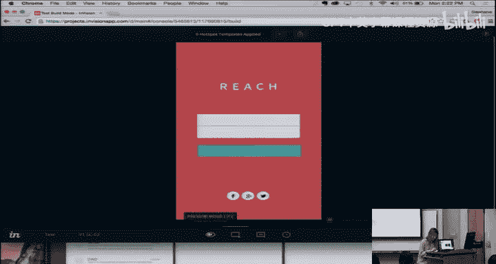

And so now if you want to go back to。It would go here and then you click login。

And then I'll send you to the next page。So it's pretty simple and really easy to use。

 and it's nice because it almost looks like a real working prototype。

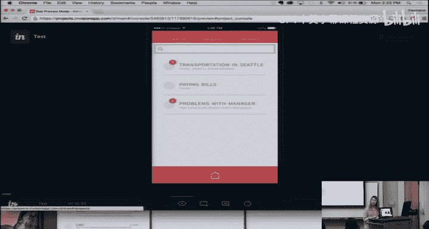

And I'm going to also do one for the web， so there's actually a lot of demos。

 if you create an account it comes with a lot that you can just play around with and figure out how to use。

But for。This one， it's a。You can。There's a lot to hold on。

It's really similar to the same thing as mobile but。It doesn't have。Tapping or sliding。

 it supports click and hover。不要。Let's go back。2。😔，I can't find my PowerPoint。It's funny。

Can don't see it。Should I change it back to。Well， it seems like it disappeared。嗯。嗯。Yeah。Show。

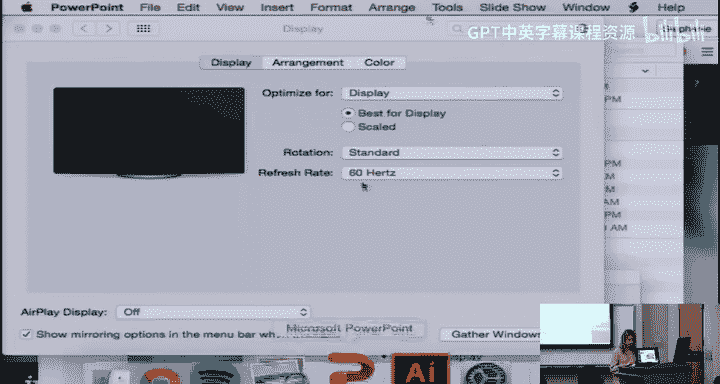

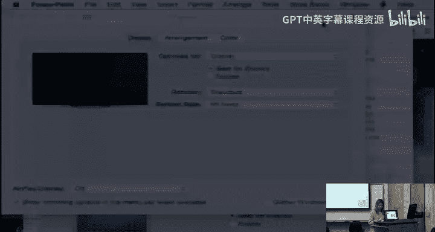

O cool。All right， so and then I'm just going to go through the pros and cons， like I said。

 it's really easy and quick to use it supports basic gestures and transitions。

 but you have to it only supports like full screens like you have to upload the image to envision using some other。

😊，Like you have to create it using some other tool。 And then there's limited functionality。

 So like you can only tap on the screen or a slide on the screen， but it makes really nice。

Prototypes。And it also has other features。 it supports sharing and collaboration。

I forgot to show you， but it's really easy to share and do user testing with it because it creates a link for you and the link you can just copy and paste it and send it and if it's a mobile。

😊，That you want to do user testing on for the device。

 you can actually send that link to your phone and then you can have it on your phone and you can it supports the swiping and tapping and everything。

So yeah。Does anyone have any questions？Y。So when you do the hubberg thing。

 does it send you to like a whole new full screen or does it？

Like display like admit on top of that so it has to be the full screen there it's different than all the other ones that you can't have like it's not assets。

 not like different parts of the screen， you have to upload full screens。

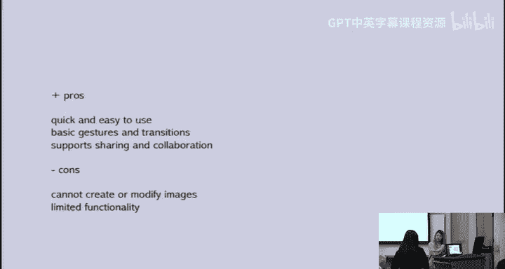

Hi everyone， I'm Angela， I'll be playing Ryan for the Acture demo If you have any questions I put his email on the last slide so it'll probably be better off asking him Anyways so Acure is a wireframeme and prototyping tool that you can download it's not on the internet it's very similar to balsmic actually。

😊。

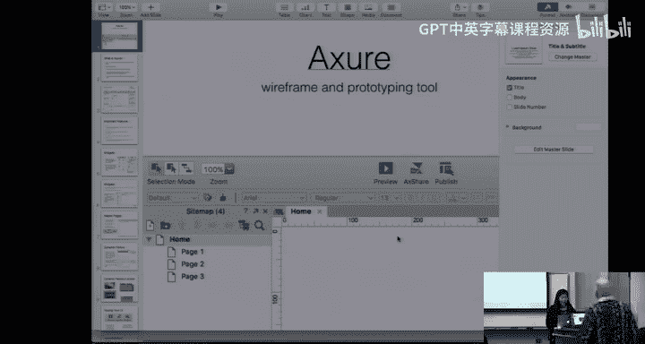

So it's a tool for creating dynamic wireframes， you can make your higher fidelity mockups on aruure。

 and they have lots of widgets and libraries so everything is almost drag and drop。

 so it's really easy for you。So this is what the layout looks like。

 You've got your site maps on the left your widgets on the left bottom。 you've got a master panel。

 lots of properties on the right and then the main screen in the center So I'll go through each of these components。

 the first is widgets so there's premade widgets for you already there's buttons navigation menus。

 form fields tables， anything you probably need for a mockup master pages is kind of like the master templates and PowerPoint。

 So if you create like a navigation bar and then master template。

 you can recreate on every page I use I don't have to keep doing it over and over again。

 dynamic panels I'll go into later， but basically it's also sort of like a template so say you have tabs you don't have to recreate each tab is like a template to use for each tab and then preview and publish obviously you can create an interactive app like on your local hostover so you can run through anyone and run through with people and something that。

As really well as that it can also export an HTML and CSS， so kind of like Dreamweaver。

 if you've used that， it'll create the code for you so you don't have to do it yourself。

So for widgets， they have the list of widgets and you basically drag it straight into that main screen and you could drag it around。

 resize it。You can add interactions to the widges also。

 so like say if anyone has used JavaScript before you can give it an onclick action or an on move action。

 so say I click the button then it should bring me to another page or pop up an error button or something。

Master pages， like I said， is sort of like a template。

 you can make global changes so if you want to change something in navigation that like switches buttons around。

 you can just change it in the template and it'll change it everywhere that you placed it。

Dynamic panels， I explained a little bit earlier and a good way to show you is see here like if you have men women in decors tabs。

 you can create like a dynamic panel template for each one so you don't have to go through and read。

Place all of those objects。Same with here， like they have sort of an accordion type of layout。

And for testing your UI， there's preview， not sure where the middle one is。

 and the last one is published， which exports to HTML and CSS。

prereview is sort of like running a local host server on your computer。

 you can run through it with like a user。So reasons is it versatile。 It's efficient。

 and you can get a 30 day free trial。 After that， you have to get a student license or pay for it。

And if you need help， that's Ryan's email， and then I don't have extra on my own laptop。

 but I will show you a YouTube video tutorial of it。

Unfortunately the main advantage of Ature are these dynamic panels， so like you were asking。

 can you have something that changes in place with the previous two tools PowerPoint or Balsalic。

 you can't do that or envision。But Ature does have these panels that can change in place。

Which makes it lot more powerful， also a lot more comfortable。So it's kind of the obvious。So。

 I will show you。First。And this against dynamic panels demo。

 we'll show you how to use the events on dynamic panel to prototype。清说。

Here are the wgets that will make up the accordion， each section has a header and content。

Once the content will be shown in dynamically， we'll put each one in a dynamic panel using convertver to dynamic。

And set these dynamic panels to hit by default。On each section header。

 we'll add a case beyond click event to togg the visibility of its content panel。

When we show the content from one section， we want to move the sections below it down。

Let's put each section into a dynamic panel。And moving section into its default position。

Now that everything is in place and we have our interactions to show in hide content。

 we want to add interactions to move the dynamic panel。Any time section two moves up or down。

 we want section three to move with it。To do that will add a case to the armed events of Section2 to move section3 with this。

Now let's go to section one and use the on show and on hide events on the content panel to move my section to the。

We need to know the height of the content panel since that is about we want to move the other sections。

In the on show event， we'll move section 2 down by 120 pixels。And on hide of。

We'll have Section two up by 120 pencils。Remember that the odd blue event on Section2 handles moving in section 3。

 so we don't need to move that panel here。Now do the same for the on show and on height of the Section 2 content panel。

Since section three is the last section， we don't need to add these interactions。

Let's generate the prototype and check it out。Clicking on each of the headers shows the content and pushes the sections below it down and clicking on them again hides the content and moves everything back could。

And that's how to create an coordinateord control with that in panels。If you have questions。

 email us at sportactction。com or tweet us at action。So， that。Actually。

 and for my part of the presentation， I'll be doing HTML and CSS。

 super simple HTML C S has so much to it。 I'll just be teaching you how to going through sort of how to do a simple page with like divs and buttons。

😊，Sorry。Okay。So the first things first HTML is made is written in tag。

 so everything that you have in HTML is in a tag， so the format of the tags is you have the tag name from it less than or I guess。

 and you can give it a bunch of options so the options can be based on whether what the tag is so like if it's a button buttons have specific options or you can give it class names or ID names or even JavaScript functions。

Sorry。😔，嗯。That's like the general format of a tag and it's kind of hard to explain until I go through some。

 so some of the tags that you can have are headers， paragraphs， divs， buttons， links， tables。

 form fields， images， all kinds of things W3 schools does a really good tutorial on HTML if you want to go through that。

So the general file structure of HTML， there's always a doc type HTML。 So when you render the file。

 it knows what type of file it is。And then you have the tag that wraps the entire file in its HTMLO。

Under that you can have head header tags is where you link to other files or you like have title attributes。

 so for example， title page title would be the words that you see on the tab when you go through your tabs in Chrome or safari。

 that's your page title Li source is if you have a style sheetet CSS。

 which I'll go through after HTML， this is where you link it or else HTML doesn't know where to go look for its styles and lastly。

 if you also know how to do JavaScript you would also source your JavaScript in the header。

Afterhead typically is body and body is where the rest of your HTML code will likely go。U。

I will go through an example of HTML later， but just to go through some general CSS。Oh。Actually。嗯。

For HTMLL if you guys already know all elements have a name so like body write all the tags that I just went through。

 but you can also give it a class name and class names can be given to more than one element in a file so say I name the class like with highlight I can also do with highlight for several other elements there's another way to name your elements and that's IDs and IDs can only be named to one element in each file and this is that you can have more specific CSSs and CSS is written by selecting those class names and IDs so class name is selected with a dot before the class name and ID is with a pound sign or hashtag before the ID name and that's how you specify this is the element that I want to style。

So C S can C S describes how the H will look， or else H will render in a standard way on the on the browser。

 So you can for C S， you can describe the height， the weight， the height， the width， font color。

 padding， spacing， vertical alignment， etc ceaa。 Basically anything。

You can think of to style it on the page。 A lot of styling is also done with JavaScriptscript。

 If you want to be dynamic， but I won't be going through that today。And the general structure is。

 say if you wanted to style something with an ID， you do pound ID name， open brackets。

 and then all of your options sort of like key in a key value pair， and then you close bracket。

And then in the parentheses there， I just wanted to make it clear that P X in C S is for pixels。

 So you style everything in pixels。 There's also E Ms， which is a little bit more confusing。

 But for the most part， everyone uses P X which pixels for you。啊。

And where do you write your HTML and CSS， there's a couple text editors。

 One of the most popular ones is sublime text。 you've probably seen it before， there's also brackets。

 which is very similar to sublime。 I personally use brackets。

 Adobe Dreamweaver is a place where you can drag and drop elements and it'll turn it into HTML and CSS for you and then you can obviously also just do it in terminal if you open some kind of text editor inter like Emax or VIm。

啊。Probably less ideal。 it's harder to read it there。

 but I will go through an example with you to make it more clear， not questions yet。

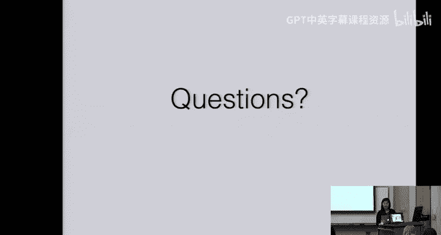

So I use brackets， this is what brackets looks like， oh wow。

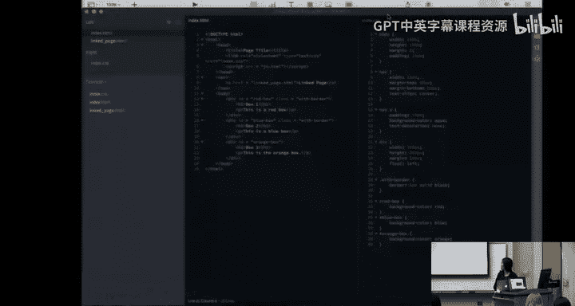

Let's see if I can change the theme。

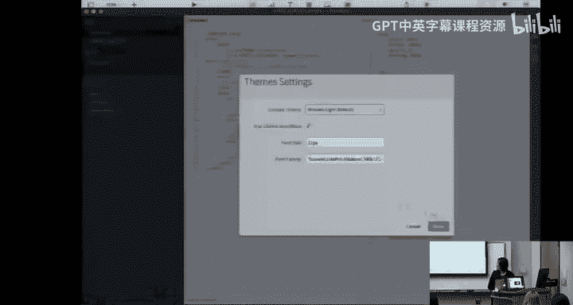

The reason why I like to use brackets is because if you have a static page。

 something that doesn't run on an app， like node JS or something。

 you can go ahead and click this for a live preview。So this is just a simple。

 really ugly page I threw up just to show you HTML， but I'll go through this with you。

And the great thing about preview is like， say I wanted to change the red one to what's another called yellow。

I can go ahead and come back and it changes automatically， whereas with other local host servers。

 you have to refresh or restart the server。 And that's why I like brackets。

 It also looks really nice。 It's easy to use。Anyways， I'll change this back to red。

So I created an empty file， maybe at 10 minutes， I'll try to go through as much as I can。In class。

 so for all HTMLML files， you always want to start with an index page。

 which is usually your home page。 So I'll create a file called indexex L H TM L。

 And remember from what I showed in the beginning， doc type H TM L is always the start。

And we want to give it a wrapper of HTML tags， the entire file will be within HTML。

And we want to start with the header tags。 So if for head， we'll say title is example。

And if we preview this now。You'll see that the title here on the tab is called example。

 this is not you here yet because we haven't written anything。But we'll do link。

And link is for the C S S。 So we'll say link type。Oops link H HR just means what we're the file that we're referencing。

 and I'll call it index CSS。 I haven't created this file yet。But I will now。

So I'll create a new file called index。css， which is where we'll write the CSS later。

And then since we're not doing JavaScript， I won't put in the JavaScript tag。

And where we have all the divs from the example I showed you all the boxes that'll all go in body。

So in body， a div is。This kind of hard explain you can basically wrap anything in a div。

 A div is basically kind of an arbitrary rectangular space that you can put any elements in。

 A div itself doesn't have any height or any width。 You have to give it the height and the width。

 So I'll show you if I just say， if I just create a div。And we go back to the refresh page。

 There'll be nothing there because technical div is just an element， but it has no height or width。

 So it doesn't technically exist on this page yet so。

Dve and we'll say this will be the red box that we saw earlier， so I'll give it a header。

 so H1 is the header headers go in H1 H2 H3 H4。 that doesn't necessarily mean that it sizes it for you like H1 is bigger than H2。

 but the purpose of tags really is to help screen readers and other things like that go through and see the hierarchy of your page。

So let let's just say H1 is this is the red box。And for the most part。

 all paragraph text should go in the P tagag。 And we'll just say this is the red box。

This has no styling it， so when we go back， we will only see the text。

 we won't see where the actual box is or how big this is。So if we go into this wait， sorry。

Let me just actually just create the other divs。Really fast to go through this little faster。

So this is the blue box。And this is the orange box。So they'll all show up here and in the CSS。

 you see how these are all divs。In CSS， we can go ahead and style all divs at once if we want。

 So we can say the height is like 300 pixels and the width。There's also，300 pixels。

And even though it'll look bigger here。Refresh， refresh。呃。Maybe it's already 300。

 but if we give it a border， you'll be able to see the separation between。嗯不。Actually， whole time。

One second。I always forget the exact。Wording of this。

I'm going to copy it over here in case I made mistake。

You always want this relation style sheet so that it knows what it's linking。And for some reason。

 I always forget that that's the syntax for it anyways。So now you're able to see our CSS in play。

 you see there's 300 by 300 pixel boxes with a border around them。

 and then something important to show you is how to create links between pages so we can there's a tag called naav which is navigation。

 so we can say there is a div。With a word like link to another page。Ill put that in P。

So it' should show up here， link to another page， it's in a div。

 but if we wrap this around the A tag， A is to link to other places。Actually。

 we don't even need the div here。Sorry。We wrap this in an A tag so AHRF will link it to another page that we will create。

 say it's like test。htm。诶。And we put the text inside the A tag like this。

 Can you guys see that or sha anything bigger。嗯。You'll see when we go back here that this is a link。

 it doesn't link to anything yet because I haven't created the test page。

 but if we create a test page called test。 HTMLtm， say this is the test page and we can make another link here that goes back。

Then if we click link to another page， we get to the test。 HTMLt page。

 which is just another HTML file just like our index page and if you click back to home。

 it takes you back to whatever you linked it to。嗯。Okay。And to show you some more styling。嗯。I'll put。

CS S on one side， H on the other。Okay， so this is our H T M L page。 And if we want to style classes。

 say these will have border， right， Class equals have border。And this div class equals have border。

And this class， you'll see we don't give it that class， sorry， this div， we won't give that class。

Then here， if I want to style only the two that have have borders， that I can say dot have。Border。

And want' to say only those can have the black border， so I'll put that here。And that will show here。

 so this orange box doesn't have a border。If I want to style。Each box specifically。

 I can say this ID D is equal to red。Id equals blue。Id is orange。

So if I want to give the red box only a red background， then I do pound hashtag， whatever red。

 and I say background color， all the CSS selectors and stuff you can find online W3 schools is really good。

 like I said before， there's also like Code Academy， other things。So background color。

 I'll just say red。 You can also give it RGB values or hex values。

 but it also has default values like red， orange， green， blue， yellow， purple。So read。

 so now if we go back and refresh， the red box will have a red background。

And say we don't want the text to be aligned to the left。 We can do text align。Center， as well。

And everything will go to the center。This is general。

 this is a general sort of way you would prototype something in HTML and CSS。

 obviously will likely look nicer than this and have more elements than this。 but in general。

 this is just how you do HTML and CSS。Have any questions？

A good website that I used a couple years ago was dashash by General Assembly。

 it's a free tutorial in HTML and CSS and even does some JavaScript。Thank you。well。thes。

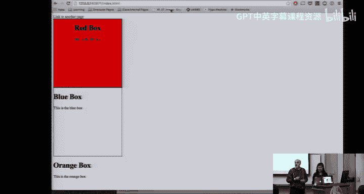

Fortunately， because of the holidays， I sent to write an email， we're not going to have office hours。

Wednesday， Thursday， our hour to Sunday， so Stephanie it's agreed to do one tomorrow morning。

 have a special time just to this week on Tuesday and then because the rest of the homeworks are due on Monday。

 we're going to move Stephanie's office hours to Wednesday it doesn't make any sense have on Monday and all this is on the staff page if anybody needs help and of course we'll be monitoring the piazza and our emails over the holidays if you have questions about how to do some of this stuff。

呃。And the instructions for this assignment are much simpler than the other ones it to basically just make the website。

 I mean the prototype， whatever your system is， and the only trick is to make sure when you're turning it in。

 that you turn in everything you need don't forget make sure if you have image if you do an HTMLL site。

 you know that the pictures are separate， you know some of these prototype systems will link external files or whatever to make sure everything's there。

 you recommend to take what you're turning in and put it on a different computer and make sure it works when you move it to a different computer just。

Because that's how the Ts are going up。Are going to run it in your classmate。Any questions。

Okay I hope everybody has a happy holiday and I'll see you next Monday。

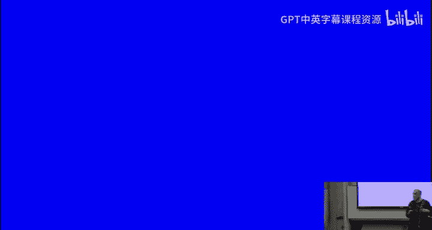