# CMU《面向技术高管的人机交互导论｜CMU 2015 Fall 08-763 Intro to HCI for Technology Executives》 - P9：lecture 9 - Wednesday, December 02, 2015.zh_en - GPT中英字幕课程资源 - BV1pXjnzxEmL

Ready。😊，Okay， I think we'll get started。So hopefully everybody got their classmates to systems to evaluate and you're starting to go through them。

诶。There are a few people who didn't turn in their assignments。

 hopefully they're going to drop the course because obviously it's pretty hard to。

Figure out who's going to grade theirs or who's theirs going to grade。 but I think we still have。

Almost 70 people。Register， which is。A little less than the number a lot more than the number of people here。

Hopefully everybody will show up for the final exam。

 so I'll be announcing the final exam stuff next week， which is the official last week of class。

 but remember since we're on the Tpper schedule we have a full week of class the last which is exam week so there's still。

Two more weeks。

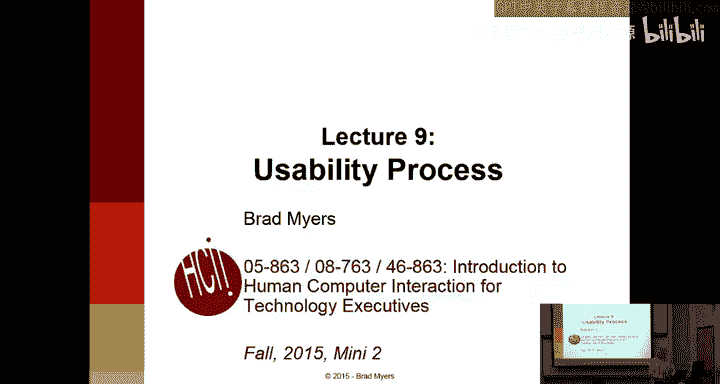

If we look at this schedule， which is here。嗯。So next week we'll just have class as usual。

 but we also have class the final week， which is during exam week。

 we have a really interesting guest lecture， that's been confirmed。

 Dave Bishop has come almost every year and people really like what he has to say and then。

A number of people have asked about other HCI methods that we haven't covered in the class or in the homeworks。

 and that's the topic of the last lecture， so that's pretty interesting as well。And then the final。诶。

Is I actually don't have the final rooms yet， but we're going to have it on Thursday， December 17th。

 and on December 21st， so you should arrange to stay in town for at least the first one。

Anybody can go to any of these， you don't have to be in Tpper to go to the Tpper time or main campus to go to the main campus time。

 so if you want extra time to study or whatever you can go to the TEpper one on the 21st。

 and if you want to take it early and go home， you can take it on Thursday。And up。

I'll add the rooms here， its closed book， every it's on paper， no programming。

 and just handwritten and stuff， and there'll be more details coming soon。

The final the current homework is obviously turned in next Monday。And there's， again。

 no extensions because we're going to give your homeworks to your classmates。

And then the final homework。

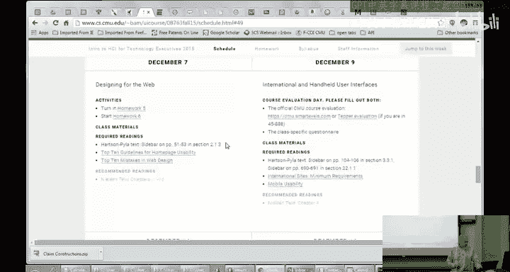

We'll be due the following Monday。嗯。And if you still have homeworks to turn in late。

 the last day to turn in late homeworks is going to be Wednesday of that week so we can grade everything and also so you can get feedback for your exam。

Okay。And， I think that was actually in。And this one。嗯。Do嘟嘟。Yeah。

 and the other thing is that there is a spreadsheet with everybody's name in it and what assignments you're supposed to get on Blackboard。

 it has everybody's email address in case you want to contact the people who you've got their systems and since it has email addresses I didn't want to put it on the public web。

 so that's why it's on Blackboard be sure not to post it you know in public。Okay。

 any questions about logistics and homeworks？

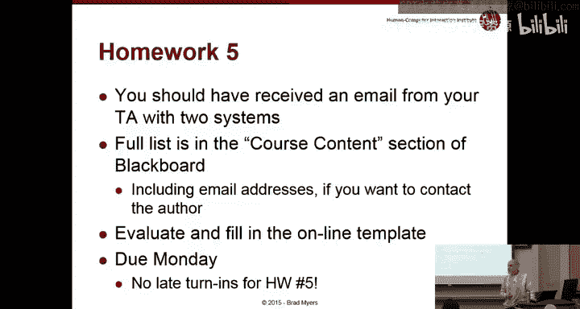

So today's topic is the usability process and this。Talks about how as a manager。

You can put usability into an overall project plan。

 what are the different steps that you would go through， how usability。

Connects with things like agile and some other software organization processes。Ideally。

 this lecture would probably be much earlier in the schedule because it does kind of give a lot of background information。

 but because of the requirement that I have lectures about what your assignments are on。

 I had to kind of postpone it。

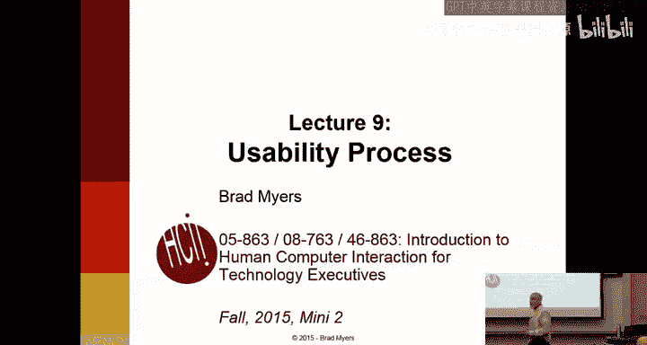

So what we're talking about usability in this course。

 and hopefully by now it's pretty obvious to you that usability isn't。

Something that you can just kind of ignore and fix up at the end。

 Nielsen says usability is not a quality that can be spread to cover a poor design like a thick layer of peanut butter。

It kind of。A corollary or a similar thing is the software engineering idea of quality that you can't arrange to have a high quality product by just doing testing at the end。

 if you don't have the right processes， if you don't do the right steps along the way。

 then there's no way to just add quality kind of in any dimension right at the end of the process。

And as a manager or as a team， you have to be committed to usability and give it appropriate resources along the way。

 if you just ignore it or if you don't resource it if you don't，Plan for it。

 then obviously it won't happen。The reason should be pretty obvious that it's not sufficient to just leave usability to the end is that at that point most of the software is already written。

 everything seems to be very hard to change at that point。

 whereas at the paper prototyping stage at the early design stages。

 you have much more flexibility about fixing things。

So Yaakov Nielsen coined this termusability engineering as a way to try and draw parallel to software engineering。

 which is pretty well understood my most engineers。

 most software developing companies as a more data drivenri process as a way of understanding what's going on。

Engineering， in general， is。Focused on having measurable。

Actionable data to drive the process to actually understand what's going on and be able to tell more objectively whether you're making progress or going backwards and so that's kind of the concept with usability engineering。

 it's not just an art， it's not just hiring the right people。

 although obviously if you hire the wrong people that's not going to help but even if you hire the right people。

 you still have to plan to give those people the right tools。

 the right time to do things and to manage the project in a way that lets them make progress。

Actually， the term usability engineering dates way back to IBM。

 and it's actually some international standards that talk about how you're supposed to develop software if you want to be compliant with these standards in the。

 especially for the。Europeans。So these are the steps that Nielsen recommends if you're trying to combine。

Use of LD engineering with your other software development。

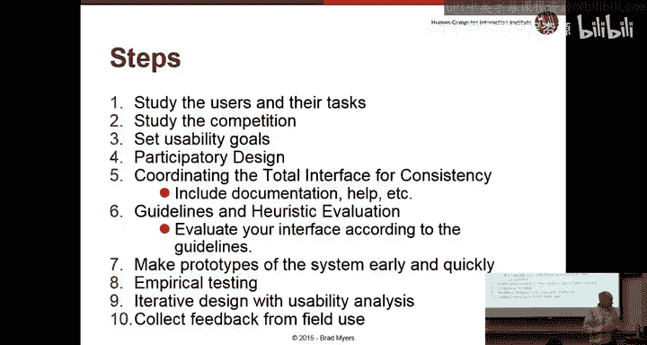

Activities， and we'll go through each of these in turn。

So the first one is generally to know your users。Contextual inquiries process that we talked about with lecture one。

 I mean homework one was kind of one way of doing that to you can also use surveys and interviews。

 focus groups， there's a lot of different ways that。

You can approach trying to understand your user community better。诶。

One of the key requirements is that you try and get kind of the whole team on board and not just。

The usability specialists， if you have those， to try and get this understanding of who you're trying to serve。

 what are their needs， to try and get that understanding distributed throughout your team。

And there are lots of reasons why this may be hard。First of all。

 I've often found that the marketing department is trying to protect the developers because sometimes if the customer knows who the developers are。

 then they'll just call them when they have a problem or they'll call them and recommend fixes or bugs that they found and then kind of go around the process and then your developers are spending all their time。

 helping current customers rather than doing what they're supposed to be doing。

Sometimes the sales department doesn't want。Customers to contact engineers because。

Then the customer gets to find out what's coming down the line。

 you know what the future products will be and so they'll stop buying the current one it's kind of a classic problem with marketing is that if you know that something better is coming next month。

 you're not going to buy this month's product unless it's a lot cheaper or something like that so。

There's often that issue and then obviously in most cases your users are pretty busy people。

 they may not want to spend the time to sit with you and let you understand their problems。

 although that one is typically less of a problem because everybody would love to have their opinion reflected in the next version of your products so that it'll work better for them so they will be happy。

So what kind of things are you looking for that it might influence your designs？Obviously。

 it's things like their experience level， if this is a product for work or for some particular domain。

 what is their level of expertise in that domain？Beyond just regular computer experience。

Education level age， what are they used to， is it mostly Macintosh's， is it mostly iPhones。

 you know what sort of other。Applications is your community mostly dealing with。

 are they very familiar with spreadsheets or word processors。

 you may want to incorporate some of these interaction techniques in your design based on what people are typically using。

You might want to know or think about how long people are willing to。

Get trained how much time they're willing to devote to your product so if you're making a high end camera。

 then clearly professionals are spending their you know lifetimes learning new mechanisms if you're building a new version of illllustrator。

 Adobe illllustrator for professional。Graphic artists。

 or another example is the Bloomberg terminal for professional。Data analysts。

They are invested in learning new features and if you add some useful features into your new version。

 which may even even though they might be hard to use。

 that community might be really invested in learning the new features and want to read the。

Change logs to understand how the new features work and they're willing to spend the time to learn them and so in that case。

 the learning and would be less of a factor as opposed to a new version of Expedia or a new version of some kiosk or maybe a camera for novices。

 a point and shoot camera or the camera on an iPhone。

Where people aren't going to be willing to spend too much time learning new features and you'd want to make sure that。

If you add something new that it's really apparent or it works automatically。

 so that it's a clear tradeoff that you have to think about。In the homeworks。

 we kind of asked you to think a little bit about your users。

 probably nobody went into this level of detail， I think probably all of you guys。

Focused on products for novices or for walk up and use kind of situations rather than products for specialists。

 but that's obviously a trade off also for the hardware。

Most laptops have 1280 by 1024 screens which I think is what the resolution of the projector is。

 it used to be not too long ago that 768 by 1024 was all that you could assume obviously on phones on an iPhone there's three or four different sizes for a number of pixels。

 it turns out on Android phones， there are actually thousands。

 literally thousands of different resolutions， kinds like every。

Different phone has slightly more pixels in one dimension or another。

 so you have to take that into account also what kind of physical buttons you're going to have。

 obviously on the iPhone， there's one physical button on Android。

 they keep changing their mind about how many physical buttons there are or fixed menus。

 things like that， but if you're building a kiosk or you're building a camera or you're building。

An application for the web， then obviously you have a lot more flexibility about what the hardware is。

 what physical buttons versus touchscreen buttons and so forth。

And then there's a social context of use， which is， are people usually using this on loan。

 are they usually using it in groups？So you know is it okay if your system beeps all the time if people are using this in a crowded room or in a classroom。

 beeping is really not a good idea if it's a work activity。

 if you're building you a kiosk for a mall or whatever it's probably fine if it beeps to tell people that things are happening or not happening or whatever。

 so you have to understand。What is the social context of use as well？

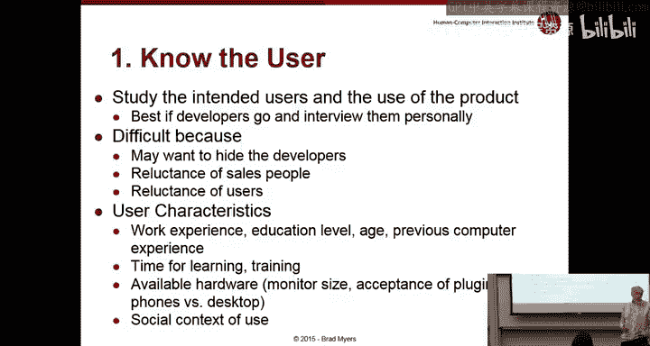

So the。One of the very first articles about this concept of learning。

 understanding your users already made the point that it's not sufficient just to identify your target groups or toere describe the stereotypic user。

 you really need to understand their individual requirements on a much more detailed level。

 understand what sort of things。Are the barriers to success for their current activities。

 And that's kind of the。Reason that we teach contextual inquiry is that it's one of the really successful ways of trying to get out some of these requirements。

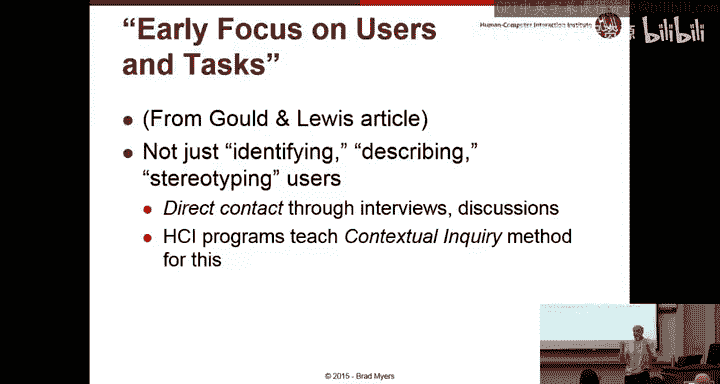

So there's a method called personas。 How many people have heard of personas。 Oh。

 So it's a well established way of。Representing the information you learn about your users。Okay。

 and so this is。popularized by Alan Cooper， who was one of the original designers at Microsoft actually。

 and he was one of the developers of Vi Basic， and he's for the last many years。

 he's had his own consulting company。Called Cooper design and the。

But the technique is much broader than that， and it's kind of used throughout the industry。

 and it's a great way of keeping track of who your target users are for your product。

And so a persona。Is。An archetype of a class of users， so it's a generalization。

 it's no one in particular， it kind of generalizes a class of users。

 but it's not represented as a generalization， it's represented as a particular person。

And so the idea is that you try and pick a section of your target audience and come up with this archetypical or prototypical person that's one of your。

That represents that group and typically they'd be created after you do the contextual inquiries or it might be done before if you have good information about your target communities then。

You can make your personas early and then learn about them in more detail using the contextual inquiry technique。

Or you can use your contextual inquiries in order to understand the differences between the different groups you're trying to target。

What are some of the parts of a persona， what you're trying to capture is a bunch of the things we just talked about。

 their background， their needs， their experience levels， what sort of computer。Comfort they have。诶。

What are their attitudes， what are their skills with respect to the product that you're trying to make and how they want to approach it？

And typically you would have maybe three or four personas for your product。

 depending on how many different target audiences you're planning on。

 you might have as few as one if kind of you have a very homogeneous target audience。

 or you might have a variety of them。And what you use them for is that youll have so this is an example this guy is Bob and so you might have Bob and Sue and Mary or whatever you give them actual names that you've made up and you take pictures from clip art and one of the really great uses for this is in design meetings when you're testing people you'll say well Bob would want it to do this this way or we kind of know that Mary has this requirements and this product doesn't meet it。

 so it's a great way of keeping your design community。

 your designers and your implementers and your testers all on the same page about。

Who you're trying to address this product at and what are their needs and。And properties。

 so here's an example。 Bob is 52 years old and works as a mechanic。

He's been doing it for 12 years and so he's a domain expert， he knows all about cars。

 but now we're introducing this computer product。诶。

So and there's a few personal details in here to try and make him more real okay， and again。

 these are not。Based on a single person， but， you know， this group of people。

 So hopefully this isn't any real person that you've talked to， but just。Conglomerate。

He's seen many changes over the years in the company and has tried best to move them。

 but he's found it daunting that there's a new computer so he's a mechanic because he likes to work with his hands and he likes to do mechanical stuff。

 but now he has to use a computer so he's not so happy about that。

He's told that he's going to have to use this computer more when the new version comes out and he's worried that he won't be able to find out what's going on。

诶。And it can be embarrassing when， even though he's a senior person。

 he has to ask junior people how to actually work this computer because he's supposed to be the person that people come to。

诶。Yeah， and so he doesn't want to be using manuals in front of the customers either because obviously he's supposed to be the expert and if he has to look things up。

 he doesn't think that looks good。So yeah， so Bob wonders if he'll be able to cope with a new computer system。

 he doesn't mind asking his grandchildren for help when he wants to send an email to his brother overseas。

 but asking the guys at work for help is another story right and so you get a really good sense of who this guy is and what his requirements are if you're building a software system for mechanics and you keep Bob in mind then that will likely help you make sure that it's easy to use and that you can。

嗯。You also use this as a way of identifying who some of your test users need to be。

 so you'll want to get some people like Bob as part of your user study。

 domain experts who are not necessarily computer experts。

 and then it'll also help you figure out how to write your manuals and your documentation because it has to use the kind of terms that he's used to。

So you can imagine also if you are building software for mechanics。

 you might also want a 20 year old persona for somebody who's really web savvy and knows a lot more about computers。

 but maybe less about cars and especially less about old cars or whatever。So。That's。That's personas。

 it's a great technique to have in mind that you can use。And design。Another。

Kind of analysis is called task analysis。 And we kind of skimmed over this a little bit with the。

Contexual inquiries， but the general idea is it's important to understand what tasks your application is going to have to support。

And almost any application has to support lots of different tasks。

And we asked you over and over again for your homeworks to write down the tasks that you were going to have users do。

 but presumably those were just the ones you were going to test and they probably are a lot more that your application actually has to support。

So if you think of。Say Amazon， you know， something simple， an Amazon shopping app。

 What are some of the tasks that people have to do with Amazon？

SearchSo you want to try and find a particular product given what？What would you search。

 what are some different aspects of that task？Right so you might have the actual name so if you're searching for a book。

 chances are you know the actual title of the book or you know the actual author and so you're typing in an exact phrase and it should be very accurate to give you that actual product on the other hand another task might be trying to understand what's available in a category it's kind of a different task right so I want to know you know how can I learn about electronics or how can I learn about cooking so if you just type cooking into Amazon you're going get a whole long list and that might give you a better sense of what kind of things are available。

Okay， so that's one task， what's another task？RightSo you're actually buying stuff right so sometimes people just go to Amazon to understand what's available to get the properties of something。

 but a lot of times you actually want to buy it and get it delivered to you so there's a whole bunch of subtasks around the task of buying things so you have to give it your credit card information you have to tell it where shipping so you have tasks and subtasks and that's why it's called a hierarchical task analysis because for every task there are lots of different pieces。

Okay， so that's what three so far。 What are some other tasks that Amazon。Might support。嗯。

Review right you might want to write a review， you also might want to read other people's reviews right and so you have a product you really hate or you really like or you're kind of ambivalent about and so you want to tell everybody else your thoughts and sometimes that's just altruistic to try and be helpful to everybody else。

 sometimes you may have other motives for writing。A review， and obviously when you're。

Trying to understand a product then you want to read other people's reviews， that's good。

Return a product， okay， so totally different set of pages are involved if you're trying to return a product。

For Amazon， so it has to support that as well。Chad with an agent。Yeah。

 so you might need some detailed help because you can't figure out how to use it or you can't figure out what's going on with your order。

 and so you might want to figure out how to get customer service either by chatting with a person or emailing or whatever。

And you said。Yeah， so you've forgotten what you ordered。

 maybe it's tax time and you have to do an itemized list of what you ordered。

 or you want to order something again that you ordered before， so you might need to look at the list。

Any。Final thoughts。You have tracking packages， okay。

 so you get the idea there's a really long list of tasks that even something that sounds pretty simple。

 like just buying just an online bookstore， there's a really long list of tasks it has to support。

And it really is useful to write all those down right so in the contextual inquiry process。

Maybe you had to identify some of these tasks in advance。So that you could look for them。

 maybe you some of the tasks are revealed by the contextual inquiry that you might not have thought of。

 so you can actually see people try and doing these tasks on their own。

Maybe those aren't tasks that you had envision for your product。

But now it's really popular and so you'd want to support it。Just for example。

 cameras are often used for all sorts of things nowadays that are not actually about taking pictures。

 right， finding your parking place， identifying how much food is on your plate。

 there are all these apps that actually use cameras for these fairly unusual activities and maybe understanding those can help you improve your camera app。

 you know doing a QR codes， all of these things use the camera but not really about taking pictures。

 and so to the extent that you can understand all the whole list of tasks。

Then that can be pretty useful and the problem。Again。

 it's kind of like we're talking is at what level level of detail do you talk about these tasks and if you do a task and then try to。

Identify the subtasks。 Often， you get these enormous graphs of all these different things that your product should support。

 And the question is， how far down do you want to go， right。

 So one of the subtasks of purchasing a thing is entering the。

The credit card and then a subtask of that is entering the CCV number and the subpart of that is verifying that it's three digits and you can imagine that this goes down a really long way。

 but one way to cut it off is to stop your user center your task analysis at the user level。

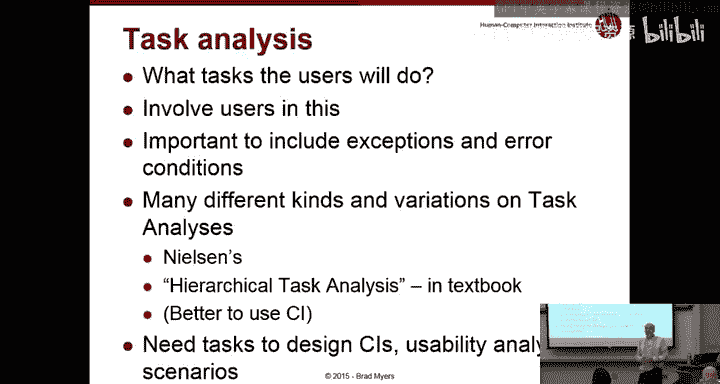

Ideally， the user centered task analysis only tells you what needs to be done and nothing about how to do it。

So you'll say the credit card has to be entered， including。The expiry date and the CCV number。

 But you don't say anything about the fields or things like that。

 So that makes it very different than system features。 right， so a particular way of。

A particular piece of information that the user has to enter or a piece of information the user has to understand can be presented in a whole bunch of different ways。

 and the goal of a task analysis is not to constrain the user interface。

If you remember the example from before about the tickets， the ticket kiosk。

 where we had all sorts of different designs， all of those designs were support the basic idea of buying。

 figuring out which movie to go see and what time and buying tickets for it。

So you can give the task requirements at a fairly。Concise way。

 and then leave it open how it's implemented。嗯。An interesting example about task analysis is that I was consulting for a company that made universal power systems。

 but not like the kind you have under your desk， more like the kind for a whole company and so actually CMU has a bunch the big green box that's out in the driveway is actually a power generator in case we have a major power failure because like some of these lights are actually emergency lights that only come on if the power fails and the way that works is that we have generators all over campus to turn on the lights and they are really noisy they go on every on then。

So this company makes those kinds of products， but mainly ones that go in the basements of big buildings。

 not so much the ones outside， and they had recently upgraded to a new graphical interface。

 a new GuUI from their old you know old fashioned knobs and dials interface。

 and the customers were just hating it。Every customer was complaining until they brought me in to say。

 look， we spent all this money。 We did all this great design。

 We have these beautiful graphical interfaces and everybody hates it。 Come tell us what we did wrong。

 And it turned out what they had done is design their。😊，Screens by feature。

So one of the features of this unit was telling you how good the batteries were and another feature was telling you how the quality of the power that was coming from the power company and another feature was telling you about how long it was going to be until the batteries died for doing maintenance and things like that and it turned out when we looked at the functions the people had to do pretty much every function required going to10 different pages of their user interface because the functions。

 so the screens were designed by feature but functions typically crossed all the features。

 so when they were doing routine maintenance。It required checking every system to see what its status was。

 and so they'd have to go through all the screens and look at the status for every subsystem and when they had an actual power failure then they had to switch into using the battery modes and turning on the generators and those were all on different screens and and so forth so by designing it based on features rather than tasks they made every single operation way less efficient and the users were all complaining took too many clicks to do anything。

So we together redesigned it based on functions based on the tasks that were required and so with some redundancy because you could see the status of the batteries on multiple screens but every task now was a single screen and they really had a very good sense of what the tasks were because theyd done this study and you know people were told to do routine maintenance every month and to do some kind of other maintenance every year and to do this when they have to turn on the generators and do that when they're turning them off and so forth and so they had all this in the manuals。

 the tech writers knew the steps， the engineers knew the steps， but the designer of the screens。

 they ignored that and just done it differently so。By understanding the tasks。

 you can design your screens to support the tasks that people actually have to do。

 makes everybody happier。So the key pieces of a task analysis are understanding the goals。

 what people are trying to accomplish， and the information needs that helps them accomplish that so what does a user need to know in order to do this task right so when you're looking for the battery status while they have to know the battery status？

When you're looking for a camera taking a picture， you might want to know what it's going to look like。

 it's pretty obvious， but you also might want to know what the F stop is or what the camera speed is going to be。

 especially if you're a professional， so that will tell you whether it's going to be blurry or not if you have to hold it really still。

So what does the user need to know in order to do this task most efficiently。

 and then the flip side to that is what does the user need to enter？

What do you actually need from the user， what do they have to click on or what do they have to enter in order to achieve this particular task？

And so trying to understand these two pieces of information for every task will let you have a really good sense of what your screen should have on them if you can present。

Everything， all of the information they need to know and let them enter all the information they need to provide on the same screen。

 then that task will be really efficient， and to the extent they have to go to lots of different places or they have to search for it。

 then that task is going to be a lot more difficult。

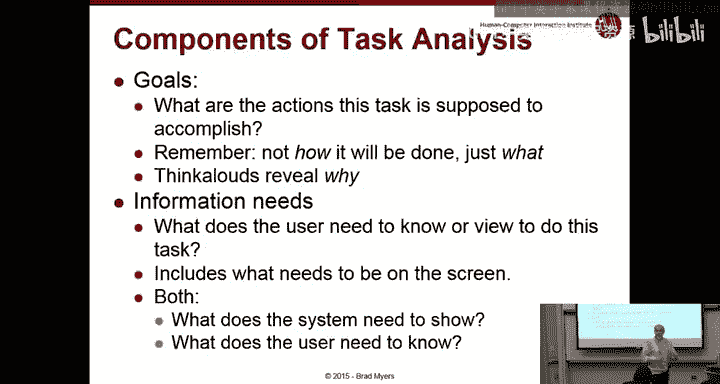

How do you represent tasks Well， one way is just kind of in a hierarchy and just kind of describing it。

 another way is to write what are called scenarios。

 and we kind of talked about storyboards before you kind of writing scenarios in your task scripts that you provided for the homeworks but there's kind of more formalized ways of presenting scenarios where you kind of describe these tasks as stories and。

Software engineering has something called use cases， which are quite close to this。诶。

It's basically a specific example of how a user might use your system。

 and you can tie these into personas if you want if that's helpful。And typically。

 a scenario will go down and use a bunch of different aspects of your user interface。

 it should be at a fairly high level， and again， you can use these scenarios to internally。

Discuss and evaluate your particular designs。 know So how many button clicks does it take to achieve this scenario。

How many screens are required？For this scenario versus that scenario。嗯。

It's often really important to make sure your scenarios aren't just the optimal ways of doing things。

 so the typical way of doing things may involve a lot of mistakes may involve doing things a couple of times。

 and so your scenarios should take that into account so what are some of the typical error cases or mistakes that people make which you can tell from your logs from the previous version or whatever from your CIs to know how you're expecting people to recover from errors to understand how people will。

Actually succeeded tasks after they've failed a few times。

Another kind of analysis is functional analysis which almost all companies are really good at。

 this is basically a list of features and so marketing departments love to give list of features and customers love to give you list of feature requests for the next version and so most companies really have no problem making up their functional requirements if you have a contract。

To produce some software with somebody else， probably the contract has a functional list。

 a list of features， a functional requirements。嗯。There's a few tricks with this。 One is to again。

 leave it in terms or describe it in terms of the user tasks， user activities。

 rather than describing it in terms of buttons or in terms of the。Particular user interface。

So rather than saying this button should have this behavior。

 you would say we need to be enabling the users to do this task。And you ideally， don't。

Ground the functional analysis in the current user interface because that's obviously constrained you from improving it if you can think of a better way of doing things。

One of the problems with function analysis and with kind of。Marketing in general is the。K of general。

 what's called software bloat that every new version has to have more features and you're almost never allowed to take away features that were there before。

And you've seen this pretty much in every product we've ever used， iPhones， you know。

 they used to have tap。On things and now you have tap and long tap and press and really press hard。

 whatever that's called 3D tap， you've got swiping left and right。

 which used to just be up and down for scrolling now you have left and right that do other things。

There are all sorts of。New behaviors that you have to learn。

And so if you're a novice coming up to an iPhone now versus when it was introduced。

 whatever it was 10 years ago， there's a whole different experience in terms of how you learn things。

So the problem is。As a design group as a product manager。

 how do you know which ones these functional requirements are the most important。

 how do you know which ones are real requirements versus just something that somebody thought up because maybe it'll be easier to sell and so that's kind of where all these HCI techniques come in that we've been talking about is to try and get a better handle on which of these requirements are the most important which ones are going to be easier to use。

So all of that was kind of in the general area of knowing the user and their tasks and their requirements。

Obviously that's kind of a key focus， but there are lots of other things you might want to know。

As well， including this one， the competitive analysis。

 the CIs we did were all on presumably competitors。If you are thinking of creating your own product。

 probably there are other people in the world who have something。

similar or competitive to what you're trying to do and to try and understand kind of where the competition is in terms of usability。

 in terms of functions and features， and terms of how they talk about it。

 vocabulary and that kind of things。嗯。So goal setting we talked a little bit about before。

 it's really important for products to understand， especially when you're talking about usability engineering to have actual numbers。

 what is your goals for this version of the product？And as a manager。

 this is one of the really hardest things for you to try to come to grips with。

You always could spend more time adding features， you could always spend more time debugging to try and make the features work better。

 just from a technical point of view， you could always spend more time improving the usability。

so the question is， how do you trade off？Understanding which of these are the most important for this version of the product。

 and one way to do that is to try to have much more numerical or objective criteria that you can use。

For usability in the same way that you could have the number of bugs or the number of feature requests outstanding or in your bug tracking system。

So some of the kind of goals that you might imagine。啊。

People expressing in terms of saying the new version has to be user friendly or has to be easy to use。

 how are you going to quantify that？How are you going to know whether you're achieving making something user friendly？

So you might say， well， the manager likes it， so therefore that's good enough。

 or we're going to do it the same way we've always done it。

Which makes it consistent with the old ways， might be happy for seven people。

 but make other people unhappy。You might try and copy the way somebody else does things。

 so many designs are， okay， let's just copy what the iPhone's doing。

Or let's make it work the same way as Microsoft works。And you know， probably the worst。

Criiteteria for usability is to just pick the one that's easiest to implement。

 because somehow it always turns out that。The easiest to implement is generally the hardest to use。

But we've talked about much better goals in previous lectures， anybody remember？

Some of the measurable。嗯。Properties that you could talk about with respect to usability。A rate， yeah。

 good。Learning how long it takes to learn， remember we're looking for numbers。

So you can quantify how long it takes， how much time it takes to learn to do a particular operation or task。

What else。1 k1。So we have error rate and learnability。

 what's another key measurement that you can take for systems？Oops。Say louder。Come on， this is easy。

So we're looking for something that you can measure。

It has to do with usability besides error rate and learning curve。Right， so efficiency。

Efficiency for experts。A numberumb of tasks accomplished in a particular period of time or the time it takes to accomplish tasks for experts。

So those are the key ones， there are lots of more specific ways of talking about it。

 so can be learned in less than two minutes， that would be a goal。

 or the user will perform two errorfr purchases per session。

 error rate will be lower than two per10 operations， so these are all some examples。

 of ways to quantify to have quantifiable goals， targets that you could tell whether you've achieved them or not。

啊。So you can make them with respect to your competitors， the old version。

And another one is satisfaction， which is measurable with some kind of standardized survey。

 if you give the same survey before and after or with the old version and new version。

 you can tell if people are happier。So the goal is to have explicit specific。

 measurable metrics that you can tell when you achieved them。嗯。So， here's。啊。

A list that we just talked about， there are other measures that come from web analytics。

 so much more specific things like clickthrough rates， success rates， error rates， abandonment rates。

 they call it。And so you can get lots of very specific numbers from your web analytics。Increasingly。

 applications can be。Log。So that you can get the same kind of information from regular applications that you get from web applications so you can。

诶。Log。Even if you have a game， you can log all this stuff， increasingly games are online。

Or even like。You know， iPhone games that are free， and the reason they're free is because you give them the game permission to log stuff and some of that logging is obviously for advertising。

 but you can also use it for improving the user interface for improving your feature set。

And then you can do subjective satisfaction with some sort of standard or questionnaire like we talked about before。

And。Just like in any other kind of management， it's not possible to make everything better at the same time right there's just not enough manpower in the world to actually optimize every possible parameter at the same time So you know you have to as a manager be trying to understand the specific goals for this version of the product know what are your customers complaining about what do you want to be known for you know is it important for you to be known for the easiest to use product out there or do you just want to be known for the most featureful or the one that has the best prices or the one that has this particular mechanism that you identify the people would like to have so。

All of these won't necessarily be the key requirement for any particular release。

 or you may have a baseline that says， you know currently we're at three errors per session or 1。

3 errors per operation or whatever， and we just want to make sure we don't make that any worse while we have these new features so you can and you know it's very common for a release not to add any new features。

 but just to make the old ones better。These kind of。Options。

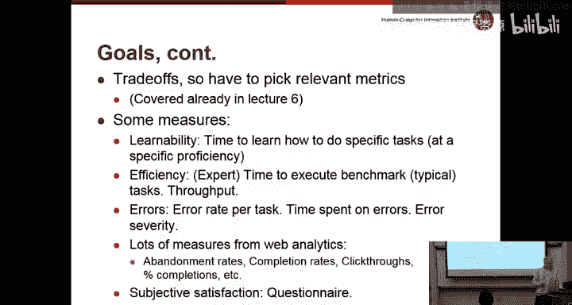

Another kind of analysis you can do is called impact analysis or financial impact analysis。

 also called Return on  investment RI， and the question is。

 if we spend some money doing this user interface stuff，What will be our return on that。

 how much will that save？And。There are ways of coming up with actual numbers for that to the extent that you can make something。

Be done quicker with less time than you can figure out the average。

Time cost for your users and multiply out how many users you were going to have。

And to the extent that this is an intranet product， a product you used internally to your company。

Well， then every extra minute people waste doing a task is time they could have been spending on something productive。

 and so it's really easy to come up with these kind of numbers。

There's a great example that I was consulting with this company。And。

They were really focused on reducing the parts cost of their product。

 and so they were saying you know we're going to have this really cheap set of hardware。

It turned out that they were actually going， because they were using the cheap hardware。

 they were going to have to use way more engineering time to actually program it to make it work well。

What they hadn't actually calculated out was that they only had like a few thousand users who were going to pay this smaller amount。

 and so the actual cost per unit times the 2000 units they were playing to sell turned out to be way。

Out of proportion with the amount they were going to spend on engineering and because the company was poorly organized。

 such that the par cost was charged to one organization and the engineering cost was charged to a different organization。

 they had no motivation to actually make the overall product costs lower。

 and so they were wasting all this engineering effort trying to deal with this ridiculous part that they decided to use。

So taking a more systems view， taking a more global view of understanding of all the people who are going to be involved。

 what is their cost per minute， how many minutes does this particular operation or user interface cost。

 what is the cost of errors？So if they make errors and the errors persist in your database。

 what is the cost of that if they make errors and then have to call up your tech support line。

 it's well known that that's really expensive so you can actually come up with numbers for how much。

You could save how much the current version is costing。

And you can use those kind of numbers to motivate why it's more effective to spend more money on usability。

 and there are actually whole books on this topic if you want lots of previous case studies。

So the next step is participatory design and we've talked about that a little bit。

 this is the idea that you get your user groups involved in doing the design work itself。

And so we've emphasized over and over again that their users are not necessarily good designers。

And so if you give them a blank piece of paper， typically they won't do that great of a job designing an interface for you but on the other hand users are usually pretty good at reacting to interfaces you put in front of them and hopefully you found this with your paper prototypes that if you say here's my idea for what's going to help you what do you think of it how would you make this better。

 then how well does this map to the tasks you really want to do。

 and usually people are really good at responding to those kinds of questions。

 they can use your prototype and try their own tasks and see if it seems like it's effective or not or what you might do to make their tasks more effective。

And you can do this throughout the whole process， so we did a conveual inquiry， you can start there。

 but you can also do it with paper prototypes as we've done。

The click through prototypes that you're evaluating now。

 you typically would also evaluate with users， and I used to have a homework that required you to evaluate the。

The clickthrough prototypes with people， but everyone complained that was too redundant with what they had already done。

 so we got rid of that so you don't have to do that anymore but in real life you would take your clickthrough prototypes and put those in front of users you're going to have early versions of your software。

 the actual system and alpha。Version of your software， you can put that in front of users。

 so you should be doing this iterative testing the whole way through。

Consistency is one of the heuristics that we're talking about。

 and some people argue it's the most important heuristic that if you get really good consistency。

 then most of the other properties actually fall out of that automatically。

And the reason it rises to the level here is because it does require some work that most of the other aspects of design an individual can do。

 so an individual can pick good colors， but in order to make sure the colors are consistent across your product。

 you actually have to plan for that， you actually have to have a style guide or CSS file or something that will make sure that everybody in the team in the design team is on the same page about how to do things。

嗯。I actually consulted with a product that was really bizarre where it was a really big product and they had given each function to a different implementation group。

And they had the most bizarre differences in the way things work。

 some things you selected first and then gave an operation。

 some things you picked the operation and then selected the thing。

 sometimes you did a bounding box and sometimes you click directly on things and there was absolutely no consistency across each function。

 I mean it was completely。Unusable because nobody could figure out how to do any particular operation because they all work differently。

 and this came just from not doing any of this kind of stuff just saying， okay groups。

 do your best job at this function and that function and seller function。And it was really a。

Bizarre oversight that they hadn't even considered this issue of。

know all these groups are just going to make designs that are completely inconsistent。

So it does require some thought in advance if you have a big design in order to achieve this。

Obviously。You're going to want to do this iterative process and to evaluate it using the guidelines。

Hopefully it's apparent as a result of going to this class so far that。As you get more experienced。

 you get to do a better job， hopefully。On leaving this class。

 every time you use a commercial product， you'll be annoyed at how awful the user interface is。

 and you'll realize that。It's not your fault that you can't use it。

 it's some designer who was lazy and didn't spend the money or effort in order to make the user interface better and as you get more experienced。

 you can not only recognize problems but recognize kind of obvious solutions to them。

 better labeling clearer tasks organizations more user-cented focus on how to do each individual operation and the whole tasks and so forth。

 so getting more experienced people involved in the design is obviously going to be more effective。

Using prototypes like we've been doing in this class is really crucial to get high quality interfaces。

And obviously， we kind of stop at the low fidelity prototype in this class。

 but in real life you go to higher and higher levels of fidelity。

So we did just a little bit of empirical testing， I guess that was homework3。

 and in real life you'd have to do a lot more of that。

 so companies are pretty used to spending the efforts for having testing and many companies there was。

A story that the second biggest piece of software at Microsoft。Who can guess what that is？

Given the context such should easy。So the first biggest piece of software at Microsoft is Windows。

What's the second biggest piece of software？No。Not office。

It's actually the testing harness for Windows。So they've written enormous amounts of software they have in some reports。

 as many testers as developers。So the actual amount of effort and money going into testing is enormous。

But that's just testing for quality and bugs and you know running correctly。

 you also need to do the same kind of empirical testing on the usability。

 remember if it doesn't work for people， then it doesn't work at all。

So you need to actually have this ability to put people in front of the product at every stage and understand what the problems are。

It doesn't really do any good to do testing and then not fix things right and so as a manager you have to figure out a way of building in time to fix the things that are being revealed by your user testing。

AndThat's why you want to start really early because it's really cheap to fix problems at the wireframe stage or at the specification phase。

 and it tends to be really expensive to fix things after you've already have an alpha version of your product。

And。When you find a problem， if you try and fix it。

 there's some risk that you'll actually make things worse or you'll make that better and something else worse。

 because maybe you're going to introduce an inconsistency and so。

It's really important to try and keep track of this process。

understandstand that you have to keep testing over and over again。

I've often seen design meetings where you make some important decision in one meeting and then a month later。

 you're having another meeting and you're thinking about going back on that original decision and so you argue it all over again。

And typically what happens is there's some turnover in the group or there's some new criteria that you hadn't realized originally。

 and now everyone doesn't remember why they made a decision that way and theyre thinking about going back on it。

 so the fix for that is to have what's called the design rationale to have reasons why all the design decisions were made。

And the problem is that in any user interface， there are hundreds of design decisions。

Down from what's the label of every button， what's the location。

 what's the color all the way up to kind of the overall architecture。And so the。

The trick is to come up with design rationales for your important decisions。

 for decisions that actually were hard to decide about。

 and then to keep those design rationale in a good place so that you can find them when you need them。

And this often saves a lot of time overall because later you don't have to redo these discussions because you can just look up the design decisions。

 remember why you did them， and then you don't have to do them again。诶。

Another way to think about it is whenever you're in a design meeting and you're arguing about what to do。

About some design decision or which way the design should go or which feature you need to add or remove。

Then instead of arguing about that， think about what piece of information is missing that would just give you the answer。

Usually it turns out to be some piece of user information if only we knew whether the users really did this or really did that or some people will be arguing users will want to do this or users will think it's that or users will want it to connect better with this other thing over here and almost all of these decisions could be。

Decided。Using objective measurements。If you just had the ability to go and ask users or do a little test or do a survey or something。

 so rather than spending， you know， hours in a design meetings trying to argue about。

Some design decisions， if you just take it up a level and think about how could we get the data to make this objectively。

 make this decision objectively， often that will alleviate the need to do that at all。

So this is kind of a classical spiral for iterative design。

 was actually drawn first by Larry Bean in 1988， so it's already really old and it's the idea that。

You have analysis and then design and implementation and you evaluate and then it kind of starts here and you evaluate and then that's going to give you some issues。

 problems to fix or new features that you decided you need and so you'll have to go around again and have another round of analysis and design and the idea is the further out from the center。

 the more finished the product is。and time。Is along the line。

And further out means closer to delivery。To product liberty。

The idea is in terms of usability engineering is that you have specific values that we talked about for this evaluate stage so you know when you can stop evaluating one part of the interface and move on。

In the textbook。They talk about having parallel tracks。Where they have a user interface team。

Doing design and the implementation team。Actually implementing things。

Talking about how to iterate information around all these teams。

 and so this is one way of organizing your software development process。That will help you。

I understand where you which group is supposed to be doing which part of the。Process。So finally。

You're going to release your product。 And it's， like I mentioned， really useful to。

Have real data about how it's being used in the field， obviously with web analytics。

 some of the kinds of information are really easy to get。

But there are lots of other places to get information from your tech support people to the extent that you're allowing people to。

Email in or the forums that you might have on your website for people to discuss things。

 obviously are really good。Places to understand what people are having difficulty with。

 and to the extent that you can。Eliminate these problems。

 then people will be happier and there'll be less need for support。嗯。And。

Sometimes you can do that right away， sometimes you have to wait for the next version。Another。

Issue is how to combine this process with agile， maybe people have heard of agile。

Pretty much everybody。 So it's a very popular way of organizing。

Software development projects these days。 And the idea is that instead of。The waterfall model。

 which is a really old fashioned idea dating back to the beginning of computers where。

You have an analysis phase， and then when you're finished the analysis phase， you do a design phase。

 and when you're finished with design， then you do implementation。

 and when you're finished with that， then you do testing and then you deliver。And so this is kind of。

The way the government and the Defense Department wants to run a lot of projects in some governments where they have a very detailed specification that comes out of the analysis phase and they give that to some company which then implements the specification。

And then the company tests the specification and then they deliver the product which theoretically matches the specification and then they get paid and the problem with that of course。

 is as we've seen， the specification is always wrong time keeps moving forward while this process is going on and technology evolves。

 so the original goals that you had maybe a year ago aren't as relevant anymore， the。

You learn more about your users and there's no place in here for testing or whatever。

 And so the waterfall model is pretty much。Hopeless for most kinds of software development projects。

 although it's still not uncommon for it to be used in military and government contracts。

The iter design that we talked about has tighter loops， so they're smaller pieces。

 but we still are kind of going through these phases。

And we've talked about that in terms of you low fidelity prototypes， high fidelity prototypes。

 eventually youll get to actual implementations and then you'll eventually deliver things so in some sense it design has some of these steps。

But it has them in some sense quicker。Whereas the agile process says they're really very tiny。

 And also Ive。Drawn them here， or this figure has drawn them。Sideways。

And trying to be clear that all of these are kind of going on in parallel。

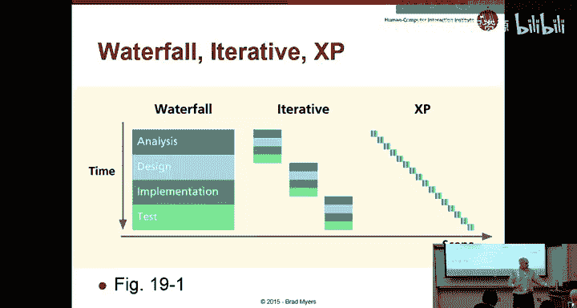

And so the idea of agile or extreme programming is that you have these very short。

 what are often called sprints。Where you try and do a little piece of the system in its entirety and then finish it and deliver it and then go on to another piece。

So rather than having a specification of the whole system。Or all the pieces。

 you just take the little pieces and finish each one in a fixed amount of time。And then deliver it。

So the problem is， of course， that。That sounds like a recipe for complete chaos in terms of consistency。

 to the extent that you design each piece independently， where do you get consistency。

 how do you get usability testing involved and things like that。

 so agile was developed as a concept by software engineers who didn't want to have to implement specifications who didn't want to spend a lot of time documenting。

 but rather would have want to spend a their time being productive in coding and testing。

And so the idea is that you have these quick。诶。Cycleles where you get to code things up and test them fairly quickly。

So the key aspects of it are tight integration of the team and some people have argued that the key reason agile works so well is because the entire team is working together on these little things and everybody has a good understanding of the little piece that you're working for working on and it really comes down to the communication that because everybody's working tightly together。

 they are less bugs that come up in the cracks that people tend to be co-located so that you can communicate really well and。

It。It's a very small amount of time when you have to learn something， you all learn it together。

 and then you can deliver it。嗯。So sometimes it's called Scrum。

 which is this method where you have these little sprints。NowHere's another way。

 pretty much the same， my dear， where instead of the traditional software development。

 you have many sprints。

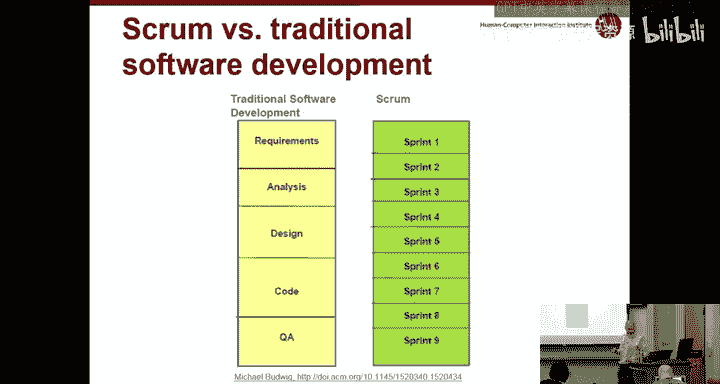

One aspect of this sometimes is called radical colocation。

 where instead of having everybody in cubicles overspread across the world。For scrum or agile。

 you put each little group together in the same space。

 so you know they're all sitting next to each other and they have this wall that they share where they can put up artifacts like designs or notes about user studies or CI diagrams。

 you can see some affinity diagrams here and some software architectures。

 some drawings about the user interface and so by having everybody together you foster communication。

 make sure that there's much less misunderstandings about how things work。

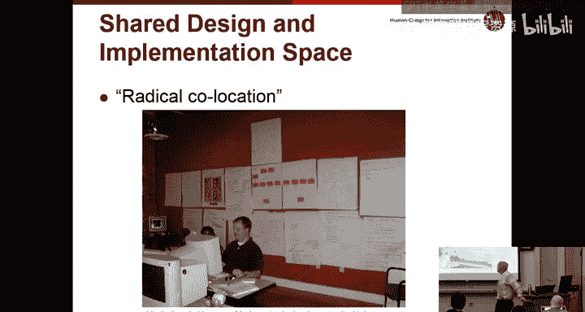

，呃。Another thing that software engineers tend to like about agile is there's much less focus on documentation。

 but one of the downsides of that is there's also no real mechanism for capturing design rationales。

 and so that's something that the kind of management has to be pushing on to to the extent that they're important。

 design decisions being made， somebody needs to capture them somewhere that can be。

Available when you have to revisit parts of the design or parts of the software later。

And so how do you fit usability into this， and it turns out that that's a big discussion point pretty much。

Any product for a phone or for a web has to have really good， really high usability。

And so increasingly or clearly almost all companies recognize this as a key requirement。

 and there's been a lot of talk about how to succeed at getting usability connected in with your development。

So in this one case， PayPal actually told the world how they did it， which is always helpful。

 and what they said is that they have a separate UX team which stays at least one sprint ahead of the implementing team and so they also were organized around these little features and so the UX team tries to design and do the prototyping and user testing at least a couple weeks ahead of when that particular feature is going to be implemented。

And so this requires a lot of planning in advance， so you have a detailed schedule of what's coming up and also in their designed every now and then they would stop and make sure that they were coordinating for consistency across the product。

And so what they called vision sprints were was that they stopped implementing and did a more comprehensive test。

 comprehensive。Software architecture and information architecture。

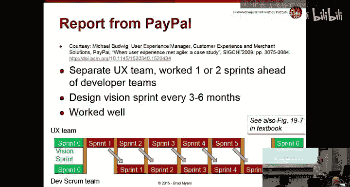

So another- let's see what'。Another aspect of the design is where to put your usability people。

So some usability people are really good at， say， color choice and graphic design， building icons。

And those kind of people you tend not to need all the time。

So you certainly need those people when you're in that phase that you're doing final design。

But it might be a waste of time for there to be somebody with that specialty on every team。

 so you might think that would be a really useful thing to have as a central。

Resource for a whole company， so if you work for a big company like Google or Microsoft or even Bloomberg or some company with lots of different products。

It sometimes makes sense to have the UX team or some of the specialists kind of at a high level and then loan them to different projects when they need different kinds of help so if you need design at a low level or you're ready to do some user testing。

 you bring in the user interface team and then they provide you with the appropriate input and then they go off and work on a different project。

The advantage of that is the UX team then gets to sit together with each other。

 and so they have people around them who know what they do。

 they can be evaluated based on their user interface。

 knowledge and expertise and the success of the user interfaces。Their manager can do a better job。

 presumably of measuring their。E qualityality in terms of usability。啊。

And to the extent that you have you can also afford to have people with very specialized skills。

 like somebody who's really good at user testing can do user testing all the time versus somebody else who's really good at graphic design。

 who can do icons and colors and so forth。The downside is that they don't get to use products。

 They don't get to know the products too well that also the product teams don't know these people。

 And so it seems like。The product team has worked， you has done all this great work on making this product and these annoying people from corporate come in and tell them everything is messed up and that they have to pick stuff。

So in the same sense that you'll probably find that you worked really hard on these interfaces and your classmates are now giving you all this feedback you don't like。

 it's the same kind of idea that these people are generally considered interlopers as opposed to collaboration collaborators helping the product improve。

So the alternative， obviously is to put user interface people inside of each project group。

 product group。And then they get to know the products really well。

 they can do this center of design that we've talked about much easier they can。

More easily communicate with the rest of the design team when the design always there are always questions that come up later like。

 oh here's a new button we just realized we need to add in， what's to be called。

 where should we put it， and to the extent that the designer is right there with you。

 you can just ask them， rather than having to make up your own answer as a software engineer。

But the problem is then that person typically has to have every user interface skill。

 they have to be a good designer and a good user interface tester and a good prototype and so forth。

And it may not be enough work for the person full time。

That's a big question that each company kind of has to decide。To extent that you have a big group。

 you're going to have more than one usability person or more than one product。

 how do you organize your people？And as I mentioned this is a really hot area。

 most companies are doing agile to some extent， most companies now will have user interface people and so there's an awful lot of discussion about this that you can find on the web and I like to。

I subscribe to this thing called alert box from Nielsen's group。

 and every week they send a couple of articles that are only about a page long with some new findings about user interfaces。

 So I highly recommend。Signing up for this alert box。

 and they've actually had at least three about this topic recently， and there's lots more。As well。

おきok。Any questions？Okay， this isn't an easy， somebody， one of the classmates was asking， oh， well。

 what would you do in this situation or that situation and the answer is pretty much the same for any such question was it depends。

Right， and so that's not the easiest answer， but it， you know kind of。

Goes along with one of the reasons that management is so hard is that you have to make educated。

Informed decisions based on all this kinds of information and hopefully this class will give you。

The perspective of some of the other considerations you have to keep in mind。Okay， thanks。

