# 面向技术高管的人机交互导论：P1：第一讲 - 2015年11月2日，星期一

## 概述
在本节课中，我们将学习人机交互课程的基本信息、课程结构、核心目标以及为什么用户界面设计对产品成功至关重要。课程旨在教授四种核心的用户界面评估与设计方法，并通过实践作业帮助大家掌握这些技能。

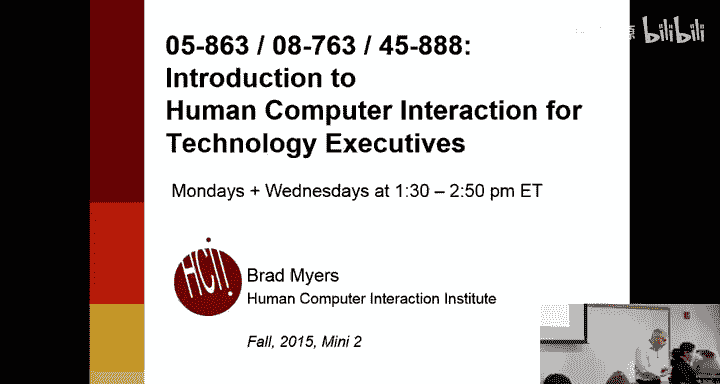

---

## 课程介绍与后勤安排

我们开始上课。大家可能注意到，我们正在向硅谷的一些人进行同步直播，偶尔会有消息弹出。如果出现类似情况，请告诉我，因为我通常看不到。

欢迎来到《面向技术高管的人机交互导论》。这门课程我已经教授了大约十年，我们每年都努力改进。第一讲的人数总是超过教室容量，目前有超过100人注册，而我们的主教室只能容纳65人。我希望在第一次作业后，最终人数会稳定下来。如果你不打算选这门课，现在退出会对其他同学有帮助。但我今天的目标是说服每个人都留下来。

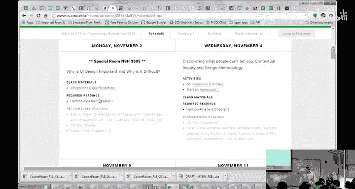

今天是万圣节，我们有一些剩下的糖果，请大家拿两块。很抱歉，硅谷的朋友们，我无法给你们糖果。

这门课程有三个不同的课程编号，但它们内容完全相同。如果你是Tepper商学院的学生，必须注册Tepper的编号。课程时间是每周一和周三的下午1:30到3点左右，地点在楼下的1305教室。我们使用Panopto系统进行录制和同步直播，所有课程视频都会发布在课程网站上。

课程网站链接可以从课程主页或我的个人主页找到，Blackboard上也有链接。在课程网站的计划页面上，每节课的材料下都会有视频链接。

目前有很多人在候补名单上。教室无法容纳130人，所以如果你听完这节课后决定不选这门课，请尽快退选，这对你的同学来说是礼貌的。我希望你们都留下来。

我没有固定的办公时间，但通常都在工作。如果你有注册问题，根据你注册的编号，需要联系不同的人。如果还是无法解决，可以找我。

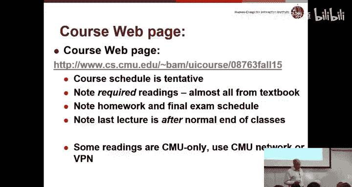

我们有四名助教，足以处理100名学生的作业。他们都是人机交互专业的学生，背景扎实，会非常有帮助。他们将安排办公时间，具体时间表确定后会公布在工作人员页面上。

希望大家已经提前找到了课程网页。课程计划和作业都会发布在那里。我们主要使用Blackboard来提交作业和接收带有评语的作业反馈，所以不要惊讶于Blackboard上内容很少，所有主要材料都在课程网站上。

对于非Tepper商学院的学生，请注意Tepper的校历比主校区晚一周。由于我们有大约三分之一的学生来自Tepper，我们基本上需要遵循Tepper的校历。这意味着课程会延续到常规课程结束日期之后。在主校区的考试周，我们还有两节课和一次期末考试。

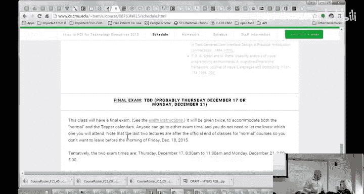

在规划行程时需要注意。如果你计划圣诞节回家，必须确保在期末考试结束前不要离开。期末考试将提供两次机会，一次针对主校区学生，一次针对Tepper学生，但两个考场都足够大，容纳所有人都没问题。期末考试日期是12月17日（周四），请不要在此之前离开。

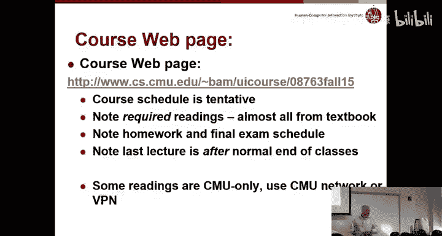

考试周的两节课也很重要且有趣，它们安排在主校区的考试周期间。

---

## 课程资料与教材

课程的阅读材料几乎全部来自我们的教科书，也有一些可选的额外阅读材料。所有阅读材料都列在每节课的页面上。

我强烈建议每个人获取或借阅教科书，它也有电子书版本。我和我的朋友Rex Hartson共同开发了这本教材。大约四、五年前，他给了我一个非常早期的版本，我们在课堂上使用并根据反馈进行了改进。这个过程重复了两次，最终版本才出版。今年是我们使用正式版本的第四年，它非常有用。这本书有900页，看起来有些吓人，但我只指定了其中很少的章节。要完成作业，你必须阅读指定的章节，但这只是整本书的一小部分。

Rex表示他计划在不久的将来推出一个更精简、更聚焦的修订版。如果你对教科书有反馈，我很乐意收集并转达给他。

如果你对用户界面特性感兴趣，还有其他一些书籍可供参考。Byron Holzblat的书详细介绍了我们第一次作业要做的内容。Jakob Nielsen的《可用性工程》虽然有些旧，但非常有趣。Don Norman的《日常事物的设计》是一本非常薄且有趣的书，如果你对这类内容感兴趣，我强烈推荐。

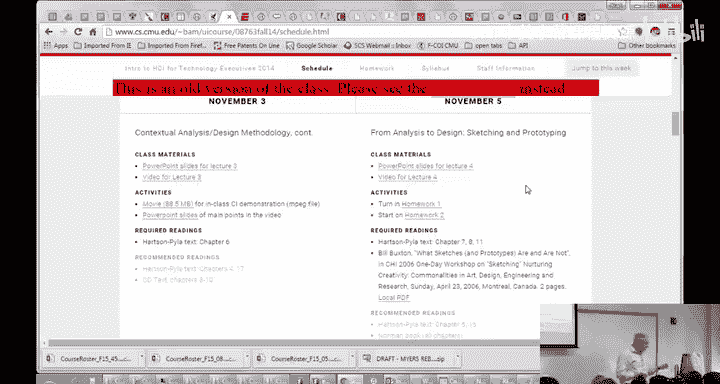

所有这些书都是可选的，主要是为感兴趣的人准备的。顺便说一下，幻灯片已经发布在课程网站上。

另外，关于幻灯片的一点是，我每年都会创建一个新网站。如果你去看去年的网站，会发现它和今年的很像，只是颜色从红色变成了绿色。我在每个页面顶部都加了这个横幅，以免混淆。这样做的好处是，在你修完这门课程后，无论你去行业还是其他地方，如果你想回顾在HCI课上学到的内容，这个页面将永远存在，包含所有视频、作业和材料。你也可以使用去年的网站来预习、观看去年的视频或查看去年的作业。我们的作业会略有不同，但课程内容基本一致。

---

## 课程核心：四种关键方法

那么，这门课是关于什么的？主题是人机交互，也称为用户界面、用户体验。它有很多名称，也有一些不再使用的旧名称，如人为因素或人机工程学、人机界面等。

基本上，这是一种让你所有产品——任何需要人使用的产品——变得更好的方法。HCI研究所刚刚庆祝了其成立20周年，我们教授这门材料大约有18年了。我们几乎立即就建立了人机交互的硕士项目，并尝试了许多不同的用户界面方法和技巧，最终确定了这四种最为重要。

本课程的目标是让你理解这些关键的、已被证明既易于使用又非常有效的用户界面技术。在这门课的六次作业中，你将实际学习和实践这四种方法：情境调查、快速原型制作、用户研究和启发式评估。

因为这些方法是研究人的方法，所以它们不会过时。无论你研究的是老式台式电脑、笔记本电脑、手机、手表还是智能电视，你都在研究人们如何与之互动，而这不会改变。你可以用它来研究儿童、专家或新手。这些技术在很大程度上是与具体评估对象和设计对象无关的。

同样，快速原型制作也是如此。作为课程的一部分，你将尝试为某个东西设计一个更好的用户界面。这也是一项永远不会过时的技能，因为你总是在设计某些东西。

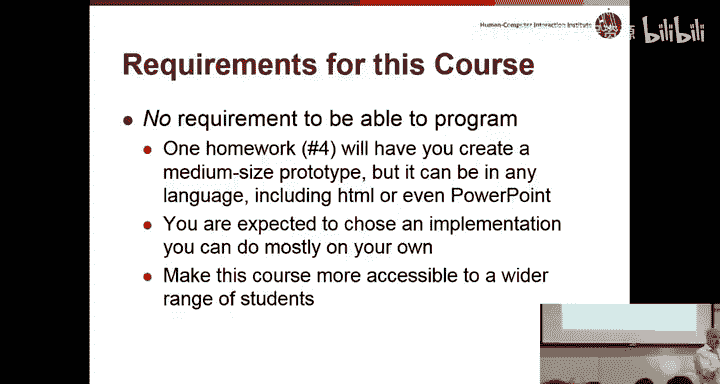

这门课是关于实际教授这些方法的。有时我会被问到：“我不想实际学习怎么做，我只想了解它们。”但这行不通，因为除非你实际去做，否则你不会真正理解它们。不幸的是，在一个七周的课程中实际实践这些方法，意味着我们需要相当数量的作业，而且作业有些长。

课程没有编程要求。前几次我试图让学生编程，但结果很糟糕，所以我们不再这样做了。每个人都将制作原型，你可以使用任何你想要的工具。默认工具是PowerPoint。你将在PowerPoint中制作一个模拟的iPhone界面或其他东西。如果你看过PowerPoint，它支持超链接和按钮，因此PowerPoint是一个功能强大的原型制作工具。你也可以使用Balsamiq或Axure等工具。有很多很棒的工具可供选择，任何人都可以学习。绝对不需要编写脚本或JavaScript、HTML、Java等代码。

因此，没有任何理由会导致任何人无法在这门课程中取得成功。

---

## 作业安排与评分政策

作业时间表已经公布，尽管作业内容尚未发布。作业在课前截止，这样做的目的是让大家没有借口缺席那天的课。

对于迟交作业，前三次作业我们有相当宽松的政策。每迟交一个上课日，扣10分（满分100分）。例如，作业周三截止，你可以最晚在下周一提交，只扣10分。如果再晚，则扣20分，依此类推。

然而，最后两次作业需要在同学之间交换。你的第四次作业将交给你的同学，他们也会给你作业。如果你迟交，就无法进行交换。因此，最后两次作业必须按时提交。在课程开始时，你可以有一些灵活性，但后果是明确的：除非有非常特殊的情况，否则迟交就会扣分。

如果你需要出差，总是可以提前提交作业。对于硅谷的同学，所有作业都通过Blackboard以电子方式提交。

我们谈到了期末考试。这门课可以通过/不通过评分。具体标准取决于你所在项目的规定。课程按分数评分，网站上有一个非常简单的公式。你可以查看教学大纲，那里有很多重要信息，包括先修条件、教科书、工作量等。

这是一门6个学分的课程，意味着每周需要12小时的工作量。每周上课3小时，剩下9小时用于作业。通常学生报告他们花费的时间大约就是这个数。我查过相关规定，以确保我有权布置每周9小时的作业，这确实是符合要求的。不幸的是，正如我所说，除非你实际去做，否则你无法真正学会这些技巧，而这需要一些时间。我们非常努力地确保作业不重复、不枯燥，并移除了一些学生认为特别繁重的要求。如果你对如何让课程更有趣有任何想法，请告诉我。

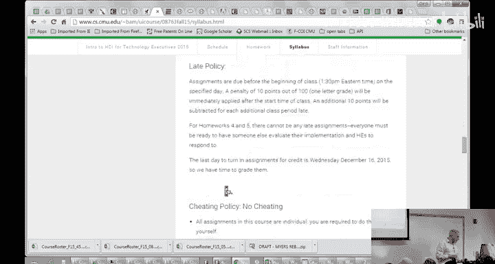

我们不允许旁听，因为教室已经满了。如果你不想修学分，欢迎观看录像。

---

## 作业结构与设备选择

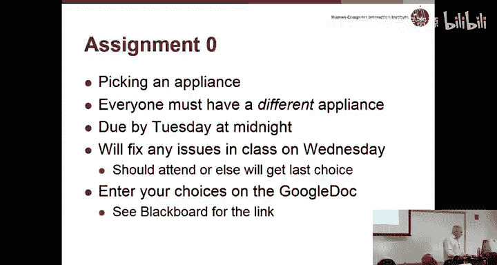

那么，作业是什么样的？在这门课程中，每个人都将独立完成所有作业。你需要选择一样东西：一个网页、一个设备、手机上的一个应用、笔记本电脑上的一个应用、任何种类的电器、Giant Eagle超市的Redbox或机场的自助服务亭（这可能不是个好主意）。你将研究人们如何使用它，这将是第一次作业。

在第二次作业中，你将尝试发明一种更好的方式，通过在纸上绘制界面来设计一个更好的用户界面。

在第三次作业中，你将用你的纸面原型实际测试，通常找一个不太懂技术的人，看看他们是否能使用它，以及你的设计是否真的更好。

然后你将实现它，这可能是使用PowerPoint或Balsamiq等原型制作环境。

在第五次作业中，你们将互相批评彼此的设计。

在第六次作业中，你将根据批评意见进行修改。

因此，在整个课程中，每个人都将针对同一个设备、同一个用户界面进行研究。明智地选择你的设备非常重要。为了避免任何形式的作弊，每个人必须选择不同的东西。

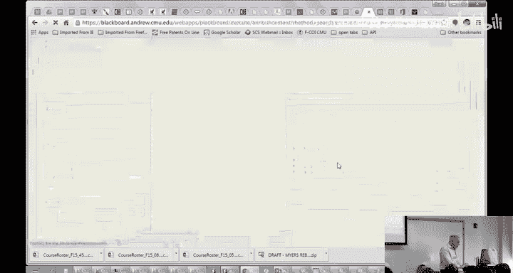

在下节课开始时，我们将确保每个人都选择了不同的东西。我会审阅每个人的提案，并确保它们具有足够的复杂度。如果你要进行用户研究，而每个人都能轻松完成，那么你就无法从中获得有用的信息。所以你需要选择中等复杂度的东西。

网站上有很多例子。仅仅说“我要做iPhone”是不够的，因为iPhone有成千上万的功能。但你可以说“我要做iPhone的联系人列表功能”或“短信界面”（虽然这可能太简单了）。有很多想法可供选择。

有时有人问，如果你已经有一个初创公司，是否可以使用自己的网站。只要你不介意同学们看到它，并且不需要他们签署保密协议，这是可以的。使用相机等电子设备也基本没问题。

使用机场自助服务亭的问题在于，你需要让人们去那里实际操作，这可能不太方便。如果你想使用家里的东西，只要你不介意人们来你家使用它，也是可以的。也可以使用周围的电器，比如复印机或投影仪，它们通常出人意料地复杂。

我们如何分配？我已经在Blackboard上发布了一个链接。你需要在这里填写你想研究的东西。我会在下周三上课前审阅，标记出我认为可以的提案，并添加评论。对于不合适的提案，我会添加一些建议。我们将在课堂上讨论，以确保一切一致。

你需要选择之前没有人选择过的东西。为了公平起见，我昨晚给所有已注册课程的学生分配了一个随机数，并按随机数排序。如果你不在此列表中，只需将你的名字添加在末尾。

我已经注意到一些问题，比如“Kindle”太模糊了，你必须选择Kindle的特定任务或功能。对于“烤箱”，你应该注明型号。只要是完全不同的烤箱，两个人做烤箱也没关系。所以请注明你考虑的是哪种烤箱。

对于像Giant Eagle结账机这样的东西，你需要对实际使用它的人进行用户研究，商店可能不会乐意。这可能有点问题。如果你尝试，我没意见，但可能会遇到麻烦。对于可编程微波炉，请注明型号。如果你使用一个我没听说过的网站，请提供完整的URL，以便我了解。

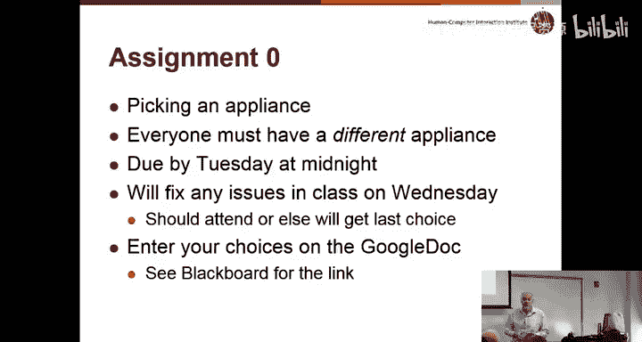

关于这个任务有什么问题吗？有些人提交提案并获得批准后，在尝试第一次作业时可能会发现它太简单、太难或无法完成。在这种情况下，你可以更改，但必须更改为尚未被其他人选择的东西。

另外，有些人可能会选择某个东西然后退课，那么他们的设备就可以被其他人选择。所以你会看到一个可供选择的列表。

你不需要在课堂上完成这个，可以稍后做。考虑到每个人都是随机排序的，如果你看到下面有你真正喜欢的东西，你也可以选择它。所以，如果你排在后面，可能值得等待，以确保没有人选择你正在考虑的东西。无论你采用什么策略，每个人的设备都必须在周二晚上之前列在那里。

---

## 人机交互的重要性与核心概念

以上就是后勤安排。关于课程或第零次作业有任何问题吗？

现在，我将尝试说服你们，为什么这是你们在第二个小学期（或任何时候）可以选修的最重要的课程。我们将讨论用户界面作为一个领域，以及作为产品一部分的用户界面。

考虑用户界面时，一个关键问题是这个术语的含义。“用户”是谁？这很直接，就是将要使用你产品的人。这与“设计者”——制造产品的人——是相对的。

一个关键的观察是：设计者与用户不同。

我喜欢问的一个问题是：这个房间里有多少人高于平均水平？好吧，你们都在撒谎，因为如果你们是平均水平，就不会在卡内基梅隆大学了。这个房间里的每个人都比平均水平高出一个、两个甚至四个标准差。

有多少人在制造产品或思考时，会说“我不想要任何普通人购买我的产品，我的产品只面向聪明人”？这没有意义。作为高于平均水平的经理、工程师或无论你的焦点是什么，你与你希望使用产品的人不同。因为如果你只瞄准像你一样聪明或与你兴趣相同的人，你将失去几乎整个市场。

因此，本课程中讨论的许多机制和技巧，都是为了帮助你更好地了解用户：他们是谁，他们如何思考事物，他们与你（设计者）有何不同。

什么是用户界面？它基本上是用户遇到的一切。你可能认为用户界面是图标和颜色，但它远不止于此。它几乎是这个列表上的所有东西，基本上是产品中的所有东西。许多技巧，尤其是我们将要讨论的第一个技巧，真正关注的是“有用性”，这与“可用性”非常不同。这个产品是否在做人们想要的事情？它是否在做能帮助人们或让人们觉得生活更高效的事情？

这就是功能和有用性。你如何知道产品中需要什么？有需求分析等多种方法，我们将教你一种方法来探究这个问题。

还有“内容”，这对网页尤其重要，但也适用于其他有标签、名称或任何文字的产品。这些文字应该是什么？它们应该说什么？如何表达？什么对你的用户来说是清晰易懂的？

应该如何呈现？应该使用什么颜色？如何布局？事实证明，人们阅读界面的方式与读书一样，是从左上到右下。因此，你如何组织材料，使其以逻辑顺序呈现，让人们知道先做什么，后做什么？

导航在网页上非常重要，但在许多消费电子产品上也是如此。例如，如果你有一个高级相机，你想设置白平衡，这可能需要在菜单系统中深入两到三层。你如何设计，让人们知道白平衡在哪里，并且能够再次找到它？或者任何没有巨大屏幕的系统，都将有许多小选项。想想手表，在Apple Watch上点击多少次才能进入任何功能。导航方案是什么？你如何使其清晰？

它甚至关系到响应速度等事情。你可能认为这完全是工程选择，但它对人们的互动有很大影响。人们常常会说：“如果我点击这个按钮会很慢，所以我要做另一件事。”或者“这个网站太慢了，我要忽略它，去竞争对手的网站。”因此，用户界面是可见的，响应速度在用户界面中是可见的。

然后还有情感影响等因素。有多少人爱他们的手机？人们与某些产品有情感联系。有多少人爱Microsoft Word？有些产品人们的情感联系不那么强。你如何设计能让人产生这种联系的产品，真正帮助人们对购买、使用或向朋友展示感到满意？

显然，文档和帮助也很重要。

教科书区分了“用户体验”（包括所有这些方面，尤其是情感影响）和“用户界面”。我不做这种区分，我认为这两个词都完全合理地涵盖了所有这些方面。

---

## 高质量用户界面的属性

思考一个系统，想想你如何将其分类为高质量与低质量。对于高质量的汽车，每个人都知道那意味着什么：它不会抛锚，看起来不错。对于技术用户界面或软件产品，你会用哪些属性或指标来称其为高质量？

*   **稳定性**：比如它不会崩溃。
*   **响应性**：当你点击东西时它很快。
*   **一致性**：各个部分看起来协调一致，相同操作在不同部分的工作方式相同。
*   **直观性**：你可以理解如何使用它。
*   **易学性**：无需帮助即可弄懂如何使用。
*   **美观性**：视觉上吸引人，声音等其他界面部分也应如此。
*   **可预测性**：随着时间推移变得更容易使用。
*   **符合期望**：用户有特定的欲望和期望，如果界面按预期工作，就会显得更容易使用。
*   **易于理解**：不仅仅是输入，还包括界面反馈给你的内容，你需要知道系统试图告诉你什么。

我这里还有一些东西，刚才没人提到“可学习性”，这可能属于直观性。但意思是新手可以立即开始使用这个界面。

我们也没有真正谈到“效率”，但这是用户界面的另一个关键焦点。如果你是系统的专家并且经常使用它，你应该能够快速使用它。所以有些人认为用户界面只针对新手，但实际上我们更关注专家使用，确保专家不会浪费时间，没有大量看似愚蠢的点击。因此，生产力和效率很重要。

“可记忆性”是指如果你做了一件事，离开一个月后回来，你记得如何做。

“错误”我们也没有真正谈到，避免错误是可用性的一个重要方面。

所有这些以及“满意度”，都是用户界面可用性的各个方面。这就是我们将在本课程中学习如何同时改进所有这些方面的内容。

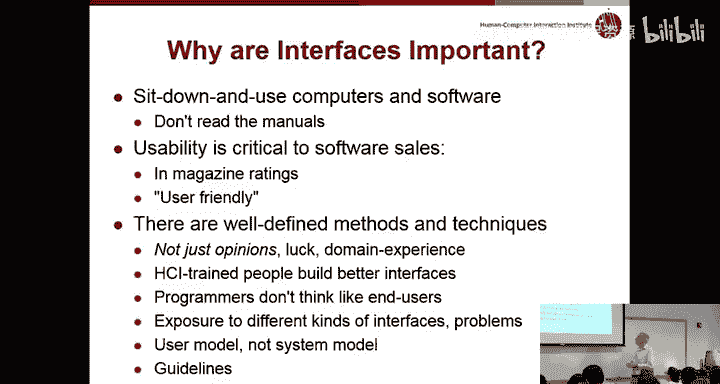

---

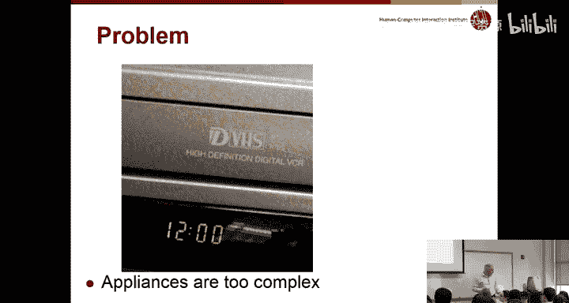

## 用户体验与游戏设计

我们谈了一点用户体验，包括情感、趣味、风格和艺术。顺便说一下，关于设备选择，通常不建议选择游戏。

因为游戏故意设计得难以使用。你可以有一个界面上有个大框写着“赢”，那会非常容易使用，但一点也不有趣。游戏让自己变得有趣的方式，实际上是故意设置使用障碍或需要克服的难关。因此，除非游戏有一个非常有趣的机制，你想测试这个机制或游戏的设置（这通常很无聊），否则一般来说，游戏不是一个好选择。尽管它们很有趣，并且可能具有艺术性，但就我们在这门课程中教授的内容而言，效果并不好。娱乐技术中心等有专门课程关注测量趣味性和设计有趣的游戏，但这不是本课程的主要主题。

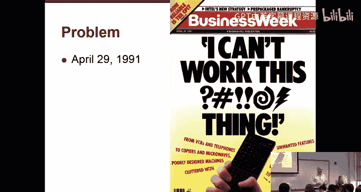

不过，即使是像iPhone应用这样的东西也可以很有趣。许多动画、晃动和滑动操作都很有趣。所以对于常规产品、常规互动来说，这也可以是一个合理的目标。

用户体验还包括品牌、政治以及设备本身之外的许多东西。服务设计就是理解整个流程，不仅仅是界面本身，还包括它如何融入你的生活，以及如何与你将要做的事情相契合。

---

## 为何用户界面至关重要

为什么关注产品的用户界面很重要？一个原因是，今天几乎所有人都期望所有产品都易于使用。没有人期望在使用某物之前阅读100页的手册。现在甚至很难找到某些产品的手册。

可用性是人们决定购买什么或在博客等地方评论产品时的关键评估因素。

事实证明，有明确的方法可以改进可用性，这就是我们本课程要关注的内容。所以，即使你认为自己不是设计师，仍然有很多方法可供工程师、经理等任何人使用，来衡量界面、改进用户界面并测试不同的方法。

当然，在一个六、七周的课程中，我不能把你带到人机交互专家的水平，或者像在我们硕士项目中学过许多不同技巧并有丰富经验的人的水平。但希望本课程的目标之一是让你了解这类人能够做什么。

让你体会到设计好的用户界面有多难，以及如果你是一名经理或产品负责人，用户界面专家将为你的团队带来什么样的技巧和方法。

有大量证据表明，接受过人机交互培训的人可以做出更好的界面。即使你从本课程中获得培训，也能提高你制作更好界面的能力。如果你将来与HCI专家合作，这当然也能让你很好地理解他们将做什么以及他们为团队带来的价值。

---

## 糟糕用户界面的代价与成功案例

世界上有很多糟糕的界面。这是一个比较老的例子：过去电器上都有需要设置的时钟。有多少人的时钟仍然显示夏令时？有多少是因为你不知道怎么调？

我们的老朋友Randy Pausch，过去每次教授用户界面课程时，都会用大锤砸碎一件消费电子产品，以此宣泄人们对这些设备用户界面质量低劣的挫败感。

有多少人拥有不止一个遥控器？它们都略有不同。这张照片是以前拍的，那时遥控器还有显示屏，现在很少见了。按钮布局总是不同，而且总是设计得很差。

这是1991年一篇非常有趣的文章，时间相当久远了。文章说：“我搞不定这破玩意儿。”从录像机、电话到复印机、微波炉，充斥着无用功能的糟糕机器正在让消费者发疯。“用户友好”到底怎么了？如果我们今天重写这篇文章，把录像机换成DVR，电话换成智能手机，情况仍然基本如此。许多消费电子产品的进步小得惊人，而另一方面，其他一些东西终于变得好多了。

---

## 优秀用户界面的商业价值

为什么公司要考虑改进用户界面？对客户有很多好处。新手能更快上手，人们不会浪费那么多时间学习你的系统。专家效率更高。大多数白领工作者大部分时间都在电脑前工作，因此，你能让他们更高效，将对人们实际完成的工作量产生重大影响。

它减少了错误。我们讨论的许多用户界面技巧实际上可以帮助你制作让人们少犯错误、更快发现错误并修复错误的产品。这显然是一个关键优势。

最后，正如我们谈到的，人们以使用你的产品为荣的情感联系，这当然会带来更高的生产力和满意度。

有一些研究关注可用性的成本，几乎所有研究都显示出令人难以置信的收益和投资回报率。这是因为可用性要解决的问题通常非常昂贵。

例如，如果你的系统在设置时让人困惑，他们可能会拨打你的帮助中心。每次拨打帮助中心的电话成本高达50美元或类似的高额数字。如果你的产品利润微薄，那么几乎每一个帮助电话都意味着你另外十几件产品没有赚到钱。因此，如果你能让所有人无需拨打帮助中心就能弄明白如何操作，你就以直接的方式节省了大量资金。

减少客户投诉。另一个重点是，正如我提到的，第一次作业和情境调查是关于需求发现，理解产品的真实需求。这可以显著减少你的工程预算，因为你会更清楚地了解产品必须做什么。如果你能把钱花在用户想要的功能上，那么你就不必浪费大量资金制作没人想用的功能。

事实证明，工程，尤其是软件开发，非常昂贵且难以进行。整个行业大量的工程努力浪费在从未面世、发布后不得不撤回或后期修复的东西上。许多研究表明，关键原因之一是缺乏对用户需求的关注，以及没有进行我们将要讨论的这类工作。

在第二次作业中，你将制作一个纸面原型，这可能花费你三四个小时。它将让你真正理解人们希望如何使用这个产品，人们如何反应，人们是否会觉得它有用。通过采用这些我们谈论的廉价且不费力的机制和流程，你可以通过确定产品的哪些部分是需要的，对公司的底线产生巨大影响。

拥有更好的用户界面的另一个好处是，它让你的销售人员更容易向人们展示产品的功能，因为功能会显而易见。销售人员会更好地理解它，客户也会理解，因此产品更容易演示和销售。

将工程资金投入到用户实际想要使用的地方，会增加所谓的“实现价值”，即你花费的钱实际上在为你工作。

如果你能通过可用性使你的产品与竞争对手区分开来，那显然会增加你的收入和利润。因此，有很多商业和金钱上的理由说明为什么可用性几乎总是有回报的。

一些修过我课程的人告诉我，他们实际上将课程中设计的产品用作毕业作品集的一部分。我们当然也看到，对具有用户界面经验或知识的人有巨大需求。用户界面专家有很多工作机会，即使你说你想成为经理，但有一些用户界面经验，或者作为工程师等，对你的简历和求职都是真正的优势。

所有公司、政府和军事机构都在用户界面上投入了大量的资金和时间。

关键的一句话是：**如果用户不会用，那它就没用。**

你可能认为，如果QA部门找不到任何bug，某个功能或系统就是可用的。但即使QA部门找不到任何bug，你把它交给用户，他们却无法使用，那么它可能就不存在，可能不算数。因为如果你没有为可用性测试你的产品，那么你根本就没有测试过它。

一个推论是，特别是对于网络产品或任何具有深层菜单结构的东西：**如果用户找不到某个功能，那它可能就不存在。**

百思买有一个很棒的研究，大约三分之二退回百思买的产品，是因为人们声称它没有某个它实际拥有的功能。仅仅是因为人们想要这个功能，希望它做某事，但不知道如何让它做，所以他们以为不可能，于是就退货了。显然，百思买和所有消费电子公司都因此损失了大量金钱。

---

## 成功产品的用户界面因素

反之，可用性确实定义并促成了产品的成功。经典的例子是Palm Pilot。有多少人听说过Palm Pilot？这是90年代末的一个大产品。有多少人知道这是什么？你注意到苹果标志了。对，这是Apple Newton。我不知道是否有人看过史蒂夫·乔布斯的电影，他们取笑了这个产品。这是苹果公司的一个失败产品，它太大太重，没有真正做人们想做的事。

另一方面，当Palm Pilot推出时，它非常成功。一个原因是它能放进口袋。另一个原因是他们非常仔细地设计了界面，让人们想做的事情真的很容易做到。他们花了很多精力去理解人们的需求，进行用户测试，并找出如何让Palm Pilot真正响应用户的需求。

谁知道这是什么？这是最初的iPod，有人年纪大到拥有过一台吗？是的，有不少人。iPod不是第一个数字音乐播放器。事实上，许多竞争对手多年前就有了数字音乐播放器，微软甚至在此之前就有一个。但没人想要它们。

一个关键原因是它们都有像下一曲、上一曲这样的小按钮，就像你的汽车或CD播放器上的那样。但当你有100首歌时，下一曲和上一曲作为选择东西的用户界面方式，完全是失败者。

最初的iPod有这个非常新颖的圆形转盘。他们非常精心地设计了它，这样如果你转得快，你可以快速浏览所有1000首歌。如果你转得慢，它足够精确，你可以选择一首特定的歌。如果你玩过其中一个，你可以探索光标实际上以非常不同的速度移动，如果你转得快或慢。他们花了很多精力来设计它，所以它非常容易使用。

但另一个重点是，在当时，如果你有像微软的Zune或Rio这样的其他播放器，买歌真的很难。那时所有公司都对人们盗版歌曲和翻录CD感到愤怒。苹果不仅创造了这个设备，还创建了iTunes商店，使合法购买歌曲变得便宜、容易，并且用户体验非常好。所以我们之前谈到了服务设计，iPod如此成功的关键原因之一是苹果进行了服务设计。他们不仅设计了iPod，还设计了iTunes，而且史蒂夫·乔布斯能够与所有主要唱片公司达成协议，这样所有你想要的歌曲都可以合法且容易地获得。因为很多人不想为了花99美分买一首歌而违法，这看起来太傻了。通过考虑整个流程，他们使iPod取得了巨大成功。

最初的iPod相当大且笨重，因为它们里面有一个实际的硬盘。如果你曾经打开过一个，看看他们在那时必须做什么才能让它工作，会很有趣。

每个人都知道这是什么，这是最初的iPhone，今天看起来有点小。但事实证明，它在当时也非常具有革命性。还记得iPod吗？Palm Pilot有一个全屏，它就是一个屏幕。有多少人记得黑莓？RIM黑莓，它有一个你用拇指点击的小键盘。事实证明，每个人都在朝那个方向发展。微软和Palm都放弃了全屏，转向了带小拇指键盘的半屏，因为这似乎是每个人都想要的。而苹果说：“我们不在乎。”

iPhone推出时，它几乎是第一款使用多点触控的手机。如果你了解这些旧设备的屏幕，它们是设计用来使用触控笔的。一个尖头的东西，但你不能在iPhone屏幕上使用尖头的东西，所以你必须用像手指这样的东西。史蒂夫·乔布斯非常反对触控笔，而支持手指作为界面。所以他们显然抛弃了之前为Newton手写识别器等所做的所有工作，使一切都变成可以用手指点击的大按钮。

所以它在当时非常具有革命性，因为其他人都走了不同的路。显然，它完全占据了市场，现在所有界面都以这种方式工作。

同样，对于iPad，没人认为它会有用，因为微软和其他许多公司多年来一直尝试推出平板电脑。微软有一个叫做Tablet PC的东西，比尔·盖茨曾站起来说这将是下一个大事件，结果没人想要。事实证明，现在几乎没人想手写了。我看到也许有15个人用真正的纸，但你们这代人真的对手写不太感兴趣了。所以，把平板电脑当作手写工具的概念是行不通的。但苹果的大创新或观察是，这应该是一个媒体机器。大多数人用iPad看电影、玩游戏、阅读，但不太用于写作或提供输入。

下一个例子是Wii。当Wii首次宣布时，微软、PlayStation和任天堂都在竞相制造更快、更大、更复杂的游戏机。而任天堂Wii实际上比所有竞争对手都慢得多。相反，他们把资金投入到这些创新的控制器中，这些控制器内置了运动传感器。而其他所有人都在使用传统的、需要快速手指操作的控制器。Wii曾一度完全主导市场，仅仅因为他们想出了这种新的用户界面、新的游戏方式以及可以提供的新类型游戏。他们证明了你并不真的需要所有人都认为是关键要求的所有这些额外的图形和处理能力。

这些都是优秀用户界面真正定义并使这些产品成功的例子。

---

## 网络产品的可用性

这对网络也是如此。网站确实在很大程度上由可用性定义，可用性主导着网络。

显然，现在几乎任何人购买任何产品时，都会首先在网上查找。所以即使你要购买像汽车、复印机或打印机这样的实体产品，你也会先在网上查找。但如果你要使用网络服务或电子商务网站，那么你将在网上实际购买东西。

如果消费者不知道如何使用你的网站，找不到产品，那么基本上他们会去别的地方。

一个有趣的观察是，如果你亲自去Giant Eagle，它没有你想要的产品，你需要费很大劲回到车上，然后开车去CVS或其他地方看看他们是否有这个产品。而如果你在Expedia上，不喜欢它的用户界面，切换到Yahoo Travel或其他竞争对手的网站真的很容易，只需点击一下。相比之下，实体商店切换起来要麻烦得多。

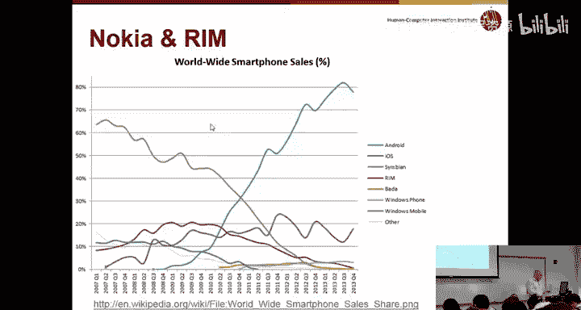

另一个有趣的事情是，谷歌在搜索方面做得很好，亚马逊在让你购买你想要的产品方面做得很好。如果你有一个小公司，有一个搜索框或购买框，人们不会真的把你的网站和其他小网站比较，他们会把它和谷歌、亚马逊比较。

如果你走进一个GetGo，在货架上寻找，他们没有你想要的产品，你不会感到惊讶，因为很明显这是一个小商店，与大型Giant Eagle相比。但这不适用于网站。如果你的小网站没有像样的搜索，没有一键购买，或者运作不佳，不幸的是，人们会说：“嗯，亚马逊能做到。”不一定考虑到亚马逊可以在每个页面上花费一百万美元，而你的小网站不能。

另一件相关的事情是，有一些关于网站设计糟糕的公司的研究，这对品牌名称的反映非常糟糕。所以，如果你是宝马或其他奢侈品牌，你认为“哦，每个人都会喜欢我的车，我不需要担心我的网站”，这项研究表明这不是真的。如果宝马有一个非常糟糕的网站，人们会想：“嗯，这家公司显然不关心可用性，他们的车可能也很难用，也许我会去别处试试奔驰。”因此，即使这可能与你实际销售的东西没有重要关系，网站的可用性也是一个关键要求。

电子商务网站与常规软件的另一个有趣区别是，如果你想购买一个产品并使用它，你必须先付钱。所以如果你有笔记本电脑或软件，有时你可以先试用再决定。但对于任何硬件或消费电子产品，你必须先付钱才能使用。而对于网络上的任何东西，最后一个按钮才是你真正拿到钱的地方。

因此，如果购买机制有任何令人困惑的地方，或者如果人们在购物体验中途对你感到恼火，他们就会离开，你根本拿不到任何钱。所以网络产品的一个很大区别是，钱只有在人们已经使用之后才来。

---

## 糟糕用户界面的严重后果

有一些例子表明，糟糕的用户界面确实造成了一些非常糟糕的事情。最简单或最不糟糕的实际上是降低了公司的价值和评级。

这是一个很好的例子：福特多年来一直致力于提高汽车质量。很久以前，他们的汽车有容易出故障的名声。所以他们非常努力地进行工程改进，使汽车不那么容易抛锚，发动机更可靠，所有其他部件也更可靠。然后在2011年，他们决定像其他人一样采用电子仪表盘，但他们做得太差了，以至于他们的质量评级急剧下降，仅仅是因为没有意识到需要在仪表盘质量上投入这么多资金。一些评论非常严厉：“一个交互系统的恼人行为导致其评级暴跌。”

所以这是人们必须处理的事情。一个糟糕的工作导致使用困难，这完全说得通。

这是另一个更近一点的例子，但仍然与福特有关。司机在打算按其他按钮时，意外按到了这个按钮。这是停车、倒车、驱动，这是你换挡的方式。而这是你关闭汽车的方式。果然，司机在高速公路上行驶时，意外关闭了汽车，比如试图切换到S挡时。还有乘客试图关闭收音机时，关闭了整个汽车。你可以想象，如果你在高速公路上行驶，汽车突然关闭，那真的很危险。

这篇文章说，13,500辆汽车不得不被召回。你怎么在召回中修复这个？他们可能必须更换整个设备或类似的东西。必须有一种关闭汽车的方式，所以它必须移到别处。

这是另一个很好的例子，我找不到更新的数字，所以这只到2013年。如果有人知道更新的图表……这条绿线是诺基亚或塞班系统，几乎降到零。蓝线是安卓，对吧？关于这个有趣的是，紫线是iOS，苹果。它并没有像你想象的那样在数量上占据主导地位。但它仍然是最赚钱的，苹果仍然是世界上最有价值、最赚钱的公司之一。原因之一是因为他们的用户界面和其他设计元素，他们能够控制成本。实际上，他们只有四款iPhone型号可以购买甚至得到支持，而安卓有大约1000或2000款型号，三星必须有100款产品使用安卓，100种不同的手机，而苹果只有四款。因此，尽管安卓拥有巨大的市场份额，苹果仍然能够在盈利能力和有效性方面保持领先。

但当iPhone推出时，诺基亚在这里表现不佳，但它仍然是一个主导者。我实际上看过一些早期的诺基亚手机，它们试图模仿iPhone，但很糟糕。我们谈到了iPod上的转盘，对吧？在iPhone上，如果你轻扫，内容就会滚动。在这款诺基亚手机上，他们没有做苹果所做的工程努力。当你轻扫时，感觉就像在泥泞中移动东西。感觉不对。与iPhone那种有趣且反应灵敏的感觉相比，它有一种烦人的、卡顿的感觉。所以诺基亚在早期阶段做错了很多事情。RIM也是如此，这条橙红色的线也降到了零。他们试图推出一款全屏手机，叫做Storm，有人试过吗？也很糟糕。是的，没人真的喜欢它。所以，许多人在没有投入足够精力或资源的情况下，试图复制这种界面风格，最终失败了。

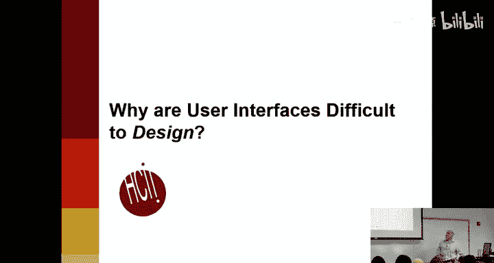

还有一些糟糕用户界面实际上致人死亡的例子，这相当令人震惊。

第一个例子，这是一个比较旧的系统，但仍然很有启发性。这是一个用于船上人员、海军的显示器。人们应该追踪飞机。他们需要确定的一个关键事情是飞机是在下降还是在上升。因为如果它朝你飞来，那是坏事；但如果它在上升，可能就不是坏事。所以Aegis系统的工作方式是，这里有一个数字。如果飞机在下降，显然数字会变小。如果它在上升，那么数字会变大。这似乎是一个完全合理的界面。

但发生的事情是，负责监控的水手误读了其中一个点，以为它正朝他们飞来，并且直接对准了船只的航线，所以他们把它击落了。但结果那是一架正在起飞的客机。它确实直接对准了船只的航线，但它是在上升，因为它是客机，而不是在下降。这被归因于这个用户界面。显然，这是一个高压情况，如果你搞错了，而它真的在俯冲攻击你，那么它可能会炸毁你。所以这不是他们能够以正常能力工作的情况。

可能有什么不同的设计会是更好的用户界面？当然，可以用颜色编码。可能这个系统太旧了，他们没有那个选项。那么可能还有其他什么想法？如果你知道任务是什么，如果你知道他们需要检测下降，那么你可以说，好吧，让我确保那真的明显，让它闪烁或以某种方式特别显示这是你应该特别注意的一个。还有什么？对，你可以直接有一个箭头。易于解释，显示它是上升还是下降。还有其他想法吗？很好，为什么要把上升的也显示出来？我的意思是，也许他们需要为其他事情追踪所有东西，但他们当然可以有模式。也许在某种模式下，它只显示朝我飞来的或正在下降的，而不显示上升的。另一种可能性是，他们没有特别需要高度，也许他们应该只显示变化。所以+3或-700之类的。如果你真正需要知道的是变化，那么为什么不直接显示那个呢？为什么要让人们在大脑中计算？这就是Aegis系统。

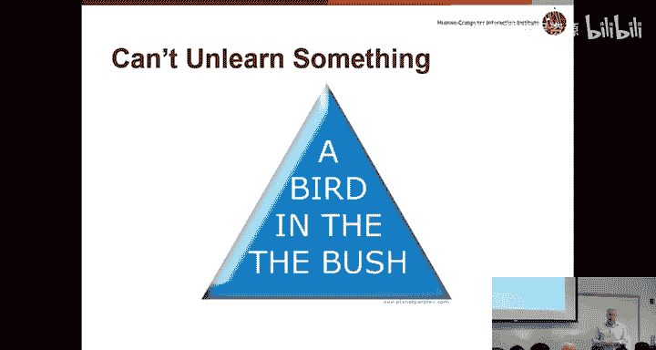

有一些医疗仪器被指责性能不佳。这是一个电子病历系统，当它在医院安装时，大大减慢了医生的速度，以至于他们实际上开始失去更多的病人，因为医生花太多时间在电脑上做文书工作，而不是真正帮助人们。

这个例子。选举季快到了，我希望你们都享受所有的广告。这是2000年的选举，现在是很久以前了。但如果你记得，乔治·W·布什在那次选举中击败了阿尔·戈尔，选举完全取决于佛罗里达州的投票结果。有很多关于悬挂式孔屑之类的事情，结果证明这些都不相关。决定选举的真正原因是一个用户界面错误。

这些是佛罗里达州使用的选票。有大量证据表明……它说什么？颜色象征上升一座山？是的，颜色象征上升一座山，是的，我们说那很好。在这个例子中。是的，好的。

所以在这个例子中，这是纸质的，选民应该做的是打穿其中一个黑孔，然后由机器读取。你只允许打穿一个孔。这是他们想投票支持的总统候选人。帕特·布坎南。所以选举中奇怪的事情之一是，如果你熬夜看电视，出口民调显示戈尔以压倒性优势获胜，所以许多电视台宣布戈尔赢得了选举。但当他们实际计票时，发现戈尔没有赢，而是有成千上万张票投给了帕特·布坎南。为什么会这样？对。对，所以他们只是在这里，我想投票给阿尔·戈尔，所以他是第二个，所以我到这里来，往下数两个，然后打穿那个孔。成千上万的人打穿这个孔，以为他们投给了阿尔·戈尔，但实际上他们投给了帕特·布坎南。

所以这完全是这个用户界面错误的结果，导致乔治·布什当了八年总统。这有点好笑，但也不太好笑。

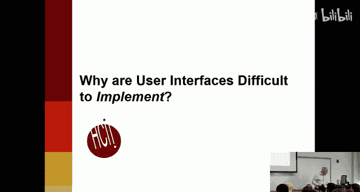

你可能听说过Healthcare.gov，几年前它推出时出现了各种软件问题。Healthcare.gov的大多数问题实际上是实现错误，背后的工程非常糟糕。但据估计，大约40%的缺陷实际上是用户界面错误，人们实际上错误地使用网站或