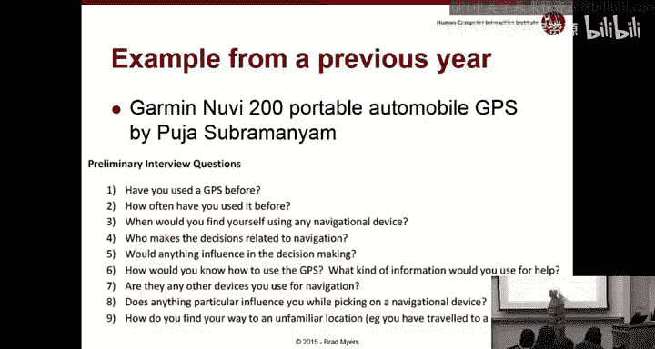
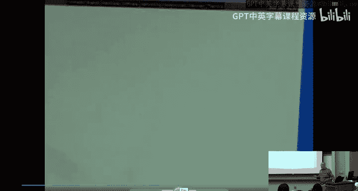
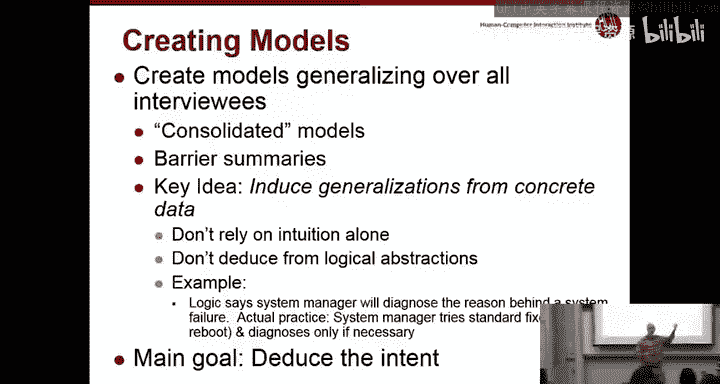
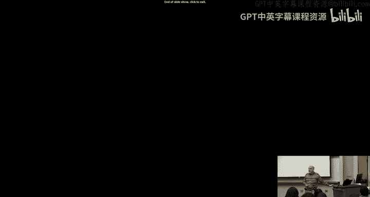

# 人机交互导论：03：情境分析与设计实践

在本节课中，我们将深入学习情境分析（Contextual Analysis）与情境设计（Contextual Design）的核心方法，特别是如何通过用户访谈来理解用户需求，并识别用户在使用系统时遇到的障碍。我们将重点探讨访谈技巧、数据记录方法，以及如何将观察结果转化为三种核心的图形化模型：流程模型、社会模型和人工制品模型。

## 访谈准备与执行原则

上一节我们介绍了情境分析的基本概念，本节中我们来看看进行用户访谈时需要遵循的具体原则和技巧。这些原则旨在帮助研究者获取真实、有效的用户数据。

以下是进行用户访谈时的一些通用建议或规则：

1.  **明确测试对象**：确保用户理解你是在测试系统，而非测试他们本人。通常，当人们被要求执行任务时，他们会认为自己在被测试。如果用户认为你在测试他们，他们可能会说“我太笨了”、“我不理解这个”或“我不是你要找的合适人选”。因此，重要的是给予他们正确的背景和心态，例如可以说：“这个系统存在一些问题，我们请你来帮助我们找出它们。” 这样能让用户理解他们是在协作、参与，是在帮助你测试产品，而你实际上希望发现产品的问题。这样，用户就会更积极地帮助你发现问题，而不是因为无法完成任务而感到紧张。这总是一个有用的开场方式。

2.  **关注情境（Context）**：如果你提前看过需要制作的图表类型，其中一种叫做社会图或文化图。它关注的是人们为什么做某事，是什么影响他们做出选择，以及他们对系统、产品和所做事情的原因有何看法。这完全是关于“为什么”，即事情发生的原因。这部分内容不一定会在标准访谈中自然出现，因此你必须从一些问题开始，引导用户说出相关信息。例如，你可以问：“如果你不代表某个组织，你会如何描述……？”

3.  **选择代表性用户**：几乎任何时候进行用户测试，你都会希望找到能代表某个群体的人。这是不可避免的，你不可能测试所有人。因此，目标是找到类似于你目标受众的人。就本次作业而言，我们特别希望每个人都能找到一个会遇到问题的用户。这在现实生活中不一定是常规做法，但我们希望每个人都能练习理解人们如何以及为何会遇到问题。在另一节课（可能是最后一节课）中，我们将讨论一种称为“人物角色”（Personas）的方法，这是一种理解目标受众并将其分组的方式。然后，一个非常常见的策略是思考：谁是我们的目标受众？我们如何将他们分类？你肯定会希望从各个类别中挑选人员。但就本次作业而言，你只是从这个类别（比如最左侧的类别）中挑选一个，即那些是新手、不理解事物的人。这主要是为了让你的第一次用户研究更具教育意义。因此，希望你挑选的人与你尝试研究的设备不至于相差太远，以至于他们能提供一些相关的答案或信息。你要试图找出他们通常在什么情况下会做这类事情，或者在什么情境下会做。例如，如果你有一台相机并交给某人，你会问：“你通常拍什么？你如何决定是否拍照？是否曾有人请你拍照？” 这样，你试图理解该设备在用户真实生活中的使用情境。他们不应该编造，你也绝对不能编造，但理解所有这些所谓的“影响因素”或“情境”、“文化背景”非常重要。因此，在实际使用开始前，你应该为用户准备一份简单的问卷。

4.  **准备书面脚本**：本次作业要求你准备一份书面脚本，即一组写好的问题。这对于单个用户来说不那么重要，但如果你有多个用户并且问他们非常不同的问题，你会得到不同的答案。因此，如果你想了解不同人物角色之间的差异，以相同的方式向他们提问就非常重要，而真正做到这一点的唯一方法就是准备书面脚本。你需要写下指示，准备书面脚本的另一个原因是确保你以正确的方式表达。你需要每次都使用相同的方式表达。新手常犯的一个关键错误是在问题中泄露答案。例如，如果你说：“你能按下搜索按钮吗？” 每个人都会看着屏幕，找到一个写着“搜索”的按钮并点击它。这并非真正的协调性测试，也不应该是视觉搜索测试。你想知道他们是否理解该做什么，因此不应该在问题中给出答案。例如，“使用小时和分钟按钮来设置时间”告诉他们如何操作，告诉他们按哪些按钮，这是给出指示的错误方式。如果你说“时钟应该显示正确的时间”，那么你是在告诉他们要做什么，但没有给出任何关于如何做的提示。因此，我们希望你为这次作业写下指示的一个关键原因是，练习找出不泄露答案的提问方式。这是一项非常有用的技能。我们希望确保你在脚本中做到这一点。因此，你应该写下将要提问的实际问题，然后从你的纸上或其他地方读给被试者听。我们还发现，如果你把指示写在纸上交给用户，他们通常会忽略。特别是如果你有一长串问题，他们只会略读一下，然后说“好了，我准备好了，你可以告诉我你想让我做什么了”。所以，尽管听起来可能有些尴尬，但直接读出你写下的内容效果会好得多，他们会听，会按照你的指示做，而你也会小心地以正确的方式表达。

5.  **设计多样化任务**：我们上次讨论了准备多种任务。很多同学就作业问到了这一点。除非你碰巧有一个能探索整个界面的总体任务，否则通常你会为不同部分设计不同的任务。我们讨论过这一点。我们经常收到的一个问题是：“能给我一些例子吗？” 因此，我在讲义幻灯片中放了一些例子。我想现在没人用这个旧设备了，但这是一些情境性问题，旨在让用户进入使用GPS设备的正确状态。例如：你以前使用GPS的频率如何？你什么时候使用它？谁决定你要去哪里或走哪条路线？如果你对它感到困惑，你会怎么知道？你会问谁？这些都是为了理解人们如何使用GPS的情境性问题。关键在于，问题是：如果你什么都不能说，你该说什么？这确实令人困惑。关键是要试着思考用户肯定知道什么，以及你关心什么任务。例如，如果某人面前有一瓶写着“拜耳阿司匹林”的阿司匹林药瓶，他们想要一瓶新的，那么他们知道药瓶上写着“拜耳阿司匹林”。因此，对某人说：“假设你手里有一瓶阿司匹林，你想要更多。你会如何使用这个网站找到阿司匹林？” 你假设他们脑子里有这个信息，这样告诉他们就完全合理。或者，假设你想知道这个网站是否适合查找如何处理头痛。那么你会说，你不会说“你能找到治疗头痛的阿司匹林吗？”，因为那会泄露答案。如果你想知道网站是否能回答这个问题，你可以说：“假设你头痛，你会怎么做？你能在这个网站上找到任何有用的东西吗？” 这取决于你心中有什么特定的任务。就像这里，如果我试图问人们（让我们翻到下一页），例如：“你能找到去沃尔玛的路吗？” 这假设他们脑子里已经有沃尔玛了。因此，这可能是一个完全合理的任务，你想知道当人们知道想去哪里时，这个GPS是否能帮助他们。或者，他们能否按类别找到东西？例如，如果他们需要一家商店或者需要买一个游泳池，他们会去哪里？因此，你可以根据为用户设想什么样的任务以及如何覆盖任务的不同部分、网站的不同部分或设备的各个部分来规划。

6.  **任务集合示例**：这是一组旨在涵盖该GPS擅长执行的各种任务的问题，理论上应该花费大约15到20分钟，对于新手可能需要半小时。这是一个任务集合。其中一些比较模糊，一些非常具体。希望你不是在试图欺骗用户，所以你不会要求他们做GPS根本无法完成的事情。例如，如果这个特定的GPS确实无法找到两条街道的交汇处，那就有点过分了。因此，根据你的GPS实际能成功完成什么，将决定你如何提问。

7.  **用户描述与匿名化**：作业的另一部分是描述用户，你不应该使用真实姓名，因为应该是匿名的。这是一个你可能需要记录和揭示的信息类型的例子，这些信息将有助于你理解她如何使用GPS，所有这些也会反映在社会模型中。

8.  **准备访谈记录**：作业的另一部分要求提供一份记录。这基本上是对所发生事情的总结，不必逐字逐句，因为那显然比我们真正需要的更详细，但重要的是包含你的问题。如果你直接按照脚本提问，可以直接复制粘贴，然后记录结果发生了什么。这些可能是对用户实际所说内容的总结或概括，是几行内容的合并。关于行号，Microsoft Word可以自动添加行号，你只需打开这个功能，这样就不必担心时间码之类的东西了。我们试图让这尽可能简单，同时仍为评分者提供足够的信息，以便他们了解真实情况，从而判断你的图表是否匹配。时间码也可以，这更容易。如果你已经开始使用时间码，当然可以继续使用，那样更准确，也更贴近现实生活。这只是一种更简单的方式，你可以选择任何一种。

## 情境调查实践与分析

现在，我们将进行一个小型的情境调查实践。我必须提醒你，这个视频相当旧了，但它很好地展示了大量故障点。它也是真实的，因为这是我录制时实际发生在我身上的事情。

在进行视频或观察时，你会希望关注所有这些不同类型的事情：情境、事情发生的原因以及导致事情发生的原因。

（视频内容摘要：用户尝试在CDW网站购买手持电脑，遇到了搜索失败、回车键无效、类别列表冗长且关键词位置不佳、登录混淆用户名与邮箱、错误信息位置不显眼、网站存在两个不同客户部分导致重复登录、网站速度慢、表单字段标签混淆（如“Title”实际指地址名称）、信息丢失需重新填写、过多不相关的送货地址选项等大量问题。）

在观察时，你需要关注所有这些不同类型的方面：情境、事情发生的原因以及导致事情发生的原因。用户会尝试提出关于界面为何不按预期工作的理论，这被称为用户的“心智模型”（Mental Model）。用户会阐述关于搜索为何失败的假设。最终发现只是搜索引擎太差，但用户假设应该输入全名而不是部分名称，也许那样就能工作。这是另一个需要捕捉的重要信息：用户的心智模型是什么？他们认为系统应该为他们做什么。同时，也要注意非语言行为，例如用户困惑时可能停顿或不做某事，这也是你应该留意的。

## 图形化模型：总结与洞察

我们推荐这些图表（在书中称为图形模型）的原因在于，它们是一种以更简洁的方式总结信息的方法。你几乎总是可以将其浓缩到一页纸上，因此这是一种总结所有信息的非常简洁的方式，并有助于你获得洞察。

有句话说：“观点廉价，洞察无价。” 每个人都有观点，例如“我认为这应该是蓝色的”、“我认为这应该移到这里”。但如果你通过这类实际使用获得了数据，那么你就能更好地进行重新设计。

本次作业要求你制作的图形化呈现方式已被证明特别有用。实际上，最有用的第一件事就是观察用户，因此进行用户研究是无可替代的。有多种方式来表示信息。在作业一中，我们将让你制作这些图表；在作业五中，你将使用另一种表格来表示你的发现。因此，除了教你不同的方法，我们还在教你不同的信息呈现方式，而这些图表已被证明是在非常小的空间内总结大量信息的特别有用的方式。

在真实情况下，你会有多个用户、多个调查者，从数据到图表的步骤会更困难。因此，中间有一个步骤（本次作业不做），即你试图分析信息、组织信息以理解发生了什么。通常，人们通过制作“亲和图”（Affinity Diagrams）来做到这一点，通常采用便利贴贴在大墙上的形式。如果你走到我们硕士生所在的南克雷格街，几乎总能发现墙上贴满了便利贴。这也是我们将它们放在这些可以长时间使用的房间里的原因之一，这样他们就可以把便利贴贴在墙上，并在试图理解数据时保留一段时间。这些被称为亲和图，因为所有发生的事情都是相关的，彼此之间有某种亲和力，然后蓝色的便利贴是类别或分组的名称。这是一种组织方式：我们所有的三个用户或七个用户是否有相同的问题或不同的问题？他们在界面的不同部分是否有相同的问题？作为一种组织数据的方式，写下每个问题，贴在板上，进行小组练习，将它们分组在一起。使用大板而不是计算机程序的原因之一是，你们可以一起站在它周围协作。

在这次作业中，我们跳过了这一步，我们只有一个用户，也没有额外时间，所以你将直接从数据、从记录中制作图表。

有多种模型或图表。作业包括前三种：流程模型、社会模型和人工制品模型。但还有其他一些可能有用或没用的图表，我们这次作业不再要求。此外，除了我将在本次讲座中讨论的这五种之外，还有更多。如果你感兴趣，可以在教科书中阅读。甚至有可能为你的新设计制作相同类型的模型，我们也不会费心去做，所以你只需根据实际观察到的情况制作模型。

因此，对你的模型的第一个要求是它们展示实际发生的情况。你不被允许编造。模型上的所有内容都必须实际发生过。我们将通过要求你用时间码或行号标记所有内容来判断，以显示它来自记录中的哪个位置。这样，有时你想知道这个陈述的上下文是什么，或者他们在出现这个错误时试图做什么，你可以回到记录中阅读那个时间段到底发生了什么。

希望你们都能发现大量故障点、障碍或问题，这些都是同一回事。这些通常会用红色标记，带有闪电符号或波浪线之类的。这显然是重新设计的机会。

## 核心模型详解

### 1. 流程模型 (Flow Model)

你需要制作的第一个图表称为流程模型。这有点让人困惑，它不是网站地图。所以你不应该向我展示网站或手机的所有不同页面。它是关于信息流的，也不是流程图（如果你知道那是什么）。流程图是带有条件判断的事件序列。它也不是那个，它是关于信息如何从用户流向设备的。通常，你的设备会是一个气泡。所以你会有一个气泡代表CDW，一个气泡代表你的相机，一个气泡代表你正在做的任何事（比如Giant Eagle结账系统），一个气泡代表用户，以及许多线条来显示用户和系统之间的信息流。

你试图捕捉的关键是：涉及的关键角色、关键人员以及他们之间的沟通流。任何被使用的物理物品，被称为“人工制品”（Artifact），你会在图表上用方框表示。所以人是圆圈，物品是方框。显然，你希望有很多故障点。圆圈和小图标（如果你想用，不一定必须）代表人。方框代表人工制品和物品。箭头显示信息流，例如从用户到网站，从网站到用户。故障点、时间码。如果你观察到一些有趣但并未实际发生的事情，也可以表示，但必须特别标记，例如用“A”表示假设（Assumption）。你知道用户此时真的很困惑，或者我真的认为蓝色会更好。所以如果你想到了一些不想丢失的好主意，当然可以把它放在图表中，只要标记清楚。然而，这不是关于你对这些界面的看法。在以后的作业（可能是作业五）中，你将实际使用不同的评估技术，在那里你可以表达自己的观点，但这不是那种技术，所以你的观点不应出现在这个图表中。它只是用户实际所说和实际所做的内容。“A”是关于用户所做事情的假设。你作为实验者或访谈者永远不会出现在这些图表中，即使是你告诉用户做什么。为了这个练习，我们假设是他们自己想出来的。所以图表中没有访谈者。

流程模型中的关键点是信息如何来回流动，谁决定事情，谁告诉别人做什么。涉及的各种人员如何参与这个机制？谁负责？这是CDW的例子。用户（我）在中间，我的角色是为学生购买设备。在开始时，有一段关于所有其他人的简短交流，我们想捕捉这一点。所以有时我的秘书买东西，有时学生向我要东西，所以这个箭头从学生指向我。有时我请求计算设施购买东西，所以箭头指向另一个方向。记得在某个时刻，我在文件中查找东西，所以那是一个方框，因为它是人工制品，是一个物品。实验者假设那样做不好，我没有那样说，所以他不能在上面标数字，但存在这个文件，实验者认为这不安全，所以这是一个问题，他想确保不丢失这一点，所以他在那里标了“A”。这里有两个CDW气泡，这是因为网站本身试图告诉我有两个不同的网站。如果你记得，有两个不同版本、两个不同网站名称的大区别。在用户的心智模型中，应该有两个网站。这就是为什么有两个圆圈。如果你的设备试图呈现为一个统一的整体，那么你只会有一个圆圈。这就是用户的心智模型与实际情况之间的区别。每个网站都有一堆页面，但这里并没有表示出来。

所有网站都有多个部分，有菜单、搜索屏幕、搜索结果、产品列表等等。通常，你不会在流程模型中分开这些。因为在用户的心智模型中，它是一家公司、一个网站。同样，如果你使用相机，相机有无数个屏幕，你从一个屏幕到另一个屏幕，它有主菜单，背面有12个按钮。同样，那都是一个物品，都是一个系统。所以它只有一个气泡。如果用户应该将这些视为不同事物的心智模型，或者有时人们确实使用不同的事物，那么情况就不同了。例如，网络上有很多情况，有人会说，即使我在Rite Aid网站上，我也会用Google搜索这种药。我会在Google里输入“Rite Aid阿司匹林”，或者他们可能用Google查找某些东西，然后回到网站输入。那么你显然会把Google和你的网站视为两个不同的事物，因为在用户的头脑中，它们本来就是不同的。所以这有点模糊。它基本上取决于用户的心智模型，他们如何从系统或事物的角度思考这个问题。

Giant Eagle结账系统，有很多不同的机器。有一个信用卡机，有一个大屏幕，还有一个秤。我认为那可能仍然是一个整体。也许你会为那个大屏幕和信用卡机设置两个事物，因为它们确实非常独立，在某个时刻它会说“看那边，是时候把你的信用卡放进这个其他东西里了，然后完成后回到这里”。所以在这种情况下，用户的心智模型可能是这个信用卡东西与结账东西是分开的。所以这有点模糊，但通常，一个事物的所有页面都在同一个系统中，同一个气泡里。

发生了什么？搜索结果：我发送搜索词，返回无结果。产品返回，订单发送。我输入了用户名和密码，但当我输入邮箱地址时不起作用。我被重定向了。这里有一个例子，通常另一个问题是：在这些图表上放多少细节？答案同样不是特别令人满意，你可能会觉得有压力，但答案是：什么是有帮助的。我们不要求你记录某人输入的每一个击键，因为那样东西太多，没什么帮助。所以这里有一个大箭头代表“送货和账单信息”，上面有一堆故障点。因此，将整个页面及其所有问题归为一个事务似乎最有用。但如果你想将送货部分、账单部分等分开，那也是合理的。还有很多其他错误等等，显示在流程图上。

这是教科书中的另一个流程图，看起来有点不同。至于你使用哪个绘图程序、用什么颜色等等，都可以，随你喜欢。我实际上是用PowerPoint画的，但你可以用Illustrator，甚至可以用铅笔和纸，只要整洁，我们能看清就行。这是同样的想法。这是针对远程听众、会议室情况的。中间是演示者。他正在与白板、投影仪、摄像机、屏幕和另一个投影仪互动。所以有所有这些物理物品，这就是为什么它们是方框，他必须与之互动。有一台本地计算机运行一些软件，还有一台远程计算机。音频有很多问题。这个图表的一个问题是上面没有时间码。所以你的例子中需要有时间码。这也是我提供给Rex的一个场景，所以他没有时间码，因为我没有提到。有很多良好的信息来回流动。

关于流程模型有什么问题吗？它通常相当直接。你们一直在问的问题是需要记住的关键点：如何决定气泡里放什么，以及如何确保线条上的信息处于正确的层次。

### 2. 社会模型 (Social Model)

另一方面，社会模型每个人都感到困惑。它实际上有点棘手。但一种思考方式是：你把所有不适合放在流程模型上的东西都放在这里。它完全是关于人们的观点、影响、情境。任何帮助用户决定为什么做某事或何时做某事的东西，用户有任何看法的东西，都应该放在社会模型上。不太关注实际发生了什么，除非它影响人们为什么做事情。

Byron Holzblat称之为文化模型，这是它的旧名称。它涉及诸如组织、家庭、商业、目标等事物。当你访问网站或购买东西时，你重视什么？文化是相当隐形的，就像你去拜访工作中的朋友一样。你知道他们如何决定做事吗？你无法通过观察看出来。所以这些是你必须通过提问才能发现的东西，人们甚至可能没有真正意识到太多，所以你必须提问。有句话说：“文化对鱼而言，就像水一样隐形。” 鱼一直身处其中，所以它并没有真正认识到它的各个方面。

在社会模型中，你关心的是正式和非正式的政策（在商业环境中），或者可能是在家庭环境中。所以如果你为家庭做某事，他们如何决定做什么、何时做，谁来决定事情。在商业中，商业价值是什么。个人之间的权力，谁决定什么，公司和团队的价值观以及这种权力关系。你可能认为这很明显，你会使用组织结构图，但通常情况并非如此。例如，当我的学生试图与我预约时，结果发现学生的日程通常比我更满，因为要上课，而且我可以移动会议。我不希望学生缺课。所以即使你可能认为我在组织结构图上比学生高得多，但实际上是由学生决定会议时间。这是一个例子，说明如果你在做会议规划系统，你会关心的文化类型。你会说，哦，最资深的人决定，但实际上，通常是最忙的人决定，或者日程最不可变动的人决定。所以你必须询问这些非正式的政策、非正式的规则，因为你不能只是假设。这回到了我一直强调的关键规则：不允许编造，这包括不要对会出现在社会模型上的事情做假设。所以你必须实际询问，这也是我们确保你将其放入记录并引用一切的原因，这样你才能根据真实数据设计，而不是仅仅根据可能发生或应该发生的假设，因为这些通常并不真实。

群体的认同感和领域情感。这是放置人们对事物的感受的好地方。例如，“我不喜欢这个网站”、“这个相机太令人困惑了”、“它太重了”。所以像这样的观点或偏好，所有这类东西都放在社会模型上。如果这是一个你随身携带的设备，人们可能会说：“哦，如果我带这个到处走，我的朋友会认为我是个极客”，或者“这个相机太重了，我绝不会带着它到处走”，或者“当我去Giant Eagle时，我从不使用自助结账，因为它总是对我发出哔哔声，我不喜欢看起来傻乎乎的”。所以这些是事情发生的一些情境原因，你想尝试捕捉并放在社会模型上。

如何制作社会图？首先，你为所有相关人员画圆圈，再次强调，是影响者。大多数人会有思想泡泡，你在里面放他们对事物的看法。它从人身上延伸出来，所以看起来与流程模型不同，因为它有这些思想泡泡。也有箭头和方向箭头，像流程图一样，但这些箭头不同，它们代表影响和/或命令。通常它们被表述为命令，例如“给我好价格”或“给我看物品列表”，或者“我希望你做这个”。因为它们是影响，所以措辞与信息流不同。这个图表上也有故障点，即事情不顺利的情况，或者有人要求你做你不想做的事，或者负面价值观。

在你做家电或设备的特定情况下，你会想写下你能发现的关于使用情境的任何信息。可能影响事情的其他人员？人们对你在评估的任何事物的感受。

我再怎么强调也不为过，因为肯定会有人犯这个错误。

这是CDW的例子。用户在中间。我的思想泡泡是：我想买到正确的设备。可靠性很重要，好价格很重要。这些都来自视频开始时的访谈，甚至在我们开始使用网站之前。同样，其他大部分内容也来自开始部分。我说过计算设施处理我的大额采购，所以再次，箭头被表述为他们应该做什么的命令。这真的不需要是“A”，因为我明确说过他们花费太长时间，所以那里可能应该有时间码。秘书有时会搞错。CDW，我说过我重视可靠的服务和好价格。所以有一个箭头指向它。在这种情况下，是同一个气泡。我没有分成两个气泡，这主要是因为无论如何都是同一回事，何必麻烦呢？所以再次，在粒度层次上，是什么有用就怎么来。你知道，如何以适当的细节层次捕捉你学到的东西？

这是来自小组的例子。我们有听众，我们将其分为两部分：本地听众和远程听众。远程听众在想：我担心我会错过只有本地听众才能得到的东西。本地听众说：我希望软件和设备正常工作。演示者说：我对演示有点紧张，我想清晰地沟通，我希望我能回答他们的问题，我不想在别人面前出丑。所有这些信息都来自关于人们为什么参与的访谈，这些在流程图中都没有意义。一个关键要求是，你发现的每件事至少出现在一个图表上。所以如果发生了某事，你可以把它放在流程图中；如果是一个观点，你可以放在这里。但不必把所有东西都放在所有图表上。所以你发现了无数个故障点，它们不需要出现在社会图上，因为它们与人们彼此的看法无关。社会图上的一些东西也不会出现在流程图上。有些东西可以同时出现在两个地方。这没问题，但你当然不希望所有东西都出现在所有地方。故障点：远程听众听不见。再次，这些被表述为命令：“告诉我们你在做什么”、“给我反馈”等等。

### 3. 人工制品模型 (Artifact Model)

第三种模型是最简单的，称为人工制品模型。人工制品是由某人制造的东西。通常是物理物品，例如信用卡、记事本、Giant Eagle里的一张纸，那里有各种各样的物品：罐头、屏幕、秤。所以这些都是不同的人工制品。在计算机产品中，我们通常认为人工制品是屏幕截图，即呈现给用户的不同屏幕。你捕捉屏幕截图是为了展示哪些部分工作良好或工作不佳。因此，你会捕捉用户使用或创建的任何方面的内容，以理解发生了什么。

对于典型的计算机，你可能会回去重复用户的操作并捕捉屏幕截图。或者，如果你在操作过程中录制了内容，你可以直接从录制中截取屏幕。如果你正在研究物理设备，那么你可能需要拍一些照片。但通常不难获得足够高分辨率的照片来看清发生了什么。你可以用观察结果来注释它。这是搜索结果页面的屏幕截图，故障点是搜索结果太长，类别标签应以区分性词语开头。如果你记得视频中的那个故障点，看到图片会更容易理解。因此，人工制品模型的目标之一是让阅读你报告的人了解发生了什么，了解事物的样子。包含更多人工制品、更多屏幕截图是可以的。在同一页上放置多个错误也可以。所以可能有很多关于这个屏幕的不同事情可以说。你不如把它们都放在同一个屏幕上。我在这里注意到的一个故障点是：这是一个令人困惑的标签，指向“Title”。对于屏幕截图，基本上为系统中每个发生有趣事情的页面准备一张截图。再次强调，如果那个页面上没有发生任何有趣的事情，你就不必担心。如果发生了多件事，你可以在同一张图片上标记它们。上面这个是一个重要性非常低的问题，我注意到了。你可能甚至没注意到这个：添加到购物车按钮从顶部移到了底部。这对用户完成任务的能力没有影响，但在回顾时似乎有点奇怪。它没有理由移动，图标不同，设计略有不同，没有明显原因，颜色从透明变为红色。所以这似乎有点奇怪。但它对任何事情都没有影响，不过不妨记下来。

## 其他模型简介

还有一些其他模型，我将简要解释，因为它们可能有用，而且你们中有些人在研究非计算机的野外设备。

**物理模型**（Physical Model）关注环境如何实际影响你的行为。几年前，我们为通用电气公司审查了一位X光技师，他们担心所有技师整天坐在这个终端前使用鼠标会患上重复性劳损。我们去查看了物理环境，结果发现没有足够的空间使用鼠标，因为他们需要这些来自患者的大量实体图表。大图表会堆成一大堆，他们必须把它放在面前才能查看需要找什么，然后就没有足够的空间放鼠标了，所以他们以一种别扭的方式使用它。在这种情况下，物理环境与问题高度相关。同样，如果你在做Giant Eagle的结账系统，结账的物理环境可能非常相关。对于网站来说就不那么重要了，你坐在哪里使用网站并不重要，所以对于我们这门课研究的设备来说很少重要，我们不要求。但如果你认为它对你的特定情况相关，你会得到一些额外的加分。例如，你做事时周围物品的摆放、工作中的打印机距离、如果你在研究相机，你需要指向相机背面因为它有触摸屏但你手里拿着别的东西，或者如果是冬天用户戴着手套因此无法使用这个设备，因为戴手套无法操作。所有这些都值得包含。

物理模型涉及事情发生的地点、与执行任务相关的物理结构、物品在空间中的移动（例如某人必须从一个地方到另一个地方或在不同的地方做事）、任务周围工具的布局等等。当然，还有任何与物理布局相关的故障点。对于CDW，没有物理布局，没什么可画的。但在这个电话会议中，它非常相关。演示者无法真正够到鼠标，因为它在这里，是有线鼠标。所以这种分离的事实非常重要，只有通过绘制这个图表才能看到。显然，有一个明显的解决方案：使用无线鼠标或快速点击器，这直接来自于注意到这一点。麦克风不工作。从这个图表中你看到的另一件事是，这里有一个房间，人们不断从这些人面前走过才能进入另一个房间，没有其他路可走。所以这是一个交通通道，这在让人们理解发生了什么方面是一个故障点。可能与你正在做的重新设计无关，但这是你注意到的事情，所以应该放在某个图表上。这可能只出现在物理图上，因为在情境访谈中可能没有人提到。

最后，还有另一个称为**序列模型**（Sequence Model）的图表，我们在这次作业中完全不做，因为它几乎100%与记录和流程模型重复。但序列模型基本上是所发生一切事情的流程图：首先发生这个，然后发生那个，然后发生另一个。如果你有记录，这并不有趣，但你可以用它来在更高的抽象层次上总结所进行的步骤。所以它是步骤、触发器（即事情发生的原因、导致进入下一阶段的原因）。通常，触发器让你将事情分组到不同的子任务中。例如，首先我尝试搜索，然后我尝试将东西放入购物车，然后我尝试购买东西。所以这是活动的不同类别。意图或你为什么做某事。然后你可以展示步骤。当然，还有故障点。制作序列图的关键原因是拥有比记录更高的抽象层次。显然，如果你只是重复记录中的所有内容，制作图表就是浪费空间。但你可以使用非常高级的总结来描述发生了什么。再次强调，你做的层次取决于你想知道什么。例如，如果你在思考文件夹中的文件，用户打开一个来写新信。你可以在功能层面说：找到最近写给同一个人的信，打开它，删除日期或用新日期替换，删除内容并输入新内容。这通常是我给已经写过信的人写新信的方式：我找到上次给他们的信，然后更新内容。但如果你对人们如何在文件夹中找到东西感兴趣，这并没有告诉你我如何在文件夹中找到东西，但它会告诉你我如何创建新信。所以这取决于你感兴趣的是什么。如果你在研究文本编辑和文件夹管理，那是非常不同的需求，你想知道的细节层次也非常不同。所以如果你是微软，在研究人们如何使用文件夹，那么你可能需要第二个层次，即：我将Windows资源管理器切换到详细信息视图，按日期排序文件，然后双击最上面的项目。完全不同的细节层次将帮助你理解任务的不同部分。你应该关注哪个部分？完全取决于你在这次重新设计中关心什么。如果我只在研究Microsoft Word，我不会改变任何关于文件夹的东西，那么这就完全相关。所以这完全取决于要审查哪些部分。

这是CDW情况的序列图。你注意到这个大循环。所以再次，这是一个抽象层次。我做了一次，然后几乎又做了一次所有事情。并不完全相同，有一些小差异，但就这个总结而言，这些差异并不重要。这让你很好地理解到：哦，你必须一遍又一遍地做同样的事情，这是关键点。

教科书中还有更多模型，如果你关心的话，但它们不在作业或考试中，所以你不必关心。他们提出了一种称为“任务结构模型”（Task Structure Model）的东西，试图获取任务和子任务。我们上次讲座讨论过：如何理解任务和任务的组成部分？显然，你需要知道你想让界面支持什么任务。因此，理解不同的任务并描述它们是有用的。这在某些情况下可能对你有用。它再次关注你需要做什么，而不是如何做。所以关键是从问题到设计，中间有一个步骤，你试图以一种让你灵活思考解决这些需求的不同方式来描述需求。这就是你在这里试图捕捉的：领域层面的任务，例如“编辑新信”或“购买新智能手机”。它没有说明我将如何完成那个任务，但作为购买新手机的一部分，我需要找到合适的手机，需要输入用户名和密码登录，需要提供采购信息。在这个细节层次上，你可以理解任务和子任务。你还可以捕捉信息需求，例如系统需要有我的姓名和地址，否则无法发货给我，需要有这个那个等等。但它没有给你任何关于如何在界面中完成这些的信息。这是他们从购买门票的不同场景中的例子。他们展示了不同层次的任务故障点。相当直接。这些的关键挑战通常是深入到什么程度，为每个任务提供多少细节。

## 模型创建与整合

在现实生活中，你会有多个人，因此通常（实际上有人问过这个问题）你会为每个设备制作一个模型。通常，你必须通过为每个用户制作一个模型（就像你在这门课中要做的那样），然后将它们合并成一个跨所有人的“整合”或“聚合”模型。对于这次作业，你只需为一个人、一个系统制作一个模型。所以基本上你会提交三个模型。人工制品模型会有很多页，每页一个屏幕截图或其他什么。通常流程模型可以放在一页上，但如果需要可以稍大一些。同样，社会模型通常也放在一页上。在现实生活中，你可能会为每个用户制作一个模型，然后整合它们，并有一个整合模型。

然后，在下一个作业中，你将使用这些模型作为数据，帮助你理解如何进行设计。因此，你将尝试通过减少流程来简化界面。显然，你将尝试消除你发现的所有故障点。你将尝试理解人们不理解什么，以便你能以更好的方式做事。界面的哪些部分令人困惑，哪些标签没有意义。所有这些都应该直接从模型中得出。然后你将能够设计得更好。

## 总结

本节课中，我们一起深入学习了情境分析与设计的核心实践方法。我们重点探讨了如何准备和执行有效的用户访谈，包括明确测试对象、关注情境、选择用户、准备脚本、设计任务等关键原则。通过一个真实的CDW网站购买案例，我们观察并分析了用户在实际操作中遇到的各种故障点和非语言行为。

更重要的是，我们学习了如何将观察数据转化为三种核心的图形化模型：
*   **流程模型**：聚焦于用户与系统之间以及相关角色之间的**信息流动**，使用圆圈代表人，方框代表人工制品，箭头表示信息流。
*   **社会模型**：关注影响用户行为的**文化背景、观点、价值观和人际关系**，使用思想泡泡和影响箭头来表示。
*   **人工制品模型**：通过**屏幕截图或实物照片**来展示用户交互的具体界面或物品，并标注观察到的具体问题。

我们还简要了解了物理模型和序列模型等其他工具。所有这些模型的共同核心原则是：**必须基于实际观察到的数据，不能编造**，并且需要用时间码或行号与原始记录关联。这些模型是将大量用户数据浓缩、可视化并从中获得设计洞察的强大工具，为后续的界面重新设计奠定了坚实的基础。