# 04：从分析到设计

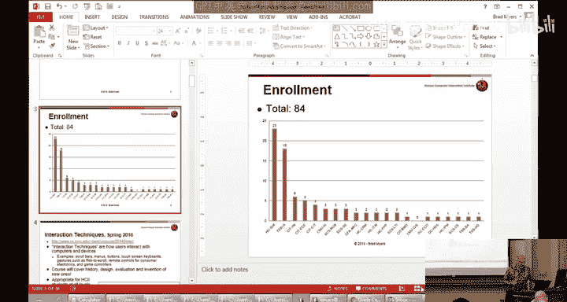

在本节课中，我们将学习如何将需求分析的结果转化为具体的设计方案。我们将探讨设计的本质、面临的权衡，并重点介绍一种关键的设计工具：快速原型设计。

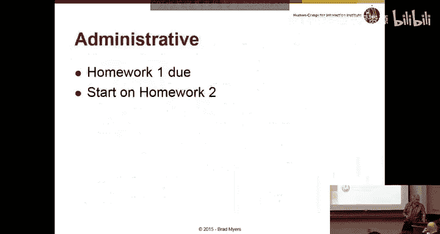

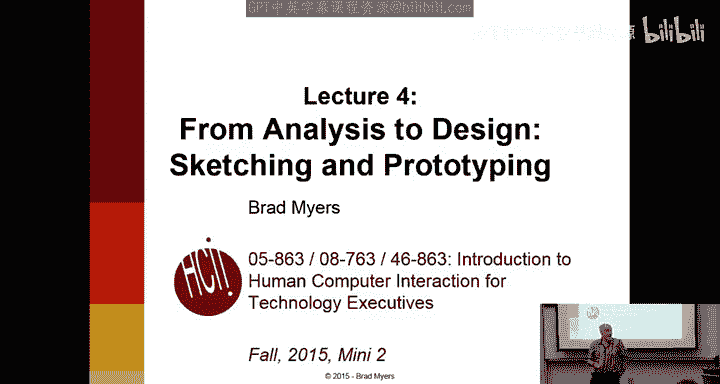

## 课程概述与作业情况

作业一提交截止时间已过。目前约有77人注册课程，比昨晚减少了7人。如果您的作业状态显示黄色感叹号，则表示提交成功。

作业有合理的迟交政策。强烈建议在周一上课前提交，这样只会扣10分（满分100分）。前三份作业适用此灵活政策，但作业四和五必须准时提交。考虑到第一份作业通常最具挑战性，额外的缓冲时间对大家很有帮助。

这是昨晚统计的学生背景分布：高中生人数最多，其次是Tepper商学院学生，然后是信息系统硕士生、INI学院学生、ECE和CIT学院学生等。很高兴看到来自不同背景的同学对人机交互感兴趣。

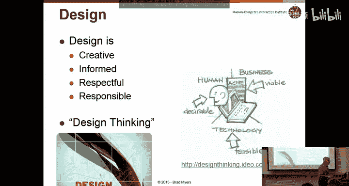

## 设计概述：从需求到方案

上一节我们介绍了如何通过情境调查等方法进行需求分析。本节中，我们来看看如何将这些需求转化为具体的设计方案。

设计是一个被过度使用的词汇。在卡内基梅隆大学，设计学院主要关注图形设计和视觉外观。我们将在周一的客座讲座中深入探讨这部分内容。在本课程中，我们特指用户界面的设计。

设计本质上是一个**创造性过程**。就像写作课程可以教你语法和结构，但无法保证你成为畅销书作家一样，本课程可以教你规则、避免常见错误以及评估技巧，但卓越的设计仍需创造力。我们的目标是让每个人都能设计出**足够好用的用户界面**。

设计是**有依据的**。它并非闭门造车，而是需要综合考虑来自情境分析、市场部门的信息以及用户需求。设计也是**负责任和尊重用户的**，旨在为目标受众创造合适的产品。

近年来兴起的“**设计思维**”概念，其核心正是设计师长久以来的工作方式：在约束条件下创造出既吸引人又能满足目标受众需求的产品。

## 设计中的核心权衡

设计的关键在于**管理各种权衡**。在现实世界中，你无法拥有一切。

*   **上市时间与资源**：作为管理者，你需要决定在可用性、功能开发和修复错误之间如何分配时间与人力成本。
*   **个性化与可用性**：这被称为“**个性化的诅咒**”。每个设计师都希望做出新颖独特的设计，但过度偏离用户熟悉的模式（例如，将网站搜索框从右上角移到别处）可能会严重损害可用性。
*   **知识产权**：直接复制他人的优秀设计（如苹果的“列表回弹”效果）可能引发专利侵权问题。这是一个复杂且法律不断变化的领域。
*   **可用性与其他标准**：可用性并非总是最高优先级。有时为了其他目标（如安全、商业策略）需要故意降低可用性。
    *   **公式**：`最终设计 = 可用性权重 * 可用性目标 + 安全性权重 * 安全性目标 + ...`
    *   **示例1（安全）**：Gates楼三楼楼梯间的特殊门禁设计，强制人员在火灾时从三楼主出口撤离，虽然降低了通行便利性（可用性），但提升了安全性。
    *   **示例2（商业）**：麦当劳使用不舒适的座椅，旨在鼓励顾客快速用餐离开；而星巴克使用舒适的座椅，希望顾客停留更久并消费更多。
*   **客户与用户**：付钱的人（客户）和使用产品的人（用户）需求可能不同，需要平衡。
*   **新功能与软件膨胀**：为了促使消费者升级，软件需要不断增加新功能，但这可能导致软件变得臃肿、复杂，从而降低可用性。

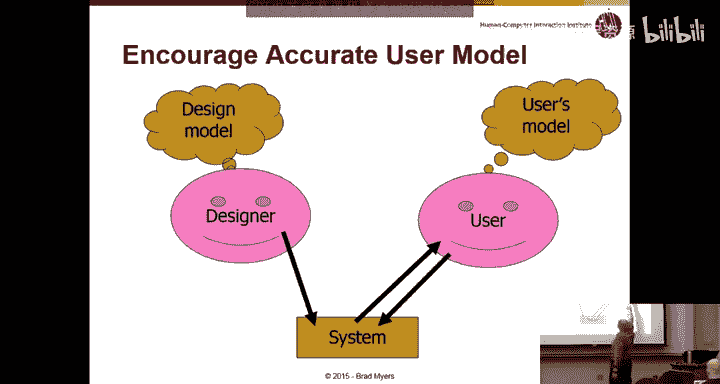

## 设计流程与原型设计的重要性

理想情况下，界面设计应与后端软件开发同步进行，但这在实践中往往很困难。许多界面需求（如撤销操作、实时表单验证）会深刻影响软件架构。

**代码示例（简化表单验证）**：
```javascript
// 低效方式：提交后由服务器返回错误
form.submit() -> server.validate() -> return error page

// 高效方式：在浏览器端实时验证，需要不同的架构
inputField.onChange() -> javascript.validateLocally() -> show instant feedback
```

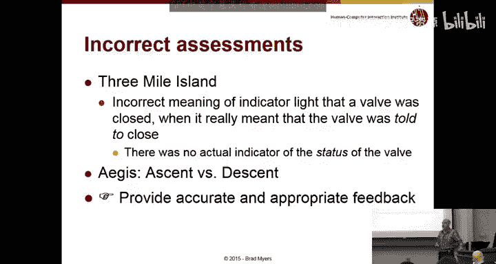

由于后端实现工作量巨大，一旦投入，很难更改。这意味着早期的错误设计决策可能导致后续陷入困境。公司通常会有产品功能发布的路线图，但也需要根据市场反馈保持敏捷。

设计分为**高层设计**和**低层设计**：
*   **高层（概念设计）**：涉及整个系统架构、隐喻（如桌面、购物车）、以及如何在不同设备上呈现。
*   **低层**：涉及具体的控件、标签名称、交互细节等。

两者都对可用性有重大影响，都需要设计和测试。设计师需要通过产品本身（界面、文档）这个狭窄的沟通渠道，让用户脑海中形成的**心智模型**与设计师的设想保持一致。如果失败，用户将无法理解产品。

**示例：老式冰箱**：用户的心智模型是两个旋钮分别控制冷藏室和冷冻室温度。但实际系统模型是一个旋钮控制制冷强度，另一个控制冷气在冷藏和冷冻室间的分配比例。这种不匹配导致用户难以调节到合适的温度。更好的设计是让系统模型符合用户的心智模型。

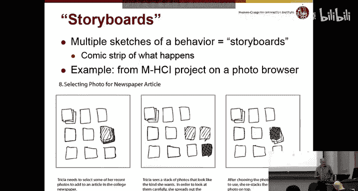

在低层设计上，有无数选择（按钮、滑块、触摸屏等）。这里引入一个核心概念：**可供性**。
*   **定义**：可供性是事物可被感知的、实际的属性，特别是那些决定事物可能如何被使用的基本属性。
*   **目标**：让用户明白可以对一个物体做什么。
*   **示例**：早期的网页链接有下划线，按钮有3D效果，这些都清晰地表明了“可点击”。现代“扁平化”设计的一个常见问题就是可供性不足，用户需要试探才能发现可操作元素。
*   **反面案例**：三哩岛核事故中，一个指示灯显示“阀门关闭信号已发送”，但操作员理解为“阀门已关闭”，这个错误的可供性反馈是事故的重要原因之一。

## 解决方案：快速原型设计

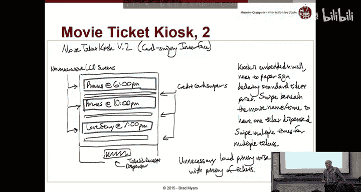

为了避免上述问题，我们采用**快速原型设计**，从草图开始。

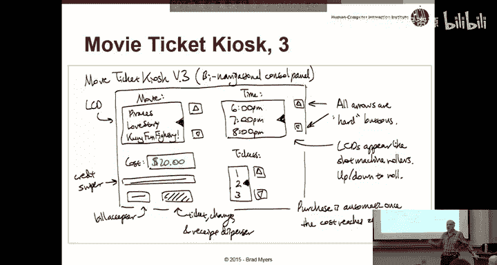

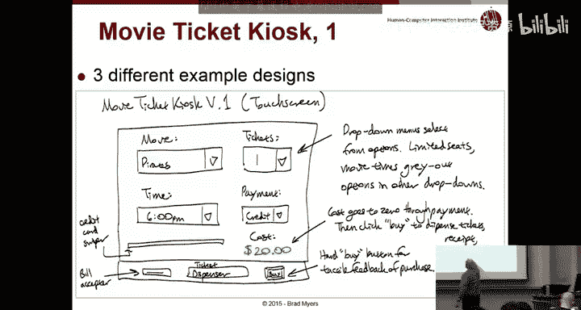

**草图**用于**决定设计什么**（探索想法），而**原型**用于**把设计做对**（细化方案）。草图是快速、廉价、可丢弃的，其低精度迫使你专注于高层设计，其模糊性允许你推迟考虑某些细节。绘制草图的过程本身就能帮助你形成和完善想法。

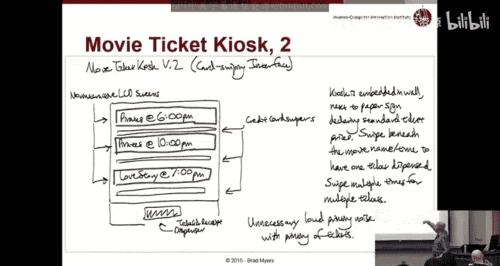

**关键原则**：产生大量不同的草图。好的想法往往源于众多的想法。

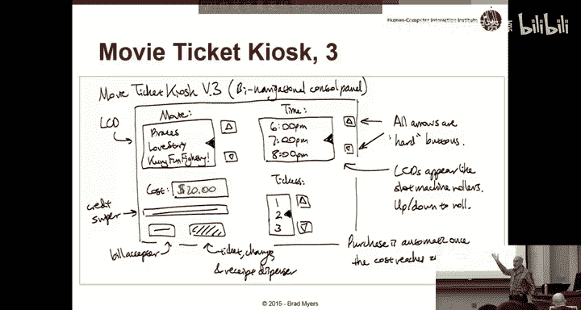

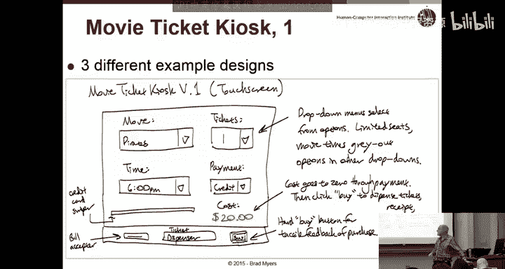

草图可以辅以**故事板**（像漫画一样展示操作序列）来表现动态过程。

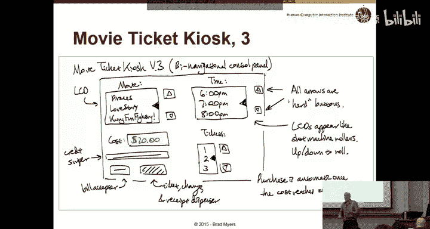

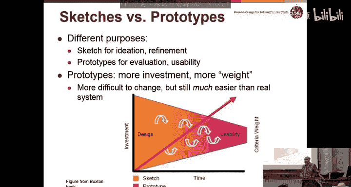

**作业二示例：电影售票亭的三个不同设计**
1.  **触摸屏菜单式**：通过弹出菜单选择电影、时间、票数，然后支付。
2.  **刷卡直购式**：每个电影选项旁配一个信用卡读卡器，刷卡即购票，无需触摸屏幕。
3.  **物理旋钮式**：通过物理上下箭头按钮控制屏幕上模拟“卷轴”来选择电影和时间。

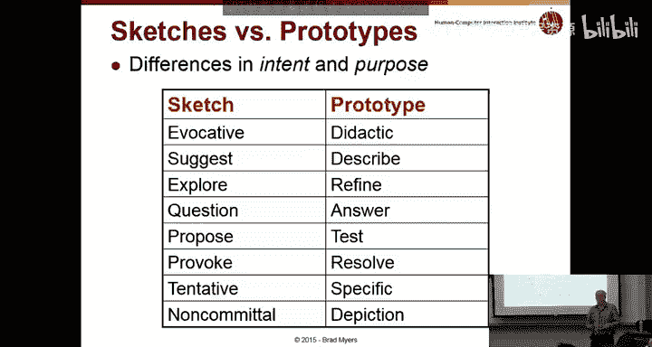

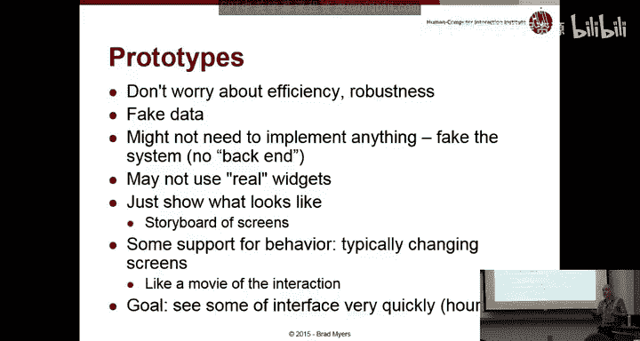

这三个设计在硬件成本、交互方式、适用场景上截然不同，体现了不同的设计权衡。

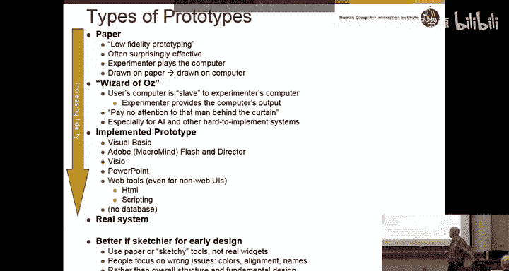

## 原型保真度与用途

原型有不同的保真度层次：
1.  **纸面原型（低保真）**：手绘草图，非常有效，能让用户专注于概念和高层交互，而非视觉细节。
2.  **绿野仙踪原型（中保真）**：用户面对一个看似运行的界面，实际上由实验者在幕后操控。无需实现功能即可模拟交互。
3.  **可交互原型（高保真）**：使用工具（如PPT、Figma）创建可点击的模拟界面。
4.  **实现原型（代码实现）**：部分或全部功能被编码实现。

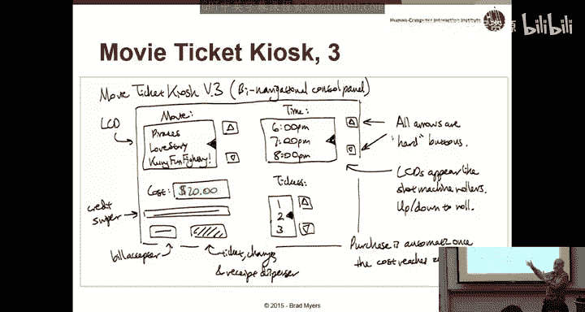

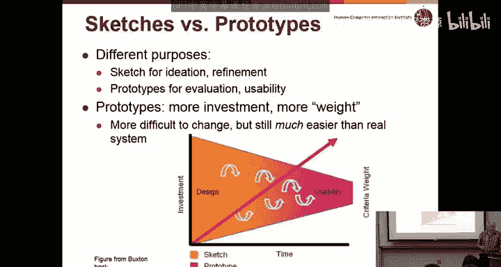

有趣的是，**低保真原型在获取高层设计反馈方面通常比高保真原型更有效**，因为它避免了参与者纠结于颜色、字体等细节问题。

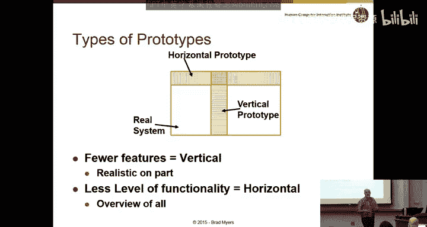

原型还分为：
*   **水平原型**：展示整个界面的广度，但功能不深入。
*   **垂直原型**：深入实现某个特定功能或交互（如测试“滑动滚动”的最佳参数），用于解决特定设计难题。

原型的用途广泛：
*   **测试设计概念**：这个想法可行吗？用户能理解吗？
*   **沟通想法**：向经理、团队或客户展示设计概念。
*   **作为设计规范**：为开发团队提供清晰的视觉化实现指南，比文字描述更直观有效。
*   **参与式设计**：让用户基于原型提出改进意见，比凭空想象更容易。

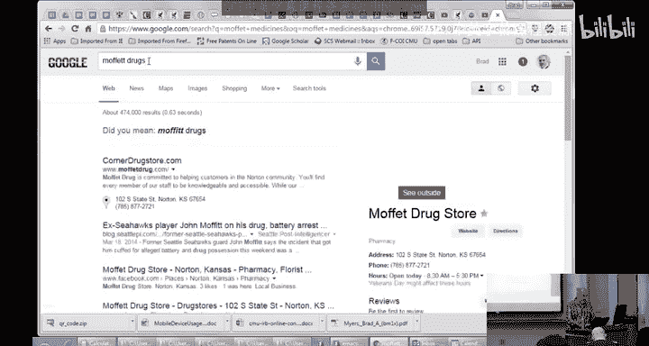

## 作业与实践演示

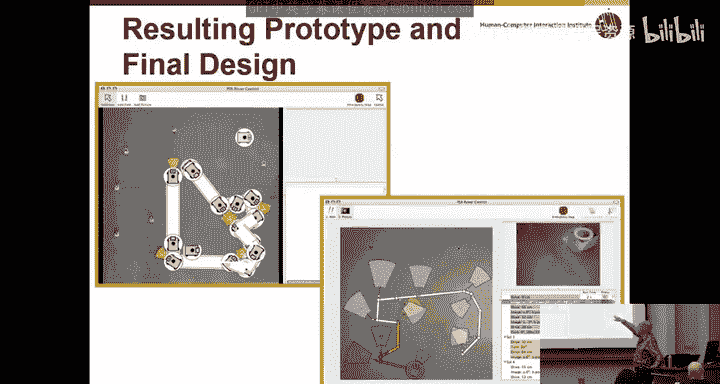

在作业二中，你需要为选定的设备构思**三个截然不同的设计草图**（部分B），然后选择其中一个，绘制出**包含所有控件的完整、详细的界面草图**（部分C），为后续的用户测试做准备。

我们观看了一段视频，演示了如何使用纸面原型进行用户测试。用户和测试者通过“扮演”计算机和操作者，能够有效地发现设计中的问题，即使界面是手绘的。这种方法简单但功能强大。

在作业三中，你将使用这样的纸面原型进行用户测试。在作业四中，你将创建一个更高保真度的可交互原型。

## 总结

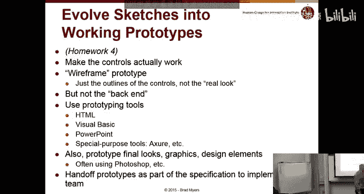

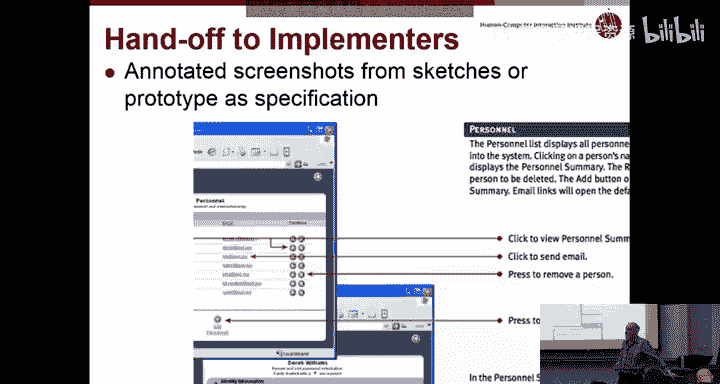

本节课中我们一起学习了如何从需求分析过渡到设计阶段。我们认识到设计是一个充满权衡的创造性过程，并介绍了**快速原型设计**这一核心方法，特别是从**草图**开始的重要性。通过创建和测试低保真原型，我们可以高效地探索设计概念、沟通想法并发现潜在问题，为后续的高保真设计和最终实现奠定坚实基础。请记住，在作业中要努力构思真正不同的设计方案，并为详细原型考虑周全所有的界面元素。