# 人机交互导论：P5：图形与交互设计基础 🎨

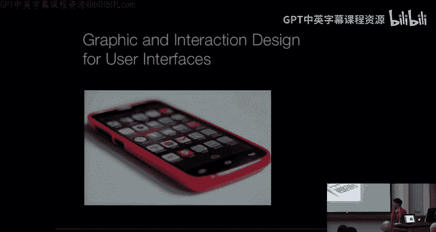

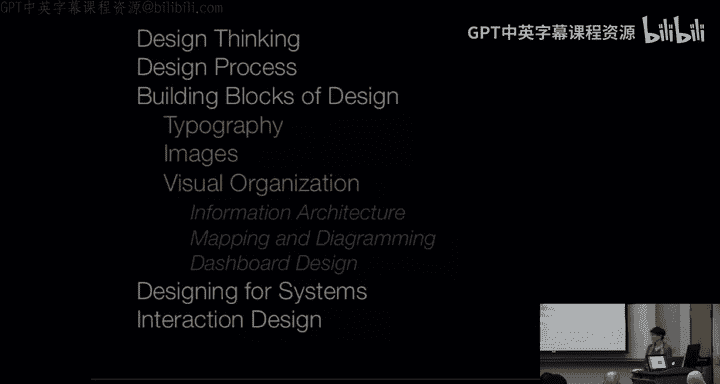

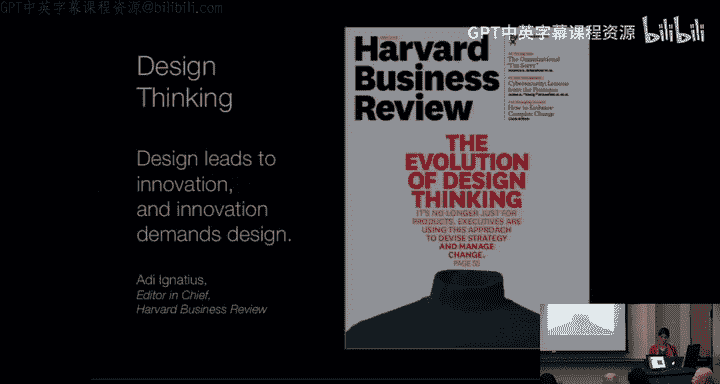

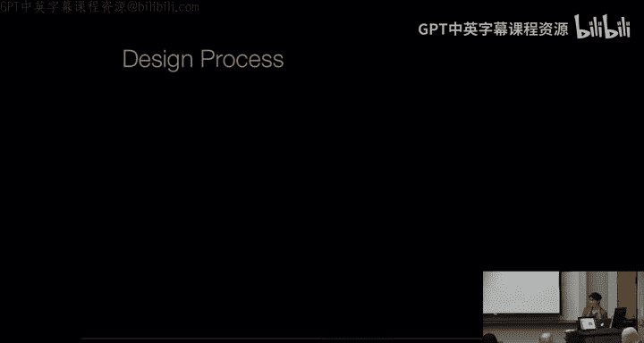

在本节课中，我们将学习图形与交互设计的核心概念。课程将涵盖设计思维、设计流程、设计的构成要素（排版、图像、视觉组织），以及如何为系统和交互进行设计。这些知识对于完成课程作业和提升整体设计素养都至关重要。

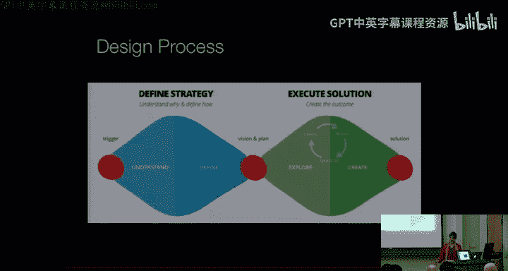

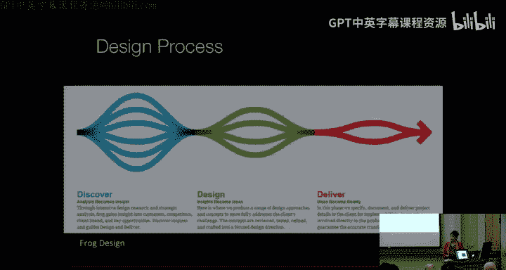

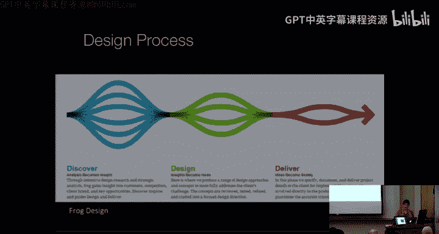

## 设计思维与流程 🔄

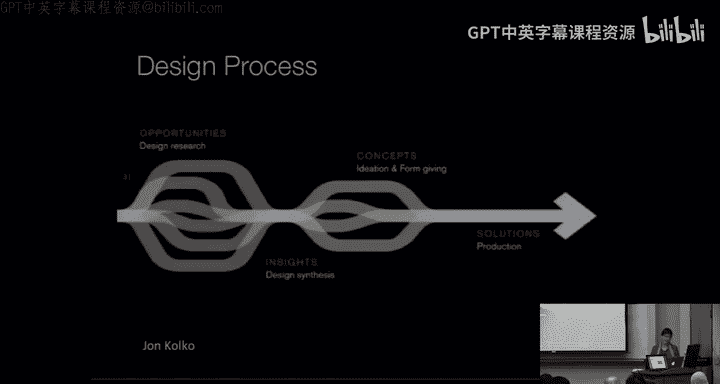

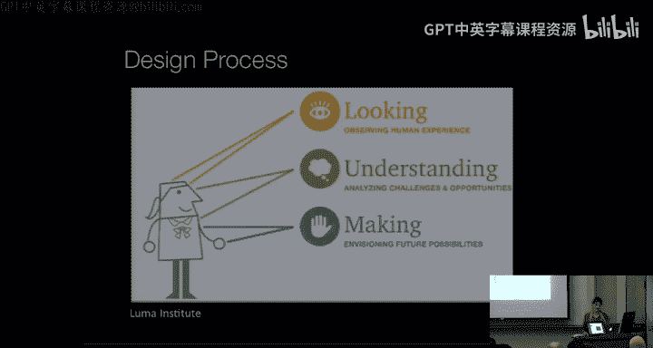

上一节我们介绍了课程概述，本节中我们来看看设计思维及其流程。设计思维是一种以人为本、以解决方案为导向的创造性过程。许多知名公司和机构都总结了自己的设计流程模型。

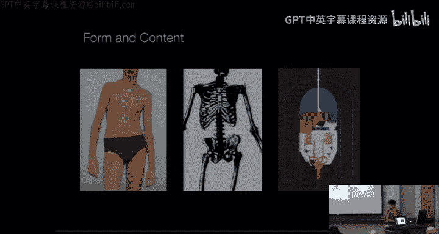

以下是几种常见的设计流程可视化模型：

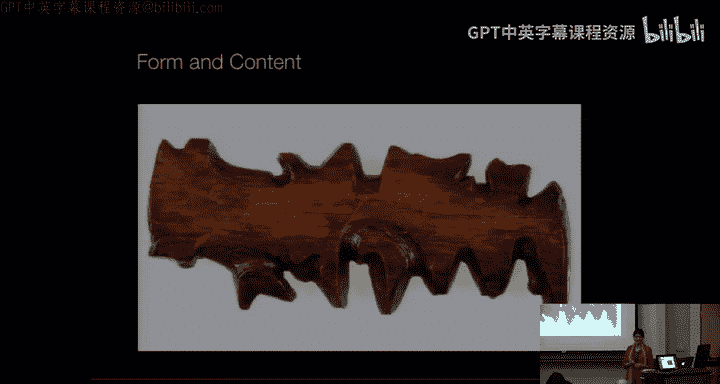

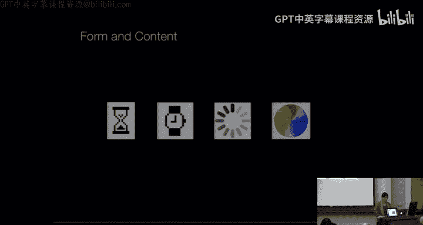

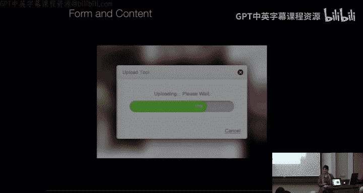

*   **莱索漏斗模型**：该模型描述了设计过程中的“发散”与“收敛”两个阶段。设计师首先需要发散思维，探索尽可能多的可能性，然后逐步收敛，聚焦并精炼出最终方案。
*   **双钻模型**：该模型将设计过程分为四个阶段：**发现**（研究问题或机会）、**定义**（明确问题）、**构思**（探索解决方案）和**实现**（制作原型并测试）。这是一个不断迭代的过程。
*   **青蛙设计模型**：这是一个简化的三阶段模型：**发现**、**设计**和**交付**。交付阶段包括用户测试和反馈，从而引导进一步的优化。
*   **斯坦福设计学院模型**：该模型强调共情，包含五个阶段：**共情**（理解用户）、**定义**（定义问题）、**构思**（产生创意）、**原型**（制作原型）和**测试**（测试并获取反馈）。
*   **LUMA学院模型**：该模型将设计活动归纳为三大类：**观察**（了解情况）、**理解**（分析洞察）和**创造**（制作解决方案）。

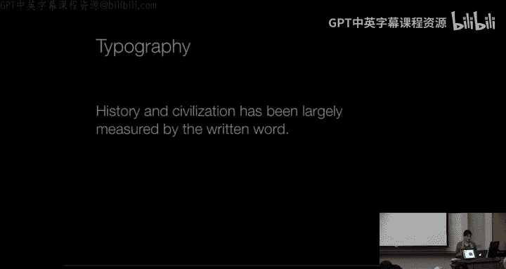

这些模型都体现了设计是一个不断探索、定义、创造和精炼的循环过程。

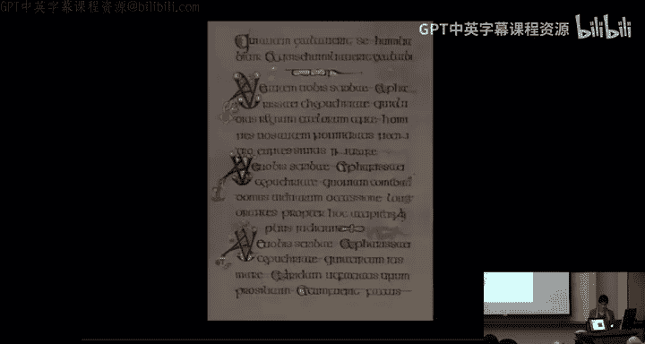

## 设计的核心：形式与内容 🎭

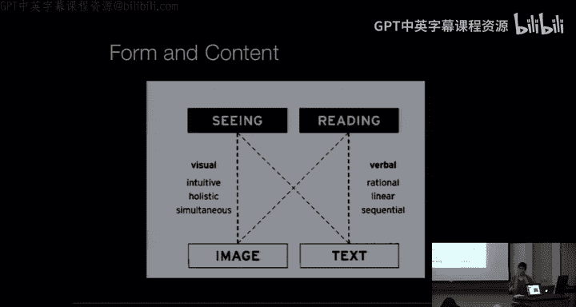

在深入具体设计要素之前，我们需要理解一个贯穿所有设计领域的核心概念：**形式**与**内容**。形式指的是事物看起来的样子，而内容指的是事物实际是什么。设计师需要不断思考这两者之间的关系，并寻求它们之间的无缝融合。

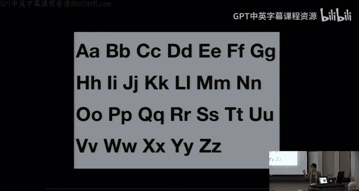

例如，三张描绘男性躯干的图像（内容相同），可以分别以古典雕塑、现代摄影和抽象绘画（形式不同）来呈现。设计师需要根据目标受众和具体情境，选择最合适的形式来传达内容。

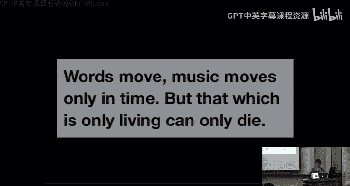

设计不仅仅是装饰。优秀的设计通过形式有效地传达内容，甚至提升内容的体验。例如，进度条（形式）本身并不加快下载速度（内容），但它通过向用户提供反馈，缓解了等待的焦虑。

## 设计的基石之一：排版 📝

排版是所有书面沟通的基础。它同时具有视觉属性和语言属性。文字可以被“阅读”（线性的、理性的），也可以被“观看”（整体的、直觉的）。

排版涉及多个层面：字母、单词、句子和段落。设计师通过控制字体、大小、行距、对齐和留白等方式，来组织文本，影响阅读的节奏和信息的层次。

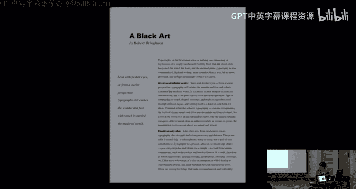

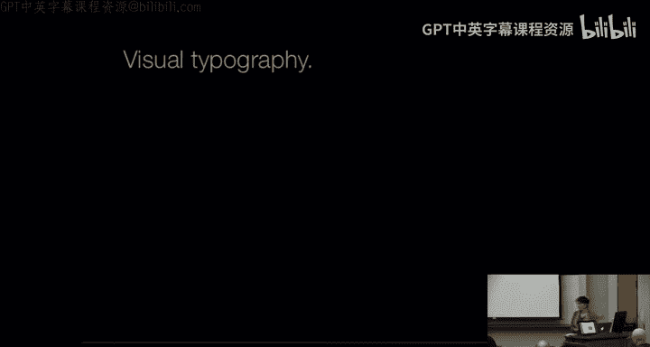

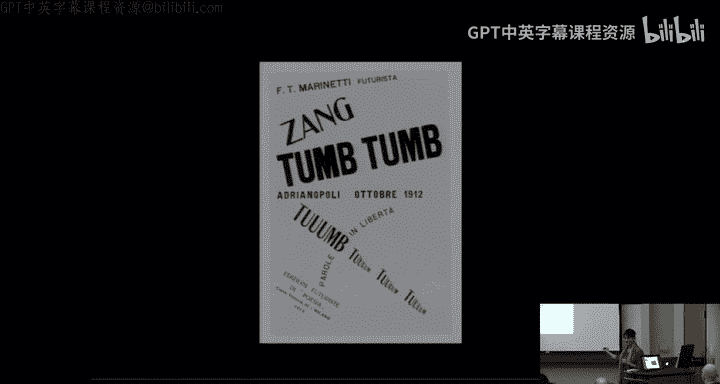

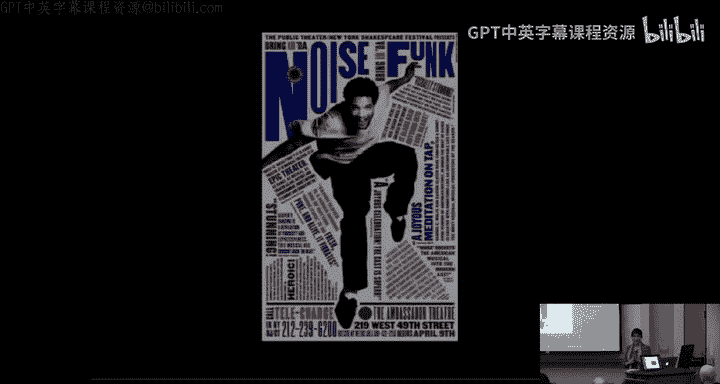

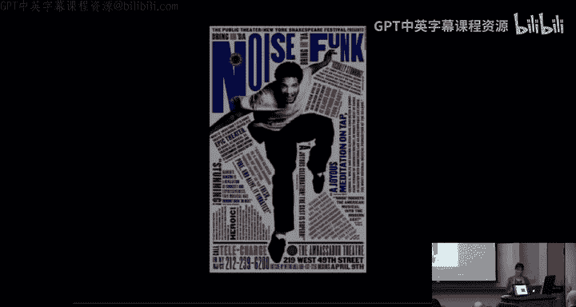

以下是一个文本排版演变的例子，展示了如何通过视觉组织来提升内容的可读性和吸引力：

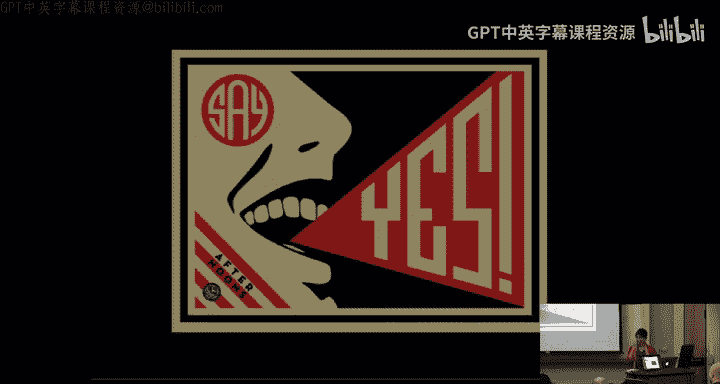

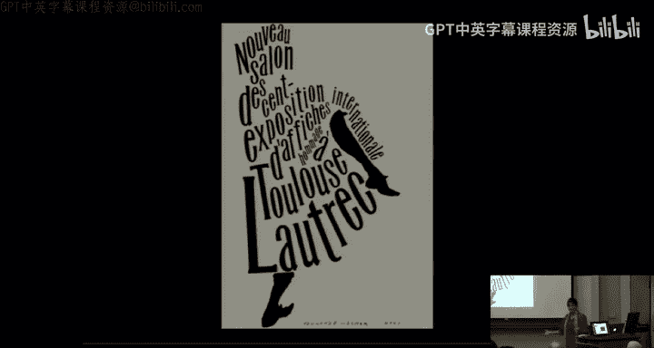

1.  **原始状态**：大段未经排版的文本，缺乏视觉层次。
2.  **调整留白与布局**：改变页边距和文本位置，创造清晰的视觉入口点。
3.  **处理文本纹理**：调整字距和行距，使文本块看起来均匀、舒适。
4.  **添加标题与提要**：使用大标题吸引注意力，并用副标题或提要概括内容，引导读者深入阅读。
5.  **运用渐进披露**：将长文分割为小块，添加小标题，让读者可以自由选择阅读深度，降低阅读压力。

通过这一系列设计决策，完全相同的内容从一堆枯燥的文字，变成了一个层次清晰、易于阅读且具有美感的版面。

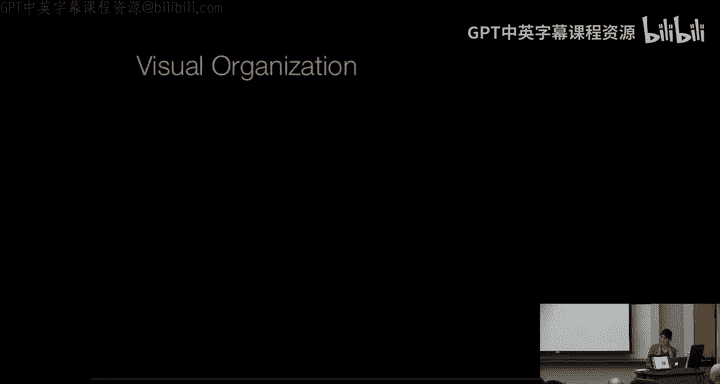

## 设计的基石之二：图像 🖼️

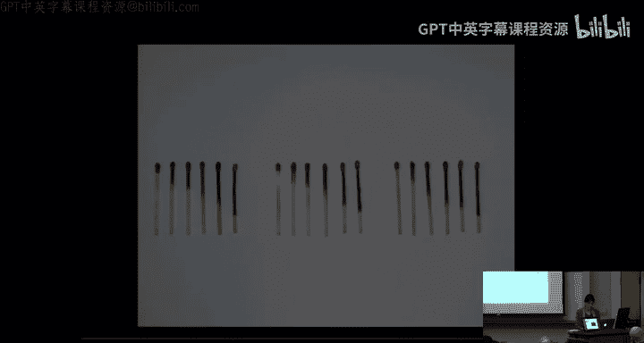

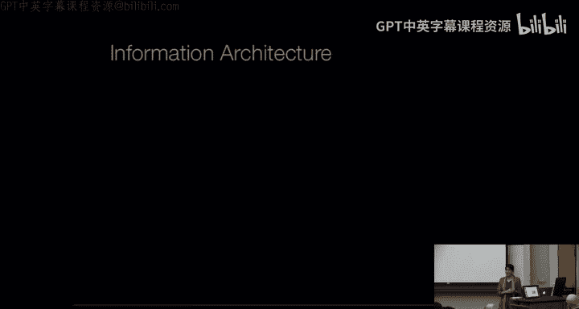

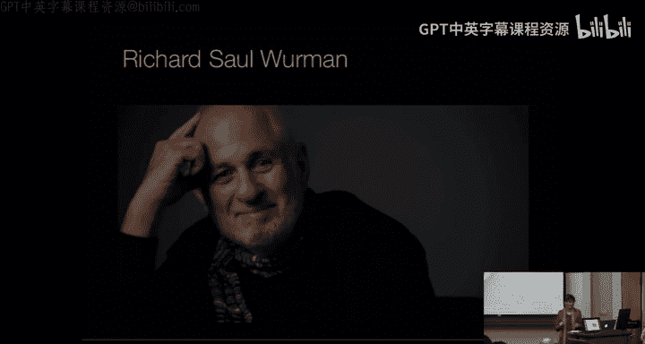

图像同样包含形式与内容。例如，一个青椒（内容）可以用写实照片或抽象线条画（形式）来表现。设计师通过选择不同的形式来传达不同的情感和含义。

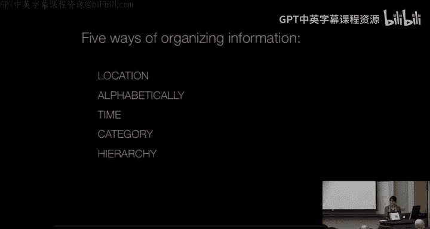

文字与图像的结合能产生强大的化学反应。同一张图片，配上不同的文字说明，可以引导观众产生截然不同的理解。这体现了设计师在塑造意义和引导感知方面的力量。

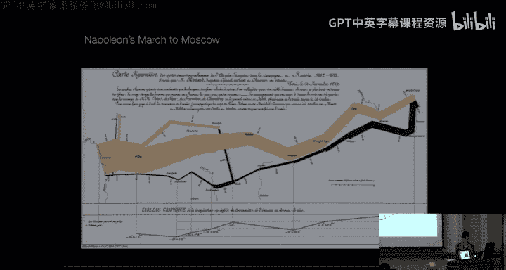

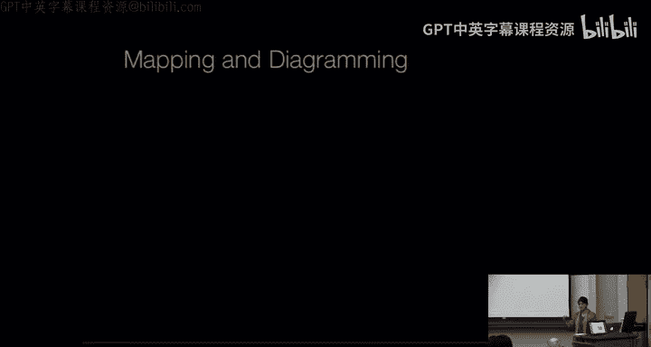

## 设计的基石之三：视觉组织 📊

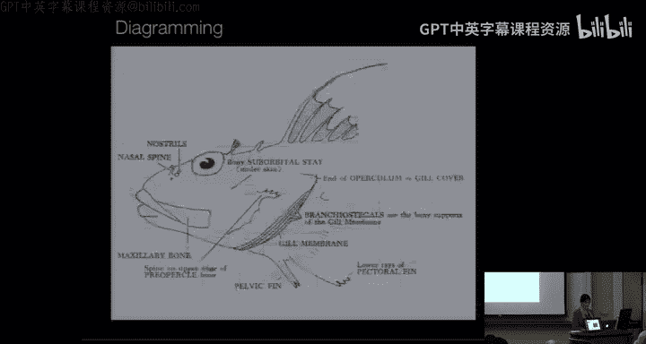

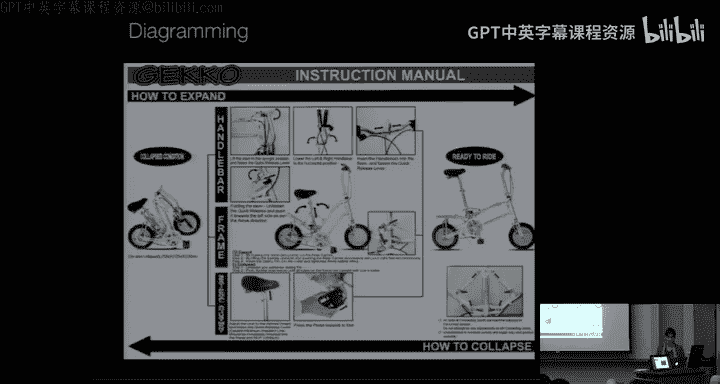

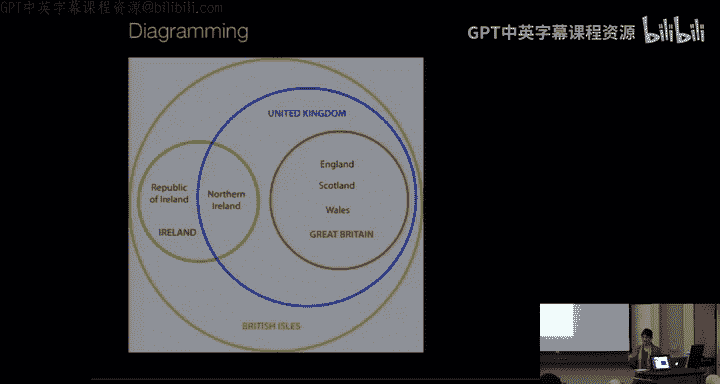

视觉组织是设计师将混乱信息变得清晰有序的关键能力。就像把散落的火柴棍排列成有意义的图案一样，设计师通过组织信息来揭示其内在结构和关系。

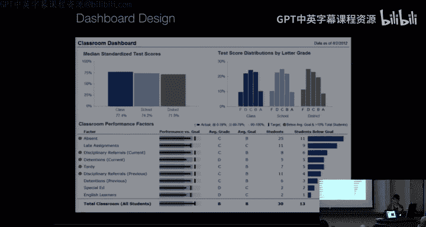

信息架构是视觉组织的高级形式。理查德·索尔·沃尔曼认为，信息组织方式不外乎五种：**按位置**、**按字母顺序**、**按时间**、**按类别**和**按层级**。

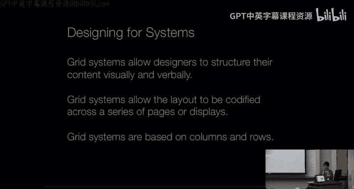

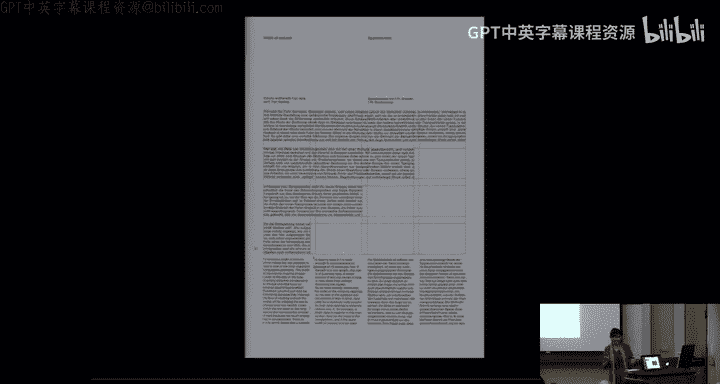

*   **地图与图表**：这是抽象和简化的过程。例如，伦敦地铁图从复杂的地理地图演变为高度抽象、只关注连接关系的拓扑图，极大地提升了可用性。
*   **仪表盘设计**：仪表盘是呈现实时数据、提示关键行动的信息界面。同样的数据集，不同的视觉设计会突出不同的重点，从而影响使用者的决策。设计师有责任确保设计能准确、清晰地传达数据的核心含义。

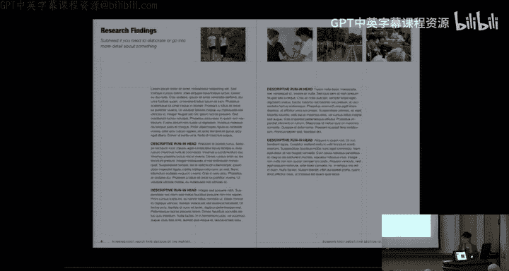

## 为系统设计：网格系统 📐

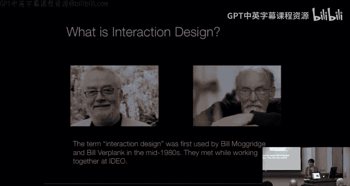

当设计扩展到整个系统（如多页文档、网站或应用程序）时，需要一套统一的结构来保持一致性，这就是网格系统。网格由不可见的列和行组成，为放置文本和图像提供了对齐基准。

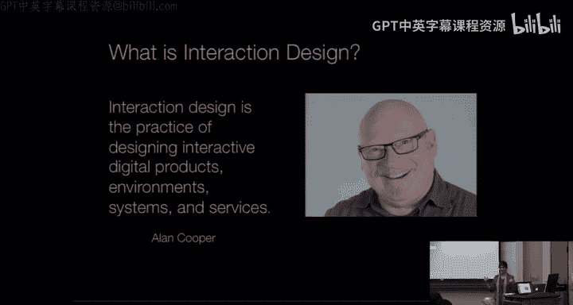

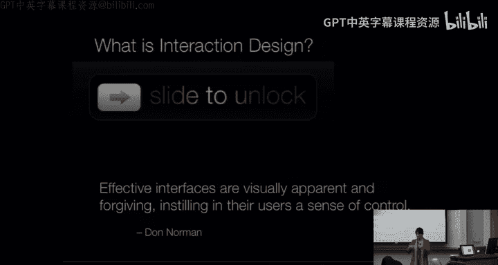

使用网格系统，设计师可以高效地创建出一系列风格统一、布局和谐的页面。它确保了设计元素在整个系统中的秩序感和专业性。

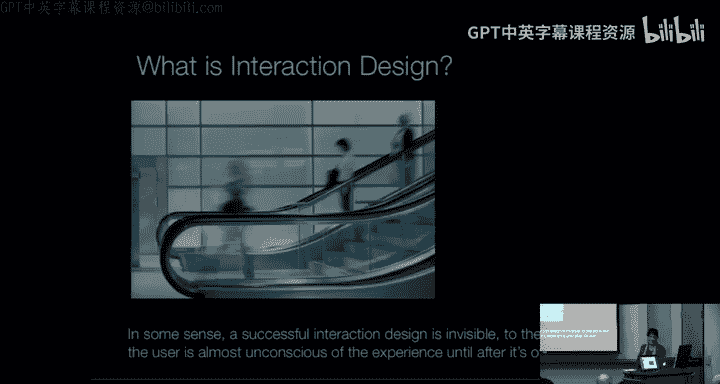

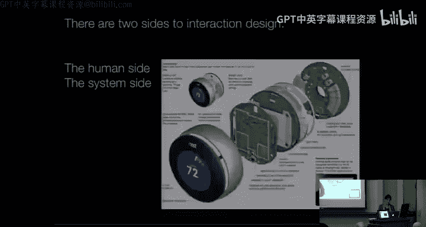

## 交互设计基础 💻

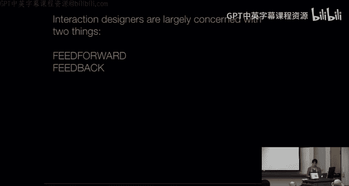

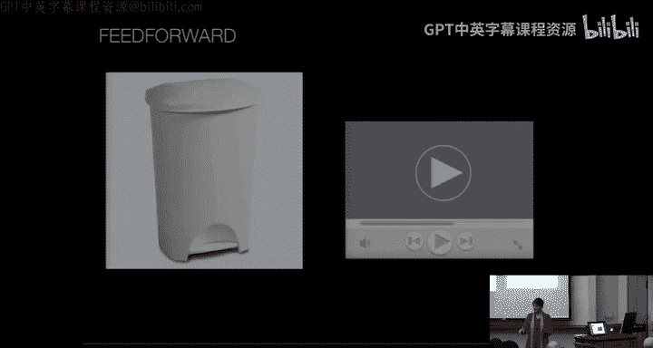

交互设计专注于设计数字产品、环境、系统和服务的交互行为。其目标是创建直观、易用且令人愉悦的交互体验。

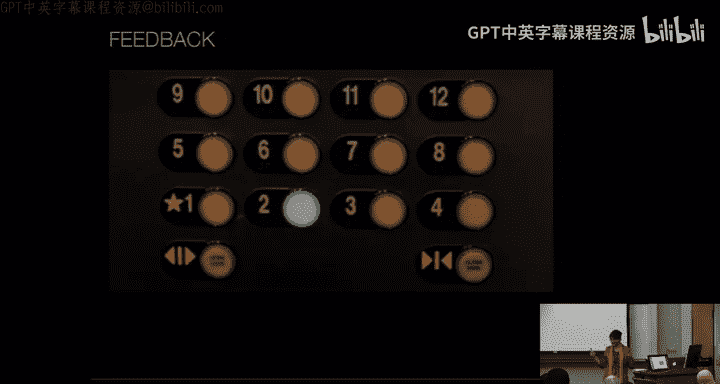

艾伦·库珀将其定义为“设计交互式数字产品、环境、系统和服务的实践”。有效的交互界面应该是视觉上清晰明了且宽容的，能让用户产生掌控感。最好的交互设计往往是“隐形的”，用户在使用过程中几乎意识不到它的存在，直到交互顺利完成。

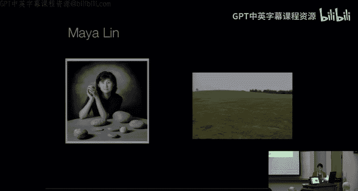

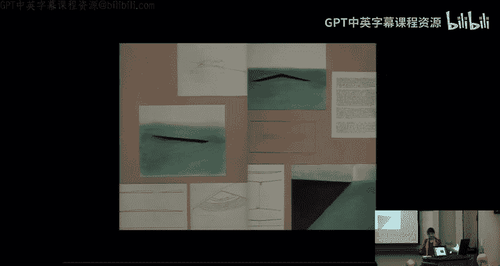

交互设计需要平衡**人的需求**与**系统的能力**。设计师需要思考用户的意图、感知、认知、情感和行为，同时考虑系统的传感器、反馈机制、数据计算和状态变化。

在交互设计中，有两个关键概念：

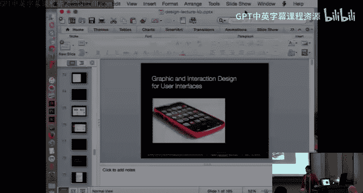

*   **前馈**：设计元素能够暗示正确的操作方式。例如，一个带有凹陷踏板图案的垃圾桶，暗示了用脚踩踏打开的方式；一个向右的箭头图标，暗示了播放或前进的功能。
*   **反馈**：系统对用户操作做出清晰、及时的响应。例如，点击按钮后按钮颜色变化，提交表单后显示“提交成功”的提示。反馈对于建立用户信任至关重要。

## 案例研究：越战纪念碑 ✨

越战纪念碑是形式与内容、排版与组织完美结合的典范。设计师玛雅·林面临的挑战是：设计一个能容纳6万多个阵亡者姓名、具有沉思性、与环境和谐且不涉及政治声明的纪念碑。

她的解决方案是：一面嵌入地面的、光亮的黑色花岗岩“V”形墙。墙上的名字按阵亡日期顺序排列，而非字母顺序。这一关键的设计决策（组织方式）使得纪念碑的意义从“查找姓名”的电话簿，转变为一次“追寻与缅怀”的旅程。参观者沿着时间线行走，触摸名字，感受战争的规模与个人的牺牲，这极大地增强了纪念的情感冲击力。

## 总结 📚

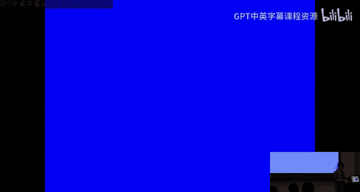

本节课我们一起学习了图形与交互设计的基础知识。我们从设计思维和流程入手，理解了形式与内容这一核心关系。接着，我们深入探讨了设计的三大基石：排版、图像和视觉组织，并了解了如何通过网格系统为大型项目建立秩序。最后，我们聚焦于交互设计，学习了前馈与反馈等关键原则，并通过越战纪念碑的案例看到了优秀设计如何通过精心的形式与内容安排，产生深远的情感与思想影响。记住，优秀的设计是隐形的仆人，它通过清晰、有效且充满敬意的方式，服务于内容和用户。