# 人机交互导论：第六讲：如何设计有效的可用性评估 📊

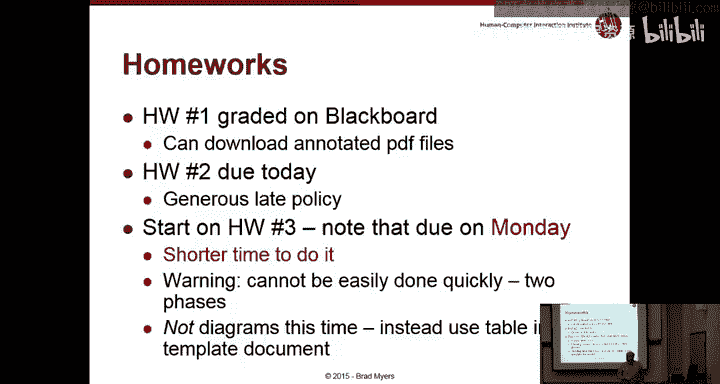

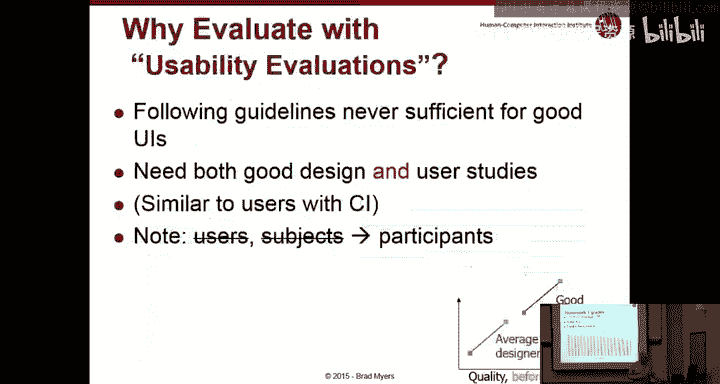

在本节课中，我们将学习如何设计一个有效的可用性评估。这是你们即将开始的下一项作业的核心内容。我们将探讨可用性评估的重要性、设计步骤、关键考量因素以及如何分析和报告结果。

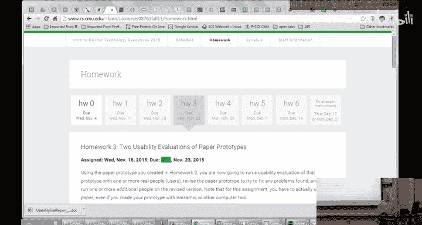

## 课程概述与作业安排

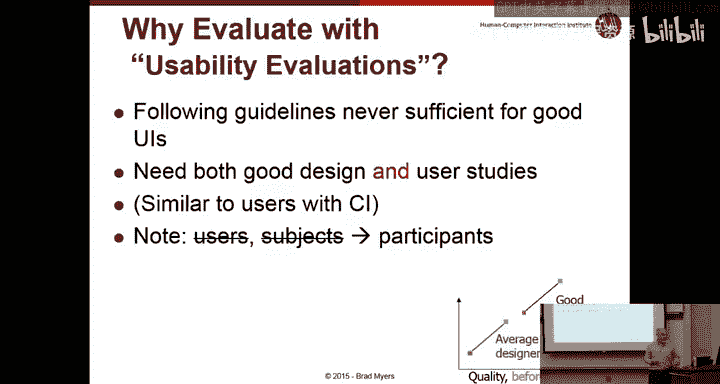

上一讲我们讨论了原型设计，本节我们将聚焦于如何评估这些原型的可用性。

首先，关于作业安排。作业一的成绩已发布，请查收带有详细评语的PDF版本。作业二今天截止。现在，你们应该开始着手作业三了。由于下周是感恩节假期，作业三的截止日期是下周一，你们只有五天时间完成。这项作业分为两个阶段，无法在最后一刻仓促完成。

作业三是一项用户研究，与作业一类似，但呈现答案的方式完全不同。这次你们将使用一个特定的模板来填写答案，而不是绘制图表。模板的核心部分是一个大表格，用于记录在用户测试中发现的所有问题。

## 为什么可用性评估至关重要？🔍

即使通过情境调查深入理解用户并遵循设计指南，或者聘请优秀的设计师，也不足以保证能设计出完美的用户界面。研究表明，即使是最好的设计师也会存在盲点，会做出自己认为合理但用户感到困惑的设计。因此，可用性评估对于改进任何设计都至关重要。

需要明确的是，可用性评估不同于质量保证测试。虽然你可能会在可用性测试中发现程序错误，但其主要目的不是寻找漏洞，而是观察典型用户如何完成典型任务。它也不是让团队成员或焦点小组来评价界面。关键在于观察参与者在尽可能接近真实的环境下，如何实际操作系统，而不是仅仅询问他们的意见。

## 评估设计的关键考量

设计评估时，需要仔细规划。首先要明确评估的目的：是形成性评估（用于理解功能、竞品分析）还是总结性评估（用于测试已设计好的产品）。今天的重点在于后者。

在正式测试前，进行试点评估总是个好主意。这能帮助你发现说明材料是否清晰、任务设置是否合理，或者是否存在一些干扰测试核心目标的混杂因素。

当需要比较两个不同版本的设计时，有两种主要的研究设计方法：
*   **组内设计**：每位参与者都尝试两个版本。这可以消除个体差异的影响，但会引入顺序效应（例如，先尝试A版本可能会影响对B版本的表现）。
*   **组间设计**：一半参与者尝试A版本，另一半尝试B版本。这避免了顺序效应，但需要更多的参与者来平衡个体差异，通常采用随机分配的方式来确保公平性。

## 可用性评估中可以测量什么？📏

除了发现可用性障碍，我们还可以量化测量许多方面：
*   **易学性**：新手首次使用能否完成任务？可测量成功前的尝试次数、查看帮助的频率或完成任务所需时间。
*   **效率**：专家用户使用时的效率。可测量任务完成时间、固定时间内完成的任务数量或质量。
*   **错误率**：用户犯错频率、从错误中恢复所花时间或错误的严重性。
*   **用户满意度**：通过标准化问卷（如系统可用性量表SUS）获取主观满意度分数，便于与旧版本或竞品进行比较。

拥有这些量化数据的好处是，你可以向管理层或工程师提供客观、可衡量的证据，证明设计的改进程度。这就是所谓的“可用性工程”。你可以为各项指标设定目标值，例如将任务完成时间从20分钟减少到10分钟。

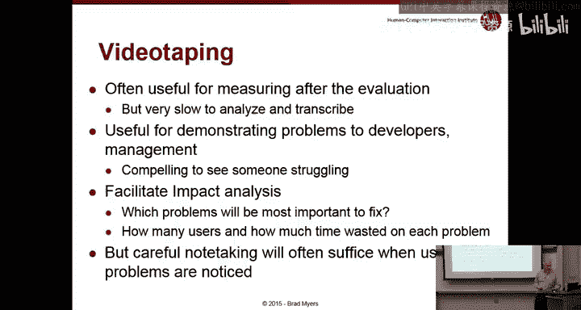

## 设计问卷与“出声思考”法

设计问卷时，建议使用**李克特量表**（例如：1=非常不同意，5=非常同意）或**语义差异量表**（例如：困难 --- 容易）。关键是要确保所有问题的正面表述方向一致，避免用户因阅读不仔细而给出无效答案。

在可用性评估中，**“出声思考”法**被认为是最有价值的方法之一。它要求参与者在操作界面时，实时说出他们的想法和困惑。这能帮助你理解用户行为背后的“原因”，而不仅仅是“发生了什么”。虽然这可能会影响任务完成时间的精确测量，但通常理解原因比精确计时更重要。 facilitator需要不断鼓励用户说出想法，但要注意提问方式，避免暗示答案。

## 招募参与者与伦理考量

应尽可能招募具有代表性的目标用户。对于B2B产品，可以联系客户公司，他们通常乐于参与，因为这有助于改进使其员工更高效的工具。有时需要提供报酬或小礼物，尤其是针对专业人士时。

关于需要多少用户，研究发现，在寻找界面问题的可用性测试中，**5名用户**通常就能发现大部分（约80%）的可用性问题。随着用户数量增加，发现新问题的收益会递减。因此，采用迭代测试和修复的策略是高效的。

进行用户测试时必须遵守伦理规范：
*   确保数据匿名，保护参与者隐私。
*   强调是“测试系统”，而非“测试用户”，减轻参与者的表现压力。
*   如果用户感到沮丧，应适时停止测试。
*   大学等机构通常设有伦理审查委员会来监督涉及人类受试者的研究。

## 执行评估：步骤与技巧

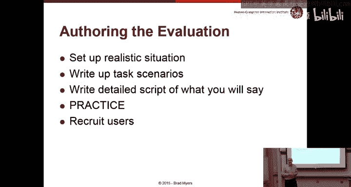

一次完整的评估包含多个阶段：准备、介绍、执行和收尾。

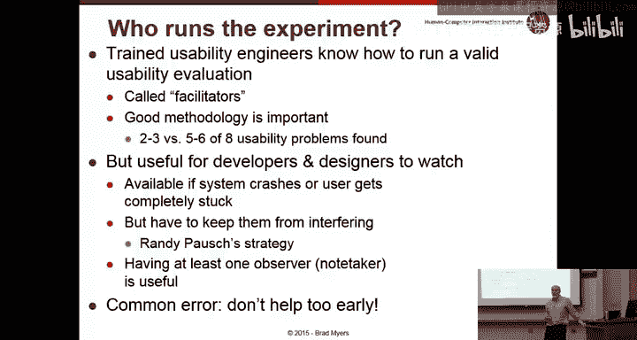

**准备阶段**：准备好所有材料、软件和设备。编写详细的测试脚本。

**介绍阶段**：向参与者解释测试目的，签署知情同意书（如需），进行前测问卷。明确说明将使用“出声思考”法，并告知测试中你将不会提供帮助。

**执行阶段**：按照脚本引导参与者完成任务。作为facilitator，你的任务是观察、记录和适时鼓励用户说出想法，但避免给予提示。如果让设计师或工程师旁观，需要防止他们过早干预。

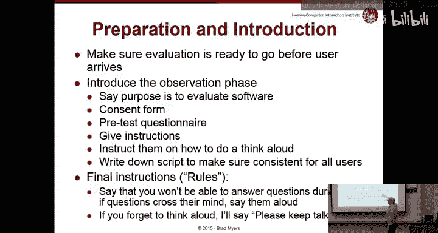

**收尾阶段**：进行后测问卷，感谢参与者。清理测试环境，为下一位参与者重置系统状态（如清除浏览器缓存、历史记录）。

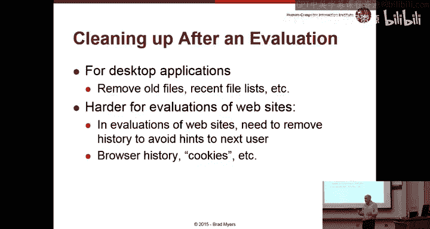

## 分析数据与撰写报告

分析数据时，对于量化数据（时间、错误数）可以计算平均值、寻找异常值。对于发现的可用性问题，需要按**严重性**（从低到高）和**范围**（是局部问题还是全局问题）进行整理和优先级排序。严重性高且范围广的问题必须优先修复。

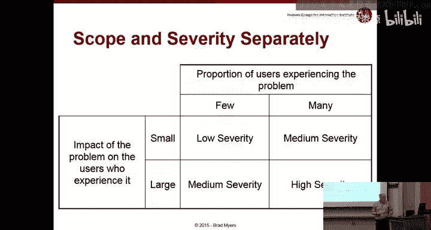

报告应清晰明了。在作业模板中，你们需要提供用户描述、测试脚本、文字记录以及一个核心问题表格。表格中需包含问题截图、描述、原因分析、范围、严重性、修复建议及可能存在的权衡。

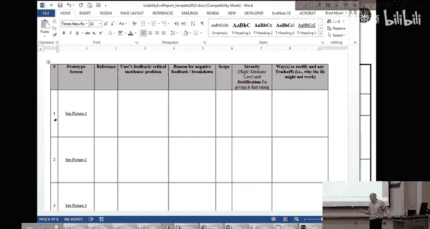

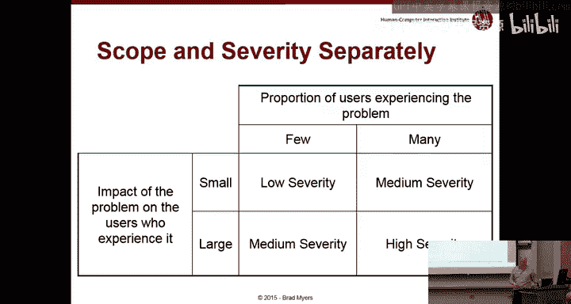

在实际工作中，你通常还需要向管理层或团队提交一份执行摘要，突出最关键的问题，并可以辅以视频片段来生动地展示问题。

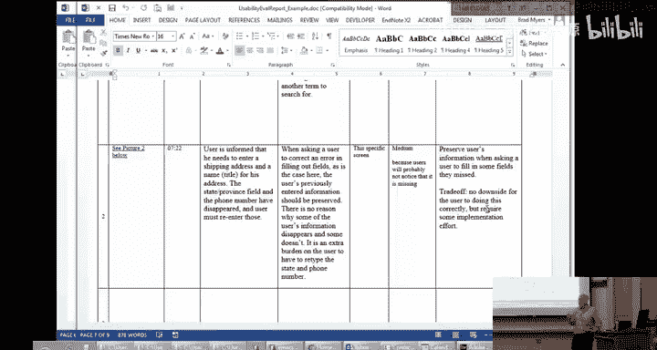

## 关于原型与作业的补充说明

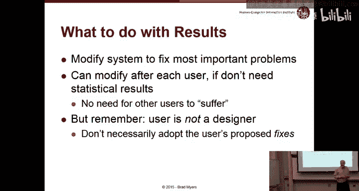

有效的原型对于可用性测试至关重要。它应该看起来像一个完整的产品，包含所有可能让用户分心或困惑的“干扰项”，这样测试结果才真实。例如，一个网页原型即使后台没有功能，前端的链接、按钮布局也应与最终产品一致，以便测试用户的导航能力。

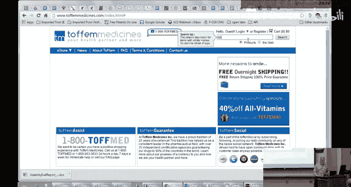

最后，关于作业三，请记住它分为两部分：对第一个用户进行测试并发现问题；然后修改原型，再对第二个用户进行测试。你们需要在提供的模板中记录至少两个问题，并说明所做的设计更改。

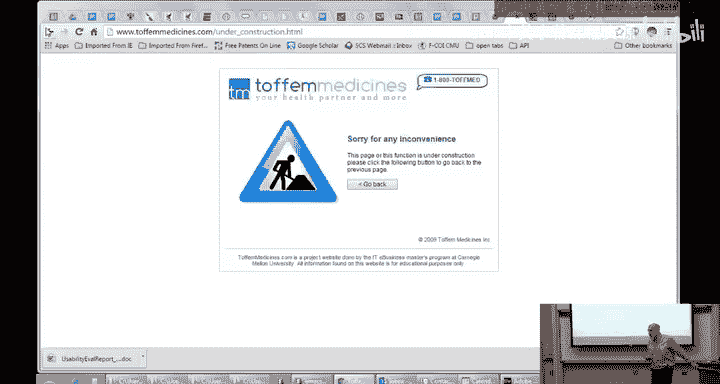

## 课程总结

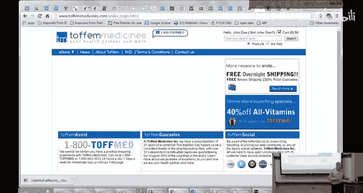

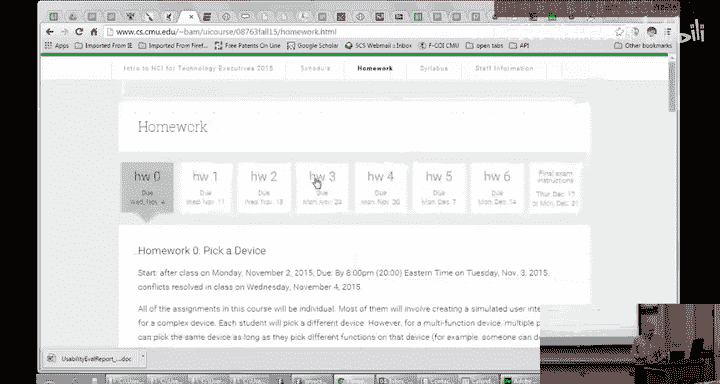

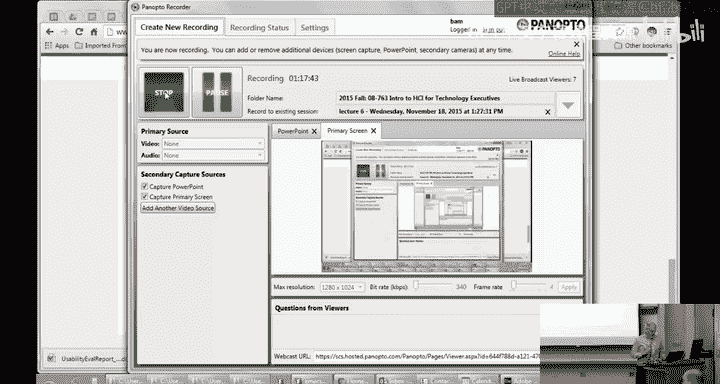

本节课我们一起学习了如何设计有效的可用性评估。我们了解了评估的重要性、各种考量因素（如组内/组间设计）、可测量的维度、设计问卷的技巧以及核心的“出声思考”法。我们还讨论了招募用户的策略、伦理规范、执行测试的具体步骤以及如何分析和报告发现的问题。记住，可用性评估是一个迭代的过程，是打造优秀用户体验不可或缺的环节。