# 08：启发式评估 📋

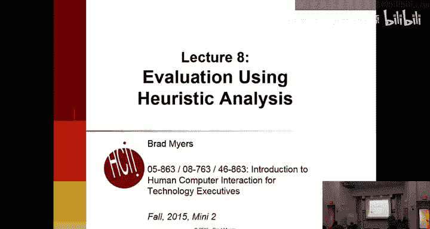

在本节课中，我们将学习如何进行启发式评估，这是评估用户界面的一种系统化方法。我们将详细介绍尼尔森的十条可用性启发式原则，并学习如何应用这些原则来分析和改进界面设计。

## 概述

启发式评估是一种由专家根据特定指导原则（启发式原则）来检查整个用户界面的方法。它不同于用户研究，其目标是全面覆盖界面，而非仅关注特定任务。这种方法成本低廉、效率高，但依赖于评估者的判断。接下来，我们将深入探讨其具体方法和核心原则。

## 什么是启发式评估？

启发式评估本质上是一种基于特定指导原则的界面评估方法。这个术语及其原则由雅各布·尼尔森提出。其核心思想是由专家（即正在学习的你们）来评估系统。

它与用户研究不同。在用户研究中，用户执行特定任务。而启发式评估的目标是覆盖整个界面，但它仍然成本低廉且易于高效执行。然而，这种方法依赖于评估者的判断，需要评估者决定系统在多大程度上违反或遵守了这些规则。

它被称为“折扣”评估法，因为它廉价且快速。尼尔森的研究表明，与后期修复问题或进行用户研究相比，进行启发式评估的成本效益最高可达50倍。

启发式评估是对整个系统的系统性检查。不同的评估者可能会发现不同的问题，因此让多人评估同一界面是有益的。研究还表明，受过训练的评估者比计算机科学家或未学习过相关知识的人做得更好。

这种方法通常会产生一长串问题列表。然而，它并不擅长评估这些问题的严重性，即难以区分哪些是用户使用的真正障碍，哪些只是有时间时可以修复的次要问题。此外，从用户界面可用性研究（如之前所做的）和启发式评估列表中得到的反馈可能非常不同，因此两者都需要进行。

研究表明，随着评估者人数增加，发现的新问题数量会急剧减少。通常在4个评估者时，已能发现约70%的问题，再增加人数收益不大。本次作业中我们安排两人评估，这很典型，有时甚至只安排一人。

让团队成员评估自己的界面帮助不大，因为设计时就应该应用这些启发式原则。许多公司有专门的HCI专家，或者可以聘请外部人员进行评估。

## 评估方法

评估方法相当直接。每个评估者检查整个界面。评估者可以向设计者提问，例如在不理解某些功能时。通常，评估者会多次检查界面以确保注意到所有细节。可以一次应用一条指导原则检查所有页面，也可以一次检查所有10条指导原则。

我们要求大家在提交作业时附带一个说明文件，以便评估者了解设计目标、哪些部分有效、哪些按钮应该有效等。在实际评估中，通常也会向评估者提供使用场景和用户假设等信息。

## 尼尔森启发式原则

对于本次作业，我们将使用尼尔森修订后的10条启发式原则列表。教材第13.4节也讨论了这些原则。这些原则层次很高，只要人类认知方式不变，它们就应始终有效。尼尔森检查了他过去的60条原则，发现90%在20年后仍然有效。

除了尼尔森的原则，还有许多其他指导原则。教材第22章列出了202条，有些非常具体，有些则很通用。在未来的课程中，我们还将讨论针对网页界面、国际化界面和手机界面的更多具体原则。

以下是尼尔森的10条启发式原则，我们将在本讲剩余部分逐一讲解。

### 1. 系统状态可见性 🎯

这一原则要求确保用户始终了解系统正在发生什么。让用户了解系统状态、他们所在的页面、流程的步骤等。一个经验法则是：如果用户离开屏幕10分钟后回来，或者其他人走到电脑前，他们应该能通过观察立刻明白当前情况、处于流程的哪一步、是否在处理错误等。

这包括为界面步骤和页面提供标签，以及提供关于系统内部正在发生什么的适当反馈，例如系统在做什么、输入如何被解释等。

**违反示例**：我曾为一家公司（不便透露名称）提供咨询，他们有一款产品非常糟糕。其中一个问题是分组功能。当用户尝试取消分组时，会弹出一个简短消息询问“真的结束分组吗？”，用户通常点击“是”。但系统没有告知用户，分组上附加的所有属性在取消分组时都会被丢弃，而且该操作不可撤销。确认对话框没有提供任何这些关键信息，完全违反了状态可见性原则。

### 2. 系统与现实世界匹配 🌍

这一原则涉及所使用的词汇和机制，旨在沟通正在发生的事情。

首先，尝试使用用户语言中的术语。错误信息、提示和标签都应使用用户熟悉的术语，尤其要避免计算机技术术语。例如，错误信息不应说“数组越界”，而应说“无法处理超过255个项目”。

其次，从用户视角使用语言。例如，说“您已购买”而不是“我们已售出”。这能减少混淆。

使用用户知道的常见词汇，避免技术行话。例如，一条错误信息显示“邮件服务器查询结果……无效的Spawn ID6……”，这对大多数用户完全无用。这些细节应放在不可见的日志中，而不是显示给用户。

错误信息和反馈应引用用户实际所指的对象，隐藏所有内部细节。例如，一条打印机错误信息包含“LPT1:”等过时的内部细节，而实际问题只是打印机缺纸。信息应该简洁明了。

允许使用全名。现实世界中的名称包含空格和特殊字符。在系统中，如果没有特殊原因，应允许用户使用有意义的全名。

另一个例子是信息“按任意键继续”，这导致了许多求助电话，因为键盘上没有“任意”键。如果说“按空格键”或“按回车键”，每个人都会明白该怎么做。

### 3. 用户控制与自由 🕹️

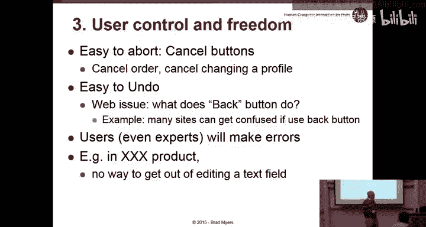

这一原则涉及一系列要求，例如拥有取消按钮。

应始终允许用户在执行操作过程中中止，直到最后一刻。即使在操作完成后，最好也能提供撤销方式。这在网页和手机界面上已不常见，但在桌面界面中，几乎每个操作都是可取消和可撤销的。

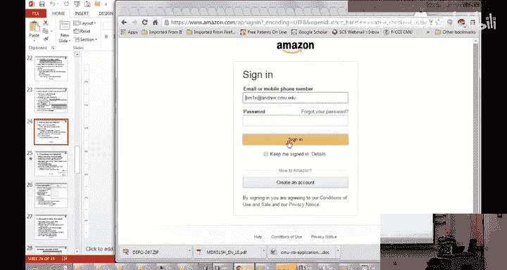

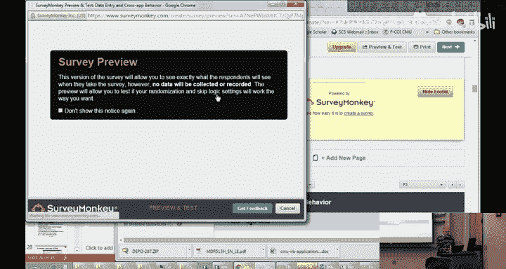

例如，在Windows中调整窗口大小时，可以按ESC键中止操作。在网页上，如果用户处于多页流程中，应提供返回上一页的按钮。浏览器有后退按钮，网站设计者应确保后退按钮能执行合理的操作。

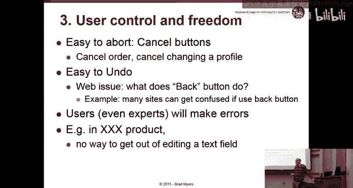

早期网页常警告不要使用浏览器的后退按钮，但现在大多数问题已解决。网站设计者必须确保后退按钮能正常工作。

另一种方式是使用面包屑导航，显示当前步骤并提供返回途径。目标是在用户出错、感到困惑或改变主意时提供帮助，必须假设每个人都会犯错。

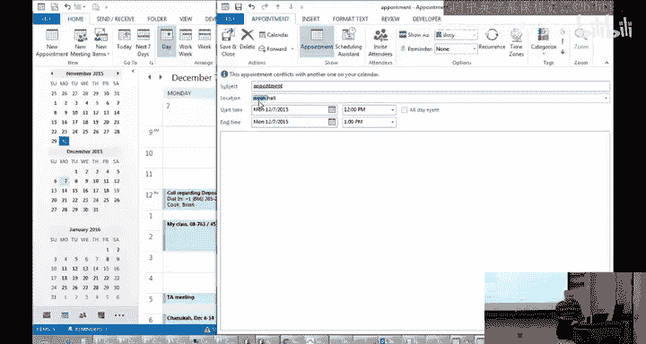

**违反示例**：之前提到的产品中，有一个文本字段处于“待删除”状态（类似日历应用中选择整个文本的情况）。如果用户不小心删除了该字段中复杂的产品ID内容，由于系统要求该字段不能为空且无法恢复旧值，用户最终只能关闭应用程序，因为他们无法记住产品ID。

### 4. 一致性与标准 📏

一致性非常重要，但也非常难以实现，因为有许多方面需要保持一致。

需要确保相同命令在所有地方具有相同的效果和名称。例如，复制、粘贴、剪切等操作应使用相同的词汇。不应在某些地方用“删除”，在另一些地方用“移除”。这看似明显，但由于大型团队开发，实际很难保证。

一致性还涉及位置、大小、颜色、措辞等方面。用户会尝试为界面中的几乎任何元素赋予意义。因此，如果同一操作出现在多个地方，它应该是完全相同的：相同的名称、外观、字体、颜色等。

顺序也应一致。如果用户在界面某一部分按特定顺序操作，在其他地方也应保持相同顺序。

**示例：颜色一致性难题**：我曾为一家控制工厂软件的公司咨询。他们刚收购另一家公司，两家公司对“紫色”的含义定义不同。一家认为紫色介于红色（严重）和黄色（中等）之间，另一家认为介于黄色和绿色（良好）之间。整合产品时，他们必须选择一种定义以保持内部一致性，最终选择了其中一种。这个例子说明，即使只是“一致性”这一条原则，有时也难以轻易实现。

如何实现一致性？遵循标准显然有帮助。在网页上，可以让一个小团队或单个人用CSS定义样式，然后所有实现者使用这些样式。有时可能需要额外的风格指南。

**违反示例**：之前提到的产品中，部件名称具有复杂的内部结构，但在两个不同的界面部分，命名方式不同（一个用点分隔，一个用逗号分隔），没有理由这样做，只是不同程序员在不同时间决定的。

另一个例子是“复制”一词，在计算机产品中应执行计算机用户期望的操作（即复制到剪贴板）。

### 5. 防错设计 🛡️

这一原则的目标是首先帮助用户避免犯错，后续原则则关注出错后如何帮助用户。

首要方法是提供选择而非输入。使用弹出菜单、日历选择器、禁用不可用的选项等。例如，日期选择器中，如果不允许选择过去的日期，则应将其置灰。

如果用户提供了输入但需要澄清，给出选项比让他们重新输入更有用。例如，在Expedia搜索“Columbus”时，它会列出多个同名地点让用户选择。

自动填充功能（如Google的搜索建议）是帮助防止错误的好方法。如果用户开始输入错误内容，自动纠正或提供选择可以帮助他们。

确认是另一种防止错误的方式。如果发现用户输入了非法内容，可以提示确认。确认对话框必须清晰易懂。

避免使用模式。模式是指同一操作在不同情境下做不同的事情。有些模式不可避免（例如点击鼠标的效果取决于光标位置），但应尽量减少模式，并使模式对用户高度可见。

**经典模式反面教材**：在命令行时代，有一个显示时间的命令叫`daytime`。但在一款邮件程序中，进入邮件模式后，单键具有特定含义，输入`daytime`意味着“删除所有邮件”。程序会请求确认，输入`y`（es）、`e`、`m`、`e`后，所有邮件被删除。虽然有撤销功能，但只有一级撤销，导致灾难性后果。这是一个模式设计糟糕的经典例子。

### 6. 识别而非回忆 🧠

这一原则的理念是尽可能让所有东西可见，以便用户从看到的内容中选择，而不是必须记住。

任何需要用户从小集合中选择对象或值时，都应能通过菜单选择。这在网页、传统界面和手机界面上都很常见，尤其是手机，应尽量减少输入。

但菜单不能太长，否则用户仍需回忆要寻找的命令。自动填充是另一种帮助用户识别所需内容的方法。

简单的做法是，每当允许用户输入时，提示应告知格式或可选项。一个很好的例子是打印幻灯片或页面时，可以指定页码范围。在PowerPoint的打印范围提示中，用小字说明了格式（如“1,3,5-12”），这是一个很好的提示示例。

其他例子包括份数选择（可直接输入或点击按钮）、整理方式图标等。整个界面中应提供所需信息，以便用户识别。

任何时候发现用户需要在纸条上写下东西然后稍后输入计算机，或者必须在界面不同页面之间复制粘贴，都表明违反了此原则。用户不应被迫重新输入信息。

这也适用于界面操作的一般规则。如果用户必须记住在一个页面用“删除”，在另一个页面用“移除”，这就是一个回忆问题。如果到处都能做相同操作，则是一个优势。

最后，在第一讲中提到的雷达显示器例子：用户需要心算旧值并与新值比较来判断飞机升降。这违反了本原则，要求用户基于回忆进行心算，而不是直接显示数值让他们识别。大家提出了许多通过颜色、图标或直接显示数值来改进的设计方案。

### 7. 使用的灵活性与效率 ⚡

这一原则的理念是专家用户应能高效操作，应为知道如何操作的用户提供简便方法。

例如，为网页设置书签，允许用户直接跳转到界面中部。对于常规产品，在菜单中提供快捷键（命令键）。在旧版Windows和Macintosh中，每个菜单项旁边会显示加速键。如今，许多界面不再显示这些信息。

在网页上，如果创建了指向网站中部的书签，然后尝试使用，它可能无效。这是因为许多网站在URL中编码了大量信息（如会话ID、时间等），导致重用该URL时失效。这与本原则相悖，本应允许用户跳转到网站中部并再次找到内容。

另一个例子是，如果用户已登录并输入过送货地址，系统应记住这些信息，避免用户重复输入。这是提高专家用户效率的功能。

即使是提供良好的默认值也很重要。例如，在电子商务网站上，购买数量默认值通常是1，因为大多数时候用户只想买一件。提供好默认值能提高效率。

### 8. 美观与简约设计 🎨

这一原则涉及设计讲座中讨论的所有内容：使用良好的颜色、图标、屏幕布局等。设计的角色之一是引导用户关注正确的事物，并让他们以正确的顺序操作。

良好的分组很重要，相关项目应通过框或界面区域组合在一起。我经常看到违反此原则的情况，例如一整行数据输入框，不清楚应按什么顺序填写或哪些属于一组。

保持显示惯性，即不同屏幕上元素应处于相同位置。如果Logo在不同屏幕上移动，用户会感到分心和烦恼。

留白是设计的一部分，不应试图在每个屏幕上塞满尽可能多的信息，而应利用留白使现有元素合理分组、整洁有序。

新手设计师常犯的错误是使用过多颜色和字体。设计讲座中建议，最多使用两种字体：无衬线字体（如Helvetica或Arial）用于标题和屏幕阅读，衬线字体用于大部分内容。颜色也应从较小的集合中选取，并应提供冗余编码。

大约8%的男性是色盲（通常是红绿色盲）。由于红绿色常被用来表示好坏，对于色盲用户，这两种颜色可能看起来是相同的灰度，导致他们错过重要信息。因此，在使用颜色的同时，应提供冗余编码，例如为红色项目添加星号或其他图标，确保色盲用户也能理解内容。

另一个技巧是将显示器切换到黑白模式，确保颜色在黑白模式下仍有区别。可以使用强度，深色看起来比浅色更黑。

避免低对比度。苹果设计指南中常出现此问题，例如白色背景上的浅灰色文字难以阅读。一个商业产品的反面例子是，在深色背景上使用了黑色文字，导致无法阅读。

尼尔森将“美观”和“简约设计”归在一起，但它们确实不同。简约设计旨在消除不必要的东西。如今人们阅读不多，如果指令超过一行，用户可能会忽略第二行。

一般原则是减少屏幕上同时出现的内容数量。识别真正需要用户处理的内容。我常为一些公司提供咨询，他们会说“这有点复杂，我们会确保手册写清楚或提供帮助文本”，但这通常无效。一个策略是，如果发现向他人解释某事过于复杂，那就重新设计它，避免那种复杂性。

避免无关的图片和信息。在之前提到的产品中，有一个菜单项叫“显示弹药筒”，我问工程师它的含义，没人知道。原来是很久以前某个客户要求的功能，他们为这个客户特别添加后，就一直保留在菜单中（但对其他用户置灰）。这导致培训师常被问及，支持电话也偶尔收到相关询问。既然不相关，为什么不直接移除它？当然，如果是“免费增值”模式，提供一些需要付费才能解锁的功能菜单项，则是另一回事。

通常，应减少选项和菜单选择。这与Windows和Macintosh的设计理念（为每个操作提供越来越多的方式）相反。例如在PowerPoint中，每个操作可能有3到4种调用方式（菜单、右键菜单、键盘快捷键等）。这违背了简约设计原则，因为专家用户必须花费认知精力来选择使用哪种方式，这降低了效率。

许多人会在页面上添加图片和其他信息。在电子商务网站上，图片对于销售至关重要。另一方面，装饰性的图片、巨大的Logo或人物手持产品的图片等，并不能提供有用的信息。

### 9. 帮助用户识别、诊断和恢复错误 ❗

错误不可避免，尽管我们会尝试使用之前的策略减少错误。但一旦用户陷入错误状态，帮助他们理解情况并恢复就非常重要。

一些专家建议，应将错误视为教导用户了解其困惑之处的一种方式。用户通常不会故意犯错，可能是简单的拼写错误，这时需要帮助他们高效地摆脱错误。但很多时候，用户陷入错误是因为他们普遍对系统允许什么、会做什么或当前状态感到困惑。在这种情况下，需要清楚地说明他们的误解或困惑之处，以及事情为何不按预期工作。

错误信息必须清晰，使用用户能理解的语言，不要使用代码。例如，我的机顶盒显示“错误25”，我不知道该怎么办。它本应利用整个电视屏幕告诉我问题是什么以及如何解决。任何时候有机会提供完整的错误信息，都应该这样做，而不是使用代码。

同时，要精确。“语法错误”是编译器过去常告诉程序员的，但对于最终用户，永远没有理由使用这种语言。即使有复杂的字段需要用户输入，也不应说“语法错误”，因为用户可能并不理解编程中的“语法”概念。需要帮助用户理解如何解决问题，而不仅仅是错误是什么。

**示例：不明确的错误信息**：在之前提到的产品中，尝试保存文件时显示“无法保存文件”。为什么不呢？可能的原因有很多：磁盘空间不足、已有同名文件（应询问是否覆盖）、无写入权限、设备损坏、网络断开、未指定目标位置、文件名包含非法字符、介质写保护等。操作系统实际上知道无法保存的原因，并将此信息传递给应用程序。这条错误信息本质上是告诉用户：“哈哈，我知道哪里错了，但你必须自己猜出来。”没人喜欢这种猜谜游戏。这与“语法错误”和其他模糊信息类似。

要有礼貌，不要指责。“致命错误”意味着“因为你犯了错，现在程序要死了”，这并不真实（程序下次启动还会运行）。更礼貌、积极的表达是：“抱歉，发生严重错误，程序必须关闭。”同样，责备系统而非用户。“非法命令”听起来像用户做了违法的事。“无法识别的命令”则更温和、礼貌。

幽默或讽刺的评论对程序员来说可能有趣，但用户很少觉得有趣。用户处于糟糕的情绪中，他们犯了错，没有成功完成任务，这时通常不是开玩笑或娱乐的好时机。而且，如果用户反复看到同一条幽默错误信息，会非常恼火。

显然，要使错误恢复变得容易。如果告诉用户该怎么做，但操作本身很难或不可能，那也无济于事。有时，提供多级错误信息是有帮助的，例如一个基本错误信息，旁边有一个问号，点击可以获得更多关于出错原因或情况的信息。

我收集了许多错误信息的例子。以下是一些网页错误示例：
*   匹兹堡文化信托网站：显示“设备上没有剩余空间”，然后给出一个荒谬的长URL和文件路径，暴露了内部细节。这不仅对用户不友好，研究还表明，向客户暴露这些内部细节是一个巨大的安全漏洞，恶意攻击者可以利用它来损害系统。
*   好市多网站：显示“通用错误。以下部分旨在帮助商店开发人员调试示例商店上的问题。”这甚至不应该被用户看到，但网站进入了显示这些内部页面的状态。
*   一条测试结束信息：“恭喜，您已完成。”这可能被误解为“你死了”那种“完成”，需要注意用词的歧义。
*   一个试图幽默的例子：“抱歉，亲爱的，但有些事情完全出错了……”这可能符合其广告风格，但如果反复看到，用户会感到厌烦。
*   一个未完成的错误信息占位符：“我们友好的错误信息将放在这里。”当用户看到时，并不觉得友好。
*   模糊的错误信息：“此号码目前无法在U Promise服务中注册。”这暗示其他时间可能可以，但事实并非如此。可能原因是信息输入不正确、号码已注册或号码无效。系统应该知道是哪种情况。结果是用户不得不打电话询问，增加了支持成本。
*   技术性错误：“未指定有效的交易ID。”没人知道“交易ID”是什么，这绝不应该显示给用户。

相比之下，雅虎和大多数网站在错误处理上做得更好，会明确显示哪里出错，并通常将错误字段高亮显示。

### 10. 帮助与文档 📚

这包括帮助用户理解如何操作的所有内容：帮助文本、标签、任何文档（如消费电子产品的手册）。

人们通常期望产品能够即用即走、不言自明，不能指望用户必须学习。一般规则是：不要以为可以通过提供帮助来解决复杂性。

一个非常有用的策略是，让技术文档编写者成为设计团队的一部分。他们通常是英语专业出身，在公司地位可能不高，无权与产品设计师沟通，但他们非常了解系统中哪些地方难以使用，因为他们必须想办法解释它。让他们参与设计并帮助修复问题，非常有益。他们也能帮助确保系统中的所有句子都清晰、无歧义。

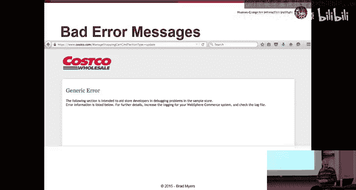

显然，一致性在这里也很重要，文档中使用的词汇应与屏幕上的一致。文档本身在某种意义上也是一种用户界面。如果帮助系统本身很难用，用户就很难找到信息。

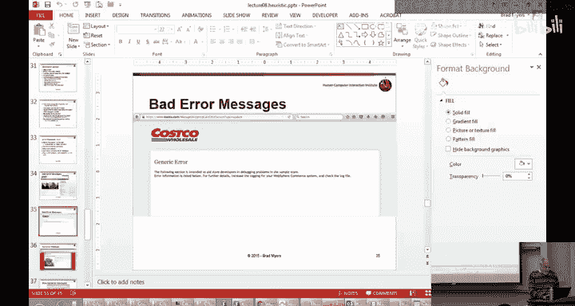

很早以前的一项研究表明，一个帮助系统本身非常难用，以至于进行可用性评估后，通过改进帮助系统的界面（更不用说它要帮助的那个系统了），使用帮助系统的时间几乎减少了一半。

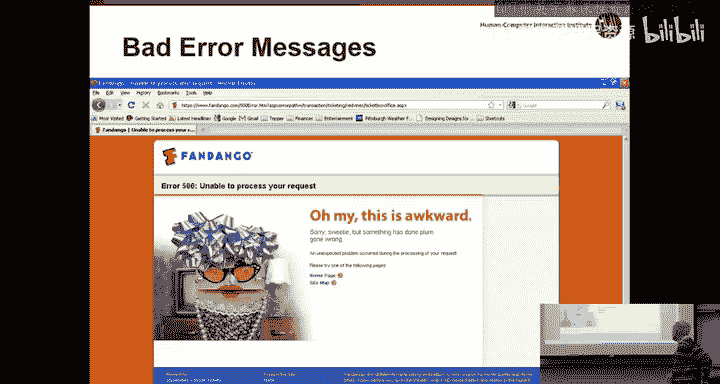

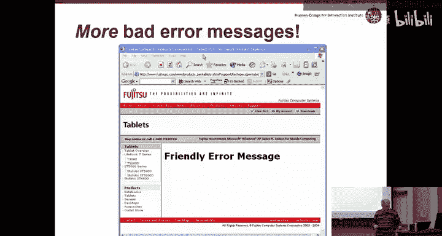

## 关于作业5

对于作业5，你们将对其他同学的系统进行启发式评估。

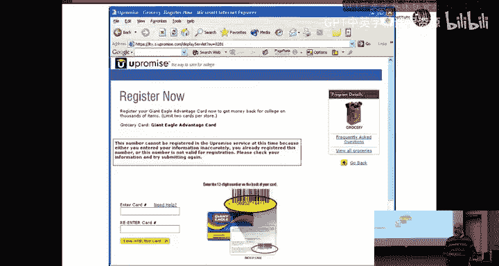

请注意，作业并未要求大家实现帮助功能。因此，在评估他人系统时，如果说“该系统没有帮助”或“帮助按钮无效”，这是没有意义的反馈。同样，如果使用第10条原则（帮助与文档）作为启发式评价，说同学的系统没有实现帮助，这种反馈也毫无帮助。

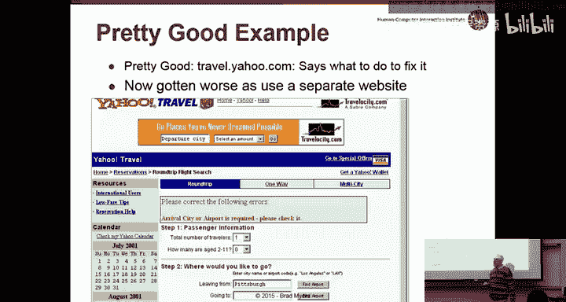

总的来说，我们希望你们提供有用的反馈，帮助同学理解他们做错了什么以及如何修复。

评估模板与之前使用的类似，包含相同的列。我们将关注你们是否提出了有帮助、有意义的启发式评价。

**重要事项**：你们将评估其他同学。需要在模板中填写被评估系统的名称、创建者姓名以及你们自己的姓名。可能没有系统名称，但会有创建者姓名。请将两者都填入。

请使用Word文档，并提交原始文件。这样助教可以更方便地将你们的两份评估文件发送给相应的被评估同学。

**示例**：模板中包含以下列：参考（截图或描述）、启发式原则名称、问题描述、范围、严重性、修复建议。例如，一个一致性问题是按钮在两个界面部分位置不一致，严重性为轻微，因为用户可能不会因此遇到问题，修复方法是将其在一个位置移动。

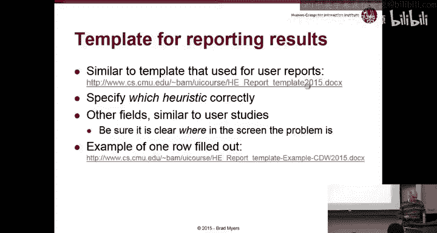

对于作业6，你们将填写黄色列，说明针对他人对你们系统的评价采取了什么措施。

---

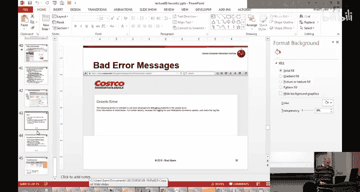

## 总结

本节课我们一起学习了启发式评估的方法和尼尔森的十条核心可用性启发式原则。我们了解了如何系统性地检查界面，识别违反这些原则的问题，并为设计改进提供具体建议。记住，启发式评估是专家评估方法，需要结合用户研究以获得更全面的洞察。在接下来的作业中，请应用这些原则，为同学提供建设性反馈，并思考如何将这些原则融入自己的设计实践中。