# 面向技术高管的人机交互导论：10：网页设计 🖥️

在本节课中，我们将学习网页设计的关键原则和最佳实践。课程内容基于尼尔森诺曼集团的研究，涵盖了导航、内容组织、响应式设计、链接设计、页面内容与可读性等多个方面，旨在帮助初学者理解如何创建用户友好且高效的网站。

---

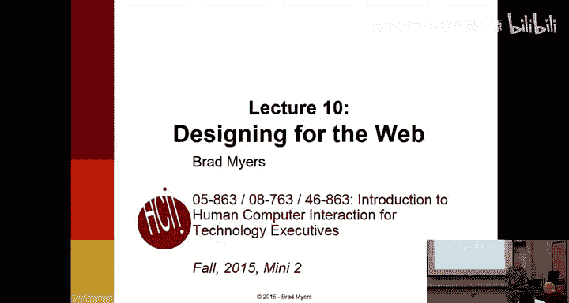

## 课程概述与作业说明

课程已接近尾声。作业五的截止日期是今天，希望大家都已提交。作业六已发布，内容相对直接。助教们希望能在明天中午前收集并分发大家的互评意见。

作业六的核心任务是：根据互评者对你原型提出的评论，填写“黄色列”中的反馈，并据此更新你的设计。以下是处理评论时需要注意的几点：

*   **处理不同意见**：审阅者可能并非专家，其建议有时可能不尽合理。如果你不同意某项建议，可以不予采纳，但必须说明理由。例如：“审阅者建议将页面从绿色改为蓝色，但蓝色是我们的主题色，因此不予采纳。” 或者：“审阅者建议更改此处，但这会导致与另一页面不一致。”
*   **处理原型限制**：对于评论中提到的“按钮无法点击”或“缺少数据验证”等功能性问题，可以合理地回应：“这将在最终版本中实现，但当前仅为原型阶段，此功能尚未激活。”

作业六设计得相对简单，且分值较低（10分），因为这是最后一周的作业。

关于期末考试，信息已发布在课程网页上。考试将在下周进行两次，学生可根据自己的时间安排选择参加周四上午或周一的场次。

此外，下周三的课程开始时，将预留约5分钟时间供大家填写课程评估。评估分为官方版本和我个人设计的版本。我个人设计的评估更具体，且我每年都会根据大家的反馈对课程进行实质性调整，因此非常希望大家能提供宝贵意见。

---

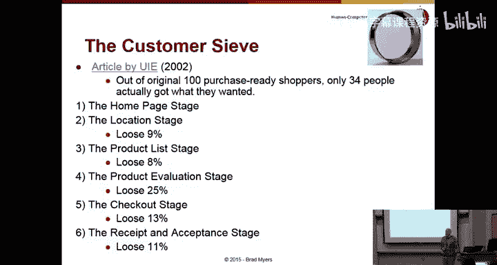

## 网页设计的重要性与现状 🌐

上一节我们介绍了课程收尾的作业与考试安排，本节中我们来看看本节课的核心主题：网页设计。

如今，网站对任何公司或组织都至关重要。然而，研究表明，用户在网站上完成各种任务（如查找营业时间、产品信息或用户手册）的成功率仍然很低，尽管已从22%提升至40%，但仍有很大改进空间。

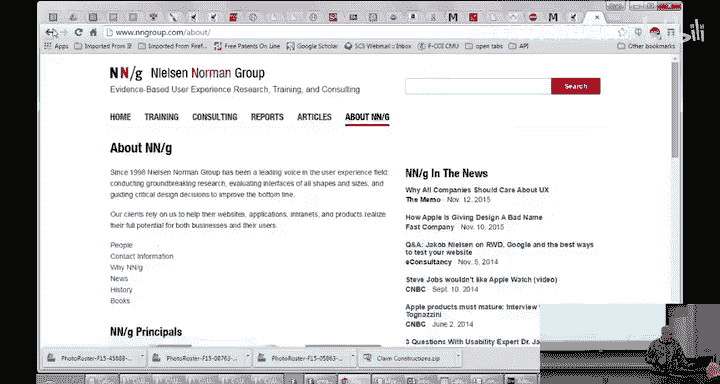

即使对于电子商务网站，也有大量用户访问是为了进行研究，而非立即购买。因此，网站不仅需要支持购物，更需要帮助用户学习。一个有用且吸引人的网站能提升品牌形象，促使用户在需要购买时再次光顾。

反之，糟糕的网站体验会严重损害品牌。调查显示，如果用户在网站上任务失败或遇到问题（如链接失效、设计不佳、加载缓慢），他们可能会转向竞争对手、不再信任该品牌，甚至不再访问。

对于公司内部网站（内网），情况类似。虽然成功率已大幅提升至75%，但仍有四分之一的员工在使用内部系统（如填写差旅申请、查询政策）时失败，这导致了巨大的生产力损失和时间浪费。有估算表明，仅将网站可用性从“糟糕”提升到“平均水平”，每年就能为公司节省数百万美元。

用户完成网站任务通常需要多个步骤，而每一步都可能流失一部分用户。例如，从首页到最终确认购买，可能只有34%的用户能全程成功。因此，优化每一个页面的体验都至关重要。

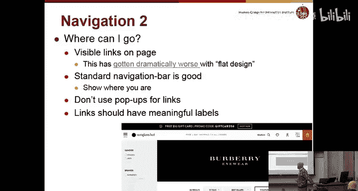

---

## 核心设计原则：导航与结构 🧭

上一节我们了解了网页设计的重要性，本节中我们来看看网站设计中最核心的原则之一：导航。

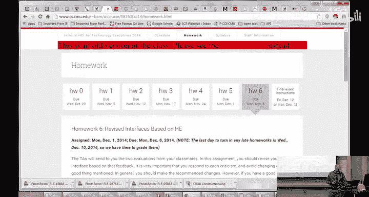

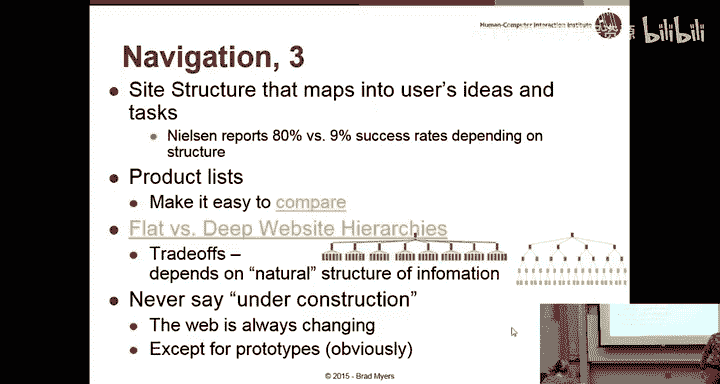

由于绝大多数网站都包含多个页面，清晰的导航是基本要求。这包括让用户随时知道“我在哪里”、“我去过哪里”以及“我能去哪里”。

以下是实现良好导航的几种方法：

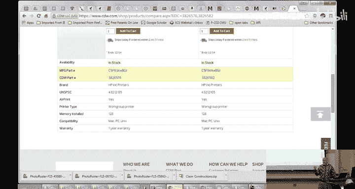

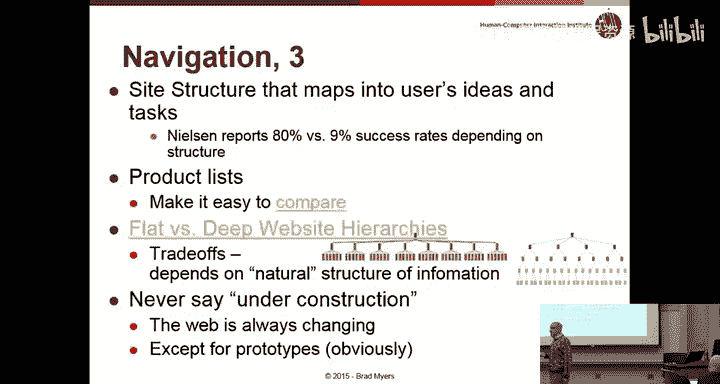

*   **保持一致的网站结构**：所有页面应具有统一的外观和布局，并且始终能轻松返回首页。
*   **利用面包屑导航**：显示用户在网站层级结构中的当前位置（例如：首页 > 软件 > 儿童软件），并提供返回上级页面的链接。
*   **高亮当前位置**：在主导航菜单中，通过颜色、样式等变化，清晰标示用户当前所在的页面或版块。
*   **慎用链接样式**：过去，未访问和已访问的链接会以不同颜色显示，这对用户很有帮助。但现代设计中，链接常常缺乏明确的可视化区分（如下划线），导致用户难以识别哪些是可点击的。设计师需要在美观和可用性之间取得平衡。

网站的信息架构（即内容如何组织）同样关键。研究表明，不同网站在帮助用户查找内容的成功率上差异巨大（从80%到9%）。为了设计出符合用户心智模型的导航，可以采用“卡片分类”等以用户为中心的技术：将网站的所有主题写在卡片上，让目标用户对其进行分类，从而了解他们自然的组织逻辑。

网站结构可以是“宽而浅”（顶层类别多，子层级少）或“窄而深”（顶层类别少，子层级多）。选择哪种取决于产品类型和用户的思考方式，没有绝对答案。

对于产品列表，提供“对比”功能通常很受欢迎。例如，在电商网站中，允许用户并排比较不同产品的规格参数，能极大提升决策效率。

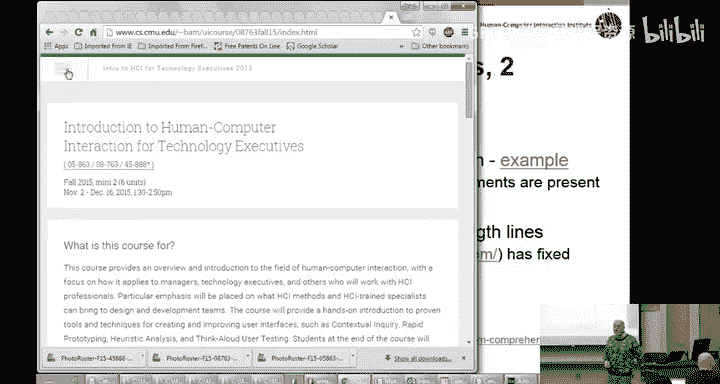

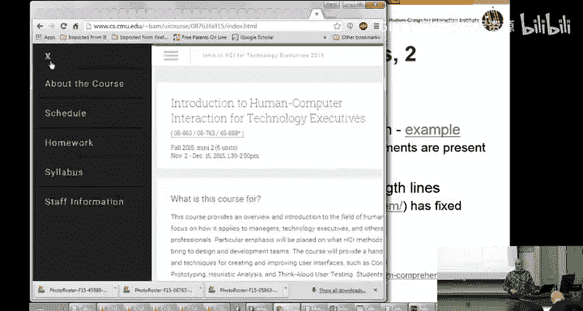

最后，避免在网站上使用“正在建设”的页面。如果某个部分尚未完成，最好暂时隐藏链接，直到其功能完善。

---

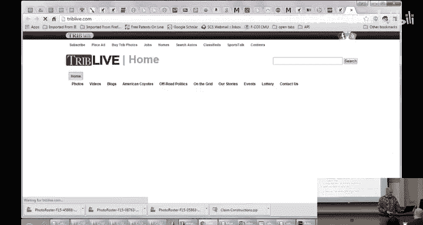

## 应对多样化的访问环境 📱

上一节我们探讨了导航与结构，本节中我们来看看如何确保网站在各种不同的设备和环境下都能良好工作。

网站设计者无法控制用户使用何种设备、浏览器或屏幕尺寸访问网站。因此，设计必须具备适应性。

**响应式设计** 是当前的主流解决方案。它意味着网站能自动调整布局以适应不同的屏幕尺寸，而不是为手机、平板、桌面分别设计独立版本。其核心思想是：使用同一套HTML代码，通过CSS媒体查询等技术，根据视口宽度动态调整页面元素的排列方式。

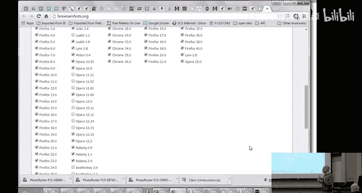

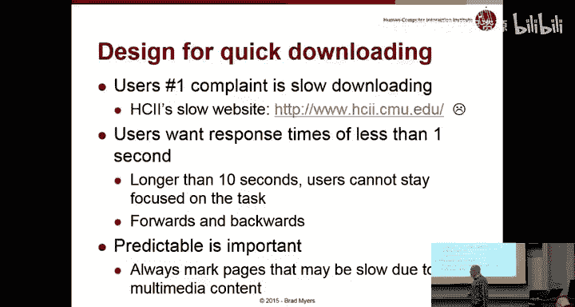

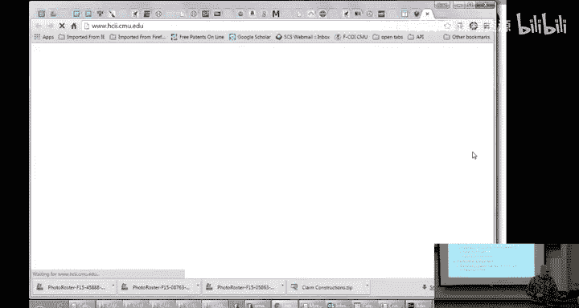

一个简单的例子是：当窗口变窄时，侧边栏从左右布局变为上下布局，或者导航菜单折叠成一个“汉堡包”图标。

除了屏幕尺寸，还需考虑**分辨率**（每英寸像素数）。高分辨率屏幕（如Retina显示屏）需要更高清的图片资源，而文字大小应使用相对单位（如`em`, `rem`），而非固定像素，以确保在不同设备上显示比例合适。

设计时应优先保证**垂直滚动**，尽量避免出现需要水平滚动才能查看完整内容的情况，这对用户体验非常不友好。

关于**图片与文字**：避免将重要信息（如会议日期、联系方式）仅以图片形式呈现。这会导致文字无法被选中、复制、搜索引擎索引，也无法被屏幕阅读器识别。正确的做法是：要么使用CSS将文字叠加在图片上，要么在图片下方提供完整的文字说明，并为图片设置包含关键信息的`alt`属性。

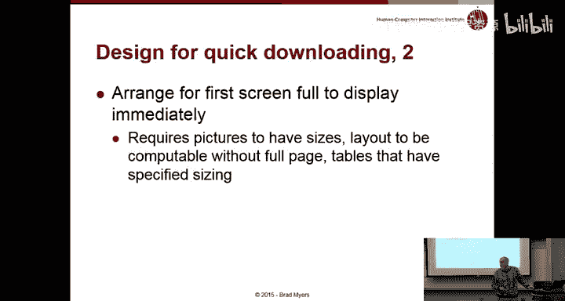

在代码层面，应使用语义化的HTML5标签（如 `<header>`, `<nav>`, `<section>`），并避免使用已废弃的标签（如 `<blink>`, ``）。可以使用如 **BrowserStack** 等工具在多版本、多类型浏览器中测试网站的兼容性。

---

## 性能、链接与页面内容 ⚡

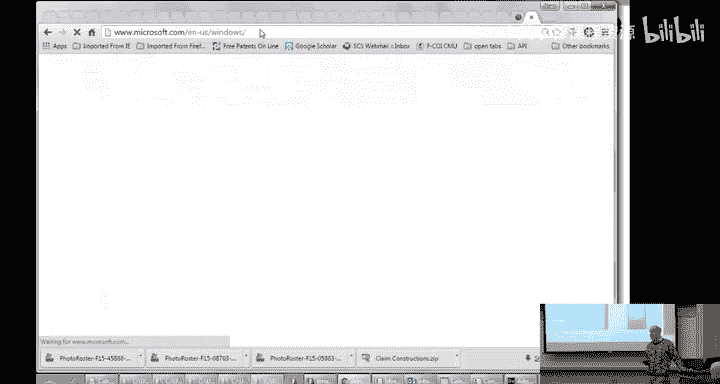

上一节我们讨论了如何适应多样化的环境，本节中我们来看看影响用户体验的其他几个关键因素：性能、链接设计和页面内容。

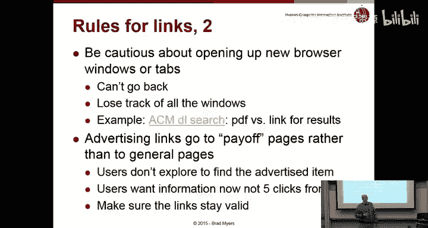

**性能**是用户对网站的首要抱怨之一。加载缓慢会导致用户认为网站已损坏，并可能重复点击，造成更混乱的局面。一般指导原则是：用户操作后的响应时间应小于1秒；如果超过10秒，用户很可能会放弃。

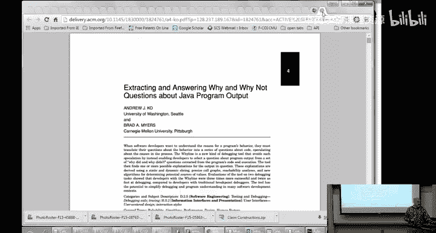

对于已知会较慢的操作（如生成报告、跳转到大型媒体文件），应提前向用户提示。同时，应确保浏览器“前进”、“后退”操作能快速响应，这通常需要合理设置页面缓存。

优化性能的技巧包括：为图片指定尺寸，以便浏览器提前预留空间；优化表格等HTML元素的加载方式。

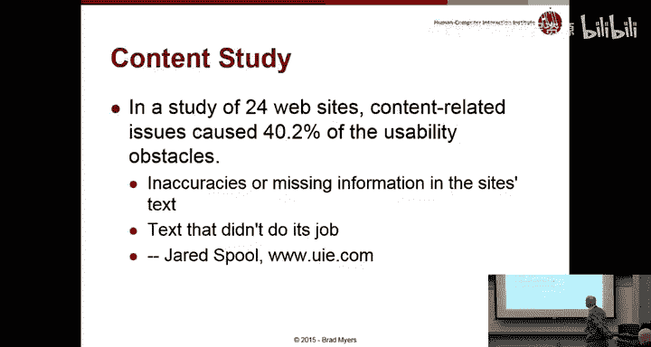

**链接设计**至关重要。任何用户可能想点击的内容都应该是可点击的链接。失效的链接或“应该但不是链接”的文本会严重损害网站和公司的可信度。即使内容重组，也应尽力通过重定向等方式，确保旧链接仍能指向相关的新内容。

链接文本应具有描述性，避免使用“点击这里”。例如，使用“**查看课程表**”而非“点击这里查看课程表”。这样既能表明可点击性，又突出了关键信息。

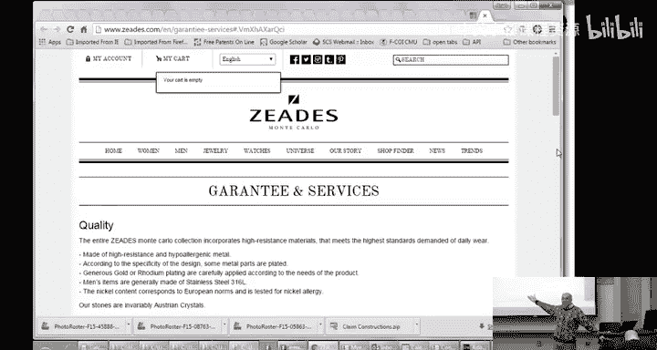

此外，应保持URL结构清晰且可“ hack”。例如，如果用户手动删除URL末尾部分，应能跳转到合理的上级目录页面，而不是显示错误。

关于**是否在新窗口/标签页打开链接**：通常建议在同一窗口打开，以利用浏览器的后退功能。仅当操作会显著改变上下文（如在教学平台中打开外部论文PDF）时，才考虑在新标签页打开。

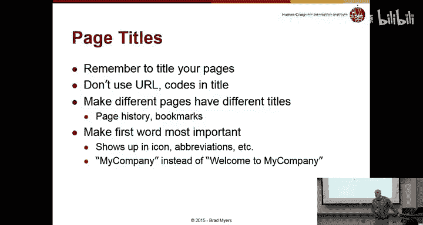

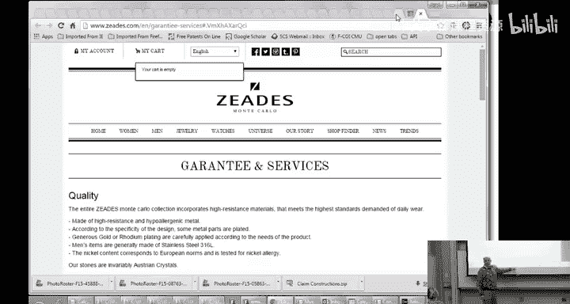

**页面内容与可读性**是另一大挑战。研究表明，高达40%的可用性问题源于糟糕的文案：用词不当、句子令人困惑、信息缺失或不准确。

为网页写作需要特定技巧：
*   **便于扫描**：用户很少逐字阅读，而是快速扫描。因此，应使用清晰的标题、项目符号列表、高亮关键词和链接。
*   **标题至关重要**：将最重要的词放在标题和链接文本的开头。这不仅利于扫描，也便于屏幕阅读器和搜索引擎理解。
*   **保证可读性**：使用高对比度的配色（如黑底白字），避免使用全大写字母（阅读速度慢且像在喊叫），并谨慎使用两端对齐的文本（可能导致单词间距不均）。
*   **表单设计**：对于电话号码、信用卡号等输入框，应允许用户按习惯格式输入（包括空格或短横线），由后台代码自动清理，而不是强制要求特定格式。
*   **遵守惯例**：Logo通常在左上角（从左到右阅读的语言），搜索框在右上角，语言选择在顶部中央。打破这些惯例会降低可用性。

**首页**是公司最重要的资产之一。它应该清晰地表明公司是做什么的，并提供主要任务（如搜索、预订）的直接入口。一个设计良好的搜索功能能直接提升销售额。

最后，选择一个简洁、易记的 `.com` 域名至关重要。

---

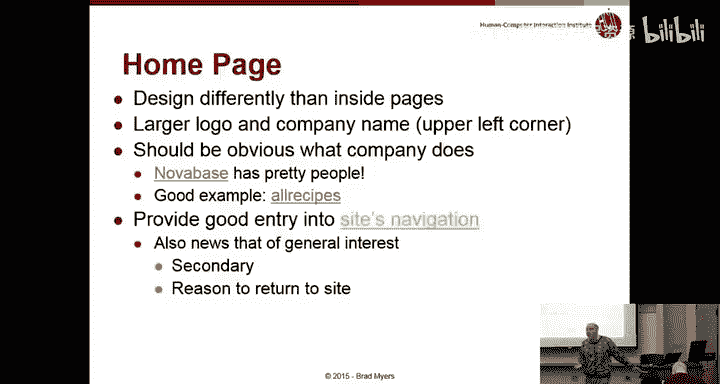

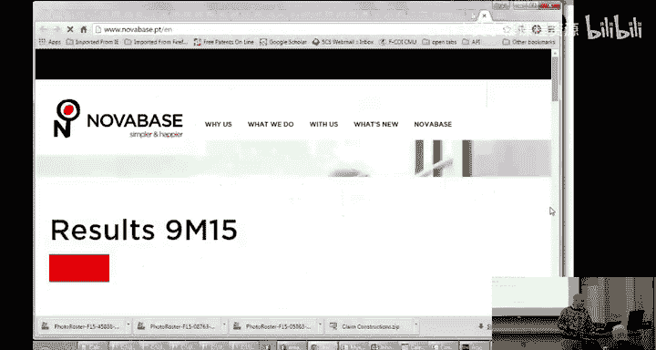

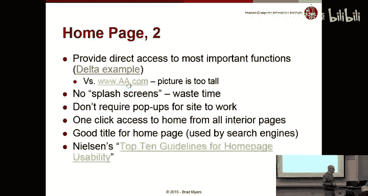

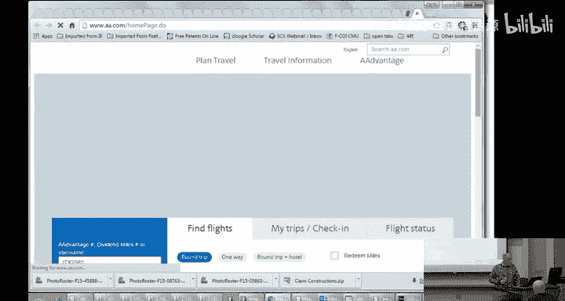

## 总结

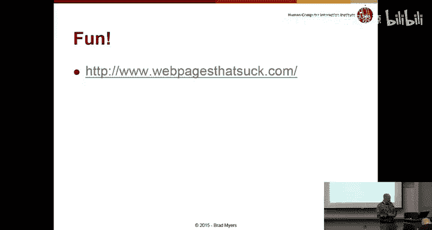

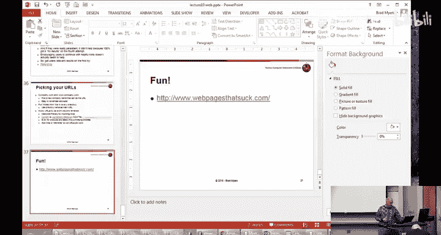

本节课我们一起学习了网页设计的核心原则。我们了解了导航与信息架构的重要性，探讨了如何通过响应式设计适应多种设备，强调了性能优化、清晰的链接设计以及高质量、易扫描的页面内容对用户体验的关键影响。记住，一个好的网站需要在美观、功能与可用性之间找到最佳平衡点。