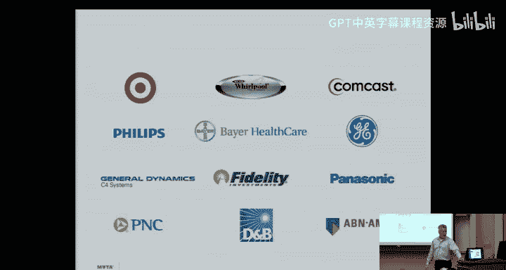
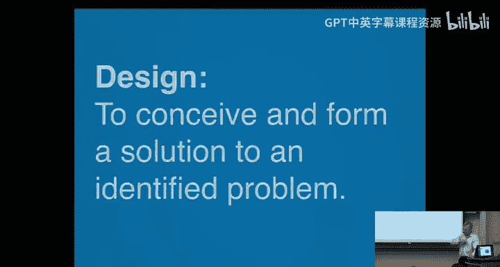
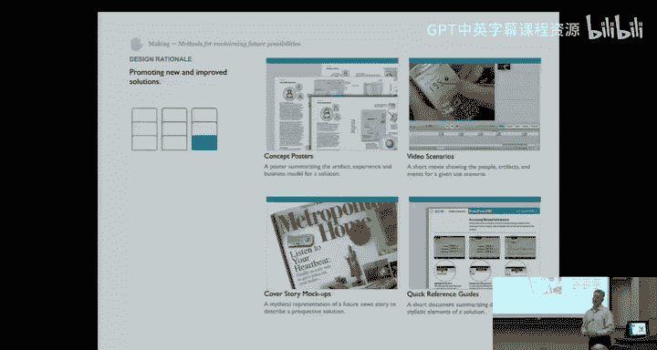
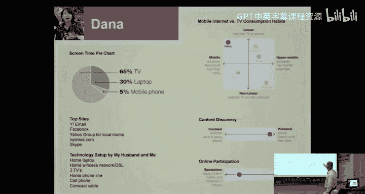
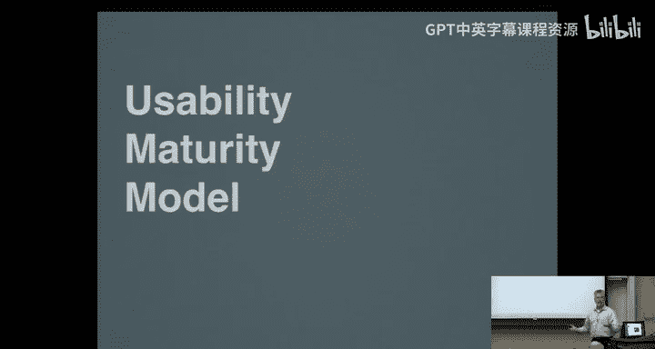
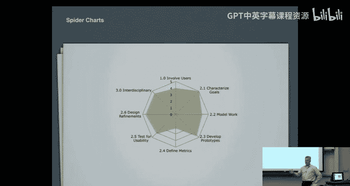
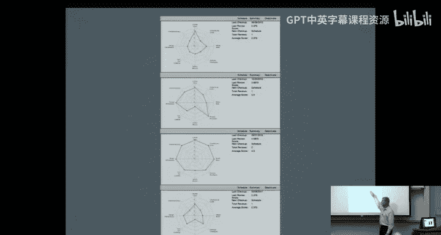
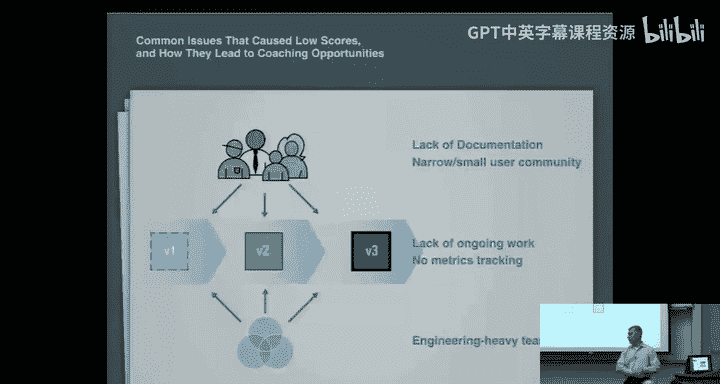

# 面向技术高管的人机交互导论：12：Maya Design 的实践案例与设计方法 🎯

在本节课中，我们将跟随 Maya Design 的首席人类科学家 David Bishop，了解一家顶尖设计咨询公司如何将人机交互原则应用于真实世界的复杂产品中，并学习他们用于“驯服复杂性”的核心方法。

## 课程概述 📋

本次讲座将介绍 Maya Design 公司如何通过跨学科合作、信息架构和迭代式设计流程，将复杂的产品变得易于使用。我们将通过多个实际案例，展示人机交互原则如何显著改善产品，并学习一套实用的设计工具箱。

---

## 引言：驯服复杂性 🦁

今天，我很高兴向大家介绍我们的客座讲师 David Bishop。他几乎每年都会为这门课程做讲座，并且总是非常受欢迎。事实证明，我们教授的许多技术在实际世界中确实非常有用。David 讲座的一大亮点在于，他拥有大量案例，展示了人机交互原则如何显著改善产品。

David 在卡内基梅隆大学也参与了许多其他活动。他是我们硕士课程的兼职教授。他不仅与这个班级合作，而且他关于行业实际运作的知识对我们非常有帮助。如果你有一家本地公司，并且需要用户界面方面的帮助，我强烈推荐你联系他。

我叫 Dave Bishop，是 Maya Design 的首席人类科学家。我们公司位于市中心的四门中心大厦 16 楼，已有约 25 年历史。我通常会向潜在客户介绍我们存在的理由，解释我们如何工作。我会谈谈 Maya 作为一家咨询公司的特点、我们使用的一些技术，并穿插一些案例研究，展示我们如何在实践中运用这些方法。

我们向人们指出，计算能力和复杂性的成本已经下降。根据不同的统计口径，我们现在制造的微处理器（或晶体管）数量可能比地球上的米粒还多，而且成本更低。回到 1900 年代，在匹兹堡，获取书籍的主要途径是去卡内基图书馆，书籍是奢侈品，并非人人拥有。而现在，我们可以在线购买书籍，有古腾堡计划，可以购买 Kindle 电子书，有时只需 99 美分，并通过无处不在的网络无线传输。因此，物质成本已经下降。

但另一方面，信息量却在急剧增加。根据不同的说法，我们每天创造的信息量相当于两个国会图书馆，或者 Facebook 每天创造的信息量相当于两个国会图书馆。关键在于，我们生成和创造的信息量是巨大的。

这就留下了一个鸿沟，因为人类并没有真正进化。我的脑力、记忆能力可能和我父亲、祖父、曾祖父一样，其进化速度远远赶不上其他事物的变化速度。因此，我们说我们的业务是“驯服复杂性”。这些系统的能力、创造复杂性的可能性、世界上的信息量都在飞速增长，而我们理解、利用这些信息的能力却与 1900 年代大致相同。

我们说“驯服复杂性”的原因之一是，我们的工作不是把一个复杂的产品变成不复杂的产品。我们的工作是，以某种方式驯服这种复杂性。我们将展示如何做到这一点，即处理那些因功能蔓延、可用性问题、复杂性问题或存在于复杂数据空间而产生问题的产品，并尝试驯服其中的一些复杂性。

---

## 跨学科设计实践 🤝

良好的人本设计实践的一个原则是以跨学科的方式进行工作。Maya 从创立之初就是基于此建立的。三位创始人分别是一位计算机科学家、一位认知心理学家（基本上是人文科学家）和一位设计师（工业设计师）。即使到今天，我们仍然由这些学科的人员构成。

工程人员知道事物如何运作，不仅仅是计算机科学，还包括如何构建系统、建立数据库、通过网络传输数据，他们了解什么是技术上可行的。人文科学家了解人们的思维方式，我们拥有人类学、民族志学、可用性专家和认知心理学等领域的人才。视觉设计师、工业设计师和那些赋予事物形式和功能领域的人员也与我们紧密合作。

Maya 处于这些学科的中心。我们投入大量精力确保公司的一切工作都以跨学科的方式进行。在 Maya，你找不到这三个独立的部门，它们分散在我们整个组织中。任何一个小团队里，你都能找到来自这些不同学科的人。

---

## 信息架构的核心作用 🏗️

Brad 让我谈谈信息架构。我想展示这张幻灯片，并通过一些案例研究来解释为什么 Maya 经常谈论信息架构，以及为什么我们认为它对驱动良好的用户界面设计至关重要。

在这里是某个系统的核心，这是数据库、网络，或者可能是一个物理系统（我们这里用齿轮表示）。这是更纯粹的工程部分，即系统架构，它是系统中非常重要的一部分。如果没有工程师或构建系统的专业知识，你将一无所有。

在这一端是所有面向最终用户的部分。有人必须与这个系统交互。我听过无数术语：用户界面、UI、用户体验、人机界面。当有人构建物理产品时，例如一个阀门或现场设备，他们会说它需要一个控制面板，并称之为 HMI。我不太在意术语，但关键是这部分面向用户，而用户通常看不到后端部分，但如果没有它，产品就不存在。

在这两者之间，有一个很多人不常想到但非常重要的领域，那就是信息架构的概念。以亚马逊为例，所有后端是如何在全球范围内发送信息、使用内容分发网络、快速存储书籍和评论数据库、实现购物车和支付功能的。后端很重要，数据库必须有某种组织结构，很多与速度、健壮性等有关。

在用户界面端，显然也必须运作良好，因为如果人们找不到他们想购买、租赁、转移到 Kindle 或退货的书籍、电影等，亚马逊就无法赚钱。他们必须优化前端的一切。但他们是如何做到的呢？

想想亚马逊，必须有人坐下来想出一种存储方式（我不是指数据库，而是指如何组织信息）。你必须意识到有书籍，书籍由作者撰写，所以一旦我进入《白鲸记》，我可以点击赫尔曼·梅尔维尔，发现他写了很多书。但这更深层，因为他们必须驯服这个世界的复杂性：书籍有多个版本。必须有人坐下来思考：这本书有多个版本，对吧？有人写了这本书，10年后更新了，称为第二版。又过了10年，再次更新，称为第三版。如果有人评论一本书，评论是针对书本身还是针对某个版本？必须有人思考并解决这个问题。你必须告诉后端的工程师你希望它如何工作。

我是评论了书还是书的某个版本？这样当我查看第三版时，评论会自动消失吗？为什么？因为我把评论放在了特定版本上。另一方面，如果我把所有评论都放在书上，那么我可能在看一条评论，评论是针对第一版的，说它很糟糕，而这本书实际上已经改进了，我正看着第三版，但因为那条很旧的评论而不购买它。这些都是你必须思考的问题。

你可以想象这将如何影响用户界面。现在我必须向人们展示这是针对哪个版本，我必须理清复杂性，决定如何去做。再以亚马逊为例，如果有人评论一本书，他们是在评论书的内容（例如，“《白鲸记》真是个糟糕的故事，最后所有人都死了，包括鲸鱼”），还是在说“《白鲸记》这本书真糟糕，装订闻起来像胶水”？现在你意识到它有平装本、精装本和有声书，你也必须理清这些东西。

后端的工程师会以某种方式实现，他们会把评论放在数据库的某个地方，并指向某个版本、书籍或装订方式。你必须以某种方式向用户展示。但老实说，正是在信息架构这个领域，你会思考这些问题。一旦你理清了一些结构，它真的会帮助你设计用户界面，并帮助你与工程师沟通如何实现。

在很多情况下，这才是真正重要的。信息架构经常体现在搜索功能上。想想在网站上搜索，如果搜索效果很差，你找不到想要的东西，这可能意味着他们有一个包含所有产品、书籍、评论、文章等的数据库。你输入一个搜索词，他们基本上会查看所有内容，并返回数据库中包含该搜索词的所有条目。

然后你想，好吧，那可能有很多东西。我该如何呈现给人们？显而易见的做法是查看搜索词在该文档中出现的比例，因为如果出现很多次，那么它可能与该搜索词非常相关，我会把它放在顶部。但如果文档很短，它也会排到前面，这并不能帮助你更好地筛选。

另一方面，想想你在 Land‘s End 的体验。在 Land’s End，你可以输入“睡衣”。在信息架构和系统架构之间的某个地方，有人足够聪明地说：“你知道，我们在 Land‘s End 卖很多东西。我们的每个产品都有很多不同的属性：有些是男式，有些是女式，有些是儿童款，有些不是；有些有尺码，有些是均码；有些是棉质的，有些不是；有些是当季的，有些是过季的；有些穿在上半身，有些穿在下半身。”

因此，当你在 Land‘s End 输入“睡衣”时，他们能够意识到这是一个非常模糊的搜索词，但他们非常想卖给你一件睡衣，因为他们认为你想买一件睡衣，而你也认为你想买一件睡衣。他们需要引导你如何筛选和缩小范围。所以他们会说：“睡衣，我们有一百万件睡衣。你应该试试这个。”看看他们是怎么做的：他们会问“你是想要男式、女式还是儿童款？”因为他们基本上理解了信息架构。

他们不会只是吐出所有睡衣，而是会问：“你想只看打折的吗？还是想看棉质的？你在找什么尺码的睡衣？可能在找什么季节的？”他们可以理清这类问题。他们还可以根据你所在的国家/地区，判断如果你在南方，可能不需要法兰绒睡衣；如果你在北方，可能只想看法兰绒睡衣。关键在于，这种对信息空间的思考是必须的，这样才能让数据库或后端正确，也让前端的用户界面更有意义，而不是仅仅吐出“哦，我们有 10000 种睡衣”。

---

## 客户与跨领域学习 🌐

我这里有一张幻灯片，简要介绍了一些我们合作的客户。可以说，我们在许多不同的行业有许多不同的客户。从我作为咨询机构一员的角度来看，这可能是最精彩、最有趣的事情之一：我们在所有这些不同的领域工作。例如，Target 会打电话给我们，要求我们基于一些研究创建用户画像，而不涉及用户界面设计工作；后来，Dun & Bradstreet 会打电话给我们，说他们确切知道用户是谁，希望我们帮助他们建立一个用于查找公司并了解其付款情况的下一代网站。

对我来说，这种多样性（也许并不适合所有人）确实让每天上班都很有趣，同时也允许我们把从这里学到的东西应用到另一个客户那里，把从那里学到的东西应用到另一个客户那里。这是很多公司通常做不到的。很多公司只专注于自己的小领域，他们可能知道竞争对手在做什么，但他们非常不擅长跨领域借鉴，比如思考“华特迪士尼公司会怎么做？”、“哈雷戴维森会怎么做？”或者“银行会怎么做？”即使我们不是银行，或者我们就是银行，当我在寻找各种信用卡时，Land‘s End 帮我找到睡衣的方式，是否适用于我在银行从一大堆信用卡中找到适合我的那一张呢？在很多情况下，答案是肯定的。这可能是我们作为咨询公司的超能力之一：我们能够从其他领域引入经验。

欢迎你们来 Maya 参观。我们特意设计了我们的空间，以促进跨学科设计、持续协作，并邀请客户进来与我们、与白板一起工作。它看起来不像一个格子间农场，这是有意为之的。我认为这当然有助于工作。作为顾问，我们做了很多工作，成果会贴在墙上。我们不断购买数码相机，拍摄越来越多的照片。很多工作都是以非常物理的形式完成的。是的，我们的便利贴预算可能相当大。但关键在于，重要的不是这种技术比那种技术更好，而是要以正确的方式思考问题。这远比关心你使用这个还是那个后端数据库引擎更重要。

---

## 设计的本质：一段旅程 🧭

思考一下这个。这是我们对设计的定义之一。我们不断尝试与商业客户做的一件事是，说服他们按照我们的方式做事，但这并不完全准确。我们试图让他们遵循良好的人本设计原则和设计原则，而他们往往不一定知道这些原则是什么。从某种意义上说，这对我们有好处，因为如果你在咨询公司工作，这是工作保障。另一方面，这对我们也有好处，因为它迫使我们不断思考什么是好的实践，并尝试将其融入我们的项目中，我们将在一些案例研究中看到这一点。

但如果你仔细想想，这很有趣。这是一个非常简单的句子，但你有一个起点，即你识别出的问题。是的，很多挑战在于正确识别问题并确保你解决的是正确的问题，我们称之为“问题界定”。然后尝试找到一个解决方案，即构思并形成解决方案。但设计是这段旅程，从问题界定开始，然后尝试跨越这段旅程，到达某种解决方案。

这是我们经常看到人们忘记的重要事情。他们认为设计是一种“嗯，我做了设计”的事情，或者更糟的是，对于人本设计，他们会说“嗯，我让可用性人员参与了，他们设计了它”。不，如果你这么说，那它可能不会好用。设计更是一个持续的过程，一段旅程，一个迭代的过程。我们也会多谈谈这一点。但罗特曼管理学院的 Heather Fraser 说过，这更像是一个健身计划，更像饮食和锻炼，是你必须一直做的事情，而不是一次性的事情。所以，如果有人告诉你“哦，是的，我们做了设计”，我认为你应该问他们更多问题，因为仅从这一句话来看，他们可能并没有真正做好设计。

---

## 设计工具箱：观察、分析与构思 🧰

Maya 做的一件事是，我们最终分拆了一家名为 Luma Institute 的公司。因为在很多公司和行业中，除了能够去像 Maya 这样的咨询公司说“你能为我们做这项工作吗？或者你能做研究吗？或者你能编写用户画像吗？或者你能帮助我们进行界面设计吗？”之外，他们还想提升自己的水平，学习设计，特别是人本设计。

我展示这张幻灯片并不是为了说我们建立了另一家做培训的公司，而是想展示我们如何组织一些技术以及我们使用的一些技术。在第一列中，所有方法与观察人类、用户体验和人类行为有关。我们有民族志研究、参与式研究和评估性研究。第二列是关于分析挑战和机会、分析问题空间的所有内容，所有问题界定的东西都在这里，你们会在我们的一些工作中看到一些例子。最后一列是关于我之前谈到的迭代设计，但这里也是所有原型制作、模型、故事板、概念海报等所在的地方。

这里有很多幻灯片，所以我会讲得快一点，否则我们永远讲不完。你可以看到这里大致分为三部分：民族志研究、参与式研究和评估性研究。并不是说你必须在项目中说“哦，我需要一个这个，两个那个”，并从菜单中挑选，但意识到有不同种类的方法确实有助于你理解。

在民族志研究领域，我们做了很多访谈，可以进行“墙上的苍蝇”式观察、“走一英里”沉浸式体验。这是我穿着士兵的装备（不是我的万圣节服装），以便理解穿着那件迷彩夹克、戴着头盔、使用单目镜是什么感觉。当你使用这种东西时，失去深度知觉是什么感觉？你们可能熟悉“情境访谈”这个术语，可能自己也做过一些。我们使用所有这些技术，挑战在于如何知道在特定项目中使用哪一种最合适、最具成本效益、时间上可行、实际上可以招募到参与者。如果我无法为情境访谈招募人员，无法进行工作影子观察，也许我不得不进行“墙上的苍蝇”式观察。这取决于环境以及我如何接触到这些人。

在参与式设计方面，比如“购买功能”游戏，有人听说过这个技术吗？我前阵子找到一本名为《创新游戏》的书，作者是 Luke Hohmann，里面有一整套严肃的游戏，你可以与系统的潜在用户一起玩。在这个“购买功能”游戏中，这是一种让人们告诉你他们想要什么功能的方式，而不是直接问他们“嘿，你想要什么功能？”，因为你可以想象，直接问是一种很糟糕的方式。

我的做法是，发明一大堆功能，真的太多了。然后根据我认为实现这些功能的难度，给每个功能赋予不同的成本。然后我们可以做一个设计练习，我让他们基本上从我这里购买这些功能，并且我故意不给他们足够的资金，他们不能全部买下，所以他们必须做出一些艰难的选择，决定他们可能想要哪些功能，不想要哪些功能。Hohmann 在这本书中描述得很好。所有这些方法都遵循那种范式：我先做一些准备工作，然后与真实用户一起，通过玩游戏等方式与他们共同设计，但并不是真的要求他们来设计，而是通过游戏等方式从他们那里获取信息。

我们也在空间方面做过，所以你可以基本上给他们几种信息可视化和仪表板，但只有一定数量能放得下，所以他们必须舍弃一些。这本质上是一种在约束条件下的强制决策。关键是，如果你不这样做，我认为你刚才谈到的方法也有效。如果你问人们关于功能的问题，每个人都会说他们想要每一个功能。然后你就会出现功能蔓延，人们什么都找不到，然后你有了复杂性，你必须想办法驯服它。所以这是这里的技巧之一。

然后是评估性研究，比如 A/B 测试、可用性测试、启发式评估等。我们几乎使用这里列出的所有方法。我不能说我们在每个项目上都使用每一种方法，但如果你在任何时候走进 Maya，我们有 9 个客户项目在进行，我们有 35 个人，我们可能在任何时候都在使用这些技巧中的一种。这些基本上是我们最常用的 32 或 36 种方法（取决于幻灯片上能放多少）。

---

## 理解方法：综合知识与民主化过程 🧠

在理解方法方面，有很多关于综合知识的内容。我们会绘制利益相关者地图，绘制体验图，制作概念图，经常构建用户画像。我们使用亲和图，还有人听说过“可视化投票”这个技巧吗？通常，我们的很多客户会请我们协助某种会议或头脑风暴讨论，很多时候会有概念产生出来，问题就变成了如何评估它们。我们经常在会议中快速使用一种方法，并尽可能使过程民主化。

我们会给每个人几张撕下来的便利贴或几个用于标记法律文件的标签贴，然后说：“好吧，每个人有三张，黑板上有 10 个概念。看一会儿，你们都看过它们的演示了，当我们说‘开始’时，去把你的三票投给你喜欢的概念，可以全投给一个，也可以分散投给三个。”这是一种快速了解房间内氛围的方法。很多时候，如果你与有层级结构的公司合作（大多数公司都有），一旦老板说“嗯，我认为三号是最好的想法”，其他人都会跳出来说“当然，老板，是三号”。这有点夸张，但我们使用的很多技巧都是为了尝试民主化这些过程，让更多人参与进来。

这个可能是我们拥有的最高价值的技巧之一，叫做“玫瑰-花蕾-刺”。我们从童子军那里借鉴来的。关键是，如果你让人们评论系统，只是让他们大声说出来，会发生很多事情，而且可能都很糟糕。

举个例子，一些士兵使用了一个系统几天，然后有人说：“我们想进行一次事后回顾。让我们把所有士兵召集到一个房间，然后问士兵们他们喜欢和不喜欢这个系统的哪些地方。”第一次他们这样做时，效果很糟糕。发生的事情之一是，一个士兵说：“嗯，你知道真的很糟糕的是，在第二天中午左右，我试图做 XYZ，然后我被‘电击’了，那太糟糕了。”另一个人说：“是的，我也遇到了。”又一个说：“是的，我也遇到了。哦，那真的很糟糕。”这里发生了两件事：首先，我们不知道这种情况发生了多少次。是的，可能很糟糕。但你有很多“我也是”、“我也遇到了”之类的附和，他们都集中在一个问题上。现在，很可能那是唯一不好的问题，其他发生的一切都很棒。那很好，我们想知道。也可能有很多其他不好的事情发生，但每个人都跳出来讨论那一个问题，意味着我永远无法发现任何其他问题。

因此，我们用“玫瑰-花蕾-刺”方法做了几件事。我们会把同一群人带到房间最后，说我们要进行一次事后回顾，但方式会有点不同。我们不会让每个人只是大声说出来（顺便说一下，那样做的另一个问题是，很多人只会坐在后面等别人说话，所以我无法从一半的参与者那里得到反馈。如果我让他们参与，却不收集他们的反馈，那有什么意义呢？）。

我们会这样做：我给每个人一叠便利贴。在所有红色的便利贴上，我们称之为“玫瑰”，我希望你写下你能想到的所有好的事情，你有 20 分钟的时间来回顾过去几天使用系统的情况。在蓝色的便利贴上，我希望你写下所有的“刺”，即发生在你身上的所有不好的事情。他们写下“屏幕变空白”、“它关机了”或做了这个做了那个，不管是什么。你有 20 分钟做所有这些。我还希望你思考那些可能不算好也不算坏的事情。我们不会称之为玫瑰，也不会称之为刺，我们称之为“花蕾”。它有潜力成为好的东西，正在变得更好的路上。或者也许它介于两者之间，你无法决定是好是坏，但你认为它值得注意，我们应该写下来。

每个人都可以安静地工作。大约 20 分钟后，如果你有 20 个人，你会得到 400 个玫瑰、花蕾和刺，这比你只是进行一次事后回顾并问“你们觉得怎么样？”得到的反馈要多得多。然后他们说一件坏事，每个人都堆在那一个问题上面，变成了一场关于为什么发生、如何发生、什么时候发生在我身上、有多严重等等的大讨论。这掩盖了所有其他事情，而且我没有得到房间里一半人的贡献。

正如你所想象的，一旦我有了 400 条反馈，我需要另一种技巧，比如亲和图（我想你们熟悉这个）。但关键在于，它民主化了过程，让每个人都参与进来，我听到了好的和坏的事情，我听到的坏事情比只是口头询问要多得多。关于这个技巧最有趣的是，我只是稍微改变了一下，稍微改变了练习方式：我让人们单独工作一段时间，然后基于此引导讨论。因为现在我可以问人们：“有没有人想和房间分享？有没有人想分享一个？还有人有类似的吗？还有人有不同的吗？”现在我某种程度上阻止了“狗堆”问题。

最后，在构思方面，我们做了很多草图绘制。我们做“替代世界”练习，我之前举过例子：“迪士尼会怎么做？”我们构建故事板，构建原型。我不再称它们为“原型”，我通常称它们为“模型”。原因之一是我不想让我的用户界面模型与工程原型混淆。所以我让工程师保留“原型”这个词，他们可能真的要构建后端、一些数据库或一些基础设施，他们真的要设计一些东西。我为自己保留“模型”这个词，比如外观模型，这真的只是另一种模型。我们构建概念海报和视频草图。这是一种尝试展望未来、设想一些概念的方式。

事实上，这里有一个例子，我们模拟了一篇杂志文章。你会说：“嗯，你知道，当这个产品完成时，广告会是什么样子？”很多人很难想象产品完成时的样子，很多人很难想象一个产品或我们正在制作的东西，除了它所有功能的总和之外的样子。强迫某人想出一页广告，意味着我必须想出一个它的“英雄镜头”，我需要给它起个名字，需要一个标语，需要有三四个要点来谈论这个东西的好处。这才是产品的核心。如果你们听说过 MVP（最小可行产品）这个术语，试着提前写好杂志文章或像这样的首页广告（我稍后会展示一些家庭健康监测产品的例子），或者提前写好宣传册。走向未来，尝试这样做，它会迫使你写下产品的核心是什么，并让每个人都达成共识。这就是这里所有技巧的目的。

---

## 案例研究：Comcast 用户画像 👥

让我给你们举一个案例研究的例子。Comcast 打电话给我们，他们不一定希望我们做设计工作，或者作为那个项目的一部分做设计工作。所以这是一个客户要求 Maya 作为咨询公司只做项目一部分的例子。我们知道我们将使用这些用户画像来驱动后续的设计工作或营销工作。

我们进行了大约 50 到 100 次访谈，取决于项目规模和我们要做多少。我们做了大量笔记，混合了开放式和针对性问题。我们想办法做亲和图，之后组织信息。我不记得这个项目具体的颜色代码是什么，但能够看到从这些研究中产生多少结构化数据是很好的。

我们使用亲和图等方法来尝试理解其中出现的一些更大概念。亲和图的好处是，它让你在事先不知道结构的情况下组织事物。所以我们不一定知道研究中会出现什么，或者我不一定知道在我的启发式分析、可用性审计或可用性测试中会发现什么样的问题。但我可以使用亲和图让那种结构自然浮现。这是该技巧的最佳用途。

这些是我们构建的一些早期用户画像。给他们起了一些简单的名字。蓝色的便利贴下面有一些关于我们估计他们年龄的细节。我们从真实的访谈中引入数据来开始做这个。我们设置了这种物理板。我们不想做的一件事是用信息淹没自己。所以，这种板大概能放 15 张左右的便利贴。我不能把所有都放上去，但这也会迫使我集中注意力一点，这让我们能更进一步。

那么，我们为什么要这样做呢？有人想猜猜为什么我做了五个看起来都在同一个模板里的用户画像吗？我为什么要这样做？当然，我需要记录他们。但我为什么要像这样把它们布局在一张纸上，说“这是我目前有的五个用户画像”？

是的，这样我就可以相互比较。我可以看两件事：一是这个人很有趣，他只有 10% 的时间看电视。所以作为一个用户画像，这是一个有趣的人。希望我们真的遇到了很多像 Michelle 这样的人，但这与另一个花 65% 时间看电视的人非常不同。所以我想确保我有覆盖范围。这是我做的另一件事：确保我访谈的所有人都有代表性。嘿，我们访谈了很多基本上不看电视的人，我的用户画像中代表他们了吗？嘿，我们访谈了很多年长的人，很多年轻的人。我的用户画像中涵盖了所有年龄段吗？涵盖了所有其他人口统计资料吗？

然后我们可以更深入一点细节。我想这些都有正面和背面。这是 Dana 用户画像的正面，它并没有比另一个说更多内容，实际上说得更少，但这里有大约五个目标。我们有一张 Dana 的代表性图片，以便我们能记住她是谁。我可以看出她有孩子。我还不能判断她是单亲妈妈还是家庭规模有多大。然后我在这里有很多细节，在背面。所以这是屏幕时间，我可以看到她可能访问哪些网站。我们经常制作这种二元地图，说：“你知道，在我们所有的研究中，这方面有两种立场。”Dana 在“个人内容发现”这一边，与……我希望我没有带其他用户画像。但如果我去看其他一些用户画像，会与另一个非常“策划”型的观看者形成对比，他们观看被提供的内容，他们选择自己喜欢的频道，然后那个频道的内容应该是为他们策划的，而不是像这边这个人有非常个性化的体验。

但这有更多细节。你在这里可以看到的另一件事是，Dana 她并不特别，但她与这里的其他人不同。我可以看到，我访谈的每个人都大致沿着这些线分布吗？我可以看到 Dana 与这里的质量中心非常不同，移动访问多得多，在顶部，她基本上在节目播出时看电视，所以她不是那种非常依赖 DVR 的人。

---

## 项目检查：评估设计流程的健康状况 🩺

好的，这是一个案例研究。让我稍微跳回去，谈谈我们经常试图帮助客户的一件事，以及我们在做这些项目时一直在思考的一件事。我向你们展示了我们从人本设计课程中拿出的那个大工具箱，向你们展示那个就像把 Maya 拥有的所有技巧都倒在桌子上，说我们使用情境访谈、购买功能游戏、可视化投票、玫瑰-花蕾-刺、情境访谈、墙上的苍蝇观察。但在每个项目上，我并不是使用所有这些。

我如何判断一个项目是否成功？我不能仅仅计算使用了多少工具。哦，嘿，因为那样我就可以只是增加更多工具。“哦，你做了情境访谈，你还应该做可用性测试。你还应该做墙上的苍蝇观察。你还应该，你知道，加入启发式分析。”所以，你知道，如果我想到我家的工具箱，一项工作成功的标志是，你知道，我翻新了那把椅子。标志不是我是否使用了工具箱里的每一件工具。所以你想知道什么时候是使用哪种工具的正确时机，什么时候是错误时机。这是一个好项目吗？不是好项目吗？特别是在人本设计和可用性方面。

因此，我们尝试开发了这个叫做“可用性成熟度模型”的东西，我们可以用它去评估这些项目。结果发现，“成熟度模型”这个词有点太高大上，吓到人了。我们试图称它们为“过程质量评估”，又是太多大词，太多音节。“检查”怎么样？检查，对吧？这行得通。没人真的那么害怕检查。听起来我可能有一点指导的机会。让我做一个项目检查，然后我可以帮助你，这正是这个工具想要做的：帮助你更好地遵循我们所知的一些好人本设计模式。

结果，现在这个数字在变化，我想，有 ISO 标准。直到我开始这个职业生涯，我才知道这个标准：“交互系统的人本设计过程”。有人想猜猜这里面有什么吗？我可能已经暗示过一些了。如果你想想你学过的所有技巧，并且你要去制定一个项目计划，那个项目计划里可能有什么？应该有什么特点？

我是否需要……？好吧，这可能是一个问题，对吧？我的项目计划是否对最终目标有良好的定义？我是否正确界定了问题？那么用户研究呢？你认为我的项目计划中应该还是不应该包含用户研究？是的，是的，对吧。那么我的项目团队构成呢？谁需要在我的项目团队中？我需要它有合适的规模吗？太大？太小？合适的类型是什么？合适的学科，对吧？所以这是另一个。那么项目的性质呢？它应该是这种大型的层级结构，我在顶层有一个项目经理，他们告诉其他所有人该做什么吗？还是说“听着，我要告诉你规范是什么，我希望你们所有做这个工作的人闭嘴，按照我告诉你们的去构建”？我是在给你错误的答案，对吧？不，我可能希望它更具迭代性，对吧？我可能想弄清楚我的 MVP 是什么，然后尝试模拟那个 MVP，然后得到一些反馈，然后再把反馈融入进去。如果你有一个现有产品，也许我慢慢接近它，我开始做一个启发式分析，然后从中，我把反馈融入进去，做一些设计更改，然后在可用性实验室测试它们。

所以这就是内容。在那个标准里，每个好的人本设计项目都应该有。它真的只有三件简单的事情。事实上，它们如此简单，我可以画一张小图。我应该让用户参与。不仅仅是让他们参与，而是让他们参与我设计过程的每一个部分。我需要确保我让他们都参与了，对吧？当我做用户画像时，我和每个人都谈过了吗？我让一个有代表性的横截面参与了吗？我不仅在开始时让他们参与，为了构建用户画像而访谈他们，而且我需要在中间也让他们参与，制作用户界面模型，把东西放在他们面前。我需要在项目接近尾声时也让他们参与。

那么，我是否在整个项目中，让尽可能多的用户，涵盖所有相关角色和经验水平，都参与了？我是否在迭代我的设计？我是否早期构建了一些模型？我是否在制作一个 MVP，然后不断构建，通过迭代的方式获得更好的产品？这与我站在那边时说的正好相反。你知道，“我只是写一个规范，然后按照规范构建”。最后，我是否使用了，首先，正确的学科（正如你在第二行指出的），以及，我是否在进行跨学科设计？把人们隔离在不同的孤岛里，从不互相交流，对我没有帮助。我希望以跨学科的方式进行。

---

## 简化评估：10个关键问题 ✅

我们曾一度认为可以使用这个标准，因为它很简洁，看，这是过程评估。我们只要读这个，它就会告诉我们怎么做。结果发现，即使在这个文档里，它也说它非常严格、非常复杂、非常正式。它说“上述评估方法旨在产生可重复的结果，但这种严格程度及相关形式化并不总是合适的。”这对于一个文档告诉你不要使用它来说有点疯狂。

我想他们的意思是，在某些情况下是可以的，但请记住，我们试图做检查，试图理解这个人本设计过程，并试图让我甚至可以在提案交给客户之前查看它，并评估说：“哦，对了，我忘记了一件简单的事情。我没有像可能的那样跨学科，让我稍微重写一下那个提案。”但如果这个标准非常严格和正式，我可能做不到。

我们所做的是挑战自己，想出一个包含 10 个问题的问卷。从你们坐的地方可能很难看清，但我们可以在这里快速评估项目。重要的不是我是否能做到，而是我想告诉你们其中一些问题是什么，因为肯定地回答这些问题，代表着好的人本设计实践。

第一个是“让用户参与”。子问题是：“我是否在整个项目中，让所有培训水平和经验水平的用户都参与了？”下一个是“描述目标”。你们注意到在那个用户画像中，当 Dana 出现时，我们列出了她的几个目标。所以下一个问题是：“好吧，你告诉我用户是谁（或者，你让用户参与了），但我是否以了解他们目标的方式让他们参与了？我能告诉你用户将如何行动吗？我是否足够了解他们，以至于我真的能为他们构建一个交互系统？”下一个非常相似，它说“模拟工作”。我是否知道，如果是亚马逊，人们如何找到书、放入购物车、结账？如果是一个医疗保健公司的后端系统，我是否知道这些人如何输入应该在这个医疗保健计划上的人的名字？所以我是否以一种可以实际使其更可用、为他们工作得更好的方式模拟了他们的工作？

这个说“开发模型”。你是否在整个项目过程中制作了模型？你是否使用这些模型去测试你正在构建的用户界面或用户体验？这个说“定义指标”。我制作了模型，我把它放在了用户面前，但我是否得到了反馈，以便我知道它是否变得更可用？我如何有指标？你知道你可以测量东西，我可以测量人们完成任务需要多长时间，我可以测量他们是否出错，我可以测量每个把东西放入购物车的人，他们是否都能输入信用卡号并实际购买那些东西？他们是否寄到了正确的地址？所以他们是否完成了任务？他们是否以不一定最少但适当数量的点击完成了任务？

这个说“测试可用性”。所以当我们在谈论制作原型时，我谈到了这个，是关于你是否制作了它们。但这更多是关于你用它们做了什么，对吧？我是否把它们放在了用户面前？我是否对它们进行了启发式分析？我是否进行了认知走查？有很多方法可以测试我的模型，但希望我是在把它们放在有代表性的用户（如果不是真实用户）面前。

这个说“设计改进”。所以所有这些都很棒。你应该做所有这些。但如果你不根据所有这些反馈实际去更改你的设计，你就没有前进。所以这是我们检查你是否在进行迭代设计的部分。最后，这个关于你是否有一个跨学科团队：你的项目上是否有许多不同的角色？以及你是否设计了你的项目团队，使他们真的都在一起工作、互相帮助，而不是在孤岛里。

这有道理吗？关于这个的好事是……我以为我有一个填好的例子，但有时我们可以观察一个团队，然后说：“好吧，我看了你的项目或团队，我要给这些东西每一项打一个 1 到 5 的评分。”我们中的几个人会访谈一个团队，他们会说：“是的，我们做了，我们出去做了这个实地研究，我们做了那个情境访谈，我们做了别的事情。我们进行了一次可用性测试。”然后我说：“哇，在让用户参与方面，你们似乎真的很出色。我说，你知道用户试图做什么吗？”他们告诉我，并向我展示用户画像，展示他们现在理解了用户的目标等等。我们进行到这里，我说：“你们在可用性方面测量什么？”他们说：“哦，我们不知道。”或者“我们不知道我们可以测量东西”，或者“我们有一个满意度调查”。然后我说：“是的，但你们测量他们完成任务需要多长时间吗？或者你们测量每个人是否成功吗？”然后他们说：“好吧，所以现在我可以在雷达图上画出这个小图，任何时候你有一个像那样的大凹陷，我可以说你有很多改进空间。”或者我可以看多个项目，说：“你知道，顶部的那些人可能应该和这个项目团队谈谈，因为他们或多或少都做得很好。”现在我可以告诉你应该效仿谁，去找，特别是如果你们都在同一家公司，去找他们的项目计划者，去找他们的项目经理，或者去找那个团队里的某个人。

---

## 案例研究：电力仪表设计 ⚡

让我给你们看一个案例研究。希望这将是一个很好的例子。这是我最喜欢的项目之一。我很喜欢展示这个项目，把它作为一个例子。我认为，即使它现在可能有 15 年了，它之所以仍然具有相关性，是因为如果我们考虑所有那些事情，它确实得分很高。我们进行了很多次迭代，我会展示给你们看。我们有关于用户的文档，我可能可以给你们看很久以前关于系统架构和用户界面架构的那张幻灯片。我们在信息架构上做了工作，它驱使我们得到了我们认为好的（我们知道它是好的）交互设计，因为我们用用户测试过它，并且我们有一些指标和数据。

所以这是一个例子，展示了产品在客户来找我们时的样子。我确定你们听说过“功能蔓延”这个术语，但这个东西……它是一个电力仪表，有点像你家外面的那种，但这是工业用的，通常使用 480 伏电源，测量 400 多种不同的参数。它测量电压、电流、过去 24 小时内的最低电压、谐波失真、谐波失真的谐波失真……他们只是不断添加功能，因为他们处于竞争环境中。任何时候他们认为竞争对手赶上了，他们就添加功能；任何时候竞争对手加入了一个超越他们的功能，他们明年也会加入那个功能。到了最后，当你按下这些上下按钮时，它本应翻页浏览里面的屏幕，开始时大约有五六个屏幕，这些指示灯会随着你从一个屏幕到另一个屏幕而亮起。所以你会按下向下箭头，它会从电流到电压到功率等等，那个区域的灯会亮起。

但随着他们添加功能，到了最后，你按下向下箭头，它甚至不会从电流到电压。灯不会从这里移到这里，你会意识到电流有两个屏幕，然后下一年有三个，再下一年……每个参数的数量都不同。所以当你按下向下箭头时，你不知道会发生什么，文档有这么厚，全是文本屏幕，一屏接一屏。

所以我们做了一些研究。我们去了现场。当我们去那里时，发生的一件非常有趣的事情是……我不知道我是否能准确地画出这张图。但我们正在和这些人谈论他们使用的一些系统以及这个仪表如何工作，以及他们会怎么做。他们最终有像这样的东西，你知道，他们会有一个像这样的表盘。我们看着它，它是歪着安装的。他们旁边有另一个像这样的，这个安装得，你知道，有点向另一边歪。所以，你知道，小指针会像那样起来。这个指针指向不同的方向。他们有一排这样的东西。所以我们问他们，因为我们说：“你们看起来像聪明人。你们为什么这样做？”

他们说：“嗯，再看一次。”我说它们看起来还是歪的。他们说：“不，你没明白。再看一次。”他们所做的是，他们在顶部像这样做了一个小记号笔标记。在每一种情况下，当工厂正常运行良好时，所有箭头都笔直指向上方。那个人说：“你明白我们为什么把它们装歪了吗？我们没有像你以为的那样装歪。当一切运行良好时，我们可以站在房间对面，看到所有箭头都笔直向上，他们说，然后我们知道一切顺利。当其中一个箭头偏向一边时，我们就可以看出工厂有问题。所以我们喜欢这些模拟表盘。我们费了这么大劲来做这个。”那很有趣。他们说：“你知道，我们失去了所有这些能力。我们转向这些新的数字仪表，全是屏幕上的文字和数字，你无法分辨任何信息，我无法从房间对面看出来，我必须走过去，必须按按钮、点击翻页。新手进来时，他们无法告诉你这个仪表上 480 的读数是否正常。但在过去，当我们使用这些模拟的东西，把它们装在墙上，以你们所谓的错误方式安装，并在顶部做一个小记号笔标记时，他们也能做到这一点，他们可以在上面贴一个带子，把这个带子涂成绿色，覆盖这些带子涂成黄色，你知道，如果指针进入黄色