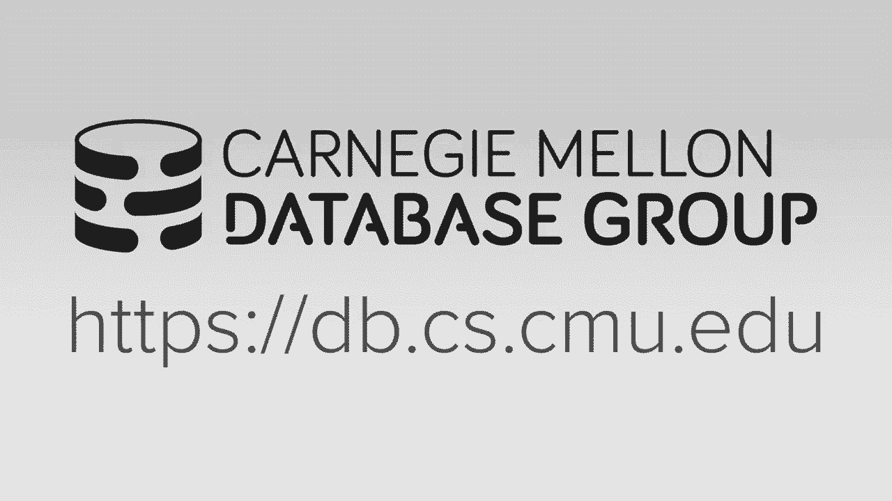
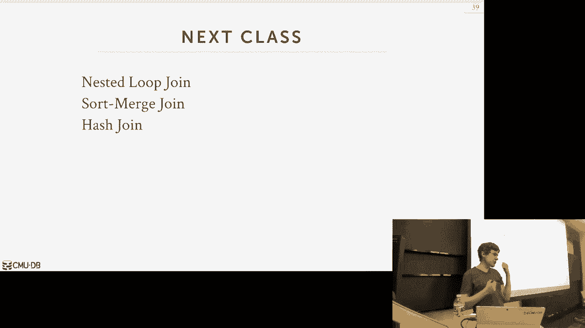

# 【双语字幕+资料下载】CMU 14-455 ｜ 数据库系统导论(2019·完整版) - P10：L10- 排序和聚合 - ShowMeAI - BV1qf4y1J7mX

Oh guys let's start it what the，president again Thank You DJ drop tables。

or keeps keeping everything for us，alright so before we get into today's。

lecture just go through real quickly，what's on the schedule for you guys。

coming up in the next two weeks so，homework three is out today it should be。

on the website well we'll set up great，scripts so you can submit later today。

and so that'll be due next week on，Wednesday the 9th in two weeks we will。

have the the midterm exam project tubes，going out today，so I'll talk about a little I'll talk。

about that at the end of this miss，lecture but that'll be due after the。

midterm the midterm will be on Wednesday，the 16th in this room at the normal。

class time it'll be you know an hour and，20 minute exam so this will cover。

everything up to and including next，week's lectures so on Wednesday the 9th。

the midterm will cover that lecture and，everything prior to that ok any，questions about any of these。

expectations so homework number three，knock that out before the midterm and。

then this thing project two it'll，encompass some of the material that we。

talked about that'll be relevant to the，midterm but it won't we do officially。

until after after the midterm so you，space space things out for you guys okay。

okay so where we're at now in the，semester is that we've again going up to。

this architecture layers we know how to，store things on disk in pages we know。

how to then copy them into memory into，our buffer pool manager as needed then。

we talked about how we actually access，them so we can build indexes on top of。

them or we can do sequential scans and，so now where we're at is up above now we。

actually want to start executing queries，we actually want to be able to take。

sequel queries generate query plans for，them and then have them use the access。

methods to get access to the data that，we need okay so for the next two weeks。

we're going to first talk about how what，how we actually implement the algorithms。

for our operators and our，then we'll talk about different ways to。

process queries themselves like it's the，how to remove data from one operator to。

the next and then we'll talk about also，to the more system architecture was the。

runtime architecture of the system for，threads or processes and how do we。

organize them to run you know queries in，parallel so I'm not gonna go into detail。

what a query plan looks like just yet I，just want to show you what one。

potentially looks like just to frame，that a conversation where we're going。

today and the next class and then we'll，go into way more detail about what query。

plan and execution looks like next week，and then when we talk about query。

optimization query planning further so a，query planet is essentially the the。

instructions or the high-level direction，of how the database system is going to。

execute a given query and we're gonna，organize the query plan into an in a。

tree tree structure or an acyclic，directed graph so we take the sequel。

query like this or doing a join with a，filter on table a and B we can represent。

it as a query plan like this where at，the leaf nodes we're doing our scans or。

accessing the the tables and then we，were moving tuples up to the next。

operator to do whatever it wants to do，so in this case here we scan a and since。

we don't have any filter on it we just，feed it right into our joint operator。

and then for the scan on B well first，apply the filter to limit out any values。

less than F at 100 and then we feed that，into our join operator and then this now。

produces some output that's then fed，into the projection operator so what I'm。

showing here is what what we call it as，a logical plan meaning I'm not saying。

anything about how we're what albs are，we're gonna use to implement all these。

different operators I'm just saying this，is at a high low what I want to do is。

the most like a direct translation of，the relational algebra I want to do a。

join I'm not telling you how I want what，to do to join us I just want to do one。

on a and B I want to get to pull some a，I didn't tell you whether to do scruncho。

scan or index scan I'm just saying just，get tuples from a so what we're focusing。

on today is now to talk about what these，algorithms actually are and then we'll。

put it all together when we talk about，query planning query optimization to say。

now we need to make a decision of here，the different choices of algorithms I。

could use or different access methods I，could use for my query which。

is gonna be the best for me so today's，lecture is really focusing on。

and-and-and and for Wednesday's lecture，as well for this week what are the。

different algorithms we can implement，for the physical operators in our query。

plan but at a high level we're assuming，that it's in this tree structure where。

we're moving two bulls one Operator to，the next so this Clara hi this is。

essentially what what you know what any，any query engine is going to do right。

they're gonna represent as a treat as a，dataflow tree and they moving tuples。

between them so the tricky thing though，now that for us when we start deciding。

what we know how do we actually，implement the algorithms for these。

operators is that again we this entire，semester is focusing on the system。

that's assuming that data doesn't fit，entirely in memory so just like within。

our disk or new database system just，like we can't assume that tables fit。

entirely memory where indexes can't fit，tiredly memory we now need to be worried。

about that the intermediate results，between those operators cannot actually。

fit entirely in main memory so therefore，when we design the algorithms we're。

going to use to execute you know the，operator we need we need to pick ones。

that actually know how to write data at，the disk and be mindful that we may have。

to read and write data from disk and，therefore we'll make certain design。

decision in those algorithms to to，accommodate them right so just as a。

quick example I'm doing a joint here on，a and B the hash table or depending what。

you know what what joint album I'm going，to use I may have to spill the disk like。

a doesn't fit in memory B doesn't fit in，memory so I need to join algorithm that。

can handle you know inputs where the，entire data set may not fit in memory。

furthermore the output also may not fit，entirely main memory so again we're。

gonna use our buffer pool manager that，we built in the first project we talked。

about before that's how we're gonna be，able to accommodate algorithms that need。

more memory than is actually available，so we're not using for tables not using。

it for for for indexes we can use it for，intermediate results and this again goes。

back to why I was saying before this is，why the you know if the database system。

ends just a memory instead of letting，the OS do it the OS can oh oh this page。

is for an ephemeral data structure to do，whatever my query is and I'm gonna throw。

immediately after the queries over and，maybe I want to do different things or。

have different replacement policies or，different strategies for those kind of。

pages and those kind of data versus the，data coming from from the underlying。

tables whereas the OS doesn't see that，it always doesn't know anything about。

what's inside these pages or how they're，being used so again we're gonna use our。

puffle manager Bureau of scope Islands a，disk and therefore we're gonna design。

algorithms of prefer algorithms they're，gonna maximize the amount of sequential。

i/o that we can do and this is gonna be，different than any algorithms course。

you've taken potentially before where，you assume that you're just reading。

writing into memory and everything has，uniform access and now we need be。

mindful of what's actually in memory，when we design these approaches so we're。

gonna first start off talking about the，external merge sort algorithm and what。

will come out of this discussion you，will see some high-level strategies for。

essentially doing divide and conquer，that allow us to then that we can apply。

to other methods or other operators we，want to implement and then we'll finish。

up talking about how to do aggregations，which can rely on sorting algorithm but。

then it also sort of Segway and into the，joint album stuff we talked about next。

week about hash joins so there's sort of，this trade-off between sorting versus。

hashing as the two different methods you，can used to exude algorithms in your。

database system we're going to first，talk about sorting and then we'll add in。

hashing at the end okay all right so，it's sort of obvious that you know why。

we need to sort but just make sure that，everyone puts this in the correct。

context the in relational model the，tuples in our relations are inherently。

unsorted right it's set algebra there's，no sort order so we can't assume that。

the the data as we read them is gonna in，any one particular order now there's。

clustering indexes that we talked about，before it was talked about again today。

which then you know provide you a，enforces of sort order based on some。

index but in general we can't assume，that's always gonna be the case and。

furthermore we could have an index our，table could be clustered on one。

particular key but now we need to sort，it on another key so that you know being。

pre-sorted doesn't actually help us in，that scenario，so in addition to also now being able to。

you know someone calls an order by and，we want to sort the output we if our。

data is sorted there's a bunch of other，optimizations we can do for other。

utility things we want to do or queries，we want to execute in our database。

system so if our table is sorted or，outputs or keys are sorted then it's。

really easy to do duplicate elimination，because now I just scan through the。

table once and if I see that's the thing，I'm looking at is the same as when I saw。

the last thing I looked at that I know，is a duplicate and I just throw it away。

for group eyes this is the same thing I，can if everything is pre-sorted then I。

can generate the aggregations by just，scanning through the table once and。

computing the running totals as needed，and then we talked about optimization of。

doing bulk so bulk loading in a P plus，tree where you pre sort all the data。

along the leaf nodes and then you build，the index from the from the bottom up。

rather than top down and that's way more，efficient so again sorting is a as a as。

a useful utility operation grid need in，our database system but we need to be。

able to accommodate one where we doesn't，fit entirely in memory because it fits。

in memory then we just pick whatever，your favorite sorting algorithm that you。

you know and love from your intro，classes and that works just fine for us，quicksort heapsort。

if you crazy bubble sort right but we，don't care it's in memory so all the。

things that we learned before in intro，to albums class work just fine but then。

the issues now if it doesn't fit in，memory quick sorts can be terrible for。

us because what does quicksort doing，quicksort is doing bunch of random。

pivots jumping around to memory in，different locations that's random i/o。

and our role because those pages we're，jumping into may not actually fit in。

memory and the worst case scenario we're，having one IO cost per you know per。

change to the the data set so instead we，want an algorithm that is mindful of the。

potential cost of reading writing dated，disk and therefore make certain the。

design decisions that try to maximize，the amount of squinch IO sequential i/o。

even on faster SSDs is to be more，efficient than than random i/o because。

you can bring a lot more data in with a，single and there's no seek in an SSD but。

within a single you know，with a single read operation or write。

operation down into the device you can，get more data coming back right so the。

I'm going to use and and at a high level，this is what every is what every single。

database and does that supports atom，memory sorting is a called the external。

merge sort alright sometimes it's a you，seek external sort merge and it be。

really confusing because they'll be，there's the external merge sort。

algorithm and then we'll see a sort，merge join which could use the merge。

sort algorithm right but I'll try to，make it more clear when we talk about。

joins what we're actually doing so as I，said this is a divide and conquer。

approach where we're gonna basically，split the data set that we want to sort。

up into these smaller chunks called runs，and then we're going to sort those runs。

individually write all the keys within a，given run or are sorted and this the。

runs are disjoint subsets of the entire，Keys that we want to sort and so then。

we're gonna sort these little these，little runs and then we're gonna start。

combining them together to create create，larger sorted runs and we keep doing。

this and doing this until we get the，full data set the full key set that we。

want sorted so there's two phases for，this so the first phase again we're。

gonna take as many blocks as we can fit，in memory sort them and then write them。

back out the disk then in the second，phase again that's when you go combine。

these sub sort sorted runs into larger，sort of runs and then write them out and。

you keep doing this over and over until，you have the entire things sorted so。

this is gonna end to end up taking，potentially multiple passes through the。

data set that we're trying to sort but，in the end we end up with a complete。

sort of run so let's start with a simple，example called a 2-way merge sort it's a。

2-way means that were where the number，two is that it's the number of sort of。

runs we're gonna merge together for，every single pass alright so within a。

pass we're gonna go grab two runs merge，them together and produce a new path a。

new run that's that's the combination of，the two smaller ones that were our input。

so our data set is gonna be broken up，into n pages and then what's now。

important for us when we consider what，how algorithms going to work is that we。

need to know how much memory is，available，to us to buffer things in memory to do。

our sorting because again if everything，fits in memory then we don't need to do。

any of this we just do quicksort but we，need to be told ahead of time how much。

memory we're allowed to use for sorting，and this is actually something you can。

configure in database systems so in，Postgres it's called working memory。

you basically say how much memory the，one particularly is allowed to use for。

whatever kind of intermediate operation，wants to do building a hash table doing。

sorting and other things like that so，we're told this we're always told this。

be ahead of time so let's look at sort，of visual examples so in past 0 you're。

gonna read every B pages from the table，into memory and then you're gonna sort。

them in place in memory and then write，them out so let's really say for example。

I have a disk on disk I have my data set，I have two pages so let's say this case。

here I can only have I can I can bring，in the first page sort that in place and。

now that's a sort of run and then I，write that sort of run out the disk and。

I'm gonna do this one at a time assuming，I must have a single thread I'm gonna do。

this one at a time for all my other，pages right so now so this is sort of。

step one and then now we're here I'm，reading the other page I bring that into。

memory sort it and then I write that out，so now that's the end of past zero that。

I've taken all the the my sort of runs，sorry all my my I grab a run that's the。

size of B pages I sort that in memory，because IB pages I'm allowed to use a。

memory so I'm sorting that in place and，then I'm writing it back out and then I。

go to the next run once after that's，done so now in the subsequent passes。

we're going to recur submerges of all，the runs we sorted so far and we're。

gonna combine them together to produce，runs that are double the size of my。

input right and so for this approach I，need I need at least three buffer pages。

because I need to have one to buffer，pages for each of the two runs that I'm。

bringing into memory and then another，buffer page for the output that I'm。

writing out so in this case here I could，say I want to sort these these that you。

sorta guys so I bring those in memory，and now I have one other page where I。

can write out the the combination of，these two guys but I you know this is。

two pages long but I only have one page，so I'm just gonna scan through each of。

these and compare them one by one to see，which one is greater than the other。

sorry which was less than the other，depending what order you're going and。

then I just write that out into a sorted，page like this and then once that's full。

then I write that out the disk and then，my merging continues where I keep going。

down think of leagues - cursors are，scanning through these guys comparing。

them one by one then I continue down，with the other data set and I write that。

write that page out and then once I've，reached the end then I have then I'm。

done this is this clip yes so her，question is if if the memory in this。

case here memory can hold three pages，why not is do exactly what I just did，here first。

yeah you could think of like and then，this is sort of simple example you can。

think of like I could bring I could，bring the two sort of pages unsorted。

pages in memory sort them in place then，do the combination without having to。

write them back out of the disk yes but，in general that's like that。

this is a trilogy upon general that's，not you can't do that this is also sort。

of oversimplification to because think，of these are like the data pages of the。

tuple or the table right there these up，tuples in them you're actually really。

can't kind of do this the the in-place，sorting like this because that would be。

modifying the actual table itself and，you don't want to do that so in general。

usually like you're not going to do this，one step here where I was sorting them，in place。

you'd make another copy and then write，that out so in that case that wouldn't。

work because you would need you would，need at most four pages in memory okay。

so so this is sort again this is a sort，of a simplification but looks like you。

work through the math now see what，actually what happens so let's go。

through a more a more fine-grain example，here so the way the math works out is。

the number of passes we need for this，two-way merge sort is 1 plus the ceiling。

of log 2n right and the first one here，the one that's 4，that's for the first pass and then the。

log 2n is is as you as you keep dividing，up the in each pass you're sort of。

getting a larger and larger runs until，you reach the total size of the data set。

right the last pass the two runs that，you're sorting will will be you know at。

most half the size of the total data，data set so the total ioio calls to。

joining sure number sword is 2m times，the number of passes and this is 2n。

because I always have to read it in and，write it out right for every pass it's。

one read in and then one right out so，and means also in every pass at most I'm。

reading I'm reading and writing every，record every key that I'm trying to sort。

exactly once once in and once back out，so let's look at an example like this。

alright so we have a bunch of pages and，each page we have two keys in them so。

yeah and then this little marker to say，here's the end of file so in the first。

pass we're just gonna read in every page，sort it and then write it back out so。

we're not examining data across，different pages or these are actually。

runs but it's it's a one page run then，in the next pass I'm gonna go grab two。

to two sort of runs that are next to，each other bring them to memory sort。

them globally within within the two，pages and then write those guys out so。

in this case here the output of the，second pass will be runs of size two。

and then I do this keep is going down，second page now I have four rot four。

page runs and the last one I have an，eight page run and then here point I'm。

done because now my output run is the，total size of of the number of keys that。

I have okay so what I've shown you so，far all right for the two a merge sort。

as I said it only requires three buffer，pages two for the input one for the。

output so back going back here when I，was creating this this you know now。

creating a run that's two pages actually，use this example so now I'm creating a。

run that has four pages I can only have，three pages in memory all right so I。

have I'm gonna have one for the the，right side or the left side one for the。

right side so again you think I'll just，have a cursor I'm just scanning through。

each of the pages on the two sides and，then compare to see whether one is。

greater than the other and if the one is，less than the other then that's what I。

write out to my output and then move，that cursor down and then I do the same。

comparison right so I keep going，step by step until I reach the end the。

cursor reach to the ends of both of them，yes a question is and what is my what am。

i showing here are these numbers，consider tuples yes，I'm showing the simplification their。

keys but in actuality in a real system，you'd have like the key you trying to。

sort on and then the record idea where，it came from，yes in this example here each square is。

a page right but I'm there's only two，okay so again for this example here we。

only have we only need two pages but the，problem is say I said I'll give you more。

pages and what I'm showing so far you're，not actually gonna get any better right。

why he's right the i/o remains the same，because what am i doing I'm going。

fetching two pages and then I have this，cursor it's gonna walk through them and。

then whatever one has the you has the，lower key that gets written out to the。

third page having more pages in memory，doesn't really help us because you know。

eventually I'm only can doing comparison，you know two pages at a time so a really。

simple optimization to to minimize this，this this i/o cost is to do prefetching。

so this technique is called double，buffering the idea is that when you go。

and start merging say two other pages，you have a bunch of shadow pages or。

shadow buffers where you start fetching，in the the next runs you need to sort or。

the next pages you need to sort so it，requires you to have deuce asynchronous。

i/o to have something in the background，go and fetch the the next pages you're。

going to need so that when the cursor，reads that reaches the end of the。

current page that's operating on the，next page that it needs is there if it's。

single threaded and every everything，synchronous then you have this ping-pong。

effect where I'm gonna be CPU bound and，disk bound and CPU bound the disk bound。

because I'm gonna bring the page in and，wait for that then do my sorting that's。

all CPU then I'm done that doing that，sorting or done doing the merging and。

now I have to get to the next page and，I'm I'm blocked on that right so really。

simple example here I want to sort one，and then while I'm doing that in the。

background I go fetch page two and then，by the time I'm sorting this one then。

when that's done then when this guy's，okay right so this is this you know the。

to a merge sort is a sort of most simple，way to consider this we need to consider。

that what how this works with a general，you know general anyway sort or k way。

sort yes sorry so this question is how，do you how do you do this optimization。

student sorting while on the background，there's it's going fetching data well。

this is actually the operating system，helps us right so we make a request from。

the operating system go read this for us，and then there has another thread that's。

called any synchronous i/o in the，background it goes fetch the data we。

need we tell it where we're to put it，and then that way I through I can do all。

the computation as well actually the，data says we can do this well you。

actually don't need the OS in a real，system you would have like a IO。

dispatcher thread so you say I want this，request get me this page and then give。

me you know here's a call up to tell me，when it's actually ready then it goes。

and does that your thread can do，whatever computation at once and then。

when it's done it's available for you，okay so let's quickly go over how to。

generalize this algorithm beyond just，having just do two you know standard two。

ways sort so with the general K way sort，it's still the same we're to use remai。

be buffer pools and then in the first，pass we're gonna produce and divide it。

be the ceiling of that sort of runs of，size B because that's what we're doing。

the in-place sorting and then in the，subsequent passes we're gonna do we're。

gonna generate B minus one runs at a，time right and it's always minus one。

because we always need one buffer for，the output having additional output。

buffers doesn't help us because you，really only write to one with one thread。

but only write the one output buffer at，a time so that's why it's B minus one so。

the way the math works out is just an，extension of what we showed before we're。

set up now saying log 2n or law to it's，log B minus one and then you take the。

ceiling of n divided by B but still the，the i/o cost is two n times the number，passes。

so this is very plugging chuggy you'll，see this when you do the homework right。

you fill in the bees fill in the ends，and the numbers work out so let's just。

walk through a really quick example here，so we're gonna sort 108 pages with with。

five five buffers pages we can use 2n，equals 108 P equals five so in the first。

pass write the the amount of i/o that，we're going to do is we're trying to。

compute how many runs we're going to，generate so it's the ceiling of 108。

divided by five so that's gonna generate，two twenty three sort of runs of five。

pages each right and then the last page，the last run is only three pages so。

that's why you have to take the ceiling，right because you don't want a。

fractional cost and then going down in，the subsequent passes now you're taking。

the the number of runs you want you，generate at the previous pass and。

dividing that by the number of the size，of the run you're going to generate。

before right so now it was two now it's，four so this generates six sort of runs。

of twenty pages where the last page is，the last run is only eight pages and。

then just sort of going down just keep，applying over and over again until you。

reach the very end where you have now a，the data set is exactly the same size as。

the original one yes these questions are，assuming here this sort of done in place。

for the first pass yes for the，subsequent passes now but as if this is。

what the textbook does in a real system，you wouldn't do that because again the。

the depending on how where you're，reading the data from it could if it's。

coming directly from the table itself，then you can't modify that if it's。

coming from another operator then you，can do that yes yeah the -1 close it。

because you always have the one one，buffer page for the output yeah so yeah。

indeed in the general case it was three，right good one whatever it's two for the。

this question is why am I using five，here so you're sorting yes sorry it。

makes it so before I was sorting two，runs at a time this is now sorting。

multiple runs at a time right so I'm so，say with B equals five I bought five。

buffer pages so for each of the sort of，runs I'm gonna five sort of runs I'm。

gonna try to merge at the same time and，again all I need to do is just have a。

cursor sit at each one and walk through，them one by one and just do a comparison。

across all that and say which one is the，which one is the smallest write that out。

and then now we have four cursors and，one applet yes yeah I should visualize。

that sorry again this wife record Excel，remember to do that next year or is this。

clear okay so that's external merge sort，they said this is this is the exact。

details of how you actually implement，this will vary from system to system。

there's obviously some other，optimizations we can think about like。

some hints to say oh I know the min，value of the max value if my sort of run。

is is this an that and my min max value，for this other sort of run is that so。

therefore if I know that the the min，value is is greater than the max value。

this other sort of run I don't need to，do the merge I disappear on top of Java。

right so there's some optimizations you，can do like that but in general what。

I've shown here today is works you know，works well for for for most data sets。

assuming uniform distribution of the，values there's no sort of there's no。

locality to enter the data it's just，completely random this works fine if you。

know that something more about my your，data like it's skewed in a certain way。

then you can apply some simple，techniques to speed this thing up but。

this is what I've shown today is just，like the pickup truck version of it a。

instead of actually just doing the sort，of brute first brute force mergesort。

that I showed here sure now，there may be some cases where we can。

actually use the B plus tree to speed up，our sorting operation so in general the。

sorting and joint algorithms those are，actually the most expensive things to do。

oh so if there's any way we can speed，these things up this is always gonna be。

a good choice for us so what did the B，plus tree essentially doing well it's。

maintaining the sort order for our keys，in the data structure so we're paying。

you know the penalty to maintain update，do splits emerges as needed on our B。

plus tree as the table gets modified but，now we can then possibly piggyback off。

of that work we've already done to speed，up by sorting but not having to do。

sorting at all so if our sorting，operation that we need if the keys we。

want to sort on are the same keys that，are B plus tree is indexed on then we。

can potentially just reuse the B plus，tree and not go through that whole looks。

from merge sort and with multiple passes，that I just showed but it only works if。

we have a cluster B plus tree again we，showed an example of that I think two。

classes ago but now we showed it more，visual cable what actually is going on。

and you'll see why this makes sense for，sorting but not for the uncluttered one。

so the clustered B plus tree a clustered，index just means that the the sort order。

or the physical location of the tuples，on our pages will match the sort order。

defined in the index so if I have a，index on key foo then along my pages。

will be the the the tuples we sorted in，pages based based on that order of foo。

so now if I want to do a sort on that，key I don't need to do external merge。

sort because all I need to do is is get，down to my leaf pages and IB plus tree。

because now the the sort order of the，key will match the sort order of the of。

how the data is B is found，so I don't need you any extra，computation to to go sort it it's。

already sorted for me，so this again this is another example，where the database system the query。

planner that we'll talk about after the，midterm or the class before the midterm。

the the query optimizer can figure out，oh you want to do a sort on this key I。

already have a clustered index on that，key let me go use that to generate the。

corrects whole order and not even bother，running external merge sort but as we。

saw in the case of Postgres they can't，they don't enforce this you tell me I。

want a complete cluster on an index on a，given key they're not gonna maintain。

that's what ordering other systems will，do this so now if you have an。

uncluttered index on custom P plus，trading this is actually the worst。

possible thing to use for trying to，generate a sort order and we think I。

guess why it should be obvious what's，that，great you have one eye open record so。

again I traverse the index to be gentle，to the left side of the tree and I want。

scan across and because that's how my my，keys are sorted but the data has no。

connection to how it's being sorted in，the index so for every single record I。

got to go get and generate as my output，I may be doing another disk i/o because。

the page I need is not in memory I go to，disco get it bring my brother poll and。

then now that very next key it I look at，is in another page and it's a victim one。

I just brought in and bring him the next，one yes the question is what does it。

mean for tree to be you wouldn't say it，is a you don't say the trees clustered。

the tables clustered again I wouldn't，call it that like if I was writing you。

know coming with those terms I would，call it oh it's a sorted table for。

whatever reason they call it a cluster，table right because it's basically the。

the tuples that are that are similar to，each other，are clustered together on the page right。

so again back here this the sort order，of the how the two was actually being。

stored matches the sort order the key so，this is this would be a clustered index，all right all right。

in this case here we just call create，index this is what you normally get the。

or just you know the actual where the，records actually being sword has no。

questions what is the information in the，tree it's just the B+ tree we talked。

about before right so create index on on，on key foo so to build that index I'm。

doing special scan looking at every，single tuple getting their value of foo。

inserting that into my tree and the key，value pair is the value of fee of foo。

and then the the value is the record I，need a pointer to the tuple all right。

this is different than the index，organized indexes or any index organized。

tables we talked about where the two，will pages are actually in the leaf。

nodes themselves in that case that is a，clustered index but it's also in its。

organized table this is like if there's，they're not you're not storing the data。

in the leaf nodes themselves if it's，yeah so David is instead of actually。

every single time I encounter a key，immediately go fetch it what if I get。

all the keys that I need and their，record IDs and then now do combine the。

lookup so that I get all the ones from，page 101 first and all the ones on page。

one or two yes there we'll talk about，two weeks or next week right。

four scans that's a common optimization，but that assumes that you can fit like。

the yeah the key set and there are some，algorithms where you actually can start。

producing outputs sooner rather than，later，this is like an all-or-nothing this is。

like what I've shown so far is I'm gonna，get all you know this operator asked me。

to get this data in sort of order so I'm，gonna get it all now and then I don't。

move on to the next operator until I get，everything there are some streaming。

operators where you could say all right，to start streaming data out as you get，rather than。

like there's other optimizations that I，can do up in the tree so in that case。

you're you know your best approach won't，work won't work in that environment but。

that that is a common opposition we'll，see this in like next week okay all。

right so again the main takeaway of this，is if it's a cluster index and and the。

query needs it to be sorted on the key，that the index is based on then you just。

you just use the clustered index if it's，not a clustered index then you just。

almost never want to use it all right so，that's basically it for discussing。

sorting so let's talk about do some，other operations so imitator we're now。

going to focus on aggregations because，for aggregations is another good is。

another good example of or it is an，example of a type of operator where we。

can make you a choice between sorting，versus hashing as our for our algorithm。

and then have different trade-offs and，have different performance，characteristics because one is。

essentially you know trying to do a lot，of switch will access someone's trying。

to do random access so maybe certain，scenarios where one might be better than。

another in general as a spoiler what，I'll say is that and no one was always。

in the case no matter how fast the disk，is oftentimes the the hashing approach。

will work better and we'll see an，example of how we can actually make the。

hashing aggregation do more sequential，i/o rather than random i/o all right so。

if you take the advanced class in the，spring this is another big thing too is。

like hashing always works super fast，because everything is in memory all。

right so how would you use sorting do an，aggregation well again what does an。

aggregation doing you're basically，taking a bunch of values and you're。

coalescing them to produce a single，scalar value so with sorting the nice。

thing about it is that because the data，is sorted as I said when we take a pass。

now through the sorted output we don't，have to backtrack to computer。

aggregation and we only do one pass to，find to compute whatever the answer it。

is that we want so let's see a real，simple query here we want to do it we're。

doing we're doing a scan on the enrolled，table all right，students rolled in the classes the。

database classes at CMU and we would we，always want to get the all the distinct。

course IDs from any class where a，student either got a B or C in it and we。

want the output to be sorted based on，the course ID so the very first thing。

we're going to do in our query plan tree，is do the filter so we're gonna first。

filter out all the tuples where the，grade is not B or C then the next step。

we're going to do is remove all the，columns we don't need in our output。

right we only need the course ID we only，need the course ID to do the order by。

and for the stink clause because for our，filter it access the grade table at that。

point we know in our query plan we don't，need to ever look at the great the great。

column anymore we don't need to look up，a student ID anymore so if we can strip。

all that out before we move on to the，next operator and then we finish off now。

by sorting on sample column here and，because we're doing a distinct。

aggregation or distinct clause we want，to remove any duplicate values so all we。

need to do is just have our cursor scan，through this and any time it finds a。

value where that was same same as the，one I just looked at that knows it can。

throw it away and strip that out and，that's our final output so we'll go into。

this more next week when we talk about，query planning but just one obvious。

thing during this in this pipeline we，make students query that I did was I try。

to strip out as much useless data as，possible sooner in my in my pipeline。

rather than later so the very first，thing I did was the filter so say you。

know say this table had a billion，records in it but only five of them。

match or for them match for my predicate，so rather than me sorting a billion。

records first then going back and，filtering it it was better for me to。

filter it first then move that movie to，move the data on to the next operators。

same thing for the projection right this，is a row stored it's not a column store。

in my example so in order for me to go，get the data I need to do you know。

whatever the sorting I want to do I，gotta go get the entire I mean the。

entire record because that's gonna be，packed together in a single page but if，I can do a projection。

you strip out all the columns I don't，need or the attributes they don't need。

and then now when I'm doing my sorting，I'm not copying around a bunch of extra。

data so my sort of sort of simple，examples and was related to her question。

the you know what a might be actually，passing around it could be the record ID。

it could actually be the entire tuple，itself depending on how I want to。

materialize things so the projection，here allows me to throw away coms I。

don't need so now when I'm when I'm，doing my sorting I'm I'm only you know。

I'm copying things that just related to，what's needed for the rest of the query。

plan yes so his question is I mean it's，not really this query you're talking。

like a count query so this question is，the the grey column is has a fixed。

domain meaning it's a B C D or E I don't，think see me as s does it you have an。

completes right but it's fixed oh，there's another one that's whatever tom。

is when I go putting your grades I can't，tell whether you're an undergrad or。

graduate student so I'm like oh this，student got you know did awesome to get。

an a-plus but then it throws an error，because they're an undergrad undergrads。

can get a pluses unless you're ECE which，I think you can，it's a nightmare but anyway so his。

question is all right so couldn't I have，some kind of side table that has a tally。

that keeps track of every single time I，inserted a tuple with one of these。

values and I'm trying to maintain an，accountant I increment that counter by。

within a page all right so what he's，saying is say this was stored in a page。

this this little example here is in one，page and then for the grade column I。

could keep track of the min and Max，value so this case B or C so now if I'm。

say I'm looking for all people that have，the grade A if I get to that page and I。

look say oh why it's only between B and，C because nobody has an A in that page I。

don't mean even bother looking at the，column that's what you're saying right。

okay I I think we are - I want the same，thing what you're describing called zone。

maps right well we will talk about this，I think next week or this week I forget。

when but basically there's a way to keep，track of yourself on auxiliary data。

structure on the side that he looked at，that first and then you then you check。

the page yes so that's a zone map you，can you could or could not be in the。

same page you could have a separate page，but within the page but it's basically a。

precomputed information to say the data，you here's the range of data that could。

possibly exist for each attribute and，you refer to that first and make，further。

yes so those are called zone maps，they're called pre oracles and zone maps。

tremendous a call a pre computed，pre-computer materialized aggregation，things。

but that does exist we'll cover that，later yes that's an index right that's。

what it index does here's how my，something more fine like like not an in。

Excel I think right yeah that's a zone，and again the the beauty of a。

declarative language like sequel is that，I write my sequel query like this I。

don't know whether I'm using zone maps I，don't know whether I'm using an index I。

don't care the databases won't figure，out what's the best strategy for me to。

go find the data that I want right so，just trying to try never move is。

is crap quickly as possible that's the，whole goal of all this alright so that。

was a change about zone maps we'll cover，that later the main point I want the。

main takeaway from this was if I'm，sorted I do one pass and I can eliminate。

the duplicates all right in this example，here this worked out great for us。

because the output need to be sorted on，a course ID so I was it was two for one。

I did my sorting because that's the，output I needed but then I'm also in the。

sort order I need for my output right so，in this case here doing a sorting based。

aggregation is a definite win for us but，in many cases we don't actually need the。

output to be sorted right so again you，still can use sorting for this like you。

can do foregrip eyes and and and doing，distinct stuff but if you don't need to。

be sorted then this actually might be，more expensive because again the sorting。

process itself is not cheap so this is，where hashing can help us so hashing is。

a way for us to be able to sort of again，another divide and conquer approach。

where we can split up the data set and，guide our the the tuples or the keys。

that were examining to particular pages，and then do our processing and memory on。

those pages but again hashing removes，all all locality all any sort ordering。

because it's taking any key and do you，know doing some hash function on it and。

now it's going to jump to some random，location so we this works great if we。

don't need sorting we don't think don't，need things to be ordered so the way we。

can do a hashing aggregate is we're，gonna populate at a femoral hash table。

as the date of some scans the table or，scans whatever our input is hey and then。

say we you know when we do our lookup，depending on what kind of aggregation。

we're doing if we do an insert and the，key is not there then we populate it if。

it is there then we may want to modify，it or modify its value to compute。

whatever the aggregation that it is that，we want right for distinct it just a。

hash see whether it's in there if it's，is then I know it's already I it's a。

duplicate so I don't bother inserting it，for the group like queries for the。

others other aggregations you may have，to update a running total and what we'll。

see an example of this so this approach，is fantastic if everything fits in。

memory so the key thing I'm saying up，above I'm saying it's an ephemeral hash。

table not an emery hash table so，ephemeral or transient means that this。

is a hash table I'm gonna build through，my one query and then when that query is。

done I throw it all away I'm gonna do，this for every single query I said that。

we said in the very beginning we use，data structures and different ways of。

the database system so there's the，example of a transy data structure I。

need it for just my one query I do，whatever I want then I throw it away so。

if everything is in memory the hash，tables fantastic because it's oh one。

book UPS to go update things right in，this case you're also not doing deletes。

right it's just inserting things or，updating things if we need to spill a。

disk though now we're screwed because，now that this random randomness is gonna。

hurt us because now I'm jumping around，to different different pages or blocks。

in my hash table and each one could be，incurring an i/o so we want to be a bit。

smarter about this and trying to，maximize the amount of work we can do。

for every single page we bring into，memory so this is what external hash me。

aggregate does and it's again the high，level is the same way as the same。

technique that we did for external merge，sort it's a divide and conquer approach。

so the first thing we're to go through，to take a pass through our data and。

we're to split it up into a partition，into buckets where so that all the。

tuples that are either the same that all，tubes that are the same had the same key。

will land in the same same partition and，then we go back through in the second。

phase and now for each partition we're，gonna build an in-memory hash table that。

we can then do whatever it is that the，aggregation that we want to do then we。

produce our final output throw that that，a memory hash table way and then move on。

to the next partition ok we're，maximizing the amount of sequential i/o。

that we're doing and for every single，page we every single i/o we have to do。

to bring something into memory then we，do all，the work we need to do on that one page。

before we move on to the to the next，ones so we never again never we never。

have to backtrack so let's go through，these two phases so in the first phase。

again what we're trying to do is we're，going to split the tuples up into。

partitions that we can then write out，the disk as needed so we're gonna use。

our first hash function it's just to，split things up and again we use member。

hash city hash xx - 3 whatever it，doesn't matter and so the reason why。

we're doing this is that because our，hash table hash function is。

deterministic meaning the same key will，always be given the same hashed value。

output that means that tuples that have，the same key will land in the same。

partition and we don't need to hunt，around for other parts of the the。

tablespace at the table to find the same，key they're always gonna be in our one。

partition our partitions can just build，a disk using the buffer manager when。

they when they get full so so we have a，page that we're storing the the current。

partition data and when that gets full，we just write that out to disk and start。

filling in the next page so in this case，here we're gonna assume we have B。

buffers and we're gonna use B - buffers，for the partitions and at least one。

buffer for the input so I'm gonna bring，in one page from my table and I'm going。

to ask winchell scan on that page look，at every single tuple and then it's。

gonna write it out to be minus 1，partitions alright because you need to。

have at least one buffer in memory for，each partition yes so so if if say I'm。

doing I'm gonna doing a group I on the，course ID here next like I'm doing a。

group I on the course ID I'm doing，aggregation so I'm gonna hash this。

course ID for every single tuple if I，had the same course ID it's gonna Lane。

that in the same partition so it's gonna，live there right reside live stored and。

then that way when I want to go now do，that in this case the duplicate。

elimination when I come back the second，time I know that the the tuples that go。

have the same key has to be in the same，partition there's not gonna be some，other random place。

this question it's partition to page no，partition would be like a it's a little。

logical thing take the hash value Matta，by the number of partitions and that。

were you write into and these partition，can have multiple pages alright so again。

we do our filter do as we did before we，remove our projection columns and then。

now we take our all the output of here，we're gonna run it through our hash。

function and we write it out to the，partition pages so in this case here I'd。

be -1 so say there's like four or five，I'm showing three here so all the 15 for。

45 keys land here all the 1588 26 land，here at 15 7 21 lens here so again you。

could be smart about this and say，alright well I know I'm doing doing。

distinct so within my page if I see the，same thing then don't bother putting it。

into it but for simplicity reasons we're，just we're just we're blindly just。

putting it in yes question is what is it，what is it partition you can think of。

like a partition is thinking like it's，like the the bucket chain and the chain。

hash table you just have within a within，a chain you could have multiple pages。

but I only have one page in memory as，I'm populating this because again for。

everything every single time I'm gonna，catch something and insert it into this。

I'm only inserting into one page and，when this gets full I guess again。

written out to disk and I now allocate，another one that I start filling up so。

within memory why I'm doing this first，days I only need B minus 1 pages because。

so this question is what if the number，of distinct course IDs you do because。

you're hashing it right you're dating -，mod to take this hash value mont by b。

minus 1 so in this example here I'm only，showing three distinct keys but like I。

have another class 15 for ten back at，land in the same bucket as 15 for 45 I。

don't need to have a partition for every，sting every stinky the hashing allows。

them to go into the same thing your face，looks like you'd like this confused by。

this right again so I have 15 for 10 I'm，gonna hash it I'm on it by B minus 1 it。

lands in partition 0 and so I just，append it to this to this page right and。

then the main thing is that 15 for 10，can't exist in any other page because。

the hash function always guarantee that，it's always gonna point to this one if。

the partition the current page with this，partition overflows I write it out the。

disk and I allocate a new page and start，filling that up yeah you first plus the。

page allocate a new one yes and again，like at this phase all we're doing is。

this partitioning so I don't care like I，can be smart and say oh I'm doing。

duplicate elimination I know I already，have 1545 over here I don't put it in。

ignore that for now right，it's just I'm blindly putting things。

into this to the pages and writing them，out yes yes so so this question is it's。

getting written out the disk where am i，storing the metadata that says oh。

partition 0 has these pages you had that，in memory data structure you keep track。

of like partition 0 here's the pages for，our partition 1 here's the pages for it。

but that's small right that's like，this question is are we not considering，right。

it's in actually maybe use another table，than indistinct maybe that's following。

people but if I'm doing a you know a，count again you can do that more。

efficiently as well but like like I，don't care putting in inside of this I。

don't care this collision scope because，I'm gonna resolve that in the second。

phase when I rehash things your question，is where is this number coming from B。

minus one so that's the database system，telling this query that's whatever。

thread or worker that's exiting these，queries you have this amount of memory。

to use for query processing yeah so like，the data system says you're allowed to。

have B equals 100 pages to do whatever，you want to do for next to the query to。

execute this algorithm I I'm gonna use B，minus 1 to store my part I'll be minus 1。

partitions because these partition will，have one page yeah it sucks yeah your。

question is if B is really small，you're yes right there's nothing you can。

do it's not it's not like you might you，know you can't magically just add more。

memory right justifying that resource，the database system you know is the is。

is doing resource management it's，deciding oh I have a lot of queries that。

need to execute at the same time so，therefore I can't let them all have a。

lot of memory so this gets into the，tuning side of things which is actually。

very difficult as well yes ok so he says，and I don't have slides with this we'll。

do it next class he said that you're，screwed let me rephrase what you said。

you're screwed are you better if，everything hashes is this bucket so say。

this is this is most popular course，McAmis everyone's taking 1545 right then，as I hash。

everyone lands there then I'm screwed，right but again this gets into the query。

planning side of things the database，system could look at and say oh I know。

what the distribution of values are for，for this column and everyone is taken 15。

40 45 so therefore if I do this，technique then I'm it's not gonna get。

any benefit because everything's gonna，hash to this and it's always to work I。

this question is you always don't know，about the data like you know a good。

decision will know something it won't be，entirely accurate but it'll know。

something so this table is like with the，full data set，these can be this be unskilled but then。

this is skewed again this is this is，next week or two weeks the daily ISM can。

maintain metadata about every single，column histogram sketches I do an。

approximation of what the dish being，about looked like again for skewed。

workloads that's harder you got a call，all right he's got a call yeah all right，sorry。

he's out on parole says what he's got a，call his parole officer all right so for。

simplicity I'm just saying assume，uniform distribution okay for skewed。

work again they'll be assert up to a，certain point where this technique won't。

work in a squinter scam will be the，better approach yes this question is。

what is the overhead of removing columns，so in in this example here I'm showing。

this as like discrete steps like filter，and then remove you can inline a combine。

these together but again this is another，great example there's a trade-off so if。

my table is massive and I know that I，don't need all the columns up up above。

an entry then it's totally worth it to，me to pay the penalty to do this，projection because there。

copping datum but if I only have one，tuple then I'll delay that that may be。

the projection as late as possible，because that's gonna be it's just。

cheaper to do at the very end all right，there's a trip how wide and how tall the。

table is and again the data system can，figure this out，attempt to ok so what we're doing here。

in the first phase where we're taking，the course ID we're hashing it we're。

putting into these these pages for the，partitions so now in the second phase we。

rehash for every single partition now，we're gonna bring them bring bring the。

the pages in right and then we're gonna，build a named memory hash table that we。

can then use to find that the same keys，so we don't have to do this we could。

just bring in every single partition and，do scratch or scan on them but because。

we're doing aggregations we know that we，don't need we don't need to have all of。

the duplicate keys in memory at the same，time so we're using a hash table to。

summarize it and could condense it down，to just the bare minimum information。

that we need to compute our result and，again the reason why we did the。

partitioning first is that when we go，back in the second phase and we do。

rehashing we know that all the keys that，are the same will exist in the same。

partition so once we go through all the，pages within that partition we compute。

whatever the answer that is that we want，we can we can potentially throw it at。

that hash table away because we know，that there's or at least produce it as。

an output there's no that it's the keys，that we've updated so far through that。

one partition will never get updated，again from any other partition because。

the hashing guarantees locality for us，all right so back here right these are。

all the buckets we generated in the，first phase so let's say now that we can。

bring in you know we can bring in you，know these two pages or all the。

partitions for well we can process these，two partitions in memory at the same。

time so all we're gonna do is just have，a cursor that can just scan through them。

and every single key you're gonna hash，it and populate the hash table。

and I keep the scanning down and do the，same thing for everything else and then。

now I produce this as my final result，again for some realize that may be。

confusing the final result of this hash，table or the is the same as this one but。

you know and the main takeaway is that，we're gonna throw this away when we move。

on to the next the next partitions right，and this one we keep around distinct is。

like a little bit too simple but like I，was trying to pick something I just。

distill down the core ideas alright so，now we got this other partition here so。

again we blow away that the hash table，from the first the first set of。

partitions we do the same thing build a，Ameri hash table for this guy and then。

we just when it's done with minutes，populate this thing yes a question her。

statement is assuming we're not gonna，have collisions in the second hash。

function you yes that we can write her，so her statement is question is what。

but it so that that does the collision，handling schemes that we talked about we。

talked about hash tables so it's either，linear probing cuckoo hash whatever the。

Robin Hood stuff right that's all the，internal to the hash table we're sort of。

above it now we're saying your hash，table I can write things into key value。

pairs and it'll it'll store them for me，I don't know and I don't really care at。

this point how it handles collisions，okay again distinctive is a really。

stupid simple example but you know going，through those processes is it was main。

thing I what you guys get okay a，statement is the question is how is this。

faster than then sorting for this，particular query probably not it depends。

I'll cover those let me leave really，punt on that question until next week。

and be more clear when you start seeing，yeah so again because this is these。

question is why do we need this when，it's just this one is right into this。

and that example yes but like I was，trying to show that you look you have an。

ephemeral hash table as you bill and，populate and then when you're done then。

you shove it into this thing four，distinct it's stupid doesn't make sense。

for aggregations fraud aggregations you，could potentially do that as well right。

because again this like this may not fit，in memory yes oh so yes so I should be。

clear this is this is a different seed，same so you know remember half of the。

difference seat this question is like，say I built this first hash table and I。

use that one C for the hash function now，down here do I need to use can I use a。

different seed I don't think it matters，right，if you're writing into this if you're。

writing into the same hash table you，have to be have to use the same seed if。

you're just gonna merge that in later on，it doesn't matter now。

yeah yes yes the final result farmers on，the database，I've sent a final result of an operator。

is always gonna be a relation so this is，it could be a hash table it could be。

just a buffer of pages depends on，implementation I realized that like it's。

the same shapes yeah sorry，alright so finish up，let's talk about it do something more。

complicated it's actually had to do you，know a grens were you know the actual。

producing a real result so for this one，they the intermediate hash-table after。

ever using for the the second phase，we're actually going to use that to。

maintain the running total of whatever，it is the competition we're trying to do。

in our aggregate from aggregate function，right and so this running value would。

depend on what the aggregation you're，actually trying to do so it's going back。

here so saying all of these guys now I'm，doing a I'm getting the the course ID。

and I'm doing the average GPA so in the，hash table that I could be generating。

for all of these I'm gonna have the the，key map to this like topple value that's。

going to keep the running count of the，number of keys that I've seen with there。

sorry number two was I've seen with the，same key and then just the summation of。

of their GPAs right and then I just take，this thing and then when I went to。

compute its produced a final output I，take the running total divided by the。

number of tuples and that's how I get my，average so for all the different hash。

different aggregation functions and，generally just keep track of you know a。

single scalar value account you're just，adding one every single time you see。

your new key or key of the same value，and then for some you just keep adding。

values together for the average you you，can compute that with with the number of。

the count plus the sum standard，deviation or other other aggregation。

functions you you maintain a little more，information so now basically what。

happens in our hash table when we want，when we want to update the hash table we。

do an insert if it's not there we just，add it if it is there then we need to be。

able to modify this in place or do a，delete followed by an insert to update。

it so this time and again if you were，doing this with sorting you could do the。

same thing you would have this on the，side and then as your scan through and。

in the final sort of output you wouldn't，you could update these totals and。

all right so I'm gonna skip this for now，this will this will make more sense for。

next week we do hash trends essentially，a hash joins would be essentially do the。

same thing that we're gonna build this，ephemeral hash table with on on the keys。

we want to do a join one and then we，probe in that and see whether we have a。

match and we produce our final output or，the operator okay so let's let's get。

this and then we'll focus well we'll，discuss this again next week when we or。

next to next Wednesday we do hash lines，okay all right，so in conclusion so what I show today is。

this sort of the trade-offs between，sorting and hashing and again we'll go。

to more details about which one is，better than the other when we talk about。

joins next week the high level，techniques that we talked about here are。

we applicable for all the parts of the，database system so this partitioning。

approach this divide and conquer，approach all that is useful for other。

algorithms other methods we have we we，care about in our system so we'll see。

this recurring theme throughout the rest，of semester that splitting things up。

into smaller units of work and trying to，operate on that small small chunk of。

data or small problem is gonna be very，very useful technique okay all right so。

let's know what project two so project，two you are going to be building a。

thread safe linear probing hash table so，this is me built on top of a buffer pool。

you built in the first project so it's，not an in-memory hash table it has we。

backed by disk pages so we're not gonna，do anything that we talked about here in。

this class we're doing trying to，maximize crunch why oh it's just you do。

random i/o and you go grab pages and，from your buffle manager as needed right。

to do to do inserts and deletes so your，are going to support resizing so again。

linear probing hash table assumes it's a，static hash table but when it gets full。

then you need to take a latch on it and，then resize the entire thing so you need。

to support resizing as well and you need，to support doing this resizing when。

multiple threads could be accessing the，the hash table at the same time so the。

the website is up the it's not announced，yet on Piazza，what will remain there's some final。

adjustments we're doing for the source，hope to，this will be later today I don't know。

let's our animations alright so there's，four tests you're gonna have to do the。

first is that you're responsible for，designing the page layout of the。

hash-table blocks so this is the header，page and then the actual block page is。

where the actual key values are stored，so this is a useful exercise to get you。

to understand what it means to take a，you know a page from the buffer pool。

manager and then be able to interpret it，in such a way that stores the data。

exactly that you want all right it's not，your just malloc in some space you're。

going to bump Amanda he says give me a，page and you say oh this is a this is a。

hash table block page here's the offsets，to find the data that I'm looking for，data。

so your first implement those two，classes they do the header page and then。

the block pages then you want to，implement the basic hash table itself。

right to do inserts and deletes and they，get also support concurrent operations。

using a reader writer latch which we，provide you and then also support。

resizing you take a latch in the entire，table double the size of it and then。

rehash everything so you need you need，to be able to support that so you should。

follow the the textbook semantics and，algorithms for how they do you know do，the various operations。

I think the lecture I gave on milena，hash table follows the textbook pretty。

closely and the later hash table doesn't，have that many you know different design。

decisions you have to make it's just，sort of going through these X steps I。

advise you to first obviously work on，the page layout because you know you。

can't have a hash table that you can，stored in pages anyway but you should。

make sure that your pages work perfectly，before you move on to actually building。

the hash table itself so we'll provide，you some basic tests test cases again to。

do some rudimentary checks for your page，layouts but it's up for you to guys to。

make sure that it's actually you know do，you simply more rigorous because if your。

page layout gets [ __ ] up and then now，you start doing your hash table on that。

it's like building a house on sand，because now you're like my hash table is。

not working and it could it could，because the your pages aren't working。

correctly so get this down solid before，moving to the next thing then when you。

when you actually build the hash table，thread safe，focus on the honest single-threaded。

support first this is a common design，approach in database systems this is the。

approach I take with my own research and，in practice I think this is not every。

company follows this he's wearing the，shirt for the company that does not。

follow this the focus on correctness，first don't worry about it being slow so。

make it you know make sure that it works，exactly what you think it should work。

then go back and now start doing up the，optimizations that some of the things he。

suggested some things we talked about in，class to be you know to do optimistic。

latching be more more crafty on how you，release latches right make sure it works。

correct force have test cases to prove，that it works correctly for you then。

when you go start trying to make it go，faster because we'll have a leaderboard。

to see who has the fastest hash-table，then you know then you know that you're。

working with a again a solid，implementation okay all right so just。

like before you don't need to change any，other files in the system other than the。

ones that you have to spit on great，scope this is what we're working on now。

so Wilson announced on Piazza that you，want to rebase your existing code on top。

of the latest master because that I'll，bring in the new the sample header files。

and the sample test cases before you，will provide instruction exactly what。

you need to need to do the rebase，obviously makes you know since you can。

blow away your source code on github，very easily with a Porsche push force。

make sure you make a backup of your if，your copy but first before you start。

doing the rebase and then as always post，your questions on Piazza and and come to。

come to office hours yes this question，is if we assume if you get a hundred。

cent score on the first project and you，assume that you're your buff elimination。

is solid to support hashable yes I could，right but I would say like there was a。

blog last year that that exact problem，showed up that's all the unresolved so I。

think if you've passed our test it，should be solid this question is coming。

now releases a skirt I cannot do that，because there's some people that are。

still haven't submitted yet let's take，that all fine in the back yes for the。

sorry for the first project you can，submit as much as you want。

yeah yeah what is the whatever whenever，whatever the highest score you got from。

the last I see great scope of let you，activate what you scored you want try it。

I think but it's whatever the highest，use，yeah yeah you submitted is all you want。

you like if you get if you had an eighty，before and have a hunter after the。

deadline you have an eighty score you，play the game with it like the late days。

but that you know yeah again your，question is what if you change your。

invitation after the fact for from，project one the it would still be you so。

people Schmitt on great scope the old，project for project one we could just。

have it throw in the first test as well，if you want to that make it easier like。

it'll run all the tests from the first，project you won't get a score for that。

but it does be there we could do that，well fix that okay what's that you know。

make it slower that's the only thing，[Music]，yeah but you can still be able to submit。

for the first one okay do not plagiarize，we won that we're gonna run this emboss。

this is we're doing that this week for，your first project if you plagiarize。

well [ __ ] ever worn a hole you'd be，kicked out okay。

don't do that next class we're doing，joints next live joining partners。

joining to hash coins okay alright he's。

got a call here guys ricochet jelly hit，the deli put one naturally rap is like。

the bottle don't fill out drink it only，to you can't and if the sink don't know。

