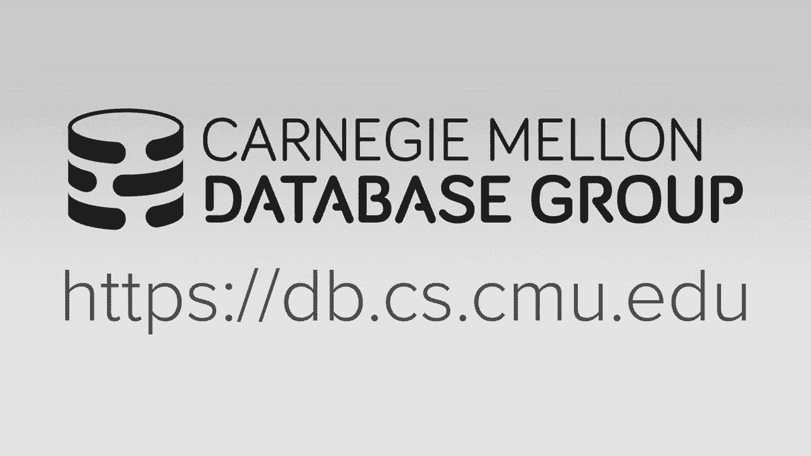
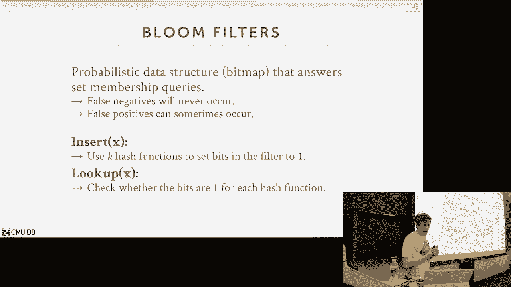

# 【双语字幕+资料下载】CMU 14-455 ｜ 数据库系统导论(2019·完整版) - P11：L11- 连接算法 - ShowMeAI - BV1qf4y1J7mX

去吧。

所有的权利，呃，所以让我们来谈谈今天和加入是一个非常重要的话题，呃，今天的投票率极低，我只能假设，因为这是十月的85度，太疯狂了，我不记得那里，就是这样，这个，你这么性感，我父母也不相信全球变暖。

太疯狂了，他们认为这是因为行星以某种方式排列，因为这都是大骗局，所有的权利，所以我们可以再谈谈联接，连接是超级重要的，可能是，这是我们要花很多钱的地方，我们大部分时间都在分析数据库中处理查询。

所以对我们来说把它做好是非常重要的，所以第一个问题是，我们为什么要加入对吧，所以它是，它是关系数据库系统的副产品，使我们的桌子正常化，因为我们要把他们分开，减少重复或冗余信息的数量。

所以我们想把它们分成不同的桌子，再喜欢一次，外键，或者是做这件事的自然方式，你知道你有安迪的命令，对不起，你有所有订单的表，每个订单可以有多个订单项目，所以订单项目有一个单独的表。

所以现在如果您想运行一个查询并说，把安迪的订单都给我，然后你想把这两张桌子连接在一起，我会把所有相关的资料收集起来，所以我们要做的方法是通过一个联合操作员，联合操作员会允许我们重建原始的元组。

没有任何信息损失，所以我们想尽可能高效地做到这一点，因为对于分析查询，桌子会很大，所以你知道这可能需要，你知道分钟，小时甚至天，取决于我们选择的算法，所以这节课的内容，我们将专注于一次只加入两张桌子。

我们会一直专注于做内部连接，所以两个表可能是两个表连接，可能是当今数据库系统中实现的最常见的连接算法，对呀，这几乎是每一个，每一个主要的开源系统和商业系统都有，因为，这是思考如何分解查询的一种自然方式。

有一些算法可以实现多路乔伊连接或MLA连接，比如拿三张或更多的桌子，同时把它们连接起来，主要存在于理论界，尽管有一些高端系统确实支持这一点，我们可以在高级班讨论，但为了我们今天在这里的目的。

我们只是想了解把两张桌子连接在一起的基本知识，他们也会关注连接，所以Equi连接意味着我们从一个表中提取一个元组，我们想看看是否有平等的匹配，对于另一个表中的另一个元组，对呀，我们不担心小于大于。

喜欢不等于，所以我们今天要讲的算法，可以调整以支持其他类型的连接，这不是一个大的变化，但为了我们的目的，我们将专注于公平加入，只是因为那是最常见的，我们也关注内部连接，因为又是那个，此外。

这是最常见的一个为算法做外部关节支持，我们今天谈论的不是一个不重要的手术，总体上的重大变化，我们今天要讨论的所有算法，我们脑海中的东西，那就是我们应该明白我们将如何组织连接操作。

我们总是想把小一点的桌子，作为左表在联合操作中的右，所以就像查询计划树一样，你知道你有左边和右边，孩子向操作员输入，所以我们会说，左边的孩子是我们想成为较小的那个，当我们谈论嵌套循环连接时。

也将其称为外部表右，所以即使有些算法没有嵌套循环，所以他们没有外桌，我们总是说外桌，意思是左边好吧，所以在我们到现在之前，讨论我们有什么算法，我们必须在数据库系统中做出一些其他的设计决策。

来讨论所有这些连接运算符是如何工作的，所以理解什么是查询计划的方法，想想这个，我们取续集查询的关系代数，我们把它转换成有向图或树结构，所以在叶节点上，我们可以访问，我们正在访问表。

他们把元组作为输入输入到我们的子操作员中，或者对不起父运算符，这就是我在这里说的，所以这将是联合运营商，所以这就是左边，然后这就是右边，所以这将是外面的桌子，这将是内表。

所以我们必须找出的两个设计决策错误，我们的联合运营商的产量是多少，比如我们向父级发送的实际低级比特是什么，然后我们如何决定一个算法，一个联合算法，联合算法实现比另一个更好，对于第一个。

这将取决于我们的数据库系统实际实现了什么，及其环境的其他因素，所以总的来说，我们要做的是对每一个元组，关系大写r中的小写r，以及在另一个表中匹配的任何元组，我们想生产一些输出。

因为你知道它们满足联合谓词，我们把它发送给树中的下一个操作员，所以在高水平上，当我们通过关系代数理解这一点时，当我们第一次谈论连接时，我们只是说这是两张桌子的串联，两个表的元组的。

所以你取r中的所有属性，并将所有属性和S，你把它们捣碎在一起，然后输出就上升了，但在真正的系统中，这可能并不总是你想做的，理论上没问题，但在一个真正的系统中，我们必须担心磁盘，带着忧虑阅读。

担心你知道的，我们使用了多少内存，所以我们可以对我们发送的东西更加小心，所以我们实际上要用什么作为这个运算符的输出，并将其发送到下一个操作员，可以再次依赖于我们对查询处理模型的实现，这将涵盖下周星期一。

但要知道，情况并不总是这样，我一次发送一个元组，我可以一次发送多个元组，也可能取决于我的存储模型，不管我是基于行的系统还是基于列的系统，然后它还取决于查询是什么，取决于我上面的东西，在我的查询计划中。

在我的树中，我可能不想发送两个表的所有属性，我想把他们的一个子集，所以我们可以做的第一个方法实际上是发送正确的数据，所以我们要复制元组的属性值，匹配我们的连接谓词，然后我们将产生一个新的输出元组。

我们挤到下一个人面前，对呀，假设我们的桌子看起来像这个R和S，当我们再次加入他们时，我们只是连接r的属性并附加它们，属性是他们的，这就是这个联合算子的新sp结果，所以在我们的查询计划树中。

这个运算符的输出将是整个，这种方法的好处是在树的上面，我们永远不必回去从我们的基础表中要求更多的数据，因为我们所知道的所有来自R S的东西都是在我们的联合输出中产生的，那真是太棒了。

因为我们不会在事实发生后回去读更多的东西，但很糟糕，因为现在我们基本上是在巨大的元组中实现的，在我的例子中，这里我只有五个属性，所以你知道也许没什么大不了的，但如果我在r中有一千个属性。

和S中的一千个属性，现在我只有这个2000个属性元组，它变得相当宽，现在我复制它，因为我的输出在上面，这可能会很贵，这样做的好处是你再也不用回去获取更多的数据，你可以聪明一点，并认识到在本例中。

对于这个特定的查询，表的情况是，我只需要R ID来完成其余的查询计划，所以也许不是实际上发送r i+加上name字段，也许我只是把我们的身份证发上来，所以我可以在这里做一个投影，开始剥离我不知道的东西。

我知道我不需要上面，同样地，当i作为这个联合算子输出的一部分时，我可以嵌入或内联投影运算符，在我做了S ID上的连接后，很好地认识到这一点，我不需要价值，也不需要S ID，我唯一需要的是创建日期。

c日期字段，所以作为我的输出，我可以做一个投影，把它去掉，所以只有你知道，基本上，我不必做上面的投影投影，因为它已经为我做了，当我产生连接中元组的输出时，对呀，另一种方法是我们之前谈到的。

当我们谈到列存储时，我们现在只传递最起码的信息，我们需要连接键，然后我们还包括记录的想法，我们要去哪里找到表中其余的数据，所以说我们这样做我们的连接，我们只是凭我们的身份证和身份证加入，的输出结果。

连接运算符将只是匹配的rit和s id，然后记录ID或元组ID，也就是，你知道的，页码和偏移量，或者我们可以去哪里找到我们数据库中的其余数据，然后我们把它传到我们的树上，然后在这里，当我们说，哦。

我们还需要这个创作日期，因为我们这里有一个字段，我们知道如何回到S并获得您需要的其余数据，所以再一次，这是专栏商店的理想选择，因为对我来说，把元组缝合在一起是很贵的，从所有不同的列。

把它放回一种行基形式，当我把它推到查询计划中时，所以如果我能尽可能多地推迟实现，将所有元组放回原来的形式，那么我不会在上面传递太多数据，还说我吃饱了，可能是R s的十亿个元组。

但连接后只有一两个元组匹配，然后在上面，当我去拿创世日期的时候，参见日期字段，它是，你知道的，我只是去抓，也许又是两页，这叫做这种技术叫做后期物化，这就是大约十五年前流行的东西。

当第一个列存储数据库系统问世时，像垂直和，这似乎是一个巨大的胜利，Vertica两三年前告诉我，他们实际上摆脱了这种优化，因为事实证明这对你没有帮助，因为我得到这些数据的成本是如此昂贵，在开始的时候。

你不妨从一开始就得到你需要的一切，不用担心以后回去拿，因为这可能会像，你知道你得到的数据可能会在另一台机器上，现在你要通过网络去获取数据，不仅仅像读取本地磁盘一样，所以再一次。

2000年出现的第一个列存储系统，都推广了这种技术，我不知道今天有多少人还在使用它，我知道Vertica没有，这是非常令人惊讶的，当他们告诉我这些的时候，所有的权利，所以再一次，所以这是。

这就是我们要如何决定，我们要把什么塞进操作员树中，这取决于我们的环境是什么样子的，什么取决于查询想要做什么，我们现在要考虑的另一件事，就是我们如何确定一个联合算法是否比另一个更好，所以我们要做的是。

是根据…的成本指标，我们要做多少个iOS来计算连接，所以在这节课剩下的时间里，我们将使用这个术语，所以我们会说我们桌子上的是，它会有M页，总共有一点点，整个表的m元组，表S将有N页，总共有小写字母。

n表示s中的元组，所以我们将使用这些变量来确定IO成本是多少，我们今天要看的各种算法，所以要指出的一件重要的事情是，我们只考虑，成本实际上是计算连接，而不是实际产生最终输出结果的成本。

因为在所有不同的算法中，这将是恒定的，如果我做一个排序合并连接和一个嵌套循环，把R和S桌连接起来，它们总是会产生完全相同的结果，因此，两者的成本是相同的，并进一步，为了我们今天谈论的东西。

我们不知道他们要输出的元组数，因为我们对数据实际上是什么样子一无所知，当我们谈论查询优化时，查询规划，我们必须开始做出这些估计，因为现在我们需要开始考虑在查询计划中将关节移到哪里。

但现在我们只关注一个联合操作员，最好的算法是什么，我们将完全基于这个数字，IOS计算成本，所有的权利，这么快，最后要讨论的是联接与叉积，我们今天关注的是内部连接，因为这是最常见的事情。

我们不会费心讨论交叉积，或交叉连接或笛卡尔积，因为这些几乎是超级罕见的，你从来没有真正，你知道的，需要担心他们对吧，你真的无能为力让这些运行，交叉积跑得更快，因为只有两个循环，只是一个接一个地迭代。

一切都匹配，所以它就像一个嵌套循环连接，没有检查匹配的谓词，另一件事也说得太多了，我们可以将一系列技术应用于我们的联合算法，当我们今天走的时候，可以让事情跑得更快，但总的来说，不会有这个优化。

我们总是可以，这将适用于每一种可能的情况，每一个可能的数据集，每一个可能的查询，所以当然又一次，我要教你们，这些算法的基础，我将查看显示一个优化的哈希，我们可以做，因为我认为这是一个非常有用的。

但为了我们的目的，今天在这里，我们会对数据的样子视而不见，而不是尝试做任何一次性的临时优化，所有的权利，所以总的来说，有三类三类联合算法，有嵌套循环连接，这是最基本的一个，至少。

它们将支持看起来像嵌套循环连接的东西，然后我们将讨论排序合并连接，它将建立在我们上节课讨论的排序的基础上，然后我们将讨论哈希连接，哪个是最重要的算法，因为这是，这几乎总是会，我们要用的最快的一个，好的。

所以让我们开始开始嵌套循环连接，就像它听起来的那样，这是一个，这是一个for循环，在另一个循环中筑巢，对呀，所以您所要做的就是对外部表中的每一个元组都是，您将迭代内部表中的每一个元组。

然后检查where子句中的谓词，续集查询中的join子句，看看它们是否匹配，如果是这样，那么您将其作为输出发出，所有的权利，会是，它将被缓冲为上面下一个元组的输出，所以再一次。

外部与内部的说法就像听起来一样，外部表位于外部for循环上，内部表位于内部for循环上，这会有点混乱，我们告诉哈希连接什么，因为哈希连接没有内斯塔的生命，我们还是这样参考，然后。

就它在实际查询计划中的样子而言，它通常被指定为权利，对不起，进入联接联接查询或联接运算符的左运算符，左边的输入是外表，正确的输入是内部表，所有的权利，所以这是做连接最愚蠢的事情，为什么。

对于r中的每一个元组，你必须加载所有完全正确的，所以他说，每两分，我们得去扫描，每次都把所有的记忆带回来，所以我们不做任何关于局部性的事情，我们对页面或块一无所知，在这一点上，我们只是说每一个元组。

我的外桌，让我去取包含内部表元组的页面，就像是，就像，超级傻超级贵，对呀，所以使用我们之前定义的变量的成本是很大的m，加上小m乘以n，所以大m是外表的页数，所以我们必须把每一页都读对，然后这个里面是。

对于外表中的每一个元组，我们得把里面桌子上的每一页都拿出来，这个小m乘以大n，所以这对你们来说有点抽象，因为这只是一堆变量，但让我们把一些数字放进去，看看有多弱智，这没关系。

假设我们的表r有m页为m一千页，总共有十万个元组，表S有五百页，总共有四万个元组，所以我们只是插上插头，突突地喝这些，这些变量的值，我们看到对于大m加上小m乘以大n，我们做5000万iOS。

所以说我们有一个快速的SSD，可以在十分之一毫秒内完成IO，所以每个IO大约有10万到20万纳秒，这是关于标准SSD能做什么，你可以多付一点钱，跑得更快，但总的来说，这是消费级的现在可以做到的。

如果你把这个零点，一毫秒乘以这个，是一分，三个小时做那件事，加入对所以好吧，什么是一个优化，我们可以做，试着加快这件事的速度，我之前说过，一开始，较小的较小的桌子应该在，作为外面的桌子。

所以如果我们这样做，重新运行，重新运行公式，现在，我们在做一个点，一个小时不多，你知道也好不到哪里去，但你知道它稍微快一点，所以这就像这就像超级愚蠢，这是最糟糕的情况，因为假设我们。

我们正在做四千字节的页面，那么如果你只是做数学，这两张桌子的大小是6兆字节，可以坐在L三个缓存中，所以对于可以放在我的CPU缓存中的东西，如果我必须去拿磁盘，去拿，我在做一个，要花一个小时。

就像你可以在记忆中这样做一样，您可以将此连接作为两个嵌套的循环执行，就像微秒或纳秒乘微秒对吧，它应该是超级快的，但如果我们必须去磁盘，我们不知道如何磁盘，那我们就要付一大笔罚金。

所以改进嵌套循环的一种方法，加入愚蠢的一个是要注意我们有障碍，我们有页面，我们可以在页面中打包多个元组，所以现在如果我们说我们将有一个块用于输入，对不起，外桌一块，一个块用于内表。

那么对于我们在外部表中获取的每一个块，将获取，将扫描所有元组，中的每个块，对于每个元组，我们去拿，外面桌子上的每一块都是正确的，我们一次取一块来装内桌，我们对内部的每一个元组进行连接。

内表块中所有元组的外表块，我们不去内桌的下一个方块，直到我们完成对外部块中所有元组的评估，所以现在这个稍微好一点，所以假设你又知道了，我们外面有一个方块，里面一块。

现在我们的成本是大m加上大m乘n在这是小m之前，因为我们在外桌中的每一个元组，我们在里面的桌子上取每一页，但现在对于外表中的每一页，我们正在取出内表的每一页，所以这更好一点，再一次。

外面的桌子应该是什么，小一点的那个，但就页面而言，而不是元组，对呀，可能是我们有一个元组更少或页面更多，然后是另一个我们仍然想建立在它的基础上，哪一个的页数最少，回到我们的例子，我们又在一开始展示了。

插头和突突，这些数字，现在我们可以在50秒内加入，还是不好，不要得到不，别误会，这还是很可怕，加入六兆字节不应该花五十秒，但你知道我们不是一个小时，我们以前，所以再一次，只是在这方面很聪明，我们不是。

我们正在进行顺序访问，我们正在阅读，你知道一个IO，我们得到多个元组，只需对嵌套循环算法进行简单的更改，我们可以把它砍到一秒钟以内，如果我们能把这个权利推广开来呢，而不是有一个报酬，或者你所知道的。

一个块用于相册块和内部，如果我们有多个块，所以这是为了外部关系，我们要在内存中尽可能多地缓冲，b减去两个街区，然后我们会保留一个方块，用于相互关系，一个块用于输出结果，我们可以做得更好一点，好吧。

再来一次，对于b减去两个块，基本算法是这样的，那我去拿一个方块，对于b减去外部关系中的两个块，我去找一个街区，对他们进行扫描，然后当我做完内块的时候，回去拿下一个，然后当我完成，我桌子的所有内块。

去外面的桌子上拿下一个B减去两个街区，所以现在又塞住了，咕噜咕噜地算数学，而不是在，呃在外面的桌子上，它的m除以b-2，你拿着天花板，因为它告诉我有多少块a b减去2块，我可以，我可以把外面的桌子分成。

你拿着天花板，因为最后一个，你知道的，b减去两个块的最后一段可能不完全是b减去2，所以你总是围捕，所有的权利，所以现在发生了什么，虽然，如果外部关系完全适合主存。

这意味着我们允许拥有的缓冲区数量的大小大于，m再加2，加二为内回车键的1，在内部表上输入关系，一个用于输出结果，所以如果我们能把b减去2，你知道的，B减去2，所以正好是相互关系的大小，对不起，外部关系。

那我们就是黄金，因为我们现在只需要去找一次外部关系，把它铭记在心，然后只扫描一次相互关系，那就是m加n，所以现在我在，我在1500 iOS，现在我在150毫秒，这开始变得更加现实，好吧，又来了。

这就像是最好的情况，好吧，如果你能适应，如果你有足够的记忆来适应记忆的相关关系，你知道for循环的巢穴，嵌套环接头可能会很好，对你来说没问题，但是当然现在如果你的数据库是太字节或拍字节，你不能那样做。

所以总的来说，为什么这很糟糕，为什么下一个循环连接很糟糕，因为Word基本上是一种蛮力搜索，我们所做的只是顺序扫描，关于外部关系和相互关系，我们对这个地方一无所知。数据。

我们对我们正在查看的数据一无所知，我们假设它只是，我们不在乎，我们只是在找火柴，就像我们之前说的，顺序扫描总是后备选项，当我们没有索引时，我们做不到，不能做任何聪明的事，但如果我们能更聪明。

比如如果我们知道我们有一个索引，或者像我们在一秒钟中看到的那样，排序合并连接，如果我们知道事情是排序的，那么我们可以让这些顺序扫描更聪明一点，那么大卫系统能做的一件事，它可以识别出。

如果您有一个基于要加入的键的索引，那么至少对于内表，然后您可以将其作为内循环的一部分，而不是每次都要做顺序扫描，所以有两种方法可以做到这一点，一个是如果您已经有一个可用的索引。

因为您知道应用程序为您创建了它，那么你是金色的，因为你只是再次使用它，这将是非常常见的在旧的工作量，因为，就像我们说的，如果你有外键，的，你必须有一个，您知道一个索引来强制外键约束。

所以你会用它来找到你要找的东西，有些系统可以动态地建立索引，它本质上是哈希接头的样子，我们稍后会看到，但在其他系统中，如续集服务器，他们实际上可以在飞行中建造一棵B树，他们称之为假脱机索引，在查询期间。

然后他们就跑了，你知道吗，运行查询，使用索引进行联接，然后当查询完成时，他们又把它扔掉了，这里的想法是做顺序扫描的成本是如此昂贵，最好建立一个索引，你知道现在有一个短暂的索引来做我的查询。

然后我就把它扔掉，让我们看看如何在X嵌套循环中做到这一点，再次加入，我们所做的就是，我们还是要在外部关系上再做一次顺序扫描，我们可以使用额外的缓冲区块来不必去获取，你知道我有，o对于每一个元组。

但在内部，内部的for循环，我们现在要对索引进行探测，然后如果我们找到匹配的，然后我们会去看看我们是否有，你知道作为输出生产的，现在索引不需要完全是我们连接键是什么，所以我们想说我们加入了A栏和B栏。

如果我们有一个索引，我们仍然可以做索引探测来限制，现在，只需要在该属性上求值的元组数a，但是现在一旦我们得到输出，我们做了额外的匹配，看看我们是否也有B匹配，所以索引不需要完全匹配。

那么现在做好这件事的代价是什么，看情况吧，这取决于索引是什么样子的，所以我们将用一些常数来表示探测索引的成本，C因为又一次，如果是哈希表，那就是，你知道的，最佳方案一，如果是B树，那就是log n对了。

但我们取代了必须访问相互关系中的每一页，这个常数的大写n，这是一般的，那就好多了，快得多，所以这就是你真正需要知道的，单桅纵帆船连接，就像我说的，这是蛮力的方法，这是最简单的事情，如果有数据库系统说。

他们这么做的可能性更大，因为这又是，这是最容易实现的，所以我们需要注意的主要事情是，总是选择较小的桌子，作为外部关系，我们会试着把尽可能多的记忆放在外面的桌子上，以减少我们正在做的冗余IO的数量。

然后如果可能的话，如果我们在内部表上有一个索引，然后我们想用那个，否则我们就只能做一个缩放扫描，所有的权利，所以再一次，这就像愚蠢的事情，我们对数据一无所知，我们不知道价值是什么样子的。

我们只是有一个索引，我们总是用蛮力搜索，所以让我们试着聪明一点，这就是排序合并连接试图做到的，正如我所说，最后一堂课，这太令人困惑了，因为我要教你们排序合并联合算法，但是在排序合并连接算法的排序阶段。

他们可以使用我们上次谈到的外部合并排序，但是在外部合并排序中，它有自己的合并阶段，这与这个合并阶段不同，所以这很混乱，但唯一要注意的是排序阶段，我们只需使用外部合并排序，我们做了最后一节课或快速排序。

如果它适合记忆，然后合并过程将与他们以前所做的不同，所以有两个阶段对它进行排序，首先溢出到内存中，必要时溢出磁盘，然后在合并阶段，我们将看到一个例子，我们要一张一张地走过这两张桌子，并对它们进行比较。

如果我们能看到我们有匹配的，在某些情况下，我们可能永远不会，我们只需要在相互关系中查看每个元组一次，我们只是在外部关系中，我们总是把一个人对每个元组看一次，但在相互关系中，我们也可能永远不必回到正轨。

多次查看同一个元组，但我们不必每次都在一开始就跳，在顺序扫描中必须做的方式，这就是提前排序的好处，所以这是算法的近似值，它的基本工作方式是在排序后，我们会有两个光标，一个在里面的桌子上。

一个在外面的桌子上，他们会一步一步地走下去，看元组，所以在每次迭代中，如果外部关系，光标指向元组，它的价值大于内在的价值，然后我们将增加内部光标，如果外面的小于里面的，然后我们实现外部的增量。

如果我们有匹配的，我们把它作为输出来生产，然后我们把里面的，所以像这样阅读代码很难，所以让我们做一个可视化的例子，所以我们又有两张桌子，我们要加入我们的NS，在这两个表的id列上，所以在第一步。

我们要做排序，一次又一次，这只是快速排序的外部排序，取决于它是否是记忆，所以现在我们的结果被排序了，我们现在要做的是，让光标穿过这两张桌子，所以我们要从头开始，对呀，光标为s上的r光标。

所以当他们开始的时候，他们要做的第一件事，他们要去看看，在ID字段上联接的属性的值，在本例中，外部关系光标指向的元组，价值是一百，对于相互关系光标，该值为100，所以那是匹配的。

所以我们将生成组合元组作为我们的连接输出，然后在这一点上，我们增加相互关系光标，向下移动一个，所以现在我们一次又一次地看100个匹配的，我们这里指的是什么，所以我们产生另一个输出，然后我们再递增一次。

现在是两百，所以现在点200大于100，所以我们增加外部关系光标，所以现在所以在这个例子中我们知道当我们想做这个评估时，两百等于两百吗，它做到了，我们生产我们的输出，我们不需要回去看其他的东西。

因为我们知道此时光标在看200，这是我第一次看到亨特的价值，桌子这边的这个，所以我知道我不需要看上面的任何东西，在表中，所以如果你只是在做一个嵌套循环，加入你们，我不知道你得做扫描，从一开始就一直。

但是因为我们把所有的东西都预先分类了，我们可以说好，二百米以上的东西都不需要，做这个连接不需要检查，所以这就是我们在这里做的优势，这就是我们得到的好处，在嵌套循环联接上合并。

所以让我们来看看一个我们必须回溯的案例，所以外面的关系是两百，相互关系是两百，我们已经找到了匹配的，现在我们增加相互关系，现在是四百，所以现在四百大于二百，所以我们把这一边，但现在我们有两百个。

如果我们一直往下走，一个接一个地往下走，我们就会错过另外两百人之间的比赛，我们在上面，所以我们必须在这边维护一些元数据，哦，我最后一个值，我刚刚看了一下，看了两百，就好像我增加了这个东西。

它和我刚才看到的最后一个相匹配，然后我知道我需要回到最开始，当我第一次看到相互关系上的价值时，然后我可以做我的比赛，做我的关节，得到比赛，但其他一切都像以前一样进行，现在增加到400。

然后400又大于200，所以我们增加这个家伙，所以再一次，主，我在这里强调的主要事情是，我们可能不得不在相互关系上倒退，但我们从不在外部关系上倒退，我们只检查我们的关系一次，所以三百比四百少。

他们不平等，所以我们增加外部关系，现在四百等于四百，那是吻合的，500的相互关系大于400，那不匹配，这是因为它大于这个增量，现在我们有5对500，所以现在我们增加这个，现在我们到达了终点。

所以我们不能停在这里，因为再一次，我们不知道下面是什么，关于外部关系，我们可能需要回溯，因为下一个元组实际上可能是500，我们必须回去，回去，你知道在起点500是对的，但是在这个例子中，在这个例子中。

没有匹配的，所以我们一直走，直到最后两个弯管都走到尽头，然后连接就完成了，是的嗯这样如何，你到底怎么追踪很多，就像你跟踪，就像上一次的第一次发生一样，就像如果你有一个更多的。

他的问题是回到这里的回溯部分，我怎么跟踪，我以前看到两百，现在看到四百，然后当这家伙看到两百，我知道我需要回溯，你就说这里是这里是，对于最后一个值，这与当前值不同，我指的是，这是起始位置。

所以如果你这里有200个，你知道你必须在一开始就跳，是呀，如果我有，在我的元数据中存储最后一个值，对呀，是呀，前一个值，你和说我已经到了呃的尽头，第二张桌子，是呀，在我的第一个表中。

我得到了一个大于上一个值存储的值，然后我可以终止权利，那我就不需要走到最后，是啊，是啊，所以他的观点是正确的，如果我在这里，我完成了我的最后一个，现在我走了，说好，我最后看到的是五百所以在这里。

如果我到六百，我知道六百比五百大，永远不能有任何东西在我下面，这将与这个匹配，所以我可以在这里结束，是呀，你可以这么做，那么做好这件事的代价是什么呢，内部和外部表的排序成本只是。

我们之前谈到的外部合并排序成本对吧，假设我们必须泄露一个dis，所以现在，但现在合并成本大致是m加n，在最好的情况下，我要把外桌的每一页都读一遍，内桌上的每一页，在它们现在被分类之后。

我刚刚在回溯案例中显示，那不完全是真的，因为如果我回到这里，如果说四千五百页，但后来我回到了两百，这在上一页，我得再去拿一次，但同样，我们无法计算我们的，你知道在这个例子中。

因为我们不知道数据的布局是什么，所以我们只是要简化它，只是说它是它是它是m加n，因此，总排序的成本就是排序阶段的成本，您要使用的排序算法，以及此合并阶段的成本，我们近似为m加n。

所以现在如果我们说我们有一百个缓冲页，对于我们的简单示例，然后我们再把r和s分两次排序，这只是使用了上一堂课的公式，因此，合并成本只是读取每个，从内心的千页，对不起，一千页的外部，内页的五百页。

也就是一千五百，所以你承担了整理我们三千英镑的费用，排序为十三五十，然后合并通过1500，你得到了5850 iOS，大致是零点，五九秒，五百九十毫秒，同样，基于循环连接的块，我们可以把它缩短到50秒。

现在在这种情况下，我们现在不到一秒钟，这开始看起来合理了，对呀，因此，cert合并的最坏情况是，这是罕见的，但它可能发生的情况是，你在外表上有每一个值，与区间中的每个值完全相同，就像元组中的每个值一样。

在元组中只对了一个，所以分类只是浪费时间，因为你没有分类，你知道你不会从中得到任何好处，因为一切都会一样，你知道的，一列又一列，然后现在你只是在支付走过，你知道的，恢复到嵌套循环连接右。

但这是罕见的对吧，这不像人，人们做蠢事和数据库，但这个很蠢，对，数据库系统可以识别，哦，我对这一列只有一个值，别费心做排序合并，只是，你知道它本质上是呼叫，回到笛卡尔积，它只是两个嵌套的循环。

所以在这种情况下，排序合并连接什么时候真正有用，嗯，这两个表已经在连接键上排序了，那我们就是黄金，因为现在我们甚至没有排序成本好吧，这就是我之前说过的聚集索引的东西，如果我有，如果我在属性上做联接。

id属性，然后我的桌子上有一个聚集的索引，在id属性上排序，那我就没有排序阶段了，我就在你知道的地方，数据是，我想去的地方，现在我只有光标，只要通过，步调一致，也超级有帮助，就是当。

如果查询包含按子句排序，而按子句排序相同，你知道桌子是什么种类的吗，或者在要进行联接的相同键上对结果进行排序，那我就买一送一，因为现在我做我的排序排序合并连接，然后输出以相同的方式排序。

按子句排序希望它被排序，所以我甚至不必逐条订货，因此，数据库系统再次可以识别，哦我，我的查询如下所示，因为它又是陈述性的，你告诉它你想怎么排序，我可以看着它说，哦好吧，您想在此密钥上进行排序。

你也想用这个键加入它，所以让我做排序合并连接，而不是做单桅帆船连接或哈希连接，然后是一个命令，因为我刚刚完全切断了额外的操作员，这会跑得更快，这和我们上节课讲的一样，如果我们有一个已经排序的索引。

我们想要的方式，它聚集在一起，我们可以用这个，否则，我们将返回到外部合并排序，是呀，所以当你做一个类似，这是排序结果，你在做现金还是风暴，所以他的问题是，我们将在下周一讨论这个问题，问题是。

的输出在哪里，排序的，对呀，缓存得好吗，所以这是查询的中间结果，比如，所以说，那么它是由缓冲池支持的，因此，如果缓冲池必须溢出到大约一个磁盘，因为我们的数据集太大了，我们已经可以处理了。

但这就是为什么我们选择了特定的沉浸，或者是因为它试图最大化顺序的数量，我不知道我们这么做是因为，我们要拼一个磁盘，是啊，是啊，所以它被缓存了，它特定于运行它的一个查询，然后我们可以做。

我想我们谈到了扫描共享，但就像如果，我们认识到两个查询希望在完全相同的时间对相同的数据进行排序，就像我们可以背在背上只做一次一样，并在他们两个之间分享，对呀，高端系统可以做到这一点。

我的续集Postgres不能，这么短的合并超级超级有用，这是一个Postgres支持这一点，所有主要的商业数据库系统都支持这一点，较小、较新的嵌入式数据系统通常不支持这一点，它们通常支持嵌套循环连接。

如果他们在一起，它们可以支持哈希连接，但不是每个人都能做到，让我们再次进行哈希连接，这将是我们用来做连接的最重要的算法，因为一般来说，对于大型数据集，这将获得最好的性能，这几乎总是你想做的，所以说。

关于哈希连接如何工作的基本见解，类似于我们在上一堂课结束时做的基于哈希的聚合，我们的哈希函数是确定性的，相同输入的含义，哈希值总是产生相同的东西，所以这意味着。

如果我们在外部表中有哈希到某个东西或某个值的值，然后在内部表中散列到相同内容的值，因为他们是平等的，然后我们可以用它来分类，把东西分开，这样我们只需要再次检查同一个哈希桶中的内容。

这就像是一种分而治之的方法，对呀，这就是我们要做的基本想法，我们要把外部关系分成几个分区，基于哈希键，对于这一个，我们将得到一秒钟，但这个如果在，如果它，如果它适合，一切都在记忆中。

我们可以用线性哈希表，线性探测哈希表，就像一个静态哈希表，如果我们要溢出一个磁盘，然后我们可以在桶链哈希表上进行递归分区，我们之前也谈到过，所以再一次，这个想法是，如果我们在同一个分区中有元组。

因为它们散列到相同的位置，我们只需要担心，在我同一个分区的人，我不想再隔着桌子看了，这个想法是我们支付前期费用来分割数据，使搜索或探测过程运行得更快，所以一个基本的哈希联合专辑有两个阶段，在第一阶段。

构建阶段，你把外部关系，你对它做一个顺序扫描，然后填充哈希表，然后在第二阶段，探针阶段，你对相互关系做一个顺序扫描，使用相同的哈希函数，然后探测哈希表，你在第一阶段建造的，看看你是否有匹配的。

如果你这样做了，你就生产，将其作为输出，所以在高水平上，看起来是这样的对吧，所以再一次，这个，我在说什么，所以大约四首关于你的诗句，外桌，所以在这个中，我们没有真正的a for循环。

我们有一个for循环，在for循环上构建哈希表，去做探针，但我们还是第一次提到，我们要建立哈希表的关系，一个作为，你知道吗，只是为了让一切保持一致，所以在第一步，第一阶段，我们将填充这个哈希表。

我们正在对这家伙进行序列扫描，并插入我们要放入哈希表中的键，然后在第二阶段，我们只要对里面的相互关系探针做一个顺序扫描，这不是，你知道我们用什么哈希表实现并不重要，但我们知道如何找到完全匹配的。

如果我们找到一个，然后我们把它作为输出，对呀，相当直截了当，所以关键还是你在做什么，值的联接取决于您实际希望如何实现您的，系统中的哈希表，就像我们之前说的，它可以取决于输出是什么，或者输出是什么。

上面需要什么信息，在查询计划中，它将确定您实际要存储的内容，所以这是存储和计算之间的经典权衡，在计算机科学中，我们可以存储完整的元组，因为这就是我们生产所需的一切，上面的输出。

加上我们在哈希表中加入所需的一切，但当然，现在这使得我们的哈希表变大了，这意味着我们可能会溢出更多的磁盘，嗯，但至少是计算，更快地找到我们想要的东西，因为我们跳进杂凑表，我们需要的一切都在那里。

另一种方法是做一些类似于后期物化的方法，其中我们只存储元组标识符，当我们哈希到到哈希表时，我们扫描直到找到，我们想要的钥匙，但是我们会看到我们有这个元组标识符，我们必须去寻找更多我们需要的信息。

又是这样，用于柱存储，这种方法通常更好，因为哈希表较小，这个更适合行商店，因为它是，你储存的是你，存储所需的所有数据，你必须回去拿整页，所有的元组都从头再来，我们可以做的一个简单的优化。

这是唯一一种除了溢出到磁盘之外的，这是我们将讨论的连接的唯一优化，今天是为了探针侧，所以在构建阶段，当我们构建哈希表时，我们还可以构建一个辅助数据结构或过滤器，可以确定，帮助我们确定我们要查找的元组。

甚至会在哈希表中，而不必去看它的内部，所以要做到这一点，我们要，我们可以建立一个布卢姆过滤器，大家知道什么是Bloom过滤器吗，谁，谁不知道什么是蓝色过滤器，好的，正是因为这个原因，我有备份幻灯片。

我不能，我不知道人们的背景是什么，算法中的这类东西，所以让我很快地教你，气球页脚是一种超级有用的数据结构，你一生中会遇到的，哇太棒了，所以它是在二十世纪七十年代建造的，发明的人叫布鲁姆。

这就是为什么它被称为权利，所以它是一个概率数据结构，那是一个可以检查的位图，可以回答设置成员资格查询或设置成员资格问题，所以设置会员问题就像，我的收音机里有这把钥匙吗？我会回来说是或不是。

它不能告诉你去哪里找它，这不是索引，这是一个过滤器，这告诉你是还是不是，但有趣的是，它是一个概率数据结构，或近似数据结构，所以可能会给你假阳性，所以它永远不会给你任何假阴性，所以如果你问它。

这把钥匙存在吗？它说不，那你就知道那是真的，但如果你问钥匙是否存在，它可能会出来说是，那把钥匙确实存在，但实际上可能在骗你，然后你得走了，实际上检查其他东西，看看这是对还是不对，所以它只有两个操作。

基本的跛行过滤器只能做两件事，您可以插入一个键，你不抬头看钥匙，你不能删除密钥，它是这样工作的，所以它只是一个位图，对呀，所以说这是一个非常简单的八位Bloom过滤器，所以当我们想插入一个键。

就像武当派的节奏，我们要把它捣碎多次，然后我们得到的哈希值在哪里，我们要修改我们有的位数，这将在位图中给我们一个位置，所以在这种情况下，第一个哈希mod 8变成6，去那个位置。

这个mod mod a对这个家伙来说是4，那个位置很晚了，然后我们所做的就是把它翻转到一个，如果是零，我们把它设置为1，现在我们说我们插入吉萨，同样的事情他搞砸了，第一个哈希函数得到三个。

我们得到了一个为第二个，同样的事情，我们跳入哈希表，我们把它翻过来，这个超快的，我们可以极快地做到这一点，因为这些都挂在CPU缓存中，现在我们来找找厨师雷恩，对呀，如果我们把这个搞砸了。

我们得到五个和三个，就在这个五分的地方，是零，但它又指向了这个，这是一个，所以在这种情况下，因为所有的钥匙，各种各样的，位图中的位置不是一个，我们知道这是不可能存在的，所以我们会得到假的，这是正确的。

这就是为什么你永远不会得到假阴性，但我们可能会注意ODB，我们散列到三和六，但现在这个散列到我们以前居住的这两个位置，拉里萨和杰扎，但我们从来没有真正插入ODB，所以我们得到了，我们得到一个假阳性。

对呀，所以这是页脚回来告诉我们这把钥匙存在，当它实际上没有，蓝色，那些又很棒了，它们对很多事情都超级有用，然后他们超级，就像，你可以把十亿个关键数据集归结为，你知道的，几个千字节的蓝色过滤器，是呀。

他说，你能删除一个密钥吗，否，因为会发生什么，就像说，回去对不起，就在这里，右RZA去了六和四，所以我们把这些部分翻转，然后杰扎去了三和一，这是个坏例子，但我们可以有另一把钥匙让我分解成1和2。

现在我们想删除它，我们不知道那个是不是我们的，你知道我们在哪里，不管我们是唯一，你可以把这个而不是它变成位图，它变成计数器，那你就可以这么做了，但现在它变大了，我们想吃点东西给我们吃一些非常快的东西。

这就是蓝色滤镜，是呀，所以他的问题是你初始化蓝色过滤器有多大，取决于数据集的大小，嗯，好像它们不需要很大，还有这个，然后你实际上也可以改变你使用的哈希函数的数量，这将决定你的假阳性率。

气球浮到的地方越大，使用的哈希函数越多，的，假阳性率越好，你可以把它归结为，你知道，我觉得像10或类似的东西，就像超级小，这些将用于，你知道，数据系统的所有其他部分都会出现，我们可以以后再讨论。

但就像为了我们的目的，这里我们再次使用它们进行连接，这和索引的区别在于，这只是告诉你什么，如果有什么东西存在，它不会告诉你它存在于哪里，索引会告诉您它存在的地方，在这里，在这里可以找到它。

我很高兴我把这些幻灯片包括在内，因为我不确定谁以前见过蓝色滤镜，所以我们要对气球过滤器做的优化是，当我们构建哈希表时，这将是一个很大的，可能会溢出一个磁盘，我们还将为我们所有的钥匙建立一个布卢姆过滤器。

可以超级小，它可以容纳记忆，当我们填充哈希表时，我们建立布卢姆过滤器，然后现在当我们做探测的时候，我们把布隆过滤器交给了这个家伙，在我们探测哈希表之前，我们去探测记忆中的布卢姆过滤器，那是超快的。

如果我们的密钥与哈希表中的任何东西都不匹配，那么蓝羽毛会说你没有火柴，我们就停在那里，我们避免了哈希表查找，可以是磁盘，我去跳去找我们想要的东西，否则，如果我们回来说真的，然后我们得去看看哈希表。

因为这可能会产生，可能告诉了我们一些不正确的事情，对年龄较大的人来说，你总是需要有一个假阳性，所以说，所以她的问题是关于绽放过滤器，使用多少哈希函数取决于如何配置它。

我的例子你展示了另外两个你可以有更多，也取决于你做得有多大，但总的来说，我实际上，我不知道，是啊，是啊，有升降机的开源软件包，我不知道默认是什么，可能有四个，是啊，是啊，的，问题是过滤器他的问题是。

会不会是吊杆过滤器的每一位都设置好了，因此一切都为真，是呀，这就是你得到的大小，你知道我们做了一定数量的，所以又喜欢了，我们将在两周后讨论查询计划，但是就像优化器可以做的事情之一是尝试很好地估计。

这是分布，这家伙身上的价值观，对，你需要知道如何，如何调整哈希表的大小，你会说好吧，嗯，我想我的机器钥匙是这样的，因此，这样大小的布卢姆过滤器将是我想要的，你知道怎么给它尺寸，避免那个问题。

一切准备就绪，但即使有几千字节，它是，它是，它仍然会产生相当好的结果，所有的权利，所以这有时被称为侧向侧向信息传递，高端系统可以做这种事情，实际上我们将在本学期晚些时候讨论分布式数据库。

但就像你现在可以想象的那样，也许A和B在不同的完全不同的机器上或不同的数据中心上，这样我就不必把消息发送到网络上，在哈希连接中执行探测，如果我能送过去，你知道几千字节的Bloom过滤器到另一台机器。

然后我可以在这边做更多的过滤，在我开始浏览网络之前，这是一个巨大的胜利，但这是这所以这是，为什么它被称为侧向侧向信息传递，因为这有点打破了我们的模式，查询运算符的查询是如何执行的，你知道这些。

这些离散的通道只是将数据从子通道向上发送到父通道，而不是兄弟姐妹之间，这违反了，但这是一个巨大的胜利，所以这是个好主意，好的，所以让我们结束对，当我们有不适合内存的哈希图时，所以如果一切都符合记忆。

那么我们可能想用，其实，我们有，我们只是想用一根线性探测哈希电缆，对呀，我们可以近似哈希表的大小，我们需要根据输入数据的样子，然后这符合记忆，这将是非常快，问题，虽然现在是如果你必须开始溢出到磁盘。

现在杂凑表对我们来说会很糟糕，因为现在它将是随机的，因为我们会拿走每一把钥匙，我们要把它哈希到哈希表中的某个位置，每一把钥匙都可能是另一把，你知道的，缓存错过另一个，我们得再做一次页面查找。

所以我们要做的是，我们想转换哈希表中的随机访问模式，这是我们数据库系统中最糟糕的事情，变成更有顺序的东西，我们申请这个的想法是一样的，外部合并排序，同样的想法，当我们溢出一个磁盘时。

我们为基于哈希的聚合所做的，所以我们将要使用的技术叫做Grace哈希连接，有时它被称为分区哈希连接，我想教科书上把它称为格蕾丝哈希连接，但这是一种用于哈希连接的技术，当事情不适合记忆时。

所以恩典这个词来自，这个项目是东京大学的学术项目，在二十世纪八十年代，他们建立了一个叫做数据库的东西，项目的Grace数据库机器显然已经不存在了，嗯，但他们有一个文件出来的时候，作为这个项目的一部分。

讨论了如何进行哈希显示，当事情不适合记忆时，然后不管出于什么原因，那个术语卡住了，我是说每个人都指什么，我要把这里描述为格蕾丝哈希接头，这里有谁听说过数据库机器这个术语，数据库设备完美，好的。

所以机器或数据就像你为数据库系统购买的专用硬件，所以好好想想，你知道的，现在当你当你想运行Postgres，你是做什么的，你在e上旋转一个实例，c二，你去下载Postgres。

然后根据实例大小设置和配置它，是呀，你可以得到，你知道吗，已经预先配置的RDS，但总的来说，大多数人都在跑步，你知道的，在自己的硬件上部署这些数据库本身，所以说，数据库设备的想法是。

您可以从供应商那里购买硬件，已经为数据库系统设置和调优的，所以你不必担心如何自己设置任何东西，所以所有的高端公司都会把你卖得很贵，非常非常好的企业服务器，专门为特定的数据库系统进行了调优。

所以IBM有一个叫做挑逗器的东西，他们把它杀了，但他们可以卖给你，一台有T的机架已经为你们设置好了集群，是一家初创公司，从美国在线出来的，然后他们去年被普拉科纳收购了。

今年他们曾经出售我的续集的一个版本，它将运行在我们的专用硬件上，最著名也可能是最昂贵的是甲骨文的退出数据，到处都是这个，这就像你买了这些巨大的机架机器，上面有甲骨文数据仓库，在里面为你运行，就像。

喜欢喜欢，我们说的是数百万美元，有些地方每年在运行出口数据上花费1亿美元，它很贵，所以数据库机器就像设备一样，你知道，这是专门为数据库系统调优的，但后来他们增加了特殊的硬件。

比如只用于运行数据库系统的自定义ASIC，所以他们在20世纪80年代建造的Grace数据库机器，它有特殊的硬件来非常有效地进行哈希连接，这就是20世纪80年代人们建立数据库的方式，然后这一切都过时了。

现在每个人都想在商品港跑步，因为当你想出定制硬件的时候，用于您的数据库系统，然后实际上你知道制造它，实际上生产它，制造它，英特尔或任何推出新芯片的人，你也知道他们已经比你开始的时候跑得更快了。

你失去了所有的福利，因此，大多数数据库系统运行在自定义硬件上，除了甲骨文的这个超高端的东西，在过去的一年里，有一些较新的初创公司出现了，这是一张黄砖的幻灯片，这是一个较新的数据库设备供应商。

销售专门的闪存控制器，你知道运行他们特定的数据库系统，但大多数人不经营这种东西，除非你有很多钱，好的，所以哈希，大哈希连接在构建阶段有两个部分，我们现在要把两张桌子分开，基于哈希键并将它们写入分区。

所以常规哈希连接，我们只对一边进行了哈希，并为此建立了一个哈希表，然后我们在另一边探测，现在，我们要做的是分成两个，两边分开的哈希表，然后做一个嵌套循环，连接匹配的分区。

我将在下一张幻灯片中展示它是什么样子的，再在外面的桌子上，我们会有一个哈希表，我们要把我们所有的价值观都打乱，填充这个家伙，所以这不会是一个线性探针哈希表，这将是一个桶链哈希表，因为我们可以。

我们希望有散列到相同位置的东西，都映射到同一个分区，同一组页面，我们不想要这里散列的东西，在这里降落，同样的事情，现在在另一边，对呀，哈希所有值生成哈希表，现在我们要给这些编号，这些级别作为我们的分区。

所以现在在探测阶段，当我们在得到哈希表后进行连接时，我们只是要把所有的桶放在一个分区里，现在再做一个嵌套的for循环，这里的想法是，因为我们已经用哈希函数对它们进行了分区，在最开始的时候。

我们知道所有的数据，我们可能需要检查一个存在的元组，和连接处的这一边，这个桶只能存在这边，它不可能存在于这里的任何地方，所以我们不需要它，当我们，当我们，当我们扫描这里的一切，我们不需要看其他任何东西。

对呀，这和我们的想法差不多，和排序合并联接，因为我们会提前考虑事情，我们知道界限是什么，在可能的地方，你知道，元组和外表上的匹配，所以如果一切都符合记忆，那这太棒了，是的，因为我在一开始就展示了。

当我们谈论跳跃连接时，如果一切都符合记忆，那么这是最快的方法，对呀，没有魔法建筑，哈希函数，是浪费指令，你所做的一切，你知道的，单指令，或者做比较的小说明，这个快进，在这些东西中循环。

这意味着编译器也可以开始展开这个循环，是呀，那是可能发生的，正如你所说，它应该指向一个特定的，呃，是啊，是啊，是啊，是啊，所以他说，碰撞可以，碰撞可能会发生，因为两个不同的值可以哈希为相同的东西，嗯。

如果我用蛮力搜索，为了记忆中的桶里的桶，那谁在乎呢，如果现在有碰撞，如果一切都与同一件事碰撞，然后这开始溢出一个磁盘，那我们就有问题了，对，我们可以通过所谓的递归分区来处理这个问题，这与技术有关。

我上次说的是哈希聚合，但我们没有详细说明，但我们基本上可以认识到，如果我们开始在给定的分区中溢出桶，我们开始添加越来越多的桶，链条越来越长，因为我们有碰撞，然后我们可以再进行一轮分区然后分成更多的桶。

执行更多的子分区，这样，当我们这样做的时候，那个嵌套循环连接，一切都在记忆中，但一对一的映射仍然会发生，问题是一对一的映射还会发生吗，是呀，下一张幻灯片，好的，所以让我们看看我们怎么做，所以再一次。

这个这个在外面的桌子上，运行哈希函数，我们在每个分区中创建一堆桶，所以说这个链条变长了，我们不断地溢出到新的越来越多的桶里，所以如果我们认识到说好是有门槛的，我们已经过了一些水位线。

说我们溢出了太多的页面，水桶太多了，然后我们可以在这个人身上运行另一个哈希函数，然后拆分更多的子页面，所有的权利，子桶，所以对于第一个哈希函数，我们有一群人被映射到第一分区，然后溢出来了。

那么对于分区一，我们又运行了另一个哈希函数，它是相同的哈希函数，只是不同的种子值，然后我们分成越来越多的桶，那么现在在呃，当我们在相互关系上做探索时，如果我们拼凑到任何以前没有分裂过的东西。

所以我们有一些元数据可以说，如果你是，如果你要哈希，您将对零进行分区或对n进行分区，第一个哈希函数很好对吧，所以现在我可以在这里的这些页面上找到我要找的东西，如果如果我哈希分区一个，然后我就会认出，哦。

为什么我必须在构建方面分开，以建立外部关系，让我继续运行第二个哈希函数，然后我会找到我真正需要去的地方，你能一遍又一遍地这样做吗，直到你把东西放进记忆中，因为最坏的情况，你知道你加入的专栏。

您加入的实际属性只有一个值，它总是会散列成同一件事，因此，递归分区只是浪费时间，在那种情况下，您只需返回到嵌套循环连接，因为没有联合算法可以让它运行得更快，简单再简单，因此。

我们将相同的技术应用于基于哈希的聚合，我们上次讲到，如果我们的水桶太满，然后我们再做一轮分区，那么这样做的代价是什么，n井上的这个分区散列，假设我们有，我们有足够的缓冲区来容纳内存中的所有内容。

跨分区执行连接部分，它将是n加n的三倍，所以这三个来自，在第一阶段，我们进行分区，一次通过m和n，在相关的页面中的页面，一张通行证阅读，然后又一轮写对了，因为我们只是为了我们读到的关于相互关系的每一页。

我们在外部关系中运行另一页，然后第二步现在是做连接部分，我们只是在做一个嵌套的for循环，在同一分区内的桶上联接NEA循环联接，这也只是所有页面的一次浏览，所以再一次，分割相位是m加n的两倍。

前阶段是n加n，然后如果我们现在把数字放在这里，我们可以在零点四五秒内加入，所以排序合并合并最好的情况是零点五九，五百九十毫秒，现在我们只剩下450毫秒了，这是相当不错的权利。

这就是为什么哈希连接总是更好，所以快吃完吧，正如我今天多次说过的那样，如果我们，如果数据集知道一些关于，什么，表哈希表是什么样子的，或者我正在读到的桌子会是什么样子，然后它可以尝试调整。

哈希表或相应的缓冲区，所以一切都适合记忆，一个线性Pro哈希表是我们想要使用的，如果我们必须建立一个磁盘，然后我们使用分区方法和桶哈希表，如果你不知道尺寸，然后我们可以后退，使用动态哈希表。

就像线性可扩展的，或，但是这些方法比简单的方法要重量级得多，就像桶哈希表，线性职业表，所以在这种情况下，因为我们，我们要做很多探测，在我们的哈希表中插入了很多，你知道的，简单的通常对我们更好。

然后总结一下我们今天讨论的事情的不同成本，对呀，愚蠢的单桅帆船连接可能需要1点3个小时，如果我们有一切，我们用一个块这个循环连接需要50秒，索引1取决于我们使用的索引数据结构。

所以我们实际上不能给出确切的成本，但是排序合并连接是零点五九秒，然后哈希连接是零点四五，是呀，哦，什么情况？你不知道的大小，所以问题是在什么情况下我会不知道外面桌子的大小，在这个例子中。

我今天展示的所有内容都是一个连接两个表的查询，我们说我们在做双向连接操作员，所以接线员拿了两张桌子，产生正确的输出来连接它们并产生输出，什么，如果我有三张桌子要加入，所以再一次。

如果我在做双向连接运算符，我加入，我有表A、B和C，我想加入他们，我加入A和B，然后A和B的输出现在与C连接，所以除非我能对输出有非常精确的估计，你知道，对于A和B的关节。

我可能不知道如何判断上面的事情，现在对我们来说，这取决于您如何执行查询，查询处理，我们星期一再谈，但我可以做管道方法，其中每一个元组，运算符的输出，然后我立刻给下一个接线员做任何事情，我想在那里面做。

现在这就是流媒体案例，有点像你，我在逐步建立我的哈希表，你知道的，在我想做的第二个关节，或者我可以说把我连接的所有输出，放入一堆缓冲区，现在我知道确切的尺寸了，然后我可以给所有东西尺寸。

所以在某些情况下你会，在某些情况下你没有，此外，进一步，你的关节就越多，你的估计越糟糕，因为成本模型在查询优化器中总是很糟糕，在连接的索引上，这应该是一个轨迹，在问题中在是的，这个应该是小写的。

I’是的，我会解决的，谢谢。所以你们进入现实世界的主要收获，哈希连接总是比其他任何东西都好，除非我们，如果我们希望事情提前按输出排序，或者事情已经为我们整理好了，在这种情况下，排序合并连接将是更好的。

但十有八九，如果你拿Postgres或任何商业数据库系统，据我所见，他们总是选择哈希连接，这就是高端的区别，昂贵或编写良好的开放源码数据库系统，你知道非品牌的东西，因为他们可以同时做这两件事。

并在系统中推理，有什么权利，我想用什么合适的相册，一次又一次，这就是关系模型和续集的美妙之处，然后，相同的续集查询可以选择这些其他查询中的任何一个，我们今天讨论的这些算法中的任何一个。

我也不必回去修改我申请中的任何内容，让它发挥作用，数据系统可以为我做到这一点，是的，其他类型的情况也是如此，这个问题是肯定的，问题是我在这里说的这些都是真的吗，那是真的吗？像这样的与外部连接的关系。

实际上是外连接，实际上是出于，我想你可以为，不平等，连接或范围连接，您必须使用排序合并，因为哈希表中的值没有位置，对呀，我想找到所有比这把钥匙少的钥匙，我得用B树，我必须使用排序合并，某物不等于某物。

哈希连接通常更好，其实，几乎总是更好，实际上你问题的另一个延伸是，在单节点数据库或分布式数据库上仍然如此吗，是呀，嗯，我们将在学期结束时讨论这个问题，但总的来说，是呀，因为再一次，而不是从磁盘读取。

我从网上读到的，那就更糟了，所以这些，你知道更换磁盘，iOS与iOS，还是一样，排序对什么更好，不在数据上，对呀，如果它没有歪斜，它实际上应该是统一的数据，如果均匀分布，排序很好，如果它严重倾斜。

那么排序是不好的，但你仍然有这样一个问题，即所有的东西都散列在同一件事上，好的，所以现在星期一，下周下周，我们现在将讨论如何组合所有这些不同的运算符，我们已经讨论过并实际运行它们，你知道。

从端到端实际上是执行查询，所以我多次提到将数据推送到，从一部歌剧到下一部歌剧，现在我们可以看到这实际上是如何实现的，然后我们还将讨论如何构建系统，并行运行查询，对呀，我有多个核心，我有多个线程。

我将如何设计一个同时运行多个查询的系统，也接受相同的查询并将其拆分，并同时在多个线程上运行，好吧，那就会进入，或者这会导致学期结束时的讨论，当我们谈论分布式数据库时，因为这也是你想做的。

您将接受一个查询，并将其分解到多台机器上，并行运行，所有的权利。

我们今天结束了，享受外面88度的天气，或者我不知道那是摄氏度。

哦，我们真的和米歇尔在一起了，我也是，谢谢你在我身上的案子，说不是在破碎的螺栓和压碎的混合中，可以让健身房里的牛，或者他在我的系统里有胜算，破坏另一个，我很幸运，我们去拿下一个，然后越过物体。

是这么说在沙发上玩更好，但现在我们不要太紧张，永远不可能是太阳，瑞奇，说果冻为了一艘船去了熟食店，一个天生受祝福的人，是呀，我的说唱就像激光束，灌木丛中的球，他们不在食堂，裂纹，一瓶同样的。

你不知道喝酒不仅仅是为了喝醉，你不能丢下人，仍然活着的人，不知道你为一种痛苦。