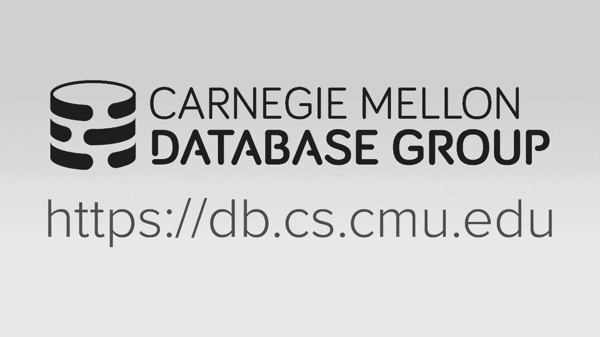
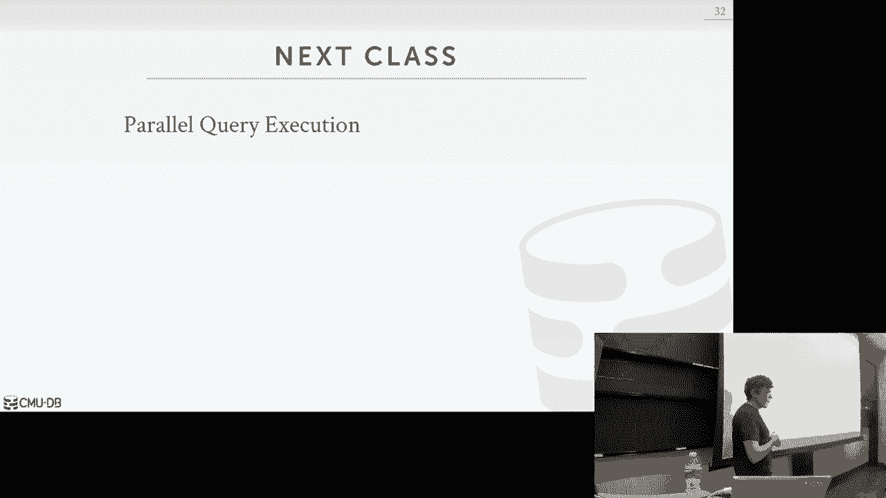

# 【双语字幕+资料下载】CMU 14-455 ｜ 数据库系统导论(2019·完整版) - P12：L12- 查询执行 1 - ShowMeAI - BV1qf4y1J7mX

okay let's get started，[Music]，again give it up for DJ drop tables，thank you，today's be awesome。

you know why we're tell my databases oh，okay，all right so quickly before we get。

started on today's material again just a，reminder for what's due or upcoming for。

you guys in the course homework three is，due two days from now on Wednesday at。

midnight we'll have the final exam or，sorry midterm exam in class next week on。

the 16th and that'll just begin during a，regular time and then I'll do a quick。

midterm review on the end of next，lecture on Wednesday and then we'll post。

like a study guide on the website with，all information need to know about。

preparing for the midterm later in the，week and then project two it will be due。

after the midterm on Sunday October 20th，and then immediately after project three。

will go out but any questions about any，student，yes his question is will we provide a。

previous exam yes we will provide a with，solutions as well yes when probably by。

this weekend yes so I'll cover this one，thing yeah you'll have one handwritten。

sheet of notes no copies of the slides，no you know shrunk down version of the。

textbook every pass be handwritten okay，again so we'll cover this more detail。

it'll be up and tuned up and including，Wednesday's class so everything on from。

this class and Wednesday's class will be，covered in the midterm next week it's。

not next Monday yes okay so we've been，talking about query execution all right。

but we've been mostly focusing on so far，how do we actually implement the。

operators in our query plan how do we do，sorting how to do hash joins。

so forth so now today we're gonna start，putting this all together and how do we。

execute an end-to-end query and produce，a final result to to to the application。

so again these are all the operators in，our query plan and we know how for join。

for sort merge hash join nested loop，join it we can do a sorting we know the。

different ways to do sorts and，aggregations so now we're trying to put。

this all together and say all right how，do we given a query plan how do we。

actually go ahead and execute it so，there's three things we've discussed。

today so the first is that we're gonna，talk about how do we actually process。

the query plan right and how do we，organize the execution flow and the flow。

of data between these operators in such，a way that it could produce produced a。

quick result and we'll just see how to，do it in different ways or different。

environments or different storage models，for the things below us then we'll talk。

about the access methods and we've，already covered this in bits and pieces。

throughout the entire semester how to do，it index scan how to do a schedule scan。

so now we're trying to understand this，in a bit more detail and then we'll。

finish off talking about how to do how，to evaluate the predicate and。

expressions in our query plan if we have，a where clause how do we how do we apply。

that where clause to a tuple whether，we're doing a spectral scan or an index。

scan and again you see the high-level，idea what we've done so far is that we。

have a bunch of bits and pieces now of，how to do sorting how to do joins how to。

do index probes and now we're starting，to put it all together to actually be。

able to execute a query okay all right，so the first thing we gotta discuss is。

the processing model so a database，systems processing model specifies how。

it's going to execute a query plan right，so in essence it's specifying whether。

you're going from top to the bottom，bottom at the top and then between each。

operator what are you actually passing，from from one to the next and so there。

will be three different main up three，main approaches we can do and they're。

all gonna have different trade-offs and，have different performance implications。

for different workloads and different，operating environments so we'll go。

through each of these one by one and，show examples so the most common one is。

going to be the iterator model this is，pretty much every single database system。

you know about this is this is for the，mother [ __ ] this is how they execute。

queries materialization model is a，specialized version of this that is。

primarily only used for in memory，systems and then the vectorize model is。

and is it's it's based on the iterator，model but you're sending batches of。

things or vector vectors or things and，this will be more useful in analytical。

workloads okay all right so as I already，said the iterator model is the most。

common one I think the textbook refers，to this as the iterator model does。

sometimes I've seen this referred to as，the volcano model or the pipeline model。

so the volcano the reason why is call，the volcano model is because there was。

an influential system in the late 1980s，early 1990s in in academia called。

volcano that described it at a high，level exactly this this approach people。

were doing this before but this guy sort，of laid out the you know the exact way。

to do this and in parallel which is what，we'll talk about on Wednesday and the。

volcano system was invented by the same，guy Gertz graphy who wrote that be。

flushed rebook that we talked about，before it's also the same guy they。

implement the volcano query optimization，model which we'll talk about next week。

so this that dude is pretty prolific so，the way this basically works is that for。

every single operator we have in our in，our database system so if you want to。

support joins we have a joint operation，you know for a sorting we have a sorting。

operator so for all of these they're，they're going to implement a next。

function and what happens is that the，apparent node will call next on our。

child node and that child node will then，produce as a return result for that next。

function the next tuple of debt that，parent needs to process so you start to。

see how this is going to cascade down so，I'll call next on the route it calls an。

excellent child and it calls its next，miss child it'll keep going down until。

we hit the leaf nodes in our query plan，and then we start emitting tuples up the。

query plan and start processing them one，by one so the reason why they're going。

to call it the pipe also this is called，the pipeline model is that this is going。

to allow us to for a single tuple to try，to ride it up as far as possible up in。

the query plan and keep processing it in，one Operator after the other before we。

go back and get the next one，and this is important in a disk based。

system because if it's every single you，can only have one page in memory for。

example then every single pay or every，single to but we go fetch that page we。

want to do as much work as we can with，that tuple while it's in memory before。

we go back and get the next to work at，the next page and so that that series of。

work or tasks you do in the query plan，for a given one given tuple is gonna be。

called a pipeline so let's look an，overview of how this works so against it。

is that same join we were looking at，before on our NS or an r ID equals s ib。

and then we have a simple predicate，where s value is greater than 100 so。

normally I don't like to show code in in，lectures sequel doesn't count because。

it's beautiful but like but for this we，have no choice right so this is some。

pseudocode to showing you the different，next functions for these operators right。

and essentially they're just for loops，that are iterating over the output of。

their child operator right so if you，start at the very beginning say say we。

start at the very root we call next on，the root node right this is this is the。

this is just a projection and so it has，a for loop what's gonna say for every。

single tuple in my child that I get back，from next do the projection so at the。

very beginning when we call next we，enter this for loop and think of it like。

it's like a iterator where I can keep，calling next and if I go down and。

Traverse and produce an output if I'm，called next again in my operator I know。

how to pick up where I left off before，so at the very beginning we call next in。

the root it has no tuples so the very，first thing it has to do is now call。

next on it's its child which is the join，operator and the join operator is。

composed of two parts or two phases as，we talked about before it's to say we're。

doing a hash join we have the build，phase we're going to build the hash。

table in the B of the probe phase we're，gonna probe the hash table so again the。

very beginning I'm calling next in my my，hash joint operator I'm calling next on。

the Left child because that's when I，want to populate the the the hash table。

so then this now invokes the function，next on this child operator so now you。

get into leaf nodes now this is again，this is our active methods this is how。

we're accessing retrieving tuples from，either the index or the table so this。

just has its own little for loop that's，going to iterate over the relation R and。

then it's gonna admit a tuple up so for，every omit function we're passing up a。

single tuple as the return result for，the invocation of next and so we'll keep。

doing this the the the the parent，operator the join operator would keep。

calling next on his child but over and，over again this thing keeps emitting。

tuples up inside the for loop we're，building our hash table and at some。

point we reach the end we process all，the tuples and then we just pass up a。

null pointer and then now the parent，knows that I've gotten everything I'm，gonna get out of my child。

I never need to go back to it again nice，again it's called the iterator model。

because these are just iterators right，our cursor is looping through and。

getting all the tuples one by one so，after we finish on the left side now we。

fall down to the operator on the right，side same thing we call next one it's。

child it goes down here and then we just，omit tuples up one by one and then now。

we do the probe and then for any tuple，that matches in our in our hash table。

when we're doing the join we omit that，up to the parent so this clear so the。

reason why again why it's called a，pipeline model sometimes is that say on。

the right side of the tree we're back，here we call next on this guy he calls，next on this guy。

now we're gonna be a tuple up to here so，we want to have we brought this tuple in。

memory we want to do as much work as we，can to process the query wall that。

tuples in memory so rather than calling，next and getting the the next one we。

then pass it up here and let us do do，the join after we do the filter and then。

if it matches we can then pass it up，even farther up the pipeline and send it。

up to our parent with t-a-n-k man produce，it as an output to pool and then only。

and then we call next all the way back，down and we just do this all the way。

over again so this sort of series of，operators we can operate in process for。

and it's just like we talked about，before with when doing joins when we。

bring something in memory what we want，to do as much work as a possible wallet。

in memory before we go off to the next，thing because the disk i/os are so。

expensive for us so again the iterator，model is the most common one it's used。

in pretty much every single database，system you can think of they're using。

the iterator model and the reason why，you do this is because it's sort of a。

from a human standpoint it's it's it's，easy to reason about the the program。

flow it's easy to reason about what's，gonna be a memory versus not a memory。

alright so again this is what pretty，much everyone everyone implements so now。

some to some operators cannot are not，gonna be able to allow us to do。

pipelining all the way up so these would，be called pipeline breakers so these are。

the operators that requires to get more，data from our children before we can go。

on to do the next thing，so my joint example here was a perfect。

choice right so if I'm on the phone on，the left side right I go get a tuple。

from this guy I have to build the hash，table I can't process it up further in。

the tree because I don't know whether，it's gonna match with anything on the。

left side so this this would be called a，pipeline breaker within this pipeline。

here so I do the the the scan I build my，hash table and now I got to go back and。

get the next thing because I can't，continue up the tree with it so you see。

the same thing for order bytes or sub，queries anything requires you to have。

more more tuples before moving up is a，pipeline breaker and they're unavoidable。

you can't not there's no way to get，around that you know the other nice。

thing about the iterator model is that，output control like limit clauses are。

super easy to do because now you can，then say in the parent well I only want，10 to 'pls。

so if I call it next ten times that I，get back to n tuples I'm done right I。

don't need to go keep calling it again，so alpha control is it works it works，great with this as well。

parallel parallel queries also works，really well and we'll cover that next。

class of how to run you know these，operators on different threads at the。

same time or different machines at the，same time okay the next approach is a，materialization。

the idea here is that instead of having，a next function that spits out a single。

tuple each operator dumps out all the，tuples anytime soon vote like all the。

tuples that's ever going to actually，took to emit it comes out all at once。

right you don't keep going back and，calling next xmx right so of course now。

the issues gonna be that if we only，maybe want ten two pools up in route。

because they have a limit Clause unless，we propagate down into the query plan。

information about the number of tuples，or X you can need at the top will end up。

passing along way more data than and we，actually needed right so there's some。

extra stuff you have to do that you，don't have to do in the iterator model。

to make sure you don't pass along more，data than you need and then the output。

could be either a materialized row or a，single column typically in the iterator。

model it's usually the entire tuple like，an entire record but in the。

materialization model some systems can，actually pass along a single column but。

it's all the tuples so all the values，for that for that single column for all。

tuples right all right so go back to our，example here right now we no longer have。

an X function right now we have instead，a we have this，the return value is an output buffer。

which is like just like a list of all，the tuples so we started beginning very。

beginning we call child output and in，our route then this invokes the operator。

below us same thing as before we go down，and get all the tuples on the left side。

to build our hash table and the result，is again all of the tuples we take。

bandit and our further process，everything got our hash table then go。

down the right side and percolate，forward the data that we need going up。

writing it and it's all the tuples yes，what's that，what is child I so like like it's a tree。

right this is the parent this is this，child if you have one the left side or。

the right side or just one and then what，one sorry the middle one what oh yes yes。

to join right it's a tree so in this min，in this example right this is the。

projection operator it has one child，it's the joint operator but again。

because everybody's implementing the，standard a same API there's nothing in。

this code that knows I'm dealing with，the join operator everyone always am you。

know gives you back all the tuples you，need right it's a one tuple or all the。

tuples are vector in the vector eyes，model so like I the main takeaways I I。

if I implement this standard API where，they either have an output function or。

next function I can compose these，operators in any different way that I。

want and it's not like a major rewrite，every single time so I can now I could。

say well I first put up my system I，don't have a joint operator if I had。

this standard API some later point I，could add a joint operator and it can。

just fit in and work with all the other，tuples I'm sorry I'll do all the other。

operators it's just a standardized API，it allows me to compose query plans by。

plopping in operators based on what the，court who actually wants to do okay so。

again the main difference tween the，iterator model and the materialization。

model it's it's it's neither one or，tuple，materialisation model is everything。

right so once I call output and get back，on for this operator and it spits back。

its buffer of all the tuples I'd never，everything I need，yes well these questions is it one。

atomized tuple or one block or two both，and in the iterator model sorry so he。

says wouldn't it be more efficient to，implement it where you pay you pass up a。

block of tuples instead of one tuple yes，that's a vectorized model that's the，next one yes okay。

so the materials agent model is，fantastic for ot workloads because in ot。

workloads what are you doing your scones，getting one record at a time or one。

small number of records at a time so the，overhead of calling next exit accent。

percolating that down right those，function calls actually start to matter。

if everything's in memory right because，that's a that's a branch on the CPU and。

those are expensive but that's a jump，and you know in the ingest base so with。

the materialization model if we're only，shoving up one tuple at a time who cares。

that's awesome that's super fast so this，is actually how we implement in both DB。

both DB is based on a system I helped，build in grad school called a store a。

store uses the material to，materialization model and both TB as far。

as I know still uses the same thing，because it's an in-memory database。

designed for really fast transactions it，doesn't do analytics well right so this。

is this is a fantastic for this Monay DB，is a in-memory columnstore system out of。

out of the netherlands it is a awesome，system - it's not for Ana sorry's not。

for transaction it's for analytics I，don't know why they did this approach。

but they do and I had a bunch of other，problems that we don't wanna get into。

but I think this is a bad idea for this，I think this is the right choice for a。

volte beam alright because again if I'm，scanning a billion tuples and unless my。

filter is super selective I could be，shoving up a billion to +1 opera to the。

next only define up above in my query，plan that I didn't need a billion to。

pose I don't need like you know maybe，10% of that so you end up moving a lot。

more data than you actually need with，this with this approach all right so now。

the his suggestion which is what we're，talking out here is that instead of。

having for every single next invocation，I pass along a batch of tuples our。

vector tuples instead of a single tuple，wouldn't that be more efficient yes so。

this is what the vectorization model，does so again for every invocation of。

next we get back a batch of tuples，instead of a single tuple and then now。

we're gonna design our system such that，the inner loops those sort of kernels of。

these operator implementations they are，going to be rewritten or designed to。

operate on a vector of tuples rather，than a rather than a single tuple and so。

the size of the batch that you're going，to spit out for every single vocation of。

next can depend on what the hard what it，looks like so that can be based also on。

what the with the the actual storage，devices are how fast they are versus。

when chaleurs is i/o but also can vary，on what your CPUs look like so we're not。

going to get into this here because we，didn't we said in this class we weren't。

going to worry about CPU registers and，cache lines but if everything fits in。

memory on modern CPUs there's，instructions that allow you to do，vectorize execution reflectorized。

operators on a chunk of data at a time，like this is called sim d if you're。

taking 418 or with what are the parallel，class six eighteen fourteen so if you。

now have a batch of data that can now，fit you know and a ycp register with。

this single instruction you could apply，a predicate or evaluate you know some。

operator on that on that data very very，efficiently so this is why this。

vectorize approach actually is there's a，good idea so again it this now looks。

basically like the iterator model but，nouns in the side of are inside of our。

kernel functions for operators we have，this output buffer and then we just。

check to see whether the output buffer，as we go down is larger than the size we。

would emit and if so then we shove back，a tuple batch but it's still the same。

sort of model or just you know each，implication and next goes down to our。

child a child does some kind of，processing maybe go to a child to get。

some data and once we have everything we，need in our batch then we shove it up。

okay so the the vectorization model is，ideal for analytical queries because。

what are they doing analytical queries，are doing long scans over large portions。

of the tables and therefore rather than，for every single vacation our necks。

getting too close to ball now I'm，getting a batch of doubles and the size。

of the batch can vary depending on where，the data is coming from and how you're。

going to process it right this is the，simply stuff that I talked about before。

so every major data warehouse built in，the last I mean the last ten years or so。

is using the vector vectorize model，right because the performance impact is。

quite significant and this is actually，what we use in our system that we're。

building here so this is clip so in，general we're going to focus on the。

iterator model but there's other ways to，do this that the vectors I vectorize。

model is sort of easy to see how you can，extend the iterator model。

materialisation model really only comes，up in specialized systems yes yes you。

quit your statement is with the，materialization model you're saying that。

the yes yes yes yes right so statement，is if everything's in memory then in。

materialization model even for OLAP，wouldn't it still be a benefit of not。

having to call an x-axis necks over and，over again if you just get back。

everything yes but if you're reading，large amounts of data and you're not。

able to push down the the predicates if，your predicates aren't selective enough。

meaning the the amount of data you're，outputting this is large like my table。

is like a hundred gigabytes and I'm now，I'm shoving up you know 90 gigabytes of。

data you be smart about if you're doing，the late materialization stop talking。

like if you're copying a lot of data，then it sucks mixing terms alrightso or。

make mixing environments I'm saying that，this works for in memory systems I think。

this is not good for disk based systems，right and I don't I don't know of any。

disk based system actually does this for，in memory so so for disk based systems。

the vectorized model would be better，still because you know the amount of。

memory not a memory I have to keep，intermediate results is smaller I can't。

I don't want to have to spilt a disk as，I'm going up my pipeline。

so the vectorized model is preferable，for OLAP systems your shaking head as if。

you are confused okay all right good，wanna talk about，and I just we're not gonna focus too。

much on this I just want to be aware of，it is that in all the processing model。

examples that I showed iterator I've，been chelation and vectorize I showed a。

top-down approach meaning we start with，the route we call next or output on that。

and it percolates that calls down into，the tree and we start pulling data up to。

the root that's the most common way，people implement query execution。

recordings query processing models but，you can go in the other direction you。

can start at the bottom and actually，push data up this is a bit rare we did。

this again in volte B we're doing this，in our new system today a hyper out of。

Germany does this as well and the reason，why you want to do this is that now we。

can be more crappy and more careful，about as we move data up to make sure。

that the the to board it's information，that we're processing can sit around in。

our CPU caches and registers so if，you're very careful about your memory。

placement and your memory allocation，this way is is preferable but this。

assumes that everything fits in memory，for so for this reason for the disk。

based systems this approach is，this is also a bit harder to reason。

about as humans because we have the，right programs in a way that may not be。

natural for us as we normally think，about how we write write code right。

we're this one again from a human，standpoint this is easy understand I。

call next on my child it gives me some，data this one is actually like carefully。

crafting the program in such a way that，is better for the CPU but is more。

difficult for humans to reason about，again I don't want to go too much。

details in this this is something if you，take the advanced class in the spring。

we'll cover this the main takeaway for，you guys is everyone implements the top。

one for the most part ok all right so，now let's talk about what's going on in。

this leaf nodes or in our query plan so，again these are the access methods these。

are how we're actually actually，retrieving data from the databases from。

our tables and then be able to pass them，along to our next operators so we've。

covered basically these already I just，spend little more time and just go over。

them again and then we'll talk about how，to do this in with multiple indexes so。

in general there's two approaches you're，either reading the data from the index。

or eating reading from a table with the，sequential scan and the index not always。

but could be preferable based on what，query you're doing and then the fallback。

solution is always the sequential scan，if I don't have an index s can do what I。

want to do or it has like the right，attributes for my query I just fall back。

to a special scan all right and the，multi index is just an extension of this。

it allows it you know set it accessing，one index we can access multiple indexes。

and combine their the results together，okay so the sweater scan again we've。

covered this many many times it really，is just a bunch of four loops inside of。

our operators so the scan operator will，ten iterate over a single page in our。

table and then for every single page we，iterate the to business of those pages。

and then we can do whatever work we want，to do on them and then we can omit them。

up to the the next operator as needed，so again the way this is implemented is。

like a cursor if you're familiar with，Python they have a yield function for。

iterator it's basically I call this my，for loop and I called next on my。

iterator and then when I get the next，page I can iterate every single tuple，or pass。

this control back to another piece of，the part of the system and then if。

someone comes back and says I'll give me，the next tuple I know how to pick up，where I left off。

so operators have to maintain the state，of where the iterator left off every。

single time it goes off and returns a，tuple so that when we come back we can。

pick up where we left off right and the，typical way this is this is referred to。

often in systems as cursors so there's a，bunch of optimizations we can do to make。

our scruncho scans go faster and we've，covered a couple of these already right。

squatchers can again it's it's it's the，fallback option if we don't have an。

index so we'd have a better way to，process the query but it's slow。

especially in a dish based system where，every single page could be out on disk。

so with there's a bunch of these we've，covered already right we talked about。

prefetching this is the double buffer，optimization for doing joins we talked。

about do a full bypass where instead of，polluting our buffer pool cache we have。

a little side buffer just for our thread，or a query we'll talk about how to run。

sequential scans in parallel next class，so I want to focus on these three down。

here again some of these we've already，covered but again these are just ways。

and makes when Cho scans go faster and，the idea that again there's nothing we。

can do to magically make ask when choice，can go faster like the we're limited by。

the speed of reading data from disk and，bring it to memory but if there's ways。

for us to figure out how to do less work，and that goal that's what we want to do。

and so that's what these optimizations，are trying to allow us to do so zone。

maps are actually what he brought up a，few lectures before about pre computing。

some information about pages to allow us，to figure out whether we actually need。

to access them or not and so the the，basic idea of a zone map is that for。

every single page in our database and in，our table we'll have some additional。

metadata we've computed or derived from，that page that gives us information on。

what's what what what what are the，values inside of the page for the given。

attribute so let's say that we have a，really simple table that has one column。

right and then within a single page we，only have five tuples，so zoom map for this could have the。

pre-computer aggregate information about，the values within this page for this，column。

so the min/max average some account so，now if i query comes along it looks。

something like this so let's start from，table where value is greater than 600 so。

without the zone map what do I have to，do it it's a sequential scan I go grab。

this page and now I start iterate，through every single tuple and I。

evaluate my predicate to see whether I，find a match but instead if I have a。

zone map I can like to say well I know I，think I need to access this page let me。

go look at the zone map I'm looking for，values greater than 600 while I go check。

and say well the max value for this for，this column and this page is 400 so I。

know there's not to be any value or any，tuple with a value greater than 400 so。

therefore nothing in my page will ever，match my predicate so I just skip。

right so now you say alright where's the，zoom map actually stored well some。

systems could pack it inside the page，itself so you should have to bring the。

page in but at least now you're not，iterating over every single tuple other。

systems could actually store these zone，maps as separate pages so I'll have like。

a zone map block or zoom at page that，has a bunch of zone maps for different。

pages so maybe that sticks around a，memory more like more often and then。

that I just jump to that page check the，zone map and then decide whether I want。

to go to the next page or go actually，access the underlying page so I use the。

term zone maps because that's what，that's the common term I forget whether。

it was 'not ISA or Oracle that invented，this term but Oracle if you go google。

Oracle's own maps be a bunch of，documentation for this I don't know。

whether that's a trademark term because，other systems don't use that term but。

it's found again pretty much every，single major data warehouse today。

because the performance benefit is quite，significant because disk is so so slow。

so you can imagine a bunch of different，types of queries you could do just based。

on these kind of these kind of，statistics，what's one issue we have is them that's。

though maintain that exactly right so，anytime I update something in here then。

I got to make sure that this is actually，in sync because I don't want to have a。

false false negative I don't want to，look look my zoom out and say I don't，have a match when I。

she I do so these are typically all，these systems I'm showing up here。

these are running for the for the，analytical stuff but you would not want。

to use as OMAP 400 TP because again you，have to maintain them all the time。

that's gonna be super expensive but for，analytics where it's usually like right。

once read a lot then so maps are a big，win and this is why all the major。

systems actually support those alright，so the next optimization is something we。

talked about before I'll make sure，everyone understands it and for the。

detail and this was late materialization，so for a columnstore system we actually。

can delay or not or avoid having to，propagate data from one offered the next。

and the Stampede is passed along all，sets or column IDs to allow us to go get。

the actual data we need later on right，in a row store system typically the。

operator the output will be the actual，entire tuple because I've already went。

to the paper to disk to get the page it，has that tuple I might just pass along。

that entire tuple up the query plan tree，and not have to go ever go back and get。

get more data but in a column store to，go get all the data for a single tuple。

that's a bunch of different reads，because the data is broken up across。

different columns and therefore I want，to avoid that as I want to delay that。

for a long as possible so let's say we，doing a join of two tables foo and bar。

and say the food table has three columns，a B and C so my query plan in my。

pipeline over here as I'm processing on，the left side of my join well the first。

thing I need for this first the filter，operator I only need a column so I'll。

just pass along this iterator here we'll，just pass along blocks or pages from。

from the a column then I do my，processing but then I know that in my。

query plan I don't need a comm ever，again because I'm doing the join of B。

I'm doing my aggregation on C so I don't，need to pass along a so instead I'll。

just pass along off sets of the the，tuples that passed or passed the。

predicate so now inside of the join，operator I can go get the B column to，complete the join。

then the same thing I don't know I know，I don't need be up above so I just pass。

along the offsets a damnit now when I，compute the average then I go off to。

disk and get C and then now I pass along，the final result，right the idea here is that we can be。

smart about identifying what data we，need at different parts of the query。

plan and only pass long offsets allow us，to go back and get the rest of the data。

we need at a later point all right the，last thing to talk about is heat。

clustering or clustered indexes again，we've already talked about this before。

this is just allowing us to scan along，the leaf nodes of an index and go fetch。

the data in just scratch will order，because we know the two poles are gonna。

be order in our pages in the same way，that the ordered in our in our index。

right so there's not much else to say，about this with this one we've covered。

already so let's talk right now how，we're gonna do index scan so the for the。

basic idea of an index scan is that we，want to be able to identify what index。

we have on our table that is going to，allow us to quickly find the data that。

we need and and limit the amount of，useless work we have to do or wasted。

work we have to do so again it's all，about reducing the selectivity of the。

data that were processing so that we，passing along less data from one。

operator to the next so how to pick one，index is super hard because it depends。

on a bunch of different things it，depends on what attributes we have in。

our index what asterisks are referencing，in our query depends on what the values。

of those at first actually look like，whether they're super selective for our。

query I'm not selective depends on what，our predicates look like are they less。

than greater than equals to not equals，to that determines what whether we use。

index and then of course then depends，whether it's a unique index or non。

unique index so I'm gonna go through a，really high-level example of how we pick。

an index but we'll go in this way more，detail next week because this is what。

the query optimizer does for us right I，have a select statement I don't specify。

what index I want to use i want the，optimizer inside the database system to。

say oh these are my choices for my，indexes here's the best one based on。

what your queries trying to do so again，we'll cover this in more detail。

and next week but let's just look，through a really simple example so say。

we have this simple query like this，where we want to get the all the。

students from from the students table，that are under the age of 30 that are in。

the C's department and from come from，the US and say for this peculiar。

database we only have two indexes we，have index on age we have index on on。

Department so for this particular query，what index we want to use yeah。

depends on what the values of the data，actually looks like in our table so in。

the first case say that we have we have，a hundred tuples and 99 other students。

are under the age of 30 which is，probably true for this university but。

then there's only two people in the CS，department just not true for us but。

assume that's the case so what's the，best that's index to use for this a is。

your index or sorry age or Department，Department right because I'm only gonna。

get two tuples to match for us if I go，with this if I go for the the the age。

one then my index skin is essentially，useless because I'm just gonna find all。

the the records I would have found，anyway through a central scan and now I。

paid the penny up traversing the index，when I didn't need to again if we just。

reverse this and say well there's 99，people in CS department and only two。

people on an age of 30 okay now the the，the age index is better for us because。

that's more selective so at a high level，this is what we're trying to do in our。

index scan we're trying to avoid having，to go read data we don't we don't。

necessarily need and that includes also，you know the cost of going actually。

probing the index so if the data system，can recognize that well I'm not going to。

be very selective for this index and I'm，gonna pay the penalty of traversing that。

index or doing a lookup in the hash，table for that index then it's just。

better to do a special scan again well，reason about how to actually make this。

decision more next week but what I do，want to focus on though is what happens。

if both indexes are a good idea right we，could be stupid as flip a coin and say。

alright I'll just roll the dice and see，that you know I'll pick the aged one。

that's that'll be good enough but the，database system can recognize that both，of them are actually。

helped me a lot and be very selective，then I'd want to do probes on both of。

them get back their results and then，combine them away in a certain way based。

on what the query is actually trying to，do and then use that combined result。

then figure out what data actually，looking for，yes it's good questions wha find both。

the values what do you mean how we，decide what in this example both。

previous one yes her hats so freestlye，scenarios which one have you excited。

pick convert 30 into how yeah like yeah，we will cover this next week we have。

these yeah like what we have an，approximation of this it's not always。

accurate matically two problems but，let's assume we have we know something。

this is like in this extreme example，it's super audience we would know that。

like there's two people in the State，Department we would know that this is。

like this is an outlier and that this is，it's the other way do they have a hitter。

we even know this one's super common so，we would choose that or not choose that。

yes this question is is it in X can，always better been a is the index can。

yeah but we'll cover that in a few more，slides yes this question is if it's not。

a clustered index we could have random，i/o how do we solve that give me like。

two slides three sides yes all right so，would I have to probe the index a。

hundred times no cuz it was like I do I，like on the query plan here yeah so in。

ping it think of my my leaf nodes of my，query plan for that for this query I。

called next right at the leaf node to，access the actual table well I'm。

accessing it through an index and the，index is gonna do probe now to find all。

the students in the CS Department and，it's gonna find its if it's a B+ tree it。

would find the the left side in a leaf，node where all the students in the cs2。

artists begin I admit the first shoe - I，find that goes up to my to my parent the。

parent comes back and calls next again，now my iterator jumps to the next one in。

the leaf node that's another students，yes well admit that up come X again now。

I enter it to the next one，oh now it's in you know the biology。

department that's not that doesn't match，my predicate I've returned null so I。

probe the index once and I scan alone，the leaf nodes so I find everything I'm。

looking for right now his question is，his question is is a index can always。

preferable to this the hunters can know，because like if I'm matching everyone。

like in the case of 99 people in the CS，department now I'm paying the penalty to。

traverse down the index that's just，wasted IO or wasted lookups it would've。

been better just to jump to the，beginning of a table and scan it down。

sequentially so where that cutoff point，in this case is obvious 99% of the。

tuples match sequential scan is a right，way to go where that threshold is it。

depends on the cost model inside the，query optimizer inside the database。

system and that's gonna vary between，different systems and so Monday next。

week I always feel I feel like I'm only，saying like our next class or this two。

more classes will discuss this and and，I'm trying to focus on just one idea but。

next week we will show how do we derive，this information and then use it to make，one is better。

so not only weather which index is the，best one to use but whether a sequential。

scan will still be better we'll cover，that next week for now we're focusing on。

how do I what you what is this execution，actually look like all right so again。

the multi multi index scan is doing，multiple lookups on different different，indexes。

and then we'll combine them a results，based on what the predicate is so if。

it's a if we have a conjunction and an，Clause then we use the intersection if。

it's an or clause or disjunction and we，use a union we're just combining these。

sets together so and then for any tuple，set that records that match after our。

our combination we then can go and do a，lookup to find them and do additional。

processing so all the major databases，would support this they call it。

different things if you use Postgres，sometimes we'll see an explained output。

but call this a bitmap scan this is，essentially what they're doing they're。

building some kind of they're building a，bitmap where every bit corresponds to。

our record at some location and then now，they can combine them together using you。

know bit manipulation operators but，different systems do different things。

yes on the leaf nodes yes it depends on，the predicate right if it's in clause。

they'll be multiple probes if it's some，kind of like range cause you can do a。

special scan along the leaf nodes I，shouldn't use the term special can't a。

range scan it's what it's called on the，indicate nodes yes you do muzzle probes。

yeah so again when you write your sequel，query you don't write it like oh I know。

I have a hash table index I should do，you know write this kind of query you。

don't know you don't care I mean you at，a high level you don't know you don't。

care the days is we can figure out I，have a hash index on on this accurate。

and that B+ tree index on the same，attribute depending what my predicate is。

it knows how to pick which one and does，that all for you that's the beauty of。

sequel or a beauty of declarative，language that you don't have to worry。

about how things are actually being，physically stored so I could drop the。

index and the query still works in a，falls back to a sequential scan but it。

okay so again here's that same query we，had before and so this time we have an。

index on both age and Department and so，what we'll do is well first retrieve all。

the record IDs that match age less than，three in our index then we'll do the。

same thing it could be in a different，right at the same time it could be the。

same thread it doesn't matter they do，look up on the department then you take。

the intersection of these two the，outputs of these two indexes because。

it's an Clause so a conjunction and then，any additional records that match after。

the intersection we then do a lookup to，actually get the tuple and apply the。

final predicate on the country equals us，so again visually it looks like this。

probe you look up on age less than 30 on，this one Department equals CS on this。

one and then whatever ones are in the，middle are then the ones we know that。

match both of these indexes and，therefore those are the ones we actually。

wanna look because that would match our，conjunction and then we go retrieve them。

and check their by the country equals us，so what we're actually generating here。

could be again a bitmap like if it's in，Postgres it could be another hash table。

that we could potentially combine with，another hash table or do a join it could。

be a bloom book that we talked about，before right it doesn't matter different。

systems do different things ideally you，want this be as succinct as possible。

because you don't want to have a really，large hash table for every single tuple。

that matches both of them and try to，combine them so you just have an。

efficient way to do it intersection and，then you go back and get the rest of the。

data that you need okay the last thing，we'll talk about for access methods is。

what he was asking about before and I，think this has come up a couple times in。

the semester is if I have a，non-clustered index and I'm just，scanning along the leaf nodes I'm。

jumping around potentially at random to，different record IDs at different pages。

because the the tuples are not sort of，the same way that leaf nodes are sorted。

in the in the index so in worst case，scenario say I only have one you know。

one buffer page where I can store，something in you know a single page and。

my preferable then every single time as，I'm scanning along the belief knows I'm。

reading a page if the page I'm looking，at is not the same as the last one I。

just retrieved then that's another disk，i/o to go fetch this but depending on。

what my query is if the output does not，need to be sorted on the ID that the the，index is based on。

then before I actually do any lookups on，the data I scan along get all the record。

IDs then I sort them based on their page，IDs and so now for every single page。

they're grouped together and it's one IO，to get the one page I process all the。

tuples that are inside that page before，I move on to the next one alright this。

is the beauty of the relational model，the relational model is unordered so。

we're allowed to do this any way we want，it doesn't matter that the you know that。

the output could be different from one，day to the next because you can't you're。

not in your application if you care，about things being ordered a certain way。

you would have to write a specific order，by Clause so one day our tuples you know。

a two tuples that may be close together，and in the in the sort order like exist。

on the same page and the next day after，some compaction or some garbage。

collection process then now in different，pages so I could end up getting in a。

different result for the same query and，that's okay we're allowed to do that so。

there's bunch of stuff we can do as，result，change the doesn't change is a high。

level correctness that could change the，the exact output ordering there any。

questions about this yes your question，is like after you do the sorting do you。

have to walk through so it's like you，sort based on page so say there's two。

tuples I need in page 101 I know what，page they're in they're in page 101 I。

know the slot number so then as I bring，the page in I jumped a slot one I jumped。

a slot five and I go find the tuples，that I want you're not iterating you're。

not scanning through because you're not，looking at every single tuple you're。

only looking for the tuples that this，correct so his question and I should。

have covered this last week how do you，actually maintain the clustered index，because you。

say this this page is full and then I，insert something in the sort of fits in。

here do what did that mean I have to，like then reshuffle everything yes。

unless you store everything in like in，my sequel or any InnoDB the the pages of。

the leaf nodes themselves are the where，the tuple is actually being stored so as。

you do split some merges and you're，moving key values you know from one page。

to the next that's that's the same thing，if there's a disconnect if it's an index。

organized if it sorry if it's a，clustered index that's not connected。

exactly to the underlying data pages yes，there's a bunch you have to do bunch。

actually work this is why both systems，that's index organized or cluster index。

it or not the default yes serious，question is if it's like sort limit ten。

like there's an order by with a limit，clause you can't do this correct yes。

but again the days of noe this we have，rules and our query optimizer to，recognize that you like。

oh so that would be that's an example of，a pipeline breaker to do an order by I。

have to have all I had to see all the，tuples to know what the global sort。

order is I and I can't go now to the，limit clause up above me my query plan。

until I finish that sorting yes okay，yeah so let's I shouldn't have an。

example let's let's just use this the go，back to iterate a model okay so pretend。

that this instead of this being a，projection it's an order by and then。

there's there's actually make this the，be the order by make this about one。

about be the limit so the order by is a，pipeline breaker I don't know the。

complete sort order of all the records，until I see all the records cuz if I try。

to start sorting them just by seeing，partial what you know you know I see you。

know I see nine ten eleven I sort them，but then I don't see you know value one。

because I haven't called next yet now my，store ordering is incorrect so a。

pipeline breaker says you cannot proceed，up in the query plan until you get all。

the tuples you need so the order by here，would be a pipeline breaker and then。

I have an order by with the limit calls，that I want to pick up the top ten two。

poles after being sorted I can't do that，top ten until I have everything ordered。

make sense so order by sub-queries joins，limit calls of the order buys would be a。

pipeline breaker other examples mins，maxes things like that so how does。

relate to an index can so the index，scans are down here right it's just you。

know for this forty in our I'm not，saying what are is a Howard with this。

for in the back yes it could be a，sweater scan it could be an index scan。

so if it's a if it's a schedule scan its，unordered so I'd have to have my order。

by calls do up a Bob do much extra stuff，what if I am doing an index scan and my。

pro my range scan in my index and that's，and the sort order of the index is the。

same as my order by clause up above then，I know these two boys are gonna come out。

in sorted order so I don't need to do my，order by up above so again but we know。

all this ahead of time as we're，generating this query plan because we。

know exactly what the query plan is，because it's declarative there's no like。

there's no magic function that we don't，know what it's gonna be until we。

actually run it it's not entirely true，but for now that's the case okay all。

right cool all right so the last thing，we'll talk about is how do we actually。

evaluate these predicates whatever these，where clauses we have these join clauses。

how do we actually you know how do we，actually make sense of this so the way。

we're going to do this is that we，represent the where clauses as as an。

expression tree and all the nodes in our，expression tree are gonna represent the。

different types of expressions that we，can have in our predicate so all the。

comparisons conjunctions dish dongju's，arithmetic operators function calls。

lookups for actual tuples constant，values all these things can now be，represented in a tree。

so for this particular example here I，have my own clause where our ID equals s。

ID and then we're closed with SSS that's，not value greater than 100 so I could。

represent this entire predicate the，combination of the joined clause and the。

where clause as a tree in my root I have，an I have the conjunction the and。

operator on one side I have the quality，predicate it matches our ID and s ID the。

other side I have the greater than prep，operator for the attribute value sorry。

the value of the value of the value，attribute for the tuple and then the。

constant 100 so just like before as in a，query plan we go top the bottom will do。

the same thing here determine whether，the tuple matches so let's look at a。

more simple example so here we have a，query where flexstar from s and then our。

where clause is where B value equals，question mark plus 1 so we haven't。

talked about I don't know we talked，about prepared statements yet but。

prepared statements are like a wedge to，declare a like a query template now you。

tell the data system ahead of time hey，I'm gonna actually this query over and。

over again and here's a placeholder，where you fill in a value at runtime so。

you know you and vote this query almost，like a function and you'll pass in a。

value they get substituted at runtime，we'll cover that I think maybe next week。

or after the midterm but is this clear，what's going on here it's just a place。

order yes why can you do that yes yes，why not just have +1 be done the，client-side sure。

so that is a that's a philosophical，question No so like take - so I always。

have to add +1 right so let's say that I，have my I have a big application I have。

my I have the desktop version I have a，web-based version and I have a phone。

application and they're all gonna use，this query that means I be if I always。

make sure I have to call +1 I'm gonna，make sure that on all three different。

if that's logic that should always be，that I want to hide away from the。

application then I can write it be in my，in my query and then all I'm get to use。

that the plus one is like a trivial，example but think of other things like。

the more complex operations this is just，to play this is just to show you what's。

gonna happen the tree yes we were so，we'll call that we'll have a whole，logic。

server-side execution we'll cover that，after the midterm but why and it's a。

trade-off though because now we have，like there's the logic for application。

is now split between the database system，and the application code itself and this。

is why I'm saying is philosophical some，people say oh the database system should。

know everything and cuz I I can reuse，that lodge across all different。

occasions all of us say that's a bad，idea because now like as a programmer。

I'm writing some you know crappy Python，code and there's some data to do a bunch。

of stuff that I don't know what it's，doing so it's better for me to put。

everything in my application code，because the permit program we can see。

that so long it's a long answer for y，plus one is in here but trust me there's。

some useful there's some usefulness to，us okay so the expression for this the。

where clause where B dot value equals，question mark plus one would look like a。

tree like this so in order to invoke and，evaluate this expression we need to have。

some contextual information about what's，going on in our query as we invoke this。

expression so you'd say well what's the，current tubule we're processing again。

think of this is like we're gonna call，evaluate inside of the for loop inside。

about one of our operators so everything，L to we're getting we're gonna we want。

to evaluate this tree so we need to know，what the current tubule we're looking at。

we also need to know what our input，parameters are for this query I said。

this is what the client passed us when，they want to vote this query to。

substitute the question mark so in this，case here it's 999 and then we need some。

information about the schema of the，tuple that we're processing so we need。

to know like you know here's that here's，the record the first attribute is the。

call ID and it's integer the second one，is called value and it's also integer。

right it's just more context about what，the to why she looks like so the way。

this is going to work is that we're，starting the route we call evaluate and。

then we just go down and in in depth，first manner to each of our leaf nodes，and start。

moving values up so we start here go to，the left side and this is a expression。

says go retrieve the the s value the the，value attribute from the current tuple。

so this would then just generate one，1000 right because the current to what。

we're looking at has for the value，attribute thousand so then now I go back，search。

nope [ __ ] sorry we get on this side and，this says oh give me the parameter at。

offset zero I look at my context at all，set 0 it's 999 so this thing's generates。

99 I jump up here I go down the other，side that says give me the constant。

value of 1 that men you know priest is，the one that gets showed up to here and。

now I evaluate 99 plus 1 that's 1，000，then I shall been up here for my quality。

predicate and it says does a thousand，ego a thousand yes result is true so。

this tuple would match this particular，predicate so that clear envisages we're。

doing this for every single tuple we're，looking at inside of our side of our for。

loop and one of our operators is this，rephrase that is this fast or slow he。

says he says we're doing the plus every，single time unnecessarily。

yes so again we will cover this when do，create authorization but one obvious。

thing that he pointed out here is this，thing is this is also a constant - 999。

is always be the same because that was，passed into the query so we could。

rewrite this and have it be just rewrite，this thing just be a constant value of a。

thousand yes but he's still your until，going down the tree that that actually。

sucks so what I'm describing here again，is what every single day to a system the。

first time they're implemented well well，this is how they implement their。

expressions but it's gonna be slow，because now they have a billion tuples。

I'm calling that function to evaluate，the expression tree and traversing the。

expression tree a billion times so the，high end systems don't do this or。

anything the super optimized systems，don't do this so instead what they want，to do is。

was the same thing as sorry just-in-time，compilation so say I have a stupid。

predicate like this where one equals one，now I realize like again you can。

optimize this way where it's just always，evaluates to true but as st。 assume that。

you you had a crappy system that was，always going you know always had this。

tree and always had to traverse it what，you instead want to do is actually。

compile exactly the leave the predicate，you want to evaluate for a given tuple。

right so now I can write in in one，instruction constant value one equals。

constant value one on the CPU and that's，way faster than traversing this tree。

doing lookups you know to see what kind，of expression type I am figure out what。

kind of output I need to copy back then，having these giant switch statements to。

say well what's the operator I'm trying，to evaluate is an equal clause as lesson。

cause if I can just strip down to be，exactly what the predicate wants to do。

that's gonna be way faster so again this，is what the high-end systems do Postgres。

twelve just added this and I think it's，quite limited at this point but this is。

no my secret doesn't do this as far as I，know but like the high-end systems and。

the better open-source systems can do，this and the spoiler again for an system。

we're building here at CMU now only do，we compile down the predicates into。

simple instructions we actually compile，the entire query plan to be B to be just。

a pipeline of instructions and then now，you no longer again you don't have。

indirection you don't have jump clauses，it's just sort of the compunction that X。

is exactly your query plan like it's，like almost someone wrote the code。

exactly the exit your query and then，okay so the main takeaway from this is。

that the same query plan and different，systems can be executed in multiple ways。

and this depends on the environment，whether it's a column store or a roast。

or depends on the workload whether it's，a OLAP system OTP system but as I said。

the iterator model the top-down approach，is the most common one and that's you'll。

see that the most in the wild in most，cases vacations gonna always prefer to，use it index key。

/ it's conscience can as much as，possible there'll be some in cases where。

this is not gonna actually work out and，then the expression trees are nice。

because again as humans they're easy for，us to reason about and understand the。

correctness of the predicates we're，evaluating but in practice they're gonna。

be super slow and instead you want to，compile them down all right any。

questions about what you know could，create execution so far and hoping you。

see what we've done in the semester is，that we've talked about again all these。

different parts of the system how do you，do the scans how to build the indexes。

how to have a buffer pool and now we're，trying to put all these things together。

and actually build a full system okay，all right so next class we will continue。

on quarry execution but we're going to，focus on how to actually query execute。

queries in parallel right and and the，distinction I'll make between。

distributed and parallel systems is that，for parallel execution we're talking。

about running a single query on a single，database instance of a single box。

distribute execution will be running，queries on multiple machines but a lot。

of the ideas I will talk about in this，lecture will be applicable to the trivet。

environment okay all right guys enjoy，the weather and I'll see you on。

will be son ricochet jelly hit the deli，for a boat one naturally bless ya。

what rappers like the laser beam the，fools in the bush say not even like a。

king wrap the bottle of us a nice nifty，gold don't feel like drinking and only。

to you drunk you can't cross the line，and if the sake don't know your phone。

